# README_Fun.md

## 目录 <span id="toc"></span>

- [1. 启动总流程](#sec-01)
- [2. 配置与公共参数](#sec-02)
- [3. NVS 配置读写](#sec-03)
- [4. 存储挂载：SD / SPIFFS](#sec-04)
- [5. WiFi STA 与 HTTP Server](#sec-05)
- [6. 网络 HTTP 数据入口汇总](#sec-06)
  - [6.1 网络 HTTP 数据入口：dataUP](#sec-06-1)
  - [6.2 网络 HTTP 数据入口：ota](#sec-06-2)
  - [6.3 网络 HTTP 数据入口：small JSON](#sec-06-3)
- [7. 网络HTTP功能汇总](#sec-07)
  - [7.1 cast：投屏业务模块](#sec-07-1)
  - [7.2 cast2pic：投屏转图片缓存 / 显示](#sec-07-2)
  - [7.3 delete：图片 / 缓存文件删除逻辑](#sec-07-3)
  - [7.4 net_data：通用网络数据封装](#sec-07-4)
  - [7.5 ota：设备在线升级模块](#sec-07-5)
  - [7.6 ping：网络连通检测](#sec-07-6)
  - [7.7 saved_images：本地图片存储管理](#sec-07-7)
  - [7.8 slideshow：电子屏轮播核心逻辑](#sec-07-8)
  - [7.9 slideshow_control：轮播控制模块](#sec-07-9)
  - [7.10 snapshot：画面快照功能](#sec-07-10)
  - [7.11 upload：文件上传 HTTP 接口](#sec-07-11)
  - [7.12 wifi_work_time：WiFi 省电管理](#sec-07-12)
- [8. USB Serial/JTAG HTTP-like 协议](#sec-08)
- [9. USB 路由与各功能处理汇总](#sec-09)
  - [9.1 cast：投屏功能模块](#sec-09-1)
  - [9.2 cast2pic：投屏转图片缓存 / 显示](#sec-09-2)
  - [9.3 common：公共工具、通用函数、全局定义](#sec-09-3)
  - [9.4 delete：图片 / 文件删除逻辑](#sec-09-4)
  - [9.5 epd_type：电子墨水屏（EPD）屏幕类型适配、驱动适配](#sec-09-5)
  - [9.6 http_text：HTTP-like 文本请求解析](#sec-09-6)
  - [9.7 net_data：USB /dataUP 与网络功能复用入口](#sec-09-7)
  - [9.8 ping：USB 连通性检测](#sec-09-8)
  - [9.9 router：USB HTTP-like 路由、API 分发](#sec-09-9)
  - [9.10 saved_images：本地存储图片读取、缩略图访问](#sec-09-10)
  - [9.11 slideshow：USB 轮播列表下发](#sec-09-11)
  - [9.12 slideshow_control：USB 轮播开关与间隔控制](#sec-09-12)
  - [9.13 snapshot：已保存图片与轮播状态快照](#sec-09-13)
  - [9.14 transport：USB Serial/JTAG 底层传输封装](#sec-09-14)
  - [9.15 upload：USB 图片文件上传接口](#sec-09-15)
  - [9.16 wifi：USB WiFi 配网请求解析与 NVS 保存](#sec-09-16)
  - [9.17 wifi_work_time：USB WiFi 工作时长设置](#sec-09-17)
  - [9.18 worker：USB 后台任务与异步工作队列](#sec-09-18)
- [10. CH583 串口通信协议汇总](#sec-10)
  - [10.1 通讯基础与帧格式](#sec-10-1)
  - [10.2 SEQ / LEN / PART / CRC / ACK / ERR 校验规则](#sec-10-2)
  - [10.3 BLE_MAC 握手流程](#sec-10-3)
  - [10.4 PING / PONG 心跳流程](#sec-10-4)
  - [10.5 BLE_DATA：前端到 WiFi 透传](#sec-10-5)
  - [10.6 WIFI_DATA：WiFi 到前端通知](#sec-10-6)
  - [10.7 POWER_OFF：WiFi 主动关电](#sec-10-7)
  - [10.8 GPIO / GPIO_READ：CH583 GPIO 控制](#sec-10-8)
  - [10.9 接收方处理原则](#sec-10-9)
  - [10.10 当前工程源码对应关系](#sec-10-10)
- [11. CH583 BLE JSON 配网与唤醒](#sec-11)
  - [11.1 蓝牙配网协议：wifi](#sec-11-1)
  - [11.2 蓝牙唤醒 WiFi：wifi_wakeup](#sec-11-2)
  - [11.3 设备 BLE 广播识别（外部前端 / CH583 广播参考）](#sec-11-3)
- [12. EPD 显示队列与屏幕类型汇总](#sec-12)
  - [12.1 EPD 显示队列与显示任务](#sec-12-1)
  - [12.2 EPD 类型管理与 NVS 保存](#sec-12-2)
  - [12.3 display_bsp：EPD SPI / GPIO 底层适配](#sec-12-3)
  - [12.4 epd_type_800_480：800x480 三色屏](#sec-12-4)
  - [12.5 epd_type_1024_600：1024x600 六色屏](#sec-12-5)
  - [12.6 epd_type_1600_1200_common：1600x1200 公共逻辑](#sec-12-6)
  - [12.7 epd_type_1600_1200_79：1600x1200 79 版本](#sec-12-7)
  - [12.8 epd_type_1600_1200_133：1600x1200 133 版本](#sec-12-8)
  - [12.9 epd_type_1360_480_1085：1360x480 四色屏](#sec-12-9)
  - [12.10 epd_type_1360_480_1085_3color：1360x480 三色屏](#sec-12-10)
  - [12.11 epd_type_4color_common：四色屏公共逻辑](#sec-12-11)
  - [12.12 epd_type_800_480_4s_75：800x480 4S 75 兴泰屏](#sec-12-12)
  - [12.13 epd_type_800_480_4s_75_DKE：800x480 4S 75 DKE 屏](#sec-12-13)
  - [12.14 epd_type_800_480_4s_75_mofang：800x480 4S 75 墨方屏](#sec-12-14)
  - [12.15 epd_test_1360_480_1085_3color_const：1360x480 三色测试图](#sec-12-15)
- [13. 状态灯](#sec-13)
- [14. 文件服务器静态资源与旧接口](#sec-14)
- [15. 四条主业务链路汇总](#sec-15)
  - [15.1 网络投图链路](#sec-15-1)
  - [15.2 USB HTTP-like 投图链路](#sec-15-2)
  - [15.3 CH583 BLE 配网链路](#sec-15-3)
  - [15.4 OTA 链路](#sec-15-4)
- [16. 目录到功能索引](#sec-16)

---

本文档按功能整理当前工程的主要目录、文件、函数和调用方向。  
This document groups the current project by feature, file, function, and call order.

说明：

- 这里记录的是当前仓库里的实际文件名和函数名。
- `->` 表示同步调用方向。
- `=> task/queue` 表示投递到任务或队列后异步执行。
- `CH583 BLE` 表示手机 BLE 侧通过 CH583 转 UART 到 ESP32-C5，当前 `USER_BLE_ENABLE=0` 时 ESP32-C5 本机 BLE 不启用。

---

## 存 / 取条件总表

> 本表只按当前 GitHub master 源码整理。这里的“存”包括 NVS、SD/FATFS、SPIFFS、OTA 分区、RAM 队列和运行时缓存；“取”包括 NVS 读取、文件扫描、请求体解析、队列读取和 OTA 分区读取。

| 功能 | 存数据位置 | 写入条件 / 限制 | 读取条件 / 取数据来源 |
|---|---|---|---|
| `app_nvs` 通用 NVS | `PhotoPainter` namespace | `key != NULL`；写字符串时 `value != NULL`；写入后必须 `nvs_commit()`；`read_u8` 发现 key 不存在时会写入默认值 | `read_u8` 要求 `out_value != NULL`；`read_str` 要求 `value != NULL` 且 `value_size > 0`；打开失败或读取失败时按默认值回退 |
| WiFi 配网 NVS | `wifi:ssid/password`，`nvs.net80211:sta.ssid/sta.pswd` | USB `/wifi` 要求 `func=wifi`、`ssid` 可解析且长度 1..32、`key` 可解析且长度小于 65；两个 namespace 都写入成功后才提交 worker 连接 | STA 启动时从保存的 WiFi 配置恢复连接；USB 侧只负责保存和提交 worker，真正连接在 `User_Network_mode_app_init()` / `server_network_sta.c` |
| `cast` 图片保存 | `/data/bin_img/<fileName>.bin`，`/data/jpg_img/<fileName>.jpg`，`/data/bin_img/last_cast.txt` | `func=cast`；`fileName` 非空、无 `..`、无 `/`、无 `\`，且加扩展名后不超过限制；`bin_size/image_size > 0`；实际 `bin/image` 长度必须等于声明长度；`save=true` 才保存；目录可用；剩余空间大于待写长度 + `SERVER_NETWORK_STA_CAST_SAVE_RESERVE_BYTES`；写临时文件后校验大小再 rename | 显示时直接使用请求体里的 bin 数据入队；重启恢复或快照等流程可读取 last cast 和 `/data/bin_img`、`/data/jpg_img` |
| `cast2pic` 图片保存 | `/data/bin_img/screen_a|screen_b.bin`，`/data/jpg_img/screen_a|screen_b.jpg` | 当前源码 `screen` 只接受 `a` 或 `b`；每组 `fileName/bin_size/image_size/bin/image` 必须完整；大小必须匹配；`save=true` 才保存；写入使用 `.tmp`，大小校验通过后 rename；空间不足返回失败 | `show=true` 时按 screen 转成 EPD number 后入队显示；保存后从固定 screen 文件名读取 |
| `upload` 图片保存 | `/data/bin_img/*.bin`，`/data/jpg_img/*.jpg` | 字段、文件名安全、大小匹配、目录和剩余空间条件与 cast 类似；主要用于保存，`show=true` 时也可显示 | 图片列表、轮播、快照从 jpg/bin 目录取数据 |
| `delete` 删除 | 删除 `/data/bin_img/*.bin`、`/data/jpg_img/*.jpg`，并清理关联状态 | 单次删除数量受 `SERVER_NETWORK_STA_DELETE_MAX_FILES=50` 限制；文件名必须安全；只删除匹配的 bin/jpg；如删除 last cast 或轮播中的文件，要同步清理关联状态 | 从 JSON `fileNames` 取删除列表；删除前按文件名拼路径 |
| `saved_images` / `snapshot` | 通常不写入图片数据 | `saved_images` 主要扫描，不保存；`snapshot` 组合图片列表和轮播状态，不写图片 | 从 `/data/jpg_img` 扫描缩略图；从轮播配置/control 文件读取轮播状态 |
| `slideshow` | `slideshow_config.txt`、`show_control.txt`、last/next 状态 | `fileNames` 数量受 `TDX_SLIDESHOW_MAX_FILES=50` 限制；单个名称长度受 `TDX_SLIDESHOW_FILE_NAME_MAX_LEN=48` 限制；`interval` 限制在 `60..604800` 秒；配置前应检查文件存在 | 开机 `StartSaved` 读取配置和控制文件；任务按配置读取 `/data/bin_img/*.bin` 显示 |
| `wifi_work_time` | `work_state` namespace blob；`PhotoPainter:work_continue/wifi_standby` 字符串兼容键 | HTTP JSON `seconds` 必须在 `60..3600`；内部 `SetAndSave()` 还会 clamp 到最小/最大值；保存 blob 后会读回验证；`seconds=0` 拒绝 | 启动时读取 blob；blob size 不匹配则回退默认值；兼容读取字符串键并解析为 u32 |
| OTA | OTA update partition；boot partition 选择 | 请求必须被识别为 `/ota` 或 `/ota_upload`；body 不超过 `SERVER_NETWORK_STA_OTA_UPLOAD_MAX_BODY_SIZE=6MB`；meta/firmware 字段可解析；固件 magic、app_desc、版本、长度和目标分区大小检查通过；写入成功后才设置 boot partition | 读取 meta JSON、firmware/bin 字段、running partition、next update partition、app desc 和 OTA 状态 |
| EPD 类型 | `PhotoPainter:epd_type` | 只允许保存 `EpdType_GetConfig(type)` 能找到的合法 type；未变化时跳过写入；非法 type 返回 `ESP_ERR_INVALID_ARG` | 启动读取 `epd_type`；不存在或无效时回退 `USER_EPD_TYPE_DEFAULT`；显示时按当前 type 分发到具体驱动 |
| EPD 显示队列 | RAM 队列 `s_epd_display_queue` | 队列长度受 `USER_EPD_DISPLAY_QUEUE_LENGTH=2` 限制；入队前需要分配/复制 display buffer；显示数据大小应匹配当前屏幕 `display_size`；队列满或内存不足则失败 | `ServerNetworkStaEpdDisplay_Task()` 从队列取 buffer，根据 EPD type 调用具体驱动 |
| CH583 BLE MAC | `PhotoPainter:ch583_ble_mac` | 收到合法 `BLE_MAC` 帧并解析出 MAC 后保存；保存前需通过 CH583 帧校验 | `/ping` 或 base info 读取保存的 BLE MAC 用于返回给前端 |
| USB 请求 / worker | RAM request buffer、response buffer、worker queue | 请求头/body 受 `USB_CONSOLE_HTTP_HEADER_MAX`、`USB_CONSOLE_HTTP_BODY_MAX` 限制；worker queue 长度受 `USB_CONSOLE_WORKER_QUEUE_LENGTH=4` 限制 | `UsbConsoleEcho_Task()` 读取 USB Serial/JTAG 数据，router/worker 取任务执行 |

## 1. 启动总流程 <span id="sec-01"></span>

Mermaid 时序图：

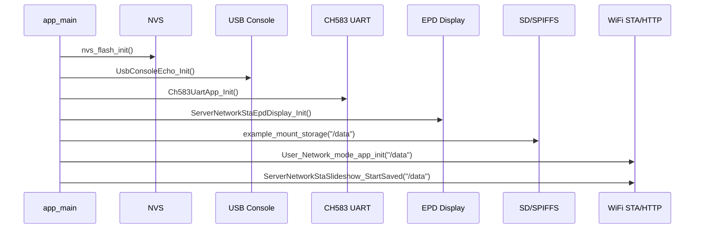


相关目录：

```text
main/
main/ch583_uart/
main/led_status/
main/epd_display/
main/server_network_sta/
main/usb_console_echo/
```

树状时序：

```text
main/main.c
└─ app_main()
   ├─ nvs_flash_init()
   ├─ app_auto_light_sleep_init()
   ├─ UsbConsoleEcho_Init()
   │  └─ usb_console_echo/usb_console_echo.c
   │     └─ UsbConsoleEcho_Task()
   ├─ ServerNetworkStaWifiWorkTime_Init()
   │  └─ server_network_sta/wifi_work_time/server_network_sta_wifi_work_time.c
   │     └─ work_state_task()
   ├─ Ch583UartApp_Init()
   │  └─ ch583_uart/ch583_uart_app.c
   │     ├─ User_UartEventTask()
   │     └─ User_UartReceiveTask()
   ├─ UserLedStatus_Init()
   │  └─ led_status/led_status.c
   │     └─ UserLedStatus_Task()
   ├─ Init_Bl()
   │  └─ ble/user_app.cpp
   │     └─ USER_BLE_ENABLE=0 时只打印 disabled
   ├─ ServerNetworkStaEpdDisplay_Init()
   │  └─ epd_display/epd_display_app.cpp
   │     └─ ServerNetworkStaEpdDisplay_Task()
   ├─ EpdType_LoadSavedOrDefault()
   │  └─ epd_display/epd_type.cpp
   ├─ example_mount_storage("/data")
   │  └─ mount.c
   ├─ User_Network_mode_app_init("/data")
   │  └─ server_network_sta/server_network_sta.c
   └─ ServerNetworkStaSlideshow_StartSaved("/data")
      └─ server_network_sta/slideshow/server_network_sta_slideshow.c
```

---


存 / 取信息（含条件限制）：

```text
存：
- nvs_flash_init() 初始化 NVS 子系统，不直接写业务数据。
- 后续模块在启动中可能写入默认值：工作时长、EPD 类型、CH583 BLE MAC、轮播配置等。

取：
- EpdType_LoadSavedOrDefault() 读取已保存屏幕类型。
- example_mount_storage("/data") 挂载并读取 SD/SPIFFS 状态。
- User_Network_mode_app_init("/data") 读取已保存 WiFi 配置。
- ServerNetworkStaSlideshow_StartSaved("/data") 读取已保存轮播配置。
```

[⬆ 返回目录](#toc) | [↩ 返回当前目录](#sec-01)

---

## 2. 配置与公共参数 <span id="sec-02"></span>

Mermaid 配置依赖图：

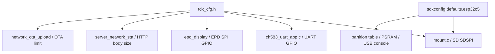


相关文件：

```text
main/tdx_cfg.h
sdkconfig.defaults
sdkconfig.defaults.esp32c5
partitions/v2/16m.csv
```

功能说明：

```text
tdx_cfg.h
├─ WiFi/HTTP/USB/OTA/body size 配置
├─ CH583 UART C5 引脚配置
├─ EPD C5 SPI/GPIO 配置
├─ SD SDSPI C5 引脚配置
├─ CH583 LED 控制配置
├─ mDNS 名称配置
└─ NVS key / slideshow / work time / EPD type 配置
```

关键配置方向：

```text
sdkconfig.defaults.esp32c5
└─ C5 build config
   ├─ 16MB Flash
   ├─ partitions/v2/16m.csv
   ├─ SDSPI: MOSI=1 MISO=25 CLK=6 CS=26
   ├─ Quad PSRAM
   ├─ USB Serial/JTAG console
   └─ CPU0 timer affinity

tdx_cfg.h
└─ C source include
   ├─ mount.c 读取 USER_SD_SPI_*
   ├─ display_bsp.cpp / epd_display_app.cpp 读取 USER_EPD_*
   ├─ ch583_uart_app.c 读取 USER_CH583_UART_*
   ├─ led_status.c 读取 USER_LED_CH583_*
   ├─ network_ota_upload.c 读取 SERVER_NETWORK_STA_OTA_*
   └─ server_network_sta.c 读取 USER_MDNS_*
```

---


存 / 取信息（含条件限制）：

```text
存：
- 本节是编译期配置，不直接执行运行时存储。

取：
- 各模块通过 include tdx_cfg.h 读取路径、NVS key、GPIO、body size、EPD type、WiFi 工作时长等宏。
- sdkconfig.defaults.esp32c5 / partitions/v2/16m.csv 在构建期被 IDF 读取。
```

[⬆ 返回目录](#toc) | [↩ 返回当前目录](#sec-02)

---

## 3. NVS 配置读写 <span id="sec-03"></span>

Mermaid 时序图：

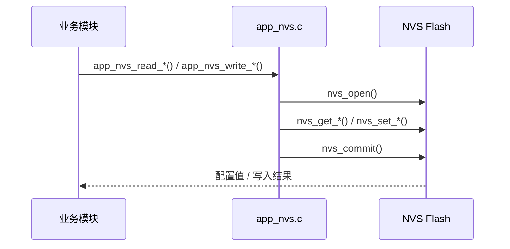


相关文件：

```text
main/app_nvs.c
main/app_nvs.h
```

树状时序：

```text
业务模块
├─ app_nvs_read_u8()
├─ app_nvs_write_u8()
├─ app_nvs_read_str()
└─ app_nvs_write_str()

调用来源
├─ epd_display/epd_type.cpp
│  ├─ EpdType_LoadSavedOrDefault()
│  └─ EpdType_SetAndSave()
├─ server_network_sta/wifi_work_time/server_network_sta_wifi_work_time.c
│  ├─ load_work_time_vars_from_app_nvs()
│  └─ save_work_time_vars_to_app_nvs()
├─ ch583_uart/ch583_wifi_uart_protocol.c
│  └─ ch583_wifi_handle_ble_mac()
└─ server_network_sta/slideshow/*
   └─ 保存 slideshow 状态和 last file
```

---


存 / 取信息（含条件限制）：

```text
存：
- app_nvs_write_u8(key, value)：写入 namespace="PhotoPainter" 的 u8。
  条件：key != NULL；nvs_open("PhotoPainter", NVS_READWRITE) 成功；nvs_set_u8() 成功后才 nvs_commit()。
- app_nvs_write_str(key, value)：写入 namespace="PhotoPainter" 的字符串。
  条件：key != NULL 且 value != NULL；nvs_open 成功；nvs_set_str() 成功后才 nvs_commit()。
- app_nvs_read_u8(key, out, default)：如果 key 不存在，会把 default 写入 NVS 并 commit。
  条件：key != NULL 且 out_value != NULL。

取：
- app_nvs_read_u8()：读取 u8；key 不存在时返回默认值并补写默认值。
- app_nvs_read_str()：读取字符串；条件为 key != NULL、value != NULL、value_size > 0。
- app_nvs_read_str() 使用 NVS_READONLY；打开失败或读取失败时，如 default_value 非 NULL，则把 default_value 拷到输出缓冲区。

主要调用：
- EPD 类型保存 / 读取。
- CH583 BLE MAC 保存 / 读取。
- WiFi 工作时间字符串兼容保存 / 读取。
```

[⬆ 返回目录](#toc) | [↩ 返回当前目录](#sec-03)

---

## 4. 存储挂载：SD / SPIFFS <span id="sec-04"></span>

Mermaid 流程图：

```mermaid
flowchart TD
    A[example_mount_storage /data] --> B{CONFIG_EXAMPLE_MOUNT_SD_CARD}
    B -- false --> C[mount_spiffs_storage]
    B -- true --> D{CONFIG_EXAMPLE_USE_SDMMC_HOST}
    D -- true --> E[esp_vfs_fat_sdmmc_mount]
    D -- false --> F[SDSPI_HOST_DEFAULT]
    F --> G[spi_bus_initialize]
    G --> H[esp_vfs_fat_sdspi_mount]
    C --> I[ensure_default_storage_dirs]
    H --> I
    I --> J[/data/bin_img + /data/jpg_img]
```


相关文件：

```text
main/mount.c
main/file_serving_example_common.h
```

树状时序：

```text
main/main.c
└─ app_main()
   └─ example_mount_storage("/data")
      └─ mount.c
         ├─ CONFIG_EXAMPLE_MOUNT_SD_CARD disabled
         │  └─ mount_spiffs_storage()
         └─ CONFIG_EXAMPLE_MOUNT_SD_CARD enabled
            ├─ CONFIG_EXAMPLE_USE_SDMMC_HOST
            │  └─ esp_vfs_fat_sdmmc_mount()
            └─ SDSPI path for C5
               ├─ SDSPI_HOST_DEFAULT()
               ├─ host.slot = USER_SD_SPI_HOST
               ├─ spi_bus_initialize()
               │  └─ ESP_ERR_INVALID_STATE 时复用 EPD 已初始化的 SPI bus
               ├─ esp_vfs_fat_sdspi_mount()
               ├─ ensure_default_storage_dirs()
               │  ├─ /data/bin_img
               │  └─ /data/jpg_img
               └─ example_print_storage_info()
```

辅助函数：

```text
mount.c
├─ ensure_storage_dir()
├─ ensure_default_storage_dirs()
├─ mount_spiffs_storage()
├─ example_storage_get_type()
├─ example_storage_is_sd_card()
├─ example_storage_supports_directories()
├─ example_storage_get_free_bytes()
└─ example_print_storage_info()
```

---


存 / 取信息（含条件限制）：

```text
存：
- SD 卡模式：挂载 /data 后创建默认目录：bin_img、jpg_img、cast_img 等。
- SPIFFS fallback：挂载 label="assets"，format_if_mount_failed=true。

取：
- example_storage_get_free_bytes() 读取 SD/FATFS 或 SPIFFS 剩余容量。
- example_print_storage_info() 读取挂载状态、容量、目录树、txt 文件内容。
- list_storage_tree() 扫描并打印 /data 下文件。
```

[⬆ 返回目录](#toc) | [↩ 返回当前目录](#sec-04)

---

## 5. WiFi STA 与 HTTP Server <span id="sec-05"></span>

Mermaid 时序图：

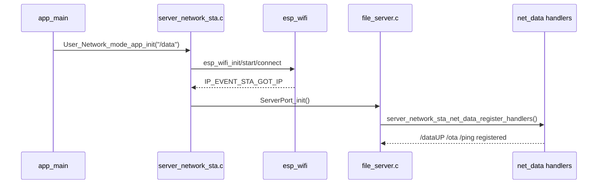


相关文件：

```text
main/server_network_sta/server_network_sta.c
main/server_network_sta/server_network_sta.h
main/file_server.c
```

WiFi 启动树状时序：

```text
main/main.c
└─ app_main()
   └─ User_Network_mode_app_init("/data")
      └─ server_network_sta/server_network_sta.c
         ├─ server_network_sta_read_saved_wifi()
         ├─ server_network_sta_init_once()
         │  ├─ esp_netif_init()
         │  ├─ esp_event_loop_create_default()
         │  ├─ esp_wifi_init()
         │  ├─ esp_event_handler_register(WIFI_EVENT)
         │  └─ esp_event_handler_register(IP_EVENT)
         ├─ server_network_sta_connect_once()
         │  ├─ esp_wifi_set_config()
         │  ├─ esp_wifi_start()
         │  ├─ esp_wifi_connect()
         │  └─ xEventGroupWaitBits()
         ├─ Mdns_init_config()
         │  ├─ mdns_init()
         │  ├─ mdns_hostname_set(USER_MDNS_HOSTNAME)
         │  └─ mdns_instance_name_set(USER_MDNS_INSTANCE_NAME)
         └─ ServerPort_init()
            └─ file_server.c
               └─ example_start_file_server("/data")
```

事件处理时序：

```text
ESP-IDF WiFi/IP event
└─ server_network_sta_event_handler()
   ├─ WIFI_EVENT_STA_DISCONNECTED
   │  ├─ server_network_sta_start_retry_timer()
   │  └─ esp_wifi_connect()
   └─ IP_EVENT_STA_GOT_IP
      ├─ server_network_sta_set_ps()
      ├─ xEventGroupSetBits(SERVER_NETWORK_STA_CONNECTED_BIT)
      └─ send_base_info_to_mobile()
         └─ ble/ble_data_handler.cpp
            └─ ch583_wifi_uart_send_wifi_data()
```

HTTP server 注册时序：

```text
file_server.c
└─ example_start_file_server()
   ├─ httpd_start()
   ├─ register GET /
   │  └─ index_html_get_handler()
   ├─ register static file GET
   │  └─ download_get_handler()
   ├─ register legacy upload/delete
   │  ├─ upload_post_handler()
   │  └─ delete_post_handler()
   └─ server_network_sta_net_data_register_handlers()
      └─ server_network_sta/net_data/server_network_sta_data.c
         ├─ register POST /dataUP
         ├─ register POST /ota
         ├─ register POST /ota_upload
         └─ register GET /ping
```

---


### V2 协议资料拆分：ping 连通性检查

请求：

```http
GET /ping HTTP/1.1
```

成功返回示例：

```json
{
  "func": "ping_result",
  "result": 0,
  "message": "ok",
  "Ble_MAC": "AABBCCDDEEFF"
}
```

说明：前端写操作前会优先访问缓存端点的 `/ping`。如果响应包含 `Ble_MAC` 或 `ble_mac`，需要与目标设备 MAC 一致，避免缓存 IP 指向错误设备。


存 / 取信息（含条件限制）：

```text
存：
- 本模块连接 WiFi 和启动 HTTP Server，不直接保存 WiFi 配置。

取：
- server_network_sta_read_saved_wifi() 优先读取 namespace="wifi" 的 ssid/password。
- 读取失败后读取 namespace="nvs.net80211" 的 sta.ssid / sta.pswd blob。
- IP_EVENT_STA_GOT_IP 后读取当前 IP、AP 信息，并启动 HTTP/mDNS。
```

[⬆ 返回目录](#toc) | [↩ 返回当前目录](#sec-05)

---

## 6. 网络 HTTP 数据入口汇总 <span id="sec-06"></span>

Mermaid 总入口图：

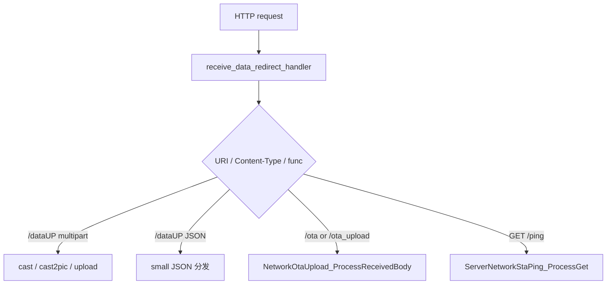


相关目录：

```text
main/server_network_sta/net_data/
main/server_network_sta/cast/
main/server_network_sta/cast2pic/
main/server_network_sta/upload/
main/server_network_sta/ota/
main/server_network_sta/delete/
main/server_network_sta/saved_images/
main/server_network_sta/snapshot/
main/server_network_sta/slideshow/
main/server_network_sta/slideshow_control/
main/server_network_sta/wifi_work_time/
main/server_network_sta/ping/
```

入口总览：

```text
HTTP POST /dataUP or /ota or /ota_upload
└─ server_network_sta/net_data/server_network_sta_data.c
   └─ receive_data_redirect_handler()
      ├─ get_request_header_value()
      ├─ ServerNetworkStaWifiWorkTime_OnNetworkData()
      ├─ NetworkOtaUpload_IsOtaRequest()
      ├─ alloc_request_body_buffer()
      ├─ read_request_body_to_buffer()
      ├─ OTA request
      │  └─ NetworkOtaUpload_ProcessReceivedBody()
      ├─ small JSON request
      │  └─ process_small_json_request()
      └─ multipart request
         ├─ ServerNetworkStaCast2Pic_Process()
         ├─ ServerNetworkStaCast_Process()
         ├─ ServerNetworkStaUpload_Process()
         └─ process_multipart_upload_request()
```

存 / 取信息（含条件限制）：

```text
存：
- net_data 入口本身只在 RAM 中申请 request body 缓冲区。
- 真正持久化由下游模块完成：cast/upload/cast2pic 写 SD，ota 写 OTA 分区，slideshow 写配置文件，wifi_work_time 写 NVS。

取：
- 从 HTTP request 读取 header、body、multipart boundary、JSON func。
- 根据 URI、Content-Type、func 分发到对应模块。
```


### 6.1 网络 HTTP 数据入口：dataUP <span id="sec-06-1"></span>

Mermaid 时序图：

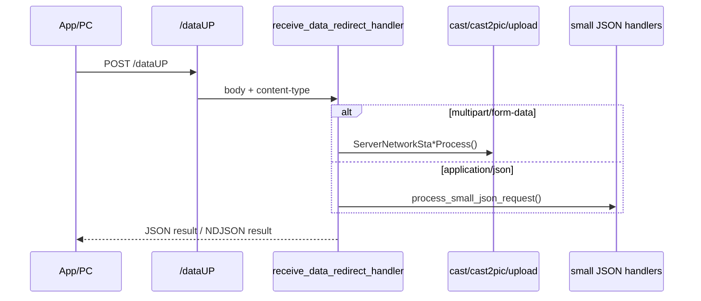


```text
HTTP POST /dataUP
└─ server_network_sta/net_data/server_network_sta_data.c
   └─ receive_data_redirect_handler()
      ├─ get_request_header_value()
      ├─ ServerNetworkStaWifiWorkTime_OnNetworkData()
      ├─ alloc_request_body_buffer()
      ├─ read_request_body_to_buffer()
      ├─ small JSON request
      │  └─ process_small_json_request()
      └─ multipart request
         ├─ ServerNetworkStaCast2Pic_Process()
         ├─ ServerNetworkStaCast_Process()
         ├─ ServerNetworkStaUpload_Process()
         └─ process_multipart_upload_request()
```


### V2 协议资料拆分：HTTP 图片与控制接口总览

`V2_相框传图协议.html` 中 HTTP 部分统一说明：图片类接口使用 `POST /dataUP` + `multipart/form-data`，JSON 控制类接口使用 `POST /dataUP` + JSON，连通性检查使用 `GET /ping`。

| func / path | 分类 | 放入本文档章节 | 请求格式 |
|---|---|---|---|
| `cast` | multipart 图片接口 | [7.1 cast：投屏业务模块](#sec-07-1) | `POST /dataUP` + multipart |
| `upload` | multipart 图片接口 | [7.11 upload：文件上传 HTTP 接口](#sec-07-11) | `POST /dataUP` + multipart |
| `cast2pic` | multipart 图片接口 | [7.2 cast2pic：投屏转图片缓存 / 显示](#sec-07-2) | `POST /dataUP` + multipart |
| `update` | multipart 图片接口，前端预留 | 本节保留说明 | `POST /dataUP` + multipart |
| `get_saved_images` | JSON 控制接口 | [7.7 saved_images：本地图片存储管理](#sec-07-7) | `POST /dataUP` + JSON |
| `get_snapshot` | JSON 控制接口 | [7.10 snapshot：画面快照功能](#sec-07-10) | `POST /dataUP` + JSON |
| `start_slideshow` | JSON 控制接口 | [7.8 slideshow：电子屏轮播核心逻辑](#sec-07-8) | `POST /dataUP` + JSON |
| `set_slideshow` | JSON 控制接口 | [7.9 slideshow_control：轮播控制模块](#sec-07-9) | `POST /dataUP` + JSON |
| `delete` | JSON 控制接口 | [7.3 delete：图片 / 缓存文件删除逻辑](#sec-07-3) | `POST /dataUP` + JSON |
| `set_wifi_work_time` | JSON 控制接口 | [7.12 wifi_work_time：WiFi 省电管理](#sec-07-12) | `POST /dataUP` + JSON |
| `/ping` | HTTP GET | [5. WiFi STA 与 HTTP Server](#sec-05) | `GET /ping` |

`update` 在 V2 协议中是“替换旧图片，当前前端预留”：字段包括 `oldfileNames`、`newfileNames`、`bin_size`、`image_size`、`save`、`show`、`bin`、`image`。当前 `main/CMakeLists.txt` 已列出 `cast`、`cast2pic`、`upload` 等网络模块，但没有单独列出 `server_network_sta/update` 源文件，因此本文只记录为 V2 预留接口，不写成当前已实现链路。


存 / 取信息（含条件限制）：

```text
存：
- /dataUP 入口不直接持久化；按 func 转交下游模块。

取：
- 读取 HTTP body 到内存缓冲区。
- multipart 请求读取 boundary 和各 part。
- JSON 请求读取 func 后转入 small JSON 分发。
```

[⬆ 返回目录](#toc) | [↩ 返回当前目录](#sec-06)

### 6.2 网络 HTTP 数据入口：ota <span id="sec-06-2"></span>

Mermaid 时序图：

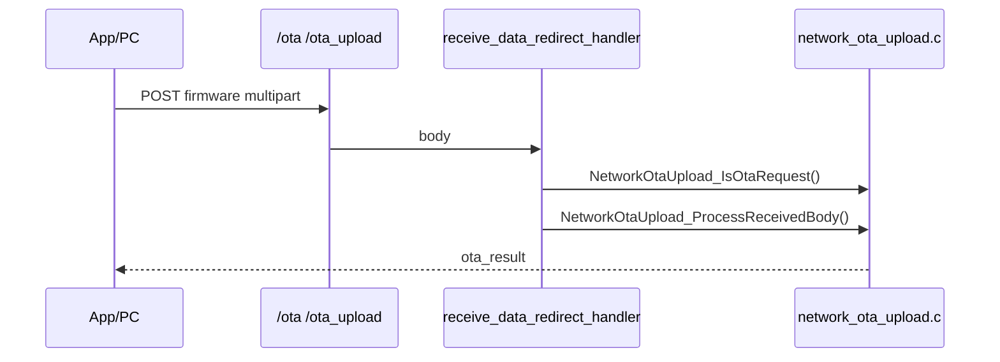


```text
HTTP POST /ota or /ota_upload
└─ server_network_sta/net_data/server_network_sta_data.c
   └─ receive_data_redirect_handler()
      ├─ get_request_header_value()
      ├─ ServerNetworkStaWifiWorkTime_OnNetworkData()
      ├─ NetworkOtaUpload_IsOtaRequest()
      ├─ NetworkOtaUpload_GetMaxBodySize()
      ├─ alloc_request_body_buffer()
      ├─ read_request_body_to_buffer()
      └─ NetworkOtaUpload_ProcessReceivedBody()
```


存 / 取信息（含条件限制）：

```text
存：
- OTA 请求最终由 network_ota_upload 写入 OTA update partition，并设置 boot partition。

取：
- 读取 multipart meta 与 firmware/bin 字段。
- 读取当前 running partition、固件 app_desc、目标 OTA partition 信息。
```

[⬆ 返回目录](#toc) | [↩ 返回当前目录](#sec-06)

### 6.3 网络 HTTP 数据入口：small JSON <span id="sec-06-3"></span>

Mermaid 分发图：

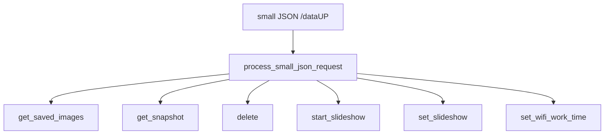


small JSON 分发：

```text
process_small_json_request()
├─ ServerNetworkStaSavedImages_ProcessJson()
├─ ServerNetworkStaSnapshot_ProcessJson()
├─ ServerNetworkStaDelete_ProcessJson()
├─ ServerNetworkStaSlideshow_ProcessJson()
├─ ServerNetworkStaSlideshowControl_ProcessJson()
└─ ServerNetworkStaWifiWorkTime_ProcessJson()
```

GET /ping：

```text
HTTP GET /ping
└─ ServerNetworkStaPing_ProcessGet()
   ├─ ServerNetworkStaWifiWorkTime_OnNetworkData()
   ├─ get_ble_mac_no_colon()
   └─ httpd_resp_sendstr()
```

---


存 / 取信息（含条件限制）：

```text
存：
- small JSON 入口不直接存储。
- set_slideshow / start_slideshow / set_wifi_work_time 等由对应模块保存到文件或 NVS。

取：
- 读取 JSON func 字段。
- 根据 func 调用 saved_images、snapshot、delete、slideshow、slideshow_control、wifi_work_time。
```

[⬆ 返回目录](#toc) | [↩ 返回当前目录](#sec-06)

---

## 7. 网络HTTP功能汇总 <span id="sec-07"></span>

本章把原来的 `cast`、`cast2pic`、`upload`、`ota`、`delete`、`saved_images`、`slideshow`、`slideshow_control`、`snapshot`、`ping`、`wifi_work_time` 等网络 HTTP 功能重新归到一个二级目录下。  
入口主要来自 `POST /dataUP`、`POST /ota`、`POST /ota_upload` 和 `GET /ping`。

Mermaid 总体分发图：

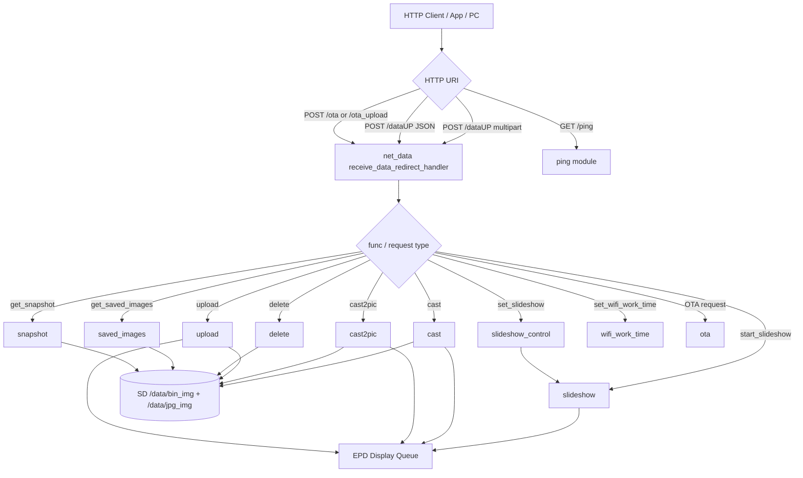

相关目录：

```text
main/server_network_sta/net_data/
main/server_network_sta/cast/
main/server_network_sta/cast2pic/
main/server_network_sta/delete/
main/server_network_sta/ota/
main/server_network_sta/ping/
main/server_network_sta/saved_images/
main/server_network_sta/slideshow/
main/server_network_sta/slideshow_control/
main/server_network_sta/snapshot/
main/server_network_sta/upload/
main/server_network_sta/wifi_work_time/
```

树状时序总览：

```text
HTTP request
├─ GET /ping
│  └─ ServerNetworkStaPing_ProcessGet()
└─ POST /dataUP / /ota / /ota_upload
   └─ receive_data_redirect_handler()
      ├─ NetworkOtaUpload_IsOtaRequest()
      │  └─ NetworkOtaUpload_ProcessReceivedBody()
      ├─ multipart func=cast
      │  └─ ServerNetworkStaCast_Process()
      ├─ multipart func=cast2pic
      │  └─ ServerNetworkStaCast2Pic_Process()
      ├─ multipart func=upload
      │  └─ ServerNetworkStaUpload_Process()
      └─ small JSON func
         ├─ ServerNetworkStaSavedImages_ProcessJson()
         ├─ ServerNetworkStaSnapshot_ProcessJson()
         ├─ ServerNetworkStaDelete_ProcessJson()
         ├─ ServerNetworkStaSlideshow_ProcessJson()
         ├─ ServerNetworkStaSlideshowControl_ProcessJson()
         └─ ServerNetworkStaWifiWorkTime_ProcessJson()
```

关键辅助函数：

```text
receive_data_redirect_handler()
├─ get_request_header_value()
├─ ServerNetworkStaWifiWorkTime_OnNetworkData()
├─ NetworkOtaUpload_IsOtaRequest()
├─ alloc_request_body_buffer()
├─ read_request_body_to_buffer()
├─ process_small_json_request()
└─ server_network_sta_net_data_register_handlers()
```

V2 协议资料拆分：

```text
V2 协议中，HTTP 图片与控制协议主要使用：
├─ POST /dataUP + multipart/form-data
│  ├─ cast
│  ├─ upload
│  ├─ cast2pic
│  └─ update（前端预留）
├─ POST /dataUP + JSON
│  ├─ get_saved_images
│  ├─ get_snapshot
│  ├─ start_slideshow
│  ├─ set_slideshow
│  ├─ delete
│  └─ set_wifi_work_time
└─ GET /ping
   └─ ping_result
```

---

存 / 取信息（含条件限制）：

```text
存：
- 图片类：/data/bin_img/*.bin，/data/jpg_img/*.jpg。
- 状态类：last cast 记录、slideshow_config、show_control / slideshow control 文件。
- OTA 类：OTA update partition。
- WiFi 工作时间：NVS blob + PhotoPainter 字符串 key。

取：
- 图片列表从 /data/jpg_img 扫描。
- snapshot 读取图片列表和轮播配置。
- ping 读取 CH583 BLE MAC。
- slideshow 启动时读取保存的轮播配置。
```


### 7.1 cast：投屏业务模块 <span id="sec-07-1"></span>

功能说明：接收设备投屏数据流，校验主图和缩略图字段，保存到 SD 卡，并在 `show=true` 时下发到电子墨水屏显示。

Mermaid 时序图：

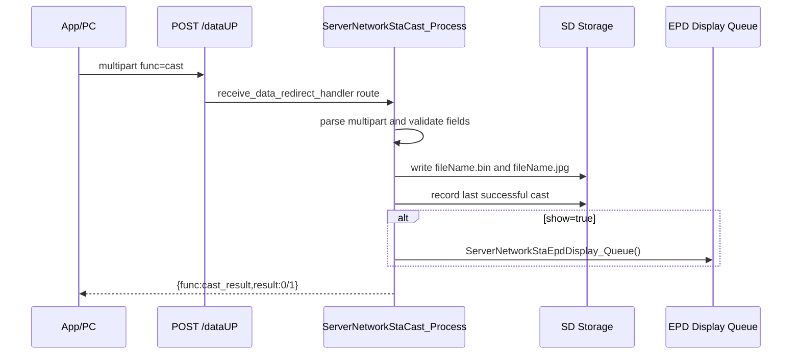

相关文件：

```text
main/server_network_sta/cast/server_network_sta_cast.c
main/server_network_sta/cast/server_network_sta_cast.h
```

树状时序：

```text
HTTP multipart /dataUP
└─ receive_data_redirect_handler()
   └─ ServerNetworkStaCast_Process()
      ├─ extract_boundary()
      ├─ extract_multipart_parts()
      ├─ parse_cast_meta()
      ├─ validate_cast_meta()
      ├─ stop_slideshow_for_cast()
      │  └─ ServerNetworkStaSlideshow_Stop()
      ├─ check_cast_save_space()
      │  └─ example_storage_get_free_bytes()
      ├─ ensure_dir("/data/bin_img")
      ├─ ensure_dir("/data/jpg_img")
      ├─ write_file_exact(.bin)
      ├─ write_file_exact(.jpg)
      ├─ record_last_success_cast()
      ├─ show=true
      │  └─ ServerNetworkStaEpdDisplay_Queue()
      └─ send_cast_final_chunk()
```

关键辅助函数：

```text
server_network_sta_cast.c
├─ parse_size_field()
├─ send_cast_result()
├─ send_cast_chunk()
├─ check_cast_save_space()
├─ record_last_success_cast()
├─ stop_slideshow_for_cast()
└─ ServerNetworkStaCast_Process()
```

V2 协议资料拆分：

```http
POST /dataUP HTTP/1.1
Content-Type: multipart/form-data

func=cast
fileName=26422
bin_size=123456
image_size=23456
save=true
show=true
bin=@26422.bin
image=@26422.jpg
```

字段说明：

```text
func       固定为 cast
fileName   图片主文件名，不带扩展名
bin_size   bin 主图数据大小
image_size jpg 缩略图大小
save       是否保存
show       是否立即显示
bin        主图 bin 文件
image      缩略图 jpg 文件
```

成功返回：

```json
{
  "func": "cast_result",
  "result": 0
}
```

V2 说明：`cast` 成功后应记录最后一次投图，设备重启或 OTA 后优先显示该图片。


存 / 取信息（含条件限制）：

```text
存：
- save_cast_files() 写入：/data/bin_img/<fileName>.bin。
- save_cast_files() 写入：/data/jpg_img/<fileName>.jpg。
- save_one_cast_file() 使用 <fileName>.tmp 临时文件，写完校验大小后 rename 成正式文件。
- record_last_success_cast() 写入 last cast 记录文件，路径在 /data/bin_img/ 下。

取：
- check_cast_save_space() 通过 example_storage_get_free_bytes() 读取剩余空间。
- 显示时下发已收到的 bin 数据到 EPD 队列；重启恢复时可读取 last cast 记录。
```

[⬆ 返回目录](#toc) | [↩ 返回当前目录](#sec-07)

---

### 7.2 cast2pic：投屏转图片缓存 / 显示 <span id="sec-07-2"></span>

功能说明：用于双屏或分屏场景，一次请求上传两张完整图片，按 `screen=a/b/ab` 控制刷新范围。

Mermaid 时序图：

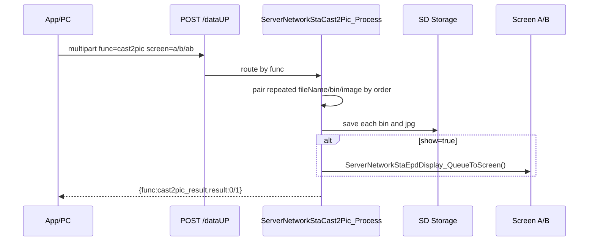

相关文件：

```text
main/server_network_sta/cast2pic/server_network_sta_cast2pic.c
main/server_network_sta/cast2pic/server_network_sta_cast2pic.h
```

树状时序：

```text
HTTP multipart /dataUP
└─ receive_data_redirect_handler()
   └─ ServerNetworkStaCast2Pic_Process()
      ├─ extract_boundary()
      ├─ extract_multipart_parts()
      ├─ assign_text_part()
      ├─ assign_image_part()
      ├─ validate_cast2pic_meta()
      ├─ screen_to_epd_number()
      ├─ check_save_space()
      ├─ ensure_dir("/data/bin_img")
      ├─ ensure_dir("/data/jpg_img")
      ├─ write_file_exact(.bin)
      ├─ write_file_exact(.jpg)
      ├─ show=true
      │  └─ queue_cast2pic_display()
      │     └─ ServerNetworkStaEpdDisplay_QueueToScreen()
      └─ send_cast2pic_result()
```

关键辅助函数：

```text
server_network_sta_cast2pic.c
├─ assign_text_part()
├─ assign_image_part()
├─ validate_cast2pic_meta()
├─ screen_to_epd_number()
├─ queue_cast2pic_display()
└─ ServerNetworkStaCast2Pic_Process()
```

V2 协议资料拆分：

```http
POST /dataUP HTTP/1.1
Content-Type: multipart/form-data

func=cast2pic
screen=ab
save=true
show=true
fileName=26422
bin_size=123456
image_size=23456
bin=@26422.bin
image=@26422.jpg
fileName=26423
bin_size=123000
image_size=23000
bin=@26423.bin
image=@26423.jpg
```

字段说明：

```text
func     固定为 cast2pic
screen   ab 更新 A+B；a 只更新 A；b 只更新 B；缺省按 ab
save     是否保存
show     是否立即显示
其余字段按出现顺序组成两组 fileName/bin/image
```

成功返回：

```json
{
  "func": "cast2pic_result",
  "result": 0
}
```


存 / 取信息（含条件限制）：

```text
存：
- 保存每组 fileName 对应的 .bin 和 .jpg 到 /data/bin_img 与 /data/jpg_img。
- 使用临时文件写入再 rename，避免半文件覆盖正式文件。

取：
- 读取 multipart 中重复出现的 fileName/bin_size/image_size/bin/image。
- 根据 screen=a/b/ab 转成 EPD screen number 后投递显示队列。
- 写入前读取剩余空间做容量检查。
```

[⬆ 返回目录](#toc) | [↩ 返回当前目录](#sec-07)

---

### 7.3 delete：图片 / 缓存文件删除逻辑 <span id="sec-07-3"></span>

功能说明：删除 SD 卡内保存的图片、缩略图，并清理 last cast / slideshow 中引用到的已删除文件。

Mermaid 时序图：

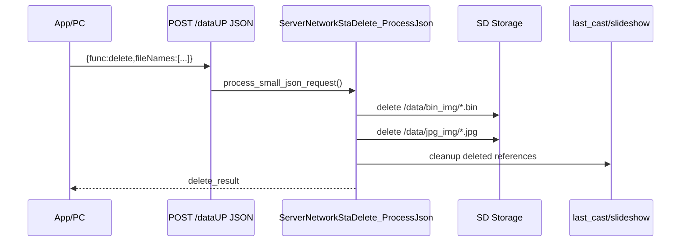

相关文件：

```text
main/server_network_sta/delete/server_network_sta_delete.c
main/server_network_sta/delete/server_network_sta_delete.h
```

树状时序：

```text
HTTP small JSON delete
└─ receive_data_redirect_handler()
   └─ process_small_json_request()
      └─ ServerNetworkStaDelete_ProcessJson()
         ├─ parse_file_names()
         ├─ delete_one_path(/data/bin_img/*.bin)
         ├─ delete_one_path(/data/jpg_img/*.jpg)
         ├─ cleanup_last_cast_if_deleted()
         ├─ cleanup_slideshow_if_deleted()
         └─ send_delete_result()
```

关键辅助函数：

```text
server_network_sta_delete.c
├─ parse_file_names()
├─ delete_one_path()
├─ cleanup_last_cast_if_deleted()
├─ cleanup_slideshow_if_deleted()
└─ ServerNetworkStaDelete_ProcessJson()
```

V2 协议资料拆分：

```json
{
  "func": "delete",
  "fileNames": ["26422", "26423"]
}
```

字段说明：

```text
func       固定为 delete
fileNames  要删除的图片文件名数组，不带扩展名
```


存 / 取信息（含条件限制）：

```text
存：
- 删除动作会修改持久化文件系统：unlink /data/bin_img/<file>.bin 与 /data/jpg_img/<file>.jpg。
- 如果删除文件被 last_cast 或 slideshow 引用，会同步清理相关状态文件。

取：
- 读取 JSON fileNames 数组。
- 读取 last_cast / slideshow 配置，判断是否引用被删除文件。
```

[⬆ 返回目录](#toc) | [↩ 返回当前目录](#sec-07)

---

### 7.4 net_data：通用网络数据封装 <span id="sec-07-4"></span>

功能说明：统一管理网络 HTTP 数据入口、body 分配、multipart/JSON/OTA 分流，以及 `/dataUP`、`/ota`、`/ota_upload`、`/ping` 的注册。

Mermaid 时序图：

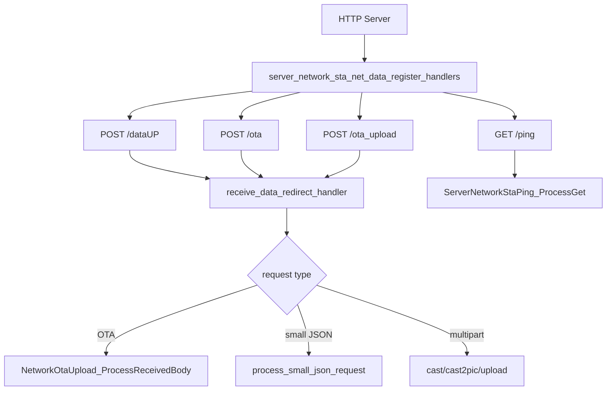

相关文件：

```text
main/server_network_sta/net_data/server_network_sta_data.c
main/server_network_sta/net_data/server_network_sta_data.h
```

树状时序：

```text
file_server.c
└─ example_start_file_server()
   └─ server_network_sta_net_data_register_handlers()
      ├─ register POST /dataUP
      ├─ register POST /ota
      ├─ register POST /ota_upload
      └─ register GET /ping

POST request
└─ receive_data_redirect_handler()
   ├─ ServerNetworkStaWifiWorkTime_OnNetworkData()
   ├─ NetworkOtaUpload_IsOtaRequest()
   ├─ alloc_request_body_buffer()
   ├─ read_request_body_to_buffer()
   ├─ NetworkOtaUpload_ProcessReceivedBody()
   ├─ process_small_json_request()
   ├─ ServerNetworkStaCast2Pic_Process()
   ├─ ServerNetworkStaCast_Process()
   └─ ServerNetworkStaUpload_Process()
```

关键辅助函数：

```text
server_network_sta_data.c
├─ log_heap_watermark()
├─ alloc_request_body_buffer()
├─ read_request_body_to_buffer()
├─ process_small_json_request()
├─ receive_data_redirect_handler()
└─ server_network_sta_net_data_register_handlers()
```

V2 协议资料拆分：

```text
V2 HTTP 入口：
├─ POST /dataUP + multipart/form-data
│  ├─ cast
│  ├─ upload
│  ├─ cast2pic
│  └─ update（前端预留）
├─ POST /dataUP + JSON
│  ├─ get_saved_images
│  ├─ get_snapshot
│  ├─ start_slideshow
│  ├─ set_slideshow
│  ├─ delete
│  └─ set_wifi_work_time
└─ GET /ping
```


存 / 取信息（含条件限制）：

```text
存：
- net_data 不直接写持久化数据。
- 根据请求类型转交 cast/upload/ota/slideshow/wifi_work_time 等模块执行实际存储。

取：
- 读取 request header、body、Content-Type、URI、multipart boundary。
- 读取 body_len 并在 RAM 中做临时缓存。
```

[⬆ 返回目录](#toc) | [↩ 返回当前目录](#sec-07)

---

### 7.5 ota：设备在线升级模块 <span id="sec-07-5"></span>

功能说明：通过网络上传固件，校验固件头、版本、分区大小，写入 OTA 分区并切换启动分区。

Mermaid 时序图：

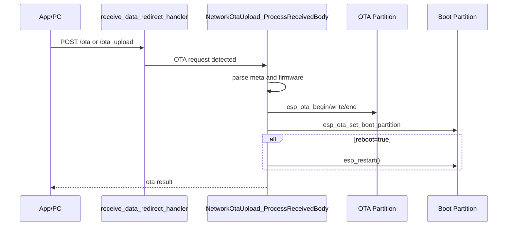

相关文件：

```text
main/server_network_sta/ota/network_ota_upload.c
main/server_network_sta/ota/network_ota_upload.h
```

树状时序：

```text
receive_data_redirect_handler()
├─ NetworkOtaUpload_IsOtaRequest()
├─ NetworkOtaUpload_GetMaxBodySize()
└─ NetworkOtaUpload_ProcessReceivedBody()
   ├─ ota_stream_begin()
   ├─ extract_boundary()
   ├─ extract_multipart_field("meta")
   ├─ parse_meta_json()
   ├─ extract_multipart_field("firmware" or "bin")
   ├─ PowerMode_SetOtaInProgress(true)
   ├─ write_firmware_to_ota_partition()
   │  ├─ validate image header magic
   │  ├─ get_firmware_app_desc()
   │  ├─ esp_ota_get_next_update_partition()
   │  ├─ esp_ota_begin()
   │  ├─ esp_ota_write()
   │  ├─ esp_ota_end()
   │  └─ esp_ota_set_boot_partition()
   └─ reboot=true
      └─ esp_restart()
```

关键辅助函数：

```text
network_ota_upload.c
├─ NetworkOtaUpload_IsOtaRequest()
├─ NetworkOtaUpload_GetMaxBodySize()
├─ NetworkOtaUpload_ProcessReceivedBody()
├─ NetworkOtaUpload_MarkCurrentAppValidIfPending()
└─ write_firmware_to_ota_partition()
```

V2 协议资料拆分：

```text
V2_相框传图协议.html 中没有定义网络 OTA 请求字段。
当前 OTA 以仓库源码 /ota、/ota_upload 处理逻辑为准，和 V2 图片/控制协议分开。
```


存 / 取信息（含条件限制）：

```text
存：
- esp_ota_write() 写入 OTA update partition。
- esp_ota_set_boot_partition() 保存下次启动分区选择。
- OTA 期间会设置 WiFi 工作时间模块的 OTA busy 状态，避免超时 POWER_OFF。

取：
- 读取 multipart meta JSON、firmware/bin 字段。
- 读取当前 running partition、目标 update partition、固件 app_desc、版本信息。
```

[⬆ 返回目录](#toc) | [↩ 返回当前目录](#sec-07)

---

### 7.6 ping：网络连通检测 <span id="sec-07-6"></span>

功能说明：用于 App/PC 判断设备 HTTP 服务是否可用，并通过 `Ble_MAC` 防止缓存 IP 指向错误设备。

Mermaid 时序图：

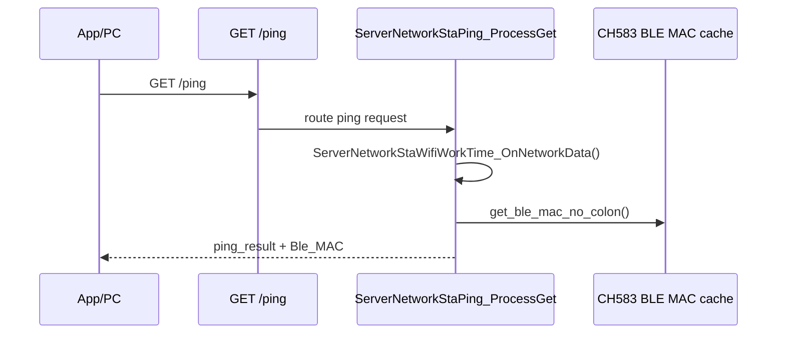

相关文件：

```text
main/server_network_sta/ping/server_network_sta_ping.c
main/server_network_sta/ping/server_network_sta_ping.h
```

树状时序：

```text
HTTP GET /ping
└─ ServerNetworkStaPing_ProcessGet()
   ├─ ServerNetworkStaWifiWorkTime_OnNetworkData()
   ├─ get_ble_mac_no_colon()
   └─ httpd_resp_sendstr()
```

关键辅助函数：

```text
server_network_sta_ping.c
└─ ServerNetworkStaPing_ProcessGet()
```

V2 协议资料拆分：

```http
GET /ping HTTP/1.1
```

返回：

```json
{
  "func": "ping_result",
  "result": 0,
  "message": "ok",
  "Ble_MAC": "AABBCCDDEEFF"
}
```

V2 说明：前端写操作前会优先访问缓存端点的 `/ping`；如果响应包含 `Ble_MAC` 或 `ble_mac`，必须与目标设备 MAC 一致。


存 / 取信息（含条件限制）：

```text
存：
- ping 不写入持久化数据。
- 只会调用 ServerNetworkStaWifiWorkTime_OnNetworkData() 重置 RAM 中的 working_time 计时。

取：
- 读取 CH583 BLE MAC 字符串，用于返回 Ble_MAC。
- BLE MAC 来源可能是 CH583 模块上报后保存在 PhotoPainter NVS 的值。
```

[⬆ 返回目录](#toc) | [↩ 返回当前目录](#sec-07)

---

### 7.7 saved_images：本地图片存储管理 <span id="sec-07-7"></span>

功能说明：扫描本地已保存缩略图，返回前端可展示的图片列表和缩略图地址。

Mermaid 时序图：

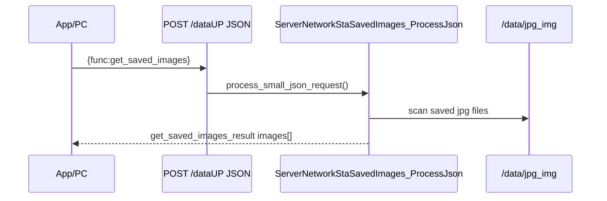

相关文件：

```text
main/server_network_sta/saved_images/server_network_sta_saved_images.c
main/server_network_sta/saved_images/server_network_sta_saved_images.h
```

树状时序：

```text
HTTP small JSON get_saved_images
└─ receive_data_redirect_handler()
   └─ process_small_json_request()
      └─ ServerNetworkStaSavedImages_ProcessJson()
         ├─ scan /data/jpg_img
         ├─ saved_image_name_is_safe()
         └─ httpd_resp_sendstr(json)
```

关键辅助函数：

```text
server_network_sta_saved_images.c
├─ saved_image_name_is_safe()
└─ ServerNetworkStaSavedImages_ProcessJson()
```

V2 协议资料拆分：

```json
{
  "func": "get_saved_images"
}
```

返回：

```json
{
  "func": "get_saved_images_result",
  "result": 0,
  "images": [
    {
      "fileName": "26422",
      "thumbnailUrl": "/thumb/26422.jpg"
    }
  ]
}
```

V2 说明：前端会用设备 `baseUrl` 拼接相对缩略图地址。


存 / 取信息（含条件限制）：

```text
存：
- get_saved_images 不写文件。

取：
- 扫描 /data/jpg_img 目录下的 .jpg 文件。
- 生成 fileName 与 thumbnailUrl。
- /thumb/<name>.jpg 请求会 fopen 对应 jpg 并 fread 分块返回。
```

[⬆ 返回目录](#toc) | [↩ 返回当前目录](#sec-07)

---

### 7.8 slideshow：电子屏轮播核心逻辑 <span id="sec-07-8"></span>

功能说明：保存轮播图片列表、轮播间隔、随机开关，并在后台任务中按配置切换图片刷新 EPD。

Mermaid 时序图：

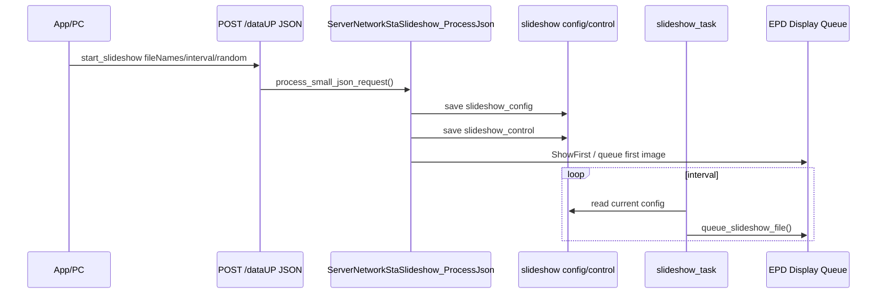

相关文件：

```text
main/server_network_sta/slideshow/server_network_sta_slideshow.c
main/server_network_sta/slideshow/server_network_sta_slideshow.h
```

树状时序：

```text
HTTP small JSON start_slideshow
└─ receive_data_redirect_handler()
   └─ process_small_json_request()
      └─ ServerNetworkStaSlideshow_ProcessJson()
         ├─ parse_start_slideshow_request()
         ├─ check_slideshow_files_exist()
         ├─ save_slideshow_config()
         ├─ save_slideshow_control()
         └─ ServerNetworkStaSlideshow_ShowFirst()
            └─ queue_slideshow_file()
               └─ ServerNetworkStaEpdDisplay_Queue()

main/main.c
└─ ServerNetworkStaSlideshow_StartSaved("/data")
   ├─ read_slideshow_config_file()
   ├─ read_slideshow_control_on()
   └─ xTaskCreate(slideshow_task)
```

关键辅助函数：

```text
server_network_sta_slideshow.c
├─ parse_start_slideshow_request()
├─ check_slideshow_files_exist()
├─ save_slideshow_config()
├─ save_slideshow_control()
├─ ServerNetworkStaSlideshow_ShowFirst()
├─ ServerNetworkStaSlideshow_StartSaved()
├─ ServerNetworkStaSlideshow_Stop()
└─ slideshow_task()
```

V2 协议资料拆分：

```json
{
  "func": "start_slideshow",
  "fileNames": ["26422", "26423"],
  "interval": 60,
  "random": false
}
```

字段说明：

```text
fileNames 图片轮播顺序；random=true 时随机轮播
interval  前端会归一为大于等于 1 的整数
```


存 / 取信息（含条件限制）：

```text
存：
- save_slideshow_config() 保存轮播列表、interval、random 等配置文件。
- save_slideshow_control() 保存轮播开关/控制状态。
- 轮播任务会保存下一张文件名或当前状态，用于下次继续。

取：
- ServerNetworkStaSlideshow_StartSaved() 启动时读取 slideshow_config 与 control 文件。
- slideshow_task() 按配置读取 fileName 对应的 /data/bin_img/*.bin 并投递 EPD 显示。
```

[⬆ 返回目录](#toc) | [↩ 返回当前目录](#sec-07)

---

### 7.9 slideshow_control：轮播控制模块 <span id="sec-07-9"></span>

功能说明：单独控制轮播开启/关闭、轮播周期和随机模式。

Mermaid 时序图：

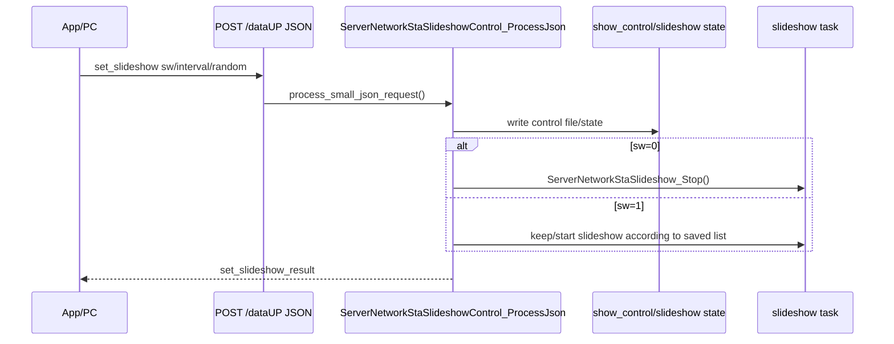

相关文件：

```text
main/server_network_sta/slideshow_control/server_network_sta_slideshow_control.c
main/server_network_sta/slideshow_control/server_network_sta_slideshow_control.h
```

树状时序：

```text
HTTP small JSON set_slideshow
└─ receive_data_redirect_handler()
   └─ process_small_json_request()
      └─ ServerNetworkStaSlideshowControl_ProcessJson()
         ├─ parse_json_bool_optional("random")
         ├─ parse_json_u32("interval")
         ├─ parse sw/on field
         ├─ write_control_file()
         └─ sw=0
            └─ ServerNetworkStaSlideshow_Stop()
```

关键辅助函数：

```text
server_network_sta_slideshow_control.c
├─ parse_json_bool_optional()
├─ parse_json_u32()
├─ write_control_file()
└─ ServerNetworkStaSlideshowControl_ProcessJson()
```

V2 协议资料拆分：

```json
{
  "func": "set_slideshow",
  "sw": 1,
  "interval": 60,
  "random": false
}
```

字段说明：

```text
sw=1 开启轮播
sw=0 关闭轮播
interval 轮播间隔
random=true 随机轮播
random=false 按列表顺序轮播
```


存 / 取信息（含条件限制）：

```text
存：
- set_slideshow 写入轮播控制文件，保存 sw / interval / random。
- 关闭轮播时更新控制状态并停止轮播任务。

取：
- 读取 JSON 中 sw、interval、random。
- 读取当前轮播状态，用于决定启动、停止或更新 interval。
```

[⬆ 返回目录](#toc) | [↩ 返回当前目录](#sec-07)

---

### 7.10 snapshot：画面快照功能 <span id="sec-07-10"></span>

功能说明：一次返回设备已保存图片列表和当前轮播状态，便于 App 进入页面时恢复设备状态。

Mermaid 时序图：

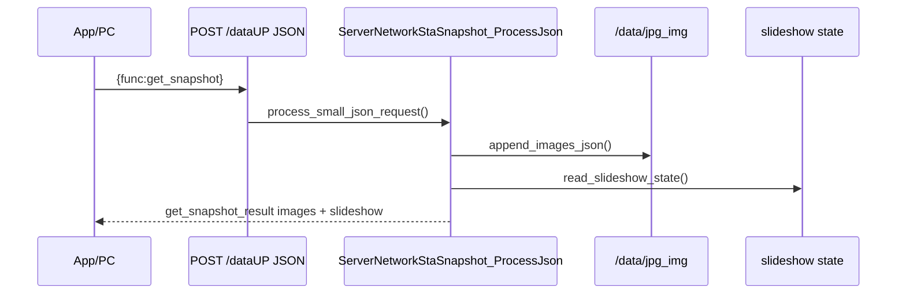

相关文件：

```text
main/server_network_sta/snapshot/server_network_sta_snapshot.c
main/server_network_sta/snapshot/server_network_sta_snapshot.h
```

树状时序：

```text
HTTP small JSON get_snapshot
└─ receive_data_redirect_handler()
   └─ process_small_json_request()
      └─ ServerNetworkStaSnapshot_ProcessJson()
         ├─ append_images_json()
         ├─ read_slideshow_state()
         ├─ append_slideshow_json()
         └─ httpd_resp_sendstr(json)
```

关键辅助函数：

```text
server_network_sta_snapshot.c
├─ append_images_json()
├─ read_slideshow_state()
├─ append_slideshow_json()
└─ ServerNetworkStaSnapshot_ProcessJson()
```

V2 协议资料拆分：

```json
{
  "func": "get_snapshot"
}
```

返回：

```json
{
  "func": "get_snapshot_result",
  "result": 0,
  "images": [
    {
      "fileName": "26422",
      "thumbnailUrl": "/thumb/26422.jpg"
    }
  ],
  "slideshow": {
    "sw": 1,
    "fileNames": ["26422", "26423"],
    "interval": 60,
    "random": false
  }
}
```

V2 说明：如果设备未设置过轮播，建议返回 `{"sw":0,"fileNames":[],"interval":0,"random":false}`。


存 / 取信息（含条件限制）：

```text
存：
- get_snapshot 不写文件。

取：
- append_images_json() 扫描 /data/jpg_img 下保存的缩略图。
- read_slideshow_state() 读取 slideshow_config 和 control 文件。
- 返回 images[] 与 slideshow 状态。
```

[⬆ 返回目录](#toc) | [↩ 返回当前目录](#sec-07)

---

### 7.11 upload：文件上传 HTTP 接口 <span id="sec-07-11"></span>

功能说明：网页端或 App 上传图片到设备 SD 卡；字段与 `cast` 基本一致，主要用于保存图片，也可在 `show=true` 时立即显示。

Mermaid 时序图：

```mermaid
sequenceDiagram
    participant APP as App/PC
    participant DATAUP as POST /dataUP
    participant UP as ServerNetworkStaUpload_Process
    participant SD as SD Storage
    participant EPD as EPD Display Queue
    APP->>DATAUP: multipart func=upload
    DATAUP->>UP: route by func
    UP->>UP: validate fields and file sizes
    UP->>SD: save bin and jpg
    alt show=true
        UP->>EPD: ServerNetworkStaEpdDisplay_Queue()
    end
    UP-->>APP: upload result
```

相关文件：

```text
main/server_network_sta/upload/server_network_sta_upload.c
main/server_network_sta/upload/server_network_sta_upload.h
```

树状时序：

```text
HTTP multipart /dataUP
└─ receive_data_redirect_handler()
   └─ ServerNetworkStaUpload_Process()
      ├─ extract_boundary()
      ├─ extract_multipart_parts()
      ├─ copy_part_text()
      ├─ parse_size_field()
      ├─ file_name_is_safe()
      ├─ check_upload_save_space()
      ├─ ensure_dir("/data/bin_img")
      ├─ ensure_dir("/data/jpg_img")
      ├─ write_file_exact(.bin)
      ├─ write_file_exact(.jpg)
      ├─ show=true
      │  └─ ServerNetworkStaEpdDisplay_Queue()
      └─ httpd_resp_sendstr()
```

关键辅助函数：

```text
server_network_sta_upload.c
├─ extract_boundary()
├─ extract_multipart_parts()
├─ copy_part_text()
├─ parse_size_field()
├─ file_name_is_safe()
├─ check_upload_save_space()
├─ write_file_exact()
└─ ServerNetworkStaUpload_Process()
```

V2 协议资料拆分：

```http
POST /dataUP HTTP/1.1
Content-Type: multipart/form-data

func=upload
fileName=26422
bin_size=123456
image_size=23456
save=true
show=false
bin=@26422.bin
image=@26422.jpg
```

V2 说明：`upload` 与 `cast` 字段一致，用于保存图片上传。多张图片上传时按 `cast2pic` 一样重复追加多组同名字段。

V2 预留 `update`：

```http
POST /dataUP HTTP/1.1
Content-Type: multipart/form-data

func=update
oldfileNames=12345
newfileNames=67890
bin_size=123456
image_size=23456
save=true
show=true
bin=@67890.bin
image=@67890.jpg
```

`update` 在 V2 中标为前端预留，用于用新图片替换旧图片。


存 / 取信息（含条件限制）：

```text
存：
- 保存上传的 /data/bin_img/<fileName>.bin。
- 保存上传的 /data/jpg_img/<fileName>.jpg。
- 使用文件名安全检查后再写入，避免路径穿越。

取：
- 读取 multipart 字段 func/fileName/bin_size/image_size/save/show/bin/image。
- 写入前读取存储剩余空间。
- show=true 时读取上传数据并投递 EPD 显示队列。
```

[⬆ 返回目录](#toc) | [↩ 返回当前目录](#sec-07)

---

### 7.12 wifi_work_time：WiFi 省电管理 <span id="sec-07-12"></span>

功能说明：设置 WiFi 保持工作时间；超时后如 OTA 不忙，则通过 CH583 `POWER_OFF` 关闭 WiFi 电源或进入低功耗流程。

Mermaid 时序图：

```mermaid
sequenceDiagram
    participant APP as App/PC/BLE
    participant DATAUP as POST /dataUP JSON
    participant WT as ServerNetworkStaWifiWorkTime_ProcessJson
    participant TIMER as work_state_task
    participant CH583 as CH583 UART
    APP->>DATAUP: set_wifi_work_time seconds
    DATAUP->>WT: process_small_json_request()
    WT->>WT: ServerNetworkStaWifiWorkTime_SetAndSave()
    WT->>WT: save NVS and reset working_time
    loop periodic check
        TIMER->>WT: compare elapsed and required time
    end
    alt timeout and OTA not busy
        WT->>CH583: ch583_wifi_uart_send_power_off()
    end
```

相关文件：

```text
main/server_network_sta/wifi_work_time/server_network_sta_wifi_work_time.c
main/server_network_sta/wifi_work_time/server_network_sta_wifi_work_time.h
```

树状时序：

```text
main/main.c
└─ ServerNetworkStaWifiWorkTime_Init()
   ├─ load_work_state_from_nvs()
   ├─ load_work_time_vars_from_app_nvs()
   └─ xTaskCreate(work_state_task)

HTTP small JSON set_wifi_work_time
└─ receive_data_redirect_handler()
   └─ process_small_json_request()
      └─ ServerNetworkStaWifiWorkTime_ProcessJson()
         └─ ServerNetworkStaWifiWorkTime_SetAndSave()
            ├─ clamp seconds
            ├─ save_work_state_to_nvs()
            └─ save_work_time_vars_to_app_nvs()

work_state_task()
├─ update_working_time_seconds()
├─ elapsed <= server_required_continue_work_time
│  └─ keep running
├─ elapsed > server_required_continue_work_time && OTA busy
│  └─ ignored during OTA
└─ elapsed > server_required_continue_work_time && OTA not busy
   └─ ch583_wifi_uart_send_power_off()
```

关键辅助函数：

```text
server_network_sta_wifi_work_time.c
├─ ServerNetworkStaWifiWorkTime_Init()
├─ ServerNetworkStaWifiWorkTime_OnNetworkData()
├─ ServerNetworkStaWifiWorkTime_ProcessJson()
├─ ServerNetworkStaWifiWorkTime_SetAndSave()
├─ ServerNetworkStaWifiWorkTime_SetOtaInProgress()
└─ work_state_task()
```

V2 协议资料拆分：

```json
{
  "func": "set_wifi_work_time",
  "seconds": 300
}
```

字段说明：

```text
seconds WiFi 工作时长，前端会归一为大于等于 1 的整数。
```


存 / 取信息（含条件限制）：

```text
存：
- save_work_state_to_nvs() 写入 namespace=USER_WORK_STATE_NVS_NAMESPACE 的 USER_WORK_STATE_NVS_KEY blob。
- save_work_time_vars_to_app_nvs() 写入 PhotoPainter 下的 SERVER_REQUIRED_CONTINUE_WORK_TIME_NVS_KEY 与 WIFI_STANDBY_TIME_S_NVS_KEY 字符串。

取：
- load_work_state_from_nvs() 读取工作状态 blob。
- load_work_time_vars_from_app_nvs() 读取兼容字符串 key。
- work_state_task() 读取 RAM 中计时值，超时后发送 CH583 POWER_OFF。
```

[⬆ 返回目录](#toc) | [↩ 返回当前目录](#sec-07)

---

## 8. USB Serial/JTAG HTTP-like 协议 <span id="sec-08"></span>

Mermaid 时序图：

```mermaid
sequenceDiagram
    participant PC as PC USB Serial
    participant USB as UsbConsoleEcho_Task
    participant HTTP as UsbConsoleHttp_TryParseRequest
    participant ROUTER as UsbConsoleRouter_Handle
    PC->>USB: HTTP-like text
    USB->>HTTP: parse request
    HTTP->>ROUTER: method/path/body
    ROUTER-->>USB: JSON response
    USB-->>PC: HTTP-like response
```


相关目录：

```text
main/usb_console_echo/
main/usb_console_echo/transport/
main/usb_console_echo/http_text/
main/usb_console_echo/router/
main/usb_console_echo/worker/
main/usb_console_echo/common/
```

启动时序：

```text
main/main.c
└─ app_main()
   └─ UsbConsoleEcho_Init()
      ├─ UsbConsoleTransport_Init()
      ├─ UsbConsoleWorker_Init()
      └─ xTaskCreate(UsbConsoleEcho_Task)
```

接收解析树状时序：

```text
UsbConsoleEcho_Task()
├─ UsbConsoleTransport_FlushRx()
├─ UsbConsoleEpdType_SendList()
├─ UsbConsoleEpdType_SendCurrent()
└─ loop
   ├─ UsbConsoleTransport_Read()
   ├─ UsbConsoleHttp_TryParseRequest()
   ├─ direct POST /epd_type
   │  └─ UsbConsoleEpdType_HandleSet()
   └─ UsbConsoleRouter_Handle()
```

HTTP-like 响应发送：

```text
功能处理函数
└─ UsbConsoleHttp_SetJson() or UsbConsoleCommon_SetJsonf()
   └─ UsbConsoleHttp_SendResponse()
      └─ UsbConsoleTransport_WriteAll()
```

---


存 / 取信息（含条件限制）：

```text
存：
- USB 协议层本身不写持久化数据。
- 路由后的功能模块可能写 SD/NVS/EPD type/轮播配置。

取：
- UsbConsoleTransport_Read() 从 USB Serial/JTAG 读取 HTTP-like 文本。
- UsbConsoleHttp_TryParseRequest() 在 RAM 中解析 header/body。
```

[⬆ 返回目录](#toc) | [↩ 返回当前目录](#sec-08)

---

## 9. USB 路由与各功能处理汇总 <span id="sec-09"></span>

本节只整理 `main/usb_console_echo/` 目录下的 USB Serial/JTAG HTTP-like 协议处理。  
USB 输入先经过 `transport` 读入，再由 `http_text` 解析成 HTTP-like request，最后由 `router` 按路径分发到各功能模块。

Mermaid 时序图：

```mermaid
sequenceDiagram
    participant PC as PC / VSCode Serial
    participant Transport as transport
    participant HttpText as http_text
    participant Router as router
    participant Module as 功能模块
    participant Resp as USB response

    PC->>Transport: 发送 HTTP-like 文本
    Transport->>HttpText: UsbConsoleTransport_Read()
    HttpText->>Router: UsbConsoleHttp_TryParseRequest()
    Router->>Module: UsbConsoleRouter_Handle()
    Module-->>Router: 填充 usb_console_http_response_t
    Router->>Resp: UsbConsoleHttp_SendResponse()
    Resp-->>PC: 返回 JSON / 文件数据
```

相关文件：

```text
main/usb_console_echo/usb_console_echo.c
main/usb_console_echo/transport/usb_console_transport.c
main/usb_console_echo/http_text/usb_console_http_text.c
main/usb_console_echo/router/usb_console_router.c
main/usb_console_echo/worker/usb_console_worker.c
main/usb_console_echo/common/usb_console_common.c
main/usb_console_echo/common/usb_console_common_async.c
main/usb_console_echo/ping/usb_console_ping.c
main/usb_console_echo/wifi/usb_console_wifi.c
main/usb_console_echo/epd_type/usb_console_epd_type.c
main/usb_console_echo/net_data/usb_console_net_data.c
main/usb_console_echo/cast/usb_console_cast.c
main/usb_console_echo/cast/usb_console_cast_worker.c
main/usb_console_echo/cast2pic/usb_console_cast2pic.c
main/usb_console_echo/delete/usb_console_delete.c
main/usb_console_echo/saved_images/usb_console_saved_images.c
main/usb_console_echo/slideshow/usb_console_slideshow.c
main/usb_console_echo/slideshow_control/usb_console_slideshow_control.c
main/usb_console_echo/snapshot/usb_console_snapshot.c
main/usb_console_echo/upload/usb_console_upload.c
main/usb_console_echo/wifi_work_time/usb_console_wifi_work_time.c
```

树状时序：

```text
USB Serial/JTAG
└─ UsbConsoleEcho_Task()
   ├─ UsbConsoleTransport_Read()
   ├─ UsbConsoleHttp_TryParseRequest()
   └─ UsbConsoleRouter_Handle()
      ├─ /ping              -> UsbConsolePing_Handle()
      ├─ /wifi              -> UsbConsoleWifi_Handle()
      ├─ /epd_type          -> UsbConsoleEpdType_HandleSet() / SendCurrent()
      ├─ /epd_test          -> UsbConsoleEpdType_HandleTest()
      ├─ /dataUP /net_data  -> UsbConsoleNetData_Handle()
      ├─ /cast              -> UsbConsoleCast_Handle()
      ├─ /cast2pic          -> UsbConsoleCast2Pic_Handle()
      ├─ /delete            -> UsbConsoleDelete_Handle()
      ├─ /saved_images      -> UsbConsoleSavedImages_Handle()
      ├─ /thumb             -> UsbConsoleSavedImages_Handle()
      ├─ /slideshow         -> UsbConsoleSlideshow_Handle()
      ├─ /slideshow_control -> UsbConsoleSlideshowControl_Handle()
      ├─ /snapshot          -> UsbConsoleSnapshot_Handle()
      ├─ /upload            -> UsbConsoleUpload_Handle()
      └─ /wifi_work_time    -> UsbConsoleWifiWorkTime_Handle()
```

关键辅助函数：

```text
UsbConsoleEcho_Init()
UsbConsoleEcho_Task()
UsbConsoleTransport_Init()
UsbConsoleTransport_Read()
UsbConsoleHttp_TryParseRequest()
UsbConsoleRouter_Handle()
UsbConsoleHttp_SendResponse()
```


存 / 取信息（含条件限制）：

```text
存：
- USB cast/upload/cast2pic 写 /data/bin_img 与 /data/jpg_img。
- USB wifi 写 NVS wifi 与 nvs.net80211。
- USB epd_type 写 PhotoPainter EPD type key。
- USB slideshow/slideshow_control 写轮播配置文件。
- USB wifi_work_time 写工作时间 NVS。

取：
- USB saved_images/snapshot 读取 SD 图片与轮播状态。
- USB ping 读取状态信息。
- USB router/http_text/transport 只读取 USB 输入并在 RAM 中处理。
```

[⬆ 返回目录](#toc) | [↩ 返回当前目录](#sec-09)

---

### 9.1 cast：投屏功能模块 <span id="sec-09-1"></span>

功能说明：

```text
USB cast 用于通过 USB Serial/JTAG 发送 HTTP-like multipart 数据，保存主图 bin 和缩略图 jpg，并按 show 字段决定是否投递到 EPD 显示队列。
```

Mermaid 时序图：

```mermaid
sequenceDiagram
    participant PC as PC USB
    participant Router as UsbConsoleRouter_Handle
    participant Cast as UsbConsoleCast_Handle
    participant Worker as UsbConsoleCast_SubmitAsync
    participant Common as UsbConsoleCommon_HandleImageTransfer
    participant EPD as ServerNetworkStaEpdDisplay_Queue

    PC->>Router: POST /cast 或 /dataUP func=cast
    Router->>Cast: UsbConsoleCast_Handle()
    Cast->>Worker: UsbConsoleCast_SubmitAsync()
    Worker->>Common: UsbConsoleCast_Process()
    Common->>Common: 解析 multipart / 保存 bin jpg
    alt show=true
        Common->>EPD: ServerNetworkStaEpdDisplay_Queue()
    end
    Common-->>PC: cast_result JSON
```

相关文件：

```text
main/usb_console_echo/cast/usb_console_cast.c
main/usb_console_echo/cast/usb_console_cast_worker.c
main/usb_console_echo/cast/usb_console_cast.h
main/usb_console_echo/common/usb_console_common.c
main/server_network_sta/cast/server_network_sta_cast.c
```

树状时序：

```text
UsbConsoleRouter_Handle()
└─ /cast 或 /dataUP func=cast
   └─ UsbConsoleCast_Handle()
      └─ UsbConsoleCast_SubmitAsync()
         └─ cast_worker_job()
            └─ UsbConsoleCast_Process()
               └─ UsbConsoleCommon_HandleImageTransfer("cast")
                  ├─ UsbConsoleCommon_ExtractBoundary()
                  ├─ UsbConsoleCommon_MultipartParts()
                  ├─ UsbConsoleCommon_FileNameIsSafe()
                  ├─ UsbConsoleCommon_SavePartFile(.bin)
                  ├─ UsbConsoleCommon_SavePartFile(.jpg)
                  ├─ UsbConsoleCommon_RecordLastCast()
                  └─ show=true
                     └─ ServerNetworkStaEpdDisplay_Queue()
```

关键辅助函数：

```text
UsbConsoleCast_Handle()
UsbConsoleCast_SubmitAsync()
UsbConsoleCast_Process()
cast_worker_job()
UsbConsoleCommon_HandleImageTransfer()
UsbConsoleCommon_RecordLastCast()
ServerNetworkStaEpdDisplay_Queue()
```


存 / 取信息（含条件限制）：

```text
存：
- UsbConsoleCommon_HandleImageTransfer() 写入：/data/bin_img/<fileName>.bin。
- UsbConsoleCommon_HandleImageTransfer() 写入：/data/jpg_img/<fileName>.jpg。
- save_one_cast_file() 使用 <fileName>.tmp 临时文件，写完校验大小后 rename 成正式文件。
- UsbConsoleCommon_RecordLastCast() 写入 last cast 记录文件，路径在 /data/bin_img/ 下。

取：
- check_cast_save_space() 通过 example_storage_get_free_bytes() 读取剩余空间。
- 显示时下发已收到的 bin 数据到 EPD 队列；重启恢复时可读取 last cast 记录。
```

[⬆ 返回目录](#toc) | [↩ 返回当前目录](#sec-09)

---

### 9.2 cast2pic：投屏转图片缓存 / 显示 <span id="sec-09-2"></span>

功能说明：

```text
USB cast2pic 用于双屏或分屏投图，按 screen=a/b/ab 映射到指定屏幕编号，并把对应图片投递到指定 EPD 屏幕显示队列。
```

Mermaid 时序图：

```mermaid
sequenceDiagram
    participant PC as PC USB
    participant Router as Router
    participant Cast2Pic as UsbConsoleCast2Pic_Handle
    participant Common as multipart parser
    participant EPD as EPD QueueToScreen

    PC->>Router: POST /cast2pic multipart
    Router->>Cast2Pic: UsbConsoleCast2Pic_Handle()
    Cast2Pic->>Common: UsbConsoleCast2Pic_Process()
    Common->>Common: 解析 screen / fileName / bin / image
    Common->>Common: 保存 bin jpg
    alt show=true
        Common->>EPD: ServerNetworkStaEpdDisplay_QueueToScreen()
    end
    Cast2Pic-->>PC: cast2pic_result JSON
```

相关文件：

```text
main/usb_console_echo/cast2pic/usb_console_cast2pic.c
main/usb_console_echo/cast2pic/usb_console_cast2pic.h
main/usb_console_echo/common/usb_console_common.c
main/server_network_sta/cast2pic/server_network_sta_cast2pic.c
```

树状时序：

```text
UsbConsoleRouter_Handle()
└─ /cast2pic
   └─ UsbConsoleCast2Pic_Handle()
      └─ UsbConsoleCast2Pic_Process()
         ├─ parse screen=a/b/ab
         ├─ parse multipart file groups
         ├─ save /data/bin_img/*.bin
         ├─ save /data/jpg_img/*.jpg
         └─ show=true
            └─ ServerNetworkStaEpdDisplay_QueueToScreen()
```

关键辅助函数：

```text
UsbConsoleCast2Pic_Handle()
UsbConsoleCast2Pic_Process()
UsbConsoleCommon_ExtractBoundary()
UsbConsoleCommon_MultipartParts()
ServerNetworkStaEpdDisplay_QueueToScreen()
```


存 / 取信息（含条件限制）：

```text
存：
- 保存每组 fileName 对应的 .bin 和 .jpg 到 /data/bin_img 与 /data/jpg_img。
- 使用临时文件写入再 rename，避免半文件覆盖正式文件。

取：
- 读取 multipart 中重复出现的 fileName/bin_size/image_size/bin/image。
- 根据 screen=a/b/ab 转成 EPD screen number 后投递显示队列。
- 写入前读取剩余空间做容量检查。
```

[⬆ 返回目录](#toc) | [↩ 返回当前目录](#sec-09)

---

### 9.3 common：公共工具、通用函数、全局定义 <span id="sec-09-3"></span>

功能说明：

```text
common 模块为 USB 各接口提供 JSON 解析、multipart 解析、文件名安全检查、文件保存、图片传输公共流程、响应 JSON 拼装等通用能力。
```

Mermaid 时序图：

```mermaid
flowchart TD
    A[功能模块 Handler] --> B[UsbConsoleCommon_JsonFuncEquals]
    A --> C[UsbConsoleCommon_ExtractBoundary]
    C --> D[UsbConsoleCommon_MultipartParts]
    D --> E[UsbConsoleCommon_FileNameIsSafe]
    E --> F[UsbConsoleCommon_SavePartFile]
    F --> G[UsbConsoleCommon_RecordLastCast]
    A --> H[UsbConsoleCommon_SetJsonf]
```

相关文件：

```text
main/usb_console_echo/common/usb_console_common.c
main/usb_console_echo/common/usb_console_common.h
main/usb_console_echo/common/usb_console_common_async.c
main/usb_console_echo/common/usb_console_common_async.h
```

树状时序：

```text
功能模块
├─ JSON 控制类
│  ├─ UsbConsoleCommon_JsonFuncEquals()
│  ├─ UsbConsoleCommon_JsonString()
│  ├─ UsbConsoleCommon_JsonBool()
│  └─ UsbConsoleCommon_SetJsonf()
└─ 图片 multipart 类
   └─ UsbConsoleCommon_HandleImageTransfer()
      ├─ UsbConsoleCommon_ExtractBoundary()
      ├─ UsbConsoleCommon_MultipartParts()
      ├─ UsbConsoleCommon_FileNameIsSafe()
      ├─ UsbConsoleCommon_SavePartFile()
      └─ UsbConsoleCommon_RecordLastCast()
```

关键辅助函数：

```text
UsbConsoleCommon_HandleImageTransfer()
UsbConsoleCommon_ExtractBoundary()
UsbConsoleCommon_MultipartParts()
UsbConsoleCommon_FileNameIsSafe()
UsbConsoleCommon_SavePartFile()
UsbConsoleCommon_RecordLastCast()
UsbConsoleCommon_ListSavedImages()
UsbConsoleCommon_AppendSnapshot()
UsbConsoleCommon_SetJsonf()
```


存 / 取信息（含条件限制）：

```text
存：
- 公共模块提供保存图片、保存 last cast、生成响应 JSON 等通用能力。
- 图片保存路径复用 /data/bin_img 与 /data/jpg_img。

取：
- 读取 multipart boundary、字段、文件名、body buffer。
- 读取存储剩余空间和文件状态，用于校验上传结果。
```

[⬆ 返回目录](#toc) | [↩ 返回当前目录](#sec-09)

---

### 9.4 delete：图片 / 文件删除逻辑 <span id="sec-09-4"></span>

功能说明：

```text
USB delete 接收 JSON fileNames 数组，删除对应 bin/jpg 文件，并清理 last_cast、slideshow 等关联状态。
```

Mermaid 时序图：

```mermaid
sequenceDiagram
    participant PC as PC USB
    participant Router as Router
    participant Delete as UsbConsoleDelete
    participant FS as SD / FATFS
    participant State as last_cast / slideshow

    PC->>Router: POST /delete JSON
    Router->>Delete: UsbConsoleDelete_Handle()
    Delete->>Delete: UsbConsoleDelete_Process()
    Delete->>FS: 删除 /data/bin_img/*.bin
    Delete->>FS: 删除 /data/jpg_img/*.jpg
    Delete->>State: 清理关联状态
    Delete-->>PC: delete_result JSON
```

相关文件：

```text
main/usb_console_echo/delete/usb_console_delete.c
main/usb_console_echo/delete/usb_console_delete.h
main/server_network_sta/delete/server_network_sta_delete.c
```

树状时序：

```text
UsbConsoleRouter_Handle()
└─ /delete
   └─ UsbConsoleDelete_Handle()
      └─ UsbConsoleDelete_Process()
         ├─ parse fileNames[]
         ├─ delete /data/bin_img/<file>.bin
         ├─ delete /data/jpg_img/<file>.jpg
         ├─ cleanup last_cast if deleted
         ├─ cleanup slideshow if deleted
         └─ response delete_result
```

关键辅助函数：

```text
UsbConsoleDelete_Handle()
UsbConsoleDelete_Process()
UsbConsoleCommon_JsonFuncEquals()
UsbConsoleCommon_FileNameIsSafe()
UsbConsoleCommon_SetJsonf()
```


存 / 取信息（含条件限制）：

```text
存：
- 删除动作会修改持久化文件系统：unlink /data/bin_img/<file>.bin 与 /data/jpg_img/<file>.jpg。
- 如果删除文件被 last_cast 或 slideshow 引用，会同步清理相关状态文件。

取：
- 读取 JSON fileNames 数组。
- 读取 last_cast / slideshow 配置，判断是否引用被删除文件。
```

[⬆ 返回目录](#toc) | [↩ 返回当前目录](#sec-09)

---

### 9.5 epd_type：电子墨水屏（EPD）屏幕类型适配、驱动适配 <span id="sec-09-5"></span>

功能说明：

```text
epd_type USB 接口用于查询屏幕类型列表、读取当前屏幕类型、设置屏幕类型并保存到 NVS，也提供 EPD 测试显示入口。
```

Mermaid 时序图：

```mermaid
sequenceDiagram
    participant PC as PC USB
    participant Router as Router
    participant EpdUsb as UsbConsoleEpdType
    participant EpdType as EpdType Manager
    participant NVS as app_nvs
    participant EPD as EPD Display

    PC->>Router: GET/POST /epd_type
    Router->>EpdUsb: UsbConsoleEpdType_HandleSet() or SendCurrent()
    EpdUsb->>EpdType: EpdType_SetAndSave() / GetCurrentConfig()
    EpdType->>NVS: app_nvs_write_u8()
    alt /epd_test
        EpdUsb->>EPD: UsbConsoleEpdType_HandleTest()
    end
    EpdUsb-->>PC: epd_type_result JSON
```

相关文件：

```text
main/usb_console_echo/epd_type/usb_console_epd_type.c
main/usb_console_echo/epd_type/usb_console_epd_type.h
main/epd_display/epd_type.cpp
main/epd_display/epd_display_app.cpp
```

树状时序：

```text
UsbConsoleRouter_Handle()
├─ /epd_type_list
│  └─ UsbConsoleEpdType_SendList()
├─ /epd_type GET
│  └─ UsbConsoleEpdType_SendCurrent()
├─ /epd_type POST
│  └─ UsbConsoleEpdType_HandleSet()
│     └─ EpdType_SetAndSave()
└─ /epd_test
   └─ UsbConsoleEpdType_HandleTest()
```

关键辅助函数：

```text
UsbConsoleEpdType_SendList()
UsbConsoleEpdType_SendCurrent()
UsbConsoleEpdType_HandleSet()
UsbConsoleEpdType_HandleTest()
EpdType_SetAndSave()
EpdType_GetCurrentConfig()
```


存 / 取信息（含条件限制）：

```text
存：
- UsbConsoleEpdType_HandleSet() 通过 EpdType_SetAndSave() 保存当前 EPD 类型。
- 底层使用 app_nvs_write_u8() 写入 PhotoPainter namespace 中的 USER_EPD_TYPE_NVS_KEY。

取：
- UsbConsoleEpdType_SendList() 读取编译进固件的 EPD 类型表。
- UsbConsoleEpdType_SendCurrent() 读取当前 RAM 中 EPD 类型。
- EpdType_LoadSavedOrDefault() 从 NVS 读取保存的 EPD 类型。
```

[⬆ 返回目录](#toc) | [↩ 返回当前目录](#sec-09)

---

### 9.6 http_text：HTTP-like 文本请求解析 <span id="sec-09-6"></span>

功能说明：

```text
http_text 模块把 USB 串口收到的文本解析成 HTTP-like request，包括 method、path、header、body，并负责把响应结构格式化回 HTTP-like 文本。
```

Mermaid 时序图：

```mermaid
sequenceDiagram
    participant Transport as transport
    participant HttpText as http_text
    participant Router as router
    participant PC as PC USB

    Transport->>HttpText: raw bytes buffer
    HttpText->>HttpText: UsbConsoleHttp_TryParseRequest()
    HttpText->>Router: usb_console_http_request_t
    Router-->>HttpText: usb_console_http_response_t
    HttpText->>PC: UsbConsoleHttp_SendResponse()
```

相关文件：

```text
main/usb_console_echo/http_text/usb_console_http_text.c
main/usb_console_echo/http_text/usb_console_http_text.h
```

树状时序：

```text
UsbConsoleEcho_Task()
└─ UsbConsoleHttp_TryParseRequest()
   ├─ parse method
   ├─ parse path
   ├─ parse headers
   ├─ parse Content-Length
   └─ parse body

功能模块响应
└─ UsbConsoleHttp_SetJson()
   └─ UsbConsoleHttp_SendResponse()
      └─ UsbConsoleTransport_WriteAll()
```

关键辅助函数：

```text
UsbConsoleHttp_TryParseRequest()
UsbConsoleHttp_SetJson()
UsbConsoleHttp_SendResponse()
```


存 / 取信息（含条件限制）：

```text
存：
- http_text 只解析 USB HTTP-like 文本，不做持久化。

取：
- 从 USB 输入缓冲区读取 method、path、header、Content-Length、body。
- 解析结果保存在 usb_console_http_request_t RAM 结构中。
```

[⬆ 返回目录](#toc) | [↩ 返回当前目录](#sec-09)

---

### 9.7 net_data：USB /dataUP 与网络功能复用入口 <span id="sec-09-7"></span>

功能说明：

```text
USB net_data 是 USB 侧 /dataUP 统一入口，用来兼容网络 /dataUP 的 func 分发方式，把 USB HTTP-like 请求分发到 cast、cast2pic、upload、delete、saved_images、snapshot、slideshow 等模块。
```

Mermaid 时序图：

```mermaid
flowchart TD
    A[POST /dataUP 或 /net_data] --> B[UsbConsoleNetData_Handle]
    B --> C{func / Content-Type}
    C -->|cast| D[UsbConsoleCast_Handle]
    C -->|cast2pic| E[UsbConsoleCast2Pic_Handle]
    C -->|upload| F[UsbConsoleUpload_Handle]
    C -->|delete| G[UsbConsoleDelete_Handle]
    C -->|get_saved_images| H[UsbConsoleSavedImages_Handle]
    C -->|get_snapshot| I[UsbConsoleSnapshot_Handle]
    C -->|slideshow| J[Slideshow handlers]
```

相关文件：

```text
main/usb_console_echo/net_data/usb_console_net_data.c
main/usb_console_echo/net_data/usb_console_net_data.h
main/usb_console_echo/router/usb_console_router.c
```

树状时序：

```text
UsbConsoleRouter_Handle()
└─ /dataUP 或 /net_data
   └─ UsbConsoleNetData_Handle()
      ├─ read func
      ├─ multipart image request
      │  ├─ cast
      │  ├─ cast2pic
      │  └─ upload
      └─ JSON control request
         ├─ delete
         ├─ get_saved_images
         ├─ get_snapshot
         ├─ start_slideshow
         ├─ set_slideshow
         └─ set_wifi_work_time
```

关键辅助函数：

```text
UsbConsoleNetData_Handle()
UsbConsoleCommon_JsonFuncEquals()
UsbConsoleCommon_HandleImageTransfer()
UsbConsoleRouter_Handle()
```


存 / 取信息（含条件限制）：

```text
存：
- USB net_data 本身不直接持久化。
- 复用网络功能后由 cast/upload/delete/slideshow 等模块完成实际存储。

取：
- 读取 USB request 中的 /dataUP body 和 func。
- 转发到对应 USB 或 server_network_sta 处理模块。
```

[⬆ 返回目录](#toc) | [↩ 返回当前目录](#sec-09)

---

### 9.8 ping：USB 连通性检测 <span id="sec-09-8"></span>

功能说明：

```text
USB ping 用于验证 USB 命令通道可用，并返回设备基础信息；网络 ping 的 BLE_MAC 校验逻辑在 server_network_sta/ping 中处理。
```

Mermaid 时序图：

```mermaid
sequenceDiagram
    participant PC as PC USB
    participant Router as Router
    participant Ping as UsbConsolePing
    participant Resp as Response

    PC->>Router: GET /ping
    Router->>Ping: UsbConsolePing_Handle()
    Ping->>Ping: UsbConsolePing_Process()
    Ping-->>Resp: ping_result JSON
    Resp-->>PC: HTTP-like response
```

相关文件：

```text
main/usb_console_echo/ping/usb_console_ping.c
main/usb_console_echo/ping/usb_console_ping.h
main/server_network_sta/ping/server_network_sta_ping.c
```

树状时序：

```text
UsbConsoleRouter_Handle()
└─ /ping
   └─ UsbConsolePing_Handle()
      └─ UsbConsolePing_Process()
         └─ response ping_result
```

关键辅助函数：

```text
UsbConsolePing_Handle()
UsbConsolePing_Process()
UsbConsoleHttp_SetJson()
```


存 / 取信息（含条件限制）：

```text
存：
- USB ping 不写持久化数据。

取：
- 读取当前设备状态、可能读取 CH583 BLE MAC 或网络状态后返回 JSON。
```

[⬆ 返回目录](#toc) | [↩ 返回当前目录](#sec-09)

---

### 9.9 router：USB HTTP-like 路由、API 分发 <span id="sec-09-9"></span>

功能说明：

```text
router 是 USB HTTP-like 请求的统一分发器，按照 path 匹配 /ping、/wifi、/dataUP、/cast、/upload 等接口，并调用对应模块 Handle 函数。
```

Mermaid 时序图：

```mermaid
flowchart TD
    A[UsbConsoleRouter_Handle] --> B{path_is}
    B -->|/ping| C[UsbConsolePing_Handle]
    B -->|/wifi| D[UsbConsoleWifi_Handle]
    B -->|/dataUP or /net_data| E[UsbConsoleNetData_Handle]
    B -->|/cast| F[UsbConsoleCast_Handle]
    B -->|/cast2pic| G[UsbConsoleCast2Pic_Handle]
    B -->|/upload| H[UsbConsoleUpload_Handle]
    B -->|/delete| I[UsbConsoleDelete_Handle]
    B -->|/snapshot| J[UsbConsoleSnapshot_Handle]
    B -->|unknown| K[usb_unknown_result]
```

相关文件：

```text
main/usb_console_echo/router/usb_console_router.c
main/usb_console_echo/router/usb_console_router.h
```

树状时序：

```text
UsbConsoleRouter_Handle(request)
├─ path_is("/ping")              -> UsbConsolePing_Handle()
├─ path_is("/wifi")              -> UsbConsoleWifi_Handle()
├─ path_is("/epd_type_list")     -> UsbConsoleEpdType_SendList()
├─ path_is("/epd_type")          -> UsbConsoleEpdType_HandleSet() / SendCurrent()
├─ path_is("/epd_test")          -> UsbConsoleEpdType_HandleTest()
├─ path_is("/dataUP"/"/net_data") -> UsbConsoleNetData_Handle()
├─ path_is("/cast")              -> UsbConsoleCast_Handle()
├─ path_is("/cast2pic")          -> UsbConsoleCast2Pic_Handle()
├─ path_is("/delete")            -> UsbConsoleDelete_Handle()
├─ path_is("/saved_images"/"/thumb") -> UsbConsoleSavedImages_Handle()
├─ path_is("/slideshow")         -> UsbConsoleSlideshow_Handle()
├─ path_is("/slideshow_control") -> UsbConsoleSlideshowControl_Handle()
├─ path_is("/snapshot")          -> UsbConsoleSnapshot_Handle()
├─ path_is("/upload")            -> UsbConsoleUpload_Handle()
├─ path_is("/wifi_work_time")    -> UsbConsoleWifiWorkTime_Handle()
└─ else                           -> usb_unknown_result
```

关键辅助函数：

```text
UsbConsoleRouter_Handle()
path_is()
usb_request_is_set_epd_type()
UsbConsoleHttp_SendResponse()
```


存 / 取信息（含条件限制）：

```text
存：
- router 不直接保存数据。

取：
- 读取 request path / method / body 中的 func。
- 根据路径分发到 wifi、cast、upload、delete、snapshot 等模块。
```

[⬆ 返回目录](#toc) | [↩ 返回当前目录](#sec-09)

---

### 9.10 saved_images：本地存储图片读取、缩略图访问 <span id="sec-09-10"></span>

功能说明：

```text
saved_images 用于扫描 /data/jpg_img，返回已保存图片列表和缩略图路径；/thumb 路由也复用该模块返回缩略图。
```

Mermaid 时序图：

```mermaid
sequenceDiagram
    participant PC as PC USB
    participant Router as Router
    participant Saved as UsbConsoleSavedImages
    participant FS as /data/jpg_img

    PC->>Router: GET/POST /saved_images 或 /thumb
    Router->>Saved: UsbConsoleSavedImages_Handle()
    Saved->>FS: 扫描 jpg_img / 读取缩略图
    Saved-->>PC: get_saved_images_result 或 jpg 数据
```

相关文件：

```text
main/usb_console_echo/saved_images/usb_console_saved_images.c
main/usb_console_echo/saved_images/usb_console_saved_images.h
main/server_network_sta/saved_images/server_network_sta_saved_images.c
```

树状时序：

```text
UsbConsoleRouter_Handle()
└─ /saved_images 或 /thumb
   └─ UsbConsoleSavedImages_Handle()
      └─ UsbConsoleSavedImages_Process()
         ├─ scan /data/jpg_img
         ├─ build images[]
         └─ response get_saved_images_result
```

关键辅助函数：

```text
UsbConsoleSavedImages_Handle()
UsbConsoleSavedImages_Process()
UsbConsoleCommon_ListSavedImages()
UsbConsoleCommon_FileNameIsSafe()
```


存 / 取信息（含条件限制）：

```text
存：
- get_saved_images 不写文件。

取：
- 扫描 /data/jpg_img 目录下的 .jpg 文件。
- 生成 fileName 与 thumbnailUrl。
- /thumb/<name>.jpg 请求会 fopen 对应 jpg 并 fread 分块返回。
```

[⬆ 返回目录](#toc) | [↩ 返回当前目录](#sec-09)

---

### 9.11 slideshow：USB 轮播列表下发 <span id="sec-09-11"></span>

功能说明：

```text
slideshow USB 接口用于下发轮播图片列表、轮播间隔和随机开关，并写入轮播配置，后续由 server_network_sta/slideshow 后台任务执行显示。
```

Mermaid 时序图：

```mermaid
sequenceDiagram
    participant PC as PC USB
    participant Router as Router
    participant Slide as UsbConsoleSlideshow
    participant ServerSlide as ServerNetworkStaSlideshow
    participant EPD as EPD Queue

    PC->>Router: POST /slideshow JSON
    Router->>Slide: UsbConsoleSlideshow_Handle()
    Slide->>Slide: UsbConsoleSlideshow_Process()
    Slide->>ServerSlide: 写 slideshow_config
    ServerSlide->>EPD: queue first/next image
    Slide-->>PC: start_slideshow_result JSON
```

相关文件：

```text
main/usb_console_echo/slideshow/usb_console_slideshow.c
main/usb_console_echo/slideshow/usb_console_slideshow.h
main/server_network_sta/slideshow/server_network_sta_slideshow.c
```

树状时序：

```text
UsbConsoleRouter_Handle()
└─ /slideshow
   └─ UsbConsoleSlideshow_Handle()
      └─ UsbConsoleSlideshow_Process()
         ├─ parse fileNames[]
         ├─ parse interval
         ├─ parse random
         ├─ write slideshow_config
         └─ response start_slideshow_result
```

关键辅助函数：

```text
UsbConsoleSlideshow_Handle()
UsbConsoleSlideshow_Process()
ServerNetworkStaSlideshow_StartSaved()
ServerNetworkStaSlideshow_Stop()
```


存 / 取信息（含条件限制）：

```text
存：
- save_slideshow_config() 保存轮播列表、interval、random 等配置文件。
- save_slideshow_control() 保存轮播开关/控制状态。
- 轮播任务会保存下一张文件名或当前状态，用于下次继续。

取：
- ServerNetworkStaSlideshow_StartSaved() 启动时读取 slideshow_config 与 control 文件。
- slideshow_task() 按配置读取 fileName 对应的 /data/bin_img/*.bin 并投递 EPD 显示。
```

[⬆ 返回目录](#toc) | [↩ 返回当前目录](#sec-09)

---

### 9.12 slideshow_control：USB 轮播开关与间隔控制 <span id="sec-09-12"></span>

功能说明：

```text
slideshow_control USB 接口用于单独控制轮播开关、间隔和随机模式，等价于网络 JSON 控制中的 set_slideshow。
```

Mermaid 时序图：

```mermaid
sequenceDiagram
    participant PC as PC USB
    participant Router as Router
    participant Ctrl as UsbConsoleSlideshowControl
    participant ServerCtrl as ServerNetworkStaSlideshowControl

    PC->>Router: POST /slideshow_control JSON
    Router->>Ctrl: UsbConsoleSlideshowControl_Handle()
    Ctrl->>Ctrl: UsbConsoleSlideshowControl_Process()
    Ctrl->>ServerCtrl: 保存 sw / interval / random
    Ctrl-->>PC: set_slideshow_result JSON
```

相关文件：

```text
main/usb_console_echo/slideshow_control/usb_console_slideshow_control.c
main/usb_console_echo/slideshow_control/usb_console_slideshow_control.h
main/server_network_sta/slideshow_control/server_network_sta_slideshow_control.c
```

树状时序：

```text
UsbConsoleRouter_Handle()
└─ /slideshow_control
   └─ UsbConsoleSlideshowControl_Handle()
      └─ UsbConsoleSlideshowControl_Process()
         ├─ parse sw/on
         ├─ parse interval
         ├─ parse random
         ├─ write control file
         └─ sw=0
            └─ ServerNetworkStaSlideshow_Stop()
```

关键辅助函数：

```text
UsbConsoleSlideshowControl_Handle()
UsbConsoleSlideshowControl_Process()
ServerNetworkStaSlideshow_Stop()
UsbConsoleCommon_SetJsonf()
```


存 / 取信息（含条件限制）：

```text
存：
- set_slideshow 写入轮播控制文件，保存 sw / interval / random。
- 关闭轮播时更新控制状态并停止轮播任务。

取：
- 读取 JSON 中 sw、interval、random。
- 读取当前轮播状态，用于决定启动、停止或更新 interval。
```

[⬆ 返回目录](#toc) | [↩ 返回当前目录](#sec-09)

---

### 9.13 snapshot：已保存图片与轮播状态快照 <span id="sec-09-13"></span>

功能说明：

```text
snapshot USB 接口用于一次返回当前已保存图片列表和当前轮播状态，对应 V2 协议里的 get_snapshot。
```

Mermaid 时序图：

```mermaid
sequenceDiagram
    participant PC as PC USB
    participant Router as Router
    participant Snap as UsbConsoleSnapshot
    participant FS as Saved Images
    participant Slide as Slideshow State

    PC->>Router: POST /snapshot JSON
    Router->>Snap: UsbConsoleSnapshot_Handle()
    Snap->>FS: UsbConsoleCommon_ListSavedImages()
    Snap->>Slide: 读取 slideshow 状态
    Snap-->>PC: get_snapshot_result JSON
```

相关文件：

```text
main/usb_console_echo/snapshot/usb_console_snapshot.c
main/usb_console_echo/snapshot/usb_console_snapshot.h
main/server_network_sta/snapshot/server_network_sta_snapshot.c
```

树状时序：

```text
UsbConsoleRouter_Handle()
└─ /snapshot
   └─ UsbConsoleSnapshot_Handle()
      └─ UsbConsoleSnapshot_Process()
         ├─ UsbConsoleCommon_ListSavedImages()
         ├─ UsbConsoleCommon_AppendSnapshot()
         ├─ append slideshow state
         └─ response get_snapshot_result
```

关键辅助函数：

```text
UsbConsoleSnapshot_Handle()
UsbConsoleSnapshot_Process()
UsbConsoleCommon_ListSavedImages()
UsbConsoleCommon_AppendSnapshot()
```


存 / 取信息（含条件限制）：

```text
存：
- get_snapshot 不写文件。

取：
- append_images_json() 扫描 /data/jpg_img 下保存的缩略图。
- read_slideshow_state() 读取 slideshow_config 和 control 文件。
- 返回 images[] 与 slideshow 状态。
```

[⬆ 返回目录](#toc) | [↩ 返回当前目录](#sec-09)

---

### 9.14 transport：USB Serial/JTAG 底层传输封装 <span id="sec-09-14"></span>

功能说明：

```text
transport 是 USB Serial/JTAG 底层封装，负责初始化 USB Serial/JTAG、读取 PC 发来的字节、写回响应数据。当前 USB console 使用串口传输，不是 TCP。
```

Mermaid 时序图：

```mermaid
sequenceDiagram
    participant PC as PC Serial Port
    participant Transport as UsbConsoleTransport
    participant Echo as UsbConsoleEcho_Task
    participant Http as http_text

    Echo->>Transport: UsbConsoleTransport_Init()
    PC->>Transport: USB Serial bytes
    Echo->>Transport: UsbConsoleTransport_Read()
    Transport-->>Http: raw request buffer
    Http-->>Transport: response bytes
    Transport-->>PC: UsbConsoleTransport_WriteAll()
```

相关文件：

```text
main/usb_console_echo/transport/usb_console_transport.c
main/usb_console_echo/transport/usb_console_transport.h
main/usb_console_echo/usb_console_echo.c
```

树状时序：

```text
UsbConsoleEcho_Init()
└─ UsbConsoleTransport_Init()

UsbConsoleEcho_Task()
├─ UsbConsoleTransport_FlushRx()
├─ loop
│  ├─ UsbConsoleTransport_Read()
│  ├─ UsbConsoleHttp_TryParseRequest()
│  └─ UsbConsoleRouter_Handle()
└─ response
   └─ UsbConsoleTransport_WriteAll()
```

关键辅助函数：

```text
UsbConsoleTransport_Init()
UsbConsoleTransport_FlushRx()
UsbConsoleTransport_Read()
UsbConsoleTransport_WriteAll()
```


存 / 取信息（含条件限制）：

```text
存：
- transport 只封装 USB Serial/JTAG 读写，不做持久化。

取：
- 从 USB Serial/JTAG VFS/FIFO 读取串口数据。
- 输出时写回 USB Serial/JTAG，不落盘。
```

[⬆ 返回目录](#toc) | [↩ 返回当前目录](#sec-09)

---

### 9.15 upload：USB 图片文件上传接口 <span id="sec-09-15"></span>

功能说明：

```text
USB upload 与 cast 的文件字段基本一致，用于保存图片文件；如果 show=true，也会触发 EPD 显示队列。
```

Mermaid 时序图：

```mermaid
sequenceDiagram
    participant PC as PC USB
    participant Router as Router
    participant Upload as UsbConsoleUpload
    participant Common as Common Image Transfer
    participant FS as SD Card
    participant EPD as EPD Queue

    PC->>Router: POST /upload multipart
    Router->>Upload: UsbConsoleUpload_Handle()
    Upload->>Common: UsbConsoleUpload_Process()
    Common->>FS: 保存 bin / jpg
    alt show=true
        Common->>EPD: ServerNetworkStaEpdDisplay_Queue()
    end
    Upload-->>PC: upload_result JSON
```

相关文件：

```text
main/usb_console_echo/upload/usb_console_upload.c
main/usb_console_echo/upload/usb_console_upload.h
main/server_network_sta/upload/server_network_sta_upload.c
```

树状时序：

```text
UsbConsoleRouter_Handle()
└─ /upload
   └─ UsbConsoleUpload_Handle()
      └─ UsbConsoleUpload_Process()
         └─ UsbConsoleCommon_HandleImageTransfer("upload")
            ├─ save /data/bin_img/*.bin
            ├─ save /data/jpg_img/*.jpg
            └─ show=true
               └─ ServerNetworkStaEpdDisplay_Queue()
```

关键辅助函数：

```text
UsbConsoleUpload_Handle()
UsbConsoleUpload_Process()
UsbConsoleCommon_HandleImageTransfer()
UsbConsoleCommon_SavePartFile()
ServerNetworkStaEpdDisplay_Queue()
```


存 / 取信息（含条件限制）：

```text
存：
- 保存上传的 /data/bin_img/<fileName>.bin。
- 保存上传的 /data/jpg_img/<fileName>.jpg。
- 使用文件名安全检查后再写入，避免路径穿越。

取：
- 读取 multipart 字段 func/fileName/bin_size/image_size/save/show/bin/image。
- 写入前读取存储剩余空间。
- show=true 时读取上传数据并投递 EPD 显示队列。
```

[⬆ 返回目录](#toc) | [↩ 返回当前目录](#sec-09)

---

### 9.16 wifi：USB WiFi 配网请求解析与 NVS 保存 <span id="sec-09-16"></span>

功能说明：

```text
USB wifi 接口用于通过 PC 串口下发 WiFi 配置信息，保存 ssid/key 到 NVS，并投递后台任务重新启动 Server Network STA。
```

Mermaid 时序图：

```mermaid
sequenceDiagram
    participant PC as PC USB
    participant Router as Router
    participant Wifi as UsbConsoleWifi
    participant NVS as NVS
    participant Worker as UsbConsoleWorker
    participant Net as User_Network_mode_app_init

    PC->>Router: POST /wifi JSON
    Router->>Wifi: UsbConsoleWifi_Handle()
    Wifi->>Wifi: 解析 ssid / key
    Wifi->>NVS: save_wifi_namespace()
    Wifi->>NVS: save_net80211_namespace()
    Wifi->>Worker: UsbConsoleWorker_SubmitWifiConnect()
    Worker->>Net: User_Network_mode_app_init("/data")
    Wifi-->>PC: wifi_result JSON
```

相关文件：

```text
main/usb_console_echo/wifi/usb_console_wifi.c
main/usb_console_echo/wifi/usb_console_wifi.h
main/usb_console_echo/worker/usb_console_worker.c
main/server_network_sta/server_network_sta.c
```

树状时序：

```text
UsbConsoleRouter_Handle()
└─ /wifi
   └─ UsbConsoleWifi_Handle()
      ├─ UsbConsoleCommon_JsonFuncEquals("wifi")
      ├─ UsbConsoleCommon_JsonString("ssid")
      ├─ UsbConsoleCommon_JsonString("key")
      ├─ save_wifi_namespace()
      ├─ save_net80211_namespace()
      ├─ UsbConsoleWorker_SubmitWifiConnect()
      └─ response wifi_result

UsbConsoleWorker_Task()
└─ handle_wifi_connect()
   └─ User_Network_mode_app_init("/data")
```

关键辅助函数：

```text
UsbConsoleWifi_Handle()
save_wifi_namespace()
save_net80211_namespace()
UsbConsoleWorker_SubmitWifiConnect()
User_Network_mode_app_init()
```


存 / 取信息（含条件限制）：

```text
存：
- save_wifi_namespace() 写 namespace="wifi"：ssid、password 字符串。
- save_net80211_namespace() 写 namespace="nvs.net80211"：sta.ssid、sta.pswd blob。
- 写入后 nvs_commit()。

取：
- UsbConsoleWifi_Handle() 读取 USB JSON body 中的 ssid/key。
- 后续 User_Network_mode_app_init() 由 server_network_sta_read_saved_wifi() 读取这些 NVS 配置并连接路由器。
```

[⬆ 返回目录](#toc) | [↩ 返回当前目录](#sec-09)

---

### 9.17 wifi_work_time：USB WiFi 工作时长设置 <span id="sec-09-17"></span>

功能说明：

```text
USB wifi_work_time 接口用于设置 WiFi 继续工作时长，最终由 server_network_sta/wifi_work_time 模块计时，超时后可通过 CH583 POWER_OFF 关闭 WiFi 电源。
```

Mermaid 时序图：

```mermaid
sequenceDiagram
    participant PC as PC USB
    participant Router as Router
    participant WorkTime as UsbConsoleWifiWorkTime
    participant Server as ServerNetworkStaWifiWorkTime
    participant CH583 as CH583 POWER_OFF

    PC->>Router: POST /wifi_work_time JSON
    Router->>WorkTime: UsbConsoleWifiWorkTime_Handle()
    WorkTime->>Server: ServerNetworkStaWifiWorkTime_SetAndSave()
    Server->>Server: work_state_task() 计时
    alt 工作时间超时
        Server->>CH583: ch583_wifi_uart_send_power_off()
    end
    WorkTime-->>PC: set_wifi_work_time_result JSON
```

相关文件：

```text
main/usb_console_echo/wifi_work_time/usb_console_wifi_work_time.c
main/usb_console_echo/wifi_work_time/usb_console_wifi_work_time.h
main/server_network_sta/wifi_work_time/server_network_sta_wifi_work_time.c
```

树状时序：

```text
UsbConsoleRouter_Handle()
└─ /wifi_work_time
   └─ UsbConsoleWifiWorkTime_Handle()
      └─ UsbConsoleWifiWorkTime_Process()
         ├─ parse seconds
         ├─ ServerNetworkStaWifiWorkTime_SetAndSave()
         └─ response set_wifi_work_time_result

work_state_task()
└─ elapsed > server_required_continue_work_time
   └─ ch583_wifi_uart_send_power_off()
```

关键辅助函数：

```text
UsbConsoleWifiWorkTime_Handle()
UsbConsoleWifiWorkTime_Process()
ServerNetworkStaWifiWorkTime_SetAndSave()
ServerNetworkStaWifiWorkTime_OnNetworkData()
ch583_wifi_uart_send_power_off()
```


存 / 取信息（含条件限制）：

```text
存：
- save_work_state_to_nvs() 写入 namespace=USER_WORK_STATE_NVS_NAMESPACE 的 USER_WORK_STATE_NVS_KEY blob。
- save_work_time_vars_to_app_nvs() 写入 PhotoPainter 下的 SERVER_REQUIRED_CONTINUE_WORK_TIME_NVS_KEY 与 WIFI_STANDBY_TIME_S_NVS_KEY 字符串。

取：
- load_work_state_from_nvs() 读取工作状态 blob。
- load_work_time_vars_from_app_nvs() 读取兼容字符串 key。
- work_state_task() 读取 RAM 中计时值，超时后发送 CH583 POWER_OFF。
```

[⬆ 返回目录](#toc) | [↩ 返回当前目录](#sec-09)

---

### 9.18 worker：USB 后台任务与异步工作队列 <span id="sec-09-18"></span>

功能说明：

```text
worker 模块负责 USB 命令中不适合在路由栈内直接执行的后台动作，例如 WiFi 重连；cast 也有独立 cast_worker 用于异步处理大文件投图。
```

Mermaid 时序图：

```mermaid
sequenceDiagram
    participant Handler as USB Handler
    participant Worker as UsbConsoleWorker
    participant Queue as work queue
    participant Net as WiFi / Network

    Handler->>Worker: UsbConsoleWorker_SubmitWifiConnect()
    Worker->>Queue: xQueueSend()
    Queue-->>Worker: UsbConsoleWorker_Task()
    Worker->>Net: handle_wifi_connect()
    Net-->>Worker: User_Network_mode_app_init("/data")
```

相关文件：

```text
main/usb_console_echo/worker/usb_console_worker.c
main/usb_console_echo/worker/usb_console_worker.h
main/usb_console_echo/cast/usb_console_cast_worker.c
```

树状时序：

```text
UsbConsoleWorker_Init()
├─ xQueueCreate()
└─ xTaskCreate(UsbConsoleWorker_Task)

UsbConsoleWifi_Handle()
└─ UsbConsoleWorker_SubmitWifiConnect()
   └─ UsbConsoleWorker_Task()
      └─ handle_wifi_connect()
         └─ User_Network_mode_app_init("/data")

UsbConsoleCast_Handle()
└─ UsbConsoleCast_SubmitAsync()
   └─ cast_worker_job()
      └─ UsbConsoleCast_Process()
```

关键辅助函数：

```text
UsbConsoleWorker_Init()
UsbConsoleWorker_SubmitWifiConnect()
UsbConsoleWorker_Task()
handle_wifi_connect()
UsbConsoleCast_SubmitAsync()
cast_worker_job()
```


存 / 取信息（含条件限制）：

```text
存：
- worker 本身不做持久化。

取：
- 从内部队列读取异步任务，例如 WiFi connect、cast worker job。
- 任务执行时可能调用下游模块读写 NVS 或 SD。
```

[⬆ 返回目录](#toc) | [↩ 返回当前目录](#sec-09)

---

## 10. CH583 串口通信协议汇总 <span id="sec-10"></span>

本章把 `CH583 与 WiFi 模组 UART 通讯协议 V1.x` 进行精简整理，只保留当前工程联调最常用的信息。原始文档文件名是 `V1.1`，正文标题中出现 `V1.2`，本文统一按 `V1` 帧格式说明。

Mermaid 时序图：

```mermaid
sequenceDiagram
    participant Phone as 手机 BLE
    participant CH583 as CH583
    participant ESP32 as ESP32-C5 WiFi
    participant App as 工程业务模块

    Phone->>CH583: BLE write JSON
    CH583->>ESP32: UART CMD=BLE_DATA, ARG=<json>
    ESP32->>App: User_HandleWifiJsonTextFromCh583(ARG)
    App-->>ESP32: result JSON / IP / 状态
    ESP32-->>CH583: UART CMD=WIFI_DATA, ARG=<json>
    CH583-->>Phone: BLE notify ARG
```

相关文件：

```text
main/ch583_uart/ch583_uart_app.c
main/ch583_uart/ch583_uart_app.h
main/ch583_uart/ch583_wifi_uart_protocol.c
main/ch583_uart/ch583_wifi_uart_protocol.h
main/ble/ble_data_handler.cpp
main/server_network_sta/wifi_work_time/server_network_sta_wifi_work_time.c
main/led_status/led_status.c
```

树状时序：

```text
CH583 串口通信协议汇总
├─ CH583 -> ESP32-C5
│  ├─ BLE_MAC
│  ├─ PING
│  └─ BLE_DATA
├─ ESP32-C5 -> CH583
│  ├─ ACK / ERR
│  ├─ PONG
│  ├─ WIFI_DATA
│  ├─ POWER_OFF
│  └─ GPIO / GPIO_READ
└─ ESP32-C5 工程业务层
   ├─ ble_data_handler.cpp
   ├─ server_network_sta_wifi_work_time.c
   └─ led_status.c
```

关键辅助函数：

```text
ch583_wifi_uart_process_bytes()
ch583_wifi_parse_frame()
ch583_wifi_validate_len_and_part()
ch583_wifi_handle_frame_body()
ch583_wifi_handle_ble_mac()
ch583_wifi_handle_ble_data()
ch583_wifi_send_frame()
ch583_wifi_send_ack()
ch583_wifi_send_err()
ch583_wifi_uart_send_wifi_data()
ch583_wifi_uart_send_power_off()
ch583_wifi_uart_send_gpio()
```

---

存 / 取信息（含条件限制）：

```text
存：
- BLE_MAC 命令收到合法 MAC 后，保存到 PhotoPainter NVS 的 CH583_BLE_MAC_NVS_KEY。
- GPIO / POWER_OFF / WIFI_DATA 等串口命令本身不保存持久化数据。

取：
- ch583_wifi_load_ble_mac_from_nvs() 读取已保存 BLE MAC。
- UART RX 从环形缓冲中读取 @#...^& 帧并解析。
```


### 10.1 通讯基础与帧格式 <span id="sec-10-1"></span>

Mermaid 时序图：

```mermaid
sequenceDiagram
    participant CH583 as CH583
    participant ESP32 as ESP32-C5 WiFi

    CH583->>ESP32: @#V1|SEQ|CMD|LEN|PART|TOTAL|ARG|CRC^&
    ESP32->>ESP32: 检查帧头/帧尾/LEN/PART/CRC
    ESP32-->>CH583: ACK / ERR / 对应响应
```

相关文件：

```text
main/ch583_uart/ch583_uart_app.c
main/ch583_uart/ch583_wifi_uart_protocol.c
main/tdx_cfg.h
```

树状时序：

```text
CH583 UART TX
└─ ESP32-C5 UART RX
   └─ User_UartReceiveTask()
      └─ uart_read_bytes()
         └─ ch583_wifi_uart_process_bytes()
            ├─ 等待帧头 @#
            ├─ 缓存帧体 V1|SEQ|CMD|LEN|PART|TOTAL|ARG|CRC
            ├─ 等待帧尾 ^&
            └─ ch583_wifi_handle_frame_body()
```

关键辅助函数：

```text
Ch583UartApp_Init()
User_UartReceiveTask()
ch583_wifi_uart_process_bytes()
ch583_wifi_handle_frame_body()
ch583_wifi_send_frame()
```

精简协议内容：

```text
CH583 ↔ WiFi 模组
UART：UART1
波特率：115200
数据位：8
停止位：1
校验位：无
硬件流控：无

帧头：@#
帧尾：^&

标准帧：
@#V1|SEQ=<seq>|CMD=<cmd>|LEN=<len>|PART=<part>|TOTAL=<total>|ARG=<arg>|CRC=<crc>^&
```


存 / 取信息（含条件限制）：

```text
存：
- 帧格式处理不直接存储。

取：
- 从 UART 字节流中查找 @# 帧头和 ^& 帧尾。
- 抽取 V1|SEQ|CMD|LEN|PART|TOTAL|ARG|CRC 字段。
```

[⬆ 返回目录](#toc) | [↩ 返回当前目录](#sec-10-1)

---

### 10.2 SEQ / LEN / PART / CRC / ACK / ERR 校验规则 <span id="sec-10-2"></span>

Mermaid 时序图：

```mermaid
flowchart TD
    A[收到完整帧] --> B{CRC 正确?}
    B -- 否 --> E1[ERR BAD_CRC]
    B -- 是 --> C{LEN 正确?}
    C -- 否 --> E2[ERR BAD_LEN]
    C -- 是 --> D{PART/TOTAL 正确?}
    D -- 否 --> E3[ERR BAD_PART]
    D -- 是 --> F{CMD 支持?}
    F -- 否 --> E4[ERR BAD_CMD]
    F -- 是 --> G[执行命令]
    G --> H[ACK / 对应响应]
```

相关文件：

```text
main/ch583_uart/ch583_wifi_uart_protocol.c
main/ch583_uart/ch583_wifi_uart_protocol.h
```

树状时序：

```text
ch583_wifi_handle_frame_body()
├─ ch583_wifi_parse_frame()
│  ├─ 查找 |CRC=
│  ├─ 计算 CRC16-CCITT-FALSE
│  ├─ 解析 V1 / SEQ / CMD / LEN / PART / TOTAL / ARG
│  └─ 失败返回 BAD_FORMAT 或 BAD_CRC
├─ ch583_wifi_validate_len_and_part()
│  ├─ LEN == strlen(ARG)
│  ├─ PART/TOTAL 非 0
│  ├─ PART <= TOTAL
│  └─ 非 BLE_DATA 不允许 TOTAL > 1
└─ 按 CMD 执行业务
```

关键辅助函数：

```text
ch583_wifi_crc16_ccitt_false()
ch583_wifi_parse_frame()
ch583_wifi_validate_len_and_part()
ch583_wifi_send_ack()
ch583_wifi_send_err()
ch583_wifi_handle_reply_status()
```

精简协议内容：

```text
SEQ：每个发送方独立递增，0~65535 循环
LEN：必须等于 ARG 实际字节长度
PART/TOTAL：普通命令固定 1/1
CRC：CRC16-CCITT-FALSE，校验通过后才能执行命令
ACK：收到并执行成功，ARG 填被确认帧的 SEQ
ERR：收到但执行失败，ARG 填 received_seq,reason
```

常用错误原因：

```text
BAD_CRC
BAD_LEN
BAD_PART
BAD_FORMAT
BAD_CMD
BAD_ARG
BLE_NOT_CONNECTED
BLE_NOTIFY_DISABLED
BLE_NOTIFY_FAIL
DENY_GPIO
```


存 / 取信息（含条件限制）：

```text
存：
- 校验规则不写持久化数据。

取：
- 读取帧内 SEQ/LEN/PART/TOTAL/CRC 字段。
- 用 ARG 实际长度校验 LEN，用 CRC16 校验帧内容。
```

[⬆ 返回目录](#toc) | [↩ 返回当前目录](#sec-10-2)

---

### 10.3 BLE_MAC 握手流程 <span id="sec-10-3"></span>

Mermaid 时序图：

```mermaid
sequenceDiagram
    participant Phone as 手机 BLE
    participant CH583 as CH583
    participant ESP32 as ESP32-C5 WiFi

    Phone->>CH583: BLE 连接
    CH583->>CH583: CH583 固件侧拉高 PB8，唤醒 WiFi 电源
    loop 每 2 秒
        CH583->>ESP32: CMD=BLE_MAC, ARG=<12位BLE MAC>
        ESP32->>ESP32: 保存 BLE MAC 到 NVS
        ESP32-->>CH583: CMD=ACK, ARG=<BLE_MAC seq>
    end
    CH583->>CH583: 停止 BLE_MAC，进入 PING/PONG 心跳
```

相关文件：

```text
main/ch583_uart/ch583_wifi_uart_protocol.c
main/app_nvs.c
main/tdx_cfg.h
```

树状时序：

```text
CH583
└─ CMD=BLE_MAC
   └─ ESP32-C5 ch583_wifi_handle_frame_body()
      ├─ CMD == BLE_MAC
      ├─ ch583_wifi_handle_ble_mac()
      │  ├─ 校验 PART=1/TOTAL=1
      │  ├─ 校验 LEN=12
      │  ├─ 校验 12 位大写 HEX MAC
      │  ├─ app_nvs_write_str(CH583_BLE_MAC_NVS_KEY)
      │  └─ ch583_wifi_send_ack(frame->seq)
      └─ 后续 /ping 可返回 Ble_MAC
```

关键辅助函数：

```text
ch583_wifi_handle_ble_mac()
ch583_wifi_is_upper_hex_string()
app_nvs_write_str()
ch583_wifi_send_ack()
ch583_wifi_uart_get_ble_mac()
```

精简协议内容：

```text
CMD=BLE_MAC
ARG=<mac>
mac：CH583 自身 BLE MAC，12 位大写 HEX，不带冒号
CH583 每 2 秒发送一次 BLE_MAC
WiFi 收到后必须 ACK
ACK 的 ARG 必须等于 BLE_MAC 的 SEQ
ACK 正确后，CH583 停止 BLE_MAC，开始 PING/PONG
```


存 / 取信息（含条件限制）：

```text
存：
- ch583_wifi_handle_ble_mac() 将合法 BLE MAC 写入 PhotoPainter NVS 的 CH583_BLE_MAC_NVS_KEY。

取：
- 读取 BLE_MAC 帧 ARG。
- ch583_wifi_uart_get_ble_mac() 会优先读取 RAM 缓存，必要时从 NVS 读取已保存 MAC。
```

[⬆ 返回目录](#toc) | [↩ 返回当前目录](#sec-10-3)

---

### 10.4 PING / PONG 心跳流程 <span id="sec-10-4"></span>

Mermaid 时序图：

```mermaid
sequenceDiagram
    participant CH583 as CH583
    participant ESP32 as ESP32-C5 WiFi

    loop 每 2 秒
        CH583->>ESP32: CMD=PING, ARG=
        ESP32-->>CH583: CMD=PONG, ARG=<PING seq>
    end

    alt 连续 PONG 失败
        CH583->>CH583: CH583 固件侧CH583 固件侧拉低 PB8
        CH583->>CH583: 关闭 WiFi 电源
        CH583->>CH583: 进入低功耗
    end
```

相关文件：

```text
main/ch583_uart/ch583_wifi_uart_protocol.c
main/ch583_uart/ch583_uart_app.c
```

树状时序：

```text
CH583
└─ CMD=PING
   └─ ESP32-C5 ch583_wifi_handle_frame_body()
      ├─ CMD == PING
      ├─ arg = frame.seq
      └─ ch583_wifi_send_frame("PONG", arg)
```

关键辅助函数：

```text
ch583_wifi_handle_frame_body()
ch583_wifi_send_frame()
ch583_wifi_write_frame_text()
uart_write_bytes()
uart_wait_tx_done()
```

精简协议内容：

```text
BLE_MAC 握手成功后，CH583 每 2 秒发送一次 PING
WiFi 收到后立即回复 PONG
PONG 的 ARG 必须等于对应 PING 的 SEQ
如果 CH583 连续多次没有收到合法 PONG，则关闭 WiFi 电源并进入低功耗
```


存 / 取信息（含条件限制）：

```text
存：
- PING/PONG 心跳不写持久化数据。

取：
- 读取 PING 帧 SEQ，PONG 的 ARG 返回对应 PING SEQ。
```

[⬆ 返回目录](#toc) | [↩ 返回当前目录](#sec-10-4)

---

### 10.5 BLE_DATA：前端到 WiFi 透传 <span id="sec-10-5"></span>

Mermaid 时序图：

```mermaid
sequenceDiagram
    participant Phone as 手机 BLE
    participant CH583 as CH583
    participant ESP32 as ESP32-C5 WiFi
    participant BLE as ble_data_handler.cpp

    Phone->>CH583: BLE write JSON
    CH583->>ESP32: CMD=BLE_DATA, ARG=<frontend_data>
    ESP32->>ESP32: ACK 当前 BLE_DATA 帧
    ESP32->>BLE: Ch583Uart_HandleBleDataText(ARG)
    BLE->>BLE: User_HandleWifiJsonTextFromCh583(ARG)
```

相关文件：

```text
main/ch583_uart/ch583_wifi_uart_protocol.c
main/ch583_uart/ch583_uart_app.c
main/ble/ble_data_handler.cpp
main/ble/ble_data_handler.h
```

树状时序：

```text
Phone BLE write
└─ CH583
   └─ CMD=BLE_DATA
      └─ ESP32-C5 ch583_wifi_handle_frame_body()
         ├─ CMD == BLE_DATA
         ├─ ch583_wifi_handle_ble_data()
         │  ├─ 单包：ch583_wifi_send_ack(frame->seq)
         │  ├─ 多包：按 PART/TOTAL 重组
         │  └─ 重组完成后回调 ble_data_callback()
         └─ Ch583Uart_HandleBleDataText()
            └─ User_HandleWifiJsonTextFromCh583()
```

关键辅助函数：

```text
ch583_wifi_handle_ble_data()
ch583_wifi_reset_ble_join()
Ch583Uart_HandleBleDataText()
User_HandleWifiJsonTextFromCh583()
handle_wifi_json_text_with_sender()
parse_wifi_config_json()
parse_wifi_wakeup_json()
parse_wifi_work_time_json()
```

精简协议内容：

```text
CMD=BLE_DATA
ARG=<frontend_data>
CH583 不解析 frontend_data
CH583 不修改 frontend_data
每包最大 ARG 长度 300 字节
超过 300 字节时，CH583 自动分包
ESP32-C5 侧重组后，把 ARG 原文交给 JSON 业务层
```

对应业务 JSON 示例：

```json
{
  "func": "wifi",
  "ssid": "Office-WiFi",
  "key": "password"
}
```

```json
{
  "func": "wifi_wakeup"
}
```


存 / 取信息（含条件限制）：

```text
存：
- BLE_DATA 透传层不直接存储。
- 如果 ARG 是 wifi JSON，下游 ble_data_handler 会保存 WiFi 配置到 NVS。
- 如果 ARG 是 set_wifi_work_time，下游会保存工作时间到 NVS。

取：
- 读取 BLE_DATA ARG。
- 支持分包重组后交给 Ch583Uart_HandleBleDataText()。
```

[⬆ 返回目录](#toc) | [↩ 返回当前目录](#sec-10-5)

---

### 10.6 WIFI_DATA：WiFi 到前端通知 <span id="sec-10-6"></span>

Mermaid 时序图：

```mermaid
sequenceDiagram
    participant APP as ESP32-C5 业务模块
    participant ESP32 as ch583_wifi_uart_protocol.c
    participant CH583 as CH583
    participant Phone as 手机 BLE

    APP->>ESP32: ch583_wifi_uart_send_wifi_data(json)
    ESP32->>CH583: CMD=WIFI_DATA, ARG=<json>
    CH583->>Phone: BLE notify 原样转发 ARG
    CH583-->>ESP32: ACK

    alt BLE 未连接或 notify 未开启
        CH583-->>ESP32: ERR
    end
```

相关文件：

```text
main/ch583_uart/ch583_wifi_uart_protocol.c
main/ble/ble_data_handler.cpp
main/server_network_sta/server_network_sta.c
main/server_network_sta/ping/server_network_sta_ping.c
```

树状时序：

```text
ESP32-C5 业务模块
├─ send_base_info_to_mobile()
│  └─ ch583_wifi_uart_send_wifi_data()
├─ ch583_send_json()
│  └─ ch583_wifi_uart_send_wifi_data()
└─ get_ble_mac_no_colon()
   └─ ch583_wifi_uart_get_ble_mac()

ch583_wifi_uart_send_wifi_data()
├─ 检查 LEN <= 256
└─ ch583_wifi_send_frame("WIFI_DATA", message)
```

关键辅助函数：

```text
ch583_wifi_uart_send_wifi_data()
ch583_wifi_send_frame()
ch583_wifi_write_frame_text()
ch583_wifi_handle_reply_status()
send_base_info_to_mobile()
ch583_send_json()
```

精简协议内容：

```text
CMD=WIFI_DATA
ARG=<message>
LEN <= 256
PART=1
TOTAL=1
不支持分包
CH583 收到合法 WIFI_DATA 后，如果 BLE 连接且 notify 已开启，则把 ARG 原样 notify 给前端
前端收到 WiFi 回传消息后，不需要 ACK
```

示例：

```json
{
  "result": 0,
  "message": "network ready",
  "stage": "192.168.1.88"
}
```


存 / 取信息（含条件限制）：

```text
存：
- WIFI_DATA 不写持久化数据。

取：
- 读取待发送 JSON message，并封装为 CMD=WIFI_DATA。
- CH583 侧是否 notify 成功由 ACK/ERR 回传。
```

[⬆ 返回目录](#toc) | [↩ 返回当前目录](#sec-10-6)

---

### 10.7 POWER_OFF：WiFi 主动关电 <span id="sec-10-7"></span>

> 说明：PB8 拉低/关闭 WiFi 电源属于 CH583 固件侧/硬件侧行为；ESP32 当前源码侧只发送 `POWER_OFF` 协议帧。

Mermaid 时序图：

```mermaid
sequenceDiagram
    participant Work as wifi_work_time
    participant ESP32 as ESP32-C5 WiFi
    participant CH583 as CH583

    Work->>Work: 工作时间超时
    Work->>ESP32: ch583_wifi_uart_send_power_off()
    ESP32->>CH583: CMD=POWER_OFF
    CH583-->>ESP32: ACK
    CH583->>CH583: CH583 固件侧CH583 固件侧拉低 PB8，关闭 WiFi 电源
    CH583->>CH583: 进入低功耗
```

相关文件：

```text
main/server_network_sta/wifi_work_time/server_network_sta_wifi_work_time.c
main/ch583_uart/ch583_wifi_uart_protocol.c
main/ch583_uart/ch583_wifi_uart_protocol.h
```

树状时序：

```text
work_state_task()
├─ update_working_time_seconds()
├─ 判断 working_time > server_required_continue_work_time
├─ OTA busy
│  └─ 不关电
└─ OTA not busy
   └─ ch583_wifi_uart_send_power_off()
      └─ ch583_wifi_send_frame("POWER_OFF", "")
```

关键辅助函数：

```text
ServerNetworkStaWifiWorkTime_Init()
work_state_task()
ServerNetworkStaWifiWorkTime_OnNetworkData()
ServerNetworkStaWifiWorkTime_SetOtaInProgress()
ch583_wifi_uart_send_power_off()
ch583_wifi_send_frame()
```

精简协议内容：

```text
CMD=POWER_OFF
ARG 为空
WiFi 任务完成后，如果允许 CH583 关闭 WiFi 电源，ESP32-C5 发送 POWER_OFF
CH583 收到并校验通过后回复 ACK，然后由 CH583 固件侧CH583 固件侧拉低 PB8、关闭 WiFi 电源并进入低功耗。ESP32 当前源码只负责发送 `POWER_OFF` 帧，不直接操作 PB8。
```


存 / 取信息（含条件限制）：

```text
存：
- POWER_OFF 不写持久化数据。

取：
- 读取 WiFi 工作时间模块的 RAM 计时状态；超时后发送 POWER_OFF。
- PB8 拉低是 CH583 固件/硬件侧动作，不是 ESP32 当前源码直接写 GPIO。
```

[⬆ 返回目录](#toc) | [↩ 返回当前目录](#sec-10-7)

---

### 10.8 GPIO / GPIO_READ：CH583 GPIO 控制 <span id="sec-10-8"></span>

Mermaid 时序图：

```mermaid
sequenceDiagram
    participant LED as led_status.c
    participant ESP32 as ESP32-C5 WiFi
    participant CH583 as CH583

    LED->>ESP32: set_green() / set_red()
    ESP32->>CH583: CMD=GPIO, ARG=<port>,<pin>,OUT,<level>
    CH583-->>ESP32: ACK / ERR
```

相关文件：

```text
main/led_status/led_status.c
main/ch583_uart/ch583_wifi_uart_protocol.c
main/ch583_uart/ch583_wifi_uart_protocol.h
main/tdx_cfg.h
```

树状时序：

```text
业务模块
└─ UserLedStatus_Set(state)
   └─ UserLedStatus_Task()
      ├─ set_green()
      ├─ set_red()
      └─ set_ch583_led_level()
         └─ ch583_wifi_uart_send_gpio()
            └─ ch583_wifi_send_frame("GPIO", arg)
```

关键辅助函数：

```text
UserLedStatus_Init()
UserLedStatus_Set()
UserLedStatus_Task()
set_ch583_led_level()
ch583_wifi_uart_send_gpio()
ch583_wifi_send_frame()
```

精简协议内容：

```text
CMD=GPIO
ARG=<port>,<pin>,<mode>,<level>

CMD=GPIO_READ
ARG=<port>,<pin>

CMD=GPIO_VALUE
ARG=<read_seq>,<port>,<pin>,<level>
```

GPIO 模式只保留常用说明：

```text
OUT：输出模式，level 使用 HIGH / LOW
IN_PU / IN_PD / IN_FLOAT：输入模式，level 使用 KEEP
```

禁止操作 GPIO：

```text
PB8：WiFi 电源/唤醒控制（CH583 固件侧 / 硬件侧行为，ESP32 当前源码不直接操作该引脚）
PA8：UART1 RX
PA9：UART1 TX
PB4：UART0 RX 调试
PB7：UART0 TX 调试
PB13：充电检测/CHARGE_LED
```


存 / 取信息（含条件限制）：

```text
存：
- GPIO / GPIO_READ 命令不写 NVS 或文件。

取：
- 读取 GPIO_VALUE 响应帧。
- 状态灯模块通过 ch583_wifi_uart_send_gpio() 发送 GPIO 设置命令。
```

[⬆ 返回目录](#toc) | [↩ 返回当前目录](#sec-10-8)

---

### 10.9 接收方处理原则 <span id="sec-10-9"></span>

Mermaid 时序图：

```mermaid
flowchart TD
    A[收到 UART 数据] --> B{有 @# 和 ^& ?}
    B -- 否 --> X[忽略]
    B -- 是 --> C{格式完整?}
    C -- 否 --> E1[ERR BAD_FORMAT]
    C -- 是 --> D{CRC 正确?}
    D -- 否 --> E2[ERR BAD_CRC]
    D -- 是 --> F{LEN 正确?}
    F -- 否 --> E3[ERR BAD_LEN]
    F -- 是 --> G{PART/TOTAL 正确?}
    G -- 否 --> E4[ERR BAD_PART]
    G -- 是 --> H{CMD 支持?}
    H -- 否 --> E5[ERR BAD_CMD]
    H -- 是 --> I{ARG 合法?}
    I -- 否 --> E6[ERR BAD_ARG]
    I -- 是 --> J[执行命令]
    J --> K[ACK / ERR / 对应响应]
```

相关文件：

```text
main/ch583_uart/ch583_wifi_uart_protocol.c
main/ch583_uart/ch583_uart_app.c
```

树状时序：

```text
ch583_wifi_uart_process_bytes()
├─ 没有 @# 和 ^&
│  └─ 忽略
├─ 格式不完整
│  └─ BAD_FORMAT
├─ CRC 错误
│  └─ BAD_CRC
├─ LEN 错误
│  └─ BAD_LEN
├─ PART/TOTAL 错误
│  └─ BAD_PART
├─ CMD 不支持
│  └─ BAD_CMD
├─ 参数错误
│  └─ BAD_ARG
└─ 校验全部通过
   ├─ 执行命令
   └─ 返回 ACK / ERR / 对应响应
```

关键辅助函数：

```text
ch583_wifi_uart_process_bytes()
ch583_wifi_handle_frame_body()
ch583_wifi_parse_frame()
ch583_wifi_validate_len_and_part()
ch583_wifi_send_err()
ch583_wifi_send_ack()
```

精简协议内容：

```text
任何命令必须先通过 CRC、LEN、PART/TOTAL 校验，再执行实际动作。
WiFi 必须等 CH583 的 BLE_MAC 被 ACK 确认后，再执行后续业务。
```


存 / 取信息（含条件限制）：

```text
存：
- 接收方处理原则不直接存储。

取：
- 逐步读取并校验帧头/帧尾、格式、CRC、LEN、PART/TOTAL、CMD、ARG。
```

[⬆ 返回目录](#toc) | [↩ 返回当前目录](#sec-10-9)

---

### 10.10 当前工程源码对应关系 <span id="sec-10-10"></span>

Mermaid 时序图：

```mermaid
flowchart TD
    A[User_UartReceiveTask] --> B[ch583_wifi_uart_process_bytes]
    B --> C[ch583_wifi_handle_frame_body]
    C --> D{CMD}
    D -->|BLE_MAC| E[ch583_wifi_handle_ble_mac]
    D -->|PING| F[ch583_wifi_send_frame PONG]
    D -->|BLE_DATA| G[ch583_wifi_handle_ble_data]
    G --> H[Ch583Uart_HandleBleDataText]
    H --> I[User_HandleWifiJsonTextFromCh583]
    D -->|ACK/ERR/PONG/GPIO_VALUE| J[ch583_wifi_handle_reply_status]
    K[业务模块] --> L[ch583_wifi_uart_send_wifi_data]
    K --> M[ch583_wifi_uart_send_power_off]
    K --> N[ch583_wifi_uart_send_gpio]
```

相关文件：

```text
main/ch583_uart/ch583_uart_app.c
main/ch583_uart/ch583_uart_app.h
main/ch583_uart/ch583_wifi_uart_protocol.c
main/ch583_uart/ch583_wifi_uart_protocol.h
main/ble/ble_data_handler.cpp
main/server_network_sta/server_network_sta.c
main/server_network_sta/wifi_work_time/server_network_sta_wifi_work_time.c
main/led_status/led_status.c
```

树状时序：

```text
CH583 UART RX
└─ User_UartReceiveTask()
   └─ uart_read_bytes()
      └─ ch583_wifi_uart_process_bytes()
         └─ ch583_wifi_handle_frame_body()
            ├─ CMD=BLE_MAC
            │  └─ ch583_wifi_handle_ble_mac()
            ├─ CMD=PING
            │  └─ ch583_wifi_send_frame("PONG")
            ├─ CMD=BLE_DATA
            │  └─ ch583_wifi_handle_ble_data()
            │     └─ Ch583Uart_HandleBleDataText()
            │        └─ User_HandleWifiJsonTextFromCh583()
            └─ CMD=ACK / ERR / PONG / GPIO_VALUE
               └─ ch583_wifi_handle_reply_status()
```

ESP32-C5 主动发送方向：

```text
业务模块
├─ send_base_info_to_mobile()
│  └─ ch583_wifi_uart_send_wifi_data()
├─ ServerNetworkStaWifiWorkTime
│  └─ ch583_wifi_uart_send_power_off()
├─ led_status.c
│  └─ ch583_wifi_uart_send_gpio()
└─ get_ble_mac_no_colon()
   └─ ch583_wifi_uart_get_ble_mac()
```

关键辅助函数：

```text
Ch583UartApp_Init()
User_UartEventTask()
User_UartReceiveTask()
Ch583Uart_HandleBleDataText()
ch583_wifi_uart_process_bytes()
ch583_wifi_uart_send_wifi_data()
ch583_wifi_uart_send_power_off()
ch583_wifi_uart_send_gpio()
ch583_wifi_uart_get_ble_mac()
User_HandleWifiJsonTextFromCh583()
```


存 / 取信息（含条件限制）：

```text
存：
- BLE_MAC：写 PhotoPainter/CH583_BLE_MAC_NVS_KEY。
- BLE_DATA 下游：可能写 WiFi NVS 或工作时间 NVS。
- POWER_OFF/GPIO/WIFI_DATA：自身不写持久化。

取：
- User_UartReceiveTask() 从 UART 读取字节。
- ch583_wifi_uart_process_bytes() 从帧缓冲读取完整帧。
- ch583_wifi_uart_get_ble_mac() 从 RAM/NVS 读取 BLE MAC。
```

[⬆ 返回目录](#toc) | [↩ 返回当前目录](#sec-10-10)

---

[⬆ 返回目录](#toc) | [↩ 返回当前目录](#sec-10)

---

## 11. CH583 BLE JSON 配网与唤醒 <span id="sec-11"></span>

Mermaid 总时序图：

```mermaid
sequenceDiagram
    participant APP as Phone BLE App
    participant CH583 as CH583 BLE/UART
    participant ESP as ESP32-C5
    participant WIFI as WiFi STA
    APP->>CH583: BLE write JSON
    CH583->>ESP: UART CMD=BLE_DATA(ARG=JSON)
    ESP->>ESP: User_HandleWifiJsonTextFromCh583()
    alt func=wifi
        ESP->>WIFI: save ssid/key and connect
        WIFI-->>ESP: IP_EVENT_STA_GOT_IP
        ESP-->>CH583: CMD=WIFI_DATA(ARG=wifi info)
    else func=wifi_wakeup
        ESP->>WIFI: check current IP / saved WiFi
        ESP-->>CH583: CMD=WIFI_DATA(ARG=IP or No-WiFi)
    end
    CH583-->>APP: BLE notify JSON
```

相关文件：

```text
main/ble/ble_data_handler.cpp
main/ble/ble_data_handler.h
main/ble/user_app.cpp
main/ble/user_app.h
main/ch583_uart/ch583_uart_app.c
main/ch583_uart/ch583_wifi_uart_protocol.c
```

当前 C5 默认链路：

```text
Phone BLE
└─ CH583
   └─ UART CMD=BLE_DATA
      └─ ESP32-C5
         └─ User_HandleWifiJsonTextFromCh583()
```

CH583 BLE JSON 分发：

```text
User_HandleWifiJsonTextFromCh583(json)
└─ handle_wifi_json_text_with_sender(json, ch583_send_json, true)
   ├─ parse_wifi_config_json()
   │  ├─ 解析 func / ssid / key
   │  ├─ Save ssid/key to NVS
   │  ├─ User_Network_mode_app_init("/data")
   │  └─ ch583_send_json("Find wifi")
   ├─ parse_wifi_wakeup_json()
   │  ├─ check_net_state()
   │  ├─ send_base_info_to_mobile()
   │  └─ ch583_send_json("wakeup No-WiFi")
   ├─ parse_wifi_work_time_json()
   │  ├─ ServerNetworkStaWifiWorkTime_SetAndSave()
   │  └─ ch583_send_json("set_wifi_work_time_result")
   └─ unsupported
      └─ ch583_send_json("ble_json_result unsupported func")
```

存 / 取信息（含条件限制）：

```text
存：
- wifi 配网：保存 ssid/key 到 NVS。
- set_wifi_work_time：保存 WiFi 工作时长到 NVS。
- wifi_wakeup 本身不保存数据。

取：
- wifi_wakeup 读取已保存 WiFi 配置是否存在。
- 成功联网后读取 IP、版本、running partition 等信息发送给前端。
```


### 11.1 蓝牙配网协议：wifi <span id="sec-11-1"></span>

Mermaid 时序图：

```mermaid
sequenceDiagram
    participant APP as Phone BLE App
    participant CH583 as CH583
    participant ESP as ESP32-C5
    participant NVS as NVS
    participant WIFI as WiFi STA
    APP->>CH583: BLE write {func:wifi, ssid, key}
    CH583->>ESP: UART BLE_DATA(ARG=JSON)
    ESP->>ESP: parse_wifi_config_json()
    ESP->>NVS: save ssid/key
    ESP->>WIFI: User_Network_mode_app_init("/data")
    ESP-->>CH583: WIFI_DATA {result:0,message:Find wifi}
    WIFI-->>ESP: IP_EVENT_STA_GOT_IP
    ESP-->>CH583: WIFI_DATA {result:0,message:wifi info,stage:IP}
    CH583-->>APP: BLE notify
```

V2 写入 payload：

```json
{
  "func": "wifi",
  "ssid": "Office-WiFi",
  "key": "password"
}
```

字段定义：

| 字段 | 必填 | 说明 |
|---|---|---|
| `func` | 是 | 固定为 `wifi` |
| `ssid` | 是 | WiFi 名称 |
| `key` | 是 | WiFi 密码 |

V2 响应可以直接返回 JSON，也可以放在 `payload` 字符串中。中间响应示例：

```json
{
  "result": 0,
  "message": "find wifi",
  "stage": "Office-WiFi"
}
```

最终成功响应示例：

```json
{
  "result": 0,
  "message": "network ready",
  "stage": "192.168.1.88",
  "version": "3.0.0"
}
```

判定规则：

```text
message=find wifi 且 stage 非空：stage 保存为已连接 WiFi 名
stage 中能提取 IPv4 地址：配网最终成功
最终成功后缓存 baseUrl=http://<ip> 和 commandUrl=http://<ip>/dataUP
```

存 / 取信息（含条件限制）：

```text
存：
- WifiConfigurationAp::Save() 保存 ssid/key。
- SsidManager::AddSsid() 写 namespace="wifi" 的 ssid/password。
- save_wifi_config_to_nvs() 写 namespace="nvs.net80211" 的 sta.ssid/sta.pswd blob。

取：
- parse_wifi_config_json() 读取 JSON 中 func/ssid/key。
- User_Network_mode_app_init() 后续读取 NVS 配置连接路由器。
```


### 11.2 蓝牙唤醒 WiFi：wifi_wakeup <span id="sec-11-2"></span>

Mermaid 时序图：

```mermaid
sequenceDiagram
    participant APP as Phone BLE App
    participant CH583 as CH583
    participant ESP as ESP32-C5
    participant HTTP as HTTP /ping
    APP->>CH583: BLE write {func:wifi_wakeup}
    CH583->>ESP: UART BLE_DATA(ARG=JSON)
    ESP->>ESP: parse_wifi_wakeup_json()
    alt already has IP
        ESP-->>CH583: WIFI_DATA {result:0,stage:IP}
    else no saved WiFi
        ESP-->>CH583: WIFI_DATA {result:1,message:wakeup No-WiFi}
    end
    CH583-->>APP: BLE notify
    APP->>HTTP: GET /ping
    HTTP-->>APP: ping_result + Ble_MAC
```

V2 写入 payload：

```json
{
  "func": "wifi_wakeup"
}
```

成功响应示例：

```json
{
  "result": 0,
  "stage": "192.168.1.88",
  "message": "network ready",
  "version": "3.0.0"
}
```

`stage` 可返回：

```text
192.168.1.88
192.168.1.88:8080
http://192.168.1.88
http://192.168.1.88/dataUP
```

前端归一化为：

```text
http://<host>/dataUP
```

唤醒后校验流程：

```text
1. 归一化得到 commandUrl
2. 请求 GET /ping
3. 如果 /ping 返回 Ble_MAC 或 ble_mac，必须与目标 MAC 一致
4. 校验通过后缓存端点；校验失败不写缓存
```

存 / 取信息（含条件限制）：

```text
存：
- wifi_wakeup 不写持久化数据。

取：
- ble_has_saved_wifi_info() 检查 namespace="wifi" 的 ssid 或 namespace="nvs.net80211" 的 sta.ssid 是否存在。
- check_net_state() 读取当前 STA IP 状态。
- send_base_info_to_mobile() 读取 IP、app 描述、running partition 信息。
```


### 11.3 设备 BLE 广播识别（外部前端 / CH583 广播参考） <span id="sec-11-3"></span>

> 说明：本节来自 V2 协议中的前端扫描/CH583 广播识别规则，属于外部前端/CH583 广播参考；当前 ESP32 工程源码不直接实现 `deviceNameToTypeMap`。

Mermaid 解析图：

```mermaid
flowchart TD
    A[BLE scan localName] --> B{长度 >= 20}
    B -- no --> X[忽略]
    B -- yes --> C{首字母 T/M}
    C -- no --> X
    C -- yes --> D[解析屏类型/MAC/电量/版本/功耗/合法标识]
    D --> E{第二位存在于 deviceNameToTypeMap}
    E -- yes --> F[显示设备]
    E -- no --> X
```

V2 广播 `localName` 示例：

```text
T!2F782D4AADFAS1F@@A
```

字段定义：

| 位置 | 长度 | 说明 |
|---|---:|---|
| 0 | 1 | 厂商 ID，当前支持 `T`、`M` |
| 1 | 1 | 屏类型字符，通过前端 `deviceNameToTypeMap` 映射 |
| 2..13 | 12 | MAC，不带冒号 |
| 14 | 1 | 电量字符，`(charCode - 33) * 2` 后限制在 0..100 |
| 15..16 | 2 | 固件版本十六进制，解析为 `<major>.<minor>` |
| 18 | 1 | 功耗/充电信息，bit4 为 1 表示高功耗 |
| 19 | 1 | 合法标识，`A` 合法，`B` 非法 |

非指定扫描时，前端只展示长度大于等于 20、首字母为 `T/M`、第二位存在于前端 `deviceNameToTypeMap` 的设备。

ESP32 本机 BLE 关闭时：

```text
main/main.c
└─ Init_Bl()
   └─ ble/user_app.cpp
      └─ USER_BLE_ENABLE=0
         ├─ log "BLE disabled"
         ├─ SendData_indicate() no-op
         ├─ Tdx01_indicate() no-op
         └─ get_ble_mac_no_colon()
            └─ ch583_wifi_uart_get_ble_mac()
```

如果以后启用 ESP32 本机 BLE：

```text
Init_Bl()
├─ esp_bt_controller_mem_release()
├─ esp_bt_controller_init()
├─ esp_bt_controller_enable()
├─ esp_bluedroid_init()
├─ esp_bluedroid_enable()
├─ esp_ble_gatts_register_callback()
├─ esp_ble_gap_register_callback()
├─ UserBleDataHandler_Init()
└─ esp_ble_gatts_app_register()
```

---


存 / 取信息（含条件限制）：

```text
存：
- 当前 ESP32 工程不直接保存 BLE 广播识别信息。

取：
- 本节是外部前端 / CH583 广播参考；当前 ESP32 源码未实现 deviceNameToTypeMap。
```

[⬆ 返回目录](#toc) | [↩ 返回当前目录](#sec-11)

---

## 12. EPD 显示队列与屏幕类型汇总 <span id="sec-12"></span>

### 12.0 本章目录

- [12.1 EPD 显示队列与显示任务](#sec-12-1)
- [12.2 EPD 类型管理与 NVS 保存](#sec-12-2)
- [12.3 display_bsp：EPD SPI / GPIO 底层适配](#sec-12-3)
- [12.4 epd_type_800_480：800x480 三色屏](#sec-12-4)
- [12.5 epd_type_1024_600：1024x600 六色屏](#sec-12-5)
- [12.6 epd_type_1600_1200_common：1600x1200 公共逻辑](#sec-12-6)
- [12.7 epd_type_1600_1200_79：1600x1200 79 版本](#sec-12-7)
- [12.8 epd_type_1600_1200_133：1600x1200 133 版本](#sec-12-8)
- [12.9 epd_type_1360_480_1085：1360x480 四色屏](#sec-12-9)
- [12.10 epd_type_1360_480_1085_3color：1360x480 三色屏](#sec-12-10)
- [12.11 epd_type_4color_common：四色屏公共逻辑](#sec-12-11)
- [12.12 epd_type_800_480_4s_75：800x480 4S 75 兴泰屏](#sec-12-12)
- [12.13 epd_type_800_480_4s_75_DKE：800x480 4S 75 DKE 屏](#sec-12-13)
- [12.14 epd_type_800_480_4s_75_mofang：800x480 4S 75 墨方屏](#sec-12-14)
- [12.15 epd_test_1360_480_1085_3color_const：1360x480 三色测试图](#sec-12-15)


本章把 `main/epd_display/` 目录拆成二级目录。当前 `main/CMakeLists.txt` 编译的 EPD 相关源码包括显示队列、BSP、屏幕类型管理、各具体屏幕驱动和测试图文件。

Mermaid 总览图：

```mermaid
flowchart TD
    A[cast/upload/slideshow/USB] --> B[epd_display_app.cpp 队列]
    B --> C[epd_type.cpp 类型分发]
    C --> D[display_bsp.cpp SPI/GPIO]
    C --> E[具体 epd_type_*.cpp]
    E --> D
    D --> F[EPD Panel]
    G[USB /epd_type] --> C
    C --> H[NVS epd_type]
```

存 / 取信息（含条件限制）：

```text
存：
- EpdType_SetAndSave() 只保存合法屏幕类型；合法条件是 EpdType_GetConfig(type) 能找到配置。
- 如果当前 EPD_type 已经等于目标 type，则 changed=false，不重复写 NVS。
- 显示队列只保存 RAM buffer，不写 SD；队列长度由 USER_EPD_DISPLAY_QUEUE_LENGTH 限制。
- 入队需要 malloc/copy display buffer 成功；队列满或内存不足时失败。

取：
- EpdType_LoadSavedOrDefault() 从 PhotoPainter NVS 的 USER_EPD_TYPE_NVS_KEY 读取屏幕类型。
- 如果保存值非法，则回退 USER_EPD_TYPE_DEFAULT，并尝试把默认值写回 NVS。
- 显示任务从 RAM 队列取 buffer；按 EPD_type 分发到具体 EPD 驱动。
- 具体驱动读取当前 display buffer，不直接读取 SD/NVS。
```

### 12.1 EPD 显示队列与显示任务 <span id="sec-12-1"></span>

Mermaid 时序图：

```mermaid
sequenceDiagram
    participant SRC as cast/upload/slideshow/USB
    participant Q as s_epd_display_queue
    participant TASK as ServerNetworkStaEpdDisplay_Task
    participant TYPE as EpdType_DisplayCurrent
    participant LED as led_status
    SRC->>Q: ServerNetworkStaEpdDisplay_Queue()/QueueToScreen()
    Q->>TASK: xQueueReceive()
    TASK->>LED: USER_LED_STATE_EPD_REFRESH
    TASK->>TYPE: EpdType_DisplayCurrent(buffer,size)
    TYPE-->>TASK: display done/fail
    TASK->>LED: success/fail
```

相关文件：

```text
main/epd_display/epd_display_app.cpp
main/epd_display/epd_display_app.h
main/tdx_cfg.h
```

树状时序：

```text
cast/upload/slideshow/USB
└─ ServerNetworkStaEpdDisplay_Queue()
   └─ ServerNetworkStaEpdDisplay_QueueToScreen()
      ├─ malloc/copy display buffer
      └─ xQueueSend(s_epd_display_queue)

ServerNetworkStaEpdDisplay_Task()
├─ xQueueReceive()
├─ UserLedStatus_Set(USER_LED_STATE_EPD_REFRESH)
├─ ePaperDisplay.Set_EPD_which_one()
├─ EpdType_DisplayCurrent()
└─ UserLedStatus_Set(success/fail)
```

关键辅助函数：

```text
ServerNetworkStaEpdDisplay_Init()
ServerNetworkStaEpdDisplay_Queue()
ServerNetworkStaEpdDisplay_QueueToScreen()
ServerNetworkStaEpdDisplay_Task()
```

存 / 取信息（含条件限制）：

```text
存：
- RAM 中保存待显示 buffer；不是持久化数据。
- 队列长度：USER_EPD_DISPLAY_QUEUE_LENGTH=2。
- 入队前必须分配内存并复制 display buffer；内存不足或队列满会导致入队失败。

取：
- 显示任务从 s_epd_display_queue 取出 buffer。
- 取出后按当前 EPD_type 调用 EpdType_DisplayCurrent()。
```

[⬆ 返回目录](#toc) | [↩ 返回当前目录](#sec-12)

---

### 12.2 EPD 类型管理与 NVS 保存 <span id="sec-12-2"></span>

Mermaid 时序图：

```mermaid
sequenceDiagram
    participant USB as USB /epd_type
    participant TYPE as epd_type.cpp
    participant NVS as PhotoPainter NVS
    participant DRV as 具体 EPD 驱动
    USB->>TYPE: EpdType_SetAndSave(type)
    TYPE->>TYPE: EpdType_GetConfig(type)
    alt type 合法且变化
        TYPE->>NVS: app_nvs_write_u8(USER_EPD_TYPE_NVS_KEY,type)
    else 非法或未变化
        TYPE-->>USB: reject / skip
    end
    TYPE->>DRV: EpdType_DisplayCurrent() dispatch
```

相关文件：

```text
main/epd_display/epd_type.cpp
main/epd_display/epd_type.h
main/usb_console_echo/epd_type/usb_console_epd_type.c
main/app_nvs.c
```

树状时序：

```text
EpdType_LoadSavedOrDefault()
├─ app_nvs_read_u8(USER_EPD_TYPE_NVS_KEY)
├─ EpdType_GetConfig(saved_type)
├─ invalid saved type
│  ├─ fallback USER_EPD_TYPE_DEFAULT
│  └─ app_nvs_write_u8(USER_EPD_TYPE_NVS_KEY, default)
└─ EpdType_Set(saved_type)

EpdType_DisplayCurrent()
└─ switch EPD_type
   ├─ EpdType800480_Display()
   ├─ EpdType1024600_Display()
   ├─ EpdType16001200_79_Display()
   ├─ EpdType16001200_133_Display()
   ├─ EpdType1360480_1085_Display()
   ├─ EpdType800480_4S_75_Display()
   ├─ EpdType1360480_1085_3Color_Display()
   ├─ EpdType800480_4S_75_DKE_Display()
   └─ EpdType800480_4S_75_Mofang_Display()
```

关键辅助函数：

```text
EpdType_GetConfig()
EpdType_GetCurrentConfig()
EpdType_GetCount()
EpdType_GetConfigByIndex()
EpdType_Set()
EpdType_LoadSavedOrDefault()
EpdType_SetAndSave()
EpdType_DisplayCurrent()
EpdType_DispatchInit()
EpdType_DispatchDisplay()
EpdType_DispatchSleep()
EpdType_DispatchNT61522DisplayNet()
```

存 / 取信息（含条件限制）：

```text
存：
- 只保存合法 type；非法 type 返回 ESP_ERR_INVALID_ARG。
- type 未变化时不写 NVS，changed=false。
- 写入 key：USER_EPD_TYPE_NVS_KEY。

取：
- 启动时读取 NVS；不存在则使用 USER_EPD_TYPE_DEFAULT。
- 保存值非法时回退默认值，并尝试把默认值补写回 NVS。
```

[⬆ 返回目录](#toc) | [↩ 返回当前目录](#sec-12)

---

### 12.3 display_bsp：EPD SPI / GPIO 底层适配 <span id="sec-12-3"></span>

Mermaid 时序图：

```mermaid
flowchart TD
    A[具体 EPD 驱动] --> B[display_bsp.cpp / ePaperPort]
    B --> C[EPD_WriteCMD]
    B --> D[EPD_WriteDATA]
    B --> E[EPD_Check_Busy]
    B --> F[spiTransmitData]
    F --> G[USER_EPD_SPI_HOST + GPIO]
```

相关文件：

```text
main/epd_display/display_bsp.cpp
main/epd_display/display_bsp.h
main/tdx_cfg.h
```

树状时序：

```text
EpdType*_Display()
└─ display_bsp / ePaperPort
   ├─ spiTransmitData()
   ├─ EPD_WriteCMD()
   ├─ EPD_WriteDATA()
   ├─ EPD_Check_Busy()
   ├─ reset / dc / cs gpio control
   └─ refresh / sleep
```

关键辅助函数：

```text
spiTransmitData()
EPD_WriteCMD()
EPD_WriteDATA()
EPD_Check_Busy()
ePaperPort methods used by EpdType_* drivers
```

存 / 取信息（含条件限制）：

```text
存：
- 不写 SD/NVS。
- 只把命令和数据通过 SPI/GPIO 写到 EPD 控制器。

取：
- 读取 tdx_cfg.h 中 USER_EPD_SPI_HOST、USER_EPD_*_PIN 等配置。
- 读取 BUSY 引脚状态判断屏幕忙闲。
```

[⬆ 返回目录](#toc) | [↩ 返回当前目录](#sec-12)

---
### 12.4 epd_type_800_480：800x480 三色屏 <span id="sec-12-4"></span>

Mermaid 时序图：

```mermaid
sequenceDiagram
    participant TYPE as epd_type.cpp
    participant DRV as epd_type_800_480.cpp
    participant BSP as display_bsp/ePaperPort
    participant EPD as EPD Panel
    TYPE->>DRV: dispatch display/init/sleep
    DRV->>DRV: check display_size / prepare sequence
    DRV->>BSP: write CMD/DATA
    BSP->>EPD: SPI refresh
```

相关文件：

```text
main/epd_display/epd_type_800_480.cpp
```

树状时序：

```text
epd_type.cpp
└─ EpdType800480_Display()
   ├─ 校验 display buffer / display_size
   ├─ 调用对应 Init / Display / Sleep 流程
   └─ display_bsp.cpp / ePaperPort
      ├─ EPD_WriteCMD()
      ├─ EPD_WriteDATA()
      └─ EPD_Check_Busy()
```

关键辅助函数：

```text
EpdType800480_Display()
EpdType800480_NT61522_DisplayNet()
EpdType800480_NT61522_InitDisplay()
```

屏幕配置：

```text
type=EPD_TYPE_800_480, width=800, height=480, display_size=192000, color=BWR_3_Color
名称：EPD_800_480_XingTai
```

存 / 取信息（含条件限制）：

```text
存：
- 本驱动不写 SD/NVS；只向 EPD 控制器写命令和显示数据。
- 是否保存屏幕类型由 EpdType_SetAndSave() 统一处理，不在本文件直接保存。

取：
- 从 RAM buffer 读取待显示数据。
- 从 epd_type.cpp 当前 EPD_type 分发进入本驱动。
- display_size 必须与当前屏幕配置匹配，否则显示数据长度不可靠。
```

[⬆ 返回目录](#toc) | [↩ 返回当前目录](#sec-12)

---

### 12.5 epd_type_1024_600：1024x600 六色屏 <span id="sec-12-5"></span>

Mermaid 时序图：

```mermaid
sequenceDiagram
    participant TYPE as epd_type.cpp
    participant DRV as epd_type_1024_600.cpp
    participant BSP as display_bsp/ePaperPort
    participant EPD as EPD Panel
    TYPE->>DRV: dispatch display/init/sleep
    DRV->>DRV: check display_size / prepare sequence
    DRV->>BSP: write CMD/DATA
    BSP->>EPD: SPI refresh
```

相关文件：

```text
main/epd_display/epd_type_1024_600.cpp
```

树状时序：

```text
epd_type.cpp
└─ EpdType1024600_Display()
   ├─ 校验 display buffer / display_size
   ├─ 调用对应 Init / Display / Sleep 流程
   └─ display_bsp.cpp / ePaperPort
      ├─ EPD_WriteCMD()
      ├─ EPD_WriteDATA()
      └─ EPD_Check_Busy()
```

关键辅助函数：

```text
EpdType1024600_Display()
EpdType1024600_NT61522_DisplayNet()
EpdType1024600_NT61522_InitDisplay()
```

屏幕配置：

```text
type=EPD_TYPE_1024_600, width=1024, height=600, display_size=307200, color=BWYRBG_6_Color
名称：EPD_1024_600_XingTai
```

存 / 取信息（含条件限制）：

```text
存：
- 本驱动不写 SD/NVS；只向 EPD 控制器写命令和显示数据。
- 是否保存屏幕类型由 EpdType_SetAndSave() 统一处理，不在本文件直接保存。

取：
- 从 RAM buffer 读取待显示数据。
- 从 epd_type.cpp 当前 EPD_type 分发进入本驱动。
- display_size 必须与当前屏幕配置匹配，否则显示数据长度不可靠。
```

[⬆ 返回目录](#toc) | [↩ 返回当前目录](#sec-12)

---

### 12.6 epd_type_1600_1200_common：1600x1200 公共逻辑 <span id="sec-12-6"></span>

Mermaid 时序图：

```mermaid
sequenceDiagram
    participant TYPE as epd_type.cpp
    participant DRV as epd_type_1600_1200_common.cpp
    participant BSP as display_bsp/ePaperPort
    participant EPD as EPD Panel
    TYPE->>DRV: dispatch display/init/sleep
    DRV->>DRV: check display_size / prepare sequence
    DRV->>BSP: write CMD/DATA
    BSP->>EPD: SPI refresh
```

相关文件：

```text
main/epd_display/epd_type_1600_1200_common.cpp
```

树状时序：

```text
epd_type.cpp
└─ EpdType16001200_79_Display()
   ├─ 校验 display buffer / display_size
   ├─ 调用对应 Init / Display / Sleep 流程
   └─ display_bsp.cpp / ePaperPort
      ├─ EPD_WriteCMD()
      ├─ EPD_WriteDATA()
      └─ EPD_Check_Busy()
```

关键辅助函数：

```text
EpdType16001200_79_Display()
EpdType16001200_133_Display()
EpdType_DispatchNT61522DisplayNet()
```

屏幕配置：

```text
供 1600x1200 79/133 版本复用的公共显示逻辑。
公共文件本身不对应单独 EPD_type，由 79/133 具体类型调用。
```

存 / 取信息（含条件限制）：

```text
存：
- 本驱动不写 SD/NVS；只向 EPD 控制器写命令和显示数据。
- 是否保存屏幕类型由 EpdType_SetAndSave() 统一处理，不在本文件直接保存。

取：
- 从 RAM buffer 读取待显示数据。
- 从 epd_type.cpp 当前 EPD_type 分发进入本驱动。
- display_size 必须与当前屏幕配置匹配，否则显示数据长度不可靠。
```

[⬆ 返回目录](#toc) | [↩ 返回当前目录](#sec-12)

---

### 12.7 epd_type_1600_1200_79：1600x1200 79 版本 <span id="sec-12-7"></span>

Mermaid 时序图：

```mermaid
sequenceDiagram
    participant TYPE as epd_type.cpp
    participant DRV as epd_type_1600_1200_79.cpp
    participant BSP as display_bsp/ePaperPort
    participant EPD as EPD Panel
    TYPE->>DRV: dispatch display/init/sleep
    DRV->>DRV: check display_size / prepare sequence
    DRV->>BSP: write CMD/DATA
    BSP->>EPD: SPI refresh
```

相关文件：

```text
main/epd_display/epd_type_1600_1200_79.cpp
main/epd_display/epd_type_1600_1200_common.cpp
```

树状时序：

```text
epd_type.cpp
└─ EpdType16001200_79_Display()
   ├─ 校验 display buffer / display_size
   ├─ 调用对应 Init / Display / Sleep 流程
   └─ display_bsp.cpp / ePaperPort
      ├─ EPD_WriteCMD()
      ├─ EPD_WriteDATA()
      └─ EPD_Check_Busy()
```

关键辅助函数：

```text
EpdType16001200_79_Display()
EpdType16001200_79_NT61522_Init()
EpdType16001200_79_NT61522_DisplayNet()
```

屏幕配置：

```text
type=EPD_TYPE_1600_1200_79, width=1600, height=1200, display_size=960000, color=BWYRBG_6_Color
名称：EPD_1600_1200_79_XingTai
```

存 / 取信息（含条件限制）：

```text
存：
- 本驱动不写 SD/NVS；只向 EPD 控制器写命令和显示数据。
- 是否保存屏幕类型由 EpdType_SetAndSave() 统一处理，不在本文件直接保存。

取：
- 从 RAM buffer 读取待显示数据。
- 从 epd_type.cpp 当前 EPD_type 分发进入本驱动。
- display_size 必须与当前屏幕配置匹配，否则显示数据长度不可靠。
```

[⬆ 返回目录](#toc) | [↩ 返回当前目录](#sec-12)

---

### 12.8 epd_type_1600_1200_133：1600x1200 133 版本 <span id="sec-12-8"></span>

Mermaid 时序图：

```mermaid
sequenceDiagram
    participant TYPE as epd_type.cpp
    participant DRV as epd_type_1600_1200_133.cpp
    participant BSP as display_bsp/ePaperPort
    participant EPD as EPD Panel
    TYPE->>DRV: dispatch display/init/sleep
    DRV->>DRV: check display_size / prepare sequence
    DRV->>BSP: write CMD/DATA
    BSP->>EPD: SPI refresh
```

相关文件：

```text
main/epd_display/epd_type_1600_1200_133.cpp
main/epd_display/epd_type_1600_1200_common.cpp
```

树状时序：

```text
epd_type.cpp
└─ EpdType16001200_133_Display()
   ├─ 校验 display buffer / display_size
   ├─ 调用对应 Init / Display / Sleep 流程
   └─ display_bsp.cpp / ePaperPort
      ├─ EPD_WriteCMD()
      ├─ EPD_WriteDATA()
      └─ EPD_Check_Busy()
```

关键辅助函数：

```text
EpdType16001200_133_Display()
EpdType16001200_133_NT61522_Init()
EpdType16001200_133_NT61522_DisplayNet()
```

屏幕配置：

```text
type=EPD_TYPE_1600_1200_133, width=1600, height=1200, display_size=960000, color=BWYRBG_6_Color
名称：EPD_1600_1200_133_XingTai
```

存 / 取信息（含条件限制）：

```text
存：
- 本驱动不写 SD/NVS；只向 EPD 控制器写命令和显示数据。
- 是否保存屏幕类型由 EpdType_SetAndSave() 统一处理，不在本文件直接保存。

取：
- 从 RAM buffer 读取待显示数据。
- 从 epd_type.cpp 当前 EPD_type 分发进入本驱动。
- display_size 必须与当前屏幕配置匹配，否则显示数据长度不可靠。
```

[⬆ 返回目录](#toc) | [↩ 返回当前目录](#sec-12)

---

### 12.9 epd_type_1360_480_1085：1360x480 四色屏 <span id="sec-12-9"></span>

Mermaid 时序图：

```mermaid
sequenceDiagram
    participant TYPE as epd_type.cpp
    participant DRV as epd_type_1360_480_1085.cpp
    participant BSP as display_bsp/ePaperPort
    participant EPD as EPD Panel
    TYPE->>DRV: dispatch display/init/sleep
    DRV->>DRV: check display_size / prepare sequence
    DRV->>BSP: write CMD/DATA
    BSP->>EPD: SPI refresh
```

相关文件：

```text
main/epd_display/epd_type_1360_480_1085.cpp
main/epd_display/epd_type_4color_common.cpp
```

树状时序：

```text
epd_type.cpp
└─ EpdType1360480_1085_Display()
   ├─ 校验 display buffer / display_size
   ├─ 调用对应 Init / Display / Sleep 流程
   └─ display_bsp.cpp / ePaperPort
      ├─ EPD_WriteCMD()
      ├─ EPD_WriteDATA()
      └─ EPD_Check_Busy()
```

关键辅助函数：

```text
EpdType1360480_1085_Display()
EpdType1360480_1085_NT61522_DisplayNet()
```

屏幕配置：

```text
type=EPD_TYPE_1360_480_1085, width=1360, height=480, display_size=81600, color=BWRY_4_Color
名称：EPD_1360_480_1085_XingTai
```

存 / 取信息（含条件限制）：

```text
存：
- 本驱动不写 SD/NVS；只向 EPD 控制器写命令和显示数据。
- 是否保存屏幕类型由 EpdType_SetAndSave() 统一处理，不在本文件直接保存。

取：
- 从 RAM buffer 读取待显示数据。
- 从 epd_type.cpp 当前 EPD_type 分发进入本驱动。
- display_size 必须与当前屏幕配置匹配，否则显示数据长度不可靠。
```

[⬆ 返回目录](#toc) | [↩ 返回当前目录](#sec-12)

---

### 12.10 epd_type_1360_480_1085_3color：1360x480 三色屏 <span id="sec-12-10"></span>

Mermaid 时序图：

```mermaid
sequenceDiagram
    participant TYPE as epd_type.cpp
    participant DRV as epd_type_1360_480_1085_3color.cpp
    participant BSP as display_bsp/ePaperPort
    participant EPD as EPD Panel
    TYPE->>DRV: dispatch display/init/sleep
    DRV->>DRV: check display_size / prepare sequence
    DRV->>BSP: write CMD/DATA
    BSP->>EPD: SPI refresh
```

相关文件：

```text
main/epd_display/epd_type_1360_480_1085_3color.cpp
```

树状时序：

```text
epd_type.cpp
└─ EpdType1360480_1085_3Color_Display()
   ├─ 校验 display buffer / display_size
   ├─ 调用对应 Init / Display / Sleep 流程
   └─ display_bsp.cpp / ePaperPort
      ├─ EPD_WriteCMD()
      ├─ EPD_WriteDATA()
      └─ EPD_Check_Busy()
```

关键辅助函数：

```text
EpdType1360480_1085_3Color_Display()
EpdType1360480_1085_3Color_DisplayNet()
```

屏幕配置：

```text
type=EPD_TYPE_1360_480_1085_3COLOR, width=1360, height=480, display_size=163200, color=BWR_3_Color
名称：EPD_1360_480_1085_3COLOR_YSGD
```

存 / 取信息（含条件限制）：

```text
存：
- 本驱动不写 SD/NVS；只向 EPD 控制器写命令和显示数据。
- 是否保存屏幕类型由 EpdType_SetAndSave() 统一处理，不在本文件直接保存。

取：
- 从 RAM buffer 读取待显示数据。
- 从 epd_type.cpp 当前 EPD_type 分发进入本驱动。
- display_size 必须与当前屏幕配置匹配，否则显示数据长度不可靠。
```

[⬆ 返回目录](#toc) | [↩ 返回当前目录](#sec-12)

---

### 12.11 epd_type_4color_common：四色屏公共逻辑 <span id="sec-12-11"></span>

Mermaid 时序图：

```mermaid
sequenceDiagram
    participant TYPE as epd_type.cpp
    participant DRV as epd_type_4color_common.cpp
    participant BSP as display_bsp/ePaperPort
    participant EPD as EPD Panel
    TYPE->>DRV: dispatch display/init/sleep
    DRV->>DRV: check display_size / prepare sequence
    DRV->>BSP: write CMD/DATA
    BSP->>EPD: SPI refresh
```

相关文件：

```text
main/epd_display/epd_type_4color_common.cpp
```

树状时序：

```text
epd_type.cpp
└─ EpdType800480_4S_75_Display()
   ├─ 校验 display buffer / display_size
   ├─ 调用对应 Init / Display / Sleep 流程
   └─ display_bsp.cpp / ePaperPort
      ├─ EPD_WriteCMD()
      ├─ EPD_WriteDATA()
      └─ EPD_Check_Busy()
```

关键辅助函数：

```text
EpdType800480_4S_75_Display()
EpdType1360480_1085_Display()
EpdType800480_4S_75_DKE_Display()
```

屏幕配置：

```text
供 BWRY_4_Color 类型复用的公共显示逻辑。
公共文件本身不保存屏幕类型，也不对应单独 type。
```

存 / 取信息（含条件限制）：

```text
存：
- 本驱动不写 SD/NVS；只向 EPD 控制器写命令和显示数据。
- 是否保存屏幕类型由 EpdType_SetAndSave() 统一处理，不在本文件直接保存。

取：
- 从 RAM buffer 读取待显示数据。
- 从 epd_type.cpp 当前 EPD_type 分发进入本驱动。
- display_size 必须与当前屏幕配置匹配，否则显示数据长度不可靠。
```

[⬆ 返回目录](#toc) | [↩ 返回当前目录](#sec-12)

---

### 12.12 epd_type_800_480_4s_75：800x480 4S 75 兴泰屏 <span id="sec-12-12"></span>

Mermaid 时序图：

```mermaid
sequenceDiagram
    participant TYPE as epd_type.cpp
    participant DRV as epd_type_800_480_4s_75.cpp
    participant BSP as display_bsp/ePaperPort
    participant EPD as EPD Panel
    TYPE->>DRV: dispatch display/init/sleep
    DRV->>DRV: check display_size / prepare sequence
    DRV->>BSP: write CMD/DATA
    BSP->>EPD: SPI refresh
```

相关文件：

```text
main/epd_display/epd_type_800_480_4s_75.cpp
main/epd_display/epd_type_4color_common.cpp
```

树状时序：

```text
epd_type.cpp
└─ EpdType800480_4S_75_Display()
   ├─ 校验 display buffer / display_size
   ├─ 调用对应 Init / Display / Sleep 流程
   └─ display_bsp.cpp / ePaperPort
      ├─ EPD_WriteCMD()
      ├─ EPD_WriteDATA()
      └─ EPD_Check_Busy()
```

关键辅助函数：

```text
EpdType800480_4S_75_Display()
EpdType800480_4S_75_NT61522_DisplayNet()
```

屏幕配置：

```text
type=EPD_TYPE_800_480_4S_75, width=800, height=480, display_size=96000, color=BWRY_4_Color
名称：EPD_800_480_4S_75_XingTai
```

存 / 取信息（含条件限制）：

```text
存：
- 本驱动不写 SD/NVS；只向 EPD 控制器写命令和显示数据。
- 是否保存屏幕类型由 EpdType_SetAndSave() 统一处理，不在本文件直接保存。

取：
- 从 RAM buffer 读取待显示数据。
- 从 epd_type.cpp 当前 EPD_type 分发进入本驱动。
- display_size 必须与当前屏幕配置匹配，否则显示数据长度不可靠。
```

[⬆ 返回目录](#toc) | [↩ 返回当前目录](#sec-12)

---

### 12.13 epd_type_800_480_4s_75_DKE：800x480 4S 75 DKE 屏 <span id="sec-12-13"></span>

Mermaid 时序图：

```mermaid
sequenceDiagram
    participant TYPE as epd_type.cpp
    participant DRV as epd_type_800_480_4s_75_DKE.cpp
    participant BSP as display_bsp/ePaperPort
    participant EPD as EPD Panel
    TYPE->>DRV: dispatch display/init/sleep
    DRV->>DRV: check display_size / prepare sequence
    DRV->>BSP: write CMD/DATA
    BSP->>EPD: SPI refresh
```

相关文件：

```text
main/epd_display/epd_type_800_480_4s_75_DKE.cpp
main/epd_display/epd_type_4color_common.cpp
```

树状时序：

```text
epd_type.cpp
└─ EpdType800480_4S_75_DKE_Display()
   ├─ 校验 display buffer / display_size
   ├─ 调用对应 Init / Display / Sleep 流程
   └─ display_bsp.cpp / ePaperPort
      ├─ EPD_WriteCMD()
      ├─ EPD_WriteDATA()
      └─ EPD_Check_Busy()
```

关键辅助函数：

```text
EpdType800480_4S_75_DKE_Display()
EpdType800480_4S_75_DKE_NT61522_DisplayNet()
```

屏幕配置：

```text
type=EPD_TYPE_800_480_4S_75_2, width=800, height=480, display_size=96000, color=BWRY_4_Color
名称：EPD_800_480_4S_75_DKE
```

存 / 取信息（含条件限制）：

```text
存：
- 本驱动不写 SD/NVS；只向 EPD 控制器写命令和显示数据。
- 是否保存屏幕类型由 EpdType_SetAndSave() 统一处理，不在本文件直接保存。

取：
- 从 RAM buffer 读取待显示数据。
- 从 epd_type.cpp 当前 EPD_type 分发进入本驱动。
- display_size 必须与当前屏幕配置匹配，否则显示数据长度不可靠。
```

[⬆ 返回目录](#toc) | [↩ 返回当前目录](#sec-12)

---

### 12.14 epd_type_800_480_4s_75_mofang：800x480 4S 75 墨方屏 <span id="sec-12-14"></span>

Mermaid 时序图：

```mermaid
sequenceDiagram
    participant TYPE as epd_type.cpp
    participant DRV as epd_type_800_480_4s_75_mofang.cpp
    participant BSP as display_bsp/ePaperPort
    participant EPD as EPD Panel
    TYPE->>DRV: dispatch display/init/sleep
    DRV->>DRV: check display_size / prepare sequence
    DRV->>BSP: write CMD/DATA
    BSP->>EPD: SPI refresh
```

相关文件：

```text
main/epd_display/epd_type_800_480_4s_75_mofang.cpp
main/epd_display/epd_type_4color_common.cpp
```

树状时序：

```text
epd_type.cpp
└─ EpdType800480_4S_75_Mofang_Display()
   ├─ 校验 display buffer / display_size
   ├─ 调用对应 Init / Display / Sleep 流程
   └─ display_bsp.cpp / ePaperPort
      ├─ EPD_WriteCMD()
      ├─ EPD_WriteDATA()
      └─ EPD_Check_Busy()
```

关键辅助函数：

```text
EpdType800480_4S_75_Mofang_Display()
EpdType800480_4S_75_Mofang_NT61522_DisplayNet()
```

屏幕配置：

```text
type=EPD_TYPE_800_480_4S_75_3, width=800, height=480, display_size=96000, color=BWRY_4_Color
名称：EPD_800_480_4S_75_mofang
```

存 / 取信息（含条件限制）：

```text
存：
- 本驱动不写 SD/NVS；只向 EPD 控制器写命令和显示数据。
- 是否保存屏幕类型由 EpdType_SetAndSave() 统一处理，不在本文件直接保存。

取：
- 从 RAM buffer 读取待显示数据。
- 从 epd_type.cpp 当前 EPD_type 分发进入本驱动。
- display_size 必须与当前屏幕配置匹配，否则显示数据长度不可靠。
```

[⬆ 返回目录](#toc) | [↩ 返回当前目录](#sec-12)

---

### 12.15 epd_test_1360_480_1085_3color_const：1360x480 三色测试图 <span id="sec-12-15"></span>

Mermaid 时序图：

```mermaid
sequenceDiagram
    participant TYPE as epd_type.cpp
    participant DRV as epd_test_1360_480_1085_3color_const.cpp
    participant BSP as display_bsp/ePaperPort
    participant EPD as EPD Panel
    TYPE->>DRV: dispatch display/init/sleep
    DRV->>DRV: check display_size / prepare sequence
    DRV->>BSP: write CMD/DATA
    BSP->>EPD: SPI refresh
```

相关文件：

```text
main/epd_display/epd_test_1360_480_1085_3color_const.cpp
```

树状时序：

```text
epd_type.cpp
└─ test_epd_display_*()
   ├─ 校验 display buffer / display_size
   ├─ 调用对应 Init / Display / Sleep 流程
   └─ display_bsp.cpp / ePaperPort
      ├─ EPD_WriteCMD()
      ├─ EPD_WriteDATA()
      └─ EPD_Check_Busy()
```

关键辅助函数：

```text
test_epd_display_*()
UsbConsoleEpdType_HandleTest()
ServerNetworkStaEpdDisplay_Queue()
```

屏幕配置：

```text
用于 EPD 测试显示的常量图数据/测试入口。
通过 USB /epd_test 触发时，可把测试图投递到显示队列。
```

存 / 取信息（含条件限制）：

```text
存：
- 本驱动不写 SD/NVS；只向 EPD 控制器写命令和显示数据。
- 是否保存屏幕类型由 EpdType_SetAndSave() 统一处理，不在本文件直接保存。

取：
- 从 RAM buffer 读取待显示数据。
- 从 epd_type.cpp 当前 EPD_type 分发进入本驱动。
- display_size 必须与当前屏幕配置匹配，否则显示数据长度不可靠。
```

[⬆ 返回目录](#toc) | [↩ 返回当前目录](#sec-12)

---

## 13. 状态灯 <span id="sec-13"></span>

Mermaid 状态图：

```mermaid
stateDiagram-v2
    [*] --> Idle
    Idle --> WifiConnecting
    WifiConnecting --> ServerReady
    ServerReady --> Transfer
    Transfer --> EpdRefresh
    EpdRefresh --> Success
    Transfer --> Fail
    Fail --> Idle
    Success --> Idle
```


相关文件：

```text
main/led_status/led_status.c
main/led_status/led_status.h
main/ch583_uart/ch583_wifi_uart_protocol.c
```

当前 C5 LED 控制方向：

```text
业务模块
└─ UserLedStatus_Set(state)
   └─ UserLedStatus_Task()
      ├─ USER_LED_STATE_WIFI_CONNECTING
      │  └─ blink_green()
      ├─ USER_LED_STATE_TRANSFER
      │  └─ blink_red()
      ├─ USER_LED_STATE_SUCCESS
      │  └─ set_green(true)
      ├─ USER_LED_STATE_OPERATION_FAIL / WIFI_FAIL
      │  └─ blink_red()
      └─ USER_LED_STATE_SERVER_READY
         └─ set_all_off()

set_green()/set_red()
└─ set_ch583_led_level()
   └─ ch583_wifi_uart_send_gpio("PB", pin, "OUT", level)
```

调用来源示例：

```text
server_network_sta.c
├─ WiFi connecting/fail/server ready
└─ UserLedStatus_Set()

server_network_sta_data.c
├─ multipart transfer start
└─ success/fail after response

epd_display_app.cpp
├─ display refresh start
└─ display success/fail
```

---


存 / 取信息（含条件限制）：

```text
存：
- 状态灯模块不写持久化数据。

取：
- UserLedStatus_Task() 从内部状态变量读取当前 LED 状态。
- 通过 CH583 GPIO 命令控制 PB5/PB6 等灯脚；GPIO 结果不保存。
```

[⬆ 返回目录](#toc) | [↩ 返回当前目录](#sec-13)

---

## 14. 文件服务器静态资源与旧接口 <span id="sec-14"></span>

Mermaid 路由图：

```mermaid
flowchart TD
    A[example_start_file_server] --> B[GET /]
    A --> C[GET /favicon.ico]
    A --> D[GET static file]
    A --> E[legacy upload/delete]
    A --> F[register new /dataUP /ota /ping]
```


相关文件：

```text
main/file_server.c
main/upload_script.html
main/favicon.ico
main/server_network_sta/index_html.h
```

树状时序：

```text
example_start_file_server()
├─ index_html_get_handler()
│  └─ send embedded/index html
├─ favicon_get_handler()
├─ download_get_handler()
│  ├─ get_path_from_uri()
│  ├─ set_content_type_from_file()
│  └─ httpd_resp_send_chunk()
├─ upload_post_handler()
│  └─ legacy raw file upload
├─ delete_post_handler()
│  └─ legacy delete
└─ server_network_sta_net_data_register_handlers()
   └─ new /dataUP /ota /ping handlers
```

---


存 / 取信息（含条件限制）：

```text
存：
- legacy upload_post_handler() 会把上传文件写入 /data 下目标路径。
- delete_post_handler() 删除 /data 下文件。

取：
- download_get_handler() 根据 URI 读取 /data 下静态文件并分块返回。
- index_html_get_handler() / favicon_get_handler() 读取固件内嵌资源并返回。
- 缩略图由 saved_images 模块按 /thumb 路径读取 jpg。
```

[⬆ 返回目录](#toc) | [↩ 返回当前目录](#sec-14)

---

## 15. 四条主业务链路汇总 <span id="sec-15"></span>

Mermaid 总览图：

```mermaid
flowchart LR
    A[HTTP /dataUP] --> B[SD save] --> C[EPD display]
    D[USB HTTP-like] --> B
    E[Phone BLE] --> F[CH583 UART] --> G[WiFi config/wakeup]
    H[HTTP /ota] --> I[OTA partition] --> J[reboot]
```


存 / 取信息（含条件限制）：

```text
存：
- 网络/USB 投图链路写 /data/bin_img 与 /data/jpg_img。
- OTA 链路写 OTA update partition。
- CH583 BLE 配网链路写 WiFi NVS。

取：
- 投图链路读取 request body / multipart；显示链路读取 display buffer。
- OTA 链路读取 firmware/meta；配网链路读取 JSON 与 NVS WiFi 配置。
```


### 15.1 网络投图链路 <span id="sec-15-1"></span>

Mermaid 时序图：

```mermaid
sequenceDiagram
    participant APP as App
    participant DATAUP as /dataUP
    participant SAVE as SD Save
    participant EPD as EPD Queue
    APP->>DATAUP: cast/upload/cast2pic
    DATAUP->>SAVE: save bin + jpg
    DATAUP->>EPD: show=true queue display
    DATAUP-->>APP: result JSON
```


```text
HTTP POST /dataUP
└─ receive_data_redirect_handler()
   ├─ ServerNetworkStaCast2Pic_Process()
   ├─ ServerNetworkStaCast_Process()
   └─ ServerNetworkStaUpload_Process()
      ├─ save /data/bin_img/*.bin
      ├─ save /data/jpg_img/*.jpg
      ├─ record last_cast
      └─ ServerNetworkStaEpdDisplay_Queue()
         └─ EpdType_DisplayCurrent()
            └─ ePaperPort SPI refresh
```


存 / 取信息（含条件限制）：

```text
存：
- save_cast_files() 写入：/data/bin_img/<fileName>.bin。
- save_cast_files() 写入：/data/jpg_img/<fileName>.jpg。
- save_one_cast_file() 使用 <fileName>.tmp 临时文件，写完校验大小后 rename 成正式文件。
- record_last_success_cast() 写入 last cast 记录文件，路径在 /data/bin_img/ 下。

取：
- check_cast_save_space() 通过 example_storage_get_free_bytes() 读取剩余空间。
- 显示时下发已收到的 bin 数据到 EPD 队列；重启恢复时可读取 last cast 记录。
```

[⬆ 返回目录](#toc) | [↩ 返回第 21 节](#sec-15) | [↩ 返回当前目录](#sec-15-1)

---

### 15.2 USB HTTP-like 投图链路 <span id="sec-15-2"></span>

Mermaid 时序图：

```mermaid
sequenceDiagram
    participant PC as PC USB
    participant USB as UsbConsoleRouter
    participant SAVE as SD Save
    participant EPD as EPD Queue
    PC->>USB: HTTP-like image request
    USB->>SAVE: write bin/jpg
    USB->>EPD: optional display
    USB-->>PC: JSON response
```


```text
USB Serial/JTAG
└─ UsbConsoleEcho_Task()
   ├─ UsbConsoleHttp_TryParseRequest()
   ├─ UsbConsoleRouter_Handle()
   ├─ UsbConsoleCommon_HandleImageTransfer()
   ├─ save /data/bin_img and /data/jpg_img
   └─ ServerNetworkStaEpdDisplay_Queue()
```


存 / 取信息（含条件限制）：

```text
存：
- UsbConsoleCommon_HandleImageTransfer() 写入：/data/bin_img/<fileName>.bin。
- UsbConsoleCommon_HandleImageTransfer() 写入：/data/jpg_img/<fileName>.jpg。
- save_one_cast_file() 使用 <fileName>.tmp 临时文件，写完校验大小后 rename 成正式文件。
- UsbConsoleCommon_RecordLastCast() 写入 last cast 记录文件，路径在 /data/bin_img/ 下。

取：
- check_cast_save_space() 通过 example_storage_get_free_bytes() 读取剩余空间。
- 显示时下发已收到的 bin 数据到 EPD 队列；重启恢复时可读取 last cast 记录。
```

[⬆ 返回目录](#toc) | [↩ 返回第 21 节](#sec-15) | [↩ 返回当前目录](#sec-15-2)

---

### 15.3 CH583 BLE 配网链路 <span id="sec-15-3"></span>

Mermaid 时序图：

```mermaid
sequenceDiagram
    participant APP as Phone BLE
    participant CH583 as CH583
    participant ESP as ESP32-C5
    participant WIFI as WiFi STA
    APP->>CH583: JSON func=wifi
    CH583->>ESP: CMD=BLE_DATA
    ESP->>WIFI: connect ssid/key
    WIFI-->>ESP: GOT_IP
    ESP-->>CH583: CMD=WIFI_DATA
    CH583-->>APP: notify IP
```


```text
Phone BLE
└─ CH583
   └─ UART CMD=BLE_DATA
      └─ ch583_wifi_uart_process_bytes()
         └─ User_HandleWifiJsonTextFromCh583()
            ├─ parse_wifi_config_json()
            ├─ save WiFi NVS
            ├─ User_Network_mode_app_init()
            ├─ IP_EVENT_STA_GOT_IP
            └─ send_base_info_to_mobile()
               └─ ch583_wifi_uart_send_wifi_data()
```


存 / 取信息（含条件限制）：

```text
存：
- WifiConfigurationAp::Save() 保存 ssid/key。
- SsidManager::AddSsid() 写 namespace="wifi" 的 ssid/password。
- save_wifi_config_to_nvs() 写 namespace="nvs.net80211" 的 sta.ssid/sta.pswd blob。

取：
- parse_wifi_config_json() 读取 JSON 中 func/ssid/key。
- User_Network_mode_app_init() 后续读取 NVS 配置连接路由器。
```

[⬆ 返回目录](#toc) | [↩ 返回第 21 节](#sec-15) | [↩ 返回当前目录](#sec-15-3)

---

### 15.4 OTA 链路 <span id="sec-15-4"></span>

Mermaid 时序图：

```mermaid
sequenceDiagram
    participant APP as App/PC
    participant OTA as OTA Handler
    participant FLASH as OTA Partition
    APP->>OTA: firmware multipart
    OTA->>FLASH: esp_ota_write loop
    OTA->>FLASH: set boot partition
    OTA-->>APP: success/fail
```


```text
HTTP POST /ota or /ota_upload
└─ receive_data_redirect_handler()
   └─ NetworkOtaUpload_ProcessReceivedBody()
      ├─ parse meta
      ├─ validate firmware
      ├─ set OTA busy
      ├─ esp_ota_write()
      ├─ esp_ota_end()
      ├─ esp_ota_set_boot_partition()
      └─ esp_restart()
```

---


存 / 取信息（含条件限制）：

```text
存：
- esp_ota_write() 写入 OTA update partition。
- esp_ota_set_boot_partition() 保存下次启动分区选择。
- OTA 期间会设置 WiFi 工作时间模块的 OTA busy 状态，避免超时 POWER_OFF。

取：
- 读取 multipart meta JSON、firmware/bin 字段。
- 读取当前 running partition、目标 update partition、固件 app_desc、版本信息。
```

[⬆ 返回目录](#toc) | [↩ 返回第 21 节](#sec-15) | [↩ 返回当前目录](#sec-15-4)

---


[⬆ 返回目录](#toc) | [↩ 返回当前目录](#sec-15)

---

## 16. 目录到功能索引 <span id="sec-16"></span>

Mermaid 目录功能图：

```mermaid
flowchart TD
    A[main] --> B[server_network_sta]
    A --> C[usb_console_echo]
    A --> D[ch583_uart]
    A --> E[ble]
    A --> F[epd_display]
    A --> G[led_status]
    A --> H[mount.c / app_nvs.c]
```


```text
main/
├─ main.c
│  └─ 系统启动、任务初始化、模块总入口
├─ tdx_cfg.h
│  └─ C5 板级参数、协议限制、NVS key、功能开关
├─ app_nvs.c
│  └─ 小型 NVS 读写封装
├─ mount.c
│  └─ SD/SPIFFS 挂载、目录创建、容量查询
├─ file_server.c
│  └─ HTTP server、静态文件、旧上传/删除入口、新网络接口注册
├─ server_network_sta/
│  ├─ server_network_sta.c
│  │  └─ WiFi STA、mDNS、HTTP server 启动
│  ├─ net_data/
│  │  └─ /dataUP /ota /small JSON 统一入口
│  ├─ cast/
│  │  └─ 网络 cast 投图
│  ├─ cast2pic/
│  │  └─ 网络双屏/分屏投图
│  ├─ upload/
│  │  └─ 网络通用上传
│  ├─ ota/
│  │  └─ 网络 OTA
│  ├─ delete/
│  │  └─ 删除图片和关联状态
│  ├─ saved_images/
│  │  └─ 已保存图片列表
│  ├─ snapshot/
│  │  └─ 当前图片/轮播状态快照
│  ├─ slideshow/
│  │  └─ 轮播配置与后台任务
│  ├─ slideshow_control/
│  │  └─ 轮播开关/间隔控制
│  ├─ wifi_work_time/
│  │  └─ WiFi 工作时间、CH583 POWER_OFF
│  └─ ping/
│     └─ 网络心跳
├─ usb_console_echo/
│  └─ USB Serial/JTAG HTTP-like 请求、路由和响应
├─ ch583_uart/
│  └─ CH583 UART V1 协议、BLE_DATA/BLE_MAC/PING/GPIO/POWER_OFF
├─ ble/
│  └─ CH583 BLE JSON 分发；可选 ESP32 本机 BLE stub/实现
├─ epd_display/
│  ├─ epd_display_app.cpp：EPD 显示队列与任务
│  ├─ epd_type.cpp：屏幕类型表、NVS 读取/保存、驱动分发
│  ├─ display_bsp.cpp：SPI/GPIO 底层适配
│  ├─ epd_type_800_480.cpp：800x480 三色屏
│  ├─ epd_type_1024_600.cpp：1024x600 六色屏
│  ├─ epd_type_1600_1200_common.cpp：1600x1200 公共逻辑
│  ├─ epd_type_1600_1200_79.cpp：1600x1200 79 版本
│  ├─ epd_type_1600_1200_133.cpp：1600x1200 133 版本
│  ├─ epd_type_1360_480_1085.cpp：1360x480 四色屏
│  ├─ epd_type_1360_480_1085_3color.cpp：1360x480 三色屏
│  ├─ epd_type_4color_common.cpp：四色屏公共逻辑
│  ├─ epd_type_800_480_4s_75.cpp：800x480 4S 75 兴泰屏
│  ├─ epd_type_800_480_4s_75_DKE.cpp：800x480 4S 75 DKE 屏
│  ├─ epd_type_800_480_4s_75_mofang.cpp：800x480 4S 75 墨方屏
│  └─ epd_test_1360_480_1085_3color_const.cpp：1360x480 三色测试图
└─ led_status/
   └─ CH583 PB5/PB6 状态灯控制
```


存 / 取信息（含条件限制）：

```text
存：
- 本节是目录索引，不执行存储。

取：
- 按目录查找各源码文件对应功能。
```

[⬆ 返回目录](#toc) | [↩ 返回当前目录](#sec-16)

---

