# README_Fun.md

注意事项：

```text
1.本文档文件名统一为 README_Fun.md。不要在脚本、报告或链接里写成 readme_fun.md；GitHub/Linux 路径大小写敏感，小写文件名不等价。
2.本文件"README_Fun.md"是代码修改依据。任何代码的增删改等都要以本文件为依据。
3.如果修改了代码，如果需要的话，则需要同步文件"README_Fun.md"。
4.README_Result_Code.md = 正式规范
4.本项目使用芯片:ESP32-C5,其SDK等资料在 "C:\esp\v5.5.3\esp-idf"
5.本文件在 visual Studio Code中打开，并按 Shift+Ctrl+V 查看，否则有乱码
6.当前处于开发价段。
```

## 目录 <span id="toc"></span>

- [调试日志与敏感信息约定](#sec-debug-log)
- [1. 启动总流程](#sec-01)
- [2. 配置与公共参数](#sec-02)
- [3. NVS 配置读写](#sec-03)
- [4. 存储挂载：SD / SPIFFS](#sec-04)
- [5. WiFi STA 与 HTTP Server](#sec-05)
- [6. 网络 HTTP 数据入口汇总](#sec-06)
  - [6.1 网络 HTTP 数据入口：dataUP](#sec-06-1)
  - [6.2 网络 HTTP 数据入口：ota](#sec-06-2)
  - [6.3 网络 HTTP 数据入口：small JSON](#sec-06-3)
- [7. 网络HTTP功能汇总](#sec-07)
  - [7.1 cast：投屏业务模块](#sec-07-1)
  - [7.2 cast2pic：投屏转图片缓存 / 显示](#sec-07-2)
  - [7.3 delete：图片 / 缓存文件删除逻辑](#sec-07-3)
  - [7.4 net_data：通用网络数据封装](#sec-07-4)
  - [7.5 ota：设备在线升级模块](#sec-07-5)
  - [7.6 ping：网络连通检测](#sec-07-6)
  - [7.7 get_saved_images：取出本地存储图片](#sec-07-7)
  - [7.8 slideshow：图片轮播的文件列表，轮播间隔，是否随机](#sec-07-8)
  - [7.9 slideshow_control：轮播控制模块](#sec-07-9)
  - [7.10 snapshot：读取图片列表和轮播状态](#sec-07-10)
  - [7.11 upload：PC或手机传文件到ESP32-C5，并存](#sec-07-11)
  - [7.12 wifi_work_time：WiFi 省电管理](#sec-07-12)
- [8. USB Serial/JTAG HTTP-like 协议](#sec-08)
- [9. USB 路由与各功能处理汇总](#sec-09)
  - [9.1 cast：投屏功能模块](#sec-09-1)
  - [9.2 cast2pic：投屏转图片缓存 / 显示](#sec-09-2)
  - [9.3 common：公共工具、通用函数、全局定义](#sec-09-3)
  - [9.4 delete：图片 / 文件删除逻辑](#sec-09-4)
  - [9.5 epd_type：电子墨水屏（EPD）屏幕类型适配、驱动适配](#sec-09-5)
  - [9.6 http_text：HTTP-like 文本请求解析](#sec-09-6)
  - [9.7 net_data：USB /dataUP 与网络功能复用入口](#sec-09-7)
  - [9.8 ping：USB 连通性检测](#sec-09-8)
  - [9.9 router：USB HTTP-like 路由、API 分发](#sec-09-9)
  - [9.10 saved_images：本地存储图片读取、缩略图访问](#sec-09-10)
  - [9.11 slideshow：USB 轮播列表下发](#sec-09-11)
  - [9.12 slideshow_control：USB 轮播开关与间隔控制](#sec-09-12)
  - [9.13 snapshot：已保存图片与轮播状态快照](#sec-09-13)
  - [9.14 transport：USB Serial/JTAG 底层传输封装](#sec-09-14)
  - [9.15 upload：USB 图片文件上传接口](#sec-09-15)
  - [9.16 wifi：USB WiFi 配网请求解析与 NVS 保存](#sec-09-16)
  - [9.17 wifi_work_time：USB WiFi 工作时长设置](#sec-09-17)
  - [9.18 worker：USB 后台任务与异步工作队列](#sec-09-18)
  - [9.19 restart：复位重起 ESP32-C5](#sec-09-19)
- [10. CH583 串口通信协议汇总](#sec-10)
  - [10.1 通讯基础与帧格式](#sec-10-1)
  - [10.2 SEQ / LEN / PART / CRC / ACK / ERR 校验规则](#sec-10-2)
  - [10.3 BLE_MAC 握手流程](#sec-10-3)
  - [10.4 PING / PONG 心跳流程](#sec-10-4)
  - [10.5 BLE_DATA：前端到 WiFi 透传](#sec-10-5)
  - [10.6 WIFI_DATA：WiFi 到前端通知](#sec-10-6)
  - [10.7 POWER_OFF：WiFi 主动关电](#sec-10-7)
  - [10.8 GPIO / GPIO_READ：CH583 GPIO 控制](#sec-10-8)
  - [10.9 接收方处理原则](#sec-10-9)
  - [10.10 当前工程源码对应关系](#sec-10-10)
  - [10.11 LED 闪烁控制](#sec-10-11)
  - [10.12 WAKE_TIMER：WiFi 定时唤醒配置](#sec-10-12)
  - [10.13 NFC 内容管理](#sec-10-13)
- [11. CH583 BLE JSON 配网与唤醒](#sec-11)
  - [11.1 蓝牙配网协议：wifi](#sec-11-1)
  - [11.2 蓝牙唤醒 WiFi：wifi_wakeup](#sec-11-2)
  - [11.3 设备 BLE 广播识别（外部前端 / CH583 广播参考）](#sec-11-3)
- [12. EPD 显示队列与屏幕类型汇总](#sec-12)
  - [12.1 EPD 显示队列与显示任务](#sec-12-1)
  - [12.2 EPD 类型管理与 NVS 保存](#sec-12-2)
  - [12.3 display_bsp：EPD SPI / GPIO 底层适配](#sec-12-3)
  - [12.4 epd_type_800_480：800x480 三色屏](#sec-12-4)
  - [12.5 epd_type_1024_600：1024x600 六色屏](#sec-12-5)
  - [12.6 epd_type_1600_1200_common：1600x1200 公共逻辑](#sec-12-6)
  - [12.7 epd_type_1600_1200_79：1600x1200 79 版本](#sec-12-7)
  - [12.8 epd_type_1600_1200_133：1600x1200 133 版本](#sec-12-8)
  - [12.9 epd_type_1360_480_1085：1360x480 四色屏](#sec-12-9)
  - [12.10 epd_type_1360_480_1085_3color：1360x480 三色屏](#sec-12-10)
  - [12.11 epd_type_4color_common：四色屏公共逻辑](#sec-12-11)
  - [12.12 epd_type_800_480_4s_75：800x480 4S 75 兴泰屏](#sec-12-12)
  - [12.13 epd_type_800_480_4s_75_DKE：800x480 4S 75 DKE 屏](#sec-12-13)
  - [12.14 epd_type_800_480_4s_75_mofang：800x480 4S 75 墨方屏](#sec-12-14)
  - [12.15 epd_test_1360_480_1085_3color_const：1360x480 三色测试图](#sec-12-15)
- [13. 状态灯](#sec-13)
- [14. 文件服务器静态资源与旧接口](#sec-14)
- [15. 四条主业务链路汇总](#sec-15)
  - [15.1 网络投图链路](#sec-15-1)
  - [15.2 USB HTTP-like 投图链路](#sec-15-2)
  - [15.3 CH583 BLE 配网链路](#sec-15-3)
  - [15.4 OTA 链路](#sec-15-4)
- [16. 目录到功能索引](#sec-16)

---

本文档按功能整理当前工程的主要目录、文件、函数和调用方向。  
This document groups the current project by feature, file, function, and call order.

接口返回 JSON 的 result 码总表见 `README_Result_Code.md`。本文件只在对应功能章节记录该功能应使用的 result 范围，内部保存用 JSON 不加 result。
The full result-code table is in `README_Result_Code.md`; this file keeps feature-specific result notes beside each feature.

说明：

- 这里记录的是当前仓库里的实际文件名和函数名。
- `->` 表示同步调用方向。
- `=> task/queue` 表示投递到任务或队列后异步执行。
- `CH583 BLE` 表示手机 BLE 侧通过 CH583 转 UART 到 ESP32-C5，当前 `USER_BLE_ENABLE=0` 时 ESP32-C5 本机 BLE 不启用。

---

## 存 / 取条件总表

> 本表只按当前本地源码整理。这里的“存”包括 NVS、SD/FATFS、SPIFFS、OTA 分区、RAM 队列和运行时缓存；“取”包括 NVS 读取、文件扫描、请求体解析、队列读取和 OTA 分区读取。

| 功能 | 存数据位置 | 写入条件 / 限制 | 读取条件 / 取数据来源 |
|---|---|---|---|
| `app_nvs` 通用 NVS | `PhotoPainter` namespace | `key != NULL`；写字符串时 `value != NULL`；写入后必须 `nvs_commit()`；`read_u8` 发现 key 不存在时会写入默认值 | `read_u8` 要求 `out_value != NULL`；`read_str` 要求 `value != NULL` 且 `value_size > 0`；打开失败或读取失败时按默认值回退 |
| WiFi 配网 NVS | `wifi:ssid/password`，`nvs.net80211:sta.ssid/sta.pswd` | USB、BLE、CH583 配网都要求 `func=wifi`、`ssid` 可解析且长度 1..32、`key` 可解析且长度小于 65；两个 namespace 都写入成功后才提交 worker 连接 | STA 启动时从保存的 WiFi 配置恢复连接；请求侧只负责保存和提交 worker，真正连接在 `User_Network_mode_app_init()` / `server_network_sta.c` |
| `cast` 图片保存 | `/data/bin_img/<fileName>.bin`，`/data/jpg_img/<fileName>.jpg`，`/data/bin_img/last_cast.txt` | `func=cast`；`fileName` 非空、无 `..`、无 `/`、无 `\`，且加扩展名后不超过限制；`bin_size/image_size > 0`；实际 `bin/image` 长度必须等于声明长度；当前源码要求 `save=true`，`save=false` 返回 `save_required_for_last_cast`；目录可用；剩余空间大于待写长度 + `SERVER_NETWORK_STA_CAST_SAVE_RESERVE_BYTES`；写临时文件后校验大小再 rename | `show=true && save=true` 时先等待 EPD 显示任务完成，再保存并记录 last cast；重启恢复或快照等流程可读取 last cast 和 `/data/bin_img`、`/data/jpg_img` |
| `cast2pic` 图片保存 | `screen=a` 保存 `/data/bin_img/screen_b.bin`、`/data/jpg_img/screen_b.jpg`；`screen=b` 保存 `/data/bin_img/screen_a.bin`、`/data/jpg_img/screen_a.jpg` | 当前源码 `screen` 只接受 `a` 或 `b`，`ab` 明确返回 `1617`；`screen=a -> EPD2 -> screen_b`，`screen=b -> EPD1 -> screen_a`；每组 `fileName/bin_size/image_size/bin/image` 必须完整，并兼容 `fileNameA/bin_sizeA/image_sizeA/binA/imageA`、`fileNameB/bin_sizeB/image_sizeB/binB/imageB`；大小必须匹配；`save=true` 才保存；写入使用 `.tmp`，大小校验通过后 rename；空间不足返回失败 | `show=true && save=true` 时按 screen 转成 EPD number，等待 EPD 显示任务完成后再保存；保存后从固定 screen 文件名读取；核心处理 result 原值透传到响应 |
| `upload` 图片保存 | `/data/bin_img/<fileName>.bin`，`/data/jpg_img/<fileName>.jpg` | 字段、文件名安全、大小匹配、目录和剩余空间条件与 cast 类似；主要用于保存，`show=true` 时也可显示 | `show=true && save=true` 时先等待 EPD 显示任务完成，再保存；图片列表、轮播、快照从 jpg/bin 目录取数据 |
| `delete` 删除 | 只删除 JSON 指定的 `/data/bin_img/<fileName>.bin`、`/data/jpg_img/<fileName>.jpg` | 单次删除数量受 `SERVER_NETWORK_STA_DELETE_MAX_FILES=50` 限制；文件名必须安全；只删除匹配的 bin/jpg；不清理、不修改 last_cast、slideshow_config、show_control 或 NVS 轮播进度 | 从 JSON `fileNames` 取删除列表；删除前按文件名拼路径 |
| `saved_images` / `snapshot` | 通常不写入图片数据 | `saved_images` 主要扫描，不保存；`snapshot` 组合图片列表和轮播状态，不写图片 | 从 `/data/jpg_img` 扫描缩略图；从轮播配置/control 文件读取轮播状态 |
| `slideshow` | `slideshow_config.txt`、`show_control.txt`、NVS `slide_progress` 待显示状态 | `fileNames` 数量受 `TDX_SLIDESHOW_MAX_FILES=50` 限制；单个名称长度受 `TDX_SLIDESHOW_FILE_NAME_MAX_LEN=48` 限制；`interval` 限制在 `60..604800` 秒；配置前应检查文件存在；只有 EPD 实际显示完成且下一进度提交成功后才推进 | 开机 `StartSaved` 读取配置、控制文件和待显示进度；显示失败或中途断电继续当前图片；随机模式保存整轮排列，保证一轮内不重复、不遗漏 |
| `wifi_work_time` | `work_state` namespace blob；`PhotoPainter:work_continue/wifi_standby` 字符串兼容键 | HTTP JSON `seconds` 必须在 `60..3600`；内部 `SetAndSave()` 还会 clamp 到最小/最大值；保存 blob 后会读回验证；`seconds=0` 拒绝 | 启动时读取 blob；blob size 不匹配则回退默认值；兼容读取字符串键并解析为 u32 |
| OTA | OTA update partition；boot partition 选择 | 请求必须被识别为 `/ota` 或 `/ota_upload`；body 不超过 `SERVER_NETWORK_STA_OTA_UPLOAD_MAX_BODY_SIZE=6MB`；meta/firmware 字段可解析；固件 magic、app_desc、版本、长度和目标分区大小检查通过；写入成功后才设置 boot partition | 读取 meta JSON、firmware/bin 字段、running partition、next update partition、app desc 和 OTA 状态 |
| EPD 类型 | `PhotoPainter:epd_type` | 只允许保存 `EpdType_GetConfig(type)` 能找到的合法 type；未变化时跳过写入；非法 type 返回 `ESP_ERR_INVALID_ARG` | 启动读取 `epd_type`；不存在或无效时回退 `USER_EPD_TYPE_DEFAULT`；显示时按当前 type 分发到具体驱动 |
| EPD 显示队列 | RAM 队列 `s_epd_display_queue` | 队列长度受 `USER_EPD_DISPLAY_QUEUE_LENGTH=2` 限制；入队前需要分配/复制 display buffer；显示数据大小应匹配当前屏幕 `display_size`；队列满或内存不足则失败 | `ServerNetworkStaEpdDisplay_Task()` 从队列取 buffer，根据 EPD type 调用具体驱动 |
| CH583 BLE MAC | `PhotoPainter:ch583_ble_mac` | 收到合法 `BLE_MAC` 帧并解析出 MAC 后保存；保存前需通过 CH583 帧校验 | `/ping` 或 base info 读取保存的 BLE MAC 用于返回给前端 |
| USB 请求 / worker | RAM request buffer、response buffer、worker queue | 请求头/body 受 `USB_CONSOLE_HTTP_HEADER_MAX`、`USB_CONSOLE_HTTP_BODY_MAX` 限制；worker queue 长度受 `USB_CONSOLE_WORKER_QUEUE_LENGTH=4` 限制 | `UsbConsoleEcho_Task()` 读取 USB Serial/JTAG 数据，router/worker 取任务执行 |

图片显示与保存说明：

```text
cast、cast2pic、upload 中的 show 和 save 是两个动作。
存文件是把 bin/jpg 写到 SD 卡；SD 卡文件保存与 EPD 显示使用同一组 SPI，所以 show=true && save=true 时只能分先后处理，不能并行抢 SPI。
当前源码通过 TdxSharedSpi 全局递归 mutex 保护 SD/EPD 共用 SPI：EPD 整屏刷新、SDSPI mount、/data 文件读写/删除/扫描、缩略图读取、轮播读取与保存等路径都应先取得该锁。
这样即使不是同一次 cast/upload 请求，也避免 SD 文件 I/O 与 EPD 刷新同时占用共用 SPI。
由于 EPD 显示是重点，处理顺序固定为：先处理 EPD 显示，等待本次 EPD 显示任务完成之后，再去存文件到 SD 卡。
show=true 表示把当前请求中的 bin 数据投递到 EPD 显示任务，并等待本次 EPD 显示任务完成。
同步等待受 USER_EPD_DISPLAY_WAIT_TIMEOUT_MS 限制；调用方超时后 completion 仍由 EPD 任务持有，任务完成后再安全释放。
显示驱动的尺寸错误、buffer 分配失败、SPI 帧写入失败或 BUSY 超时会返回失败，不再把“驱动函数已经返回”等同于显示成功。
save=true 表示把 bin/jpg 保存到 SD。
测试时仍要分别判断 display result 和 save result。
注意：network cast 是例外，当前源码要求 save=true；save=false 会直接返回 save_required_for_last_cast。
network cast 的执行顺序是 show=true 时先等待 EPD 显示任务完成，然后保存 bin/jpg，最后记录 last_cast。
```

## 调试日志与敏感信息约定 <span id="sec-debug-log"></span>

```text
当前工程调试日志较多，包括启动信息、heap/PSRAM、PM/light sleep、HTTP header/body、WiFi 配置和 CH583 通信状态。
当前仍处于开发阶段，允许 WiFi password、HTTP body、OTA meta 等明文调试输出，便于确认配网、NVS 读取和协议字段是否正确。
量产或外发固件前，再关闭详细日志或做敏感信息脱敏。

开发阶段允许：
- server_network_sta.c 的 WiFi 配网/恢复流程打印 ssid/password 明文。
- usb_console_wifi.c 的 USB WiFi 配网流程打印 ssid/password 明文。
- ble_data_handler.cpp 开发阶段打印完整 WiFi JSON，因此其中的 key 也会明文输出。
- process_small_json_request() 打印完整 JSON body。
- OTA 打印 meta、版本、大小、分区和进度信息。
- PM/light sleep 打印锁和阻塞源，便于功耗调试。

量产/外发前建议：
- server_network_sta.c 和 usb_console_wifi.c 两处 password 都只打印长度或打印 ***。
- HTTP body 只打印 body_len、func、Content-Type，不打印完整 body。
- OTA raw meta 和进度细节降到 debug/verbose 或关闭。
- PM/light sleep 诊断日志默认关闭。
- 如仍需完整 body/password，应增加单独显式调试宏，默认关闭。
```

## 1. 启动总流程 <span id="sec-01"></span>

Mermaid 时序图：

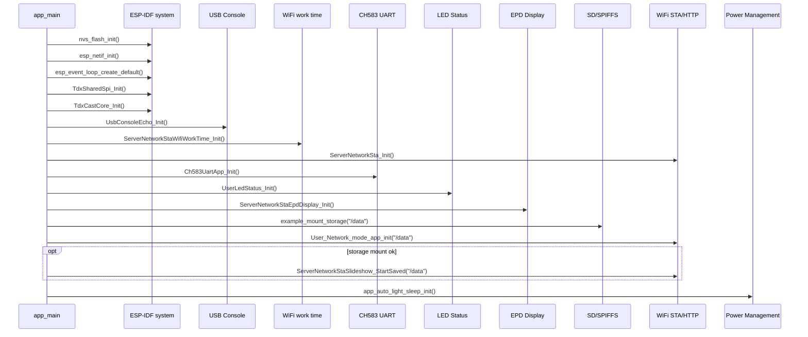


相关目录：

```text
main/
main/ch583_uart/
main/led_status/
main/epd_display/
main/server_network_sta/
main/usb_console_echo/
```

树状时序：

```text
main/main.c
└─ app_main()
   ├─ nvs_flash_init()
   ├─ esp_netif_init()
   ├─ esp_event_loop_create_default()
   ├─ TdxSharedSpi_Init()
   │  └─ tdx_shared_spi.c 创建 SD/EPD 共用 SPI 递归 mutex
   ├─ TdxCastCore_Init()
   ├─ UsbConsoleEcho_Init()
   │  └─ usb_console_echo/usb_console_echo.c
   │     ├─ UsbConsoleEcho_Task()
   │     ├─ 延迟 USB_CONSOLE_START_DELAY_MS 后开始接收 HTTP-like 请求
   │     └─ 存储相关路由在 storage ready 前由 router 返回 1012
   ├─ ServerNetworkStaWifiWorkTime_Init()
   │  └─ server_network_sta/wifi_work_time/server_network_sta_wifi_work_time.c
   │     └─ work_state_task()
   ├─ app_nvs_read_str(TDX_SLIDESHOW_RANDOM_NVS_KEY)
   ├─ app_nvs_write_str(TDX_SLIDESHOW_RANDOM_NVS_KEY)
   ├─ print_base_info()
   ├─ ServerNetworkSta_Init()
   │  └─ 创建全局 WiFi operation mutex
   ├─ Ch583UartApp_Init()
   │  └─ ch583_uart/ch583_uart_app.c
   │     ├─ User_UartEventTask()
   │     ├─ User_UartReceiveTask()
   │     └─ 先启动 CH583 UART，供 C5 GPIO/LED 状态使用
   ├─ UserLedStatus_Init()
   │  └─ led_status/led_status.c
   │     └─ UserLedStatus_Task()
   ├─ Init_Bl()
   │  └─ 仅 USER_BLE_ENABLE=1 时编译执行
   ├─ ServerNetworkStaEpdDisplay_Init()
   │  └─ epd_display/epd_display_app.cpp
   │     └─ ServerNetworkStaEpdDisplay_Task()
   ├─ example_mount_storage("/data")
   │  └─ mount.c
   ├─ User_Network_mode_app_init("/data")
   │  └─ server_network_sta/server_network_sta.c
   ├─ storage_ret == ESP_OK
   │  └─ ServerNetworkStaSlideshow_StartSaved("/data")
   │     └─ server_network_sta/slideshow/server_network_sta_slideshow.c
   └─ app_auto_light_sleep_init()
      └─ 网络、存储、轮播启动后再配置自动 light sleep
```

auto light sleep 接收链路注意事项：

```text
当前默认：
#define TDX_AUTO_LIGHT_SLEEP_ENABLE 0

原因：
CH583 UART1、USB Serial/JTAG、WiFi HTTP 都属于外部异步输入链路。
如果 ESP32-C5 在外部输入到达前进入 auto light sleep，唤醒阶段可能造成首包/首字节/首段数据不稳定。
CH583 UART1 已验证：短帧低频发送时，开启 auto light sleep 会导致 @# 帧头丢失；关闭 TDX_AUTO_LIGHT_SLEEP_ENABLE 后问题消失。
USB Serial/JTAG 和 WiFi HTTP 虽然机制不同，但同样可能受 auto light sleep 的唤醒延迟、USB FIFO/主机超时、WiFi PS/HTTP socket 超时影响。
因此开发阶段和需要可靠收包时，默认保持 TDX_AUTO_LIGHT_SLEEP_ENABLE=0。
```

---


存 / 取信息（含条件限制）：

```text
存：
- nvs_flash_init() 初始化 NVS 子系统，不直接写业务数据。
- 后续模块在启动中可能写入默认值：工作时长、EPD 类型、CH583 BLE MAC、轮播配置等。

取：
- EpdType_LoadSavedOrDefault() 读取已保存屏幕类型。
- example_mount_storage("/data") 挂载并读取 SD/SPIFFS 状态。
- User_Network_mode_app_init("/data") 读取已保存 WiFi 配置。
- ServerNetworkStaSlideshow_StartSaved("/data") 读取已保存轮播配置。
```

[⬆ 返回目录](#toc) | [↩ 返回当前目录](#sec-01)

---

## 2. 配置与公共参数 <span id="sec-02"></span>

Mermaid 配置依赖图：

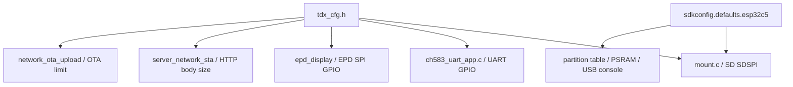


相关文件：

```text
main/tdx_cfg.h
sdkconfig.defaults
sdkconfig.defaults.esp32c5
partitions/v2/16m.csv
```

功能说明：

```text
tdx_cfg.h
├─ WiFi/HTTP/USB/OTA/body size 配置
├─ CH583 UART C5 引脚配置
├─ 运行期调试日志输出配置
├─ EPD C5 SPI/GPIO 配置
├─ SD SDSPI C5 引脚配置
├─ CH583 LED 控制配置
├─ mDNS 名称配置
└─ NVS key / slideshow / work time / EPD type 配置
```

关键配置方向：

```text
sdkconfig.defaults.esp32c5
└─ C5 build config
   ├─ 16MB Flash
   ├─ partitions/v2/16m.csv
   ├─ SDSPI: MOSI=1 MISO=25 CLK=6 CS=26
   ├─ Quad PSRAM
   ├─ USB Serial/JTAG console
   └─ CPU0 timer affinity

tdx_cfg.h
└─ C source include
   ├─ mount.c 读取 USER_SD_SPI_*
   ├─ display_bsp.cpp / epd_display_app.cpp 读取 USER_EPD_*
   ├─ ch583_uart_app.c 读取 USER_CH583_UART_*
   ├─ debug_output.c 读取 USER_DEBUG_OUTPUT_* / USER_DEBUG_UART_*
   ├─ led_status.c 读取 USER_LED_CH583_*
   ├─ network_ota_upload.c 读取 SERVER_NETWORK_STA_OTA_*
   └─ server_network_sta.c 读取 USER_MDNS_*
```

串口和调试输出约定：

```text
CH583 通信串口：
UART1
TX = GPIO24
RX = GPIO23
baud = 115200

运行期调试日志：
默认仍使用 USB Serial/JTAG
可在 tdx_cfg.h 中选择 UART0 或 USB+UART0
UART0 TX = GPIO11
UART0 RX = GPIO12
UART0 baud = 921600
```

说明：

```text
sdkconfig / sdkconfig.defaults 控制 bootloader、ESP-IDF 早期 console 和系统默认 console。
tdx_cfg.h 中的 USER_DEBUG_OUTPUT_TARGET 只控制 app_main() 调用 UserDebugOutput_Init() 之后的应用层日志输出。
应用层 `ESP_LOGx` 和已接入 `UserDebugOutput_Printf()` 的直接 `printf` 调试输出，都按 USER_DEBUG_OUTPUT_TARGET 路由。
如果要把 bootloader/早期 ESP-IDF console 也切到 UART0，必须修改 SDK configuration；只改 tdx_cfg.h 不会生效。
当前默认不修改 SDK configuration，继续保留 USB Serial/JTAG console。
UART0 调试启用时，GPIO11/GPIO12 不再作为 gpio_test 输出脚使用。
```

---


存 / 取信息（含条件限制）：

```text
存：
- 本节是编译期配置，不直接执行运行时存储。

取：
- 各模块通过 include tdx_cfg.h 读取路径、NVS key、GPIO、body size、EPD type、WiFi 工作时长等宏。
- sdkconfig.defaults.esp32c5 / partitions/v2/16m.csv 在构建期被 IDF 读取。
```

[⬆ 返回目录](#toc) | [↩ 返回当前目录](#sec-02)

---

## 3. NVS 配置读写 <span id="sec-03"></span>

Mermaid 时序图：

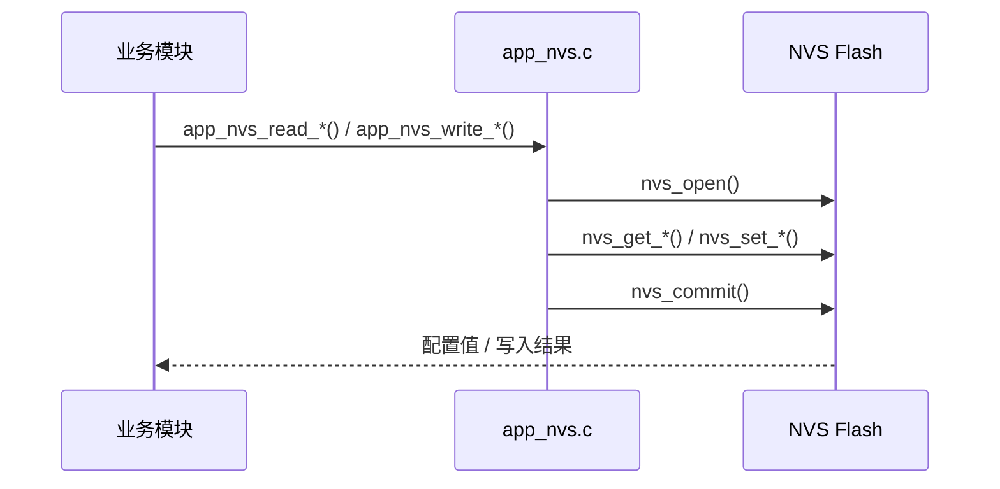


相关文件：

```text
main/app_nvs.c
main/tdx_cfg.h
```

树状时序：

```text
业务模块
├─ app_nvs_read_u8()
├─ app_nvs_write_u8()
├─ app_nvs_read_str()
└─ app_nvs_write_str()

调用来源
├─ epd_display/epd_type.cpp
│  ├─ EpdType_LoadSavedOrDefault()
│  └─ EpdType_SetAndSave()
├─ server_network_sta/wifi_work_time/server_network_sta_wifi_work_time.c
│  ├─ load_work_time_vars_from_app_nvs()
│  └─ save_work_time_vars_to_app_nvs()
├─ ch583_uart/ch583_wifi_uart_protocol.c
│  └─ ch583_wifi_handle_ble_mac()
└─ server_network_sta/slideshow/*
   └─ 保存 slideshow 状态和 last file
```

---


存 / 取信息（含条件限制）：

```text
存：
- app_nvs_write_u8(key, value)：写入 namespace="PhotoPainter" 的 u8。
  条件：key != NULL；nvs_open("PhotoPainter", NVS_READWRITE) 成功；nvs_set_u8() 成功后才 nvs_commit()。
- app_nvs_write_str(key, value)：写入 namespace="PhotoPainter" 的字符串。
  条件：key != NULL 且 value != NULL；nvs_open 成功；nvs_set_str() 成功后才 nvs_commit()。
- app_nvs_read_u8(key, out, default)：如果 key 不存在，会把 default 写入 NVS 并 commit。
  条件：key != NULL 且 out_value != NULL。

取：
- app_nvs_read_u8()：读取 u8；key 不存在时返回默认值并补写默认值。
- app_nvs_read_str()：读取字符串；条件为 key != NULL、value != NULL、value_size > 0。
- app_nvs_read_str() 使用 NVS_READONLY；打开失败或读取失败时，如 default_value 非 NULL，则把 default_value 拷到输出缓冲区。

主要调用：
- EPD 类型保存 / 读取。
- CH583 BLE MAC 保存 / 读取。
- WiFi 工作时间字符串兼容保存 / 读取。
```

[⬆ 返回目录](#toc) | [↩ 返回当前目录](#sec-03)

---

## 4. 存储挂载：SD / SPIFFS <span id="sec-04"></span>

Mermaid 流程图：

```mermaid
flowchart TD
    A[example_mount_storage /data] --> B{CONFIG_EXAMPLE_MOUNT_SD_CARD}
    B -- false --> C[mount_spiffs_storage]
    B -- true --> D{CONFIG_EXAMPLE_USE_SDMMC_HOST}
    D -- true --> E[esp_vfs_fat_sdmmc_mount]
    D -- false --> F[SDSPI_HOST_DEFAULT]
    F --> G[spi_bus_initialize]
    G --> H[esp_vfs_fat_sdspi_mount]
    C --> I[ensure_default_storage_dirs]
    H --> I
    I --> J[/data/bin_img + /data/jpg_img]
```


相关文件：

```text
main/mount.c
main/file_serving_example_common.h
```

树状时序：

```text
main/main.c
└─ app_main()
   └─ example_mount_storage("/data")
      └─ mount.c
         ├─ CONFIG_EXAMPLE_MOUNT_SD_CARD disabled
         │  └─ mount_spiffs_storage()
         └─ CONFIG_EXAMPLE_MOUNT_SD_CARD enabled
            ├─ CONFIG_EXAMPLE_USE_SDMMC_HOST
            │  └─ esp_vfs_fat_sdmmc_mount()
            └─ SDSPI path for C5
               ├─ SDSPI_HOST_DEFAULT()
               ├─ host.slot = USER_SD_SPI_HOST
               ├─ spi_bus_initialize()
               │  └─ ESP_ERR_INVALID_STATE 时复用 EPD 已初始化的 SPI bus
               ├─ esp_vfs_fat_sdspi_mount()
               ├─ ensure_default_storage_dirs()
               │  ├─ /data/bin_img
               │  └─ /data/jpg_img
               └─ example_print_storage_info()
```

辅助函数：

```text
mount.c
├─ ensure_storage_dir()
├─ ensure_default_storage_dirs()
├─ mount_spiffs_storage()
├─ example_storage_get_type()
├─ example_storage_is_sd_card()
├─ example_storage_supports_directories()
├─ example_storage_get_free_bytes()
└─ example_print_storage_info()
```

---


存 / 取信息（含条件限制）：

```text
存：
- SD 卡模式：挂载 /data 后创建默认目录：bin_img、jpg_img、cast_img 等。
- SPIFFS fallback：挂载 label="assets"，format_if_mount_failed=true。

取：
- example_storage_get_free_bytes() 读取 SD/FATFS 或 SPIFFS 剩余容量。
- example_print_storage_info() 读取挂载状态、容量、目录树、txt 文件内容。
- list_storage_tree() 扫描并打印 /data 下文件。
```

[⬆ 返回目录](#toc) | [↩ 返回当前目录](#sec-04)

---

## 5. WiFi STA 与 HTTP Server <span id="sec-05"></span>

Result 定义建议：

| 返回 | result | 说明 |
|---|---|---|
| `ping_result` | `0` | `/ping` 正常返回，包含 `Ble_MAC` |
| `ping_result` | `1405` | `Ble_MAC` 尚未从 CH583 获取；网络和 USB 当前均返回该错误码 |
| WiFi 连接事件通知 | `1307` | WiFi 连接超时 |
| WiFi 连接事件通知 | `1308` | WiFi 认证失败 |
| WiFi 连接事件通知 | `1309` | WiFi 获取 IP 失败 |

BLE / CH583 的普通 `wifi` 配网请求先同步确认“配置已保存并已提交 worker”，随后由后台任务通过 `wifi_result` 通知 `1307`（连接超时）、`1308`（认证失败）或 `1309`（已关联但未取得 IP）；`wifi_wakeup` 使用相同分类并通过 `wifi_wakeup_result` 通知。若 STA 已关联但主等待窗口内还没收到 `IP_EVENT_STA_GOT_IP`，会再等待一个短 `GOT_IP` 宽限窗口，避免 DHCP 稍慢时误报 `1309`。USB `/wifi` 仍只同步返回保存和 worker 提交结果。

Mermaid 时序图：

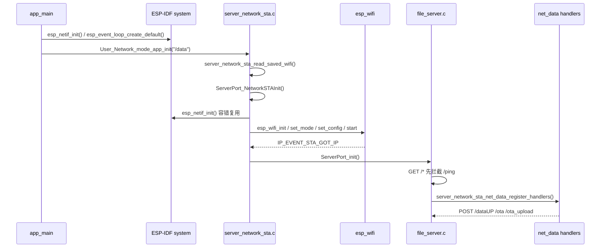


相关文件：

```text
main/server_network_sta/server_network_sta.c
main/server_network_sta/server_network_sta.h
main/file_server.c
```

WiFi 启动树状时序：

```text
main/main.c
└─ app_main()
   ├─ esp_netif_init()
   ├─ esp_event_loop_create_default()
   └─ User_Network_mode_app_init("/data")
      └─ server_network_sta/server_network_sta.c
         ├─ server_network_sta_read_saved_wifi()
         │  ├─ 先读 namespace="wifi" 的 ssid/password
         │  └─ 再读 namespace="nvs.net80211" 的 sta.ssid/sta.pswd
         ├─ ServerPort_NetworkSTAInit()
         │  ├─ esp_netif_init() 容错调用，ESP_ERR_INVALID_STATE 时复用 app_main 初始化结果
         │  ├─ esp_netif_get_handle_from_ifkey("WIFI_STA_DEF")
         │  ├─ 必要时 esp_netif_create_default_wifi_sta()
         │  ├─ esp_wifi_init()
         │  ├─ esp_event_handler_instance_register(WIFI_EVENT)
         │  ├─ esp_event_handler_instance_register(IP_EVENT_STA_GOT_IP)
         │  ├─ esp_wifi_set_mode(WIFI_MODE_STA)
         │  ├─ esp_wifi_set_config(WIFI_IF_STA)
         │  ├─ esp_wifi_start()
         │  └─ xEventGroupWaitBits()
         ├─ Mdns_init_config()
         │  ├─ mdns_init()
         │  ├─ mdns_hostname_set(USER_MDNS_HOSTNAME)
         │  └─ mdns_instance_name_set(USER_MDNS_INSTANCE_NAME)
         └─ ServerPort_init()
            └─ file_server.c
               └─ example_start_file_server("/data")
```

事件处理时序：

```text
ESP-IDF WiFi/IP event
└─ server_network_sta_event_handler()
   ├─ WIFI_EVENT_STA_DISCONNECTED
   │  ├─ server_network_sta_start_retry_timer()
   │  └─ esp_wifi_connect()
   └─ IP_EVENT_STA_GOT_IP
      ├─ server_network_sta_set_ps()
      ├─ xEventGroupSetBits(SERVER_NETWORK_STA_CONNECTED_BIT)
      └─ send_base_info_to_mobile()
         └─ ble/ble_data_handler.cpp
            └─ ch583_wifi_uart_send_wifi_data()
```

HTTP server 注册时序：

```text
file_server.c
└─ example_start_file_server()
   ├─ httpd_start()
   ├─ register GET /
   │  └─ index_html_get_handler()
   ├─ register GET /*
   │  └─ download_get_handler()
   │     ├─ ServerNetworkStaPing_ProcessGet(req)
   │     │  └─ 如果 URI 是 /ping，直接返回 ping JSON
   │     ├─ ServerNetworkStaSavedImages_SendThumbnail()
   │     └─ 普通静态文件 / 目录列表处理
   ├─ register legacy upload/delete
   │  ├─ upload_post_handler()
   │  └─ delete_post_handler()
   └─ server_network_sta_net_data_register_handlers()
      └─ server_network_sta/net_data/server_network_sta_data.c
         ├─ register POST /dataUP
         ├─ register POST /ota
         └─ register POST /ota_upload
```

HTTP server 内存与生命周期说明：

```text
当前工程按 HTTP server 单次启动设计。
file_server.c 中 server_data 为静态指针，example_start_file_server() 启动成功后持续使用。
在当前不 stop/restart HTTP server 的流程下，这不是运行期泄漏。
如果后续支持 WiFi 断开后 stop server、重连后 restart server，需要补充 httpd_stop(server)、free(server_data)、server_data=NULL 的释放路径。
```

auto light sleep / HTTP 接收注意事项：

```text
当前默认 TDX_AUTO_LIGHT_SLEEP_ENABLE=0，HTTP 接收可靠性优先。
如果开启 auto light sleep，WiFi 省电、CPU 唤醒延迟、HTTP socket 超时可能叠加影响网络请求。
表现可能是 /ping 偶发慢响应、POST /dataUP body 接收失败、httpd_req_recv() 返回错误、客户端认为连接超时或断开。
尤其是 App/PC 发送小 JSON 后立即等待响应，或者发送大 body/multipart/OTA 时，不建议启用 auto light sleep。
若后续必须开启，需要单独验证 WiFi PS、HTTP timeout、客户端重试策略和大包上传稳定性。
```

---


### V2 协议资料拆分：ping 连通性检查

请求：

```http
GET /ping HTTP/1.1
```

成功返回示例：

```json
{
  "func": "ping_result",
  "result": 0,
  "message": "ok",
  "Ble_MAC": "AABBCCDDEEFF"
}
```

说明：前端写操作前会优先访问缓存端点的 `/ping`。如果响应包含 `Ble_MAC` 或 `ble_mac`，需要与目标设备 MAC 一致，避免缓存 IP 指向错误设备。


存 / 取信息（含条件限制）：

```text
存：
- 本模块连接 WiFi 和启动 HTTP Server，不直接保存 WiFi 配置。

取：
- server_network_sta_read_saved_wifi() 优先读取 namespace="wifi" 的 ssid/password。
- 读取失败后读取 namespace="nvs.net80211" 的 sta.ssid / sta.pswd blob。
- IP_EVENT_STA_GOT_IP 后读取当前 IP、AP 信息，并启动 HTTP/mDNS。
```

[⬆ 返回目录](#toc) | [↩ 返回当前目录](#sec-05)

---

## 6. 网络 HTTP 数据入口汇总 <span id="sec-06"></span>

Mermaid 总入口图：

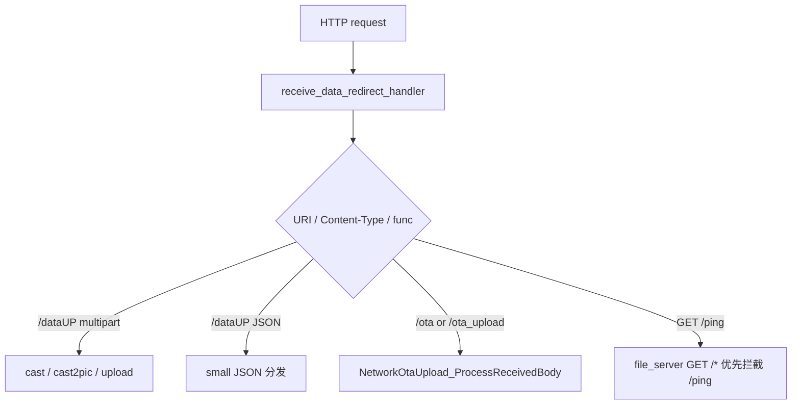


相关目录：

```text
main/server_network_sta/net_data/
main/server_network_sta/cast/
main/server_network_sta/cast2pic/
main/server_network_sta/upload/
main/server_network_sta/ota/
main/server_network_sta/delete/
main/server_network_sta/saved_images/
main/server_network_sta/snapshot/
main/server_network_sta/slideshow/
main/server_network_sta/slideshow_control/
main/server_network_sta/wifi_work_time/
main/server_network_sta/ping/
```

入口总览：

```text
HTTP POST /dataUP or /ota or /ota_upload
└─ server_network_sta/net_data/server_network_sta_data.c
   └─ receive_data_redirect_handler()
      ├─ get_request_header_value()
      ├─ ServerNetworkStaWifiWorkTime_OnNetworkData()
      ├─ NetworkOtaUpload_IsOtaRequest()
      ├─ alloc_request_body_buffer()
      ├─ read_request_body_to_buffer()
      ├─ send_dataup_error_response()
      ├─ OTA request
      │  └─ NetworkOtaUpload_ProcessReceivedBody()
      ├─ small JSON request
      │  └─ process_small_json_request()
      └─ multipart request
         ├─ ServerNetworkStaCast2Pic_Process()
         ├─ ServerNetworkStaCast_Process()
         ├─ ServerNetworkStaUpload_Process()
         └─ process_multipart_upload_request()
```

内存管理说明：

```text
/dataUP 当前实现会先通过 alloc_request_body_buffer() 申请 request body 缓冲区，优先使用 PSRAM。
read_request_body_to_buffer() 会把完整 body 读入内存后再分发，不是 streaming parse，也不是边收边写。
处理结束后由 receive_data_redirect_handler() 调用 heap_caps_free(body) 释放缓冲区。

风险：
- 大图片、大 multipart、OTA 都依赖 PSRAM 可用空间和 HTTP body 最大长度限制。
- OTA 当前同样依赖 HTTP body 完整接收后再解析 firmware part，然后再写 OTA 分区。
- 如果后续要降低内存峰值，建议改成 streaming parse / 边收边写 SD / 边收边写 OTA。

当前主要 body 限制：
- 普通 `/dataUP` 最大 body：`SERVER_NETWORK_STA_DATAUP_MAX_BODY_SIZE = 2MB`。
- 小 JSON 最大 body：`SERVER_NETWORK_STA_SMALL_JSON_BODY_MAX = 4096 bytes`。
- OTA 最大 body：`SERVER_NETWORK_STA_OTA_UPLOAD_MAX_BODY_SIZE = 6MB`。
- OTA multipart 预留开销：`SERVER_NETWORK_STA_OTA_MULTIPART_OVERHEAD_BYTES = 64KB`。
- USB HTTP-like body 最大值复用：`USB_CONSOLE_HTTP_BODY_MAX = SERVER_NETWORK_STA_DATAUP_MAX_BODY_SIZE`。

非 OTA `/dataUP` 超过最大 body 时保留 HTTP 413 并返回 `dataup_result/1006` JSON；request body 缓冲区分配失败时保留 HTTP 500 并返回 `dataup_result/1011` JSON。OTA 请求继续使用独立的 `ota_result/170x` 错误映射。
```

存 / 取信息（含条件限制）：

```text
存：
- net_data 入口本身只在 RAM/PSRAM 中申请 request body 缓冲区，处理完成后释放。
- 真正持久化由下游模块完成：cast/upload/cast2pic 写 SD，ota 写 OTA 分区，slideshow 写配置文件，wifi_work_time 写 NVS。

取：
- 从 HTTP request 读取 header、body、multipart boundary、JSON func。
- 根据 URI、Content-Type、func 分发到对应模块。
```


### 6.1 网络 HTTP 数据入口：dataUP <span id="sec-06-1"></span>

Mermaid 时序图：

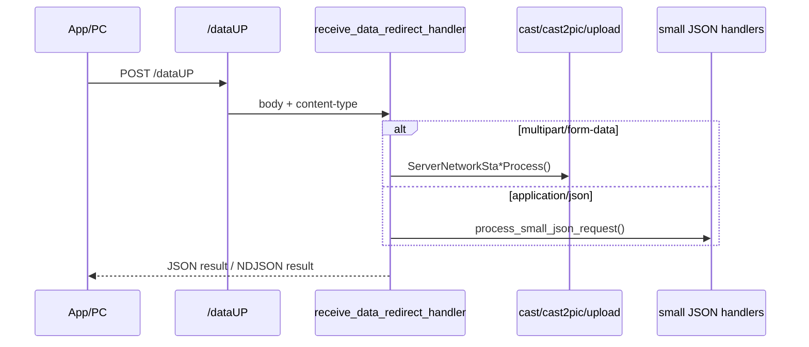


```text
HTTP POST /dataUP
└─ server_network_sta/net_data/server_network_sta_data.c
   └─ receive_data_redirect_handler()
      ├─ get_request_header_value()
      ├─ ServerNetworkStaWifiWorkTime_OnNetworkData()
      ├─ alloc_request_body_buffer()
      ├─ read_request_body_to_buffer()
      ├─ small JSON request
      │  └─ process_small_json_request()
      └─ multipart request
         ├─ ServerNetworkStaCast2Pic_Process()
         ├─ ServerNetworkStaCast_Process()
         ├─ ServerNetworkStaUpload_Process()
         └─ process_multipart_upload_request()
```


### V2 协议资料拆分：HTTP 图片与控制接口总览

`V2_相框传图协议.html` 中 HTTP 部分统一说明：图片类接口使用 `POST /dataUP` + `multipart/form-data`，JSON 控制类接口使用 `POST /dataUP` + JSON，连通性检查使用 `GET /ping`。

| func / path | 分类 | 放入本文档章节 | 请求格式 |
|---|---|---|---|
| `cast` | multipart 图片接口 | [7.1 cast：投屏业务模块](#sec-07-1) | `POST /dataUP` + multipart |
| `upload` | multipart 图片接口 | [7.11 upload：PC或手机传文件到ESP32-C5，并存](#sec-07-11) | `POST /dataUP` + multipart |
| `cast2pic` | multipart 图片接口 | [7.2 cast2pic：投屏转图片缓存 / 显示](#sec-07-2) | `POST /dataUP` + multipart |
| `update` | multipart 图片接口，前端预留 | 本节保留说明 | `POST /dataUP` + multipart |
| `get_saved_images` | JSON 控制接口 | [7.7 get_saved_images：取出本地存储图片](#sec-07-7) | `POST /dataUP` + JSON |
| `get_snapshot` | JSON 控制接口 | [7.10 snapshot：读取图片列表和轮播状态](#sec-07-10) | `POST /dataUP` + JSON |
| `start_slideshow` | JSON 控制接口 | [7.8 slideshow：图片轮播的文件列表，轮播间隔，是否随机](#sec-07-8) | `POST /dataUP` + JSON |
| `set_slideshow` | JSON 控制接口 | [7.9 slideshow_control：轮播控制模块](#sec-07-9) | `POST /dataUP` + JSON |
| `delete` | JSON 控制接口 | [7.3 delete：图片 / 缓存文件删除逻辑](#sec-07-3) | `POST /dataUP` + JSON |
| `set_wifi_work_time` | JSON 控制接口 | [7.12 wifi_work_time：WiFi 省电管理](#sec-07-12) | `POST /dataUP` + JSON |
| `/ping` | HTTP GET | [5. WiFi STA 与 HTTP Server](#sec-05) | `GET /ping` |

`update` 在 V2 协议中是“替换旧图片，当前前端预留”：字段包括 `oldfileNames`、`newfileNames`、`bin_size`、`image_size`、`save`、`show`、`bin`、`image`。当前 `main/CMakeLists.txt` 已列出 `cast`、`cast2pic`、`upload` 等网络模块，但没有单独列出 `server_network_sta/update` 源文件，因此本文只记录为 V2 预留接口，不写成当前已实现链路。


存 / 取信息（含条件限制）：

```text
存：
- /dataUP 入口不直接持久化；按 func 转交下游模块。

取：
- 读取 HTTP body 到内存缓冲区。
- multipart 请求读取 boundary 和各 part。
- JSON 请求读取 func 后转入 small JSON 分发。
```

[⬆ 返回目录](#toc) | [↩ 返回当前目录](#sec-06)

### 6.2 网络 HTTP 数据入口：ota <span id="sec-06-2"></span>

Mermaid 时序图：

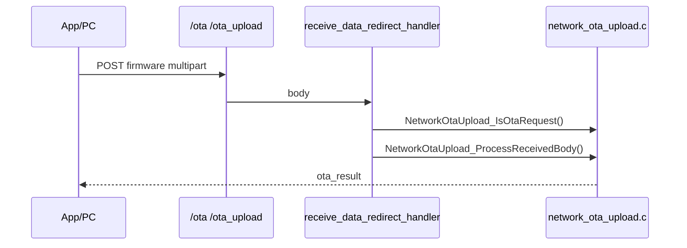


```text
HTTP POST /ota or /ota_upload
└─ server_network_sta/net_data/server_network_sta_data.c
   └─ receive_data_redirect_handler()
      ├─ get_request_header_value()
      ├─ ServerNetworkStaWifiWorkTime_OnNetworkData()
      ├─ NetworkOtaUpload_IsOtaRequest()
      ├─ NetworkOtaUpload_GetMaxBodySize()
      ├─ alloc_request_body_buffer()
      ├─ read_request_body_to_buffer()
      └─ NetworkOtaUpload_ProcessReceivedBody()
```


存 / 取信息（含条件限制）：

```text
存：
- OTA 请求最终由 network_ota_upload 写入 OTA update partition，并设置 boot partition。

取：
- 读取 multipart meta 与 firmware/bin 字段。
- 读取当前 running partition、固件 app_desc、目标 OTA partition 信息。
```

[⬆ 返回目录](#toc) | [↩ 返回当前目录](#sec-06)

### 6.3 网络 HTTP 数据入口：small JSON <span id="sec-06-3"></span>

Mermaid 分发图：

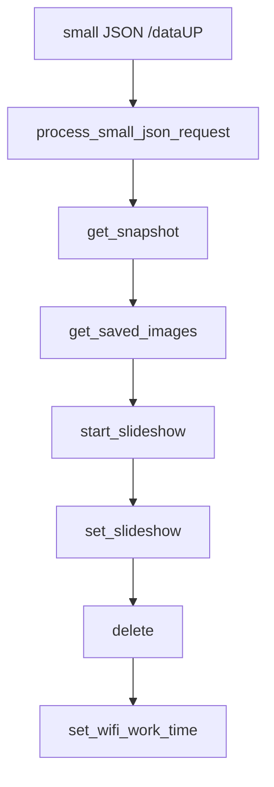


small JSON 分发：

```text
process_small_json_request()
├─ ServerNetworkStaSnapshot_ProcessJson()
├─ ServerNetworkStaSavedImages_ProcessJson()
├─ ServerNetworkStaSlideshow_ProcessJson()
├─ ServerNetworkStaSlideshowControl_ProcessJson()
├─ ServerNetworkStaDelete_ProcessJson()
└─ ServerNetworkStaWifiWorkTime_ProcessJson()
```

说明：这里按 `server_network_sta_data.c` 的实际调用顺序记录；每个处理函数返回 `ESP_ERR_NOT_SUPPORTED` 时继续尝试下一个。

GET /ping：

```text
HTTP GET /ping
└─ file_server.c
   └─ download_get_handler()
      ├─ ServerNetworkStaPing_ProcessGet(req)
      │  ├─ ServerNetworkStaWifiWorkTime_OnNetworkData()
      │  ├─ get_ble_mac_no_colon()
      │  └─ httpd_resp_sendstr()
      └─ 非 /ping 时继续走缩略图/静态文件/目录列表处理
```

---


存 / 取信息（含条件限制）：

```text
存：
- small JSON 入口不直接存储。
- set_slideshow / start_slideshow / set_wifi_work_time 等由对应模块保存到文件或 NVS。

取：
- 读取 JSON func 字段。
- 根据源码顺序依次尝试 snapshot、saved_images、slideshow、slideshow_control、delete、wifi_work_time。
```

[⬆ 返回目录](#toc) | [↩ 返回当前目录](#sec-06)

---

## 7. 网络HTTP功能汇总 <span id="sec-07"></span>

本章把原来的 `cast`、`cast2pic`、`upload`、`ota`、`delete`、`saved_images`、`slideshow`、`slideshow_control`、`snapshot`、`ping`、`wifi_work_time` 等网络 HTTP 功能重新归到一个二级目录下。  
入口主要来自 `POST /dataUP`、`POST /ota`、`POST /ota_upload`；`GET /ping` 由 `file_server.c` 的 `GET /* -> download_get_handler()` 优先拦截。

Mermaid 总体分发图：

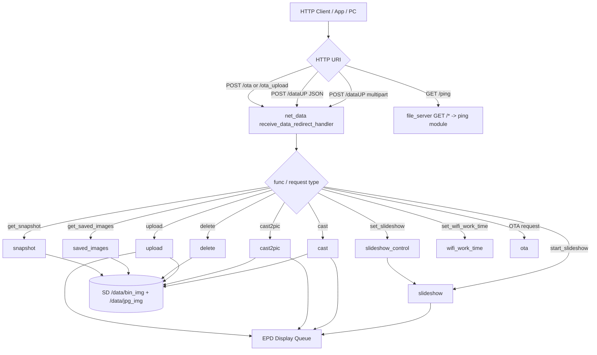

相关目录：

```text
main/server_network_sta/net_data/
main/server_network_sta/cast/
main/server_network_sta/cast2pic/
main/server_network_sta/delete/
main/server_network_sta/ota/
main/server_network_sta/ping/
main/server_network_sta/saved_images/
main/server_network_sta/slideshow/
main/server_network_sta/slideshow_control/
main/server_network_sta/snapshot/
main/server_network_sta/upload/
main/server_network_sta/wifi_work_time/
```

树状时序总览：

```text
HTTP request
├─ GET /ping
│  └─ ServerNetworkStaPing_ProcessGet()
└─ POST /dataUP / /ota / /ota_upload
   └─ receive_data_redirect_handler()
      ├─ NetworkOtaUpload_IsOtaRequest()
      │  └─ NetworkOtaUpload_ProcessReceivedBody()
      ├─ multipart func=cast
      │  └─ ServerNetworkStaCast_Process()
      ├─ multipart func=cast2pic
      │  └─ ServerNetworkStaCast2Pic_Process()
      ├─ multipart func=upload
      │  └─ ServerNetworkStaUpload_Process()
      └─ small JSON func
         ├─ ServerNetworkStaSavedImages_ProcessJson()
         ├─ ServerNetworkStaSnapshot_ProcessJson()
         ├─ ServerNetworkStaDelete_ProcessJson()
         ├─ ServerNetworkStaSlideshow_ProcessJson()
         ├─ ServerNetworkStaSlideshowControl_ProcessJson()
         └─ ServerNetworkStaWifiWorkTime_ProcessJson()
```

关键辅助函数：

```text
receive_data_redirect_handler()
├─ get_request_header_value()
├─ ServerNetworkStaWifiWorkTime_OnNetworkData()
├─ NetworkOtaUpload_IsOtaRequest()
├─ alloc_request_body_buffer()
├─ read_request_body_to_buffer()
├─ process_small_json_request()
└─ server_network_sta_net_data_register_handlers()
```


Powershell 测试公共变量：

```powershell
# 设备 IP，按实际设备 IP 修改。
$esp = "http://192.168.1.104"

# 测试用文件路径，按实际 PC 文件修改。
$bin = "H:\AI2\test\26422.bin"
$jpg = "H:\AI2\test\26422.jpg"

# 计算 multipart 里要带的大小字段。
$binSize = (Get-Item $bin).Length
$jpgSize = (Get-Item $jpg).Length
```

说明：

```text
- JSON 接口优先使用 Invoke-RestMethod。
- multipart/form-data 接口使用 curl.exe -F，避免 Windows PowerShell 5.1 手工拼 multipart。
- 所有测试前先确认设备已经联网，且 $esp 能访问。
```
V2 协议资料拆分：

```text
V2 协议中，HTTP 图片与控制协议主要使用：
├─ POST /dataUP + multipart/form-data
│  ├─ cast
│  ├─ upload
│  ├─ cast2pic
│  └─ update（前端预留）
├─ POST /dataUP + JSON
│  ├─ get_saved_images
│  ├─ get_snapshot
│  ├─ start_slideshow
│  ├─ set_slideshow
│  ├─ delete
│  └─ set_wifi_work_time
└─ GET /ping
   └─ ping_result
```

---

存 / 取信息（含条件限制）：

```text
存：
- 图片类：/data/bin_img/*.bin，/data/jpg_img/*.jpg。
- 状态类：last cast 记录、slideshow_config、show_control / slideshow control 文件。
- OTA 类：OTA update partition。
- WiFi 工作时间：NVS blob + PhotoPainter 字符串 key。

取：
- 图片列表从 /data/jpg_img 扫描。
- snapshot 读取图片列表和轮播配置。
- ping 读取 CH583 BLE MAC。
- slideshow 启动时读取保存的轮播配置。
```


### 7.1 cast：投屏业务模块 <span id="sec-07-1"></span>

Result 定义建议：

| 返回 | result | 说明 |
|---|---|---|
| `cast_received` | `0` | 已收到并开始处理 cast |
| `cast_result` | `0` | cast 成功 |
| `cast_result` | `1601` | multipart boundary 缺失 |
| `cast_result` | `1602` | multipart `func` 缺失 |
| `cast_result` | `1603` | 上传内容格式非法 |
| `cast_result` | `1604` | `bin` 缺失 |
| `cast_result` | `1605` | `image` 缺失 |
| `cast_result` | `1606` | `bin_size` / `image_size` 与实际数据不一致 |
| `cast_result` | `1607` | 保存 bin 失败 |
| `cast_result` | `1608` | 保存 image 失败 |
| `cast_result` | `1609` | EPD 显示队列提交失败 |
| `cast_result` | `1008` | EPD 同步显示等待或驱动 BUSY 超时 |
| `cast_result` | `1011` | EPD 显示 buffer / completion 内存不足 |
| `cast_result` | `1012` | 存储未就绪 |
| `cast_result` | `1013` | 存储空间不足 |
| `cast_result` | `1016` | 保存队列创建或提交失败 |
| `cast_result` | `1804` | EPD 驱动尺寸校验、SPI 写入或其他执行失败 |
| `cast_result` | `1610` | `last_cast.txt` 保存失败 |
| `cast_result` | `1611` | 当前 network cast 要求 `save=true`，否则不能记录 last cast |
| `cast_result` | `1612` | `fileName` 非法 |

功能说明：接收设备投屏数据流，校验主图和缩略图字段，保存到 SD 卡，并在 `show=true` 时下发到电子墨水屏显示。

Mermaid 时序图：

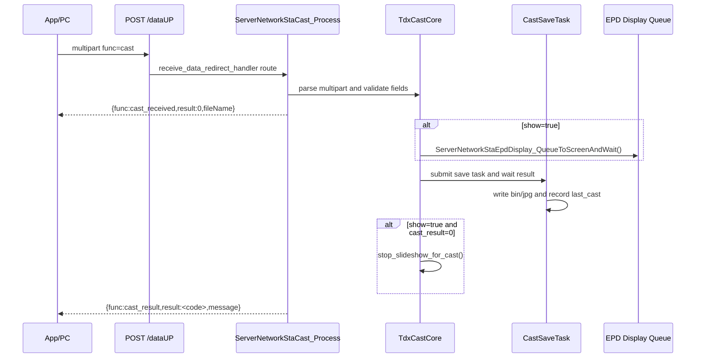

相关文件：

```text
main/server_network_sta/cast/server_network_sta_cast.c
main/server_network_sta/cast/server_network_sta_cast.h
main/cast_core/cast_core.c
main/cast_core/cast_core.h
main/epd_display/epd_display_app.cpp
```

树状时序：

```text
HTTP multipart /dataUP
└─ receive_data_redirect_handler()
   └─ ServerNetworkStaCast_Process()
      ├─ TdxCastCore_ParseAndValidate()
      │  ├─ UsbConsoleCommon_ExtractBoundary()
      │  ├─ UsbConsoleCommon_MultipartParts()
      │  ├─ UsbConsoleCommon_FileNameIsSafe()
      │  └─ validate bin_size/image_size/save/show
      ├─ send cast_received chunk
      ├─ TdxCastCore_ProcessValidated()
      │  ├─ show=true
      │  │  └─ ServerNetworkStaEpdDisplay_QueueToScreenAndWait()
      │  └─ save=true
      │     └─ CastSaveTask
      │        ├─ check_save_space()
      │        ├─ save /data/bin_img/<fileName>.bin
      │        ├─ save /data/jpg_img/<fileName>.jpg
      │        └─ record /data/bin_img/last_cast.txt
      ├─ show=true 且 cast_result=0 时 stop_slideshow_for_cast()
      └─ send cast_result chunk
```

关键辅助函数：

```text
server_network_sta_cast.c
├─ send_cast_received()
├─ send_cast_result()
└─ ServerNetworkStaCast_Process()

cast_core.c
├─ TdxCastCore_ParseAndValidate()
├─ TdxCastCore_ProcessValidated()
├─ CastSaveTask()
├─ stop_slideshow_for_cast()
└─ record_last_cast()
```

说明：network cast 与 USB cast 共享 `cast_core`。EPD 显示使用已有的 `ServerNetworkStaEpdDisplay` task，保存使用统一的 `CastSaveTask`。network cast 正常成功时使用 `application/x-ndjson` 两阶段返回：multipart 解析和字段校验通过后先返回 `cast_received`；EPD 显示、bin/jpg 保存和 last_cast 记录完成后再返回 `cast_result`。`show=true && save=true` 时先通过 `ServerNetworkStaEpdDisplay_QueueToScreenAndWait()` 等待 EPD 显示任务完成，再提交保存任务；如果整体成功且 `show=true`，最后调用 `stop_slideshow_for_cast()` 停止轮播。`cast_result result=0` 表示 EPD 显示任务已完成、bin/jpg 保存成功、last_cast 写入成功。

V2 协议资料拆分：

```http
POST /dataUP HTTP/1.1
Content-Type: multipart/form-data

func=cast
fileName=26422
bin_size=123456
image_size=23456
save=true
show=true
bin=@26422.bin
image=@26422.jpg
```

字段说明：

```text
func       固定为 cast
fileName   图片主文件名，不带扩展名
bin_size   bin 主图数据大小
image_size jpg 缩略图大小
save       当前必须为 true；save=false 会返回 save_required_for_last_cast
show       是否立即显示
bin        主图 bin 文件
image      缩略图 jpg 文件
```

成功返回：

```text
{"func":"cast_received","result":0,"fileName":"26422"}
{"func":"cast_result","result":0,"message":"saved"}
```

V2 说明：`cast` 成功后应记录最后一次投图，设备重启或 OTA 后优先显示该图片。

当前源码注意点：

```text
network cast 当前要求 save=true。
如果 save=false，设备返回 cast_result 失败，error=save_required_for_last_cast。
原因是 cast 成功后需要保存 bin/jpg，并记录 /data/bin_img/last_cast.txt，供重启或 OTA 后恢复显示。

show/save 顺序：
1. show=true 时，先把当前请求中的 bin 投递到 EPD 显示任务并等待完成。
2. save=true 时，再保存 bin/jpg 到 SD。
3. 保存成功后写入 /data/bin_img/last_cast.txt。
```


Powershell 测试用例：

```powershell
# cast：上传 bin + jpg，并立即显示。
$esp = "http://192.168.1.104"
$bin = "H:\AI2\test\26422.bin"
$jpg = "H:\AI2\test\26422.jpg"
$binSize = (Get-Item $bin).Length
$jpgSize = (Get-Item $jpg).Length

curl.exe -X POST "$esp/dataUP" `
  -F "func=cast" `
  -F "fileName=26422" `
  -F "bin_size=$binSize" `
  -F "image_size=$jpgSize" `
  -F "save=true" `
  -F "show=true" `
  -F "bin=@$bin;type=application/octet-stream" `
  -F "image=@$jpg;type=image/jpeg"
```

预期：设备返回 `cast_result`，`result=0` 表示成功；如果 `show=true`，返回前已经等待本次 EPD 显示任务完成。`save=false` 会返回失败，不作为“只显示不保存”的 cast 用法。

存 / 取信息（含条件限制）：

```text
存：
- TdxCastCore_ProcessValidated() 先等待 EPD 显示任务完成，再提交 CastSaveTask。
- CastSaveTask 写入：/data/bin_img/<fileName>.bin。
- CastSaveTask 写入：/data/jpg_img/<fileName>.jpg。
- CastSaveTask 使用 <fileName>.<ext>.tmp 临时文件，写完校验大小后 rename 成正式文件。
- CastSaveTask 写入 last cast 记录文件，路径在 /data/bin_img/ 下。

取：
- check_save_space() 通过 example_storage_get_free_bytes() 读取剩余空间。
- 显示时下发已收到的 bin 数据到 EPD 显示任务；保存和显示串行，cast_result=0 等 EPD 显示任务、保存与 last_cast 成功。
- 重启恢复时可读取 last cast 记录。
```

[⬆ 返回目录](#toc) | [↩ 返回当前目录](#sec-07)

---

### 7.2 cast2pic：投屏转图片缓存 / 显示 <span id="sec-07-2"></span>

Result 定义建议：

| 返回 | result | 说明 |
|---|---|---|
| `cast2pic_result` | `0` | cast2pic 成功 |
| `cast2pic_result` | `1012` | 存储未就绪 |
| `cast2pic_result` | `1013` | 存储空间不足 |
| `cast2pic_result` | `1601` | multipart boundary 缺失 |
| `cast2pic_result` | `1602` | multipart `func` 缺失 |
| `cast2pic_result` | `1603` | 上传内容格式非法 |
| `cast2pic_result` | `1604` | `bin` 缺失 |
| `cast2pic_result` | `1605` | `image` 缺失 |
| `cast2pic_result` | `1606` | 声明大小和实际大小不一致 |
| `cast2pic_result` | `1607` | 保存 bin 失败 |
| `cast2pic_result` | `1608` | 保存 image 失败 |
| `cast2pic_result` | `1609` | EPD 显示队列提交失败 |
| `cast2pic_result` | `1008` | EPD 同步显示等待或驱动 BUSY 超时 |
| `cast2pic_result` | `1011` | EPD 显示 buffer / completion 内存不足 |
| `cast2pic_result` | `1016` | 保存队列创建或提交失败 |
| `cast2pic_result` | `1804` | EPD 驱动执行失败 |
| `cast2pic_result` | `1612` | 文件名非法 |
| `cast2pic_result` | `1616` | `screen` 不是 `a` / `b` |
| `cast2pic_result` | `1617` | `screen` 当前实现不支持 |

失败返回会附带 `error` 字段，内容为源码中的具体错误名，例如 `missing_bin_file`、`storage_not_enough`、`display_request_failed`。

功能说明：网络 `cast2pic` 用于单次刷新指定屏幕，当前源码只接受 `screen=a` 或 `screen=b`，并且 `CAST2PIC_MAX_IMAGES=1`。`screen=ab` 只属于 USB `cast2pic` 侧能力，不写入网络 HTTP 流程。

Mermaid 时序图：

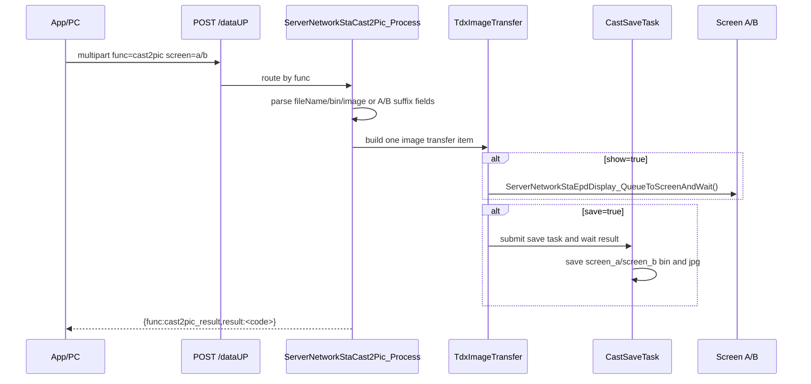

相关文件：

```text
main/server_network_sta/cast2pic/server_network_sta_cast2pic.c
main/server_network_sta/cast2pic/server_network_sta_cast2pic.h
main/cast_core/cast_core.c
main/cast_core/cast_core.h
```

树状时序：

```text
HTTP multipart /dataUP
└─ receive_data_redirect_handler()
   └─ ServerNetworkStaCast2Pic_Process()
      ├─ extract_boundary()
      ├─ parse_cast2pic_multipart()
      ├─ assign_text_part()
      ├─ assign_image_part()
      ├─ validate_cast2pic_meta()
      ├─ screen_to_epd_number()
      ├─ build tdx_image_transfer_item_t
      ├─ TdxImageTransfer_ProcessItems()
      │  ├─ show=true
      │  │  └─ ServerNetworkStaEpdDisplay_QueueToScreenAndWait()
      │  └─ save=true
      │     └─ CastSaveTask
      │        ├─ save /data/bin_img/screen_a.bin or screen_b.bin
      │        └─ save /data/jpg_img/screen_a.jpg or screen_b.jpg
      └─ send_cast2pic_result()
```

关键辅助函数：

```text
server_network_sta_cast2pic.c
├─ extract_boundary()
├─ parse_cast2pic_multipart()
├─ assign_text_part()
├─ assign_image_part()
├─ validate_cast2pic_meta()
├─ screen_to_epd_number()
├─ process_cast2pic_items()
├─ send_cast2pic_core_result()
└─ ServerNetworkStaCast2Pic_Process()

cast_core.c
├─ TdxImageTransfer_ProcessItems()
└─ CastSaveTask()
```

说明：network cast2pic 与 USB cast2pic 共享 `TdxImageTransfer_ProcessItems()` 和 `CastSaveTask`。`show` 和 `save` 是独立动作：`show=true` 时先等待 EPD 显示任务完成；`save=true` 时再提交保存任务；`show=false` 不显示，`save=false` 不保存。`cast2pic_result=0` 表示需要显示的 EPD 任务已完成、需要保存的文件已保存完成。

当前源码协议资料拆分（以 `server_network_sta_cast2pic.c` 为准）：

```http
POST /dataUP HTTP/1.1
Content-Type: multipart/form-data

func=cast2pic
screen=a
save=true
show=true
fileName=26422
bin_size=123456
image_size=23456
bin=@26422.bin
image=@26422.jpg

兼容字段：
fileNameA / bin_sizeA / image_sizeA / binA / imageA
fileNameB / bin_sizeB / image_sizeB / binB / imageB
```

字段说明：

```text
func     固定为 cast2pic
screen   只接受 a 或 b；a 映射到 EPD2，b 映射到 EPD1；不接受 ab
save     是否保存
show     是否立即显示
当前网络版本只处理 1 组 fileName/bin/image；无后缀、A 后缀、B 后缀字段都可作为这一组输入，超过 1 组会被忽略或不进入有效流程
```

screen 映射注意：

```text
screen=a -> epd_number=2 -> 保存为 /data/bin_img/screen_b.bin 和 /data/jpg_img/screen_b.jpg
screen=b -> epd_number=1 -> 保存为 /data/bin_img/screen_a.bin 和 /data/jpg_img/screen_a.jpg

这里不是直观的 a->screen_a、b->screen_b。
源码为了硬件兼容做了反向保存映射，显示投递也按 epd_number 执行。
```

成功返回：

```json
{
  "func": "cast2pic_result",
  "result": 0
}
```


Powershell 测试用例：

```powershell
# 网络 cast2pic：当前源码只支持 screen=a 或 screen=b，不写 screen=ab。
$esp = "http://192.168.1.104"
$bin = "H:\AI2\test\26423.bin"
$jpg = "H:\AI2\test\26423.jpg"
$binSize = (Get-Item $bin).Length
$jpgSize = (Get-Item $jpg).Length
$screen = "a"

curl.exe -X POST "$esp/dataUP" `
  -F "func=cast2pic" `
  -F "screen=$screen" `
  -F "fileNameA=26423" `
  -F "bin_sizeA=$binSize" `
  -F "image_sizeA=$jpgSize" `
  -F "save=true" `
  -F "show=true" `
  -F "binA=@$bin;type=application/octet-stream" `
  -F "imageA=@$jpg;type=image/jpeg"
```

预期：设备返回 `cast2pic_result`，`result=0` 表示成功；`screen` 只能测试 `a` 或 `b`。

存 / 取信息（含条件限制）：

```text
存：
- 保存当前 1 组图片对应的 .bin 和 .jpg 到 /data/bin_img 与 /data/jpg_img。
- screen=a 保存为 screen_b.bin / screen_b.jpg；screen=b 保存为 screen_a.bin / screen_a.jpg。
- 使用临时文件写入再 rename，避免半文件覆盖正式文件。

取：
- 读取 multipart 中的 fileName/bin_size/image_size/bin/image，兼容 A/B 后缀字段。
- 根据 screen=a/b 转成 EPD screen number 后等待显示任务完成；screen=a -> EPD2，screen=b -> EPD1。
- 写入前读取剩余空间做容量检查。
```

[⬆ 返回目录](#toc) | [↩ 返回当前目录](#sec-07)

---

### 7.3 delete：图片 / 缓存文件删除逻辑 <span id="sec-07-3"></span>

Result 定义建议：

| 返回 | result | 说明 |
|---|---|---|
| `delete_result` | `0` | 删除成功 |
| `delete_result` | `1001` | JSON 格式错误 |
| `delete_result` | `1003` | 缺少必要字段 |
| `delete_result` | `1501` | `fileNames` 缺失或为空 |
| `delete_result` | `1502` | 文件名非法 |
| `delete_result` | `1503` | 删除指定 bin/jpg 文件失败，或指定文件均不存在/未删除 |

功能说明：只删除 JSON `fileNames` 指定的图片和缩略图文件。delete 不清理、不修改 `last_cast.txt`、`slideshow_config.txt`、`show_control.txt`，也不清理 NVS 中的轮播进度。

Mermaid 时序图：

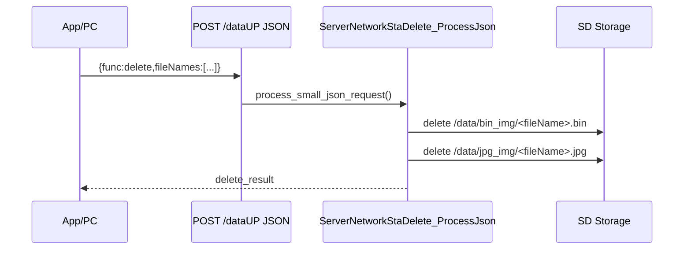

相关文件：

```text
main/server_network_sta/delete/server_network_sta_delete.c
main/server_network_sta/delete/server_network_sta_delete.h
```

树状时序：

```text
HTTP small JSON delete
└─ receive_data_redirect_handler()
   └─ process_small_json_request()
      └─ ServerNetworkStaDelete_ProcessJson()
         ├─ parse_file_names()
         ├─ delete_one_path(/data/bin_img/*.bin)
         ├─ delete_one_path(/data/jpg_img/*.jpg)
         └─ send_delete_result()
```

关键辅助函数：

```text
server_network_sta_delete.c
├─ parse_file_names()
├─ delete_one_path()
└─ ServerNetworkStaDelete_ProcessJson()
```

V2 协议资料拆分：

```json
{
  "func": "delete",
  "fileNames": ["26422", "26423"]
}
```

字段说明：

```text
func       固定为 delete
fileNames  要删除的图片文件名数组，不带扩展名
```


Powershell 测试用例：

```powershell
# delete：删除一张或多张已保存图片。
$esp = "http://192.168.1.104"
$body = @{
  func = "delete"
  fileNames = @("26422", "26423")
} | ConvertTo-Json -Depth 4

Invoke-RestMethod -Uri "$esp/dataUP" `
  -Method Post `
  -ContentType "application/json" `
  -Body $body
```

预期：设备返回 `delete_result`；删除成功后只删除对应 `.bin`、`.jpg`，不会修改 last cast / slideshow 相关配置。

存 / 取信息（含条件限制）：

```text
存：
- 删除动作会修改持久化文件系统：unlink /data/bin_img/<file>.bin 与 /data/jpg_img/<file>.jpg。
- 不修改 /data/bin_img/last_cast.txt。
- 不修改 /data/bin_img/slideshow_config.txt。
- 不修改 /data/bin_img/show_control.txt。
- 不修改 NVS 中的 slideshow progress / last slideshow 状态。

取：
- 读取 JSON fileNames 数组。
- 不读取 last_cast / slideshow 配置。
```

[⬆ 返回目录](#toc) | [↩ 返回当前目录](#sec-07)

---

### 7.4 net_data：通用网络数据封装 <span id="sec-07-4"></span>

Result 定义建议：

| 返回 | result | 说明 |
|---|---|---|
| `dataup_result` | `0` | `/dataUP` 普通上传成功 |
| `dataup_result` | `1006` | body 超过限制 |
| `dataup_result` | `1007` | 上传忙 |
| `dataup_result` | `1001` | JSON 格式错误 |
| `unknown_result` | `1002` | JSON `func` 不支持 |
| 下游 `*_result` | 参考对应功能 | `cast` / `upload` / `cast2pic` / `delete` 等模块返回自己的 result |

功能说明：统一管理网络 HTTP 数据入口、body 分配、multipart/JSON/OTA 分流，以及 `/dataUP`、`/ota`、`/ota_upload`、`/ping` 的注册。

Mermaid 时序图：

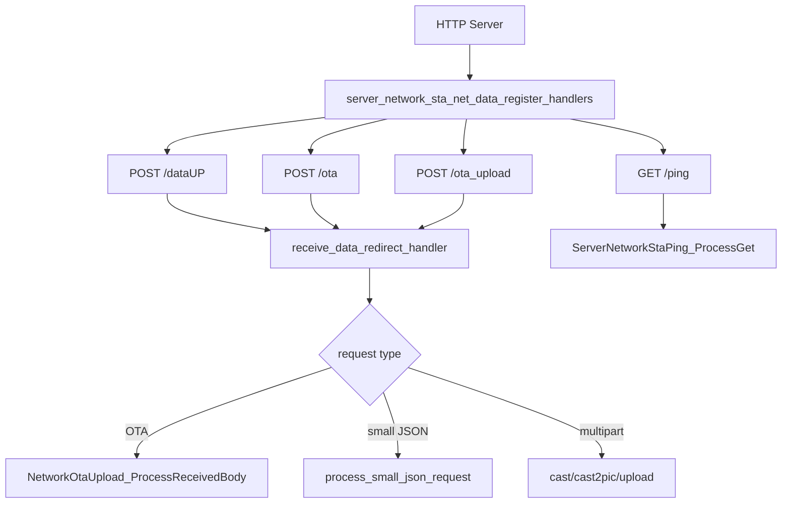

相关文件：

```text
main/server_network_sta/net_data/server_network_sta_data.c
main/server_network_sta/net_data/server_network_sta_data.h
```

树状时序：

```text
file_server.c
└─ example_start_file_server()
   └─ server_network_sta_net_data_register_handlers()
      ├─ register POST /dataUP
      ├─ register POST /ota
      ├─ register POST /ota_upload
      └─ GET /* 中优先拦截 /ping

POST request
└─ receive_data_redirect_handler()
   ├─ ServerNetworkStaWifiWorkTime_OnNetworkData()
   ├─ NetworkOtaUpload_IsOtaRequest()
   ├─ alloc_request_body_buffer()
   ├─ read_request_body_to_buffer()
   ├─ NetworkOtaUpload_ProcessReceivedBody()
   ├─ process_small_json_request()
   ├─ ServerNetworkStaCast2Pic_Process()
   ├─ ServerNetworkStaCast_Process()
   └─ ServerNetworkStaUpload_Process()
```

关键辅助函数：

```text
server_network_sta_data.c
├─ log_heap_watermark()
├─ alloc_request_body_buffer()
├─ read_request_body_to_buffer()
├─ process_small_json_request()
├─ receive_data_redirect_handler()
└─ server_network_sta_net_data_register_handlers()
```

V2 协议资料拆分：

```text
V2 HTTP 入口：
├─ POST /dataUP + multipart/form-data
│  ├─ cast
│  ├─ upload
│  ├─ cast2pic
│  └─ update（前端预留）
├─ POST /dataUP + JSON
│  ├─ get_saved_images
│  ├─ get_snapshot
│  ├─ start_slideshow
│  ├─ set_slideshow
│  ├─ delete
│  └─ set_wifi_work_time
└─ GET /ping
```


Powershell 测试用例：

```powershell
# net_data：验证 /dataUP 小 JSON 入口能正确分发到 snapshot。
$esp = "http://192.168.1.104"
$body = @{ func = "get_snapshot" } | ConvertTo-Json

Invoke-RestMethod -Uri "$esp/dataUP" `
  -Method Post `
  -ContentType "application/json" `
  -Body $body
```

```powershell
# net_data：验证 /dataUP multipart 入口能正确进入 cast/upload/cast2pic 分发。
$esp = "http://192.168.1.104"
$bin = "H:\AI2\test\26422.bin"
$jpg = "H:\AI2\test\26422.jpg"
$binSize = (Get-Item $bin).Length
$jpgSize = (Get-Item $jpg).Length

curl.exe -X POST "$esp/dataUP" `
  -F "func=upload" `
  -F "fileName=net_data_test" `
  -F "bin_size=$binSize" `
  -F "image_size=$jpgSize" `
  -F "save=true" `
  -F "show=false" `
  -F "bin=@$bin;type=application/octet-stream" `
  -F "image=@$jpg;type=image/jpeg"
```

预期：第一个命令走 small JSON 分发；第二个命令走 multipart 分发。

存 / 取信息（含条件限制）：

```text
存：
- net_data 不直接写持久化数据。
- 根据请求类型转交 cast/upload/ota/slideshow/wifi_work_time 等模块执行实际存储。

取：
- 读取 request header、body、Content-Type、URI、multipart boundary。
- 读取 body_len 并在 RAM 中做临时缓存。
```

[⬆ 返回目录](#toc) | [↩ 返回当前目录](#sec-07)

---

### 7.5 ota：设备在线升级模块 <span id="sec-07-5"></span>

Result 定义建议：

| 返回 | result | 说明 |
|---|---|---|
| `ota_event` | `0` | OTA 阶段事件正常 |
| `ota_result` | `0` | OTA 成功 |
| `ota_result` | `1701` | boundary 缺失 |
| `ota_result` | `1702` | meta 缺失 |
| `ota_result` | `1703` | meta 非法 |
| `ota_result` | `1704` | firmware 缺失 |
| `ota_result` | `1705` | firmware size 非法 |
| `ota_result` | `1706` | `esp_ota_begin()` 失败 |
| `ota_result` | `1707` | `esp_ota_write()` 失败 |
| `ota_result` | `1708` | `esp_ota_end()` 失败 |
| `ota_result` | `1709` | OTA 校验失败 |
| `ota_result` | `1710` | 设置 boot partition 失败 |
| `ota_result` | `1711` | meta version 与固件 version 不一致 |
| `ota_result` | `1712` | OTA 分区空间不足 |
| `ota_result` | `1713` | OTA 正在执行 |

功能说明：通过网络上传固件，校验固件头、版本、分区大小，写入 OTA 分区并切换启动分区。

Mermaid 时序图：

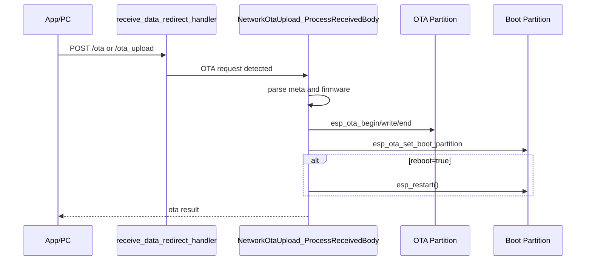

相关文件：

```text
main/server_network_sta/ota/network_ota_upload.c
main/server_network_sta/ota/network_ota_upload.h
```

树状时序：

```text
receive_data_redirect_handler()
├─ NetworkOtaUpload_IsOtaRequest()
├─ NetworkOtaUpload_GetMaxBodySize()
└─ NetworkOtaUpload_ProcessReceivedBody()
   ├─ ota_stream_begin()
   ├─ extract_boundary()
   ├─ extract_multipart_field("meta")
   ├─ parse_meta_json()
   ├─ extract_multipart_field("firmware" or "bin")
   ├─ PowerMode_SetOtaInProgress(true)
   ├─ write_firmware_to_ota_partition()
   │  ├─ validate image header magic
   │  ├─ get_firmware_app_desc()
   │  ├─ esp_ota_get_next_update_partition()
   │  ├─ esp_ota_begin()
   │  ├─ esp_ota_write()
   │  ├─ esp_ota_end()
   │  └─ esp_ota_set_boot_partition()
   └─ reboot=true
      └─ esp_restart()
```

关键辅助函数：

```text
network_ota_upload.c
├─ NetworkOtaUpload_IsOtaRequest()
├─ NetworkOtaUpload_GetMaxBodySize()
├─ NetworkOtaUpload_ProcessReceivedBody()
├─ NetworkOtaUpload_MarkCurrentAppValidIfPending()
└─ write_firmware_to_ota_partition()
```

V2 协议资料拆分：

```text
V2_相框传图协议.html 中没有定义网络 OTA 请求字段。
当前 OTA 以仓库源码 /ota、/ota_upload 处理逻辑为准，和 V2 图片/控制协议分开。
```

当前实现与后续优化：

```text
当前 OTA 请求仍先由 receive_data_redirect_handler() 完整接收 HTTP body，再交给 NetworkOtaUpload_ProcessReceivedBody() 解析 firmware part。
OTA 写分区时会分块 esp_ota_write()，但 HTTP 接收阶段不是 streaming。
开发阶段保持当前实现便于调试；如果后续固件体积增大或 PSRAM 压力明显，建议单独为 /ota 做 streaming handler，一边 httpd_req_recv() 一边 esp_ota_write()。
```

Powershell 测试用例：

```powershell
# ota：上传固件到 /ota。reboot=false 时便于先观察返回结果。
$esp = "http://192.168.1.104"
$fw = "H:\AI2\ESP32-S3-PhotoPainter-main\01_Example\xiaozhi-esp32\build\xiaozhi.bin"
$size = (Get-Item $fw).Length
$version = "2.0.2"
$meta = '{"func":"ota","version":"' + $version + '","firmware_size":' + $size + ',"reboot":false}'

curl.exe -X POST "$esp/ota" `
  -F "meta=$meta" `
  -F "firmware=@$fw;type=application/octet-stream"
```

```powershell
# 兼容旧工具入口：/ota_upload。
curl.exe -X POST "$esp/ota_upload" `
  -F "meta=$meta" `
  -F "firmware=@$fw;type=application/octet-stream"
```

预期：固件大小不能超过 OTA 分区；校验通过后写 OTA 分区并设置 boot partition。需要自动重启时把 `reboot` 改成 `true`。

存 / 取信息（含条件限制）：

```text
存：
- esp_ota_write() 写入 OTA update partition。
- esp_ota_set_boot_partition() 保存下次启动分区选择。
- OTA 期间会设置 WiFi 工作时间模块的 OTA busy 状态，避免超时 POWER_OFF。

取：
- 读取 multipart meta JSON、firmware/bin 字段。
- 读取当前 running partition、目标 update partition、固件 app_desc、版本信息。
```

[⬆ 返回目录](#toc) | [↩ 返回当前目录](#sec-07)

---

### 7.6 ping：网络连通检测 <span id="sec-07-6"></span>

Result 定义建议：

| 返回 | result | 说明 |
|---|---|---|
| `ping_result` | `0` | 连通性检查成功 |
| `ping_result` | `1405` | `Ble_MAC` 为空；是否作为失败需按前端匹配逻辑决定 |

功能说明：用于 App/PC 判断设备 HTTP 服务是否可用，并通过 `Ble_MAC` 防止缓存 IP 指向错误设备。网络 ping 匹配 `/ping` 路径，并允许携带 query/hash 后缀，例如 `/ping?t=123`。

Mermaid 时序图：

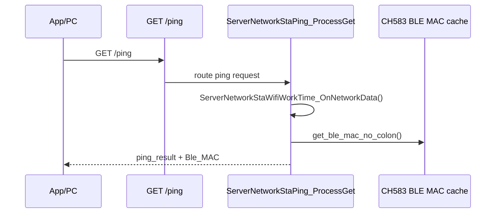

相关文件：

```text
main/server_network_sta/ping/server_network_sta_ping.c
main/server_network_sta/ping/server_network_sta_ping.h
```

树状时序：

```text
HTTP GET /ping
└─ ServerNetworkStaPing_ProcessGet()
   ├─ ServerNetworkStaWifiWorkTime_OnNetworkData()
   ├─ get_ble_mac_no_colon()
   └─ httpd_resp_sendstr()
```

关键辅助函数：

```text
server_network_sta_ping.c
└─ ServerNetworkStaPing_ProcessGet()
```

V2 协议资料拆分：

```http
GET /ping HTTP/1.1
```

也允许：

```http
GET /ping?t=123 HTTP/1.1
GET /ping#check HTTP/1.1
```

返回：

```json
{
  "func": "ping_result",
  "result": 0,
  "message": "ok",
  "Ble_MAC": "AABBCCDDEEFF"
}
```

V2 说明：前端写操作前会优先访问缓存端点的 `/ping`；如果响应包含 `Ble_MAC` 或 `ble_mac`，必须与目标设备 MAC 一致。


Powershell 测试用例：

```powershell
# ping：GET /ping 检查 HTTP 服务和设备身份。
$esp = "http://192.168.1.104"
Invoke-RestMethod -Uri "$esp/ping" -Method Get
Invoke-RestMethod -Uri "$esp/ping?t=123" -Method Get
```

预期：BLE MAC 已获取时返回 `result=0`；尚未获取时返回 `result=1405` 和空 `Ble_MAC`。

存 / 取信息（含条件限制）：

```text
存：
- ping 不写入持久化数据。
- 只会调用 ServerNetworkStaWifiWorkTime_OnNetworkData() 重置 RAM 中的 working_time 计时。

取：
- 读取 CH583 BLE MAC 字符串，用于返回 Ble_MAC。
- BLE MAC 来源可能是 CH583 模块上报后保存在 PhotoPainter NVS 的值。
```

[⬆ 返回目录](#toc) | [↩ 返回当前目录](#sec-07)

---

### 7.7 get_saved_images：取出本地存储图片 <span id="sec-07-7"></span>

Result 定义建议：

| 返回 | result | 说明 |
|---|---|---|
| `get_saved_images_result` | `0` | 图片列表读取成功 |
| `get_saved_images_result` | `1401` | 图片列表读取失败 |
| `thumb_result` | `1402` | 缩略图名称非法 |
| `thumb_result` | `1403` | 缩略图不存在 |

网络 `/thumb/<name>.jpg` 成功时直接返回 `HTTP 200 image/jpeg` 二进制；名称非法或文件不存在时返回 JSON `thumb_result`，HTTP 状态分别为 400、404。USB thumb 同样在失败时返回 `1402/1403`。

功能说明：扫描本地已保存缩略图，返回前端可展示的图片列表和缩略图地址。JSON `func` 解析允许冒号前后有空格或换行，支持 PowerShell `ConvertTo-Json` 输出格式。

Mermaid 时序图：

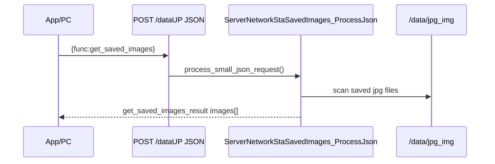

相关文件：

```text
main/server_network_sta/saved_images/server_network_sta_saved_images.c
main/server_network_sta/saved_images/server_network_sta_saved_images.h
```

树状时序：

```text
HTTP small JSON get_saved_images
└─ receive_data_redirect_handler()
   └─ process_small_json_request()
      └─ ServerNetworkStaSavedImages_ProcessJson()
         ├─ scan /data/jpg_img
         ├─ saved_image_name_is_safe()
         └─ httpd_resp_sendstr(json)
```

关键辅助函数：

```text
server_network_sta_saved_images.c
├─ json_func_equals()
├─ saved_image_entry_name()
├─ has_jpg_extension()
├─ saved_image_name_is_safe()
├─ send_saved_images_empty()
├─ ServerNetworkStaSavedImages_SendThumbnail()
└─ ServerNetworkStaSavedImages_ProcessJson()
```

V2 协议资料拆分：

```json
{
  "func": "get_saved_images"
}
```

返回：

```json
{
  "func": "get_saved_images_result",
  "result": 0,
  "images": [
    {
      "fileName": "26422",
      "thumbnailUrl": "/thumb/26422.jpg"
    }
  ]
}
```

V2 说明：前端会用设备 `baseUrl` 拼接相对缩略图地址。


Powershell 测试用例：

```powershell
# get_saved_images：读取 SD 卡中已保存缩略图列表。
$esp = "http://192.168.1.104"
$body = @{ func = "get_saved_images" } | ConvertTo-Json

Invoke-RestMethod -Uri "$esp/dataUP" `
  -Method Post `
  -ContentType "application/json" `
  -Body $body
```

```powershell
# 如果返回了 thumbnailUrl，可以继续读取缩略图。
$thumb = "/thumb/26422.jpg"
Invoke-WebRequest -Uri "$esp$thumb" -OutFile "H:\AI2\test\thumb_26422.jpg"
```

预期：返回 `get_saved_images_result`；`images` 中包含 `fileName` 和 `thumbnailUrl`。如果 `/data/jpg_img` 目录不存在，当前网络实现返回成功空列表：`{"func":"get_saved_images_result","result":0,"images":[]}`。

存 / 取信息（含条件限制）：

```text
存：
- get_saved_images 不写文件。

取：
- 扫描 /data/jpg_img 目录下的 .jpg / .JPG 文件。
- 生成 fileName 与 thumbnailUrl。
- /thumb/<name>.jpg 请求会 fopen 对应 jpg 并 fread 分块返回。
- 如果 /data/jpg_img 不存在，返回空 images[]，不作为错误。
```

[⬆ 返回目录](#toc) | [↩ 返回当前目录](#sec-07)

---

### 7.8 slideshow：图片轮播的文件列表，轮播间隔，是否随机 <span id="sec-07-8"></span>

Result 定义建议：

| 返回 | result | 说明 |
|---|---|---|
| `start_slideshow_result` | `0` | 轮播启动成功 |
| `start_slideshow_result` | `1012` | SD 卡 / 存储未就绪 |
| `start_slideshow_result` | `1501` | `fileNames` 缺失 |
| `start_slideshow_result` | `1502` | 文件名非法 |
| `start_slideshow_result` | `1504` | 轮播配置保存失败 |
| `start_slideshow_result` | `1505` | 轮播启动失败 |
| `start_slideshow_result` | `1506` | 轮播运行时启动失败 |
| `start_slideshow_result` | `1507` | `interval` 非法 |
| `start_slideshow_result` | `1508` | 轮播文件不存在 |

功能说明：保存轮播图片列表、轮播间隔、随机开关，并在后台任务中按配置切换图片刷新 EPD。

Mermaid 时序图：

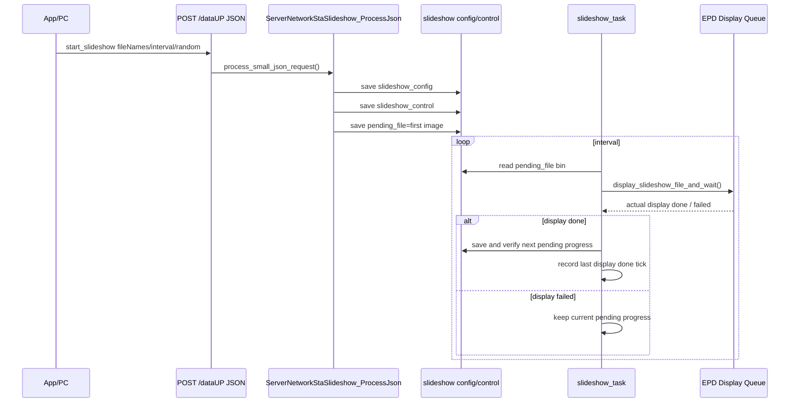

相关文件：

```text
main/server_network_sta/slideshow/server_network_sta_slideshow.c
main/server_network_sta/slideshow/server_network_sta_slideshow.h
```

树状时序：

```text
HTTP small JSON start_slideshow
└─ receive_data_redirect_handler()
   └─ process_small_json_request()
      └─ ServerNetworkStaSlideshow_ProcessJson()
         ├─ parse_start_slideshow_request()
         ├─ check_slideshow_files_exist()
         ├─ save_slideshow_config()
         ├─ save_slideshow_control()
         ├─ 初始化并保存 pending_file=第一张
         └─ start_slideshow_runtime()
            ├─ 刚完成上一张且未到 interval 时，先等待剩余秒数
            └─ display_slideshow_file_and_wait()
               └─ ServerNetworkStaEpdDisplay_QueueToScreenAndWait()

main/main.c
└─ ServerNetworkStaSlideshow_StartSaved("/data")
   ├─ read_slideshow_config_file()
   ├─ read_slideshow_control_on()
   ├─ 读取并校验 NVS slide_progress
   └─ xTaskCreate(slideshow_task)
```

关键辅助函数：

```text
server_network_sta_slideshow.c
├─ parse_start_slideshow_request()
├─ check_slideshow_files_exist()
├─ save_slideshow_config()
├─ save_slideshow_control()
├─ ServerNetworkStaSlideshow_ShowFirst()
├─ ServerNetworkStaSlideshow_StartSaved()
├─ ServerNetworkStaSlideshow_GetRuntimeTiming()
├─ ServerNetworkStaSlideshow_Stop()
└─ slideshow_task()
```

V2 协议资料拆分：

```json
{
  "func": "start_slideshow",
  "fileNames": ["26422", "26423"],
  "interval": 60,
  "random": false
}
```

字段说明：

```text
fileNames 图片轮播顺序；random=true 时随机轮播
interval  轮播间隔，单位秒，允许范围 60..604800
```


Powershell 测试用例：

```powershell
# start_slideshow：下发轮播列表，要求文件已存在于设备 SD 卡。
$esp = "http://192.168.1.104"
$body = @{
  func = "start_slideshow"
  fileNames = @("26422", "26423")
  interval = 60
  random = $false
} | ConvertTo-Json -Depth 4

Invoke-RestMethod -Uri "$esp/dataUP" `
  -Method Post `
  -ContentType "application/json" `
  -Body $body
```

预期：设备保存 slideshow 配置，并按列表触发显示；如果文件不存在，源码会按校验结果返回失败。

当前实现：

```text
slideshow 已区分 fileNames 缺失/非法、interval 非法、文件不存在、配置保存失败和运行时启动失败。
网络与 USB 入口均在保存配置前校验 fileNames 和 interval；runtime 启动失败返回 1506。
网络 JSON 的 `func` 判断支持空格、CRLF 和 PowerShell `ConvertTo-Json` 输出格式。
```

存 / 取信息（含条件限制）：

```text
存：
- save_slideshow_config() 保存轮播列表、interval、random 等配置文件。
- save_slideshow_control() 保存轮播开关/控制状态。
- NVS `slide_progress` 保存版本、配置 hash、待显示文件、随机种子、整轮顺序和当前位置。
- `pending_file` 表示下一次必须完成显示的图片，不表示已经显示成功的图片。
- EPD 实际返回成功后才计算并提交下一张；NVS 写入并读回校验成功后运行索引才推进。
- slideshow_task() 在每次进入等待时，把本次等待总秒数和起始 tick 保存为 RAM runtime timing；正常轮播等待总秒数为 `runtime->request.interval`，重启后的初始等待可为剩余秒数。
- `ServerNetworkStaSlideshow_GetRuntimeTiming()` 可读取当前等待已经走过的秒数。
- slideshow_task() 在 EPD 显示成功且下一进度保存成功后记录 RAM last display done tick；如果随后重新启动轮播且还没等满 interval，新 task 会先等待剩余秒数，不会立即刷下一张。
- 显示失败、等待超时、NVS 保存失败或显示中途断电均不推进；下次继续当前图片。
- 随机模式按“整轮洗牌”运行，一轮内所有图片各显示一次，不重复、不遗漏。

取：
- ServerNetworkStaSlideshow_StartSaved() 启动时读取 slideshow_config、control 和 `slide_progress`；启动位置仍保持在网络初始化之后。
- 进度版本、配置 hash、随机模式、排列或文件名不匹配时，从当前配置第一张重建进度。
- 兼容旧 `slide_last`：首次升级时将旧文件名迁移为新的待显示进度。
- slideshow_task() 读取 `/data/bin_img/*.bin`，等待 EPD 真正完成后再提交下一进度。
- 轮播 runtime timing 只表示当前 task 正在等待的计时进度；显示 EPD 期间不计入 interval 已走时间。
- last display done tick 只保存在 RAM 中，断电重启后不保留；它只用于运行期 `start_slideshow` / `set_slideshow sw=1` 重启轮播时避免刚显示完又立即显示下一张。
- 极端情况下若 EPD 已完成但提交下一进度前断电，当前图片会重复一次，但绝不会跳图。
```

[⬆ 返回目录](#toc) | [↩ 返回当前目录](#sec-07)

---

### 7.9 slideshow_control：轮播控制模块 <span id="sec-07-9"></span>

Result 定义建议：

| 返回 | result | 说明 |
|---|---|---|
| `set_slideshow_result` | `0` | 轮播控制设置成功 |
| `set_slideshow_result` | `1012` | SD 卡 / 存储未就绪 |
| `set_slideshow_result` | `1004` | `sw` / `random` / `interval` 参数非法 |
| `set_slideshow_result` | `1501` | 开启轮播时还没有保存过轮播列表 |
| `set_slideshow_result` | `1506` | 开启轮播时运行时启动失败 |
| `set_slideshow_result` | `1507` | `interval` 非法 |
| `set_slideshow_result` | `1509` | 控制状态保存失败 |

功能说明：单独控制轮播开启/关闭、轮播周期和随机模式。

Mermaid 时序图：

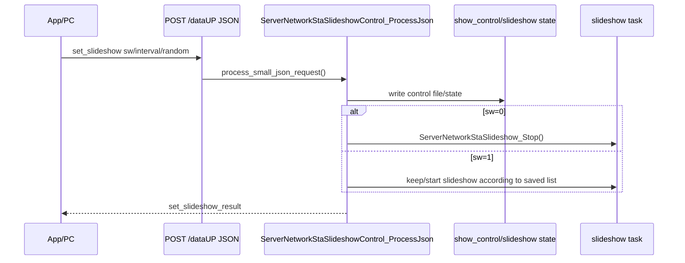

相关文件：

```text
main/server_network_sta/slideshow_control/server_network_sta_slideshow_control.c
main/server_network_sta/slideshow_control/server_network_sta_slideshow_control.h
```

树状时序：

```text
HTTP small JSON set_slideshow
└─ receive_data_redirect_handler()
   └─ process_small_json_request()
      └─ ServerNetworkStaSlideshowControl_ProcessJson()
         ├─ parse_json_bool_optional("random")
         ├─ parse_json_u32("interval")
         ├─ parse sw field
         ├─ write_control_file()
         ├─ sw=0
         │  └─ ServerNetworkStaSlideshow_Stop()
         └─ sw=1
            └─ ServerNetworkStaSlideshow_StartSaved()
```

关键辅助函数：

```text
server_network_sta_slideshow_control.c
├─ parse_json_bool_optional()
├─ parse_json_u32()
├─ write_control_file()
└─ ServerNetworkStaSlideshowControl_ProcessJson()
```

V2 协议资料拆分：

```json
{
  "func": "set_slideshow",
  "sw": 1,
  "interval": 60,
  "random": false
}
```

字段说明：

```text
sw=1 开启轮播
sw=0 关闭轮播
interval 轮播间隔
interval 允许范围 60..604800；sw=0 时可省略，省略时沿用已有控制文件或默认最小值
control.interval 是 set_slideshow 写入控制文件的配置值；轮播 task 实际使用的是启动/恢复后复制到 runtime->request.interval 的 RAM 值。
random=true 随机轮播
random=false 按列表顺序轮播
```


Powershell 测试用例：

```powershell
# set_slideshow：开启轮播并设置间隔。
$esp = "http://192.168.1.104"
$body = @{
  func = "set_slideshow"
  sw = 1
  interval = 60
  random = $false
} | ConvertTo-Json -Depth 4

Invoke-RestMethod -Uri "$esp/dataUP" `
  -Method Post `
  -ContentType "application/json" `
  -Body $body
```

```powershell
# 关闭轮播。
$body = @{
  func = "set_slideshow"
  sw = 0
  interval = 60
  random = $false
} | ConvertTo-Json -Depth 4

Invoke-RestMethod -Uri "$esp/dataUP" `
  -Method Post `
  -ContentType "application/json" `
  -Body $body
```

预期：`sw=1` 开启，`sw=0` 关闭；配置写入 slideshow control 文件。

当前实现：

```text
set_slideshow 的 sw=1 会更新控制文件并尝试启动轮播。
若上一张轮播图片刚刚显示完成且 interval 还没走完，sw=1 只启动/恢复轮播 task；task 会先等待剩余 interval，到时间后再显示下一张，不保证立即刷新。
存储未就绪、未保存轮播列表、参数非法、interval 非法、控制文件/NVS 保存失败和轮播 runtime 启动失败已分别返回 1012、1501、1004、1507、1509、1506。
网络 JSON 的 `func` 判断支持空格、CRLF 和 PowerShell `ConvertTo-Json` 输出格式。
```

存 / 取信息（含条件限制）：

```text
存：
- set_slideshow 写入轮播控制文件，保存 sw / interval / random。
- 关闭轮播时更新控制状态并请求停止轮播任务；若 EPD 正在刷新，等待本次真实结果，成功时先提交下一待显示进度再退出。
- 修改随机模式会改变配置 hash；再次开启时旧排列失效，从当前配置第一张建立新一轮进度。

取：
- 读取 JSON 中 sw、interval、random。
- `sw=1` 时读取并校验持久化待显示进度，用于断电后继续；`sw=0` 时重启不会自动恢复轮播。
```

[⬆ 返回目录](#toc) | [↩ 返回当前目录](#sec-07)

---

### 7.10 snapshot：读取图片列表和轮播状态 <span id="sec-07-10"></span>

Result 定义建议：

| 返回 | result | 说明 |
|---|---|---|
| `get_snapshot_result` | `0` | 快照读取成功 |
| `get_snapshot_result` | `1011` | 快照缓冲区分配失败 |
| `get_snapshot_result` | `1401` | 图片列表读取失败 |
| `get_snapshot_result` | `1404` | 快照 JSON 生成失败 |

功能说明：一次返回设备已保存图片列表和当前轮播状态，便于 App 进入页面时恢复设备状态。

Mermaid 时序图：

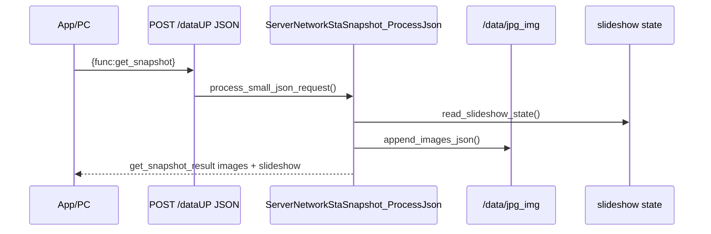

相关文件：

```text
main/server_network_sta/snapshot/server_network_sta_snapshot.c
main/server_network_sta/snapshot/server_network_sta_snapshot.h
```

树状时序：

```text
HTTP small JSON get_snapshot
└─ receive_data_redirect_handler()
   └─ process_small_json_request()
      └─ ServerNetworkStaSnapshot_ProcessJson()
         ├─ read_slideshow_state()
         ├─ append_images_json()
         ├─ append_slideshow_json()
         └─ httpd_resp_sendstr(json)
```

关键辅助函数：

```text
server_network_sta_snapshot.c
├─ append_images_json()
├─ read_slideshow_state()
├─ append_slideshow_json()
└─ ServerNetworkStaSnapshot_ProcessJson()
```

V2 协议资料拆分：

```json
{
  "func": "get_snapshot"
}
```

返回：

```json
{
  "func": "get_snapshot_result",
  "result": 0,
  "images": [
    {
      "fileName": "26422",
      "thumbnailUrl": "/thumb/26422.jpg"
    }
  ],
  "slideshow": {
    "sw": 1,
    "fileNames": ["26422", "26423"],
    "interval": 60,
    "random": false
  }
}
```

V2 说明：如果设备未设置过轮播，建议返回 `{"sw":0,"fileNames":[],"interval":0,"random":false}`。


Powershell 测试用例：

```powershell
# get_snapshot：一次读取图片列表和轮播状态。
$esp = "http://192.168.1.104"
$body = @{ func = "get_snapshot" } | ConvertTo-Json

Invoke-RestMethod -Uri "$esp/dataUP" `
  -Method Post `
  -ContentType "application/json" `
  -Body $body
```

预期：返回 `get_snapshot_result`，包含 `images` 和 `slideshow`。

存 / 取信息（含条件限制）：

```text
存：
- get_snapshot 不写文件。

取：
- append_images_json() 扫描 /data/jpg_img 下保存的缩略图。
- read_slideshow_state() 读取 slideshow_config 和 control 文件。
- 返回 images[] 与 slideshow 状态。
- 网络 JSON 的 `func` 判断支持空格、CRLF 和 PowerShell `ConvertTo-Json` 输出格式。
```

[⬆ 返回目录](#toc) | [↩ 返回当前目录](#sec-07)

---

### 7.11 upload：PC或手机传文件到ESP32-C5，并存 <span id="sec-07-11"></span>

Result 定义建议：

| 返回 | result | 说明 |
|---|---|---|
| `upload_result` | `0` | upload 成功 |
| `upload_result` | `1010` | 返回 JSON 过长 |
| `upload_result` | `1012` | SD 卡 / 存储未就绪 |
| `upload_result` | `1013` | 存储空间不足 |
| `upload_result` | `1016` | 保存队列创建、提交或排队失败 |
| `upload_result` | `1601` | multipart boundary 缺失 |
| `upload_result` | `1602` | multipart `func` 缺失 |
| `upload_result` | `1603` | 上传内容格式非法 |
| `upload_result` | `1604` | `bin` 缺失 |
| `upload_result` | `1605` | `image` 缺失 |
| `upload_result` | `1606` | 声明大小和实际大小不一致 |
| `upload_result` | `1607` | 保存 bin 失败 |
| `upload_result` | `1608` | 保存 image 失败 |
| `upload_result` | `1609` | EPD 显示队列提交失败 |
| `upload_result` | `1008` | EPD 同步显示等待或驱动 BUSY 超时 |
| `upload_result` | `1011` | EPD 显示 buffer / completion 内存不足 |
| `upload_result` | `1804` | EPD 驱动执行失败 |
| `upload_result` | `1612` | 文件名非法 |

功能说明：网页端或 App 上传图片到设备 SD 卡；字段与 `cast` 基本一致，主要用于保存图片，也可在 `show=true` 时立即显示。

Mermaid 时序图：

```mermaid
sequenceDiagram
    participant APP as App/PC
    participant DATAUP as POST /dataUP
    participant UP as ServerNetworkStaUpload_Process
    participant CORE as TdxImageTransfer
    participant SAVE as CastSaveTask
    participant EPD as EPD Display Queue
    APP->>DATAUP: multipart func=upload
    DATAUP->>UP: route by func
    UP->>CORE: parse and validate fields/file sizes
    alt show=true
        CORE->>EPD: ServerNetworkStaEpdDisplay_QueueToScreenAndWait()
    end
    alt save=true
        CORE->>SAVE: submit save task and wait result
        SAVE->>SAVE: save bin and jpg
    end
    UP-->>APP: upload result
```

相关文件：

```text
main/server_network_sta/upload/server_network_sta_upload.c
main/server_network_sta/upload/server_network_sta_upload.h
main/cast_core/cast_core.c
main/cast_core/cast_core.h
```

树状时序：

```text
HTTP multipart /dataUP
└─ receive_data_redirect_handler()
   └─ ServerNetworkStaUpload_Process()
      ├─ TdxImageTransfer_ParseSingle("upload")
      │  ├─ UsbConsoleCommon_ExtractBoundary()
      │  ├─ UsbConsoleCommon_MultipartParts()
      │  └─ UsbConsoleCommon_FileNameIsSafe()
      ├─ TdxImageTransfer_ProcessItems()
      │  ├─ show=true
      │  │  └─ ServerNetworkStaEpdDisplay_QueueToScreenAndWait()
      │  └─ save=true
      │     └─ CastSaveTask
      │        ├─ save /data/bin_img/<fileName>.bin
      │        └─ save /data/jpg_img/<fileName>.jpg
      └─ httpd_resp_sendstr()
```

关键辅助函数：

```text
server_network_sta_upload.c
├─ send_upload_result()
└─ ServerNetworkStaUpload_Process()

cast_core.c
├─ TdxImageTransfer_ParseSingle()
├─ TdxImageTransfer_ProcessItems()
└─ CastSaveTask()
```

说明：network upload 与 USB upload 共享 `TdxImageTransfer_ParseSingle()`、`TdxImageTransfer_ProcessItems()` 和 `CastSaveTask`。`show=true && save=true` 时先等待 EPD 显示任务完成，`save=true` 时再提交保存任务；`upload_result=0` 表示需要保存的文件已保存完成、需要显示的 EPD 任务已完成。

成功或失败返回 JSON 会包含 `fileName`、`bin_file`、`image_file`、`save`、`show`、`error` 字段；成功时 `message="upload success"` 且 `error="no error"`。

V2 协议资料拆分：

```http
POST /dataUP HTTP/1.1
Content-Type: multipart/form-data

func=upload
fileName=26422
bin_size=123456
image_size=23456
save=true
show=false
bin=@26422.bin
image=@26422.jpg
```

V2 说明：`upload` 与 `cast` 字段基本一致，用于保存图片上传。当前 network upload 使用 `TdxImageTransfer_ParseSingle("upload")`，一次请求只处理一组 `fileName/bin/image`；多图批量应使用 `cast2pic` 或由前端拆成多次 upload 请求。

V2 预留 `update`：

```http
POST /dataUP HTTP/1.1
Content-Type: multipart/form-data

func=update
oldfileNames=12345
newfileNames=67890
bin_size=123456
image_size=23456
save=true
show=true
bin=@67890.bin
image=@67890.jpg
```

`update` 在 V2 中标为前端预留，用于用新图片替换旧图片。


Powershell 测试用例：

```powershell
# upload：上传图片到 SD 卡，不立即显示。
$esp = "http://192.168.1.104"
$bin = "H:\AI2\test\26424.bin"
$jpg = "H:\AI2\test\26424.jpg"
$binSize = (Get-Item $bin).Length
$jpgSize = (Get-Item $jpg).Length

curl.exe -X POST "$esp/dataUP" `
  -F "func=upload" `
  -F "fileName=26424" `
  -F "bin_size=$binSize" `
  -F "image_size=$jpgSize" `
  -F "save=true" `
  -F "show=false" `
  -F "bin=@$bin;type=application/octet-stream" `
  -F "image=@$jpg;type=image/jpeg"
```

预期：设备返回上传成功结果；`show=false` 时只保存，不进入 EPD 显示队列。

存 / 取信息（含条件限制）：

```text
存：
- 保存上传的 /data/bin_img/<fileName>.bin。
- 保存上传的 /data/jpg_img/<fileName>.jpg。
- 使用文件名安全检查后再写入，避免路径穿越。

取：
- 读取 multipart 字段 func/fileName/bin_size/image_size/save/show/bin/image。
- 写入前读取存储剩余空间。
- show=true 时读取上传数据并等待 EPD 显示任务完成。
```

[⬆ 返回目录](#toc) | [↩ 返回当前目录](#sec-07)

---

### 7.12 wifi_work_time：WiFi 省电管理 <span id="sec-07-12"></span>

Result 定义建议：

| 返回 | result | 说明 |
|---|---|---|
| `set_wifi_work_time_result` | `0` | WiFi 工作时间设置成功 |
| `set_wifi_work_time_result` | `1351` | `seconds` / `time` 缺失 |
| `set_wifi_work_time_result` | `1352` | 工作时间超出允许范围 |
| `set_wifi_work_time_result` | `1353` | NVS 保存失败 |
| `set_wifi_work_time_result` | `1354` | 运行时应用失败 |

`1354` 的当前实际路径是 WiFi 工作状态任务尚未初始化，无法应用新的运行时计时参数；NVS 写入失败仍返回 `1353`。

功能说明：设置 WiFi 保持工作时间；超时后如 OTA 不忙，则通过 CH583 `POWER_OFF` 关闭 WiFi 电源或进入低功耗流程。

Mermaid 时序图：

```mermaid
sequenceDiagram
    participant APP as App/PC/BLE
    participant DATAUP as POST /dataUP JSON
    participant WT as ServerNetworkStaWifiWorkTime_ProcessJson
    participant TIMER as work_state_task
    participant CH583 as CH583 UART
    APP->>DATAUP: set_wifi_work_time seconds
    DATAUP->>WT: process_small_json_request()
    WT->>WT: ServerNetworkStaWifiWorkTime_SetAndSave()
    WT->>WT: save NVS and reset working_time
    loop periodic check
        TIMER->>WT: compare elapsed and required time
    end
    alt timeout and OTA not busy
        TIMER->>TIMER: read slideshow control sw/interval
        alt slideshow sw=1
            TIMER->>TIMER: read slideshow runtime interval elapsed
            WT->>CH583: WAKE_TIMER ON,<remaining interval>
        else slideshow sw=0
            WT->>CH583: WAKE_TIMER OFF,0
        end
        WT->>CH583: ch583_wifi_uart_send_power_off()
    end
```

相关文件：

```text
main/server_network_sta/wifi_work_time/server_network_sta_wifi_work_time.c
main/server_network_sta/wifi_work_time/server_network_sta_wifi_work_time.h
```

树状时序：

```text
main/main.c
└─ ServerNetworkStaWifiWorkTime_Init()
   ├─ load_work_state_from_nvs()
   ├─ load_work_time_vars_from_app_nvs()
   └─ xTaskCreate(work_state_task)

HTTP small JSON set_wifi_work_time
└─ receive_data_redirect_handler()
   └─ process_small_json_request()
      └─ ServerNetworkStaWifiWorkTime_ProcessJson()
         └─ ServerNetworkStaWifiWorkTime_SetAndSave()
            ├─ clamp seconds
            ├─ save_work_state_to_nvs()
            └─ save_work_time_vars_to_app_nvs()

work_state_task()
├─ update_working_time_seconds()
├─ elapsed <= server_required_continue_work_time
│  └─ keep running
├─ elapsed > server_required_continue_work_time && OTA busy
│  └─ ignored during OTA
└─ elapsed > server_required_continue_work_time && OTA not busy
   ├─ ServerNetworkStaSlideshow_IsSavedEnabled("/data")
   ├─ sw=1
   │  ├─ ServerNetworkStaSlideshow_GetRuntimeTiming()
   │  ├─ runtime 正在等待 interval 时，wake_interval = max(runtime_interval - elapsed, 1)
   │  └─ ch583_wifi_uart_send_wake_timer_on(wake_interval)
   ├─ sw=0 / control missing / parse failed
   │  └─ ch583_wifi_uart_send_wake_timer_off()
   ├─ 超时后立即发送一次；之后每 20 秒重发一次 WAKE_TIMER / LED 关闭 / POWER_OFF
   ├─ 关机流程中发给 CH583/CH585 的命令之间至少间隔 100ms
   ├─ UserLedStatus_PreparePowerOff()
   └─ ch583_wifi_uart_send_power_off()
```

关键辅助函数：

```text
server_network_sta_wifi_work_time.c
├─ ServerNetworkStaWifiWorkTime_Init()
├─ ServerNetworkStaWifiWorkTime_OnNetworkData()
├─ ServerNetworkStaWifiWorkTime_ProcessJson()
├─ ServerNetworkStaWifiWorkTime_SetAndSave()
├─ ServerNetworkStaWifiWorkTime_SetOtaInProgress()
├─ configure_ch583_wake_timer_before_power_off()
└─ work_state_task()
```

V2 协议资料拆分：

```json
{
  "func": "set_wifi_work_time",
  "seconds": 300
}
```

字段说明：

```text
seconds WiFi 工作时长，单位秒，允许范围 60..3600；兼容字段 `time`，二选一。
网络 JSON 的 `func` 判断支持空格、CRLF 和 PowerShell `ConvertTo-Json` 输出格式。
```


Powershell 测试用例：

```powershell
# set_wifi_work_time：设置 WiFi 保持工作时长，单位秒。
$esp = "http://192.168.1.104"
$body = @{
  func = "set_wifi_work_time"
  seconds = 300
} | ConvertTo-Json

Invoke-RestMethod -Uri "$esp/dataUP" `
  -Method Post `
  -ContentType "application/json" `
  -Body $body
```

预期：设备保存 WiFi 工作时长配置，并重置工作计时；超时后由 wifi_work_time 模块决定是否发送 CH583 `POWER_OFF`。

存 / 取信息（含条件限制）：

```text
存：
- save_work_state_to_nvs() 写入 namespace=USER_WORK_STATE_NVS_NAMESPACE 的 USER_WORK_STATE_NVS_KEY blob。
- save_work_time_vars_to_app_nvs() 写入 PhotoPainter 下的 SERVER_REQUIRED_CONTINUE_WORK_TIME_NVS_KEY 与 WIFI_STANDBY_TIME_S_NVS_KEY 字符串。

取：
- load_work_state_from_nvs() 读取工作状态 blob。
- load_work_time_vars_from_app_nvs() 读取兼容字符串 key。
- work_state_task() 读取 RAM 中计时值，超时后先配置 CH583 WAKE_TIMER，再发送 CH583 POWER_OFF。
- 轮播开启时，WAKE_TIMER 优先使用轮播 runtime 当前等待的剩余时间：`runtime_wait_seconds - 已走秒数`；最小值为 1 秒。若 runtime timing 不可用，则回退使用 control 文件中的 interval。
```

work_state 栈大小要求：

```text
USER_WORK_STATE_TASK_STACK_SIZE 默认使用 8 * 1024。
不要改回 3 * 1024。

原因：
work_state_task() 不是只做简单计时。工作时间超时后，它会执行关机前完整链路：
1. 读取 slideshow control，决定 WAKE_TIMER ON/OFF。
2. slideshow 开启时读取 runtime timing，扣掉当前 interval 已经走过的秒数，再发送 CH583 WAKE_TIMER；最小剩余时间为 1 秒。
3. 调用 UserLedStatus_PreparePowerOff()，发送 RED/GREEN LED 停止闪烁和关闭指令。
4. 发送 CH583 POWER_OFF。

这些调用会进入 CH583 V1 组帧、UART 写入、调试输出等函数，栈上存在多个局部 buffer。
如果栈只有 3 * 1024，可能在超时关机流程中触发 Stack protection fault。
```

[⬆ 返回目录](#toc) | [↩ 返回当前目录](#sec-07)

---

## 8. USB Serial/JTAG HTTP-like 协议 <span id="sec-08"></span>

Result 定义建议：

| 返回 | result | 说明 |
|---|---|---|
| `usb_receive_result` | `1101` | 串口 HTTP-like 请求太大 |
| `usb_receive_result` | `1102` | 串口请求接收超时 |
| `usb_receive_result` | `1103` | 串口请求格式错误 |
| 各业务 `*_result` | 参考 9.x | 路由成功后由对应 USB 功能返回 |

Mermaid 时序图：

```mermaid
sequenceDiagram
    participant PC as PC USB Serial
    participant USB as UsbConsoleEcho_Task
    participant HTTP as UsbConsoleHttp_TryParseRequest
    participant ROUTER as UsbConsoleRouter_Handle
    PC->>USB: HTTP-like text
    USB->>HTTP: parse request
    HTTP->>ROUTER: method/path/body
    ROUTER-->>USB: JSON response
    USB-->>PC: HTTP-like response
```


相关目录：

```text
main/usb_console_echo/
main/usb_console_echo/transport/
main/usb_console_echo/http_text/
main/usb_console_echo/router/
main/usb_console_echo/worker/
main/usb_console_echo/common/
```

启动时序：

```text
main/main.c
└─ app_main()
   └─ UsbConsoleEcho_Init()
      ├─ UsbConsoleTransport_Init()
      ├─ UsbConsoleWorker_Init()
      └─ xTaskCreate(UsbConsoleEcho_Task)
```

接收解析树状时序：

```text
UsbConsoleEcho_Task()
├─ UsbConsoleTransport_FlushRx()
├─ UsbConsoleEpdType_SendList()
├─ UsbConsoleEpdType_SendCurrent()
└─ loop
   ├─ UsbConsoleTransport_Read()
   ├─ UsbConsoleHttp_TryParseRequest()
   ├─ direct POST /epd_type
   │  └─ UsbConsoleEpdType_HandleSet()
   └─ UsbConsoleRouter_Handle()
```

HTTP-like 响应发送：

```text
功能处理函数
└─ UsbConsoleHttp_SetJson() or UsbConsoleCommon_SetJsonf()
   └─ UsbConsoleHttp_SendResponse()
      └─ UsbConsoleTransport_WriteAll()
```

auto light sleep / USB Serial/JTAG 接收注意事项：

```text
当前默认 TDX_AUTO_LIGHT_SLEEP_ENABLE=0，USB Serial/JTAG HTTP-like 接收可靠性优先。
USB Serial/JTAG 与普通 UART 不完全相同，但同样是外部主机异步输入。
如果 ESP32-C5 处于 auto light sleep，PC 端开始发送 HTTP-like 请求时，固件侧可能存在唤醒延迟、USB FIFO 读出延迟或主机侧等待超时。
表现可能是 PC 显示 TX complete，但固件没有 `USB RX first chunk`；或者请求头/Content-Length/body 没有被完整解析。
因此 USB 调试、USB 投图、USB OTA/大 body 传输阶段，不建议开启 auto light sleep。
若后续必须开启，需要 PC 端增加发送前唤醒/握手、发送后重试，以及固件侧单独验证 USB RX 稳定性。
```

---


存 / 取信息（含条件限制）：

```text
存：
- USB 协议层本身不写持久化数据。
- 路由后的功能模块可能写 SD/NVS/EPD type/轮播配置。

取：
- UsbConsoleTransport_Read() 从 USB Serial/JTAG 读取 HTTP-like 文本。
- UsbConsoleHttp_TryParseRequest() 在 RAM 中解析 header/body。
```

[⬆ 返回目录](#toc) | [↩ 返回当前目录](#sec-08)

---

## 9. USB 路由与各功能处理汇总 <span id="sec-09"></span>

本节只整理 `main/usb_console_echo/` 目录下的 USB Serial/JTAG HTTP-like 协议处理。  
USB 输入先经过 `transport` 读入，再由 `http_text` 解析成 HTTP-like request，最后由 `router` 按路径分发到各功能模块。

Mermaid 时序图：

```mermaid
sequenceDiagram
    participant PC as PC / VSCode Serial
    participant Transport as transport
    participant HttpText as http_text
    participant Router as router
    participant Module as 功能模块
    participant Resp as USB response

    PC->>Transport: 发送 HTTP-like 文本
    Transport->>HttpText: UsbConsoleTransport_Read()
    HttpText->>Router: UsbConsoleHttp_TryParseRequest()
    Router->>Module: UsbConsoleRouter_Handle()
    Module-->>Router: 填充 usb_console_http_response_t
    Router->>Resp: UsbConsoleHttp_SendResponse()
    Resp-->>PC: 返回 JSON / 文件数据
```

相关文件：

```text
main/usb_console_echo/usb_console_echo.c
main/usb_console_echo/transport/usb_console_transport.c
main/usb_console_echo/http_text/usb_console_http_text.c
main/usb_console_echo/router/usb_console_router.c
main/usb_console_echo/worker/usb_console_worker.c
main/usb_console_echo/common/usb_console_common.c
main/usb_console_echo/common/usb_console_common_async.c
main/usb_console_echo/ping/usb_console_ping.c
main/usb_console_echo/restart/usb_console_restart.c
main/usb_console_echo/wifi/usb_console_wifi.c
main/usb_console_echo/epd_type/usb_console_epd_type.c
main/usb_console_echo/net_data/usb_console_net_data.c
main/usb_console_echo/cast/usb_console_cast.c
main/usb_console_echo/cast/usb_console_cast_worker.c
main/usb_console_echo/cast2pic/usb_console_cast2pic.c
main/usb_console_echo/delete/usb_console_delete.c
main/usb_console_echo/saved_images/usb_console_saved_images.c
main/usb_console_echo/slideshow/usb_console_slideshow.c
main/usb_console_echo/slideshow_control/usb_console_slideshow_control.c
main/usb_console_echo/snapshot/usb_console_snapshot.c
main/usb_console_echo/upload/usb_console_upload.c
main/usb_console_echo/wifi_work_time/usb_console_wifi_work_time.c
```

树状时序：

```text
USB Serial/JTAG
└─ UsbConsoleEcho_Task()
   ├─ UsbConsoleTransport_Read()
   ├─ UsbConsoleHttp_TryParseRequest()
   └─ UsbConsoleRouter_Handle()
      ├─ /ping              -> UsbConsolePing_Handle()
      ├─ /wifi              -> UsbConsoleWifi_Handle()
      ├─ /epd_type          -> UsbConsoleEpdType_HandleSet() / SendCurrent()
      ├─ /epd_test          -> UsbConsoleEpdType_HandleTest()
      ├─ /dataUP /net_data  -> UsbConsoleNetData_Handle()
      ├─ /cast              -> UsbConsoleCast_Handle()
      ├─ /cast2pic          -> UsbConsoleCast2Pic_Handle()
      ├─ /delete            -> UsbConsoleDelete_Handle()
      ├─ /saved_images      -> UsbConsoleSavedImages_Handle()
      ├─ /thumb             -> UsbConsoleSavedImages_Handle()
      ├─ /slideshow         -> UsbConsoleSlideshow_Handle()
      ├─ /slideshow_control -> UsbConsoleSlideshowControl_Handle()
      ├─ /snapshot          -> UsbConsoleSnapshot_Handle()
      ├─ /upload            -> UsbConsoleUpload_Handle()
      └─ /wifi_work_time    -> UsbConsoleWifiWorkTime_Handle()
```

关键辅助函数：

```text
UsbConsoleEcho_Init()
UsbConsoleEcho_Task()
UsbConsoleTransport_Init()
UsbConsoleTransport_Read()
UsbConsoleHttp_TryParseRequest()
UsbConsoleRouter_Handle()
UsbConsoleHttp_SendResponse()
```

串口测试公共格式：

```text
串口参数：
- 端口：按 Windows 设备管理器中的 USB Serial/JTAG COM 口选择，例如 COM7。
- 波特率：921600。
- 数据位：8。
- 停止位：1。
- 校验：None。
- 流控：None。

发送数据格式：
@#$
<HTTP-like request>
%^&

固件解析说明：
- 当前输入解析会从串口字节流中寻找 GET / POST / PUT / DELETE / PATCH / HEAD 开头的 HTTP-like 请求。
- 也就是说，发送时可以带 @#$ 和 %^& 作为串口工具侧的包头包尾；固件真正解析的是中间的 HTTP-like request。
- 固件返回数据由 UsbConsoleHttp_SendResponse() 自动加包头包尾。

返回数据格式：
@#$
HTTP/1.1 200 OK
Content-Type: application/json
Content-Length: <len>
Connection: keep-alive

<json body>
%^&
```

说明：

```text
- JSON 类接口可以直接复制本章“串口发送数据”到串口工具发送。
- Content-Length 必须等于 body 的 UTF-8 字节数，下面 JSON 示例已按当前示例 body 计算好。
- HTTP-like 请求建议使用 CRLF 换行，即 \r\n；如果串口工具只支持普通文本发送，要确认它不会改动 Content-Length 后面的 body。
- cast、cast2pic、upload 这类 multipart 带二进制 bin/jpg，不建议手工在普通串口窗口输入，需要支持二进制发送的串口工具或 PC 程序。
- common、http_text、transport、worker 属于内部模块，没有单独业务入口，建议通过 /ping、/cast、/wifi 等上层接口覆盖测试。
```


存 / 取信息（含条件限制）：

```text
存：
- USB cast/upload/cast2pic 写 /data/bin_img 与 /data/jpg_img。
- USB wifi 写 NVS wifi 与 nvs.net80211。
- USB epd_type 写 PhotoPainter EPD type key。
- USB slideshow/slideshow_control 写轮播配置文件。
- USB wifi_work_time 写工作时间 NVS。

取：
- USB saved_images/snapshot 读取 SD 图片与轮播状态。
- USB ping 读取状态信息。
- USB router/http_text/transport 只读取 USB 输入并在 RAM 中处理。
```

[⬆ 返回目录](#toc) | [↩ 返回当前目录](#sec-09)

---

### 9.1 cast：投屏功能模块 <span id="sec-09-1"></span>

Result 定义建议：

| 返回 | result | 说明 |
|---|---|---|
| `cast_result` | `0` | USB cast 成功 |
| `cast_result` | `1601` | multipart boundary 缺失 |
| `cast_result` | `1602` | multipart `func` 缺失 |
| `cast_result` | `1603` | 上传内容格式非法 |
| `cast_result` | `1607` | 保存 bin 失败 |
| `cast_result` | `1608` | 保存 image 失败 |
| `cast_result` | `1609` | EPD 显示队列提交失败 |
| `cast_result` | `1008` | EPD 同步显示等待或驱动 BUSY 超时 |
| `cast_result` | `1804` | EPD 驱动执行失败 |
| `cast_result` | `1610` | last cast 保存失败 |
| `cast_result` | `1611` | 需要 `save=true` 才能记录 last cast |
| `cast_result` | `1011` | worker job 或 body 内存分配失败 |
| `cast_result` | `1016` | worker 队列提交失败 |

功能说明：

```text
USB cast 用于通过 USB Serial/JTAG 发送 HTTP-like multipart 数据，保存主图 bin 和缩略图 jpg，并按 show 字段决定是否执行 EPD 显示；show=true && save=true 时先等待 EPD 显示任务完成，再保存文件。
```

Mermaid 时序图：

```mermaid
sequenceDiagram
    participant PC as PC USB
    participant Router as UsbConsoleRouter_Handle
    participant Cast as UsbConsoleCast_Handle
    participant Worker as UsbConsoleCast_SubmitAsync
    participant Core as TdxCastCore
    participant Save as CastSaveTask
    participant EPD as ServerNetworkStaEpdDisplay_Queue

    PC->>Router: POST /cast 或 /dataUP func=cast
    Router->>Cast: UsbConsoleCast_Handle()
    Cast->>Worker: UsbConsoleCast_SubmitAsync()
    Worker->>Core: UsbConsoleCast_Process()
    Core->>Core: 解析 multipart / 校验 bin jpg
    alt show=true
        Core->>EPD: ServerNetworkStaEpdDisplay_QueueToScreenAndWait()
    end
    Core->>Save: submit save task and wait result
    Save->>Save: 保存 bin/jpg 并记录 last_cast
    Core-->>PC: cast_result JSON
```

相关文件：

```text
main/usb_console_echo/cast/usb_console_cast.c
main/usb_console_echo/cast/usb_console_cast_worker.c
main/usb_console_echo/cast/usb_console_cast.h
main/cast_core/cast_core.c
main/cast_core/cast_core.h
main/epd_display/epd_display_app.cpp
```

树状时序：

```text
UsbConsoleRouter_Handle()
└─ /cast 或 /dataUP func=cast
   └─ UsbConsoleCast_Handle()
      └─ UsbConsoleCast_SubmitAsync()
         └─ cast_worker_job()
            └─ UsbConsoleCast_Process()
               ├─ TdxCastCore_ParseAndValidate()
               │  ├─ UsbConsoleCommon_ExtractBoundary()
               │  ├─ UsbConsoleCommon_MultipartParts()
               │  └─ UsbConsoleCommon_FileNameIsSafe()
               └─ TdxCastCore_ProcessValidated()
                  ├─ show=true
                  │  └─ ServerNetworkStaEpdDisplay_QueueToScreenAndWait()
                  └─ save=true
                     └─ CastSaveTask
                        ├─ save /data/bin_img/<fileName>.bin
                        ├─ save /data/jpg_img/<fileName>.jpg
                        └─ record /data/bin_img/last_cast.txt
```

关键辅助函数：

```text
UsbConsoleCast_Handle()
UsbConsoleCast_SubmitAsync()
UsbConsoleCast_Process()
cast_worker_job()
TdxCastCore_ParseAndValidate()
TdxCastCore_ProcessValidated()
CastSaveTask()
ServerNetworkStaEpdDisplay_QueueToScreenAndWait()
```

说明：USB cast 与 network cast 共享 `cast_core` 和 `CastSaveTask`。USB 独有部分只保留 HTTP-like 接收、异步 worker 复制 body、以及 USB response 发送；multipart 校验、EPD 显示等待、保存 bin/jpg、记录 last_cast 与 7.1 network cast 共用同一套函数。`cast_result result=0` 表示 EPD 显示任务、保存和 last_cast 已成功。

串口发送数据：

```text
cast 是 multipart + 二进制接口，不建议手工在普通串口窗口输入。
需要串口工具或 PC 程序按二进制方式发送以下 HTTP-like 数据：

@#$
POST /cast HTTP/1.1
Host: usb
Content-Type: multipart/form-data; boundary=----tdxusb
Content-Length: <multipart_body_bytes>

------tdxusb
Content-Disposition: form-data; name="func"

cast
------tdxusb
Content-Disposition: form-data; name="fileName"

26422
------tdxusb
Content-Disposition: form-data; name="bin_size"

<bin 文件字节数>
------tdxusb
Content-Disposition: form-data; name="image_size"

<jpg 文件字节数>
------tdxusb
Content-Disposition: form-data; name="save"

true
------tdxusb
Content-Disposition: form-data; name="show"

true
------tdxusb
Content-Disposition: form-data; name="bin"; filename="26422.bin"
Content-Type: application/octet-stream

<bin 二进制数据>
------tdxusb
Content-Disposition: form-data; name="image"; filename="26422.jpg"
Content-Type: image/jpeg

<jpg 二进制数据>
------tdxusb--
%^&
```

预期：返回 `cast_result`，`result=0` 表示成功；`save=true` 会写 SD，`show=true` 会等待 EPD 显示任务完成。


存 / 取信息（含条件限制）：

```text
存：
- UsbConsoleCast_Process() 调用 TdxCastCore_ParseAndValidate() 和 TdxCastCore_ProcessValidated()。
- TdxCastCore_ProcessValidated() 先等待 EPD 显示任务完成，再提交 CastSaveTask。
- CastSaveTask 写入：/data/bin_img/<fileName>.bin。
- CastSaveTask 写入：/data/jpg_img/<fileName>.jpg。
- CastSaveTask 使用 <fileName>.<ext>.tmp 临时文件，写完后 rename 成正式文件。
- CastSaveTask 写入 last cast 记录文件，路径在 /data/bin_img/ 下。

取：
- USB cast 与 network cast 共用 check_save_space() 做剩余空间检查。
- 显示时下发已收到的 bin 数据到 EPD 显示任务；保存和显示串行，cast_result=0 等 EPD 显示任务、保存与 last_cast 成功。
- 重启恢复时可读取 last cast 记录。
```

[⬆ 返回目录](#toc) | [↩ 返回当前目录](#sec-09)

---

### 9.2 cast2pic：投屏转图片缓存 / 显示 <span id="sec-09-2"></span>

Result 定义建议：

| 返回 | result | 说明 |
|---|---|---|
| `cast2pic_result` | `0` | USB cast2pic 成功 |
| `cast2pic_result` | `1601` | multipart boundary 缺失 |
| `cast2pic_result` | `1602` | multipart `func` 缺失 |
| `cast2pic_result` | `1603` | 上传内容格式非法 |
| `cast2pic_result` | `1606` | 声明大小和实际大小不一致 |
| `cast2pic_result` | `1607` | 保存 bin 失败 |
| `cast2pic_result` | `1608` | 保存 image 失败 |
| `cast2pic_result` | `1609` | EPD 显示队列提交失败 |
| `cast2pic_result` | `1008` | EPD 同步显示等待或驱动 BUSY 超时 |
| `cast2pic_result` | `1011` | EPD 显示内存不足 |
| `cast2pic_result` | `1804` | EPD 驱动执行失败 |
| `cast2pic_result` | `1616` | `screen` 非法 |

功能说明：

```text
USB cast2pic 用于双屏或分屏投图，按 screen=a/b/ab 映射到指定屏幕编号，并让对应图片在指定 EPD 屏幕显示；show=true && save=true 时先等待 EPD 显示任务完成，再保存文件。
```

Mermaid 时序图：

```mermaid
sequenceDiagram
    participant PC as PC USB
    participant Router as Router
    participant Cast2Pic as UsbConsoleCast2Pic_Handle
    participant Core as TdxImageTransfer
    participant Save as CastSaveTask
    participant EPD as EPD QueueToScreen

    PC->>Router: POST /cast2pic multipart
    Router->>Cast2Pic: UsbConsoleCast2Pic_Handle()
    Cast2Pic->>Cast2Pic: parse screen / A/B file groups
    Cast2Pic->>Core: build one or two image transfer items
    alt show=true
        Core->>EPD: ServerNetworkStaEpdDisplay_QueueToScreenAndWait()
    end
    Core->>Save: submit save task and wait result
    Save->>Save: save screen_a/screen_b bin and jpg
    Cast2Pic-->>PC: cast2pic_result JSON
```

相关文件：

```text
main/usb_console_echo/cast2pic/usb_console_cast2pic.c
main/usb_console_echo/cast2pic/usb_console_cast2pic.h
main/usb_console_echo/common/usb_console_common.c
main/cast_core/cast_core.c
main/cast_core/cast_core.h
```

树状时序：

```text
UsbConsoleRouter_Handle()
└─ /cast2pic
   └─ UsbConsoleCast2Pic_Handle()
      └─ UsbConsoleCast2Pic_Process()
         ├─ parse screen=a/b/ab
         ├─ parse multipart file groups
         ├─ build tdx_image_transfer_item_t list
         └─ TdxImageTransfer_ProcessItems()
            ├─ show=true
            │  └─ ServerNetworkStaEpdDisplay_QueueToScreenAndWait()
            └─ save=true
               └─ CastSaveTask save /data/bin_img and /data/jpg_img
```

关键辅助函数：

```text
UsbConsoleCast2Pic_Handle()
UsbConsoleCast2Pic_Process()
UsbConsoleCommon_ExtractBoundary()
UsbConsoleCommon_MultipartParts()
TdxImageTransfer_ProcessItems()
CastSaveTask()
ServerNetworkStaEpdDisplay_QueueToScreenAndWait()
```

说明：USB cast2pic 与 network cast2pic 共享 `TdxImageTransfer_ProcessItems()` 和 `CastSaveTask`。`screen=ab` 会先解析成 A/B 两个 image transfer item，然后逐个等待需要显示的 EPD 任务完成，再保存所有需要保存的文件；`cast2pic_result=0` 表示 EPD 显示任务和保存任务已完成。

串口发送数据：

```text
cast2pic 是 multipart + 二进制接口，不建议手工在普通串口窗口输入。
screen 可发送 a、b 或 ab；ab 时需要同时带 A/B 两组字段。

@#$
POST /cast2pic HTTP/1.1
Host: usb
Content-Type: multipart/form-data; boundary=----tdxusb
Content-Length: <multipart_body_bytes>

------tdxusb
Content-Disposition: form-data; name="func"

cast2pic
------tdxusb
Content-Disposition: form-data; name="screen"

ab
------tdxusb
Content-Disposition: form-data; name="save"

true
------tdxusb
Content-Disposition: form-data; name="show"

true
------tdxusb
Content-Disposition: form-data; name="fileNameA"

screen_a
------tdxusb
Content-Disposition: form-data; name="bin_sizeA"

<A 屏 bin 文件字节数>
------tdxusb
Content-Disposition: form-data; name="image_sizeA"

<A 屏 jpg 文件字节数>
------tdxusb
Content-Disposition: form-data; name="binA"; filename="screen_a.bin"
Content-Type: application/octet-stream

<A 屏 bin 二进制数据>
------tdxusb
Content-Disposition: form-data; name="imageA"; filename="screen_a.jpg"
Content-Type: image/jpeg

<A 屏 jpg 二进制数据>
------tdxusb
Content-Disposition: form-data; name="fileNameB"

screen_b
------tdxusb
Content-Disposition: form-data; name="bin_sizeB"

<B 屏 bin 文件字节数>
------tdxusb
Content-Disposition: form-data; name="image_sizeB"

<B 屏 jpg 文件字节数>
------tdxusb
Content-Disposition: form-data; name="binB"; filename="screen_b.bin"
Content-Type: application/octet-stream

<B 屏 bin 二进制数据>
------tdxusb
Content-Disposition: form-data; name="imageB"; filename="screen_b.jpg"
Content-Type: image/jpeg

<B 屏 jpg 二进制数据>
------tdxusb--
%^&
```

预期：返回 `cast2pic_result`，`result=0` 表示成功；`screen=ab` 会分别保存为 `screen_a`、`screen_b` 并投递到对应屏。


存 / 取信息（含条件限制）：

```text
存：
- UsbConsoleCast2Pic_Process() 解析 A/B 图片组后生成 tdx_image_transfer_item_t。
- TdxImageTransfer_ProcessItems() 先等待所有 show=true 的 EPD 显示任务完成。
- CastSaveTask 保存 screen_a/screen_b 对应的 .bin 和 .jpg 到 /data/bin_img 与 /data/jpg_img。
- CastSaveTask 使用临时文件写入再 rename，避免半文件覆盖正式文件。

取：
- 读取 multipart 中重复出现的 fileName/bin_size/image_size/bin/image。
- 根据 screen=a/b/ab 转成 EPD screen number 后等待显示任务完成。
- 写入前由 CastSaveTask 读取剩余空间做容量检查。
```

[⬆ 返回目录](#toc) | [↩ 返回当前目录](#sec-09)

---

### 9.3 common：公共工具、通用函数、全局定义 <span id="sec-09-3"></span>

Result 定义建议：

| 返回 | result | 说明 |
|---|---|---|
| 公共 multipart 返回 | `1601` | boundary 缺失 |
| 公共 multipart 返回 | `1602` | func 缺失 |
| 公共 multipart 返回 | `1603` | 上传格式非法 |
| 公共保存返回 | `1607` / `1608` | 保存 bin / image 失败 |
| 公共显示返回 | `1609` | EPD 队列提交失败 |
| `usb_async_result` | `1106` | USB 异步 handler 失败 |

功能说明：

```text
common 模块为 USB 各接口提供 JSON 解析、multipart 解析、文件名安全检查、响应 JSON 拼装等通用能力。当前 cast/cast2pic/upload 的图片 show/save 执行路径统一放在 `cast_core` 的 `TdxImageTransfer_ProcessItems()` 和 `CastSaveTask`。
```

Mermaid 时序图：

```mermaid
flowchart TD
    A[功能模块 Handler] --> B[UsbConsoleCommon_JsonFuncEquals]
    A --> C[UsbConsoleCommon_ExtractBoundary]
    C --> D[UsbConsoleCommon_MultipartParts]
    D --> E[UsbConsoleCommon_FileNameIsSafe]
    E --> F[TdxImageTransfer_ProcessItems]
    F --> G[CastSaveTask]
    A --> H[UsbConsoleCommon_SetJsonf]
```

相关文件：

```text
main/usb_console_echo/common/usb_console_common.c
main/usb_console_echo/common/usb_console_common.h
main/usb_console_echo/common/usb_console_common_async.c
main/cast_core/cast_core.c
main/cast_core/cast_core.h
```

树状时序：

```text
功能模块
├─ JSON 控制类
│  ├─ UsbConsoleCommon_JsonFuncEquals()
│  ├─ UsbConsoleCommon_JsonString()
│  ├─ UsbConsoleCommon_JsonBool()
│  └─ UsbConsoleCommon_SetJsonf()
└─ 图片 multipart 类
   ├─ UsbConsoleCommon_ExtractBoundary()
   ├─ UsbConsoleCommon_MultipartParts()
   ├─ UsbConsoleCommon_FileNameIsSafe()
   └─ TdxImageTransfer_ProcessItems()
      ├─ ServerNetworkStaEpdDisplay_QueueToScreen()
      └─ CastSaveTask()
```

关键辅助函数：

```text
UsbConsoleCommon_ExtractBoundary()
UsbConsoleCommon_MultipartParts()
UsbConsoleCommon_FileNameIsSafe()
TdxImageTransfer_ParseSingle()
TdxImageTransfer_ProcessItems()
CastSaveTask()
UsbConsoleCommon_ListSavedImages()
UsbConsoleCommon_AppendSnapshot()
UsbConsoleCommon_SetJsonf()
```

串口发送数据：

```text
common 是 USB 内部公共库，没有独立 HTTP-like 路由，不需要单独发命令测试。
建议通过 /cast、/cast2pic、/upload 覆盖 multipart 解析、EPD 显示等待和 CastSaveTask 文件保存，通过 /delete、/snapshot、/wifi 覆盖 JSON 解析和响应拼装。
```


存 / 取信息（含条件限制）：

```text
存：
- 公共模块提供保存图片、保存 last cast、生成响应 JSON 等通用能力。
- 图片保存路径复用 /data/bin_img 与 /data/jpg_img。

取：
- 读取 multipart boundary、字段、文件名、body buffer。
- 读取存储剩余空间和文件状态，用于校验上传结果。
```

[⬆ 返回目录](#toc) | [↩ 返回当前目录](#sec-09)

---

### 9.4 delete：图片 / 文件删除逻辑 <span id="sec-09-4"></span>

Result 定义建议：

| 返回 | result | 说明 |
|---|---|---|
| `delete_result` | `0` | USB 删除成功 |
| `delete_result` | `1501` | `fileNames` 缺失 |
| `delete_result` | `1502` | 文件名非法 |
| `delete_result` | `1503` | 删除失败 |

功能说明：

```text
USB delete 接收 JSON fileNames 数组，只删除对应 bin/jpg 文件，不清理、不修改 last_cast、slideshow_config、show_control 或 NVS 轮播进度。
```

Mermaid 时序图：

```mermaid
sequenceDiagram
    participant PC as PC USB
    participant Router as Router
    participant Delete as UsbConsoleDelete
    participant FS as SD / FATFS

    PC->>Router: POST /delete JSON
    Router->>Delete: UsbConsoleDelete_Handle()
    Delete->>Delete: UsbConsoleDelete_Process()
    Delete->>FS: 删除 /data/bin_img/*.bin
    Delete->>FS: 删除 /data/jpg_img/*.jpg
    Delete-->>PC: delete_result JSON
```

相关文件：

```text
main/usb_console_echo/delete/usb_console_delete.c
main/usb_console_echo/delete/usb_console_delete.h
main/server_network_sta/delete/server_network_sta_delete.c
```

树状时序：

```text
UsbConsoleRouter_Handle()
└─ /delete
   └─ UsbConsoleDelete_Handle()
      └─ UsbConsoleDelete_Process()
         ├─ parse fileNames[]
         ├─ delete /data/bin_img/<file>.bin
         ├─ delete /data/jpg_img/<file>.jpg
         └─ response delete_result
```

关键辅助函数：

```text
UsbConsoleDelete_Handle()
UsbConsoleDelete_Process()
UsbConsoleCommon_JsonFuncEquals()
UsbConsoleCommon_FileNameIsSafe()
UsbConsoleCommon_SetJsonf()
```

串口发送数据：

```text
@#$
POST /delete HTTP/1.1
Host: usb
Content-Type: application/json
Content-Length: 50

{"func":"delete","fileNames":["26422","screen_a"]}
%^&
```

预期：返回 `delete_result`；至少删除到一个文件时 `result=0`，没有删除到文件时返回失败。


存 / 取信息（含条件限制）：

```text
存：
- 删除动作会修改持久化文件系统：unlink /data/bin_img/<file>.bin 与 /data/jpg_img/<file>.jpg。
- 不修改 /data/bin_img/last_cast.txt。
- 不修改 /data/bin_img/slideshow_config.txt。
- 不修改 /data/bin_img/show_control.txt。
- 不修改 NVS 中的 slideshow progress / last slideshow 状态。

取：
- 读取 JSON fileNames 数组。
- 不读取 last_cast / slideshow 配置。
```

[⬆ 返回目录](#toc) | [↩ 返回当前目录](#sec-09)

---

### 9.5 epd_type：电子墨水屏（EPD）屏幕类型适配、驱动适配 <span id="sec-09-5"></span>

Result 定义建议：

| 返回 | result | 说明 |
|---|---|---|
| `epd_type` | `0` | 读取当前 EPD 类型成功 |
| `epd_type` | `1801` | 当前 EPD 类型非法 |
| `epd_type_list` | `0` | EPD 类型列表返回成功 |
| `set_epd_type_result` | `0` | 设置成功或类型未变化 |
| `set_epd_type_result` | `1801` | 目标 EPD 类型非法 |
| `set_epd_type_result` | `1802` | EPD 类型保存失败 |
| `test_epd_display_result` | `0` | 测试显示驱动执行完成 |
| `test_epd_display_result` | `1801` | 当前 EPD 类型非法 |
| `test_epd_display_result` | `1803` | 测试显示失败 |

功能说明：

```text
epd_type USB 接口用于查询屏幕类型列表、读取当前屏幕类型、设置屏幕类型并保存到 NVS，也提供 EPD 测试显示入口。
```

Mermaid 时序图：

```mermaid
sequenceDiagram
    participant PC as PC USB
    participant Router as Router
    participant EpdUsb as UsbConsoleEpdType
    participant EpdType as EpdType Manager
    participant NVS as app_nvs
    participant EPD as EPD Display

    PC->>Router: GET/POST /epd_type
    Router->>EpdUsb: UsbConsoleEpdType_HandleSet() or SendCurrent()
    EpdUsb->>EpdType: EpdType_SetAndSave() / GetCurrentConfig()
    EpdType->>NVS: app_nvs_write_u8()
    alt /epd_test
        EpdUsb->>EPD: UsbConsoleEpdType_HandleTest()
    end
    EpdUsb-->>PC: epd_type_result JSON
```

相关文件：

```text
main/usb_console_echo/epd_type/usb_console_epd_type.c
main/usb_console_echo/epd_type/usb_console_epd_type.h
main/epd_display/epd_type.cpp
main/epd_display/epd_display_app.cpp
```

树状时序：

```text
UsbConsoleRouter_Handle()
├─ /epd_type_list
│  └─ UsbConsoleEpdType_SendList()
├─ /epd_type GET
│  └─ UsbConsoleEpdType_SendCurrent()
├─ /epd_type POST
│  └─ UsbConsoleEpdType_HandleSet()
│     └─ EpdType_SetAndSave()
└─ /epd_test
   └─ UsbConsoleEpdType_HandleTest()
```

关键辅助函数：

```text
UsbConsoleEpdType_SendList()
UsbConsoleEpdType_SendCurrent()
UsbConsoleEpdType_HandleSet()
UsbConsoleEpdType_HandleTest()
EpdType_SetAndSave()
EpdType_GetCurrentConfig()
```

串口发送数据：

```text
查询当前 EPD 类型：

@#$
GET /epd_type HTTP/1.1
Host: usb

%^&
```

```text
查询固件内置 EPD 类型列表：

@#$
GET /epd_type_list HTTP/1.1
Host: usb

%^&
```

```text
设置 EPD 类型。type 必须先从 /epd_type_list 返回值中确认：

@#$
POST /epd_type HTTP/1.1
Host: usb
Content-Type: application/json
Content-Length: 10

{"type":1}
%^&
```

```text
EPD 测试显示。会实际刷新屏幕，只在确认屏幕类型和硬件连接正确时执行：

@#$
POST /epd_test HTTP/1.1
Host: usb
Content-Type: application/json
Content-Length: 2

{}
%^&
```

预期：查询接口返回 `epd_type` 或 `epd_type_list`；设置接口返回 `set_epd_type_result`；测试显示返回 `test_epd_display_result`。

Debug log notes:
- PC page prints `[USB debug] serial opened`, `[TX wait]`, and `[USB debug] TX begin` before sending HTTP-like data.
- PC page优先以 `USB console HTTP text entry ready` 作为 USB HTTP 入口就绪标志；若未收到该启动日志，会在 3.8 秒串口宽限期后主动查询。周期性的 `USB RX idle` 已降为 DEBUG 级别，默认 INFO 日志不再输出。
- PC page prints `[USB debug] auto query EPD type after serial open (...)` before the automatic `/epd_type_list` and `/epd_type` probes；未看到 ready 日志时由 3.8 秒宽限期触发查询，不再依赖周期 idle 日志。
- Firmware prints `USB RX flush discarded ... bytes` before the USB HTTP entry becomes ready.
- `USB RX idle: waiting for PC HTTP-like request` 仅在启用 DEBUG 日志级别时输出，默认 INFO 级别关闭。
- Firmware prints `USB RX first chunk`, `USB request complete`, `route epd_test matched`, `epd_test handler enter`, and `epd_test display function returned` during `/epd_test`.
- If only PC `[TX complete]` is visible and firmware has no `USB RX first chunk`, check whether the wrong serial port is selected or another tool is holding the ESP32-C5 USB Serial/JTAG port.


存 / 取信息（含条件限制）：

```text
存：
- UsbConsoleEpdType_HandleSet() 通过 EpdType_SetAndSave() 保存当前 EPD 类型。
- 底层使用 app_nvs_write_u8() 写入 PhotoPainter namespace 中的 USER_EPD_TYPE_NVS_KEY。

取：
- UsbConsoleEpdType_SendList() 读取编译进固件的 EPD 类型表。
- UsbConsoleEpdType_SendCurrent() 读取当前 RAM 中 EPD 类型。
- EpdType_LoadSavedOrDefault() 从 NVS 读取保存的 EPD 类型。
```

[⬆ 返回目录](#toc) | [↩ 返回当前目录](#sec-09)

---

### 9.6 http_text：HTTP-like 文本请求解析 <span id="sec-09-6"></span>

功能说明：

```text
http_text 模块把 USB 串口收到的文本解析成 HTTP-like request，包括 method、path、header、body，并负责把响应结构格式化回 HTTP-like 文本。
```

Mermaid 时序图：

```mermaid
sequenceDiagram
    participant Transport as transport
    participant HttpText as http_text
    participant Router as router
    participant PC as PC USB

    Transport->>HttpText: raw bytes buffer
    HttpText->>HttpText: UsbConsoleHttp_TryParseRequest()
    HttpText->>Router: usb_console_http_request_t
    Router-->>HttpText: usb_console_http_response_t
    HttpText->>PC: UsbConsoleHttp_SendResponse()
```

相关文件：

```text
main/usb_console_echo/http_text/usb_console_http_text.c
main/usb_console_echo/http_text/usb_console_http_text.h
```

树状时序：

```text
UsbConsoleEcho_Task()
└─ UsbConsoleHttp_TryParseRequest()
   ├─ parse method
   ├─ parse path
   ├─ parse headers
   ├─ parse Content-Length
   └─ parse body

功能模块响应
└─ UsbConsoleHttp_SetJson()
   └─ UsbConsoleHttp_SendResponse()
      └─ UsbConsoleTransport_WriteAll()
```

关键辅助函数：

```text
UsbConsoleHttp_TryParseRequest()
UsbConsoleHttp_SetJson()
UsbConsoleHttp_SendResponse()
```

Debug log checkpoints:
- `route USB request method=... path=... body_len=...`: router received a parsed HTTP-like request.
- `route epd_test matched uri=/epd_test ...`: `/epd_test` path matched and `UsbConsoleEpdType_HandleTest()` will be called next.

串口发送数据：

```text
http_text 只负责解析 HTTP-like 文本，没有独立业务路由，不需要单独测试。
建议用 /ping 验证 GET 解析，用 /wifi_work_time 验证 JSON Content-Length 解析，用 /cast 验证 multipart Content-Type 和 body 解析。
```

Debug log checkpoints:
- `USB RX flush discarded ... bytes`: data arrived before the firmware HTTP entry was ready and was dropped by startup cleanup.
- `USB RX idle: waiting for PC HTTP-like request`: 仅 DEBUG 级别可见，表示固件已就绪但尚未收到 PC 请求。
- `USB RX first chunk len=... preview="..."`: the ESP32-C5 USB Serial/JTAG FIFO received bytes from the PC.
- `USB request complete method=... path=...`: the HTTP-like parser accepted a complete request by Content-Length.


存 / 取信息（含条件限制）：

```text
存：
- http_text 只解析 USB HTTP-like 文本，不做持久化。

取：
- 从 USB 输入缓冲区读取 method、path、header、Content-Length、body。
- 解析结果保存在 usb_console_http_request_t RAM 结构中。
```

[⬆ 返回目录](#toc) | [↩ 返回当前目录](#sec-09)

---

### 9.7 net_data：USB /dataUP 与网络功能复用入口 <span id="sec-09-7"></span>

Result 定义建议：

| 返回 | result | 说明 |
|---|---|---|
| `unknown_result` | `1002` | USB `/dataUP` JSON `func` 不支持 |
| 下游 `*_result` | 参考对应功能 | USB `/dataUP` 复用 cast / upload / cast2pic 等业务返回 |

功能说明：

```text
USB net_data 是 USB 侧 /dataUP 统一入口，用来兼容网络 /dataUP 的 func 分发方式，把 USB HTTP-like 请求分发到 cast、cast2pic、upload、delete、saved_images、snapshot、slideshow 等模块。
```

Mermaid 时序图：

```mermaid
flowchart TD
    A[POST /dataUP 或 /net_data] --> B[UsbConsoleNetData_Handle]
    B --> C{func / Content-Type}
    C -->|cast| D[UsbConsoleCast_Handle]
    C -->|cast2pic| E[UsbConsoleCast2Pic_Handle]
    C -->|upload| F[UsbConsoleUpload_Handle]
    C -->|delete| G[UsbConsoleDelete_Handle]
    C -->|get_saved_images| H[UsbConsoleSavedImages_Handle]
    C -->|get_snapshot| I[UsbConsoleSnapshot_Handle]
    C -->|slideshow| J[Slideshow handlers]
```

相关文件：

```text
main/usb_console_echo/net_data/usb_console_net_data.c
main/usb_console_echo/net_data/usb_console_net_data.h
main/usb_console_echo/router/usb_console_router.c
```

树状时序：

```text
UsbConsoleRouter_Handle()
└─ /dataUP 或 /net_data
   └─ UsbConsoleNetData_Handle()
      ├─ read func
      ├─ multipart image request
      │  ├─ cast
      │  ├─ cast2pic
      │  └─ upload
      └─ JSON control request
         ├─ delete
         ├─ get_saved_images
         ├─ get_snapshot
         ├─ start_slideshow
         ├─ set_slideshow
         └─ set_wifi_work_time
```

关键辅助函数：

```text
UsbConsoleNetData_Handle()
UsbConsoleCommon_JsonFuncEquals()
TdxImageTransfer_ProcessItems()
UsbConsoleRouter_Handle()
```

串口发送数据：

```text
/dataUP 小 JSON 入口，验证 snapshot 分发：

@#$
POST /dataUP HTTP/1.1
Host: usb
Content-Type: application/json
Content-Length: 23

{"func":"get_snapshot"}
%^&
```

```text
/dataUP multipart 入口可复用 cast/cast2pic/upload 的二进制发送格式。
只需要把请求行改成：

POST /dataUP HTTP/1.1

并在 multipart 字段中设置：
func=upload / cast / cast2pic
```

预期：JSON 命令返回 `get_snapshot_result`；multipart 命令按 func 返回对应结果。


存 / 取信息（含条件限制）：

```text
存：
- USB net_data 本身不直接持久化。
- 复用网络功能后由 cast/upload/delete/slideshow 等模块完成实际存储。

取：
- 读取 USB request 中的 /dataUP body 和 func。
- 转发到对应 USB 或 server_network_sta 处理模块。
```

[⬆ 返回目录](#toc) | [↩ 返回当前目录](#sec-09)

---

### 9.8 ping：USB 连通性检测 <span id="sec-09-8"></span>

Result 定义建议：

| 返回 | result | 说明 |
|---|---|---|
| `ping_result` | `0` | USB ping 成功 |
| `ping_result` | `1405` | `Ble_MAC` 为空；是否作为失败需按上位机校验逻辑决定 |

功能说明：

```text
USB ping 用于验证 USB 命令通道可用，并返回设备基础信息；网络 ping 的 BLE_MAC 校验逻辑在 server_network_sta/ping 中处理。
```

Mermaid 时序图：

```mermaid
sequenceDiagram
    participant PC as PC USB
    participant Router as Router
    participant Ping as UsbConsolePing
    participant Resp as Response

    PC->>Router: GET /ping
    Router->>Ping: UsbConsolePing_Handle()
    Ping->>Ping: UsbConsolePing_Process()
    Ping-->>Resp: ping_result JSON
    Resp-->>PC: HTTP-like response
```

相关文件：

```text
main/usb_console_echo/ping/usb_console_ping.c
main/usb_console_echo/ping/usb_console_ping.h
main/server_network_sta/ping/server_network_sta_ping.c
```

树状时序：

```text
UsbConsoleRouter_Handle()
└─ /ping
   └─ UsbConsolePing_Handle()
      └─ UsbConsolePing_Process()
         └─ response ping_result
```

关键辅助函数：

```text
UsbConsolePing_Handle()
UsbConsolePing_Process()
UsbConsoleHttp_SetJson()
```

串口发送数据：

```text
@#$
GET /ping HTTP/1.1
Host: usb

%^&
```

预期：返回 `ping_result`，`result=0` 表示 USB 命令通道可用。


存 / 取信息（含条件限制）：

```text
存：
- USB ping 不写持久化数据。

取：
- 读取当前设备状态、可能读取 CH583 BLE MAC 或网络状态后返回 JSON。
```

[⬆ 返回目录](#toc) | [↩ 返回当前目录](#sec-09)

---

### 9.9 router：USB HTTP-like 路由、API 分发 <span id="sec-09-9"></span>

Result 定义建议：

| 返回 | result | 说明 |
|---|---|---|
| `usb_route_result` | `1012` | 存储未就绪；USB 存储相关路由在 `/data` 挂载完成前被拒绝 |
| `usb_unknown_result` | `1104` | USB 路由不存在 |
| `usb_route_result` | `1105` | 路由 handler 返回失败 |

错误返回会附带 `error` 字段：存储未就绪为 `storage_not_ready`，未知路径为 `route_not_found`，handler 失败为 `handler_failed`。

功能说明：

```text
router 是 USB HTTP-like 请求的统一分发器，按照 path 匹配 /ping、/wifi、/dataUP、/cast、/upload 等接口，并调用对应模块 Handle 函数。
在正常分发前，router 会先检查存储相关路由；当 example_storage_get_type() 仍为 EXAMPLE_STORAGE_TYPE_UNKNOWN 时，/dataUP、/net_data、/cast、/cast2pic、/delete、/saved_images、/thumb、/slideshow、/slideshow_control、/snapshot、/upload 会直接返回 usb_route_result result=1012 error=storage_not_ready。
/ping、/restart、/wifi、/epd_type_list、/epd_type、/epd_test、/wifi_work_time 等不依赖 /data 的路由仍可在启动早期使用。
```

Mermaid 时序图：

```mermaid
flowchart TD
    A[UsbConsoleRouter_Handle] --> R{storage route and storage unknown?}
    R -->|yes| S[usb_route_result 1012 storage_not_ready]
    R -->|no| B{path_is}
    B -->|/ping| C[UsbConsolePing_Handle]
    B -->|/restart| D[UsbConsoleRestart_Handle]
    B -->|/wifi| E[UsbConsoleWifi_Handle]
    B -->|/dataUP or /net_data| F[UsbConsoleNetData_Handle]
    B -->|/cast| G[UsbConsoleCast_Handle]
    B -->|/cast2pic| H[UsbConsoleCast2Pic_Handle]
    B -->|/upload| I[UsbConsoleUpload_Handle]
    B -->|/delete| J[UsbConsoleDelete_Handle]
    B -->|/snapshot| K[UsbConsoleSnapshot_Handle]
    B -->|unknown| L[usb_unknown_result]
```

相关文件：

```text
main/usb_console_echo/router/usb_console_router.c
main/usb_console_echo/router/usb_console_router.h
main/usb_console_echo/restart/usb_console_restart.c
main/usb_console_echo/restart/usb_console_restart.h
```

树状时序：

```text
UsbConsoleRouter_Handle(request)
├─ storage route && storage UNKNOWN -> usb_route_result 1012 storage_not_ready
├─ path_is("/ping")              -> UsbConsolePing_Handle()
├─ path_is("/restart")           -> UsbConsoleRestart_Handle()
├─ path_is("/wifi")              -> UsbConsoleWifi_Handle()
├─ path_is("/epd_type_list")     -> UsbConsoleEpdType_SendList()
├─ path_is("/epd_type")          -> UsbConsoleEpdType_HandleSet() / SendCurrent()
├─ path_is("/epd_test")          -> UsbConsoleEpdType_HandleTest()
├─ path_is("/dataUP"/"/net_data") -> UsbConsoleNetData_Handle()
├─ path_is("/cast")              -> UsbConsoleCast_Handle()
├─ path_is("/cast2pic")          -> UsbConsoleCast2Pic_Handle()
├─ path_is("/delete")            -> UsbConsoleDelete_Handle()
├─ path_is("/saved_images"/"/thumb") -> UsbConsoleSavedImages_Handle()
├─ path_is("/slideshow")         -> UsbConsoleSlideshow_Handle()
├─ path_is("/slideshow_control") -> UsbConsoleSlideshowControl_Handle()
├─ path_is("/snapshot")          -> UsbConsoleSnapshot_Handle()
├─ path_is("/upload")            -> UsbConsoleUpload_Handle()
├─ path_is("/wifi_work_time")    -> UsbConsoleWifiWorkTime_Handle()
└─ else                           -> usb_unknown_result
```

关键辅助函数：

```text
UsbConsoleRouter_Handle()
path_is()
usb_request_requires_storage()
usb_request_is_set_epd_type()
example_storage_get_type()
UsbConsoleHttp_SendResponse()
```

串口发送数据：

```text
验证未知路径会进入 usb_unknown_result：

@#$
GET /not_exist HTTP/1.1
Host: usb

%^&
```

```text
验证 query 后缀仍能按前缀匹配到 /ping：

@#$
GET /ping?from=router_test HTTP/1.1
Host: usb

%^&
```

```text
验证 /restart 会返回响应，然后 ESP32-C5 调用 esp_restart()：

@#$
GET /restart HTTP/1.1
Host: usb

%^&
```

预期：未知路径返回 `usb_unknown_result`；`/ping?from=router_test` 仍返回 `ping_result`；`/restart` 返回 `usb_restart_result` 后设备复位重起。


存 / 取信息（含条件限制）：

```text
存：
- router 不直接保存数据。

取：
- 读取 request path / method / body 中的 func。
- 根据路径分发到 wifi、cast、upload、delete、snapshot、restart 等模块。
```

[⬆ 返回目录](#toc) | [↩ 返回当前目录](#sec-09)

---

### 9.10 saved_images：本地存储图片读取、缩略图访问 <span id="sec-09-10"></span>

Result 定义建议：

| 返回 | result | 说明 |
|---|---|---|
| `get_saved_images_result` | `0` | USB 图片列表读取成功 |
| `get_saved_images_result` | `1401` | USB 图片列表读取失败 |
| `thumb_result` | `1402` | 缩略图名称非法 |
| `thumb_result` | `1403` | 缩略图不存在 |

功能说明：

```text
saved_images 用于扫描 /data/jpg_img，返回已保存图片列表和缩略图路径；/thumb 路由也复用该模块返回缩略图。
```

Mermaid 时序图：

```mermaid
sequenceDiagram
    participant PC as PC USB
    participant Router as Router
    participant Saved as UsbConsoleSavedImages
    participant FS as /data/jpg_img

    PC->>Router: GET/POST /saved_images 或 /thumb
    Router->>Saved: UsbConsoleSavedImages_Handle()
    Saved->>FS: 扫描 jpg_img / 读取缩略图
    Saved-->>PC: get_saved_images_result 或 jpg 数据
```

相关文件：

```text
main/usb_console_echo/saved_images/usb_console_saved_images.c
main/usb_console_echo/saved_images/usb_console_saved_images.h
main/server_network_sta/saved_images/server_network_sta_saved_images.c
```

树状时序：

```text
UsbConsoleRouter_Handle()
└─ /saved_images 或 /thumb
   └─ UsbConsoleSavedImages_Handle()
      └─ UsbConsoleSavedImages_Process()
         ├─ scan /data/jpg_img
         ├─ build images[]
         └─ response get_saved_images_result
```

关键辅助函数：

```text
UsbConsoleSavedImages_Handle()
UsbConsoleSavedImages_Process()
UsbConsoleCommon_ListSavedImages()
UsbConsoleCommon_FileNameIsSafe()
```

串口发送数据：

```text
读取已保存图片列表：

@#$
POST /saved_images HTTP/1.1
Host: usb
Content-Type: application/json
Content-Length: 27

{"func":"get_saved_images"}
%^&
```

```text
读取单张缩略图。需要先确认 /data/jpg_img/26422.jpg 已存在：

@#$
GET /thumb/26422.jpg HTTP/1.1
Host: usb

%^&
```

预期：第一个命令返回 `get_saved_images_result`；第二个命令返回 JPEG 的 HTTP-like 响应。


存 / 取信息（含条件限制）：

```text
存：
- get_saved_images 不写文件。

取：
- 扫描 /data/jpg_img 目录下的 .jpg 文件。
- 生成 fileName 与 thumbnailUrl。
- /thumb/<name>.jpg 请求会 fopen 对应 jpg 并 fread 分块返回。
```

[⬆ 返回目录](#toc) | [↩ 返回当前目录](#sec-09)

---

### 9.11 slideshow：USB 轮播列表下发 <span id="sec-09-11"></span>

Result 定义建议：

| 返回 | result | 说明 |
|---|---|---|
| `start_slideshow_result` | `0` | USB 轮播启动成功 |
| `start_slideshow_result` | `1501` | `fileNames` 缺失 |
| `start_slideshow_result` | `1502` | 文件名非法 |
| `start_slideshow_result` | `1504` | 轮播配置保存失败 |
| `start_slideshow_result` | `1506` | 运行时启动失败 |
| `start_slideshow_result` | `1507` | `interval` 非法 |
| `start_slideshow_result` | `1508` | 轮播文件不存在；写配置前逐个检查 `/data/bin_img/<fileName>.bin` |

功能说明：

```text
slideshow USB 接口用于下发轮播图片列表、轮播间隔和随机开关，并写入轮播配置，后续由 server_network_sta/slideshow 后台任务执行显示。
```

Mermaid 时序图：

```mermaid
sequenceDiagram
    participant PC as PC USB
    participant Router as Router
    participant Slide as UsbConsoleSlideshow
    participant ServerSlide as ServerNetworkStaSlideshow
    participant EPD as EPD Queue

    PC->>Router: POST /slideshow JSON
    Router->>Slide: UsbConsoleSlideshow_Handle()
    Slide->>Slide: UsbConsoleSlideshow_Process()
    Slide->>ServerSlide: 写 slideshow_config
    ServerSlide->>EPD: queue first/next image
    Slide-->>PC: start_slideshow_result JSON
```

相关文件：

```text
main/usb_console_echo/slideshow/usb_console_slideshow.c
main/usb_console_echo/slideshow/usb_console_slideshow.h
main/server_network_sta/slideshow/server_network_sta_slideshow.c
```

树状时序：

```text
UsbConsoleRouter_Handle()
└─ /slideshow
   └─ UsbConsoleSlideshow_Handle()
      └─ UsbConsoleSlideshow_Process()
         ├─ parse fileNames[]
         ├─ parse interval
         ├─ parse random
         ├─ write slideshow_config
         └─ response start_slideshow_result
```

关键辅助函数：

```text
UsbConsoleSlideshow_Handle()
UsbConsoleSlideshow_Process()
ServerNetworkStaSlideshow_StartSaved()
ServerNetworkStaSlideshow_Stop()
```

串口发送数据：

```text
下发轮播列表。文件名必须已经存在于 /data/bin_img 和 /data/jpg_img：

@#$
POST /slideshow HTTP/1.1
Host: usb
Content-Type: application/json
Content-Length: 88

{"func":"start_slideshow","fileNames":["26422","screen_a"],"interval":60,"random":false}
%^&
```

预期：返回 `start_slideshow_result`；`result=0` 表示轮播配置写入并启动成功。


存 / 取信息（含条件限制）：

```text
存：
- save_slideshow_config() 保存轮播列表、interval、random 等配置文件。
- save_slideshow_control() 保存轮播开关/控制状态。
- 网络与 USB 共用 NVS `slide_progress` 待显示进度；仅在 EPD 实际完成且进度提交成功后推进。
- 随机轮播保存完整的本轮排列，一轮内每张图片显示一次。

取：
- ServerNetworkStaSlideshow_StartSaved() 启动时读取 slideshow_config、control 和待显示进度。
- slideshow_task() 按配置读取 `/data/bin_img/*.bin`，等待 EPD 完成；失败或断电不推进当前图片。
```

[⬆ 返回目录](#toc) | [↩ 返回当前目录](#sec-09)

---

### 9.12 slideshow_control：USB 轮播开关与间隔控制 <span id="sec-09-12"></span>

Result 定义建议：

| 返回 | result | 说明 |
|---|---|---|
| `set_slideshow_result` | `0` | USB 轮播控制成功 |
| `set_slideshow_result` | `1004` | `sw` / `interval` / `random` 参数非法 |
| `set_slideshow_result` | `1506` | 开启轮播时运行时启动失败 |
| `set_slideshow_result` | `1509` | 控制文件保存失败 |

功能说明：

```text
slideshow_control USB 接口用于单独控制轮播开关、间隔和随机模式，等价于网络 JSON 控制中的 set_slideshow。
```

Mermaid 时序图：

```mermaid
sequenceDiagram
    participant PC as PC USB
    participant Router as Router
    participant Ctrl as UsbConsoleSlideshowControl
    participant ServerCtrl as ServerNetworkStaSlideshowControl

    PC->>Router: POST /slideshow_control JSON
    Router->>Ctrl: UsbConsoleSlideshowControl_Handle()
    Ctrl->>Ctrl: UsbConsoleSlideshowControl_Process()
    Ctrl->>ServerCtrl: 保存 sw / interval / random
    Ctrl-->>PC: set_slideshow_result JSON
```

相关文件：

```text
main/usb_console_echo/slideshow_control/usb_console_slideshow_control.c
main/usb_console_echo/slideshow_control/usb_console_slideshow_control.h
main/server_network_sta/slideshow_control/server_network_sta_slideshow_control.c
```

树状时序：

```text
UsbConsoleRouter_Handle()
└─ /slideshow_control
   └─ UsbConsoleSlideshowControl_Handle()
      └─ UsbConsoleSlideshowControl_Process()
         ├─ parse sw
         ├─ parse interval
         ├─ parse random
         ├─ write control file
         └─ sw=0
            └─ ServerNetworkStaSlideshow_Stop()
```

关键辅助函数：

```text
UsbConsoleSlideshowControl_Handle()
UsbConsoleSlideshowControl_Process()
ServerNetworkStaSlideshow_Stop()
UsbConsoleCommon_SetJsonf()
```

串口发送数据：

```text
开启轮播：

@#$
POST /slideshow_control HTTP/1.1
Host: usb
Content-Type: application/json
Content-Length: 60

{"func":"set_slideshow","sw":1,"interval":60,"random":false}
%^&
```

```text
关闭轮播：

@#$
POST /slideshow_control HTTP/1.1
Host: usb
Content-Type: application/json
Content-Length: 60

{"func":"set_slideshow","sw":0,"interval":60,"random":false}
%^&
```

预期：返回 `set_slideshow_result`；`sw=1` 开启，`sw=0` 停止。


存 / 取信息（含条件限制）：

```text
存：
- set_slideshow 写入轮播控制文件，保存 sw / interval / random。
- 关闭轮播时更新控制状态并停止轮播任务。

取：
- 读取 JSON 中 sw、interval、random。
- 读取当前轮播状态，用于决定启动、停止或更新 interval。
```

[⬆ 返回目录](#toc) | [↩ 返回当前目录](#sec-09)

---

### 9.13 snapshot：已保存图片与轮播状态快照 <span id="sec-09-13"></span>

Result 定义建议：

| 返回 | result | 说明 |
|---|---|---|
| `get_snapshot_result` | `0` | USB 快照读取成功 |
| `get_snapshot_result` | `1401` | USB 图片目录读取失败 |
| `get_snapshot_result` | `1404` | 快照 JSON 生成失败 |

功能说明：

```text
snapshot USB 接口用于一次返回当前已保存图片列表和当前轮播状态，对应 V2 协议里的 get_snapshot。
```

Mermaid 时序图：

```mermaid
sequenceDiagram
    participant PC as PC USB
    participant Router as Router
    participant Snap as UsbConsoleSnapshot
    participant FS as Saved Images
    participant Slide as Slideshow State

    PC->>Router: POST /snapshot JSON
    Router->>Snap: UsbConsoleSnapshot_Handle()
    Snap->>FS: UsbConsoleCommon_ListSavedImages()
    Snap->>Slide: 读取 slideshow 状态
    Snap-->>PC: get_snapshot_result JSON
```

相关文件：

```text
main/usb_console_echo/snapshot/usb_console_snapshot.c
main/usb_console_echo/snapshot/usb_console_snapshot.h
main/server_network_sta/snapshot/server_network_sta_snapshot.c
```

树状时序：

```text
UsbConsoleRouter_Handle()
└─ /snapshot
   └─ UsbConsoleSnapshot_Handle()
      └─ UsbConsoleSnapshot_Process()
         ├─ UsbConsoleCommon_ListSavedImages()
         ├─ UsbConsoleCommon_AppendSnapshot()
         ├─ append slideshow state
         └─ response get_snapshot_result
```

关键辅助函数：

```text
UsbConsoleSnapshot_Handle()
UsbConsoleSnapshot_Process()
UsbConsoleCommon_ListSavedImages()
UsbConsoleCommon_AppendSnapshot()
```

串口发送数据：

```text
@#$
POST /snapshot HTTP/1.1
Host: usb
Content-Type: application/json
Content-Length: 23

{"func":"get_snapshot"}
%^&
```

预期：返回 `get_snapshot_result`，包含图片列表和 slideshow 状态。


存 / 取信息（含条件限制）：

```text
存：
- get_snapshot 不写文件。

取：
- append_images_json() 扫描 /data/jpg_img 下保存的缩略图。
- read_slideshow_state() 读取 slideshow_config 和 control 文件。
- 返回 images[] 与 slideshow 状态。
```

[⬆ 返回目录](#toc) | [↩ 返回当前目录](#sec-09)

---

### 9.14 transport：USB Serial/JTAG 底层传输封装 <span id="sec-09-14"></span>

功能说明：

```text
transport 是 USB Serial/JTAG 底层封装，负责初始化 USB Serial/JTAG、读取 PC 发来的字节、写回响应数据。当前 USB console 使用串口传输，不是 TCP。
```

Mermaid 时序图：

```mermaid
sequenceDiagram
    participant PC as PC Serial Port
    participant Transport as UsbConsoleTransport
    participant Echo as UsbConsoleEcho_Task
    participant Http as http_text

    Echo->>Transport: UsbConsoleTransport_Init()
    PC->>Transport: USB Serial bytes
    Echo->>Transport: UsbConsoleTransport_Read()
    Transport-->>Http: raw request buffer
    Http-->>Transport: response bytes
    Transport-->>PC: UsbConsoleTransport_WriteAll()
```

相关文件：

```text
main/usb_console_echo/transport/usb_console_transport.c
main/usb_console_echo/transport/usb_console_transport.h
main/usb_console_echo/usb_console_echo.c
```

树状时序：

```text
UsbConsoleEcho_Init()
└─ UsbConsoleTransport_Init()

UsbConsoleEcho_Task()
├─ UsbConsoleTransport_FlushRx()
├─ loop
│  ├─ UsbConsoleTransport_Read()
│  ├─ UsbConsoleHttp_TryParseRequest()
│  └─ UsbConsoleRouter_Handle()
└─ response
   └─ UsbConsoleTransport_WriteAll()
```

关键辅助函数：

```text
UsbConsoleTransport_Init()
UsbConsoleTransport_FlushRx()
UsbConsoleTransport_Read()
UsbConsoleTransport_WriteAll()
```

串口发送数据：

```text
transport 是 USB Serial/JTAG 读写封装，没有独立业务路由，不需要单独测试。
建议用 /ping 覆盖基础读写，用 /thumb/xxx.jpg 覆盖分块写回，用 /cast 覆盖大 body 读取。
```


存 / 取信息（含条件限制）：

```text
存：
- transport 只封装 USB Serial/JTAG 读写，不做持久化。

取：
- 从 USB Serial/JTAG VFS/FIFO 读取串口数据。
- 输出时写回 USB Serial/JTAG，不落盘。
```

[⬆ 返回目录](#toc) | [↩ 返回当前目录](#sec-09)

---

### 9.15 upload：USB 图片文件上传接口 <span id="sec-09-15"></span>

Result 定义建议：

| 返回 | result | 说明 |
|---|---|---|
| `upload_result` | `0` | USB upload 成功 |
| `upload_result` | `1601` | multipart boundary 缺失 |
| `upload_result` | `1602` | multipart `func` 缺失 |
| `upload_result` | `1603` | 上传内容格式非法 |
| `upload_result` | `1607` | 保存 bin 失败 |
| `upload_result` | `1608` | 保存 image 失败 |
| `upload_result` | `1609` | EPD 显示队列提交失败 |
| `upload_result` | `1008` | EPD 同步显示等待或驱动 BUSY 超时 |
| `upload_result` | `1011` | EPD 显示内存不足 |
| `upload_result` | `1804` | EPD 驱动执行失败 |
| `upload_raw_result` | `0` | raw upload 成功 |
| `upload_raw_result` | `1613` | raw upload 缺少 path |
| `upload_raw_result` | `1614` | raw upload path 非法 |
| `upload_raw_result` | `1615` | raw upload 保存失败 |

功能说明：

```text
USB upload 与 cast 的文件字段基本一致，用于保存图片文件；如果 show=true，也会执行 EPD 显示；show=true && save=true 时先等待 EPD 显示任务完成，再保存文件。
```

Mermaid 时序图：

```mermaid
sequenceDiagram
    participant PC as PC USB
    participant Router as Router
    participant Upload as UsbConsoleUpload
    participant Core as TdxImageTransfer
    participant Save as CastSaveTask
    participant EPD as EPD Queue

    PC->>Router: POST /upload multipart
    Router->>Upload: UsbConsoleUpload_Handle()
    Upload->>Core: parse and validate multipart
    alt show=true
        Core->>EPD: ServerNetworkStaEpdDisplay_QueueToScreenAndWait()
    end
    Core->>Save: submit save task and wait result
    Save->>Save: 保存 bin / jpg
    Upload-->>PC: upload_result JSON
```

相关文件：

```text
main/usb_console_echo/upload/usb_console_upload.c
main/usb_console_echo/upload/usb_console_upload.h
main/cast_core/cast_core.c
main/cast_core/cast_core.h
```

树状时序：

```text
UsbConsoleRouter_Handle()
└─ /upload
   └─ UsbConsoleUpload_Handle()
      └─ UsbConsoleUpload_Process()
         ├─ raw upload path
         │  └─ save_raw_body_to_path()
         └─ multipart upload
            ├─ TdxImageTransfer_ParseSingle("upload")
            └─ TdxImageTransfer_ProcessItems()
               ├─ show=true
               │  └─ ServerNetworkStaEpdDisplay_QueueToScreenAndWait()
               └─ save=true
                  └─ CastSaveTask save /data/bin_img and /data/jpg_img
```

关键辅助函数：

```text
UsbConsoleUpload_Handle()
UsbConsoleUpload_Process()
TdxImageTransfer_ParseSingle()
TdxImageTransfer_ProcessItems()
CastSaveTask()
ServerNetworkStaEpdDisplay_QueueToScreenAndWait()
```

说明：USB multipart upload 与 network upload 共享 `TdxImageTransfer_ParseSingle()`、`TdxImageTransfer_ProcessItems()` 和 `CastSaveTask`。raw upload 仍按 path 直接保存，不进入图片 bin/jpg 的 show/save 流程。

串口发送数据：

```text
upload multipart 是二进制接口，不建议手工在普通串口窗口输入。
需要串口工具或 PC 程序按二进制方式发送以下 HTTP-like 数据：

@#$
POST /upload HTTP/1.1
Host: usb
Content-Type: multipart/form-data; boundary=----tdxusb
Content-Length: <multipart_body_bytes>

------tdxusb
Content-Disposition: form-data; name="func"

upload
------tdxusb
Content-Disposition: form-data; name="fileName"

usb_upload_test
------tdxusb
Content-Disposition: form-data; name="bin_size"

<bin 文件字节数>
------tdxusb
Content-Disposition: form-data; name="image_size"

<jpg 文件字节数>
------tdxusb
Content-Disposition: form-data; name="save"

true
------tdxusb
Content-Disposition: form-data; name="show"

false
------tdxusb
Content-Disposition: form-data; name="bin"; filename="usb_upload_test.bin"
Content-Type: application/octet-stream

<bin 二进制数据>
------tdxusb
Content-Disposition: form-data; name="image"; filename="usb_upload_test.jpg"
Content-Type: image/jpeg

<jpg 二进制数据>
------tdxusb--
%^&
```

```text
raw upload 示例。body 是普通文本时可直接串口发送：

@#$
POST /upload?path=/data/usb_raw/test.txt HTTP/1.1
Host: usb
Content-Type: application/octet-stream
Content-Length: 19

usb raw upload test
%^&
```

预期：multipart 返回 `upload_result`；raw 上传返回 `upload_raw_result`，并保存到指定 `/data/...` 路径。


存 / 取信息（含条件限制）：

```text
存：
- USB multipart upload 解析后生成 tdx_image_transfer_item_t。
- TdxImageTransfer_ProcessItems() 先等待 show=true 的 EPD 显示任务完成。
- CastSaveTask 保存 /data/bin_img/<fileName>.bin。
- CastSaveTask 保存 /data/jpg_img/<fileName>.jpg。
- 使用文件名安全检查后再写入，避免路径穿越。

取：
- TdxImageTransfer_ParseSingle() 读取 multipart 字段 func/fileName/bin_size/image_size/save/show/bin/image。
- 写入前由 CastSaveTask 读取存储剩余空间。
- show=true 时读取上传数据并等待 EPD 显示任务完成。
```

[⬆ 返回目录](#toc) | [↩ 返回当前目录](#sec-09)

---

### 9.16 wifi：USB WiFi 配网请求解析与 NVS 保存 <span id="sec-09-16"></span>

Result 定义建议：

| 返回 | result | 说明 |
|---|---|---|
| `wifi_result` | `0` | USB WiFi 配置保存并提交连接任务成功 |
| `wifi_result` | `1301` | `ssid` 缺失 |
| `wifi_result` | `1302` | `key` 缺失 |
| `wifi_result` | `1303` | `ssid` 长度或内容非法 |
| `wifi_result` | `1304` | `key` 长度或内容非法 |
| `wifi_result` | `1305` | 保存 WiFi 配置失败 |
| `wifi_result` | `1306` | 提交 WiFi 连接任务失败 |

错误返回会附带 `error` 字段：`ssid_missing`、`key_missing`、`ssid_invalid`、`key_invalid`、`wifi_save_failed`、`wifi_connect_submit_failed`。

功能说明：

```text
USB wifi 接口用于通过 PC 串口下发 WiFi 配置信息，保存 ssid/key 到 NVS，并投递后台任务重新启动 Server Network STA。
```

Mermaid 时序图：

```mermaid
sequenceDiagram
    participant PC as PC USB
    participant Router as Router
    participant Wifi as UsbConsoleWifi
    participant NVS as NVS
    participant Worker as UsbConsoleWorker
    participant Net as User_Network_mode_app_init

    PC->>Router: POST /wifi JSON
    Router->>Wifi: UsbConsoleWifi_Handle()
    Wifi->>Wifi: 解析 ssid / key
    Wifi->>NVS: save_wifi_namespace()
    Wifi->>NVS: save_net80211_namespace()
    Wifi->>Worker: UsbConsoleWorker_SubmitWifiConnect()
    Worker->>Net: User_Network_mode_app_init("/data")
    Wifi-->>PC: wifi_result JSON
```

相关文件：

```text
main/usb_console_echo/wifi/usb_console_wifi.c
main/usb_console_echo/wifi/usb_console_wifi.h
main/usb_console_echo/worker/usb_console_worker.c
main/server_network_sta/server_network_sta.c
```

树状时序：

```text
UsbConsoleRouter_Handle()
└─ /wifi
   └─ UsbConsoleWifi_Handle()
      ├─ UsbConsoleCommon_JsonFuncEquals("wifi")
      ├─ UsbConsoleCommon_JsonString("ssid")
      ├─ UsbConsoleCommon_JsonString("key")
      ├─ save_wifi_namespace()
      ├─ save_net80211_namespace()
      ├─ UsbConsoleWorker_SubmitWifiConnect()
      └─ response wifi_result

UsbConsoleWorker_Task()
└─ handle_wifi_connect()
   └─ User_Network_mode_app_init("/data")
```

关键辅助函数：

```text
UsbConsoleWifi_Handle()
save_wifi_namespace()
save_net80211_namespace()
UsbConsoleWorker_SubmitWifiConnect()
User_Network_mode_app_init()
```

串口发送数据：

```text
USB 配网并触发后台重连。ssid/key 按实际路由器修改；修改 body 后必须重新计算 Content-Length：

@#$
POST /wifi HTTP/1.1
Host: usb
Content-Type: application/json
Content-Length: 59

{"func":"wifi","ssid":"Office-WiFi","key":"password123456"}
%^&
```

预期：返回 `wifi_result`，`result=0` 表示 NVS 保存成功并已提交 WiFi 重连后台任务。


存 / 取信息（含条件限制）：

```text
存：
- save_wifi_namespace() 写 namespace="wifi"：ssid、password 字符串。
- save_net80211_namespace() 写 namespace="nvs.net80211"：sta.ssid、sta.pswd blob。
- 写入后 nvs_commit()。

取：
- UsbConsoleWifi_Handle() 读取 USB JSON body 中的 ssid/key。
- 后续 User_Network_mode_app_init() 由 server_network_sta_read_saved_wifi() 读取这些 NVS 配置并连接路由器。
```

[⬆ 返回目录](#toc) | [↩ 返回当前目录](#sec-09)

---

### 9.17 wifi_work_time：USB WiFi 工作时长设置 <span id="sec-09-17"></span>

Result 定义建议：

| 返回 | result | 说明 |
|---|---|---|
| `set_wifi_work_time_result` | `0` | USB 工作时间设置成功 |
| `set_wifi_work_time_result` | `1351` | `seconds` / `time` 缺失 |
| `set_wifi_work_time_result` | `1352` | 工作时间超出范围 |
| `set_wifi_work_time_result` | `1353` | 保存失败 |
| `set_wifi_work_time_result` | `1354` | 应用失败 |

功能说明：

```text
USB wifi_work_time 接口用于设置 WiFi 继续工作时长，最终由 server_network_sta/wifi_work_time 模块计时，超时后可通过 CH583 POWER_OFF 关闭 WiFi 电源。
```

Mermaid 时序图：

```mermaid
sequenceDiagram
    participant PC as PC USB
    participant Router as Router
    participant WorkTime as UsbConsoleWifiWorkTime
    participant Server as ServerNetworkStaWifiWorkTime
    participant CH583 as CH583 POWER_OFF

    PC->>Router: POST /wifi_work_time JSON
    Router->>WorkTime: UsbConsoleWifiWorkTime_Handle()
    WorkTime->>Server: ServerNetworkStaWifiWorkTime_SetAndSave()
    Server->>Server: work_state_task() 计时
    alt 工作时间超时
        Server->>CH583: ch583_wifi_uart_send_power_off()
    end
    WorkTime-->>PC: set_wifi_work_time_result JSON
```

相关文件：

```text
main/usb_console_echo/wifi_work_time/usb_console_wifi_work_time.c
main/usb_console_echo/wifi_work_time/usb_console_wifi_work_time.h
main/server_network_sta/wifi_work_time/server_network_sta_wifi_work_time.c
```

树状时序：

```text
UsbConsoleRouter_Handle()
└─ /wifi_work_time
   └─ UsbConsoleWifiWorkTime_Handle()
      └─ UsbConsoleWifiWorkTime_Process()
         ├─ parse seconds
         ├─ ServerNetworkStaWifiWorkTime_SetAndSave()
         └─ response set_wifi_work_time_result

work_state_task()
└─ elapsed > server_required_continue_work_time
   └─ ch583_wifi_uart_send_power_off()
```

关键辅助函数：

```text
UsbConsoleWifiWorkTime_Handle()
UsbConsoleWifiWorkTime_Process()
ServerNetworkStaWifiWorkTime_SetAndSave()
ServerNetworkStaWifiWorkTime_OnNetworkData()
ch583_wifi_uart_send_power_off()
```

串口发送数据：

```text
设置 WiFi 保持工作时间，单位秒：

@#$
POST /wifi_work_time HTTP/1.1
Host: usb
Content-Type: application/json
Content-Length: 43

{"func":"set_wifi_work_time","seconds":300}
%^&
```

预期：返回 `set_wifi_work_time_result`；`result=0` 表示工作时间已经保存并重置计时。


存 / 取信息（含条件限制）：

```text
存：
- save_work_state_to_nvs() 写入 namespace=USER_WORK_STATE_NVS_NAMESPACE 的 USER_WORK_STATE_NVS_KEY blob。
- save_work_time_vars_to_app_nvs() 写入 PhotoPainter 下的 SERVER_REQUIRED_CONTINUE_WORK_TIME_NVS_KEY 与 WIFI_STANDBY_TIME_S_NVS_KEY 字符串。

取：
- load_work_state_from_nvs() 读取工作状态 blob。
- load_work_time_vars_from_app_nvs() 读取兼容字符串 key。
- work_state_task() 读取 RAM 中计时值，超时后发送 CH583 POWER_OFF。
```

[⬆ 返回目录](#toc) | [↩ 返回当前目录](#sec-09)

---

### 9.18 worker：USB 后台任务与异步工作队列 <span id="sec-09-18"></span>

Result 定义建议：

| 返回 | result | 说明 |
|---|---|---|
| `usb_async_result` | `1106` | 异步任务执行失败 |
| 业务 `*_result` | `1011` | worker job / body 内存分配失败 |
| 业务 `*_result` | `1016` | worker 队列提交失败 |

功能说明：

```text
worker 模块负责 USB 命令中不适合在路由栈内直接执行的后台动作，例如 WiFi 重连；cast 也有独立 cast_worker 用于异步处理大文件投图。
```

Mermaid 时序图：

```mermaid
sequenceDiagram
    participant Handler as USB Handler
    participant Worker as UsbConsoleWorker
    participant Queue as work queue
    participant Net as WiFi / Network

    Handler->>Worker: UsbConsoleWorker_SubmitWifiConnect()
    Worker->>Queue: xQueueSend()
    Queue-->>Worker: UsbConsoleWorker_Task()
    Worker->>Net: handle_wifi_connect()
    Net-->>Worker: User_Network_mode_app_init("/data")
```

相关文件：

```text
main/usb_console_echo/worker/usb_console_worker.c
main/usb_console_echo/worker/usb_console_worker.h
main/usb_console_echo/cast/usb_console_cast_worker.c
```

树状时序：

```text
UsbConsoleWorker_Init()
├─ xQueueCreate()
└─ xTaskCreate(UsbConsoleWorker_Task)

UsbConsoleWifi_Handle()
└─ UsbConsoleWorker_SubmitWifiConnect()
   └─ UsbConsoleWorker_Task()
      └─ handle_wifi_connect()
         └─ User_Network_mode_app_init("/data")

UsbConsoleCast_Handle()
└─ UsbConsoleCast_SubmitAsync()
   └─ cast_worker_job()
      └─ UsbConsoleCast_Process()
```

关键辅助函数：

```text
UsbConsoleWorker_Init()
UsbConsoleWorker_SubmitWifiConnect()
UsbConsoleWorker_Task()
handle_wifi_connect()
UsbConsoleCast_SubmitAsync()
cast_worker_job()
```

串口发送数据：

```text
worker 是内部异步队列，没有独立 HTTP-like 路由，不需要单独发命令测试。
建议用 /wifi 覆盖 UsbConsoleWorker_SubmitWifiConnect()，用 /cast 覆盖 UsbConsoleCast_SubmitAsync() 和 cast_worker_job()。
```


存 / 取信息（含条件限制）：

```text
存：
- worker 本身不做持久化。

取：
- 从内部队列读取异步任务，例如 WiFi connect、cast worker job。
- 任务执行时可能调用下游模块读写 NVS 或 SD。
```

[⬆ 返回目录](#toc) | [↩ 返回当前目录](#sec-09)

---

### 9.19 restart：复位重起 ESP32-C5 <span id="sec-09-19"></span>

Result 定义建议：

| 返回 | result | 说明 |
|---|---|---|
| `usb_restart_result` | `0` | 已收到 USB 复位重起请求，准备调用 `esp_restart()` |

功能说明：

```text
restart 用于从 PC 端通过 USB HTTP-like 指令请求 ESP32-C5 软件复位重起。PC 页面只保留 `Reset Device` 一个复位入口；该按钮发送 `/restart` 指令，不再执行串口 RTS/DTR 信号复位。
```

Mermaid 时序图：

```mermaid
sequenceDiagram
    participant PC as serial_protocol.html
    participant Router as UsbConsoleRouter
    participant Restart as UsbConsoleRestart
    participant ESP as ESP32-C5

    PC->>Router: GET /restart HTTP/1.1
    Router->>Restart: UsbConsoleRestart_Handle()
    Restart-->>PC: usb_restart_result
    Restart->>ESP: xTaskCreate delay task
    ESP->>ESP: esp_restart()
```

相关文件：

```text
main/usb_console_echo/restart/usb_console_restart.c
main/usb_console_echo/restart/usb_console_restart.h
main/usb_console_echo/router/usb_console_router.c
tdx_esp32s3_web_flasher_file_input_v20/serial_protocol.html
tdx_esp32s3_web_flasher_file_input_v20/js/serial_protocol.js
```

树状时序：

```text
PC button "Reset Device"
└─ sendGetRequest("/restart")
   └─ UsbConsoleRouter_Handle()
      └─ UsbConsoleRestart_Handle()
         ├─ response usb_restart_result
         └─ delayed task
            └─ esp_restart()
```

串口发送数据：

```text
@#$
GET /restart HTTP/1.1
Host: usb

%^&
```

预期：PC 端先收到 `usb_restart_result`，随后 USB 串口断开或重新枚举；`serial_protocol.html` 会继续保持自动重连。

存 / 取信息（含条件限制）：

```text
存：
- restart 不写 NVS、不写文件。

取：
- 读取 HTTP-like path=/restart。
- 发送响应后由延时任务调用 esp_restart()。
```

[⬆ 返回目录](#toc) | [↩ 返回当前目录](#sec-09)

---

## 10. CH583 串口通信协议汇总 <span id="sec-10"></span>

Result 定义建议：

CH583 底层 `ACK` / `ERR` / `PONG` / `GPIO_VALUE` 是 UART 帧协议状态，不是接口返回 JSON，建议不要强行加入 JSON `result`。通过 `BLE_DATA` / `WIFI_DATA` 透传的 JSON，按第 11 章 BLE JSON result 定义处理。

本章把 `CH583 与 WiFi 模组 UART 通讯协议 V1.x` 进行精简整理，只保留当前工程联调最常用的信息。原始文档文件名是 `V1.1`，正文标题中出现 `V1.2`，本文统一按 `V1` 帧格式说明。

Mermaid 时序图：

```mermaid
sequenceDiagram
    participant Phone as 手机 BLE
    participant CH583 as CH583
    participant ESP32 as ESP32-C5 WiFi
    participant App as 工程业务模块

    Phone->>CH583: BLE write JSON
    CH583->>ESP32: UART CMD=BLE_DATA, ARG=<json>
    ESP32->>App: User_HandleWifiJsonTextFromCh583(ARG)
    App-->>ESP32: result JSON / IP / 状态
    ESP32-->>CH583: UART CMD=WIFI_DATA, ARG=<json>
    CH583-->>Phone: BLE notify ARG
```

相关文件：

```text
main/ch583_uart/ch583_uart_app.c
main/ch583_uart/ch583_uart_app.h
main/ch583_uart/ch583_wifi_uart_protocol.c
main/ch583_uart/ch583_wifi_uart_protocol.h
main/ble/ble_data_handler.cpp
main/server_network_sta/wifi_work_time/server_network_sta_wifi_work_time.c
main/led_status/led_status.c
```

树状时序：

```text
CH583 串口通信协议汇总
├─ CH583 -> ESP32-C5
│  ├─ BLE_MAC
│  ├─ PING
│  └─ BLE_DATA
├─ ESP32-C5 -> CH583
│  ├─ ACK / ERR
│  ├─ PONG
│  ├─ WIFI_DATA
│  ├─ WAKE_TIMER
│  ├─ POWER_OFF
│  └─ GPIO / GPIO_READ
└─ ESP32-C5 工程业务层
   ├─ ble_data_handler.cpp
   ├─ server_network_sta_wifi_work_time.c
   └─ led_status.c
```

关键辅助函数：

```text
ch583_wifi_uart_process_bytes()
ch583_wifi_parse_frame()
ch583_wifi_validate_len_and_part()
ch583_wifi_handle_frame_body()
ch583_wifi_handle_ble_mac()
ch583_wifi_handle_ble_data()
ch583_wifi_send_frame()
ch583_wifi_send_ack()
ch583_wifi_send_err()
ch583_wifi_uart_send_wifi_data()
ch583_wifi_uart_send_wake_timer_on()
ch583_wifi_uart_send_wake_timer_off()
ch583_wifi_uart_send_power_off()
ch583_wifi_uart_send_gpio()
```

所有 WiFi -> CH583 命令共用同一个 TX mutex。锁覆盖 SEQ 分配、整帧组包、按 SEQ 管理的待确认队列、UART 写入和 SEQ 自增，禁止 LED、WIFI_DATA、GPIO、POWER_OFF、ACK 等命令并发取得相同 SEQ。最多保留 8 条需要回复的待确认帧；ACK/ERR 只完成匹配 SEQ，BAD_CRC 只重发匹配帧。ACK、ERR、PONG 不进入待确认队列；POWER_OFF 依靠工作时长任务持续发送，也不受待确认队列限制。协议发送接口成功时统一返回 `0`，失败返回负值。

---

存 / 取信息（含条件限制）：

```text
存：
- BLE_MAC 命令收到合法 MAC 后，保存到 PhotoPainter NVS 的 CH583_BLE_MAC_NVS_KEY。
- GPIO / POWER_OFF / WIFI_DATA / WAKE_TIMER 等串口命令本身不在 ESP32-C5 侧保存持久化数据；WAKE_TIMER 由 CH583/CH585 侧校验并保存。

取：
- ch583_wifi_load_ble_mac_from_nvs() 读取已保存 BLE MAC。
- UART RX 从环形缓冲中读取 @#...^& 帧并解析。
```


### 10.1 通讯基础与帧格式 <span id="sec-10-1"></span>

Mermaid 时序图：

```mermaid
sequenceDiagram
    participant CH583 as CH583
    participant ESP32 as ESP32-C5 WiFi

    CH583->>ESP32: @#V1|SEQ|CMD|LEN|PART|TOTAL|ARG|CRC^&
    ESP32->>ESP32: 检查帧头/帧尾/LEN/PART/CRC
    ESP32-->>CH583: ACK / ERR / 对应响应
```

相关文件：

```text
main/ch583_uart/ch583_uart_app.c
main/ch583_uart/ch583_wifi_uart_protocol.c
main/tdx_cfg.h
```

树状时序：

```text
CH583 UART TX
└─ ESP32-C5 UART RX
   └─ User_UartEventTask()
      └─ UART_DATA event
         └─ Ch583Uart_ReadAndProcess(event.size)
            └─ uart_read_bytes()
               └─ ch583_wifi_uart_process_bytes()
                  ├─ 等待帧头 @#
                  ├─ 缓存帧体 V1|SEQ|CMD|LEN|PART|TOTAL|ARG|CRC
                  ├─ 等待帧尾 ^&
                  └─ ch583_wifi_handle_frame_body()
```

关键辅助函数：

```text
Ch583UartApp_Init()
User_UartEventTask()
Ch583Uart_ReadAndProcess()
ch583_wifi_uart_process_bytes()
ch583_wifi_handle_frame_body()
ch583_wifi_send_frame()
```

精简协议内容：

```text
CH583 ↔ WiFi 模组
UART：UART1
波特率：115200
数据位：8
停止位：1
校验位：无
硬件流控：无

帧头：@#
帧尾：^&

标准帧：
@#V1|SEQ=<seq>|CMD=<cmd>|LEN=<len>|PART=<part>|TOTAL=<total>|ARG=<arg>|CRC=<crc>^&
```


存 / 取信息（含条件限制）：

```text
存：
- 帧格式处理不直接存储。

取：
- 从 UART 字节流中查找 @# 帧头和 ^& 帧尾。
- 抽取 V1|SEQ|CMD|LEN|PART|TOTAL|ARG|CRC 字段。
```

[⬆ 返回目录](#toc) | [↩ 返回当前目录](#sec-10-1)

---

### 10.2 SEQ / LEN / PART / CRC / ACK / ERR 校验规则 <span id="sec-10-2"></span>

Mermaid 时序图：

```mermaid
flowchart TD
    A[收到完整帧] --> B{CRC 正确?}
    B -- 否 --> E1[ERR BAD_CRC]
    B -- 是 --> C{LEN 正确?}
    C -- 否 --> E2[ERR BAD_LEN]
    C -- 是 --> D{PART/TOTAL 正确?}
    D -- 否 --> E3[ERR BAD_PART]
    D -- 是 --> F{CMD 支持?}
    F -- 否 --> E4[ERR BAD_CMD]
    F -- 是 --> G[执行命令]
    G --> H[ACK / 对应响应]
```

相关文件：

```text
main/ch583_uart/ch583_wifi_uart_protocol.c
main/ch583_uart/ch583_wifi_uart_protocol.h
```

树状时序：

```text
ch583_wifi_handle_frame_body()
├─ ch583_wifi_parse_frame()
│  ├─ 查找 |CRC=
│  ├─ 计算 CRC16-CCITT-FALSE
│  ├─ 解析 V1 / SEQ / CMD / LEN / PART / TOTAL / ARG
│  └─ 失败返回 BAD_FORMAT 或 BAD_CRC
├─ ch583_wifi_validate_len_and_part()
│  ├─ LEN == strlen(ARG)
│  ├─ PART/TOTAL 非 0
│  ├─ PART <= TOTAL
│  └─ 非 BLE_DATA 不允许 TOTAL > 1
└─ 按 CMD 执行业务
```

关键辅助函数：

```text
ch583_wifi_crc16_ccitt_false()
ch583_wifi_parse_frame()
ch583_wifi_validate_len_and_part()
ch583_wifi_send_ack()
ch583_wifi_send_err()
ch583_wifi_handle_reply_status()
```

精简协议内容：

```text
SEQ：每个发送方独立递增，0~65535 循环
LEN：必须等于 ARG 实际字节长度
PART/TOTAL：普通命令固定 1/1
CRC：CRC16-CCITT-FALSE，校验通过后才能执行命令
ACK：收到并执行成功，ARG 填被确认帧的 SEQ
ERR：收到但执行失败，ARG 填 received_seq,reason
```

常用错误原因：

```text
BAD_CRC
BAD_LEN
BAD_PART
BAD_FORMAT
BAD_CMD
BAD_ARG
BLE_NOT_CONNECTED
BLE_NOTIFY_DISABLED
BLE_NOTIFY_FAIL
DENY_GPIO
```


存 / 取信息（含条件限制）：

```text
存：
- 校验规则不写持久化数据。

取：
- 读取帧内 SEQ/LEN/PART/TOTAL/CRC 字段。
- 用 ARG 实际长度校验 LEN，用 CRC16 校验帧内容。
```

[⬆ 返回目录](#toc) | [↩ 返回当前目录](#sec-10-2)

---

### 10.3 BLE_MAC 握手流程 <span id="sec-10-3"></span>

Mermaid 时序图：

```mermaid
sequenceDiagram
    participant Phone as 手机 BLE
    participant CH583 as CH583
    participant ESP32 as ESP32-C5 WiFi

    Phone->>CH583: BLE 连接
    CH583->>CH583: CH583 固件侧拉高 PB8，唤醒 WiFi 电源
    loop 每 2 秒
        CH583->>ESP32: CMD=BLE_MAC, ARG=<12位BLE MAC>
        ESP32->>ESP32: 保存 BLE MAC 到 NVS
        ESP32-->>CH583: CMD=ACK, ARG=<BLE_MAC seq>
    end
    CH583->>CH583: 停止 BLE_MAC，进入 PING/PONG 心跳
```

相关文件：

```text
main/ch583_uart/ch583_wifi_uart_protocol.c
main/app_nvs.c
main/tdx_cfg.h
```

树状时序：

```text
CH583
└─ CMD=BLE_MAC
   └─ ESP32-C5 ch583_wifi_handle_frame_body()
      ├─ CMD == BLE_MAC
      ├─ ch583_wifi_handle_ble_mac()
      │  ├─ 校验 PART=1/TOTAL=1
      │  ├─ 校验 LEN=12
      │  ├─ 校验 12 位大写 HEX MAC
      │  ├─ app_nvs_write_str(CH583_BLE_MAC_NVS_KEY)
      │  └─ ch583_wifi_send_ack(frame->seq)
      └─ 后续 /ping 可返回 Ble_MAC
```

关键辅助函数：

```text
ch583_wifi_handle_ble_mac()
ch583_wifi_is_upper_hex_string()
app_nvs_write_str()
ch583_wifi_send_ack()
ch583_wifi_uart_get_ble_mac()
```

精简协议内容：

```text
CMD=BLE_MAC
ARG=<mac>
mac：CH583 自身 BLE MAC，12 位大写 HEX，不带冒号
CH583 每 2 秒发送一次 BLE_MAC
WiFi 收到后必须 ACK
ACK 的 ARG 必须等于 BLE_MAC 的 SEQ
ACK 正确后，CH583 停止 BLE_MAC，开始 PING/PONG
```


存 / 取信息（含条件限制）：

```text
存：
- ch583_wifi_handle_ble_mac() 将合法 BLE MAC 写入 PhotoPainter NVS 的 CH583_BLE_MAC_NVS_KEY。

取：
- 读取 BLE_MAC 帧 ARG。
- ch583_wifi_uart_get_ble_mac() 会优先读取 RAM 缓存，必要时从 NVS 读取已保存 MAC。
```

[⬆ 返回目录](#toc) | [↩ 返回当前目录](#sec-10-3)

---

### 10.4 PING / PONG 心跳流程 <span id="sec-10-4"></span>

Mermaid 时序图：

```mermaid
sequenceDiagram
    participant CH583 as CH583
    participant ESP32 as ESP32-C5 WiFi

    loop 每 2 秒
        CH583->>ESP32: CMD=PING, ARG=
        ESP32-->>CH583: CMD=PONG, ARG=<PING seq>
    end

    alt 连续 PONG 失败
        CH583->>CH583: CH583 固件侧CH583 固件侧拉低 PB8
        CH583->>CH583: 关闭 WiFi 电源
        CH583->>CH583: 进入低功耗
    end
```

相关文件：

```text
main/ch583_uart/ch583_wifi_uart_protocol.c
main/ch583_uart/ch583_uart_app.c
```

树状时序：

```text
CH583
└─ CMD=PING
   └─ ESP32-C5 ch583_wifi_handle_frame_body()
      ├─ CMD == PING
      ├─ arg = frame.seq
      └─ ch583_wifi_send_frame("PONG", arg)
```

关键辅助函数：

```text
ch583_wifi_handle_frame_body()
ch583_wifi_send_frame()
ch583_wifi_write_frame_text()
uart_write_bytes()
uart_wait_tx_done()
```

精简协议内容：

```text
BLE_MAC 握手成功后，CH583 每 2 秒发送一次 PING
WiFi 收到后立即回复 PONG
PONG 的 ARG 必须等于对应 PING 的 SEQ
如果 CH583 连续多次没有收到合法 PONG，则关闭 WiFi 电源并进入低功耗
```


存 / 取信息（含条件限制）：

```text
存：
- PING/PONG 心跳不写持久化数据。

取：
- 读取 PING 帧 SEQ，PONG 的 ARG 返回对应 PING SEQ。
```

[⬆ 返回目录](#toc) | [↩ 返回当前目录](#sec-10-4)

---

### 10.5 BLE_DATA：前端到 WiFi 透传 <span id="sec-10-5"></span>

Mermaid 时序图：

```mermaid
sequenceDiagram
    participant Phone as 手机 BLE
    participant CH583 as CH583
    participant ESP32 as ESP32-C5 WiFi
    participant BLE as ble_data_handler.cpp

    Phone->>CH583: BLE write JSON
    CH583->>ESP32: CMD=BLE_DATA, ARG=<frontend_data>
    ESP32->>ESP32: ACK 当前 BLE_DATA 帧
    ESP32->>BLE: Ch583Uart_HandleBleDataText(ARG)
    BLE->>BLE: User_HandleWifiJsonTextFromCh583(ARG)
```

相关文件：

```text
main/ch583_uart/ch583_wifi_uart_protocol.c
main/ch583_uart/ch583_uart_app.c
main/ble/ble_data_handler.cpp
main/ble/ble_data_handler.h
```

树状时序：

```text
Phone BLE write
└─ CH583
   └─ CMD=BLE_DATA
      └─ ESP32-C5 ch583_wifi_handle_frame_body()
         ├─ CMD == BLE_DATA
         ├─ ch583_wifi_handle_ble_data()
         │  ├─ 单包：ch583_wifi_send_ack(frame->seq)
         │  ├─ 多包：按 PART/TOTAL 重组
         │  └─ 重组完成后回调 ble_data_callback()
         └─ Ch583Uart_HandleBleDataText()
            └─ User_HandleWifiJsonTextFromCh583()
```

关键辅助函数：

```text
ch583_wifi_handle_ble_data()
ch583_wifi_reset_ble_join()
Ch583Uart_HandleBleDataText()
User_HandleWifiJsonTextFromCh583()
handle_wifi_json_text_with_sender()
parse_wifi_config_json()
parse_wifi_wakeup_json()
parse_wifi_work_time_json()
```

精简协议内容：

```text
CMD=BLE_DATA
ARG=<frontend_data>
CH583 不解析 frontend_data
CH583 不修改 frontend_data
每包最大 ARG 长度 300 字节
超过 300 字节时，CH583 自动分包
ESP32-C5 侧重组后，把 ARG 原文交给 JSON 业务层
```

对应业务 JSON 示例：

```json
{
  "func": "wifi",
  "ssid": "Office-WiFi",
  "key": "password"
}
```

```json
{
  "func": "wifi_wakeup"
}
```


存 / 取信息（含条件限制）：

```text
存：
- BLE_DATA 透传层不直接存储。
- 如果 ARG 是 wifi JSON，下游 ble_data_handler 会保存 WiFi 配置到 NVS。
- 如果 ARG 是 set_wifi_work_time，下游会保存工作时间到 NVS。

取：
- 读取 BLE_DATA ARG。
- 支持分包重组后交给 Ch583Uart_HandleBleDataText()。
```

[⬆ 返回目录](#toc) | [↩ 返回当前目录](#sec-10-5)

---

### 10.6 WIFI_DATA：WiFi 到前端通知 <span id="sec-10-6"></span>

Mermaid 时序图：

```mermaid
sequenceDiagram
    participant APP as ESP32-C5 业务模块
    participant ESP32 as ch583_wifi_uart_protocol.c
    participant CH583 as CH583
    participant Phone as 手机 BLE

    APP->>ESP32: ch583_wifi_uart_send_wifi_data(json)
    ESP32->>CH583: CMD=WIFI_DATA, ARG=<json>
    CH583->>Phone: BLE notify 原样转发 ARG
    CH583-->>ESP32: ACK

    alt BLE 未连接或 notify 未开启
        CH583-->>ESP32: ERR
    end
```

相关文件：

```text
main/ch583_uart/ch583_wifi_uart_protocol.c
main/ble/ble_data_handler.cpp
main/server_network_sta/server_network_sta.c
main/server_network_sta/ping/server_network_sta_ping.c
```

树状时序：

```text
ESP32-C5 业务模块
├─ send_base_info_to_mobile()
│  └─ ch583_wifi_uart_send_wifi_data()
├─ ch583_send_json()
│  └─ ch583_wifi_uart_send_wifi_data()
└─ get_ble_mac_no_colon()
   └─ ch583_wifi_uart_get_ble_mac()

ch583_wifi_uart_send_wifi_data()
├─ 检查 LEN <= 256
└─ ch583_wifi_send_frame("WIFI_DATA", message)
```

关键辅助函数：

```text
ch583_wifi_uart_send_wifi_data()
ch583_wifi_send_frame()
ch583_wifi_write_frame_text()
ch583_wifi_handle_reply_status()
send_base_info_to_mobile()
ch583_send_json()
```

精简协议内容：

```text
CMD=WIFI_DATA
ARG=<message>
LEN <= 256
PART=1
TOTAL=1
不支持分包
CH583 收到合法 WIFI_DATA 后，如果 BLE 连接且 notify 已开启，则把 ARG 原样 notify 给前端
前端收到 WiFi 回传消息后，不需要 ACK
```

示例：

```json
{
  "result": 0,
  "message": "network ready",
  "stage": "192.168.1.88"
}
```


存 / 取信息（含条件限制）：

```text
存：
- WIFI_DATA 不写持久化数据。

取：
- 读取待发送 JSON message，并封装为 CMD=WIFI_DATA。
- CH583 侧是否 notify 成功由 ACK/ERR 回传。
```

[⬆ 返回目录](#toc) | [↩ 返回当前目录](#sec-10-6)

---

### 10.7 POWER_OFF：WiFi 主动关电 <span id="sec-10-7"></span>

> 说明：PB8 拉低/关闭 WiFi 电源属于 CH583 固件侧/硬件侧行为；ESP32 当前源码侧只发送 `POWER_OFF` 协议帧。

Mermaid 时序图：

```mermaid
sequenceDiagram
    participant Work as wifi_work_time
    participant ESP32 as ESP32-C5 WiFi
    participant CH583 as CH583

    Work->>Work: 工作时间超时
    Work->>ESP32: UserLedStatus_PreparePowerOff()
    ESP32->>CH583: LED_BLINK_STOP GREEN + GPIO PB6 OFF
    Work->>ESP32: ch583_wifi_uart_send_power_off()
    ESP32->>CH583: CMD=POWER_OFF
    CH583-->>ESP32: ACK
    CH583->>CH583: CH583 固件侧CH583 固件侧拉低 PB8，关闭 WiFi 电源
    CH583->>CH583: 进入低功耗
```

相关文件：

```text
main/server_network_sta/wifi_work_time/server_network_sta_wifi_work_time.c
main/ch583_uart/ch583_wifi_uart_protocol.c
main/ch583_uart/ch583_wifi_uart_protocol.h
```

树状时序：

```text
work_state_task()
├─ update_working_time_seconds()
├─ 判断 working_time > server_required_continue_work_time
├─ OTA busy
│  └─ 不关电
└─ OTA not busy
   ├─ UserLedStatus_PreparePowerOff()
   │  ├─ LED_BLINK_STOP GREEN
   │  └─ GPIO PB6 HIGH，确保 GREEN 关闭
   └─ ch583_wifi_uart_send_power_off()
      └─ ch583_wifi_send_frame("POWER_OFF", "")
```

关键辅助函数：

```text
ServerNetworkStaWifiWorkTime_Init()
work_state_task()
ServerNetworkStaWifiWorkTime_OnNetworkData()
ServerNetworkStaWifiWorkTime_SetOtaInProgress()
UserLedStatus_PreparePowerOff()
ch583_wifi_uart_send_power_off()
ch583_wifi_send_frame()
```

精简协议内容：

```text
CMD=POWER_OFF
ARG 为空
WiFi 任务完成后，如果允许 CH583 关闭 WiFi 电源，ESP32-C5 发送 POWER_OFF
CH583 收到并校验通过后回复 ACK，然后由 CH583 固件侧CH583 固件侧拉低 PB8、关闭 WiFi 电源并进入低功耗。ESP32 当前源码只负责发送 `POWER_OFF` 帧，不直接操作 PB8。
```


存 / 取信息（含条件限制）：

```text
存：
- POWER_OFF 不写持久化数据。

取：
- 读取 WiFi 工作时间模块的 RAM 计时状态；超时后发送 POWER_OFF。
- PB8 拉低是 CH583 固件/硬件侧动作，不是 ESP32 当前源码直接写 GPIO。
```

[⬆ 返回目录](#toc) | [↩ 返回当前目录](#sec-10-7)

---

### 10.8 GPIO / GPIO_READ：CH583 GPIO 控制 <span id="sec-10-8"></span>

Mermaid 时序图：

```mermaid
sequenceDiagram
    participant LED as led_status.c
    participant ESP32 as ESP32-C5 WiFi
    participant CH583 as CH583

    LED->>ESP32: set_green() / set_red()
    ESP32->>CH583: CMD=GPIO, ARG=<port>,<pin>,OUT,<level>
    CH583-->>ESP32: ACK / ERR
```

相关文件：

```text
main/led_status/led_status.c
main/ch583_uart/ch583_wifi_uart_protocol.c
main/ch583_uart/ch583_wifi_uart_protocol.h
main/tdx_cfg.h
```

树状时序：

```text
业务模块
└─ UserLedStatus_Set(state)
   └─ UserLedStatus_Task()
      ├─ set_green()
      ├─ set_red()
      └─ set_ch583_led_level()
         └─ ch583_wifi_uart_send_gpio()
            └─ ch583_wifi_send_frame("GPIO", arg)
```

关键辅助函数：

```text
UserLedStatus_Init()
UserLedStatus_Set()
UserLedStatus_Task()
set_ch583_led_level()
ch583_wifi_uart_send_gpio()
ch583_wifi_send_frame()
```

精简协议内容：

```text
CMD=GPIO
ARG=<port>,<pin>,<mode>,<level>

CMD=GPIO_READ
ARG=<port>,<pin>

CMD=GPIO_VALUE
ARG=<read_seq>,<port>,<pin>,<level>
```

GPIO 模式只保留常用说明：

```text
OUT：输出模式，level 使用 HIGH / LOW
IN_PU / IN_PD / IN_FLOAT：输入模式，level 使用 KEEP
```

禁止操作 GPIO：

```text
PB8：WiFi 电源/唤醒控制（CH583 固件侧 / 硬件侧行为，ESP32 当前源码不直接操作该引脚）
PA8：UART1 RX
PA9：UART1 TX
PB4：UART0 RX 调试
PB7：UART0 TX 调试
PB13：充电检测/CHARGE_LED
```


存 / 取信息（含条件限制）：

```text
存：
- GPIO / GPIO_READ 命令不写 NVS 或文件。

取：
- 读取 GPIO_VALUE 响应帧。
- 状态灯常亮/关闭通过 ch583_wifi_uart_send_gpio() 发送原 GPIO 设置命令；闪烁使用 10.11 的 LED_BLINK 协议。
```

[⬆ 返回目录](#toc) | [↩ 返回当前目录](#sec-10-8)

---

### 10.9 接收方处理原则 <span id="sec-10-9"></span>

Mermaid 时序图：

```mermaid
flowchart TD
    A[收到 UART 数据] --> B{有 @# 和 ^& ?}
    B -- 否 --> X[忽略]
    B -- 是 --> C{格式完整?}
    C -- 否 --> E1[ERR BAD_FORMAT]
    C -- 是 --> D{CRC 正确?}
    D -- 否 --> E2[ERR BAD_CRC]
    D -- 是 --> F{LEN 正确?}
    F -- 否 --> E3[ERR BAD_LEN]
    F -- 是 --> G{PART/TOTAL 正确?}
    G -- 否 --> E4[ERR BAD_PART]
    G -- 是 --> H{CMD 支持?}
    H -- 否 --> E5[ERR BAD_CMD]
    H -- 是 --> I{ARG 合法?}
    I -- 否 --> E6[ERR BAD_ARG]
    I -- 是 --> J[执行命令]
    J --> K[ACK / ERR / 对应响应]
```

相关文件：

```text
main/ch583_uart/ch583_wifi_uart_protocol.c
main/ch583_uart/ch583_uart_app.c
```

树状时序：

```text
ch583_wifi_uart_process_bytes()
├─ 没有 @# 和 ^&
│  └─ 忽略
├─ 格式不完整
│  └─ BAD_FORMAT
├─ CRC 错误
│  └─ BAD_CRC
├─ LEN 错误
│  └─ BAD_LEN
├─ PART/TOTAL 错误
│  └─ BAD_PART
├─ CMD 不支持
│  └─ BAD_CMD
├─ 参数错误
│  └─ BAD_ARG
└─ 校验全部通过
   ├─ 执行命令
   └─ 返回 ACK / ERR / 对应响应
```

关键辅助函数：

```text
ch583_wifi_uart_process_bytes()
ch583_wifi_handle_frame_body()
ch583_wifi_parse_frame()
ch583_wifi_validate_len_and_part()
ch583_wifi_send_err()
ch583_wifi_send_ack()
```

精简协议内容：

```text
任何命令必须先通过 CRC、LEN、PART/TOTAL 校验，再执行实际动作。
WiFi 必须等 CH583 的 BLE_MAC 被 ACK 确认后，再执行后续业务。
WiFi 会记录上一条合法 CH583 -> WiFi 帧的 SEQ；如果下一条合法帧的 SEQ 不是 last+1，则打印错误日志提示可能丢帧。
SEQ 按 uint16_t 处理，65535 -> 0 属于正常连续递增。
SEQ gap 只用于诊断打印，不触发补包、重发或业务状态修正。
```


存 / 取信息（含条件限制）：

```text
存：
- 接收方处理原则不直接存储。

取：
- 逐步读取并校验帧头/帧尾、格式、CRC、LEN、PART/TOTAL、CMD、ARG。
```

[⬆ 返回目录](#toc) | [↩ 返回当前目录](#sec-10-9)

---

### 10.10 当前工程源码对应关系 <span id="sec-10-10"></span>

Mermaid 时序图：

```mermaid
flowchart TD
    A[User_UartEventTask UART_DATA] --> B[Ch583Uart_ReadAndProcess]
    B --> C[ch583_wifi_uart_process_bytes]
    C --> D[ch583_wifi_handle_frame_body]
    D --> E{CMD}
    E -->|BLE_MAC| F[ch583_wifi_handle_ble_mac]
    E -->|PING| G[ch583_wifi_send_frame PONG]
    E -->|BLE_DATA| H[ch583_wifi_handle_ble_data]
    H --> I[Ch583Uart_HandleBleDataText]
    I --> J[User_HandleWifiJsonTextFromCh583]
    E -->|ACK/ERR/PONG/GPIO_VALUE| K[ch583_wifi_handle_reply_status]
    L[业务模块] --> M[ch583_wifi_uart_send_wifi_data]
    L --> N[ch583_wifi_uart_send_power_off]
    L --> O[ch583_wifi_uart_send_gpio]
    L --> P[ch583_wifi_uart_send_led_blink / stop]
```

相关文件：

```text
main/ch583_uart/ch583_uart_app.c
main/ch583_uart/ch583_uart_app.h
main/ch583_uart/ch583_wifi_uart_protocol.c
main/ch583_uart/ch583_wifi_uart_protocol.h
main/ble/ble_data_handler.cpp
main/server_network_sta/server_network_sta.c
main/server_network_sta/wifi_work_time/server_network_sta_wifi_work_time.c
main/led_status/led_status.c
```

树状时序：

```text
CH583 UART RX
└─ User_UartEventTask()
   └─ UART_DATA event
      └─ Ch583Uart_ReadAndProcess(event.size)
         └─ uart_read_bytes()
            └─ ch583_wifi_uart_process_bytes()
               └─ ch583_wifi_handle_frame_body()
                  ├─ CMD=BLE_MAC
                  │  └─ ch583_wifi_handle_ble_mac()
                  ├─ CMD=PING
                  │  └─ ch583_wifi_send_frame("PONG")
                  ├─ CMD=BLE_DATA
                  │  └─ ch583_wifi_handle_ble_data()
                  │     └─ Ch583Uart_HandleBleDataText()
                  │        └─ User_HandleWifiJsonTextFromCh583()
                  └─ CMD=ACK / ERR / PONG / GPIO_VALUE
                     └─ ch583_wifi_handle_reply_status()
```

ESP32-C5 主动发送方向：

```text
业务模块
├─ send_base_info_to_mobile()
│  └─ ch583_wifi_uart_send_wifi_data()
├─ ServerNetworkStaWifiWorkTime
│  ├─ ch583_wifi_uart_send_wake_timer_on() / off()
│  └─ ch583_wifi_uart_send_power_off()
├─ led_status.c
│  ├─ 常亮/关闭: ch583_wifi_uart_send_gpio()
│  └─ 闪烁: ch583_wifi_uart_send_led_blink() / stop()
└─ get_ble_mac_no_colon()
   └─ ch583_wifi_uart_get_ble_mac()
```

关键辅助函数：

```text
Ch583UartApp_Init()
User_UartEventTask()
Ch583Uart_ReadAndProcess()
Ch583Uart_HandleBleDataText()
ch583_wifi_uart_process_bytes()
ch583_wifi_uart_send_wifi_data()
ch583_wifi_uart_send_wake_timer_on()
ch583_wifi_uart_send_wake_timer_off()
ch583_wifi_uart_send_power_off()
ch583_wifi_uart_send_gpio()
ch583_wifi_uart_send_led_blink()
ch583_wifi_uart_send_led_blink_stop()
ch583_wifi_uart_get_ble_mac()
User_HandleWifiJsonTextFromCh583()
```


存 / 取信息（含条件限制）：

```text
存：
- BLE_MAC：写 PhotoPainter/CH583_BLE_MAC_NVS_KEY。
- BLE_DATA 下游：可能写 WiFi NVS 或工作时间 NVS。
- POWER_OFF/GPIO/WIFI_DATA：自身不写持久化。

取：
- User_UartEventTask() 阻塞等待 UART event queue；收到 UART_DATA 后由 Ch583Uart_ReadAndProcess() 从 UART 读取字节。
- User_UartEventTask() 使用 `USER_CH583_UART_EVENT_TASK_STACK_SIZE = 8 * 1024`；收到 UART_DATA 并完成解析后检查栈低水位，低于阈值会打印 `User_UartEventTask low stack watermark=...`。
- ch583_wifi_uart_process_bytes() 从帧缓冲读取完整帧。
- ch583_wifi_uart_get_ble_mac() 从 RAM/NVS 读取 BLE MAC。
```

CH583 UART1 小包接收与 light sleep 注意事项：

```text
当前工程中，CH583 -> ESP32-C5 的 UART1 小包可能只有几十字节，并且可能 5 秒左右才发送一次。
如果启用 ESP-IDF 自动 light sleep，ESP32-C5 可能在 CH583 发包前处于 light sleep。
UART RX 唤醒 ESP32-C5 时，用于唤醒的前几个字节/边沿可能不会完整进入 UART RX buffer。
对于 @#V1...^& 这种短帧，一旦帧头 @# 丢失，协议解析器就无法识别该帧，表现为“CH583 串口数据丢失”。
```

当前验证结论：

```text
将 tdx_cfg.h 中 TDX_AUTO_LIGHT_SLEEP_ENABLE 设置为 0 后，CH583 UART1 小包丢失问题消失。
因此该问题优先按 auto light sleep / UART wakeup 丢首字节处理，不按 UART buffer 不足处理。
```

要求：

```text
默认保持：
#define TDX_AUTO_LIGHT_SLEEP_ENABLE 0

如果后续重新开启 TDX_AUTO_LIGHT_SLEEP_ENABLE=1，则 CH583 固件必须配合：
1. 正式 @#V1...^& 帧之前先发送足够的唤醒前导字节，或
2. 先发送唤醒空包，延时后再发送正式协议帧。

否则短帧可能因为帧头丢失而被 ESP32-C5 协议解析器丢弃。
```

[⬆ 返回目录](#toc) | [↩ 返回当前目录](#sec-10-10)

---

### 10.11 LED 闪烁控制 <span id="sec-10-11"></span>

WiFi 在本节中指 ESP32-C5。红绿灯原有 `CMD=GPIO` 常亮/关闭协议保持不变；新增命令只负责闪烁。ESP32-C5 仅在状态变化时下发开始、更新或停止命令，LED 的定时翻转全部由 CH583 本地执行。

硬件定义：

```text
RED    PB5，低电平点亮，高电平关闭
GREEN  PB6，低电平点亮，高电平关闭
```

#### 10.11.1 开始或更新闪烁

```text
@#V1|SEQ=<seq>|CMD=LED_BLINK|LEN=<len>|PART=1|TOTAL=1|ARG=<led>,<interval_ms>|CRC=<crc>^&
```

字段和规则：

```text
led          只能是 RED 或 GREEN，不允许 BOTH
interval_ms  1~10000，单位 ms，表示翻转间隔而不是完整亮灭周期

CH583 收到后先点亮目标 LED，再按 interval_ms 翻转。
同一 LED 再次收到 LED_BLINK 时更新间隔，并重新从点亮状态开始。
红灯和绿灯使用独立定时事件，可以采用不同间隔。
参数合法并启动成功返回 ACK；参数非法返回 ERR,BAD_ARG。
```

ESP32-C5 状态灯使用 10 级、每级增加 600 ms 的翻转间隔：

| 级别 | interval_ms | 说明 |
|---:|---:|---|
| 1 | 600 | FAST |
| 2 | 1200 | MID |
| 3 | 1800 | SLOW |
| 4 | 2400 | READY |
| 5 | 3000 | 预留档位 |
| 6 | 3600 | 预留档位 |
| 7 | 4200 | 预留档位 |
| 8 | 4800 | 预留档位 |
| 9 | 5400 | 预留档位 |
| 10 | 6000 | 预留档位 |

GREEN 独立工作灯规则：

```text
CH583 UART 和 LED 模块初始化后发送 LED_BLINK GREEN,1200。
GREEN 固定以 1200 ms 翻转间隔持续闪烁，不受 WiFi、网络传输、UART、EPD、成功或失败状态影响。
每次调用 ch583_wifi_uart_send_power_off() 前，必须先发送 LED_BLINK_STOP GREEN，再强制 PB6 为关闭电平。
进入关机流程后 GREEN 保持关闭，不再由后续业务状态启动。
```

RED 任务活动灯规则：

```text
LED 模块初始化后，先发送 LED_BLINK_STOP RED 并强制 PB5 为关闭电平；RED 默认关闭。
大网络数据、分片/大 BLE_DATA、大 WIFI_DATA 和 EPD 工作开始时，RED 先通过 GPIO 常亮。
任务在 300 ms 内完成：RED 直接关闭，期间不发送 LED_BLINK。
任务超过 300 ms：发送 LED_BLINK RED,600，使用最快的 600 ms 翻转间隔。
最后一个活动任务完成：常亮状态用 GPIO 关闭；闪烁状态发送 LED_BLINK_STOP RED。
网络、UART RX、UART TX、EPD 分别计数；任务重叠时，只有全部计数归零才关闭 RED。
大网络数据条件：multipart、OTA 或 body 大于 4096 字节。
大串口数据条件：分片 BLE_DATA，或 BLE_DATA/WIFI_DATA 长度大于等于 256 字节。
PING/PONG、ACK/ERR、BLE_MAC、LED/GPIO 等协议维护命令不触发 RED。
```

示例：

```text
@#V1|SEQ=120|CMD=LED_BLINK|LEN=7|PART=1|TOTAL=1|ARG=RED,600|CRC=XXXX^&
@#V1|SEQ=121|CMD=LED_BLINK|LEN=10|PART=1|TOTAL=1|ARG=GREEN,1200|CRC=XXXX^&
```

#### 10.11.2 停止闪烁并关闭 LED

```text
@#V1|SEQ=<seq>|CMD=LED_BLINK_STOP|LEN=<len>|PART=1|TOTAL=1|ARG=<led>|CRC=<crc>^&
```

规则：

```text
led 只能是 RED 或 GREEN，不允许 BOTH。
只停止指定 LED，不影响另一个 LED。
停止后 CH583 将该 LED 输出高电平并关闭。
参数合法并停止成功返回 ACK；参数非法返回 ERR,BAD_ARG。
```

ESP32-C5 侧实现：

```text
UserLedStatus_Set()
└─ 通知 UserLedStatus_Task()
   ├─ 状态变化时发送一次 LED_BLINK / LED_BLINK_STOP
   ├─ 常亮和关闭继续使用原 CMD=GPIO
   └─ 不再通过 vTaskDelay() 周期发送 GPIO 翻转
```

当前仓库只包含 ESP32-C5 的发送接口；CH583 固件还需要实现 PB5/PB6 的独立定时事件以及上述 ACK/ERR 处理。

[⬆ 返回目录](#toc) | [↩ 返回当前目录](#sec-10-11)

---

### 10.12 WAKE_TIMER：WiFi 定时唤醒配置 <span id="sec-10-12"></span>

该命令用于让 WiFi（ESP32-C5）在进入低功耗/关机前，告诉 CH583/CH585 下一次需要唤醒 WiFi 的时间。

CH583/CH585 收到合法配置后立即保存，并在 WiFi 后续发送 `POWER_OFF` / `LOWPOWER` 后启动定时器。定时时间到后，CH583/CH585 拉高 WiFi 唤醒脚唤醒 WiFi。

当前 CH585 方案使用 `PA6` 唤醒 WiFi；旧 CH583 方案如仍使用 `PB8`，以硬件版本为准。

#### 10.12.1 开启定时唤醒

WiFi 发送：

```text
@#V1|SEQ=<seq>|CMD=WAKE_TIMER|LEN=<len>|PART=1|TOTAL=1|ARG=ON,<seconds>|CRC=<crc>^&
```

参数：

```text
seconds 单位：秒
允许范围：1..604800
```

示例：

```text
@#V1|SEQ=10|CMD=WAKE_TIMER|LEN=7|PART=1|TOTAL=1|ARG=ON,3600|CRC=XXXX^&
```

含义：WiFi 进入低功耗后，CH583/CH585 在 3600 秒后唤醒 WiFi。

CH583/CH585 校验并保存成功后回复：

```text
ACK,<received_seq>
```

#### 10.12.2 关闭定时唤醒

WiFi 发送：

```text
@#V1|SEQ=<seq>|CMD=WAKE_TIMER|LEN=5|PART=1|TOTAL=1|ARG=OFF,0|CRC=<crc>^&
```

CH583/CH585 校验并保存成功后回复：

```text
ACK,<received_seq>
```

#### 10.12.3 错误返回

```text
ON,0            ERR,<received_seq>,BAD_TIME
ON,604801       ERR,<received_seq>,BAD_TIME
ON,abc          ERR,<received_seq>,BAD_TIME
OFF,1           ERR,<received_seq>,BAD_TIME
参数格式错误     ERR,<received_seq>,BAD_ARG
PART/TOTAL 错误 ERR,<received_seq>,BAD_PART
LEN 错误         ERR,<received_seq>,BAD_LEN
```

ESP32-C5 侧使用：

```text
work_state_task() 工作时间到期且 OTA 不忙时：
├─ 读取 slideshow control
├─ sw=1：读取 slideshow runtime timing，ch583_wifi_uart_send_wake_timer_on(max(runtime_interval - elapsed, 1))
├─ sw=0：ch583_wifi_uart_send_wake_timer_off()
├─ 超时后立即发送一次；之后每 20 秒重发一次 WAKE_TIMER / LED 关闭 / POWER_OFF
├─ 关机流程中发给 CH583/CH585 的命令之间至少间隔 100ms
└─ 然后继续 ch583_wifi_uart_send_power_off()
```

`WAKE_TIMER` 配置失败只打印 warning，不阻止后续 `POWER_OFF`；这样 CH583/CH585 固件暂未支持新命令时，也不会破坏原有关机链路。超时后关机流程按 20 秒节流重发，避免每秒重复写 CH583/CH585 配置，同时确保 CH583/CH585 最终收到关机请求。

[⬆ 返回目录](#toc) | [↩ 返回当前目录](#sec-10-12)

---

### 10.13 NFC 内容管理 <span id="sec-10-13"></span>

该功能用于 WiFi（ESP32-C5）在被唤醒后，把需要给手机 NFC 读取的设备信息写入 CH583/CH585。CH583/CH585 保存该内容，并在手机靠近触发 NFC-only 会话时，以普通 NDEF Text JSON 形式提供给手机读取。

重要原则：

```text
真实 NFC 展示数据只允许 WiFi 通过 UART 协议修改。
手机端普通 NDEF 写入只作为授权唤醒命令，不作为真实展示数据保存。
NFC 展示数据由 CH583/CH585 保存到 DataFlash，软复位/断电重启后仍可恢复。
手机读取 NFC 时读取的是 CH583/CH585 RAM 中模拟的 Type2 Tag/NDEF 缓存，不是每次直接读 Flash。
```

ESP32-C5 侧实现文件：

```text
main/ch583_uart/ch583_wifi_uart_protocol.c
main/ch583_uart/ch583_wifi_uart_protocol.h
main/server_network_sta/wifi_work_time/server_network_sta_wifi_work_time.c
main/tdx_cfg.h
```

#### 10.13.1 写入 NFC 展示 JSON

WiFi 发送：

```text
@#V1|SEQ=<seq>|CMD=NFC_SET|LEN=<len>|PART=1|TOTAL=1|ARG=<base64url_json>|CRC=<crc>^&
```

参数：

```text
ARG 为 UTF-8 JSON 的 base64url 编码结果。
base64url 使用 URL 安全字符：A-Z a-z 0-9 - _
省略尾部 = padding。
JSON 解码后最大长度：220 字节。
```

ESP32-C5 侧接口：

```c
int ch583_wifi_uart_send_nfc_set_json(const char *json);
```

限制：

```text
CH583_WIFI_NFC_JSON_MAX_LEN = 220
CH583_WIFI_NFC_BASE64URL_MAX_LEN = 300
NFC_SET 不做 UART 分包，PART/TOTAL 固定为 1/1。
base64url 后的 ARG 必须小于等于 CH583_WIFI_MAX_ARG_LEN。
```

示例 JSON：

```json
{"mac":"D00C5E140647","wifi":"sleep","nfc":"ready","msg":"hello"}
```

成功回复：

```text
ACK,<received_seq>
```

失败回复：

```text
base64url 解码失败：ERR,<received_seq>,BAD_ARG
JSON 长度为 0 或超过 220 字节：ERR,<received_seq>,BAD_LEN
NFC 正在被手机读写或处于忙状态：ERR,<received_seq>,NFC_BUSY
PART/TOTAL 错误：ERR,<received_seq>,BAD_PART
LEN 错误：ERR,<received_seq>,BAD_LEN
CRC 错误：ERR,<received_seq>,BAD_CRC
```

#### 10.13.2 清空 NFC 展示内容

WiFi 发送：

```text
@#V1|SEQ=<seq>|CMD=NFC_CLEAR|LEN=0|PART=1|TOTAL=1|ARG=|CRC=<crc>^&
```

ESP32-C5 侧接口：

```c
int ch583_wifi_uart_send_nfc_clear(void);
```

CH583/CH585 行为：

```text
清除 DataFlash 中保存的 NFC 展示 JSON。
恢复默认 NFC 展示 JSON。
更新 RAM 中的 NDEF 缓存。
回复 ACK。
```

#### 10.13.3 查询 NFC 状态

WiFi 发送：

```text
@#V1|SEQ=<seq>|CMD=NFC_STATUS|LEN=0|PART=1|TOTAL=1|ARG=|CRC=<crc>^&
```

ESP32-C5 侧接口：

```c
int ch583_wifi_uart_send_nfc_status(void);
```

CH583/CH585 回复：

```text
@#V1|SEQ=<seq>|CMD=NFC_STATUS|LEN=<len>|PART=1|TOTAL=1|ARG=<state>,<payload_len>,<last_auth_result>|CRC=<crc>^&
```

字段：

```text
state             IDLE / READY，当前 NFC/PICC 状态
payload_len       当前 NFC 展示 JSON 的 UTF-8 字节长度
last_auth_result  NONE / OK / BAD_FORMAT / BAD_TOKEN
```

当前 ESP32-C5 第一版只把 `NFC_STATUS` 当作已知状态帧打印，不保存缓存；后续如需 HTTP/USB 查询，再增加 RAM 状态缓存。

#### 10.13.4 开机一次性 NFC 测试

测试开关：

```c
#define CH583_WIFI_NFC_TEST_ENABLE 1
#define CH583_WIFI_NFC_TEST_START_DELAY_SECONDS 5
```

测试函数：

```c
bool ch583_wifi_uart_test_nfc_step(void);
```

测试方式：

```text
复用现有 work_state_task，不新增 task。
work_state_task 的循环间隔为 USER_WORK_STATE_TASK_INTERVAL_MS，当前为 1 秒。
work_state_task 启动早于 Ch583UartApp_Init()，因此 NFC 测试默认等待 CH583_WIFI_NFC_TEST_START_DELAY_SECONDS 秒后才开始，避免 UART 尚未初始化时抢跑。
CH583_WIFI_NFC_TEST_ENABLE=1 时，开机后每次循环只执行一步：
1. ch583_wifi_uart_send_nfc_set_json(json)
2. ch583_wifi_uart_send_nfc_status()
3. ch583_wifi_uart_send_nfc_clear()
4. ch583_wifi_uart_send_nfc_status()

第 4 步完成后，本次开机不再重复测试。
```

测试 JSON：

```json
{"mac":"D00C5E140647","wifi":"sleep","nfc":"ready","msg":"hello"}
```

预期串口方向打印：

```text
WiFi -> CH583: cmd=NFC_SET ...
CH583 -> WiFi: cmd=ACK ...
WiFi -> CH583: cmd=NFC_STATUS ...
CH583 -> WiFi: cmd=NFC_STATUS arg=IDLE,51,NONE
WiFi -> CH583: cmd=NFC_CLEAR ...
CH583 -> WiFi: cmd=ACK ...
WiFi -> CH583: cmd=NFC_STATUS ...
CH583 -> WiFi: cmd=NFC_STATUS arg=READY,<len>,<last_auth_result>
```

#### 10.13.5 与手机 NFC 授权写入的关系

手机端授权唤醒 WiFi 使用普通 NDEF 写入，推荐写入 NDEF Text JSON：

```json
{"cmd":"NWK1","token":"<TOKEN16>"}
```

`TOKEN16` 是按设备 MAC 派生的固定授权口令。手机写入的授权 NDEF 只作为一次性命令；CH583/CH585 校验 token 后立即从 RAM 备份恢复原 NFC 展示 JSON。手机写入内容不保存到 DataFlash，不会长期覆盖 WiFi 通过 `NFC_SET` 写入的真实展示数据。

[⬆ 返回目录](#toc) | [↩ 返回当前目录](#sec-10-13)

---

[⬆ 返回目录](#toc) | [↩ 返回当前目录](#sec-10)

---

## 11. CH583 BLE JSON 配网与唤醒 <span id="sec-11"></span>

Result 定义建议：

| 返回 | result | 说明 |
|---|---|---|
| `ble_json_result` | `1201` | BLE / CH583 JSON 为空 |
| `ble_json_result` | `1202` | BLE / CH583 `func` 不支持 |
| `ble_json_result` | `1203` | BLE / CH583 JSON 解析失败 |
| `ble_json_result` | `1204` | BLE / CH583 返回发送失败 |
| `set_wifi_work_time_result` | `1351` | `seconds` / `time` 缺失 |
| `set_wifi_work_time_result` | `1352` | 工作时间范围非法 |
| `set_wifi_work_time_result` | `1353` | 工作时间保存失败 |
| `set_wifi_work_time_result` | `1354` | 工作时间运行时应用失败 |

BLE/CH583 兼容 `{"func":"set_wifi_work_time","seconds":300}`、`{"func":"set_wifi_work_time","time":300}`，也兼容旧协议 `{"func":"wifi_standby","time":300}`。

Mermaid 总时序图：

```mermaid
sequenceDiagram
    participant APP as Phone BLE App
    participant CH583 as CH583 BLE/UART
    participant ESP as ESP32-C5
    participant WIFI as WiFi STA
    APP->>CH583: BLE write JSON
    CH583->>ESP: UART CMD=BLE_DATA(ARG=JSON)
    ESP->>ESP: User_HandleWifiJsonTextFromCh583()
    alt func=wifi
        ESP->>WIFI: save ssid/key and connect
        WIFI-->>ESP: IP_EVENT_STA_GOT_IP
        ESP-->>CH583: CMD=WIFI_DATA(ARG=wifi info)
    else func=wifi_wakeup
        ESP->>WIFI: check current IP / saved WiFi
        ESP-->>CH583: CMD=WIFI_DATA(ARG=IP or No-WiFi)
    end
    CH583-->>APP: BLE notify JSON
```

相关文件：

```text
main/ble/ble_data_handler.cpp
main/ble/ble_data_handler.h
main/ble/user_app.cpp
main/ble/user_app.h
main/ch583_uart/ch583_uart_app.c
main/ch583_uart/ch583_wifi_uart_protocol.c
```

当前 C5 默认链路：

```text
Phone BLE
└─ CH583
   └─ UART CMD=BLE_DATA
      └─ ESP32-C5
         └─ User_HandleWifiJsonTextFromCh583()
```

CH583 BLE JSON 分发：

```text
User_HandleWifiJsonTextFromCh583(json)
└─ handle_wifi_json_text_with_sender(json, ch583_send_json, true)
   ├─ parse_wifi_config_json()
   │  ├─ 解析 func / ssid / key
   │  ├─ Save ssid/key to NVS
   │  ├─ User_Network_mode_app_init("/data")
   │  └─ ch583_send_json("Find wifi")
   ├─ parse_wifi_wakeup_json()
   │  ├─ check_net_state()
   │  ├─ send_base_info_to_mobile()
   │  └─ ch583_send_json("wakeup No-WiFi")
   ├─ parse_wifi_work_time_json()
   │  ├─ accept set_wifi_work_time seconds/time
   │  ├─ accept legacy wifi_standby time
   │  ├─ ServerNetworkStaWifiWorkTime_SetAndSave()
   │  └─ ch583_send_json("set_wifi_work_time_result")
   └─ unsupported
      └─ ch583_send_json("ble_json_result unsupported func")
```

存 / 取信息（含条件限制）：

```text
存：
- wifi 配网：保存 ssid/key 到 NVS。
- set_wifi_work_time：保存 WiFi 工作时长到 NVS。
- wifi_wakeup 本身不保存数据。

取：
- wifi_wakeup 读取已保存 WiFi 配置是否存在。
- 成功联网后读取 IP、版本、running partition 等信息发送给前端。
```


### 11.1 蓝牙配网协议：wifi <span id="sec-11-1"></span>

Result 定义建议：

| 返回 | result | 说明 |
|---|---|---|
| `wifi_result` | `0` | BLE / CH583 WiFi 配置已保存并提交连接任务 |
| `wifi_result` | `1301` | `ssid` 缺失 |
| `wifi_result` | `1302` | `key` 缺失 |
| `wifi_result` | `1303` | `ssid` 非法 |
| `wifi_result` | `1304` | `key` 非法 |
| `wifi_result` | `1305` | WiFi 配置保存失败 |
| `wifi_result` | `1306` | 提交 WiFi 连接任务失败 |
| `wifi_result` | `1307` | 后台 WiFi 连接超时 |
| `wifi_result` | `1308` | 后台 WiFi 认证失败 |
| `wifi_result` | `1309` | WiFi 已关联，且经过 `GOT_IP` 宽限等待后仍未取得 IP |
| `wifi_info_result` | `0` | WiFi 信息通知，例如 IP / 版本 / running 信息 |

Mermaid 时序图：

```mermaid
sequenceDiagram
    participant APP as Phone BLE App
    participant CH583 as CH583
    participant ESP as ESP32-C5
    participant NVS as NVS
    participant WIFI as WiFi STA
    APP->>CH583: BLE write {func:wifi, ssid, key}
    CH583->>ESP: UART BLE_DATA(ARG=JSON)
    ESP->>ESP: parse_wifi_config_json()
    ESP->>NVS: save ssid/key
    ESP->>WIFI: User_Network_mode_app_init("/data")
    ESP-->>CH583: WIFI_DATA {result:0,message:Find wifi}
    WIFI-->>ESP: IP_EVENT_STA_GOT_IP
    ESP-->>CH583: WIFI_DATA {result:0,message:wifi info,stage:IP}
    CH583-->>APP: BLE notify
```

V2 写入 payload：

```json
{
  "func": "wifi",
  "ssid": "Office-WiFi",
  "key": "password"
}
```

字段定义：

| 字段 | 必填 | 说明 |
|---|---|---|
| `func` | 是 | 固定为 `wifi` |
| `ssid` | 是 | WiFi 名称 |
| `key` | 是 | WiFi 密码 |

V2 响应可以直接返回 JSON，也可以放在 `payload` 字符串中。中间响应示例：

```json
{
  "result": 0,
  "message": "find wifi",
  "stage": "Office-WiFi"
}
```

最终成功响应示例：

```json
{
  "result": 0,
  "message": "network ready",
  "stage": "192.168.1.88",
  "version": "3.0.0"
}
```

判定规则：

```text
message=find wifi 且 stage 非空：stage 保存为已连接 WiFi 名
stage 中能提取 IPv4 地址：配网最终成功
最终成功后缓存 baseUrl=http://<ip> 和 commandUrl=http://<ip>/dataUP
```

存 / 取信息（含条件限制）：

```text
存：
- WifiConfigurationAp::Save() 保存 ssid/key。
- SsidManager::AddSsid() 写 namespace="wifi" 的 ssid/password。
- save_wifi_config_to_nvs() 写 namespace="nvs.net80211" 的 sta.ssid/sta.pswd blob。

取：
- parse_wifi_config_json() 读取 JSON 中 func/ssid/key。
- User_Network_mode_app_init() 后续读取 NVS 配置连接路由器。
```


### 11.2 蓝牙唤醒 WiFi：wifi_wakeup <span id="sec-11-2"></span>

Result 定义建议：

| 返回 | result | 说明 |
|---|---|---|
| `wifi_wakeup_result` | `0` | 已提交或正在执行唤醒连接；此时 `stage=connecting`，不代表已经联网 |
| `wifi_info_result` | `0` | 已取得 STA IP；`stage` 为当前 IP，表示网络已经可用 |
| `wifi_wakeup_result` | `1205` | 未找到已保存 WiFi |
| `wifi_wakeup_result` | `1307` | WiFi 连接超时 |
| `wifi_wakeup_result` | `1308` | WiFi 认证失败 |
| `wifi_wakeup_result` | `1309` | WiFi 未获取 IP |

Mermaid 时序图：

```mermaid
sequenceDiagram
    participant APP as Phone BLE App
    participant CH583 as CH583
    participant ESP as ESP32-C5
    participant HTTP as HTTP /ping
    APP->>CH583: BLE write {func:wifi_wakeup}
    CH583->>ESP: UART BLE_DATA(ARG=JSON)
    ESP->>ESP: parse_wifi_wakeup_json()
    alt already has IP
        ESP-->>CH583: WIFI_DATA {result:0,stage:IP}
    else connection in progress
        ESP-->>CH583: WIFI_DATA {func:wifi_wakeup_result,result:0,stage:connecting}
    else no saved WiFi
        ESP-->>CH583: WIFI_DATA {result:1205,message:wakeup No-WiFi}
    else idle or failed
        ESP->>ESP: submit one WiFi connection task
    end
    CH583-->>APP: BLE notify
    APP->>HTTP: GET /ping
    HTTP-->>APP: ping_result + Ble_MAC
```

V2 写入 payload：

```json
{
  "func": "wifi_wakeup"
}
```

成功响应示例：

```json
{
  "result": 0,
  "stage": "192.168.1.88",
  "message": "network ready",
  "version": "3.0.0"
}
```

`stage` 可返回：

```text
192.168.1.88
192.168.1.88:8080
http://192.168.1.88
http://192.168.1.88/dataUP
```

前端归一化为：

```text
http://<host>/dataUP
```

唤醒后校验流程：

```text
1. 归一化得到 commandUrl
2. 请求 GET /ping
3. 如果 /ping 返回 Ble_MAC 或 ble_mac，必须与目标 MAC 一致
4. 校验通过后缓存端点；校验失败不写缓存
```

存 / 取信息（含条件限制）：

```text
存：
- wifi_wakeup 不写持久化数据。

取：
- ble_has_saved_wifi_info() 检查 namespace="wifi" 的 ssid 或 namespace="nvs.net80211" 的 sta.ssid 是否存在。
- check_net_state() 读取当前 STA IP 状态。
- send_base_info_to_mobile() 读取 IP、app 描述、running partition 信息。
```

连接规则：

```text
- GOT_IP：wifi_wakeup 不 disconnect、不 stop、不重新连接，直接返回 wifi_info_result 和当前 STA IP。
- CONNECTING：wifi_wakeup 不创建第二条连接流程，返回 wifi_wakeup_result result=0 stage=connecting。
- IDLE / FAILED：存在保存配置时才提交连接任务。
- func=wifi 属于显式配网：保存配置后使用 force reconnect 策略；若已有 BLE/CH583 配网任务，先返回 BUSY，避免出现“配置已保存但未应用”。
- 显式配网会设置 provisioning cancel 标志并唤醒旧的开机连接等待；旧配置不再跑完剩余轮次，新配置取得全局 operation mutex 后立即执行。
- WiFi 核心层使用全局 operation mutex，统一串行化开机、USB、BLE 和 CH583 连接入口。
- 正常切换配置优先 disconnect / set_config / connect；仅在驱动仍处于 ESP_ERR_WIFI_STATE 时回退 stop / start。
- 主动 disconnect 最多等待 100 ms 事件；连接使用 WIFI_FAST_SCAN、单轮 10 秒窗口和最多 2 次事件重试。
- esp_wifi_connect() 只有 ESP_OK 才表示已启动；ESP_ERR_WIFI_CONN 等所有其它返回立即失败，不再空等完整超时。
- 不再依赖 WIFI_EVENT_STA_START 发起连接：esp_wifi_start() 返回后统一显式调用一次 esp_wifi_connect()；STA_START 仅记录事件，避免驱动已运行时不重复发事件而造成 bits=0 空等。
```


### 11.3 设备 BLE 广播识别（外部前端 / CH583 广播参考） <span id="sec-11-3"></span>

> 说明：本节来自 V2 协议中的前端扫描/CH583 广播识别规则，属于外部前端/CH583 广播参考；当前 ESP32 工程源码不直接实现 `deviceNameToTypeMap`。

Mermaid 解析图：

```mermaid
flowchart TD
    A[BLE scan localName] --> B{长度 >= 20}
    B -- no --> X[忽略]
    B -- yes --> C{首字母 T/M}
    C -- no --> X
    C -- yes --> D[解析屏类型/MAC/电量/版本/功耗/合法标识]
    D --> E{第二位存在于 deviceNameToTypeMap}
    E -- yes --> F[显示设备]
    E -- no --> X
```

V2 广播 `localName` 示例：

```text
T!2F782D4AADFAS1F@@A
```

字段定义：

| 位置 | 长度 | 说明 |
|---|---:|---|
| 0 | 1 | 厂商 ID，当前支持 `T`、`M` |
| 1 | 1 | 屏类型字符，通过前端 `deviceNameToTypeMap` 映射 |
| 2..13 | 12 | MAC，不带冒号 |
| 14 | 1 | 电量字符，`(charCode - 33) * 2` 后限制在 0..100 |
| 15..16 | 2 | 固件版本十六进制，解析为 `<major>.<minor>` |
| 18 | 1 | 功耗/充电信息，bit4 为 1 表示高功耗 |
| 19 | 1 | 合法标识，`A` 合法，`B` 非法 |

非指定扫描时，前端只展示长度大于等于 20、首字母为 `T/M`、第二位存在于前端 `deviceNameToTypeMap` 的设备。

ESP32 本机 BLE 关闭时：

```text
main/main.c
└─ Init_Bl()
   └─ ble/user_app.cpp
      └─ USER_BLE_ENABLE=0
         ├─ log "BLE disabled"
         ├─ SendData_indicate() no-op
         ├─ Tdx01_indicate() no-op
         └─ get_ble_mac_no_colon()
            └─ ch583_wifi_uart_get_ble_mac()
```

如果以后启用 ESP32 本机 BLE：

```text
Init_Bl()
├─ esp_bt_controller_mem_release()
├─ esp_bt_controller_init()
├─ esp_bt_controller_enable()
├─ esp_bluedroid_init()
├─ esp_bluedroid_enable()
├─ esp_ble_gatts_register_callback()
├─ esp_ble_gap_register_callback()
├─ UserBleDataHandler_Init()
└─ esp_ble_gatts_app_register()
```

---


存 / 取信息（含条件限制）：

```text
存：
- 当前 ESP32 工程不直接保存 BLE 广播识别信息。

取：
- 本节是外部前端 / CH583 广播参考；当前 ESP32 源码未实现 deviceNameToTypeMap。
```

[⬆ 返回目录](#toc) | [↩ 返回当前目录](#sec-11)

---

## 12. EPD 显示队列与屏幕类型汇总 <span id="sec-12"></span>

### 12.0 本章目录

- [12.1 EPD 显示队列与显示任务](#sec-12-1)
- [12.2 EPD 类型管理与 NVS 保存](#sec-12-2)
- [12.3 display_bsp：EPD SPI / GPIO 底层适配](#sec-12-3)
- [12.4 epd_type_800_480：800x480 三色屏](#sec-12-4)
- [12.5 epd_type_1024_600：1024x600 六色屏](#sec-12-5)
- [12.6 epd_type_1600_1200_common：1600x1200 公共逻辑](#sec-12-6)
- [12.7 epd_type_1600_1200_79：1600x1200 79 版本](#sec-12-7)
- [12.8 epd_type_1600_1200_133：1600x1200 133 版本](#sec-12-8)
- [12.9 epd_type_1360_480_1085：1360x480 四色屏](#sec-12-9)
- [12.10 epd_type_1360_480_1085_3color：1360x480 三色屏](#sec-12-10)
- [12.11 epd_type_4color_common：四色屏公共逻辑](#sec-12-11)
- [12.12 epd_type_800_480_4s_75：800x480 4S 75 兴泰屏](#sec-12-12)
- [12.13 epd_type_800_480_4s_75_DKE：800x480 4S 75 DKE 屏](#sec-12-13)
- [12.14 epd_type_800_480_4s_75_mofang：800x480 4S 75 墨方屏](#sec-12-14)
- [12.15 epd_test_1360_480_1085_3color_const：1360x480 三色测试图](#sec-12-15)


本章把 `main/epd_display/` 目录拆成二级目录。当前 `main/CMakeLists.txt` 编译的 EPD 相关源码包括显示队列、BSP、屏幕类型管理、各具体屏幕驱动和测试图文件。

Mermaid 总览图：

```mermaid
flowchart TD
    A[cast/upload/slideshow/USB] --> B[epd_display_app.cpp 队列]
    B --> C[epd_type.cpp 类型分发]
    C --> D[display_bsp.cpp SPI/GPIO]
    C --> E[具体 epd_type_*.cpp]
    E --> D
    D --> F[EPD Panel]
    G[USB /epd_type] --> C
    C --> H[NVS epd_type]
```

存 / 取信息（含条件限制）：

```text
存：
- EpdType_SetAndSave() 只保存合法屏幕类型；合法条件是 EpdType_GetConfig(type) 能找到配置。
- 如果当前 EPD_type 已经等于目标 type，则 changed=false，不重复写 NVS。
- 显示队列只保存 RAM buffer，不写 SD；队列长度由 USER_EPD_DISPLAY_QUEUE_LENGTH 限制。
- 入队需要 malloc/copy display buffer 成功；队列满或内存不足时失败。

取：
- EpdType_LoadSavedOrDefault() 从 PhotoPainter NVS 的 USER_EPD_TYPE_NVS_KEY 读取屏幕类型。
- 如果保存值非法，则回退 USER_EPD_TYPE_DEFAULT，并尝试把默认值写回 NVS。
- 显示任务从 RAM 队列取 buffer；按 EPD_type 分发到具体 EPD 驱动。
- 具体驱动读取当前 display buffer，不直接读取 SD/NVS。
```

### 12.1 EPD 显示队列与显示任务 <span id="sec-12-1"></span>

Mermaid 时序图：

```mermaid
sequenceDiagram
    participant SRC as cast/upload/slideshow/USB
    participant Q as s_epd_display_queue
    participant TASK as ServerNetworkStaEpdDisplay_Task
    participant TYPE as EpdType_DisplayCurrent
    participant LED as led_status
    SRC->>Q: Queue()/QueueToScreen()/QueueToScreenAndWait()
    Q->>TASK: xQueueReceive()
    TASK->>LED: ActivityBegin(EPD)
    TASK->>TYPE: EpdType_DisplayCurrent(buffer,size)
    TYPE-->>TASK: display done/fail
    TASK->>LED: ActivityEnd(EPD)
    TASK-->>SRC: completion result (sync wait only)
```

相关文件：

```text
main/epd_display/epd_display_app.cpp
main/epd_display/epd_display_app.h
main/tdx_cfg.h
```

树状时序：

```text
cast/upload/slideshow/USB
├─ asynchronous source: ServerNetworkStaEpdDisplay_Queue()
│  └─ ServerNetworkStaEpdDisplay_QueueToScreen()
└─ completion-required source: ServerNetworkStaEpdDisplay_QueueToScreenAndWait()
   ├─ malloc/copy display buffer
   ├─ xQueueSend(s_epd_display_queue)
   └─ wait actual display result

ServerNetworkStaEpdDisplay_Task()
├─ xQueueReceive()
├─ UserLedStatus_ActivityBegin(USER_LED_ACTIVITY_EPD)
├─ ePaperDisplay.Set_EPD_which_one()
├─ EpdType_DisplayCurrent()
└─ UserLedStatus_ActivityEnd(USER_LED_ACTIVITY_EPD)
```

关键辅助函数：

```text
ServerNetworkStaEpdDisplay_Init()
ServerNetworkStaEpdDisplay_Queue()
ServerNetworkStaEpdDisplay_QueueToScreen()
ServerNetworkStaEpdDisplay_QueueToScreenAndWait()
ServerNetworkStaEpdDisplay_Task()
```

存 / 取信息（含条件限制）：

```text
存：
- RAM 中保存待显示 buffer；不是持久化数据。
- 队列长度：USER_EPD_DISPLAY_QUEUE_LENGTH=2。
- 入队前必须分配内存并复制 display buffer；内存不足或队列满会导致入队失败。
- 同步等待最长 USER_EPD_DISPLAY_WAIT_TIMEOUT_MS；completion 使用双引用生命周期，等待超时不会释放 EPD 任务仍在使用的对象。

取：
- 显示任务从 s_epd_display_queue 取出 buffer。
- 取出后按当前 EPD_type 调用 EpdType_DisplayCurrent()。
- EpdType_DisplayCurrent() 返回实际 esp_err_t；尺寸、内存、SPI 写入或 BUSY 超时会传回调用方。
```

[⬆ 返回目录](#toc) | [↩ 返回当前目录](#sec-12)

---

### 12.2 EPD 类型管理与 NVS 保存 <span id="sec-12-2"></span>

Result 定义建议：

| 返回 | result | 说明 |
|---|---|---|
| `epd_type` | `0` | 当前 EPD 类型读取成功 |
| `epd_type` | `1801` | 当前 EPD 类型非法 |
| `epd_type_list` | `0` | EPD 类型列表返回成功 |
| `set_epd_type_result` | `0` | 设置成功，或目标类型与当前类型相同 |
| `set_epd_type_result` | `1801` | 目标 EPD 类型非法 |
| `set_epd_type_result` | `1802` | 保存 EPD 类型失败 |

Mermaid 时序图：

```mermaid
sequenceDiagram
    participant USB as USB /epd_type
    participant TYPE as epd_type.cpp
    participant NVS as PhotoPainter NVS
    participant DRV as 具体 EPD 驱动
    USB->>TYPE: EpdType_SetAndSave(type)
    TYPE->>TYPE: EpdType_GetConfig(type)
    alt type 合法且变化
        TYPE->>NVS: app_nvs_write_u8(USER_EPD_TYPE_NVS_KEY,type)
    else 非法或未变化
        TYPE-->>USB: reject / skip
    end
    TYPE->>DRV: EpdType_DisplayCurrent() dispatch
```

相关文件：

```text
main/epd_display/epd_type.cpp
main/epd_display/epd_type.h
main/usb_console_echo/epd_type/usb_console_epd_type.c
main/app_nvs.c
```

树状时序：

```text
EpdType_LoadSavedOrDefault()
├─ app_nvs_read_u8(USER_EPD_TYPE_NVS_KEY)
├─ EpdType_GetConfig(saved_type)
├─ invalid saved type
│  ├─ fallback USER_EPD_TYPE_DEFAULT
│  └─ app_nvs_write_u8(USER_EPD_TYPE_NVS_KEY, default)
└─ EpdType_Set(saved_type)

EpdType_DisplayCurrent()
└─ switch EPD_type
   ├─ EpdType800480_Display()
   ├─ EpdType1024600_Display()
   ├─ EpdType16001200_79_Display()
   ├─ EpdType16001200_133_Display()
   ├─ EpdType1360480_1085_Display()
   ├─ EpdType800480_4S_75_Display()
   ├─ EpdType1360480_1085_3Color_Display()
   ├─ EpdType800480_4S_75_DKE_Display()
   ├─ EpdType800480_4S_75_Mofang_Display()
   └─ EpdType16001200_133_DKE_Display()
```

关键辅助函数：

```text
EpdType_GetConfig()
EpdType_GetCurrentConfig()
EpdType_GetCount()
EpdType_GetConfigByIndex()
EpdType_Set()
EpdType_LoadSavedOrDefault()
EpdType_SetAndSave()
EpdType_DisplayCurrent()
EpdType_DispatchInit()
EpdType_DispatchDisplay()
EpdType_DispatchSleep()
EpdType_DispatchNT61522DisplayNet()
```

存 / 取信息（含条件限制）：

```text
存：
- 只保存合法 type；非法 type 返回 ESP_ERR_INVALID_ARG。
- type 未变化时不写 NVS，changed=false。
- 写入 key：USER_EPD_TYPE_NVS_KEY。

取：
- 启动时读取 NVS；不存在则使用 USER_EPD_TYPE_DEFAULT。
- 保存值非法时回退默认值，并尝试把默认值补写回 NVS。
```

[⬆ 返回目录](#toc) | [↩ 返回当前目录](#sec-12)

---

### 12.3 display_bsp：EPD SPI / GPIO 底层适配 <span id="sec-12-3"></span>

Mermaid 时序图：

```mermaid
flowchart TD
    A[具体 EPD 驱动] --> B[display_bsp.cpp / ePaperPort]
    B --> C[EPD_WriteCMD]
    B --> D[EPD_WriteDATA]
    B --> E[EPD_Check_Busy]
    B --> F[spiTransmitData]
    F --> G[USER_EPD_SPI_HOST + GPIO]
```

相关文件：

```text
main/epd_display/display_bsp.cpp
main/epd_display/display_bsp.h
main/tdx_cfg.h
```

树状时序：

```text
EpdType*_Display()
└─ display_bsp / ePaperPort
   ├─ spiTransmitData()
   ├─ EPD_WriteCMD()
   ├─ EPD_WriteDATA()
   ├─ EPD_Check_Busy()
   ├─ reset / dc / cs gpio control
   └─ refresh / sleep
```

关键辅助函数：

```text
spiTransmitData()
EPD_WriteCMD()
EPD_WriteDATA()
EPD_Check_Busy()
ePaperPort methods used by EpdType_* drivers
```

SPI DMA 分包规则：

```text
EPD 显示数据可能来自 PSRAM。ESP-IDF SPI driver 对 PSRAM 源数据可能临时申请内部 DMA TX buffer；
如果一次发送 30000/32768 bytes，在内部 DMA heap 碎片化时可能返回 ESP_ERR_NO_MEM。
因此 EPD 大数据发送统一使用 NT61522_SPI_SAFE_DMA_TX_CHUNK=4092 bytes 小分包。
spiTransmitData() 会兜底拆包；EPD_Sendbuffera()、EPD_WriteMultiData_ToMaster/Slave/Both() 也按同一安全分包发送。
800x480、1024x600、1360x480、800x480 4S、DKE、mofang 等驱动若走上述底层函数，即自动受该规则保护。
1024x600 旧直接 polling 路径本身使用 256 bytes 小包，不需要额外修改。
```

存 / 取信息（含条件限制）：

```text
存：
- 不写 SD/NVS。
- 只把命令和数据通过 SPI/GPIO 写到 EPD 控制器。

取：
- 读取 tdx_cfg.h 中 USER_EPD_SPI_HOST、USER_EPD_*_PIN 等配置。
- 读取 BUSY 引脚状态判断屏幕忙闲。
```

[⬆ 返回目录](#toc) | [↩ 返回当前目录](#sec-12)

---
### 12.4 epd_type_800_480：800x480 三色屏 <span id="sec-12-4"></span>

Mermaid 时序图：

```mermaid
sequenceDiagram
    participant TYPE as epd_type.cpp
    participant DRV as epd_type_800_480.cpp
    participant BSP as display_bsp/ePaperPort
    participant EPD as EPD Panel
    TYPE->>DRV: dispatch display/init/sleep
    DRV->>DRV: check display_size / prepare sequence
    DRV->>BSP: write CMD/DATA
    BSP->>EPD: SPI refresh
```

相关文件：

```text
main/epd_display/epd_type_800_480.cpp
```

树状时序：

```text
epd_type.cpp
└─ EpdType800480_Display()
   ├─ 校验 display buffer / display_size
   ├─ 调用对应 Init / Display / Sleep 流程
   └─ display_bsp.cpp / ePaperPort
      ├─ EPD_WriteCMD()
      ├─ EPD_WriteDATA()
      └─ EPD_Check_Busy()
```

关键辅助函数：

```text
EpdType800480_Display()
EpdType800480_NT61522_DisplayNet()
EpdType800480_NT61522_InitDisplay()
```

屏幕配置：

```text
type=EPD_TYPE_800_480, width=800, height=480, display_size=192000, color=BWR_3_Color
名称：EPD_800_480_XingTai
```

存 / 取信息（含条件限制）：

```text
存：
- 本驱动不写 SD/NVS；只向 EPD 控制器写命令和显示数据。
- 是否保存屏幕类型由 EpdType_SetAndSave() 统一处理，不在本文件直接保存。
- 帧数据通过 spiTransmitData() 发送，按 NT61522_SPI_SAFE_DMA_TX_CHUNK=4092 bytes 小分包，避免 PSRAM 源数据触发临时 DMA TX buffer 分配失败。

取：
- 从 RAM buffer 读取待显示数据。
- 从 epd_type.cpp 当前 EPD_type 分发进入本驱动。
- display_size 必须与当前屏幕配置匹配，否则显示数据长度不可靠。
```

[⬆ 返回目录](#toc) | [↩ 返回当前目录](#sec-12)

---

### 12.5 epd_type_1024_600：1024x600 六色屏 <span id="sec-12-5"></span>

Mermaid 时序图：

```mermaid
sequenceDiagram
    participant TYPE as epd_type.cpp
    participant DRV as epd_type_1024_600.cpp
    participant BSP as display_bsp/ePaperPort
    participant EPD as EPD Panel
    TYPE->>DRV: dispatch display/init/sleep
    DRV->>DRV: check display_size / prepare sequence
    DRV->>BSP: write CMD/DATA
    BSP->>EPD: SPI refresh
```

相关文件：

```text
main/epd_display/epd_type_1024_600.cpp
```

树状时序：

```text
epd_type.cpp
└─ EpdType1024600_Display()
   ├─ 校验 display buffer / display_size
   ├─ 调用对应 Init / Display / Sleep 流程
   └─ display_bsp.cpp / ePaperPort
      ├─ EPD_WriteCMD()
      ├─ EPD_WriteDATA()
      └─ EPD_Check_Busy()
```

关键辅助函数：

```text
EpdType1024600_Display()
EpdType1024600_NT61522_DisplayNet()
EpdType1024600_NT61522_InitDisplay()
```

屏幕配置：

```text
type=EPD_TYPE_1024_600, width=1024, height=600, display_size=307200, color=BWYRBG_6_Color
名称：EPD_1024_600_XingTai
```

存 / 取信息（含条件限制）：

```text
存：
- 本驱动不写 SD/NVS；只向 EPD 控制器写命令和显示数据。
- 是否保存屏幕类型由 EpdType_SetAndSave() 统一处理，不在本文件直接保存。
- 帧数据通过 spiTransmitData() 发送，按 NT61522_SPI_SAFE_DMA_TX_CHUNK=4092 bytes 小分包，避免 PSRAM 源数据触发临时 DMA TX buffer 分配失败。

取：
- 从 RAM buffer 读取待显示数据。
- 从 epd_type.cpp 当前 EPD_type 分发进入本驱动。
- display_size 必须与当前屏幕配置匹配，否则显示数据长度不可靠。
```

[⬆ 返回目录](#toc) | [↩ 返回当前目录](#sec-12)

---

### 12.6 epd_type_1600_1200_common：1600x1200 公共逻辑 <span id="sec-12-6"></span>

Mermaid 时序图：

```mermaid
sequenceDiagram
    participant TYPE as epd_type.cpp
    participant DRV as epd_type_1600_1200_common.cpp
    participant BSP as display_bsp/ePaperPort
    participant EPD as EPD Panel
    TYPE->>DRV: dispatch display/init/sleep
    DRV->>DRV: check display_size / prepare sequence
    DRV->>BSP: write CMD/DATA
    BSP->>EPD: SPI refresh
```

相关文件：

```text
main/epd_display/epd_type_1600_1200_common.cpp
```

树状时序：

```text
epd_type.cpp
└─ EpdType16001200_79_Display()
   ├─ 校验 display buffer / display_size
   ├─ 调用对应 Init / Display / Sleep 流程
   └─ display_bsp.cpp / ePaperPort
      ├─ EPD_WriteCMD()
      ├─ EPD_WriteDATA()
      └─ EPD_Check_Busy()
```

关键辅助函数：

```text
EpdType16001200_79_Display()
EpdType16001200_133_Display()
EpdType_DispatchNT61522DisplayNet()
```

屏幕配置：

```text
供 1600x1200 79/133 版本复用的公共显示逻辑。
公共文件本身不对应单独 EPD_type，由 79/133 具体类型调用。
```

存 / 取信息（含条件限制）：

```text
存：
- 本驱动不写 SD/NVS；只向 EPD 控制器写命令和显示数据。
- 是否保存屏幕类型由 EpdType_SetAndSave() 统一处理，不在本文件直接保存。

取：
- 从 RAM buffer 读取待显示数据。
- 从 epd_type.cpp 当前 EPD_type 分发进入本驱动。
- display_size 必须与当前屏幕配置匹配，否则显示数据长度不可靠。
```

[⬆ 返回目录](#toc) | [↩ 返回当前目录](#sec-12)

---

### 12.7 epd_type_1600_1200_79：1600x1200 79 版本 <span id="sec-12-7"></span>

Mermaid 时序图：

```mermaid
sequenceDiagram
    participant TYPE as epd_type.cpp
    participant DRV as epd_type_1600_1200_79.cpp
    participant BSP as display_bsp/ePaperPort
    participant EPD as EPD Panel
    TYPE->>DRV: dispatch display/init/sleep
    DRV->>DRV: check display_size / prepare sequence
    DRV->>BSP: write CMD/DATA
    BSP->>EPD: SPI refresh
```

相关文件：

```text
main/epd_display/epd_type_1600_1200_79.cpp
main/epd_display/epd_type_1600_1200_common.cpp
```

树状时序：

```text
epd_type.cpp
└─ EpdType16001200_79_Display()
   ├─ 校验 display buffer / display_size
   ├─ 调用对应 Init / Display / Sleep 流程
   └─ display_bsp.cpp / ePaperPort
      ├─ EPD_WriteCMD()
      ├─ EPD_WriteDATA()
      └─ EPD_Check_Busy()
```

关键辅助函数：

```text
EpdType16001200_79_Display()
EpdType16001200_79_NT61522_Init()
EpdType16001200_79_NT61522_DisplayNet()
```

屏幕配置：

```text
type=EPD_TYPE_1600_1200_79, width=1600, height=1200, display_size=960000, color=BWYRBG_6_Color
名称：EPD_1600_1200_79_XingTai
```

实现说明：

```text
- 帧数据通过 spiTransmitData() 发送，按 NT61522_SPI_SAFE_DMA_TX_CHUNK=4092 bytes 小分包，避免 PSRAM 源数据触发临时 DMA TX buffer 分配失败。
```

存 / 取信息（含条件限制）：

```text
存：
- 本驱动不写 SD/NVS；只向 EPD 控制器写命令和显示数据。
- 是否保存屏幕类型由 EpdType_SetAndSave() 统一处理，不在本文件直接保存。

取：
- 从 RAM buffer 读取待显示数据。
- 从 epd_type.cpp 当前 EPD_type 分发进入本驱动。
- display_size 必须与当前屏幕配置匹配，否则显示数据长度不可靠。
```

[⬆ 返回目录](#toc) | [↩ 返回当前目录](#sec-12)

---

### 12.8 epd_type_1600_1200_133：1600x1200 133 版本 <span id="sec-12-8"></span>

Mermaid 时序图：

```mermaid
sequenceDiagram
    participant TYPE as epd_type.cpp
    participant DRV as epd_type_1600_1200_133.cpp
    participant BSP as display_bsp/ePaperPort
    participant EPD as EPD Panel
    TYPE->>DRV: dispatch display/init/sleep
    DRV->>DRV: check display_size / prepare sequence
    DRV->>BSP: write CMD/DATA
    BSP->>EPD: SPI refresh
```

相关文件：

```text
main/epd_display/epd_type_1600_1200_133.cpp
main/epd_display/epd_type_1600_1200_common.cpp
```

树状时序：

```text
epd_type.cpp
└─ EpdType16001200_133_Display()
   ├─ 校验 display buffer / display_size
   ├─ 调用对应 Init / Display / Sleep 流程
   └─ display_bsp.cpp / ePaperPort
      ├─ EPD_WriteCMD()
      ├─ EPD_WriteDATA()
      └─ EPD_Check_Busy()
```

关键辅助函数：

```text
EpdType16001200_133_Display()
EpdType16001200_133_NT61522_Init()
EpdType16001200_133_NT61522_DisplayNet()
```

屏幕配置：

```text
type=EPD_TYPE_1600_1200_133, width=1600, height=1200, display_size=960000, color=BWYRBG_6_Color
名称：EPD_1600_1200_133_XingTai
```

实现说明：

```text
- 帧数据通过 spiTransmitData() 发送，按 NT61522_SPI_SAFE_DMA_TX_CHUNK=4092 bytes 小分包，避免 PSRAM 源数据触发临时 DMA TX buffer 分配失败。
```

存 / 取信息（含条件限制）：

```text
存：
- 本驱动不写 SD/NVS；只向 EPD 控制器写命令和显示数据。
- 是否保存屏幕类型由 EpdType_SetAndSave() 统一处理，不在本文件直接保存。

取：
- 从 RAM buffer 读取待显示数据。
- 从 epd_type.cpp 当前 EPD_type 分发进入本驱动。
- display_size 必须与当前屏幕配置匹配，否则显示数据长度不可靠。
```

[⬆ 返回目录](#toc) | [↩ 返回当前目录](#sec-12)

---

### 12.8.1 epd_type_1600_1200_133_DKE：1600x1200 13.3 DKE 六色屏 <span id="sec-12-8-1"></span>

Mermaid 时序图：

```mermaid
sequenceDiagram
    participant TYPE as epd_type.cpp
    participant DRV as epd_type_1600_1200_133_DKE.cpp
    participant BSP as display_bsp/ePaperPort
    participant EPD as EPD Panel
    TYPE->>DRV: EPD_TYPE_1600_1200_133_DKE dispatch
    DRV->>DRV: check display_size=960000
    DRV->>BSP: DKE init command sequence
    DRV->>BSP: write master frame 480000 bytes
    DRV->>BSP: write slave frame 480000 bytes
    DRV->>BSP: PON / DRF / POF update
    BSP->>EPD: SPI refresh
```

相关文件：

```text
main/epd_display/epd_type_1600_1200_133_DKE.cpp
main/epd_display/epd_type_1600_1200_133_DKE.h
main/epd_display/epd_type.cpp
main/epd_display/display_bsp.h
main/epd_display/epd_display_app.cpp
tdx_esp32s3_web_flasher_file_input_v20/js/serial_protocol.js
```

树状时序：

```text
epd_type.cpp
└─ EpdType16001200_133_DKE_Display()
   ├─ 校验 display buffer / display_size=960000
   ├─ EpdType16001200_133_DKE_Init()
   │  └─ 使用工厂 EL133UF1 初始化参数
   ├─ EpdType16001200_133_DKE_NT61522_DisplayNet()
   │  ├─ MASTER 写入 image[0..479999]
   │  └─ SLAVE 写入 image[480000..959999]
   ├─ EpdType16001200_133_DKE_Update()
   │  ├─ R04_PON
   │  ├─ R12_DRF
   │  └─ R02_POF
   └─ display_bsp.cpp / ePaperPort
      ├─ setPinCs(TARGET_MASTER / TARGET_SLAVE / TARGET_BOTH)
      ├─ spiTransmitCommand()
      ├─ spiTransmitData()
      └─ Get_BusyIOLevel()
```

关键辅助函数：

```text
EpdType16001200_133_DKE_Display()
EpdType16001200_133_DKE_Init()
EpdType16001200_133_DKE_NT61522_DisplayNet()
EpdType16001200_133_DKE_Update()
EpdType16001200_133_DKE_Sleep()
EpdType16001200_133_DKE_WaitBusy()
```

屏幕配置：

```text
type=EPD_TYPE_1600_1200_133_DKE, width=1600, height=1200, display_size=960000, color=BWYRBG_6_Color
名称：EPD_1600_1200_133_DKE
```

实现说明：

```text
- DKE 13.3 与 EPD_TYPE_1600_1200_133_XingTai 分开实现，不复用兴泰 13.3 的初始化参数，避免影响已验证成功的兴泰屏。
- DKE 参考工厂 EL133UF1.cpp / EPD_IO.cpp：初始化、分帧写入、PON/DRF/POF 更新和 sleep 参数独立维护。
- 图像总长度 960000 bytes；MASTER 和 SLAVE 各写 480000 bytes。
- DKE 帧数据按 4092 bytes 小分包调用 spiTransmitData()；轮播/投图数据常在 PSRAM，SPI driver 可能临时申请内部 DMA TX buffer，小分包可避免内部 DMA heap 碎片化时出现 `ESP_ERR_NO_MEM`。任一半帧写入失败时不继续 update，调用方不推进轮播进度。
- 调试日志会打印 init、master write、slave write、update、busy timeout 等步骤，便于确认卡在哪个阶段。
```

存 / 取信息（含条件限制）：

```text
存：
- 本驱动不写 SD/NVS；只向 EPD 控制器写命令和显示数据。
- 是否保存屏幕类型由 EpdType_SetAndSave() 统一处理，不在本文件直接保存。

取：
- 从 RAM buffer 读取待显示数据。
- 从 epd_type.cpp 当前 EPD_type 分发进入本驱动。
- display_size 必须为 960000，否则拒绝显示。
- PC 端 serial_protocol.js 也需要有 type=10 的静态类型信息，方便离线显示下拉列表。
```

[⬆ 返回目录](#toc) | [↩ 返回当前目录](#sec-12)

---

### 12.9 epd_type_1360_480_1085：1360x480 四色屏 <span id="sec-12-9"></span>

Mermaid 时序图：

```mermaid
sequenceDiagram
    participant TYPE as epd_type.cpp
    participant DRV as epd_type_1360_480_1085.cpp
    participant BSP as display_bsp/ePaperPort
    participant EPD as EPD Panel
    TYPE->>DRV: dispatch display/init/sleep
    DRV->>DRV: check display_size / prepare sequence
    DRV->>BSP: write CMD/DATA
    BSP->>EPD: SPI refresh
```

相关文件：

```text
main/epd_display/epd_type_1360_480_1085.cpp
main/epd_display/epd_type_4color_common.cpp
```

树状时序：

```text
epd_type.cpp
└─ EpdType1360480_1085_Display()
   ├─ 校验 display buffer / display_size
   ├─ 调用对应 Init / Display / Sleep 流程
   └─ display_bsp.cpp / ePaperPort
      ├─ EPD_WriteCMD()
      ├─ EPD_WriteDATA()
      └─ EPD_Check_Busy()
```

关键辅助函数：

```text
EpdType1360480_1085_Display()
EpdType1360480_1085_NT61522_DisplayNet()
```

屏幕配置：

```text
type=EPD_TYPE_1360_480_1085, width=1360, height=480, display_size=81600, color=BWRY_4_Color
名称：EPD_1360_480_1085_XingTai
```

存 / 取信息（含条件限制）：

```text
存：
- 本驱动不写 SD/NVS；只向 EPD 控制器写命令和显示数据。
- 是否保存屏幕类型由 EpdType_SetAndSave() 统一处理，不在本文件直接保存。

取：
- 从 RAM buffer 读取待显示数据。
- 从 epd_type.cpp 当前 EPD_type 分发进入本驱动。
- display_size 必须与当前屏幕配置匹配，否则显示数据长度不可靠。
```

[⬆ 返回目录](#toc) | [↩ 返回当前目录](#sec-12)

---

### 12.10 epd_type_1360_480_1085_3color：1360x480 三色屏 <span id="sec-12-10"></span>

Mermaid 时序图：

```mermaid
sequenceDiagram
    participant TYPE as epd_type.cpp
    participant DRV as epd_type_1360_480_1085_3color.cpp
    participant BSP as display_bsp/ePaperPort
    participant EPD as EPD Panel
    TYPE->>DRV: dispatch display/init/sleep
    DRV->>DRV: check display_size / prepare sequence
    DRV->>BSP: write CMD/DATA
    BSP->>EPD: SPI refresh
```

相关文件：

```text
main/epd_display/epd_type_1360_480_1085_3color.cpp
```

树状时序：

```text
epd_type.cpp
└─ EpdType1360480_1085_3Color_Display()
   ├─ 校验 display buffer / display_size
   ├─ 调用对应 Init / Display / Sleep 流程
   └─ display_bsp.cpp / ePaperPort
      ├─ EPD_WriteCMD()
      ├─ EPD_WriteDATA()
      └─ EPD_Check_Busy()
```

关键辅助函数：

```text
EpdType1360480_1085_3Color_Display()
EpdType1360480_1085_3Color_DisplayNet()
```

屏幕配置：

```text
type=EPD_TYPE_1360_480_1085_3COLOR, width=1360, height=480, display_size=163200, color=BWR_3_Color
名称：EPD_1360_480_1085_3COLOR_YSGD
```

存 / 取信息（含条件限制）：

```text
存：
- 本驱动不写 SD/NVS；只向 EPD 控制器写命令和显示数据。
- 是否保存屏幕类型由 EpdType_SetAndSave() 统一处理，不在本文件直接保存。

取：
- 从 RAM buffer 读取待显示数据。
- 从 epd_type.cpp 当前 EPD_type 分发进入本驱动。
- display_size 必须与当前屏幕配置匹配，否则显示数据长度不可靠。
```

[⬆ 返回目录](#toc) | [↩ 返回当前目录](#sec-12)

---

### 12.11 epd_type_4color_common：四色屏公共逻辑 <span id="sec-12-11"></span>

Mermaid 时序图：

```mermaid
sequenceDiagram
    participant TYPE as epd_type.cpp
    participant DRV as epd_type_4color_common.cpp
    participant BSP as display_bsp/ePaperPort
    participant EPD as EPD Panel
    TYPE->>DRV: dispatch display/init/sleep
    DRV->>DRV: check display_size / prepare sequence
    DRV->>BSP: write CMD/DATA
    BSP->>EPD: SPI refresh
```

相关文件：

```text
main/epd_display/epd_type_4color_common.cpp
```

树状时序：

```text
epd_type.cpp
└─ EpdType800480_4S_75_Display()
   ├─ 校验 display buffer / display_size
   ├─ 调用对应 Init / Display / Sleep 流程
   └─ display_bsp.cpp / ePaperPort
      ├─ EPD_WriteCMD()
      ├─ EPD_WriteDATA()
      └─ EPD_Check_Busy()
```

关键辅助函数：

```text
EpdType800480_4S_75_Display()
EpdType1360480_1085_Display()
EpdType800480_4S_75_DKE_Display()
```

屏幕配置：

```text
供 BWRY_4_Color 类型复用的公共显示逻辑。
公共文件本身不保存屏幕类型，也不对应单独 type。
```

存 / 取信息（含条件限制）：

```text
存：
- 本驱动不写 SD/NVS；只向 EPD 控制器写命令和显示数据。
- 是否保存屏幕类型由 EpdType_SetAndSave() 统一处理，不在本文件直接保存。

取：
- 从 RAM buffer 读取待显示数据。
- 从 epd_type.cpp 当前 EPD_type 分发进入本驱动。
- display_size 必须与当前屏幕配置匹配，否则显示数据长度不可靠。
```

[⬆ 返回目录](#toc) | [↩ 返回当前目录](#sec-12)

---

### 12.12 epd_type_800_480_4s_75：800x480 4S 75 兴泰屏 <span id="sec-12-12"></span>

Mermaid 时序图：

```mermaid
sequenceDiagram
    participant TYPE as epd_type.cpp
    participant DRV as epd_type_800_480_4s_75.cpp
    participant BSP as display_bsp/ePaperPort
    participant EPD as EPD Panel
    TYPE->>DRV: dispatch display/init/sleep
    DRV->>DRV: check display_size / prepare sequence
    DRV->>BSP: write CMD/DATA
    BSP->>EPD: SPI refresh
```

相关文件：

```text
main/epd_display/epd_type_800_480_4s_75.cpp
main/epd_display/epd_type_4color_common.cpp
```

树状时序：

```text
epd_type.cpp
└─ EpdType800480_4S_75_Display()
   ├─ 校验 display buffer / display_size
   ├─ 调用对应 Init / Display / Sleep 流程
   └─ display_bsp.cpp / ePaperPort
      ├─ EPD_WriteCMD()
      ├─ EPD_WriteDATA()
      └─ EPD_Check_Busy()
```

关键辅助函数：

```text
EpdType800480_4S_75_Display()
EpdType800480_4S_75_NT61522_DisplayNet()
```

屏幕配置：

```text
type=EPD_TYPE_800_480_4S_75, width=800, height=480, display_size=96000, color=BWRY_4_Color
名称：EPD_800_480_4S_75_XingTai
```

存 / 取信息（含条件限制）：

```text
存：
- 本驱动不写 SD/NVS；只向 EPD 控制器写命令和显示数据。
- 是否保存屏幕类型由 EpdType_SetAndSave() 统一处理，不在本文件直接保存。

取：
- 从 RAM buffer 读取待显示数据。
- 从 epd_type.cpp 当前 EPD_type 分发进入本驱动。
- display_size 必须与当前屏幕配置匹配，否则显示数据长度不可靠。
```

[⬆ 返回目录](#toc) | [↩ 返回当前目录](#sec-12)

---

### 12.13 epd_type_800_480_4s_75_DKE：800x480 4S 75 DKE 屏 <span id="sec-12-13"></span>

Mermaid 时序图：

```mermaid
sequenceDiagram
    participant TYPE as epd_type.cpp
    participant DRV as epd_type_800_480_4s_75_DKE.cpp
    participant BSP as display_bsp/ePaperPort
    participant EPD as EPD Panel
    TYPE->>DRV: dispatch display/init/sleep
    DRV->>DRV: check display_size / prepare sequence
    DRV->>BSP: write CMD/DATA
    BSP->>EPD: SPI refresh
```

相关文件：

```text
main/epd_display/epd_type_800_480_4s_75_DKE.cpp
main/epd_display/epd_type_4color_common.cpp
```

树状时序：

```text
epd_type.cpp
└─ EpdType800480_4S_75_DKE_Display()
   ├─ 校验 display buffer / display_size
   ├─ 调用对应 Init / Display / Sleep 流程
   └─ display_bsp.cpp / ePaperPort
      ├─ EPD_WriteCMD()
      ├─ EPD_WriteDATA()
      └─ EPD_Check_Busy()
```

关键辅助函数：

```text
EpdType800480_4S_75_DKE_Display()
EpdType800480_4S_75_DKE_NT61522_DisplayNet()
```

屏幕配置：

```text
type=EPD_TYPE_800_480_4S_75_2, width=800, height=480, display_size=96000, color=BWRY_4_Color
名称：EPD_800_480_4S_75_DKE
```

存 / 取信息（含条件限制）：

```text
存：
- 本驱动不写 SD/NVS；只向 EPD 控制器写命令和显示数据。
- 是否保存屏幕类型由 EpdType_SetAndSave() 统一处理，不在本文件直接保存。

取：
- 从 RAM buffer 读取待显示数据。
- 从 epd_type.cpp 当前 EPD_type 分发进入本驱动。
- display_size 必须与当前屏幕配置匹配，否则显示数据长度不可靠。
```

[⬆ 返回目录](#toc) | [↩ 返回当前目录](#sec-12)

---

### 12.14 epd_type_800_480_4s_75_mofang：800x480 4S 75 墨方屏 <span id="sec-12-14"></span>

Mermaid 时序图：

```mermaid
sequenceDiagram
    participant TYPE as epd_type.cpp
    participant DRV as epd_type_800_480_4s_75_mofang.cpp
    participant BSP as display_bsp/ePaperPort
    participant EPD as EPD Panel
    TYPE->>DRV: dispatch display/init/sleep
    DRV->>DRV: check display_size / prepare sequence
    DRV->>BSP: write CMD/DATA
    BSP->>EPD: SPI refresh
```

相关文件：

```text
main/epd_display/epd_type_800_480_4s_75_mofang.cpp
main/epd_display/epd_type_4color_common.cpp
```

树状时序：

```text
epd_type.cpp
└─ EpdType800480_4S_75_Mofang_Display()
   ├─ 校验 display buffer / display_size
   ├─ 调用对应 Init / Display / Sleep 流程
   └─ display_bsp.cpp / ePaperPort
      ├─ EPD_WriteCMD()
      ├─ EPD_WriteDATA()
      └─ EPD_Check_Busy()
```

关键辅助函数：

```text
EpdType800480_4S_75_Mofang_Display()
EpdType800480_4S_75_Mofang_NT61522_DisplayNet()
```

屏幕配置：

```text
type=EPD_TYPE_800_480_4S_75_3, width=800, height=480, display_size=96000, color=BWRY_4_Color
名称：EPD_800_480_4S_75_mofang
```

存 / 取信息（含条件限制）：

```text
存：
- 本驱动不写 SD/NVS；只向 EPD 控制器写命令和显示数据。
- 是否保存屏幕类型由 EpdType_SetAndSave() 统一处理，不在本文件直接保存。

取：
- 从 RAM buffer 读取待显示数据。
- 从 epd_type.cpp 当前 EPD_type 分发进入本驱动。
- display_size 必须与当前屏幕配置匹配，否则显示数据长度不可靠。
```

[⬆ 返回目录](#toc) | [↩ 返回当前目录](#sec-12)

---

### 12.15 epd_test_1360_480_1085_3color_const：1360x480 三色测试数据源 <span id="sec-12-15"></span>

Result 定义建议：

| 返回 | result | 说明 |
|---|---|---|
| `test_epd_display_result` | `0` | 测试图显示驱动执行完成 |
| `test_epd_display_result` | `1801` | 当前 EPD 类型非法 |
| `test_epd_display_result` | `1803` | 测试显示失败 |

Mermaid 时序图：

```mermaid
sequenceDiagram
    participant USB as USB /epd_test
    participant EPDAPP as epd_display_app.cpp
    participant CONST as epd_test_1360_480_1085_3color_const.cpp/.h
    participant QUEUE as EPD Display Queue
    USB->>EPDAPP: test_epd_display()
    EPDAPP->>CONST: 读取 g_epd_test_* 常量数组和 size
    EPDAPP->>QUEUE: ServerNetworkStaEpdDisplay_Queue()
    QUEUE-->>EPDAPP: 后台显示任务刷新屏幕
```

相关文件：

```text
main/epd_display/epd_test_1360_480_1085_3color_const.cpp
main/epd_display/epd_test_1360_480_1085_3color_const.h
main/epd_display/epd_display_app.cpp
main/usb_console_echo/epd_type/usb_console_epd_type.c
```

树状时序：

```text
USB /epd_test
└─ UsbConsoleEpdType_HandleTest()
   └─ epd_display_app.cpp
      └─ test_epd_display()
         ├─ 读取 g_epd_test_1360_480_1085_3color_display_b[]
         ├─ 读取 g_epd_test_1360_480_1085_3color_display_r[]
         ├─ 读取 g_epd_test_1360_480_1085_3color_*_size
         └─ ServerNetworkStaEpdDisplay_Queue()
            └─ ServerNetworkStaEpdDisplay_Task()
               └─ 按当前 EPD 类型进入正常显示链路
```

关键辅助函数：

```text
test_epd_display()
UsbConsoleEpdType_HandleTest()
ServerNetworkStaEpdDisplay_Queue()
ServerNetworkStaEpdDisplay_Task()
```

说明：

```text
- 本文件不是普通 EPD 类型驱动 dispatch 文件。
- 它主要提供 1360x480 三色测试图的常量数据数组和 size。
- 真正的显示仍通过 epd_display_app.cpp 的测试入口投递到 EPD 显示队列。
- 普通屏幕类型分发仍由 epd_type.cpp / epd_type_*.cpp 负责。
- test_epd_display() 已包含 EPD_TYPE_1600_1200_133_DKE，用于验证 DKE 13.3 新驱动的 init/write/update 流程。
```

存 / 取信息（含条件限制）：

```text
存：
- 本文件不写 SD/NVS，也不保存屏幕类型。
- 常量测试图数据编译进固件镜像，属于只读程序数据。

取：
- 测试入口读取 g_epd_test_1360_480_1085_3color_display_b[]。
- 测试入口读取 g_epd_test_1360_480_1085_3color_display_r[]。
- 测试入口读取 g_epd_test_1360_480_1085_3color_plane_size / image_size。
- 显示前仍需要当前 EPD 类型、显示队列和底层 EPD 驱动可用。
```

[⬆ 返回目录](#toc) | [↩ 返回当前目录](#sec-12)

---

## 13. 状态灯 <span id="sec-13"></span>

Mermaid 状态图：

```mermaid
stateDiagram-v2
    [*] --> RedOff
    RedOff --> RedSolid: first ActivityBegin
    RedSolid --> RedOff: all ActivityEnd before 300ms
    RedSolid --> RedBlink: activity still active at 300ms
    RedBlink --> RedOff: all ActivityEnd
    RedOff --> Shutdown: PreparePowerOff
    RedSolid --> Shutdown: PreparePowerOff
    RedBlink --> Shutdown: PreparePowerOff
```


相关文件：

```text
main/led_status/led_status.c
main/led_status/led_status.h
main/ch583_uart/ch583_wifi_uart_protocol.c
```

当前 ESP32-C5 LED 控制方向：

```text
GREEN 独立工作灯
├─ UserLedStatus_Init()
│  └─ LED_BLINK GREEN,1200
└─ UserLedStatus_PreparePowerOff()
   ├─ LED_BLINK_STOP GREEN
   └─ GPIO PB6 HIGH，确保关闭

RED 独立活动灯
├─ UserLedStatus_Init()
│  ├─ LED_BLINK_STOP RED
│  └─ GPIO PB5 HIGH，RED 默认关闭
├─ UserLedStatus_ActivityBegin(source)
│  ├─ 首个活动：GPIO RED 常亮
│  └─ 300ms 后仍有活动：LED_BLINK RED,600
├─ UserLedStatus_ActivityEnd(source)
│  └─ 全部来源计数归零：关闭 RED / LED_BLINK_STOP RED
└─ 来源独立计数
   ├─ NETWORK
   ├─ UART_RX
   ├─ UART_TX
   └─ EPD

常亮/关闭（原协议保持不变）
└─ set_green()/set_red()
   └─ set_ch583_led_level()
      └─ ch583_wifi_uart_send_gpio("PB", pin, "OUT", level)

闪烁（CH583 本地执行翻转）
├─ ch583_wifi_uart_send_led_blink("RED"/"GREEN", interval_ms)
└─ ch583_wifi_uart_send_led_blink_stop("RED"/"GREEN")
```

调用来源示例：

```text
server_network_sta.c
└─ UserLedStatus_Set() 仅保留业务状态记录，不再改变 GREEN/RED

server_network_sta_data.c
├─ 大数据接收前 ActivityBegin(NETWORK)
└─ 所有成功/失败出口 ActivityEnd(NETWORK)

epd_display_app.cpp
├─ display refresh start: ActivityBegin(EPD)
└─ display finished: ActivityEnd(EPD)

ch583_wifi_uart_protocol.c
├─ 大/分片 BLE_DATA: ActivityBegin/End(UART_RX)
└─ 大 WIFI_DATA: ActivityBegin/End(UART_TX)
```

---


存 / 取信息（含条件限制）：

```text
存：
- 状态灯模块不写持久化数据。

取：
- UserLedStatus_Task() 读取活动事件队列，按来源计数控制 RED，并用 300ms 延迟决定常亮或闪烁。
- GREEN 是独立工作灯，初始化后固定 LED_BLINK GREEN,1200，只在 POWER_OFF 前停止并关闭。
- 常亮/关闭通过原 CH583 GPIO 命令控制 PB5/PB6；闪烁仅下发一次 LED_BLINK，由 CH583 本地定时翻转。
- 闪烁间隔共 10 级，从 600ms 到 6000ms，每级增加 600ms。
- LED 状态和串口返回结果不写持久化数据。
```

[⬆ 返回目录](#toc) | [↩ 返回当前目录](#sec-13)

---

## 14. 文件服务器静态资源与旧接口 <span id="sec-14"></span>

Mermaid 路由图：

```mermaid
flowchart TD
    A[example_start_file_server] --> B[GET /]
    A --> C[GET /favicon.ico]
    A --> D[GET static file]
    A --> E[legacy upload/delete]
    A --> F[register new POST /dataUP /ota /ota_upload]
```


相关文件：

```text
main/file_server.c
main/upload_script.html
main/favicon.ico
main/server_network_sta/index_html.h
```

树状时序：

```text
example_start_file_server()
├─ index_html_get_handler()
│  └─ send embedded/index html
├─ favicon_get_handler()
├─ download_get_handler()
│  ├─ get_path_from_uri()
│  ├─ set_content_type_from_file()
│  └─ httpd_resp_send_chunk()
├─ upload_post_handler()
│  └─ legacy raw file upload
├─ delete_post_handler()
│  └─ legacy delete
└─ server_network_sta_net_data_register_handlers()
   └─ new POST /dataUP /ota /ota_upload handlers

GET /ping
└─ download_get_handler()
   └─ ServerNetworkStaPing_ProcessGet() 优先拦截
```

---


存 / 取信息（含条件限制）：

```text
存：
- legacy upload_post_handler() 会把上传文件写入 /data 下目标路径。
- delete_post_handler() 删除 /data 下文件。

取：
- download_get_handler() 根据 URI 读取 /data 下静态文件并分块返回。
- index_html_get_handler() / favicon_get_handler() 读取固件内嵌资源并返回。
- 缩略图由 saved_images 模块按 /thumb 路径读取 jpg。
```

[⬆ 返回目录](#toc) | [↩ 返回当前目录](#sec-14)

---

## 15. 四条主业务链路汇总 <span id="sec-15"></span>

Mermaid 总览图：

```mermaid
flowchart LR
    A[HTTP /dataUP] --> B{show/save}
    B -->|show=true| C[EPD display]
    B -->|save=true| D[SD save]
    E[USB HTTP-like] --> B
    F[Phone BLE] --> G[CH583 UART] --> H[WiFi config/wakeup]
    I[HTTP /ota] --> J[OTA partition] --> K[reboot]
```


存 / 取信息（含条件限制）：

```text
存：
- 网络/USB 投图链路写 /data/bin_img 与 /data/jpg_img。
- OTA 链路写 OTA update partition。
- CH583 BLE 配网链路写 WiFi NVS。

取：
- 投图链路读取 request body / multipart；显示链路读取 display buffer。
- OTA 链路读取 firmware/meta；配网链路读取 JSON 与 NVS WiFi 配置。
```


### 15.1 网络投图链路 <span id="sec-15-1"></span>

Mermaid 时序图：

```mermaid
sequenceDiagram
    participant APP as App
    participant DATAUP as /dataUP
    participant SAVE as SD Save
    participant EPD as EPD Queue
    APP->>DATAUP: cast/upload/cast2pic
    opt show=true
        DATAUP->>EPD: queue current bin data
    end
    opt save=true
        DATAUP->>SAVE: save bin + jpg
    end
    DATAUP-->>APP: result JSON
```


```text
HTTP POST /dataUP
└─ receive_data_redirect_handler()
   ├─ ServerNetworkStaCast2Pic_Process()
   ├─ ServerNetworkStaCast_Process()
   └─ ServerNetworkStaUpload_Process()
      ├─ show=true
      │  └─ ServerNetworkStaEpdDisplay_QueueToScreenAndWait()
      ├─ save /data/bin_img/*.bin
      ├─ save /data/jpg_img/*.jpg
      └─ cast save success
         └─ record last_cast
```


存 / 取信息（含条件限制）：

```text
存：
- network cast 和 USB cast 共用 TdxCastCore_ProcessValidated()。
- show=true 时先等待 ServerNetworkStaEpdDisplay_QueueToScreenAndWait() 完成。
- save=true 时提交 CastSaveTask 保存 /data/bin_img/<fileName>.bin 和 /data/jpg_img/<fileName>.jpg。
- CastSaveTask 使用 <fileName>.<ext>.tmp 临时文件，写完校验大小后 rename 成正式文件。
- CastSaveTask 写入 last cast 记录文件，路径在 /data/bin_img/ 下。

取：
- check_save_space() 通过 example_storage_get_free_bytes() 读取剩余空间。
- 显示时下发已收到的 bin 数据到 EPD 显示任务并等待完成；重启恢复时可读取 last cast 记录。
```

[⬆ 返回目录](#toc) | [↩ 返回第 15 节](#sec-15) | [↩ 返回当前目录](#sec-15-1)

---

### 15.2 USB HTTP-like 投图链路 <span id="sec-15-2"></span>

Mermaid 时序图：

```mermaid
sequenceDiagram
    participant PC as PC USB
    participant USB as UsbConsoleRouter
    participant SAVE as SD Save
    participant EPD as EPD Queue
    PC->>USB: HTTP-like image request
    USB->>SAVE: write bin/jpg
    USB->>EPD: optional display
    USB-->>PC: JSON response
```


```text
USB Serial/JTAG
└─ UsbConsoleEcho_Task()
   ├─ UsbConsoleHttp_TryParseRequest()
   ├─ UsbConsoleRouter_Handle()
   ├─ UsbConsoleCast_Process()
   ├─ TdxCastCore_ProcessValidated()
   ├─ ServerNetworkStaEpdDisplay_QueueToScreenAndWait()
   └─ CastSaveTask save /data/bin_img and /data/jpg_img
```


存 / 取信息（含条件限制）：

```text
存：
- USB cast 在 save=true 时通过 TdxCastCore_ProcessValidated() 提交 CastSaveTask。
- CastSaveTask 写入：/data/bin_img/<fileName>.bin。
- CastSaveTask 写入：/data/jpg_img/<fileName>.jpg。
- CastSaveTask 使用临时文件写入并 rename 成正式文件。
- func=cast 且 save=true 时，CastSaveTask 写入 last cast 记录文件。

取：
- TdxCastCore_ParseAndValidate() 通过 UsbConsoleCommon_ExtractBoundary() 读取 multipart boundary。
- TdxCastCore_ParseAndValidate() 通过 UsbConsoleCommon_MultipartParts() 读取 fileName/bin_size/image_size/bin/image。
- TdxCastCore_ParseAndValidate() 校验 bin/image 实际长度是否等于声明大小。
- show=true 时下发已收到的 bin 数据到 EPD 显示任务并等待完成。
```

[⬆ 返回目录](#toc) | [↩ 返回第 15 节](#sec-15) | [↩ 返回当前目录](#sec-15-2)

---

### 15.3 CH583 BLE 配网链路 <span id="sec-15-3"></span>

Mermaid 时序图：

```mermaid
sequenceDiagram
    participant APP as Phone BLE
    participant CH583 as CH583
    participant ESP as ESP32-C5
    participant WIFI as WiFi STA
    APP->>CH583: JSON func=wifi
    CH583->>ESP: CMD=BLE_DATA
    ESP->>WIFI: connect ssid/key
    WIFI-->>ESP: GOT_IP
    ESP-->>CH583: CMD=WIFI_DATA
    CH583-->>APP: notify IP
```


```text
Phone BLE
└─ CH583
   └─ UART CMD=BLE_DATA
      └─ ch583_wifi_uart_process_bytes()
         └─ User_HandleWifiJsonTextFromCh583()
            ├─ parse_wifi_config_json()
            ├─ save WiFi NVS
            ├─ User_Network_mode_app_init()
            ├─ IP_EVENT_STA_GOT_IP
            └─ send_base_info_to_mobile()
               └─ ch583_wifi_uart_send_wifi_data()
```


存 / 取信息（含条件限制）：

```text
存：
- WifiConfigurationAp::Save() 保存 ssid/key。
- SsidManager::AddSsid() 写 namespace="wifi" 的 ssid/password。
- save_wifi_config_to_nvs() 写 namespace="nvs.net80211" 的 sta.ssid/sta.pswd blob。

取：
- parse_wifi_config_json() 读取 JSON 中 func/ssid/key。
- User_Network_mode_app_init() 后续读取 NVS 配置连接路由器。
```

[⬆ 返回目录](#toc) | [↩ 返回第 15 节](#sec-15) | [↩ 返回当前目录](#sec-15-3)

---

### 15.4 OTA 链路 <span id="sec-15-4"></span>

Mermaid 时序图：

```mermaid
sequenceDiagram
    participant APP as App/PC
    participant OTA as OTA Handler
    participant FLASH as OTA Partition
    APP->>OTA: firmware multipart
    OTA->>FLASH: esp_ota_write loop
    OTA->>FLASH: set boot partition
    OTA-->>APP: success/fail
```


```text
HTTP POST /ota or /ota_upload
└─ receive_data_redirect_handler()
   └─ NetworkOtaUpload_ProcessReceivedBody()
      ├─ parse meta
      ├─ validate firmware
      ├─ set OTA busy
      ├─ esp_ota_write()
      ├─ esp_ota_end()
      ├─ esp_ota_set_boot_partition()
      └─ esp_restart()
```

---


存 / 取信息（含条件限制）：

```text
存：
- esp_ota_write() 写入 OTA update partition。
- esp_ota_set_boot_partition() 保存下次启动分区选择。
- OTA 期间会设置 WiFi 工作时间模块的 OTA busy 状态，避免超时 POWER_OFF。

取：
- 读取 multipart meta JSON、firmware/bin 字段。
- 读取当前 running partition、目标 update partition、固件 app_desc、版本信息。
```

[⬆ 返回目录](#toc) | [↩ 返回第 15 节](#sec-15) | [↩ 返回当前目录](#sec-15-4)

---


[⬆ 返回目录](#toc) | [↩ 返回当前目录](#sec-15)

---

## 16. 目录到功能索引 <span id="sec-16"></span>

Mermaid 目录功能图：

```mermaid
flowchart TD
    A[main] --> B[server_network_sta]
    A --> C[usb_console_echo]
    A --> D[ch583_uart]
    A --> E[ble]
    A --> F[epd_display]
    A --> G[led_status]
    A --> H[mount.c / app_nvs.c]
```


```text
main/
├─ main.c
│  └─ 系统启动、任务初始化、模块总入口
├─ tdx_cfg.h
│  └─ C5 板级参数、协议限制、NVS key、功能开关
├─ app_nvs.c
│  └─ 小型 NVS 读写封装
├─ mount.c
│  └─ SD/SPIFFS 挂载、目录创建、容量查询
├─ file_server.c
│  └─ HTTP server、静态文件、旧上传/删除入口、新网络接口注册
├─ server_network_sta/
│  ├─ server_network_sta.c
│  │  └─ WiFi STA、mDNS、HTTP server 启动
│  ├─ net_data/
│  │  └─ /dataUP /ota /small JSON 统一入口
│  ├─ cast/
│  │  └─ 网络 cast 投图
│  ├─ cast2pic/
│  │  └─ 网络双屏/分屏投图
│  ├─ upload/
│  │  └─ 网络通用上传
│  ├─ ota/
│  │  └─ 网络 OTA
│  ├─ delete/
│  │  └─ 删除图片和关联状态
│  ├─ saved_images/
│  │  └─ 已保存图片列表
│  ├─ snapshot/
│  │  └─ 当前图片/轮播状态快照
│  ├─ slideshow/
│  │  └─ 轮播配置与后台任务
│  ├─ slideshow_control/
│  │  └─ 轮播开关/间隔控制
│  ├─ wifi_work_time/
│  │  └─ WiFi 工作时间、CH583 POWER_OFF
│  └─ ping/
│     └─ 网络心跳
├─ usb_console_echo/
│  └─ USB Serial/JTAG HTTP-like 请求、路由和响应
├─ ch583_uart/
│  └─ CH583 UART V1 协议、BLE_DATA/BLE_MAC/PING/GPIO/POWER_OFF
├─ ble/
│  └─ CH583 BLE JSON 分发；可选 ESP32 本机 BLE stub/实现
├─ epd_display/
│  ├─ epd_display_app.cpp：EPD 显示队列与任务
│  ├─ epd_type.cpp：屏幕类型表、NVS 读取/保存、驱动分发
│  ├─ display_bsp.cpp：SPI/GPIO 底层适配
│  ├─ epd_type_800_480.cpp：800x480 三色屏
│  ├─ epd_type_1024_600.cpp：1024x600 六色屏
│  ├─ epd_type_1600_1200_common.cpp：1600x1200 公共逻辑
│  ├─ epd_type_1600_1200_79.cpp：1600x1200 79 版本
│  ├─ epd_type_1600_1200_133.cpp：1600x1200 133 版本
│  ├─ epd_type_1360_480_1085.cpp：1360x480 四色屏
│  ├─ epd_type_1360_480_1085_3color.cpp：1360x480 三色屏
│  ├─ epd_type_4color_common.cpp：四色屏公共逻辑
│  ├─ epd_type_800_480_4s_75.cpp：800x480 4S 75 兴泰屏
│  ├─ epd_type_800_480_4s_75_DKE.cpp：800x480 4S 75 DKE 屏
│  ├─ epd_type_800_480_4s_75_mofang.cpp：800x480 4S 75 墨方屏
│  └─ epd_test_1360_480_1085_3color_const.cpp：1360x480 三色测试图
└─ led_status/
   └─ CH583 PB5/PB6 状态灯控制
```


存 / 取信息（含条件限制）：

```text
存：
- 本节是目录索引，不执行存储。

取：
- 按目录查找各源码文件对应功能。
```

[⬆ 返回目录](#toc) | [↩ 返回当前目录](#sec-16)

---
