# README_Fun.md

注意事项：

```text
1.本文档文件名统一为 README_Fun.md。不要在脚本、报告或链接里写成 readme_fun.md；GitHub/Linux 路径大小写敏感，小写文件名不等价。
2.本文件"README_Fun.md"是代码修改依据。任何代码的增删改等都要以本文件为依据。
3.如果修改了代码，如果需要的话，则需要同步文件"README_Fun.md"。
4.README_Result_Code.md = 正式规范
4.本项目使用芯片:ESP32-C5,其SDK等资料在 "C:\esp\v5.5.3\esp-idf"
5.本文件在 visual Studio Code中打开，并按 Shift+Ctrl+V 查看，否则有乱码
6.当前处于开发价段。调试信息输出规定:出错或有问题使用 ESP_LOGE,要注意的地方使用        ESP_LOGW,普通信息使用 ESP_LOGI
```

## 目录 <span id="toc"></span>

- [调试日志与敏感信息约定](#sec-debug-log)
- [1. 启动总流程](#sec-01)
- [2. 配置与公共参数](#sec-02)
- [3. NVS 配置读写](#sec-03)
- [4. 存储挂载：SD / SPIFFS](#sec-04)
- [5. WiFi STA 与 HTTP Server](#sec-05)
- [6. 网络 HTTP 数据入口汇总](#sec-06)
  - [6.1 网络 HTTP 数据入口：dataUP](#sec-06-1)
  - [6.2 网络 HTTP 数据入口：ota](#sec-06-2)
  - [6.3 网络 HTTP 数据入口：small JSON](#sec-06-3)
- [7. 网络HTTP功能汇总](#sec-07)
  - [7.1 cast：投屏业务模块](#sec-07-1)
  - [7.2 cast2pic：投屏转图片缓存 / 显示](#sec-07-2)
  - [7.3 delete：图片 / 缓存文件删除逻辑](#sec-07-3)
  - [7.4 net_data：通用网络数据封装](#sec-07-4)
  - [7.5 ota：设备在线升级模块](#sec-07-5)
  - [7.6 ping：网络连通检测](#sec-07-6)
  - [7.7 get_saved_images：取出本地存储图片](#sec-07-7)
  - [7.8 slideshow：图片轮播的文件列表，轮播间隔，是否随机](#sec-07-8)
  - [7.9 slideshow_control：轮播控制模块](#sec-07-9)
  - [7.10 snapshot：读取图片列表和轮播状态](#sec-07-10)
  - [7.11 upload：PC或手机传文件到ESP32-C5，并存](#sec-07-11)
  - [7.12 wifi_work_time：WiFi 省电管理](#sec-07-12)
  - [7.13 time：RTC 默认时间与 SNTP 网络校时](#sec-07-13)
  - [7.14 factory_reset：GPIO28 长按清除图片](#sec-07-14)
- [8. USB Serial/JTAG HTTP-like 协议](#sec-08)
- [9. USB 路由与各功能处理汇总](#sec-09)
  - [9.1 cast：投屏功能模块](#sec-09-1)
  - [9.2 cast2pic：投屏转图片缓存 / 显示](#sec-09-2)
  - [9.3 common：公共工具、通用函数、全局定义](#sec-09-3)
  - [9.4 delete：图片 / 文件删除逻辑](#sec-09-4)
  - [9.5 epd_type：电子墨水屏（EPD）屏幕类型适配、驱动适配](#sec-09-5)
  - [9.6 http_text：HTTP-like 文本请求解析](#sec-09-6)
  - [9.7 net_data：USB /dataUP 与网络功能复用入口](#sec-09-7)
  - [9.8 ping：USB 连通性检测](#sec-09-8)
  - [9.9 router：USB HTTP-like 路由、API 分发](#sec-09-9)
  - [9.10 saved_images：本地存储图片读取、缩略图访问](#sec-09-10)
  - [9.11 slideshow：USB 轮播列表下发](#sec-09-11)
  - [9.12 slideshow_control：USB 轮播开关与间隔控制](#sec-09-12)
  - [9.13 snapshot：已保存图片与轮播状态快照](#sec-09-13)
  - [9.14 transport：USB Serial/JTAG 底层传输封装](#sec-09-14)
  - [9.15 upload：USB 图片文件上传接口](#sec-09-15)
  - [9.16 wifi：USB WiFi 配网请求解析与 NVS 保存](#sec-09-16)
  - [9.17 wifi_work_time：USB WiFi 工作时长设置](#sec-09-17)
  - [9.18 worker：USB 后台任务与异步工作队列](#sec-09-18)
  - [9.19 restart：复位重起 ESP32-C5](#sec-09-19)
- [10. CH583 串口通信协议汇总](#sec-10)
  - [10.1 通讯基础与帧格式](#sec-10-1)
  - [10.2 SEQ / LEN / PART / CRC / ACK / ERR 校验规则](#sec-10-2)
  - [10.3 BLE_MAC 握手流程](#sec-10-3)
  - [10.3.1 BLE/WiFi 版本交换与私有广播版本字段](#sec-10-3-1)
  - [10.4 PING / PONG 心跳流程](#sec-10-4)
  - [10.5 BLE_DATA：前端到 WiFi 透传](#sec-10-5)
  - [10.6 WIFI_DATA：WiFi 到前端通知](#sec-10-6)
  - [10.7 POWER_OFF：WiFi 主动关电](#sec-10-7)
  - [10.8 GPIO / GPIO_READ：CH583 GPIO 控制](#sec-10-8)
  - [10.15 WiFi 网络时间同步与备份时间](#sec-10-15)
  - [10.9 接收方处理原则](#sec-10-9)
  - [10.10 当前工程源码对应关系](#sec-10-10)
  - [10.11 LED 闪烁控制](#sec-10-11)
  - [10.12 WAKE_TIMER：WiFi 定时唤醒配置](#sec-10-12)
  - [10.13 NFC 内容管理](#sec-10-13)
  - [10.14 WIFI_PROVISION：WiFi 配网状态上报](#sec-10-14)
- [11. CH583 BLE JSON 配网与唤醒](#sec-11)
  - [11.1 蓝牙配网协议：wifi](#sec-11-1)
  - [11.2 蓝牙唤醒 WiFi：wifi_wakeup](#sec-11-2)
  - [11.3 设备 BLE 广播识别（外部前端 / CH583 广播参考）](#sec-11-3)
- [12. EPD 显示队列与屏幕类型汇总](#sec-12)
  - [12.1 EPD 显示队列与显示任务](#sec-12-1)
  - [12.2 EPD 类型管理与 NVS 保存](#sec-12-2)
  - [12.3 display_bsp：EPD SPI / GPIO 底层适配](#sec-12-3)
  - [12.4 epd_type_800_480：800x480 三色屏](#sec-12-4)
  - [12.5 epd_type_1024_600：1024x600 六色屏](#sec-12-5)
  - [12.6 epd_type_1600_1200_common：1600x1200 公共逻辑](#sec-12-6)
  - [12.7 epd_type_1600_1200_79：1600x1200 79 版本](#sec-12-7)
  - [12.8 epd_type_1600_1200_133：1600x1200 133 版本](#sec-12-8)
  - [12.9 epd_type_1360_480_1085：1360x480 四色屏](#sec-12-9)
  - [12.10 epd_type_1360_480_1085_3color：1360x480 三色屏](#sec-12-10)
  - [12.11 epd_type_4color_common：四色屏公共逻辑](#sec-12-11)
  - [12.12 epd_type_800_480_4s_75：800x480 4S 75 兴泰屏](#sec-12-12)
  - [12.13 epd_type_800_480_4s_75_DKE：800x480 4S 75 DKE 屏](#sec-12-13)
  - [12.14 epd_type_800_480_4s_75_mofang：800x480 4S 75 墨方屏](#sec-12-14)
  - [12.15 epd_test_1360_480_1085_3color_const：1360x480 三色测试图](#sec-12-15)
- [13. 状态灯](#sec-13)
- [14. 文件服务器静态资源与旧接口](#sec-14)
- [15. 四条主业务链路汇总](#sec-15)
  - [15.1 网络投图链路](#sec-15-1)
  - [15.2 USB HTTP-like 投图链路](#sec-15-2)
  - [15.3 CH583 BLE 配网链路](#sec-15-3)
  - [15.4 OTA 链路](#sec-15-4)
- [16. 目录到功能索引](#sec-16)

---

本文档按功能整理当前工程的主要目录、文件、函数和调用方向。  
This document groups the current project by feature, file, function, and call order.

接口返回 JSON 的 result 码总表见 `README_Result_Code.md`。本文件只在对应功能章节记录该功能应使用的 result 范围，内部保存用 JSON 不加 result。
The full result-code table is in `README_Result_Code.md`; this file keeps feature-specific result notes beside each feature.

说明：

- 这里记录的是当前仓库里的实际文件名和函数名。
- `->` 表示同步调用方向。
- `=> task/queue` 表示投递到任务或队列后异步执行。
- `CH583 BLE` 表示手机 BLE 侧通过 CH583 转 UART 到 ESP32-C5，当前 `USER_BLE_ENABLE=0` 时 ESP32-C5 本机 BLE 不启用。

---

## 存 / 取条件总表

> 本表只按当前本地源码整理。这里的“存”包括 NVS、SD/FATFS、SPIFFS、OTA 分区、RAM 队列和运行时缓存；“取”包括 NVS 读取、文件扫描、请求体解析、队列读取和 OTA 分区读取。

| 功能 | 存数据位置 | 写入条件 / 限制 | 读取条件 / 取数据来源 |
|---|---|---|---|
| `app_nvs` 通用 NVS | `PhotoPainter` namespace | `key != NULL`；写字符串时 `value != NULL`；写入后必须 `nvs_commit()`；`read_u8` 发现 key 不存在时会写入默认值 | `read_u8` 要求 `out_value != NULL`；`read_str` 要求 `value != NULL` 且 `value_size > 0`；打开失败或读取失败时按默认值回退 |
| WiFi 配网 NVS | `wifi:ssid/password`，`nvs.net80211:sta.ssid/sta.pswd` | USB、BLE、CH583 配网都要求 `func=wifi`、`ssid` 可解析且长度 1..32、`key` 可解析且长度小于 65；两个 namespace 都写入成功后才提交 worker 连接 | STA 启动时从保存的 WiFi 配置恢复连接；请求侧只负责保存和提交 worker，真正连接在 `User_Network_mode_app_init()` / `server_network_sta.c` |
| `cast` 图片保存 | `/data/cast_img/<fileName>.bin`，`/data/cast_img/<fileName>.jpg`，`/data/cast_img/last_cast.txt` | `func=cast`；`fileName` 非空、无 `..`、无 `/`、无 `\`，且加扩展名后不超过限制；`bin_size/image_size > 0`；实际 `bin/image` 长度必须等于声明长度；当前源码要求 `save=true`，`save=false` 返回 `save_required_for_last_cast`；目录可用；剩余空间大于待写长度 + `SERVER_NETWORK_STA_CAST_SAVE_RESERVE_BYTES`；写临时文件后校验大小再 rename；新 bin/jpg 保存和 last_cast 记录成功后，清理 `/data/cast_img` 中非本次文件名的旧 `.bin/.jpg` | `show=true && save=true` 时先等待 EPD 显示任务完成，再保存并记录 last cast；重启恢复可读取 last cast 和 `/data/cast_img` |
| `cast2pic` 图片保存 | `screen=a` 保存 `/data/cast_img/screen_b.bin`、`/data/cast_img/screen_b.jpg`；`screen=b` 保存 `/data/cast_img/screen_a.bin`、`/data/cast_img/screen_a.jpg` | 当前源码 `screen` 只接受 `a` 或 `b`，`ab` 明确返回 `1617`；`screen=a -> EPD2 -> screen_b`，`screen=b -> EPD1 -> screen_a`；每组 `fileName/bin_size/image_size/bin/image` 必须完整，并兼容 `fileNameA/bin_sizeA/image_sizeA/binA/imageA`、`fileNameB/bin_sizeB/image_sizeB/binB/imageB`；大小必须匹配；`save=true` 才保存；写入使用 `.tmp`，大小校验通过后 rename；空间不足返回失败；本次需要保存的 screen 文件全部成功后，清理 `/data/cast_img` 中非本次 screen 名的旧 `.bin/.jpg`，并删除旧 `last_cast.txt` 避免指向已清理文件 | `show=true && save=true` 时按 screen 转成 EPD number，等待 EPD 显示任务完成后再保存；保存后从固定 screen 文件名读取；核心处理 result 原值透传到响应 |
| `upload` 图片保存 | `/data/bin_img/<fileName>.bin`，`/data/jpg_img/<fileName>.jpg` | 字段、文件名安全、大小匹配、目录和剩余空间条件与 cast 类似；主要用于保存，`show=true` 时也可显示 | `show=true && save=true` 时先等待 EPD 显示任务完成，再保存；图片列表、轮播、快照从 jpg/bin 目录取数据 |
| `delete` 删除 | 只删除 JSON 指定的 `/data/bin_img/<fileName>.bin`、`/data/jpg_img/<fileName>.jpg` | 单次删除数量受 `TDX_DELETE_MAX_FILES=50` 限制；超过上限返回 `1514`，文件名非法返回 `1502`；网络与 USB 入口都先完整校验，校验失败不执行删除；只删除匹配的 bin/jpg；不清理、不修改 last_cast、slideshow_config、show_control 或 NVS 轮播进度 | 从 JSON `fileNames` 取删除列表；校验通过后按文件名拼路径并删除 |
| `saved_images` / `snapshot` | 通常不写入图片数据 | `saved_images` 主要扫描，不保存；`snapshot` 组合图片列表和轮播状态，不写图片 | 从 `/data/jpg_img` 扫描缩略图；从轮播配置/control 文件读取轮播状态 |
| `slideshow` | `slideshow_config.txt`、`show_control.txt`、NVS `slide_progress` 诊断/兼容进度 | `fileNames` 数量受 `TDX_SLIDESHOW_MAX_FILES=50` 限制；`startIndex` 必填且满足 `0 <= startIndex < file_count`；单个名称缓冲区受 `TDX_SLIDESHOW_FILE_NAME_MAX_LEN=48` 限制；`interval` 限制在 `60..604800` 秒；`random` 永久强制为 `false` | 不兼容缺少 `startIndex` 的旧轮播协议/配置；启动时已有 SNTP 或运行中首次取得 SNTP 后，按 `fileNames + startIndex + anchor_epoch + interval` 使用绝对时间槽 |
| `wifi_work_time` | `work_state` namespace blob；`PhotoPainter:work_continue/wifi_standby` 字符串兼容键 | 网络 HTTP 与 USB JSON 只接受 `seconds=0..3600`，旧字段 `time` 返回参数非法；BLE/CH583 继续保持原有协议和 `60..3600` 范围；内部 `SetAndSave()` clamp 到 `0..3600`；保存 blob 后会读回验证 | 启动时读取 blob；blob size 不匹配则回退默认值；兼容读取字符串键并解析为 u32；CH583 UART 初始化完成前由 startup-pending guard 禁止关机，初始化完成及后续合法业务活动刷新 RAM 中的 20 秒 CH583 保护；HTTP 使用独立的 20 秒保护，不写 NVS |
| OTA | OTA update partition；boot partition 选择 | 请求必须被识别为 `/ota` 或 `/ota_upload`；body 不超过 `SERVER_NETWORK_STA_OTA_UPLOAD_MAX_BODY_SIZE=6MB`；meta/firmware 字段可解析；固件 magic、app_desc、版本、长度和目标分区大小检查通过；写入成功后才设置 boot partition；成功后固定自动复位 | 读取 meta JSON、firmware/bin 字段、running partition、next update partition、app desc 和 OTA 状态；OTA 接收与写入使用独立 power hold，任一阶段进行中都不发送 `POWER_OFF` |
| EPD 类型 | `PhotoPainter:epd_type` | 只允许保存 `EpdType_GetConfig(type)` 能找到的合法 type；未变化时跳过写入；非法 type 返回 `ESP_ERR_INVALID_ARG` | 启动读取 `epd_type`；不存在或无效时回退 `USER_EPD_TYPE_DEFAULT`；显示时按当前 type 分发到具体驱动 |
| EPD 显示队列 | RAM 队列 `s_epd_display_queue` | 队列长度受 `USER_EPD_DISPLAY_QUEUE_LENGTH=2` 限制；入队前需要分配/复制 display buffer；显示数据大小应匹配当前屏幕 `display_size`；队列满或内存不足则失败 | `ServerNetworkStaEpdDisplay_Task()` 从队列取 buffer，根据 EPD type 调用具体驱动 |
| CH583 BLE MAC | `PhotoPainter:ch583_ble_mac` | 收到合法 `BLE_MAC` 帧并解析出 MAC 后保存；保存前需通过 CH583 帧校验 | `/ping` 或 base info 读取保存的 BLE MAC 用于返回给前端 |
| USB 请求 / worker | RAM request buffer、response buffer、worker queue | 请求头/body 受 `USB_CONSOLE_HTTP_HEADER_MAX`、`USB_CONSOLE_HTTP_BODY_MAX` 限制；worker queue 长度受 `USB_CONSOLE_WORKER_QUEUE_LENGTH=4` 限制 | `UsbConsoleEcho_Task()` 读取 USB Serial/JTAG 数据，router/worker 取任务执行 |

图片显示与保存说明：

```text
cast、cast2pic、upload 中的 show 和 save 是两个动作。
存文件是把 bin/jpg 写到 SD 卡；SD 卡文件保存与 EPD 显示使用同一组 SPI，所以 show=true && save=true 时整体流程仍按显示、保存分先后处理。
当前源码通过 TdxSharedSpi 全局递归 mutex 保护 SD/EPD 共用 SPI：EPD SPI 传输、SDSPI mount、/data 文件读写/删除/扫描、缩略图读取、轮播读取与保存等路径都应先取得该锁；各 EPD 驱动的 BUSY GPIO 等待函数在所有 EPD CS 均为 HIGH 时会临时释放 SPI 锁给 SD 使用，13.3 兴泰、13.3 DKE 和 7.9 兴泰驱动在 PON/DRF/POF 等已知安全等待点会先拉高 CS 再释放 SPI，返回 EPD SPI 操作前最多等待 10 秒重新取得锁，超时重启；`R40_TSC -> BUSY -> spiReceiveData()` 等 CS 为 LOW 且后面还要继续收数据的事务中等待仍走旧路径，不释放 SPI 锁。
这样即使不是同一次 cast/upload 请求，也避免 SD 文件 I/O 与 EPD 刷新同时占用共用 SPI。
网络 /dataUP 的 multipart 入口在 EPD 正忙或已有 show=true 后台投图任务未完成时，会在读取大 body 和分配 PSRAM 前直接返回 busy/timeout JSON，并关闭本次 HTTP 连接；后台任务 busy 超过 50 秒时返回 `dataup_result/1008 async_timeout`。
由于 EPD 显示是重点，处理顺序固定为：先处理 EPD 显示，等待本次 EPD 显示任务完成之后，再去存文件到 SD 卡。
网络 cast/cast2pic/upload 请求解析校验通过且存在 show=true 时，HTTP handler 只返回接收成功 JSON 后立即结束；EPD 显示、SD 保存、last_cast/screen 文件记录和旧文件清理由固定的 `dataup_async_worker` 队列任务继续执行，同一时刻只允许一个网络 show=true 后台任务，不再返回第二个最终结果 JSON。后台任务仍会先把 `show_control.txt` 写为 `sw=0`、停止轮播 task，并读回确认 `sw=0`，再进入 EPD 显示和保存流程。
同步等待受 USER_EPD_DISPLAY_WAIT_TIMEOUT_MS 限制；调用方超时后 completion 仍由 EPD 任务持有，任务完成后再安全释放。
显示驱动的尺寸错误、buffer 分配失败、SPI 帧写入失败或 BUSY 超时会返回失败，不再把“驱动函数已经返回”等同于显示成功。
save=true 表示把 bin/jpg 保存到 SD。
测试时仍要分别判断 display result 和 save result。
注意：network cast 是例外，当前源码要求 save=true；save=false 会直接返回 save_required_for_last_cast。
network cast 的后台执行顺序是 show=true 时先等待 EPD 显示任务完成，然后保存 bin/jpg，最后记录 last_cast。
```

## 调试日志与敏感信息约定 <span id="sec-debug-log"></span>

```text
当前工程调试日志较多，包括启动信息、heap/PSRAM、PM/light sleep、HTTP header/body、WiFi 配置和 CH583 通信状态。
当前仍处于开发阶段，允许 WiFi password、HTTP body、OTA meta 等明文调试输出，便于确认配网、NVS 读取和协议字段是否正确。
量产或外发固件前，再关闭详细日志或做敏感信息脱敏。

开发阶段允许：
- server_network_sta.c 的 WiFi 配网/恢复流程打印 ssid/password 明文。
- usb_console_wifi.c 的 USB WiFi 配网流程打印 ssid/password 明文。
- ble_data_handler.cpp 开发阶段打印完整 WiFi JSON，因此其中的 key 也会明文输出。
- process_small_json_request() 打印完整 JSON body。
- OTA 打印 meta、版本、大小、分区和进度信息。
- PM/light sleep 打印锁和阻塞源，便于功耗调试。

量产/外发前建议：
- server_network_sta.c 和 usb_console_wifi.c 两处 password 都只打印长度或打印 ***。
- HTTP body 只打印 body_len、func、Content-Type，不打印完整 body。
- OTA raw meta 和进度细节降到 debug/verbose 或关闭。
- PM/light sleep 诊断日志默认关闭。
- 如仍需完整 body/password，应增加单独显式调试宏，默认关闭。
```

## 1. 启动总流程 <span id="sec-01"></span>

Mermaid 时序图：

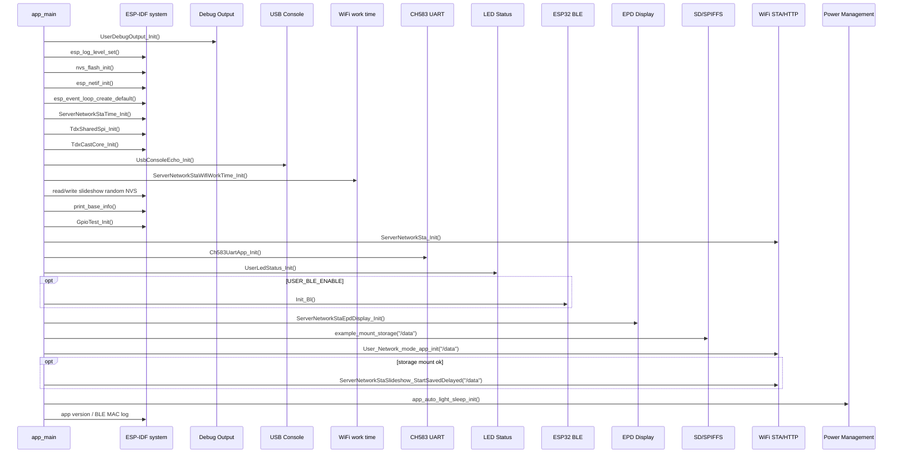
```mermaid
sequenceDiagram
    participant APP as app_main
    participant SYS as ESP-IDF system
    participant DBG as Debug Output
    participant USB as USB Console
    participant WORK as WiFi work time
    participant CH583 as CH583 UART
    participant LED as LED Status
    participant BLE as ESP32 BLE
    participant EPD as EPD Display
    participant SD as SD/SPIFFS
    participant STA as WiFi STA/HTTP
    participant PM as Power Management
    APP->>DBG: UserDebugOutput_Init()
    APP->>SYS: esp_log_level_set()
    APP->>SYS: nvs_flash_init()
    APP->>SYS: esp_netif_init()
    APP->>SYS: esp_event_loop_create_default()
    APP->>SYS: ServerNetworkStaTime_Init()
    APP->>SYS: TdxSharedSpi_Init()
    APP->>SYS: TdxCastCore_Init()
    APP->>USB: UsbConsoleEcho_Init()
    APP->>WORK: ServerNetworkStaWifiWorkTime_Init()
    APP->>SYS: read/write slideshow random NVS
    APP->>SYS: print_base_info()
    APP->>SYS: GpioTest_Init()
    APP->>STA: ServerNetworkSta_Init()
    APP->>CH583: Ch583UartApp_Init()
    APP->>LED: UserLedStatus_Init()
    opt USER_BLE_ENABLE
        APP->>BLE: Init_Bl()
    end
    APP->>EPD: ServerNetworkStaEpdDisplay_Init()
    APP->>SD: example_mount_storage("/data")
    APP->>STA: User_Network_mode_app_init("/data")
    opt storage mount ok
        APP->>STA: ServerNetworkStaSlideshow_StartSavedDelayed("/data")
    end
    APP->>PM: app_auto_light_sleep_init()
    APP->>SYS: app version / BLE MAC log
```


相关目录：

```text
main/
main/ch583_uart/
main/led_status/
main/epd_display/
main/server_network_sta/
main/usb_console_echo/
```

树状时序：

```text
main/main.c
└─ app_main()
   ├─ UserDebugOutput_Init()
   ├─ esp_log_level_set()
   ├─ nvs_flash_init()
   ├─ esp_netif_init()
   ├─ esp_event_loop_create_default()
   ├─ ServerNetworkStaTime_Init()
   │  └─ server_network_sta/time/server_network_sta_time.c
   │     ├─ setenv("TZ","CST-8") + tzset()
   │     ├─ 仅当 RTC / 系统时间无效时 settimeofday(default)
   │     ├─ esp_netif_sntp_init(start=false)
   │     └─ IP_EVENT_STA_GOT_IP 后 esp_netif_sntp_start()
   ├─ TdxSharedSpi_Init()
   │  └─ tdx_shared_spi.c 创建 SD/EPD 共用 SPI 递归 mutex
   ├─ TdxCastCore_Init()
   ├─ UsbConsoleEcho_Init()
   │  └─ usb_console_echo/usb_console_echo.c
   │     ├─ UsbConsoleEcho_Task()
   │     ├─ 延迟 USB_CONSOLE_START_DELAY_MS 后开始接收 HTTP-like 请求
   │     └─ 存储相关路由在 storage ready 前由 router 返回 1012
   ├─ ServerNetworkStaWifiWorkTime_Init()
   │  └─ server_network_sta/wifi_work_time/server_network_sta_wifi_work_time.c
   │     └─ work_state_task()
   ├─ app_nvs_read_str(TDX_SLIDESHOW_RANDOM_NVS_KEY)
   ├─ app_nvs_write_str(TDX_SLIDESHOW_RANDOM_NVS_KEY)
   ├─ print_base_info()
   │  └─ 打印短 boot 摘要：reset / flash / RAM / PSRAM / NVS / work state
   ├─ GpioTest_Init()
   ├─ ServerNetworkSta_Init()
   │  ├─ 创建 wifi_manager Task / Queue
   │  ├─ 创建 status 与同步请求 mutex
   │  └─ 所有 WiFi 控制命令由 manager 串行执行
   ├─ Ch583UartApp_Init()
   │  └─ ch583_uart/ch583_uart_app.c
   │     ├─ User_UartEventTask()
   │     ├─ User_UartReceiveTask()
   │     └─ 先启动 CH583 UART，供 C5 GPIO/LED 状态使用
   ├─ UserLedStatus_Init()
   │  └─ led_status/led_status.c
   │     └─ UserLedStatus_Task()
   ├─ Init_Bl()
   │  └─ 仅 USER_BLE_ENABLE=1 时编译执行
   ├─ ServerNetworkStaEpdDisplay_Init()
   │  └─ epd_display/epd_display_app.cpp
   │     └─ ServerNetworkStaEpdDisplay_Task()
   ├─ example_mount_storage("/data")
   │  └─ mount.c
   ├─ User_Network_mode_app_init("/data")
   │  └─ server_network_sta/server_network_sta.c
   ├─ storage_ret == ESP_OK
   │  └─ ServerNetworkStaSlideshow_StartSavedDelayed("/data")
   │     └─ server_network_sta/slideshow/server_network_sta_slideshow.c
   ├─ app_auto_light_sleep_init()
   │  └─ 网络、存储、轮播启动后再配置自动 light sleep
   ├─ usb_console_ansi_color_test()
   │  └─ 仅 USER_USB_CONSOLE_ANSI_COLOR_TEST_ENABLE=1 时打印
   ├─ esp_app_get_description()
   │  └─ 打印 app version
   └─ get_ble_mac_no_colon()
      └─ 打印 BLE MAC 来源和值
```

启动日志原则：

```text
错误或有问题使用 ESP_LOGE。
需要注意但可继续运行使用 ESP_LOGW。
普通关键节点使用 ESP_LOGI，日志内容保持短句。
可有可无的启动打印默认删除或用宏关闭，例如目录逐项列表、上传循环进度、演示色彩输出。
```

auto light sleep 接收链路注意事项：

```text
当前默认：
#define TDX_AUTO_LIGHT_SLEEP_ENABLE 0
CPU 运行策略固定 80 MHz / 80 MHz，light_sleep_enable=false。

原因：
CH583 UART1、USB Serial/JTAG、WiFi HTTP 都属于外部异步输入链路。
如果 ESP32-C5 在外部输入到达前进入 auto light sleep，唤醒阶段可能造成首包/首字节/首段数据不稳定。
CH583 UART1 已验证：短帧低频发送时，开启 auto light sleep 会导致 @# 帧头丢失；关闭 TDX_AUTO_LIGHT_SLEEP_ENABLE 后问题消失。
USB Serial/JTAG 和 WiFi HTTP 虽然机制不同，但同样可能受 auto light sleep 的唤醒延迟、USB FIFO/主机超时、WiFi PS/HTTP socket 超时影响。
因此开发阶段和需要可靠收包时，默认保持 TDX_AUTO_LIGHT_SLEEP_ENABLE=0。
EPD 显示期间会临时把 WiFi PS 切到 WIFI_PS_MAX_MODEM，以降低 EPD 刷屏和 WiFi 同时工作时的电流峰值；EPD 完成后恢复显示前的 WiFi PS。
```

---


存 / 取信息（含条件限制）：

```text
存：
- nvs_flash_init() 初始化 NVS 子系统，不直接写业务数据。
- 后续模块在启动中可能写入默认值：工作时长、EPD 类型、CH583 BLE MAC、轮播配置等。

取：
- EpdType_LoadSavedOrDefault() 读取已保存屏幕类型。
- example_mount_storage("/data") 挂载并读取 SD/SPIFFS 状态。
- User_Network_mode_app_init("/data") 读取已保存 WiFi 配置。
- ServerNetworkStaSlideshow_StartSavedDelayed("/data") 只用于开机自动恢复轮播：先等待 `TDX_SLIDESHOW_STARTUP_DELAY_MS=10000` 毫秒，延迟结束后若 EPD task 未完成则继续推迟；EPD 空闲后重新读取已保存轮播配置和控制状态。
```

[⬆ 返回目录](#toc) | [↩ 返回当前目录](#sec-01)

---

## 2. 配置与公共参数 <span id="sec-02"></span>

Mermaid 配置依赖图：

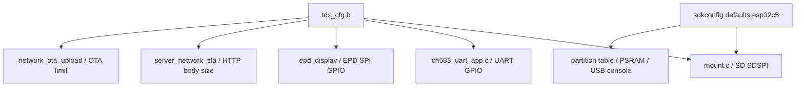
```mermaid
flowchart TD
    A[tdx_cfg.h] --> B[mount.c / SD SDSPI]
    A --> C[ch583_uart_app.c / UART GPIO]
    A --> D[epd_display / EPD SPI GPIO]
    A --> E[server_network_sta / HTTP body size]
    A --> F[network_ota_upload / OTA limit]
    G[sdkconfig.defaults.esp32c5] --> B
    G --> H[partition table / PSRAM / USB console]
```


相关文件：

```text
main/tdx_cfg.h
sdkconfig.defaults
sdkconfig.defaults.esp32c5
partitions/v2/16m.csv
```

功能说明：

```text
tdx_cfg.h
├─ WiFi/HTTP/USB/OTA/body size 配置
├─ CH583 UART C5 引脚配置
├─ 运行期调试日志输出配置
├─ EPD C5 SPI/GPIO 配置
├─ SD SDSPI C5 引脚配置
├─ CH583 LED 控制配置
├─ mDNS 名称配置
└─ NVS key / slideshow / work time / EPD type 配置
```

关键配置方向：

```text
sdkconfig.defaults.esp32c5
└─ C5 build config
   ├─ 16MB Flash
   ├─ partitions/v2/16m.csv
   ├─ SDSPI: MOSI=1 MISO=25 CLK=6 CS=26
   ├─ Quad PSRAM
   ├─ USB Serial/JTAG console
   └─ CPU0 timer affinity

tdx_cfg.h
└─ C source include
   ├─ mount.c 读取 USER_SD_SPI_*
   ├─ display_bsp.cpp / epd_display_app.cpp 读取 USER_EPD_*
   ├─ ch583_uart_app.c 读取 USER_CH583_UART_*
   ├─ debug_output.c 读取 USER_DEBUG_OUTPUT_* / USER_DEBUG_UART_*
   ├─ led_status.c 读取 USER_LED_CH583_*
   ├─ network_ota_upload.c 读取 SERVER_NETWORK_STA_OTA_*
   └─ server_network_sta.c 读取 USER_MDNS_*
```

串口和调试输出约定：

```text
CH583 通信串口：
UART1
TX = GPIO24
RX = GPIO23
baud = 115200

运行期调试日志：
默认仍使用 USB Serial/JTAG
可在 tdx_cfg.h 中选择 UART0 或 USB+UART0
UART0 TX = GPIO11
UART0 RX = GPIO12
UART0 baud = 921600
```

说明：

```text
sdkconfig / sdkconfig.defaults 控制 bootloader、ESP-IDF 早期 console 和系统默认 console。
tdx_cfg.h 中的 USER_DEBUG_OUTPUT_TARGET 只控制 app_main() 调用 UserDebugOutput_Init() 之后的应用层日志输出。
应用层 `ESP_LOGx` 和已接入 `UserDebugOutput_Printf()` 的直接 `printf` 调试输出，都按 USER_DEBUG_OUTPUT_TARGET 路由。
如果要把 bootloader/早期 ESP-IDF console 也切到 UART0，必须修改 SDK configuration；只改 tdx_cfg.h 不会生效。
当前默认不修改 SDK configuration，继续保留 USB Serial/JTAG console。
UART0 调试启用时，GPIO11/GPIO12 不再作为 gpio_test 输出脚使用。
```

日志相关宏：

```text
当前代码处于开发调试配置，以下默认值与 tdx_cfg.h 保持一致：

SERVER_NETWORK_STA_DEBUG_LOG_ENABLE=1
当前默认保留 WiFi STA 连接细节日志，便于排查 STA_START、BSSID、RSSI、WiFi PS、esp_wifi_start/connect 返回值。

SERVER_NETWORK_STA_LOG_PASSWORD_PLAINTEXT=1
当前开发阶段默认打印明文 WiFi 密码，便于本地配网调试；发布测试和正式版本必须改为 0。

USER_NVS_VERBOSE_LOG_ENABLE=1
当前默认保留 app_nvs 成功读写日志；如果只需失败日志，发布前建议改为 0。

USER_STORAGE_LIST_ON_STARTUP_ENABLE=0
默认不在启动时逐项扫描打印 /data 文件树。

USER_HTTP_FILE_LIST_LOG_ENABLE=0
默认不逐项打印 HTTP 目录列表文件；以后排查文件浏览输出时可打开。

USER_HTTP_MULTIPART_DETAIL_LOG_ENABLE=0
默认关闭 legacy multipart fallback 的 field、boundary、slot 等细节日志；关键保存和错误日志保留。

USER_USB_CONSOLE_ANSI_COLOR_TEST_ENABLE=1
当前默认保留 ANSI 颜色测试输出，发布前建议改为 0。

SERVER_NETWORK_STA_OTA_DETAIL_LOG_ENABLE=1
当前默认保留 OTA multipart boundary、field、firmware header 等底层细节日志；发布前建议改为 0。
```

---


存 / 取信息（含条件限制）：

```text
存：
- 本节是编译期配置，不直接执行运行时存储。

取：
- 各模块通过 include tdx_cfg.h 读取路径、NVS key、GPIO、body size、EPD type、WiFi 工作时长等宏。
- sdkconfig.defaults.esp32c5 / partitions/v2/16m.csv 在构建期被 IDF 读取。
```

[⬆ 返回目录](#toc) | [↩ 返回当前目录](#sec-02)

---

## 3. NVS 配置读写 <span id="sec-03"></span>

Mermaid 时序图：

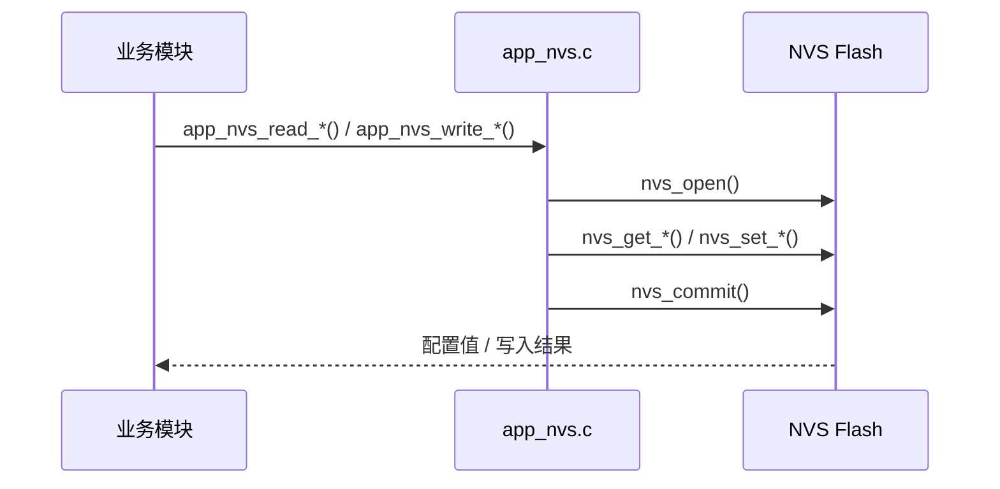
```mermaid
sequenceDiagram
    participant MOD as 业务模块
    participant NVSAPI as app_nvs.c
    participant FLASH as NVS Flash
    MOD->>NVSAPI: app_nvs_read_*() / app_nvs_write_*()
    NVSAPI->>FLASH: nvs_open()
    NVSAPI->>FLASH: nvs_get_*() / nvs_set_*()
    NVSAPI->>FLASH: nvs_commit()
    FLASH-->>MOD: 配置值 / 写入结果
```


相关文件：

```text
main/app_nvs.c
main/tdx_cfg.h
main/epd_display/epd_display_mode.c
main/epd_display/epd_display_mode.h
```

树状时序：

```text
业务模块
├─ app_nvs_read_u8()
├─ app_nvs_write_u8()
├─ app_nvs_read_str()
└─ app_nvs_write_str()

调用来源
├─ epd_display/epd_type.cpp
│  ├─ EpdType_LoadSavedOrDefault()
│  └─ EpdType_SetAndSave()
├─ epd_display/epd_display_mode.c
│  ├─ EpdDisplayMode_Init()
│  ├─ EpdDisplayMode_Set()
│  └─ EpdDisplayMode_SetBySlideshowSwitch()
├─ server_network_sta/wifi_work_time/server_network_sta_wifi_work_time.c
│  ├─ load_work_time_vars_from_app_nvs()
│  └─ save_work_time_vars_to_app_nvs()
├─ ch583_uart/ch583_wifi_uart_protocol.c
│  └─ ch583_wifi_handle_ble_mac()
└─ server_network_sta/slideshow/*
   └─ 保存 slideshow 状态和 last file
```

---


存 / 取信息（含条件限制）：

```text
存：
- app_nvs_write_u8(key, value)：写入 namespace="PhotoPainter" 的 u8。
  条件：key != NULL；nvs_open("PhotoPainter", NVS_READWRITE) 成功；nvs_set_u8() 成功后才 nvs_commit()。
- app_nvs_write_str(key, value)：写入 namespace="PhotoPainter" 的字符串。
  条件：key != NULL 且 value != NULL；nvs_open 成功；nvs_set_str() 成功后才 nvs_commit()。
- app_nvs_read_u8(key, out, default)：如果 key 不存在，会把 default 写入 NVS 并 commit。
  条件：key != NULL 且 out_value != NULL。

取：
- app_nvs_read_u8()：读取 u8；key 不存在时返回默认值并补写默认值。
- app_nvs_read_str()：读取字符串；条件为 key != NULL、value != NULL、value_size > 0。
- app_nvs_read_str() 使用 NVS_READONLY；打开失败或读取失败时，如 default_value 非 NULL，则把 default_value 拷到输出缓冲区。

主要调用：
- EPD 类型保存 / 读取。
- EPD 显示模式保存 / 读取：PhotoPainter:epd_mode，u8，0=NORMAL，1=SLIDESHOW，2=DAILY 预留。
- CH583 BLE MAC 保存 / 读取。
- WiFi 工作时间字符串兼容保存 / 读取。
- 凡是 show_control.txt 的 sw 写入成功，epd_mode 必须同步写入；sw=1 写 1，sw=0 写 0。

日志：
- 成功读写默认不打印，避免启动和轮播状态读写刷屏。
- `USER_NVS_VERBOSE_LOG_ENABLE=1` 时打印成功 read/write 的 key、value/size、ret。
- `nvs_open`、读取异常、写入/commit 失败保留日志；可继续使用默认值的读取问题用 `ESP_LOGW`，写入失败用 `ESP_LOGE`。
```

[⬆ 返回目录](#toc) | [↩ 返回当前目录](#sec-03)

---

## 4. 存储挂载：SD / SPIFFS <span id="sec-04"></span>

Mermaid 流程图：

```mermaid
flowchart TD
    A[example_mount_storage /data] --> B{CONFIG_EXAMPLE_MOUNT_SD_CARD}
    B -- false --> C[mount_spiffs_storage]
    B -- true --> D{CONFIG_EXAMPLE_USE_SDMMC_HOST}
    D -- true --> E[esp_vfs_fat_sdmmc_mount]
    D -- false --> F[SDSPI_HOST_DEFAULT]
    F --> G[spi_bus_initialize]
    G --> H[esp_vfs_fat_sdspi_mount]
    H -- failed <= 3 --> R[save sd_fail_count and esp_restart]
    H -- failed > 3 --> C
    C --> I[ensure_default_storage_dirs]
    H -- ok --> I
    I --> J[/data/bin_img + /data/jpg_img]
```


相关文件：

```text
main/mount.c
main/file_serving_example_common.h
```

树状时序：

```text
main/main.c
└─ app_main()
   └─ example_mount_storage("/data")
      └─ mount.c
         ├─ CONFIG_EXAMPLE_MOUNT_SD_CARD disabled
         │  └─ mount_spiffs_storage()
         └─ CONFIG_EXAMPLE_MOUNT_SD_CARD enabled
            ├─ CONFIG_EXAMPLE_USE_SDMMC_HOST
            │  └─ esp_vfs_fat_sdmmc_mount()
            └─ SDSPI path for C5
               ├─ SDSPI_HOST_DEFAULT()
               ├─ host.slot = USER_SD_SPI_HOST
               ├─ spi_bus_initialize()
               │  └─ ESP_ERR_INVALID_STATE 时复用 EPD 已初始化的 SPI bus
               ├─ esp_vfs_fat_sdspi_mount()
               ├─ SD 挂载失败
               │  ├─ sd_fail_count += 1 并保存到 NVS
               │  ├─ fail_count <= 3 时延迟 200ms 后 esp_restart()
               │  └─ fail_count > 3 时清零计数并 mount_spiffs_storage()
               ├─ SD 挂载成功
               │  └─ 如 sd_fail_count 非 0，则清零计数
               ├─ ensure_default_storage_dirs()
               │  ├─ /data/bin_img
               │  └─ /data/jpg_img
               └─ example_print_storage_info()
```

辅助函数：

```text
mount.c
├─ ensure_storage_dir()
├─ ensure_default_storage_dirs()
├─ mount_spiffs_storage()
├─ storage_read_sd_fail_count()
├─ storage_write_sd_fail_count()
├─ handle_sd_mount_failure()
├─ example_storage_get_type()
├─ example_storage_is_sd_card()
├─ example_storage_supports_directories()
├─ example_storage_get_free_bytes()
└─ example_print_storage_info()
```

---


存 / 取信息（含条件限制）：

```text
存：
- SD 卡模式：挂载 /data 后创建默认目录：bin_img、jpg_img、cast_img 等。
- SD 挂载失败计数：`PhotoPainter:sd_fail_count`，默认 0；SD 挂载失败时加 1 并保存，SD 挂载成功时清零。
- SPIFFS fallback：只有 SD 连续失败计数超过 3 后才挂载 label="assets"，format_if_mount_failed=true，并清零 `sd_fail_count`。

取：
- example_storage_get_free_bytes() 读取 SD/FATFS 或 SPIFFS 剩余容量。
- example_print_storage_info() 读取挂载状态、容量、目录树、txt 文件内容。
- list_storage_tree() 扫描并打印 /data 下文件。
- SD 挂载参数：上电等待 1000ms；单次启动内最多重试 3 次；重试间隔 300ms。失败计数未超过阈值时不进入 SPIFFS，而是软件复位后重试 SD。

日志：
- 保留关键节点：SD mount start、SDSPI pins、bus reuse、SD ready、SPIFFS fallback、storage ready、mount failed。
- 失败或不可恢复问题使用 `ESP_LOGE`；可继续 fallback 或复用 bus 的情况使用 `ESP_LOGW`；普通挂载成功节点使用 `ESP_LOGI`。
- 启动目录逐项列表由 `USER_STORAGE_LIST_ON_STARTUP_ENABLE` 控制，默认关闭。
- HTTP 目录列表逐项文件日志由 `USER_HTTP_FILE_LIST_LOG_ENABLE` 控制，默认关闭。
```

[⬆ 返回目录](#toc) | [↩ 返回当前目录](#sec-04)

---

## 5. WiFi STA 与 HTTP Server <span id="sec-05"></span>

Result 定义建议：

| 返回 | result | 说明 |
|---|---|---|
| `ping_result` | `0` | `/ping` 正常返回，包含 `Ble_MAC` |
| `ping_result` | `1405` | `Ble_MAC` 尚未从 CH583 获取；网络和 USB 当前均返回该错误码 |
| WiFi 连接事件通知 | `1307` | WiFi 连接超时 |
| WiFi 连接事件通知 | `1308` | WiFi 认证失败 |
| WiFi 连接事件通知 | `1309` | WiFi 获取 IP 失败 |

WiFi、DHCP、HTTP 与 mDNS 由唯一的 `wifi_manager` Task 管理。BLE / CH583 和 USB 的普通 `wifi` 配网请求先保存配置，再通过一个 `NEW_CREDENTIAL` 命令交给 manager；调用者不再先发送 PROVISIONING 后再发送 FORCE_CONNECT。后台结果仍使用 `1307`（连接超时）、`1308`（连续认证失败）和 `1309`（已关联但未取得 IP）。`wifi_wakeup` 会识别 CONNECTING、DISCONNECTING、WAITING_IP、RETRY_WAIT、GOT_IP、STARTING_SERVICES、READY、AUTH_FAILED、NO_CONFIG 和 FAILED；已有连接、主动断线或恢复流程时只返回当前 stage，不重复强制重连。进入 DISCONNECTING 时立即清除旧 IP、HTTP ready 和 mDNS ready。USB `/wifi` 仍只同步返回保存和 worker 提交结果，`wifi_status` 可查询完整状态快照及 last_result、连接/凭据代次、断线目的和 READY 稳定窗口剩余时间。

WiFi 重试间隔固定为 `1000/2000/3000/3500/4000/4500 ms`，第6次以后保持4500 ms。进入 READY 后必须连续稳定30秒才清零连接、抖动和认证累计计数，因此短时间反复掉线会逐级退避；稳定30秒后的第一次掉线仍从1000 ms开始。driver 的 `failure_retry_cnt=0`，不存在第二套 driver 重试。

Mermaid 时序图：

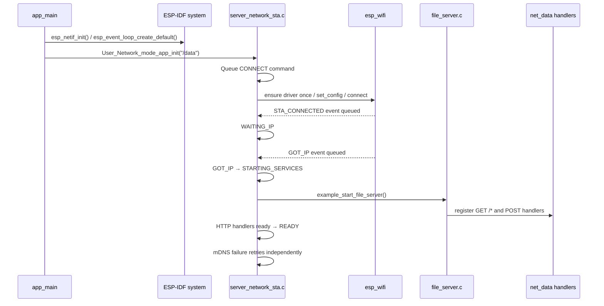
```mermaid
sequenceDiagram
    participant APP as app_main
    participant SYS as ESP-IDF system
    participant STA as server_network_sta.c
    participant WIFI as esp_wifi
    participant HTTP as file_server.c
    participant NET as net_data handlers
    APP->>SYS: esp_netif_init() / esp_event_loop_create_default()
    APP->>STA: User_Network_mode_app_init("/data")
    STA->>STA: Queue CONNECT command
    STA->>WIFI: ensure driver once / set_config / connect
    WIFI-->>STA: STA_CONNECTED event queued
    STA->>STA: WAITING_IP
    WIFI-->>STA: GOT_IP event queued
    STA->>STA: GOT_IP → STARTING_SERVICES
    STA->>HTTP: example_start_file_server()
    HTTP->>NET: register GET /* and POST handlers
    STA->>STA: HTTP handlers ready → READY
    STA->>STA: mDNS failure retries independently
```


相关文件：

```text
main/server_network_sta/server_network_sta.c
main/server_network_sta/server_network_sta.h
main/file_server.c
```

WiFi 启动树状时序：

```text
main/main.c
└─ app_main()
   ├─ ServerNetworkSta_Init()
   │  ├─ 创建 wifi_manager Queue / Task / status mutex
   │  └─ WiFi/IP callback 只负责非阻塞投递事件
   └─ User_Network_mode_app_init("/data")
      └─ Queue CONNECT
         └─ wifi_manager
            ├─ 读取 wifi:ssid/password，失败时回退 nvs.net80211
            ├─ ensure_wifi_stack()：driver、netif、handler 只初始化一次
            ├─ channel hint=0，failure_retry_cnt=0
            ├─ CONNECTING → WAITING_IP → GOT_IP
            ├─ STARTING_SERVICES
            │  ├─ HTTP handler 全部成功后置 ready
            │  └─ mDNS 失败独立后台重试
            └─ READY
```

事件处理时序：

```text
ESP-IDF WiFi/IP event
└─ wifi_event_handler()
   └─ xQueueSend(..., 0)
      └─ wifi_manager
         ├─ STA_CONNECTED → WAITING_IP
         ├─ GOT_IP → STARTING_SERVICES → READY
         ├─ LOST_IP → expected disconnect(DHCP_RECOVERY) → RETRY_WAIT
         ├─ DISCONNECTED → purpose/物理链路/当前代次校验
         └─ 队列满 → atomic resync/provisioning 兜底
```

HTTP server 注册时序：

```text
file_server.c
└─ example_start_file_server()
   ├─ httpd_start()
   ├─ register GET /
   │  └─ index_html_get_handler()
   ├─ register GET /*
   │  └─ download_get_handler()
   │     ├─ ServerNetworkStaPing_ProcessGet(req)
   │     │  └─ 如果 URI 是 /ping，直接返回 ping JSON
   │     ├─ ServerNetworkStaSavedImages_SendThumbnail()
   │     └─ 普通静态文件 / 目录列表处理
   ├─ register legacy upload/delete
   │  ├─ upload_post_handler()
   │  └─ delete_post_handler()
   └─ server_network_sta_net_data_register_handlers()
      └─ server_network_sta/net_data/server_network_sta_data.c
         ├─ register POST /dataUP
         ├─ register POST /ota
         └─ register POST /ota_upload
```

HTTP server 内存与生命周期说明：

```text
当前工程按 HTTP server 单实例持续运行设计。
file_server.c 保存 httpd handle、server_data 和 handlers-ready 状态。
任何必要 URI 注册失败都会 httpd_stop、释放 server_data、清空 handle 并返回错误。
http_running 表示 HTTP Task 实例存在；http_ready 表示当前有 IP 且必要 handlers 已完成注册。
WiFi 断线时 http_running 可以保持 true，但 http_ready 必须为 false；重新取得 IP 后不重复启动实例或注册 handlers。
```

auto light sleep / HTTP 接收注意事项：

```text
当前默认 TDX_AUTO_LIGHT_SLEEP_ENABLE=0，HTTP 接收可靠性优先。
运行时 PM 仍可配置为 80 MHz 固定频率，但不进入 Auto Light-sleep。
如果开启 auto light sleep，WiFi 省电、CPU 唤醒延迟、HTTP socket 超时可能叠加影响网络请求。
表现可能是 /ping 偶发慢响应、POST /dataUP body 接收失败、httpd_req_recv() 返回错误、客户端认为连接超时或断开。
尤其是 App/PC 发送小 JSON 后立即等待响应，或者发送大 body/multipart/OTA 时，不建议启用 auto light sleep。
若后续必须开启，需要单独验证 WiFi PS、HTTP timeout、客户端重试策略和大包上传稳定性。
```

---


### V2 协议资料拆分：ping 连通性检查

请求：

```http
GET /ping HTTP/1.1
```

成功返回示例：

```json
{
  "func": "ping_result",
  "result": 0,
  "message": "ok",
  "Ble_MAC": "AABBCCDDEEFF"
}
```

说明：前端写操作前会优先访问缓存端点的 `/ping`。如果响应包含 `Ble_MAC` 或 `ble_mac`，需要与目标设备 MAC 一致，避免缓存 IP 指向错误设备。


存 / 取信息（含条件限制）：

```text
存：
- 本模块连接 WiFi 和启动 HTTP Server，不直接保存 WiFi 配置。

取：
- server_network_sta_read_saved_wifi() 优先读取 namespace="wifi" 的 ssid/password。
- 读取失败后读取 namespace="nvs.net80211" 的 sta.ssid / sta.pswd blob。
- manager 收到 IP_EVENT_STA_GOT_IP 后校验当前 AP/IP，再推进 GOT_IP、STARTING_SERVICES 和 READY。
- HTTP handlers 注册失败会独立重试；mDNS 失败不阻止直接通过 IP 使用 HTTP，并在后台独立重试。

日志：
- 当前处于开发阶段，WiFi credential 读取成功时允许明文打印 ssid/password，便于确认配网和 NVS 内容。
- 保留关键节点：saved WiFi 读取结果、WiFi IP、断开原因、认证累计达到阈值、mDNS ready、HTTP server ready、网络初始化失败。
- 当前 `SERVER_NETWORK_STA_DEBUG_LOG_ENABLE=1`，默认保留 STA_START、BSSID/RSSI、WiFi PS、esp_wifi_start/connect 返回值等细节日志；发布前建议改为 0。
```

[⬆ 返回目录](#toc) | [↩ 返回当前目录](#sec-05)

---

## 6. 网络 HTTP 数据入口汇总 <span id="sec-06"></span>

Mermaid 总入口图：

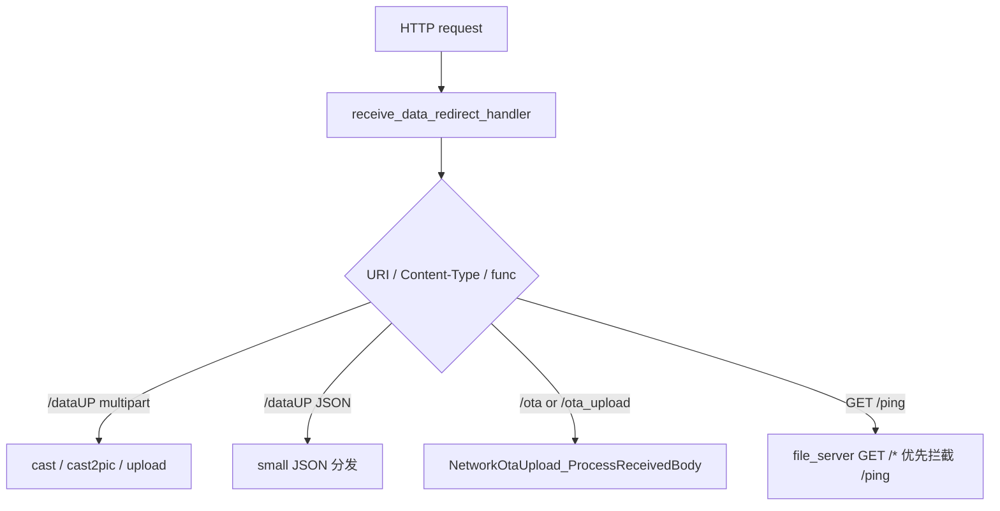
```mermaid
flowchart TD
    A[HTTP request] --> B[receive_data_redirect_handler]
    B --> C{URI / Content-Type / func}
    C -->|/dataUP multipart| D[cast / cast2pic / upload]
    C -->|/dataUP JSON| E[small JSON 分发]
    C -->|/ota or /ota_upload| F[NetworkOtaUpload_ProcessReceivedBody]
    C -->|GET /ping| G[file_server GET /* 优先拦截 /ping]
```


相关目录：

```text
main/server_network_sta/net_data/
main/server_network_sta/cast/
main/server_network_sta/cast2pic/
main/server_network_sta/upload/
main/server_network_sta/ota/
main/server_network_sta/delete/
main/server_network_sta/saved_images/
main/server_network_sta/snapshot/
main/server_network_sta/slideshow/
main/server_network_sta/slideshow_control/
main/server_network_sta/wifi_work_time/
main/server_network_sta/ping/
main/server_network_sta/time/
```

入口总览：

```text
HTTP POST /dataUP or /ota or /ota_upload
└─ server_network_sta/net_data/server_network_sta_data.c
   └─ receive_data_redirect_handler()
      ├─ get_request_header_value()
      ├─ ServerNetworkStaWifiWorkTime_OnNetworkData()
      ├─ NetworkOtaUpload_IsOtaRequest()
      ├─ alloc_request_body_buffer()
      ├─ read_request_body_to_buffer()
      ├─ send_dataup_error_response()
      ├─ OTA request
      │  └─ NetworkOtaUpload_ProcessReceivedBody()
      ├─ small JSON request
      │  └─ process_small_json_request()
      └─ multipart request
         ├─ ServerNetworkStaCast2Pic_Process()
         ├─ ServerNetworkStaCast_Process()
         ├─ ServerNetworkStaUpload_Process()
         └─ process_multipart_upload_request()
```

内存管理说明：

```text
/dataUP 当前实现会先通过 alloc_request_body_buffer() 申请 request body 缓冲区，优先使用 PSRAM。
read_request_body_to_buffer() 会把完整 body 读入内存后再分发，不是 streaming parse，也不是边收边写。
处理结束后由 receive_data_redirect_handler() 调用 heap_caps_free(body) 释放缓冲区。

风险：
- 大图片、大 multipart、OTA 都依赖 PSRAM 可用空间和 HTTP body 最大长度限制。
- OTA 当前同样依赖 HTTP body 完整接收后再解析 firmware part，然后再写 OTA 分区。
- 如果后续要降低内存峰值，建议改成 streaming parse / 边收边写 SD / 边收边写 OTA。

当前主要 body 限制：
- 普通 `/dataUP` 最大 body：`SERVER_NETWORK_STA_DATAUP_MAX_BODY_SIZE = 2MB`。
- 小 JSON 最大 body：`SERVER_NETWORK_STA_SMALL_JSON_BODY_MAX = 4096 bytes`。
- OTA 最大 body：`SERVER_NETWORK_STA_OTA_UPLOAD_MAX_BODY_SIZE = 6MB`。
- OTA multipart 预留开销：`SERVER_NETWORK_STA_OTA_MULTIPART_OVERHEAD_BYTES = 64KB`。
- USB HTTP-like body 最大值复用：`USB_CONSOLE_HTTP_BODY_MAX = SERVER_NETWORK_STA_DATAUP_MAX_BODY_SIZE`。

非 OTA `/dataUP` 超过最大 body 时保留 HTTP 413 并返回 `dataup_result/1006` JSON；request body 缓冲区分配失败时保留 HTTP 500 并返回 `dataup_result/1011` JSON。OTA 请求继续使用独立的 `ota_result/170x` 错误映射。
```

存 / 取信息（含条件限制）：

```text
存：
- net_data 入口本身只在 RAM/PSRAM 中申请 request body 缓冲区，处理完成后释放。
- 真正持久化由下游模块完成：cast/upload/cast2pic 写 SD，ota 写 OTA 分区，slideshow 写配置文件，wifi_work_time 写 NVS。

取：
- 从 HTTP request 读取 header、body、multipart boundary、JSON func。
- 根据 URI、Content-Type、func 分发到对应模块。

日志：
- 保留入口关键节点：HTTP data header、enter、dispatch=ota/json/multipart、upload busy、body too large、recv failed。
- `small JSON` 内容较小，收到后打印完整 JSON body。
- legacy multipart fallback 的 boundary、part field、upload slot 等细节由 `USER_HTTP_MULTIPART_DETAIL_LOG_ENABLE` 控制，默认关闭。
```


### 6.1 网络 HTTP 数据入口：dataUP <span id="sec-06-1"></span>

Mermaid 时序图：

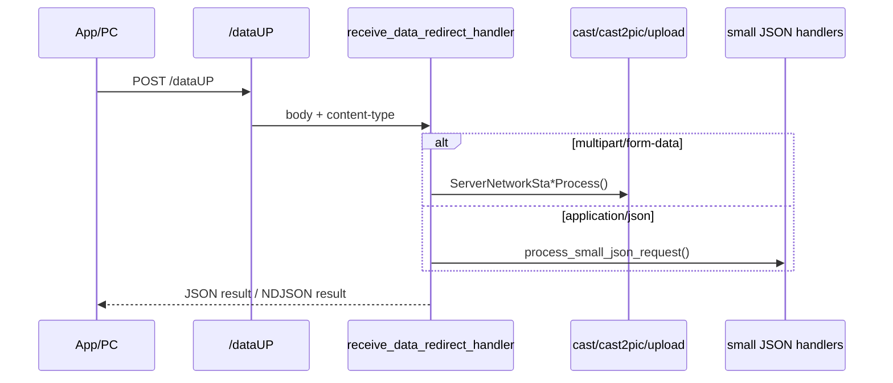
```mermaid
sequenceDiagram
    participant APP as App/PC
    participant HTTP as /dataUP
    participant REDIR as receive_data_redirect_handler
    participant CAST as cast/cast2pic/upload
    participant JSON as small JSON handlers
    APP->>HTTP: POST /dataUP
    HTTP->>REDIR: body + content-type
    alt multipart/form-data
        REDIR->>CAST: ServerNetworkSta*Process()
    else application/json
        REDIR->>JSON: process_small_json_request()
    end
    REDIR-->>APP: JSON result / NDJSON result
```


```text
HTTP POST /dataUP
└─ server_network_sta/net_data/server_network_sta_data.c
   └─ receive_data_redirect_handler()
      ├─ get_request_header_value()
      ├─ ServerNetworkStaWifiWorkTime_OnNetworkData()
      ├─ alloc_request_body_buffer()
      ├─ read_request_body_to_buffer()
      ├─ small JSON request
      │  └─ process_small_json_request()
      └─ multipart request
         ├─ ServerNetworkStaCast2Pic_Process()
         ├─ ServerNetworkStaCast_Process()
         ├─ ServerNetworkStaUpload_Process()
         └─ process_multipart_upload_request()
```


### V2 协议资料拆分：HTTP 图片与控制接口总览

`V2_相框传图协议.html` 中 HTTP 部分统一说明：图片类接口使用 `POST /dataUP` + `multipart/form-data`，JSON 控制类接口使用 `POST /dataUP` + JSON，连通性检查使用 `GET /ping`。

| func / path | 分类 | 放入本文档章节 | 请求格式 |
|---|---|---|---|
| `cast` | multipart 图片接口 | [7.1 cast：投屏业务模块](#sec-07-1) | `POST /dataUP` + multipart |
| `upload` | multipart 图片接口 | [7.11 upload：PC或手机传文件到ESP32-C5，并存](#sec-07-11) | `POST /dataUP` + multipart |
| `cast2pic` | multipart 图片接口 | [7.2 cast2pic：投屏转图片缓存 / 显示](#sec-07-2) | `POST /dataUP` + multipart |
| `update` | multipart 图片接口，前端预留 | 本节保留说明 | `POST /dataUP` + multipart |
| `get_saved_images` | JSON 控制接口 | [7.7 get_saved_images：取出本地存储图片](#sec-07-7) | `POST /dataUP` + JSON |
| `get_snapshot` | JSON 控制接口 | [7.10 snapshot：读取图片列表和轮播状态](#sec-07-10) | `POST /dataUP` + JSON |
| `start_slideshow` | JSON 控制接口 | [7.8 slideshow：图片轮播的文件列表，轮播间隔，是否随机](#sec-07-8) | `POST /dataUP` + JSON |
| `set_slideshow` | JSON 控制接口 | [7.9 slideshow_control：轮播控制模块](#sec-07-9) | `POST /dataUP` + JSON |
| `delete` | JSON 控制接口 | [7.3 delete：图片 / 缓存文件删除逻辑](#sec-07-3) | `POST /dataUP` + JSON |
| `set_wifi_work_time` | JSON 控制接口 | [7.12 wifi_work_time：WiFi 省电管理](#sec-07-12) | `POST /dataUP` + JSON |
| `/ping` | HTTP GET | [5. WiFi STA 与 HTTP Server](#sec-05) | `GET /ping` |

`update` 在 V2 协议中是“替换旧图片，当前前端预留”：字段包括 `oldfileNames`、`newfileNames`、`bin_size`、`image_size`、`save`、`show`、`bin`、`image`。当前 `main/CMakeLists.txt` 已列出 `cast`、`cast2pic`、`upload` 等网络模块，但没有单独列出 `server_network_sta/update` 源文件，因此本文只记录为 V2 预留接口，不写成当前已实现链路。


存 / 取信息（含条件限制）：

```text
存：
- /dataUP 入口不直接持久化；按 func 转交下游模块。

取：
- 读取 HTTP body 到内存缓冲区。
- multipart 请求读取 boundary 和各 part。
- JSON 请求读取 func 后转入 small JSON 分发。

日志：
- `/dataUP` 入口保留短日志：header、uri、len、content-type、分发类型、异常原因。
- multipart 图片业务的保存/显示结果由 cast、cast2pic、upload 下游模块打印。
- legacy multipart fallback 只保留保存成功/打开失败等关键日志；解析细节默认关闭。
```

[⬆ 返回目录](#toc) | [↩ 返回当前目录](#sec-06)

### 6.2 网络 HTTP 数据入口：ota <span id="sec-06-2"></span>

Mermaid 时序图：

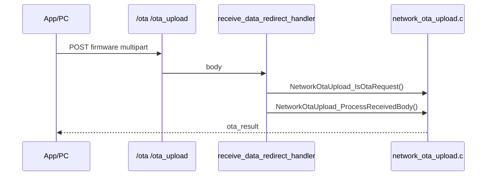
```mermaid
sequenceDiagram
    participant APP as App/PC
    participant HTTP as /ota /ota_upload
    participant REDIR as receive_data_redirect_handler
    participant OTA as network_ota_upload.c
    APP->>HTTP: POST firmware multipart
    HTTP->>REDIR: body
    REDIR->>OTA: NetworkOtaUpload_IsOtaRequest()
    REDIR->>OTA: NetworkOtaUpload_ProcessReceivedBody()
    OTA-->>APP: ota_result
```


```text
HTTP POST /ota or /ota_upload
└─ server_network_sta/net_data/server_network_sta_data.c
   └─ receive_data_redirect_handler()
      ├─ get_request_header_value()
      ├─ ServerNetworkStaWifiWorkTime_OnNetworkData()
      ├─ NetworkOtaUpload_IsOtaRequest()
      ├─ NetworkOtaUpload_GetMaxBodySize()
      ├─ alloc_request_body_buffer()
      ├─ read_request_body_to_buffer()
      └─ NetworkOtaUpload_ProcessReceivedBody()
```


存 / 取信息（含条件限制）：

```text
存：
- OTA 请求最终由 network_ota_upload 写入 OTA update partition，并设置 boot partition。

取：
- 读取 multipart meta 与 firmware/bin 字段。
- 读取当前 running partition、固件 app_desc、目标 OTA partition 信息。

日志：
- 保留关键节点：detect ota request、max body size、meta raw/parsed、ota write start、版本/分区检查、写入进度、verify、set boot、reboot。
- firmware 指针、boundary 内容、multipart field、firmware header 等底层细节由 `SERVER_NETWORK_STA_OTA_DETAIL_LOG_ENABLE` 控制；当前开发配置默认开启，发布前建议关闭。
- OTA 失败阶段使用 `ESP_LOGE`，可继续返回错误响应的异常使用 `ESP_LOGW` 或 OTA result JSON 表达。
```

[⬆ 返回目录](#toc) | [↩ 返回当前目录](#sec-06)

### 6.3 网络 HTTP 数据入口：small JSON <span id="sec-06-3"></span>

Mermaid 分发图：

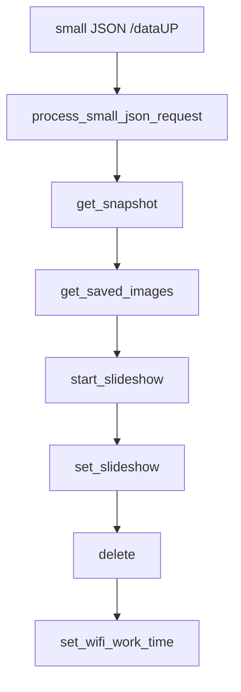
```mermaid
flowchart TD
    A[small JSON /dataUP] --> B[process_small_json_request]
    B --> C[get_snapshot]
    C --> D[get_saved_images]
    D --> E[start_slideshow]
    E --> F[set_slideshow]
    F --> G[delete]
    G --> H[set_wifi_work_time]
```


small JSON 分发：

```text
process_small_json_request()
├─ ServerNetworkStaSnapshot_ProcessJson()
├─ ServerNetworkStaSavedImages_ProcessJson()
├─ ServerNetworkStaSlideshow_ProcessJson()
├─ ServerNetworkStaSlideshowControl_ProcessJson()
├─ ServerNetworkStaDelete_ProcessJson()
└─ ServerNetworkStaWifiWorkTime_ProcessJson()
```

说明：这里按 `server_network_sta_data.c` 的实际调用顺序记录；每个处理函数返回 `ESP_ERR_NOT_SUPPORTED` 时继续尝试下一个。

GET /ping：

```text
HTTP GET /ping
└─ file_server.c
   └─ download_get_handler()
      ├─ ServerNetworkStaPing_ProcessGet(req)
      │  ├─ ServerNetworkStaWifiWorkTime_OnNetworkData()
      │  ├─ get_ble_mac_no_colon()
      │  └─ httpd_resp_sendstr()
      └─ 非 /ping 时继续走缩略图/静态文件/目录列表处理
```

---


存 / 取信息（含条件限制）：

```text
存：
- small JSON 入口不直接存储。
- set_slideshow / start_slideshow / set_wifi_work_time 等由对应模块保存到文件或 NVS。

取：
- 读取 JSON func 字段。
- 根据源码顺序依次尝试 snapshot、saved_images、slideshow、slideshow_control、delete、wifi_work_time。

日志：
- small JSON body 小，入口打印完整 body：`small JSON len=... body=...`。
- 每个已识别 func 打印短结果：`small JSON func=... ret=...`。
- 非 JSON body、未知 func 使用 `ESP_LOGW`。
```

[⬆ 返回目录](#toc) | [↩ 返回当前目录](#sec-06)

---

## 7. 网络HTTP功能汇总 <span id="sec-07"></span>

本章把原来的 `cast`、`cast2pic`、`upload`、`ota`、`delete`、`saved_images`、`slideshow`、`slideshow_control`、`snapshot`、`ping`、`time`、`wifi_work_time` 等网络 HTTP 功能重新归到一个二级目录下。
入口主要来自 `POST /dataUP`、`POST /ota`、`POST /ota_upload`；`GET /ping` 和 `GET /time` 由 `file_server.c` 的 `GET /* -> download_get_handler()` 优先拦截。

Mermaid 总体分发图：

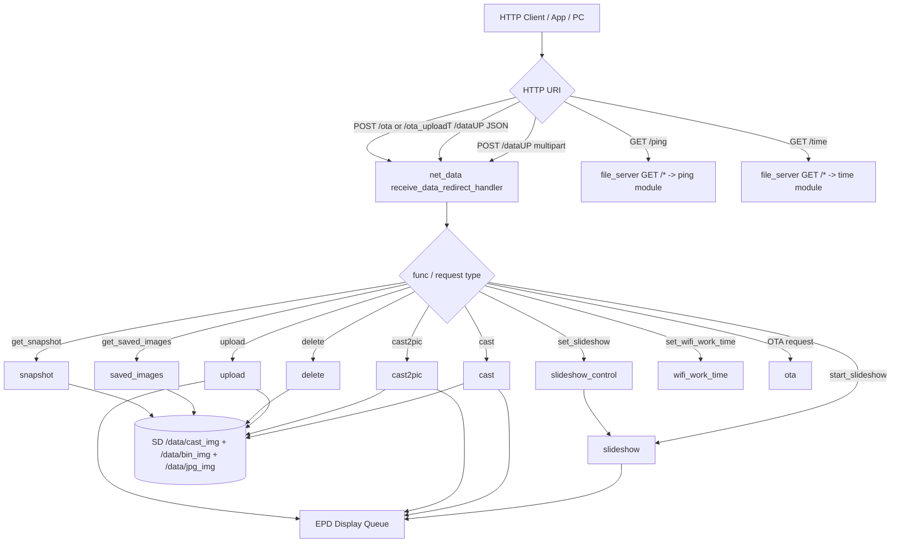
```mermaid
flowchart TD
    A[HTTP Client / App / PC] --> B{HTTP URI}
    B -->|POST /dataUP multipart| C[net_data receive_data_redirect_handler]
    B -->|POST /dataUP JSON| C
    B -->|POST /ota or /ota_upload| C
    B -->|GET /ping| P[file_server GET /* -> ping module]
    B -->|GET /time| T[file_server GET /* -> time module]
    C --> D{func / request type}
    D -->|cast| E[cast]
    D -->|cast2pic| F[cast2pic]
    D -->|upload| G[upload]
    D -->|delete| H[delete]
    D -->|get_saved_images| I[saved_images]
    D -->|get_snapshot| J[snapshot]
    D -->|start_slideshow| K[slideshow]
    D -->|set_slideshow| L[slideshow_control]
    D -->|set_wifi_work_time| M[wifi_work_time]
    D -->|OTA request| N[ota]
    E --> SD[(SD /data/cast_img + /data/bin_img + /data/jpg_img)]
    F --> SD
    G --> SD
    H --> SD
    I --> SD
    J --> SD
    K --> EPD[EPD Display Queue]
    L --> K
    E --> EPD
    F --> EPD
    G --> EPD
```

相关目录：

```text
main/server_network_sta/net_data/
main/server_network_sta/cast/
main/server_network_sta/cast2pic/
main/server_network_sta/delete/
main/server_network_sta/ota/
main/server_network_sta/ping/
main/server_network_sta/saved_images/
main/server_network_sta/slideshow/
main/server_network_sta/slideshow_control/
main/server_network_sta/snapshot/
main/server_network_sta/time/
main/server_network_sta/upload/
main/server_network_sta/wifi_work_time/
```

树状时序总览：

```text
HTTP request
├─ GET /ping
│  └─ ServerNetworkStaPing_ProcessGet()
├─ GET /time
│  └─ ServerNetworkStaTime_ProcessGet()
└─ POST /dataUP / /ota / /ota_upload
   └─ receive_data_redirect_handler()
      ├─ NetworkOtaUpload_IsOtaRequest()
      │  └─ NetworkOtaUpload_ProcessReceivedBody()
      ├─ multipart func=cast
      │  └─ ServerNetworkStaCast_Process()
      ├─ multipart func=cast2pic
      │  └─ ServerNetworkStaCast2Pic_Process()
      ├─ multipart func=upload
      │  └─ ServerNetworkStaUpload_Process()
      └─ small JSON func
         ├─ ServerNetworkStaSavedImages_ProcessJson()
         ├─ ServerNetworkStaSnapshot_ProcessJson()
         ├─ ServerNetworkStaDelete_ProcessJson()
         ├─ ServerNetworkStaSlideshow_ProcessJson()
         ├─ ServerNetworkStaSlideshowControl_ProcessJson()
         └─ ServerNetworkStaWifiWorkTime_ProcessJson()
```

关键辅助函数：

```text
receive_data_redirect_handler()
├─ get_request_header_value()
├─ ServerNetworkStaWifiWorkTime_OnNetworkData()
├─ NetworkOtaUpload_IsOtaRequest()
├─ alloc_request_body_buffer()
├─ read_request_body_to_buffer()
├─ process_small_json_request()
└─ server_network_sta_net_data_register_handlers()
```


Powershell 测试公共变量：

```powershell
# 设备 IP，按实际设备 IP 修改。
$esp = "http://192.168.1.104"

# 测试用文件路径，按实际 PC 文件修改。
$bin = "H:\AI2\test\26422.bin"
$jpg = "H:\AI2\test\26422.jpg"

# 计算 multipart 里要带的大小字段。
$binSize = (Get-Item $bin).Length
$jpgSize = (Get-Item $jpg).Length
```

说明：

```text
- JSON 接口优先使用 Invoke-RestMethod。
- multipart/form-data 接口使用 curl.exe -F，避免 Windows PowerShell 5.1 手工拼 multipart。
- 所有测试前先确认设备已经联网，且 $esp 能访问。
```
V2 协议资料拆分：

```text
V2 协议中，HTTP 图片与控制协议主要使用：
├─ POST /dataUP + multipart/form-data
│  ├─ cast
│  ├─ upload
│  ├─ cast2pic
│  └─ update（前端预留）
├─ POST /dataUP + JSON
│  ├─ get_saved_images
│  ├─ get_snapshot
│  ├─ start_slideshow
│  ├─ set_slideshow
│  ├─ delete
│  └─ set_wifi_work_time
├─ GET /ping
│  └─ ping_result
└─ GET /time
   └─ time_result
```

---

存 / 取信息（含条件限制）：

```text
存：
- network/USB cast/cast2pic：/data/cast_img/*.bin，/data/cast_img/*.jpg。
- upload / saved_images / slideshow：/data/bin_img/*.bin，/data/jpg_img/*.jpg。
- 状态类：last cast 记录、slideshow_config、show_control / slideshow control 文件。
- OTA 类：OTA update partition。
- WiFi 工作时间：NVS blob + PhotoPainter 字符串 key。

取：
- 图片列表从 /data/jpg_img 扫描。
- snapshot 读取图片列表和轮播配置。
- ping 读取 CH583 BLE MAC。
- time 读取 RTC / 系统时间和 SNTP 同步状态。
- slideshow 启动时读取保存的轮播配置。
```


### 7.1 cast：投屏业务模块 <span id="sec-07-1"></span>

Result 定义建议：

| 返回 | result | 说明 |
|---|---|---|
| `cast_received` | `0` | 已收到并开始处理 cast |
| `cast_result` | `0` | cast 成功 |
| `cast_result` | `1601` | multipart boundary 缺失 |
| `cast_result` | `1602` | multipart `func` 缺失 |
| `cast_result` | `1603` | 上传内容格式非法 |
| `cast_result` | `1604` | `bin` 缺失 |
| `cast_result` | `1605` | `image` 缺失 |
| `cast_result` | `1606` | `bin_size` / `image_size` 与实际数据不一致 |
| `cast_result` | `1607` | 保存 bin 失败 |
| `cast_result` | `1608` | 保存 image 失败 |
| `cast_result` | `1609` | EPD 显示队列提交失败 |
| `cast_result` | `1008` | EPD 同步显示等待或驱动 BUSY 超时 |
| `cast_result` | `1011` | EPD 显示 buffer / completion 内存不足 |
| `cast_result` | `1012` | 存储未就绪 |
| `cast_result` | `1013` | 存储空间不足 |
| `cast_result` | `1016` | 保存队列创建或提交失败 |
| `cast_result` | `1804` | EPD 驱动尺寸校验、SPI 写入或其他执行失败 |
| `cast_result` | `1610` | `last_cast.txt` 保存失败 |
| `cast_result` | `1611` | 当前 network cast 要求 `save=true`，否则不能记录 last cast |
| `cast_result` | `1612` | `fileName` 非法 |

功能说明：接收设备投屏数据流，校验主图和缩略图字段，保存到 SD 卡，并在 `show=true` 时下发到电子墨水屏显示。

Mermaid 时序图：

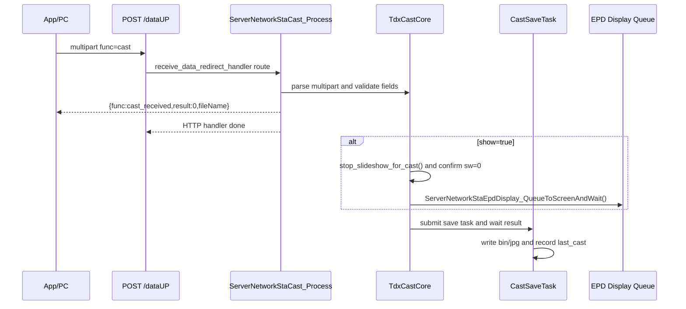
```mermaid
sequenceDiagram
    participant APP as App/PC
    participant DATAUP as POST /dataUP
    participant CAST as ServerNetworkStaCast_Process
    participant CORE as TdxCastCore
    participant SAVE as CastSaveTask
    participant EPD as EPD Display Queue
    APP->>DATAUP: multipart func=cast
    DATAUP->>CAST: receive_data_redirect_handler route
    CAST->>CORE: parse multipart and validate fields
    CAST-->>APP: {func:cast_received,result:0,fileName}
    CAST-->>DATAUP: HTTP handler done
    alt show=true
        CORE->>CORE: stop_slideshow_for_cast() and confirm sw=0
        CORE->>EPD: ServerNetworkStaEpdDisplay_QueueToScreenAndWait()
    end
    CORE->>SAVE: submit save task and wait result
    SAVE->>SAVE: write bin/jpg and record last_cast
```

相关文件：

```text
main/server_network_sta/cast/server_network_sta_cast.c
main/server_network_sta/cast/server_network_sta_cast.h
main/cast_core/cast_core.c
main/cast_core/cast_core.h
main/epd_display/epd_display_app.cpp
```

树状时序：

```text
HTTP multipart /dataUP
└─ receive_data_redirect_handler()
   └─ ServerNetworkStaCast_Process()
      ├─ TdxCastCore_ParseAndValidate()
      │  ├─ UsbConsoleCommon_ExtractBoundary()
      │  ├─ UsbConsoleCommon_MultipartParts()
      │  ├─ UsbConsoleCommon_FileNameIsSafe()
      │  └─ validate bin_size/image_size/save/show
      ├─ send cast_received chunk
      ├─ finish HTTP response
      └─ dataup_async_worker
         └─ TdxCastCore_ProcessValidatedCastDir()
            ├─ show=true
            │  ├─ stop_slideshow_for_cast() 并确认 sw=0
            │  └─ ServerNetworkStaEpdDisplay_QueueToScreenAndWait()
            └─ save=true
               └─ CastSaveTask
                  ├─ check_save_space()
                  ├─ save /data/cast_img/<fileName>.bin
                  ├─ save /data/cast_img/<fileName>.jpg
                  └─ record /data/cast_img/last_cast.txt
```

关键辅助函数：

```text
server_network_sta_cast.c
├─ send_cast_received()
├─ send_cast_result()
├─ cast_async_process()
└─ ServerNetworkStaCast_Process()

cast_core.c
├─ TdxCastCore_ParseAndValidate()
├─ TdxCastCore_ProcessValidatedCastDir()
├─ CastSaveTask()
├─ stop_slideshow_for_cast()
└─ record_last_cast()
```

说明：network cast 和 USB cast 都复用 `cast_core`，并通过 `TdxCastCore_ProcessValidatedCastDir()` 指定保存到 `/data/cast_img`。EPD 显示使用已有的 `ServerNetworkStaEpdDisplay` task，保存使用统一的 `CastSaveTask`。network cast 在 `show=true` 时解析和字段校验通过后只返回 `cast_received`，随后结束 HTTP handler；EPD 显示、bin/jpg 保存和 last_cast 记录由固定的 `dataup_async_worker` 调用 `cast_async_process()` 后台执行，不再返回 `cast_result` 第二个 JSON。`show=true && save=true` 时后台先调用 `stop_slideshow_for_cast()` 停止轮播、写 `show_control.txt sw=0` 并读回确认，同时同步 `epd_mode=0(NORMAL)`，再通过 `ServerNetworkStaEpdDisplay_QueueToScreenAndWait()` 等待 EPD 显示任务完成，最后提交保存任务。`show=false` 的 network cast 仍可走同步处理并返回最终结果。

V2 协议资料拆分：

```http
POST /dataUP HTTP/1.1
Content-Type: multipart/form-data

func=cast
fileName=26422
bin_size=123456
image_size=23456
save=true
show=true
bin=@26422.bin
image=@26422.jpg
```

字段说明：

```text
func       固定为 cast
fileName   图片主文件名，不带扩展名
bin_size   bin 主图数据大小
image_size jpg 缩略图大小
save       当前必须为 true；save=false 会返回 save_required_for_last_cast
show       是否立即显示
bin        主图 bin 文件
image      缩略图 jpg 文件
```

成功返回：

```text
{"func":"cast_received","result":0,"fileName":"26422"}
```

V2 说明：`cast` 成功后应记录最后一次投图，设备重启或 OTA 后优先显示该图片。

当前源码注意点：

```text
network cast 当前要求 save=true。
如果 save=false，设备返回 cast_result 失败，error=save_required_for_last_cast。
原因是 cast 成功后需要保存 bin/jpg，并记录 /data/cast_img/last_cast.txt，供重启或 OTA 后恢复显示。

show/save 顺序：
1. show=true 时，先把当前请求中的 bin 投递到 EPD 显示任务并等待完成。
2. save=true 时，再保存 bin/jpg 到 SD。
3. 保存成功后写入 /data/cast_img/last_cast.txt。
```


Powershell 测试用例：

```powershell
# cast：上传 bin + jpg，并立即显示。
$esp = "http://192.168.1.104"
$bin = "H:\AI2\test\26422.bin"
$jpg = "H:\AI2\test\26422.jpg"
$binSize = (Get-Item $bin).Length
$jpgSize = (Get-Item $jpg).Length

curl.exe -X POST "$esp/dataUP" `
  -F "func=cast" `
  -F "fileName=26422" `
  -F "bin_size=$binSize" `
  -F "image_size=$jpgSize" `
  -F "save=true" `
  -F "show=true" `
  -F "bin=@$bin;type=application/octet-stream" `
  -F "image=@$jpg;type=image/jpeg"
```

预期：`show=true` 时设备返回 `cast_received` 后立即结束 HTTP 响应，EPD 显示和保存由后台继续执行；`save=false` 会返回失败，不作为“只显示不保存”的 cast 用法。

存 / 取信息（含条件限制）：

```text
存：
- show=true 时 dataup_async_worker 调用 cast_async_process()，后台先等待 EPD 显示任务完成，再提交 CastSaveTask。
- show=true 停止轮播并写入 show_control.txt sw=0 后，同步写 PhotoPainter:epd_mode=0。
- CastSaveTask 写入：/data/cast_img/<fileName>.bin。
- CastSaveTask 写入：/data/cast_img/<fileName>.jpg。
- CastSaveTask 使用 <fileName>.<ext>.tmp 临时文件，写完校验大小后 rename 成正式文件。
- CastSaveTask 写入 last cast 记录文件，路径在 /data/cast_img/ 下。
- 保存和 last_cast 全部成功后，扫描 /data/cast_img，删除非本次 <fileName> 的旧 .bin/.jpg；last_cast.txt 不删除。

取：
- check_save_space() 通过 example_storage_get_free_bytes() 读取剩余空间。
- 显示时下发已收到的 bin 数据到 EPD 显示任务；后台保存和显示串行执行，网络 HTTP 不再等待最终结果 JSON。
- 重启恢复时可读取 last cast 记录。
```

[⬆ 返回目录](#toc) | [↩ 返回当前目录](#sec-07)

---

### 7.2 cast2pic：投屏转图片缓存 / 显示 <span id="sec-07-2"></span>

Result 定义建议：

| 返回 | result | 说明 |
|---|---|---|
| `cast2pic_result` | `0` | cast2pic 成功 |
| `cast2pic_result` | `1012` | 存储未就绪 |
| `cast2pic_result` | `1013` | 存储空间不足 |
| `cast2pic_result` | `1601` | multipart boundary 缺失 |
| `cast2pic_result` | `1602` | multipart `func` 缺失 |
| `cast2pic_result` | `1603` | 上传内容格式非法 |
| `cast2pic_result` | `1604` | `bin` 缺失 |
| `cast2pic_result` | `1605` | `image` 缺失 |
| `cast2pic_result` | `1606` | 声明大小和实际大小不一致 |
| `cast2pic_result` | `1607` | 保存 bin 失败 |
| `cast2pic_result` | `1608` | 保存 image 失败 |
| `cast2pic_result` | `1609` | EPD 显示队列提交失败 |
| `cast2pic_result` | `1008` | EPD 同步显示等待或驱动 BUSY 超时 |
| `cast2pic_result` | `1011` | EPD 显示 buffer / completion 内存不足 |
| `cast2pic_result` | `1016` | 保存队列创建或提交失败 |
| `cast2pic_result` | `1804` | EPD 驱动执行失败 |
| `cast2pic_result` | `1612` | 文件名非法 |
| `cast2pic_result` | `1616` | `screen` 不是 `a` / `b` |
| `cast2pic_result` | `1617` | `screen` 当前实现不支持 |

失败返回会附带 `error` 字段，内容为源码中的具体错误名，例如 `missing_bin_file`、`storage_not_enough`、`display_request_failed`。

功能说明：网络 `cast2pic` 用于单次刷新指定屏幕，当前源码只接受 `screen=a` 或 `screen=b`，并且 `CAST2PIC_MAX_IMAGES=1`。`screen=ab` 只属于 USB `cast2pic` 侧能力，不写入网络 HTTP 流程。

Mermaid 时序图：

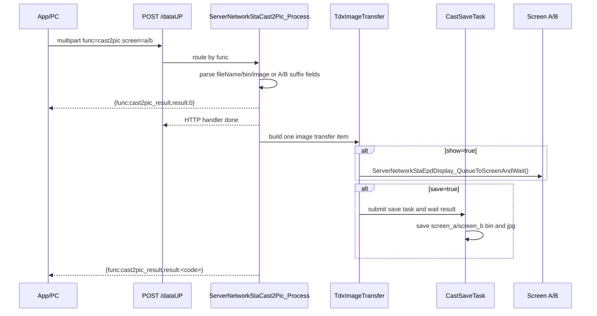
```mermaid
sequenceDiagram
    participant APP as App/PC
    participant DATAUP as POST /dataUP
    participant C2P as ServerNetworkStaCast2Pic_Process
    participant CORE as TdxImageTransfer
    participant SAVE as CastSaveTask
    participant EPD as Screen A/B
    APP->>DATAUP: multipart func=cast2pic screen=a/b
    DATAUP->>C2P: route by func
    C2P->>C2P: parse fileName/bin/image or A/B suffix fields
    C2P-->>APP: {func:cast2pic_result,result:0}
    C2P-->>DATAUP: HTTP handler done
    C2P->>CORE: build one image transfer item
    alt show=true
        CORE->>EPD: ServerNetworkStaEpdDisplay_QueueToScreenAndWait()
    end
    alt save=true
        CORE->>SAVE: submit save task and wait result
        SAVE->>SAVE: save screen_a/screen_b bin and jpg
    end
    C2P-->>APP: {func:cast2pic_result,result:<code>}
```

相关文件：

```text
main/server_network_sta/cast2pic/server_network_sta_cast2pic.c
main/server_network_sta/cast2pic/server_network_sta_cast2pic.h
main/cast_core/cast_core.c
main/cast_core/cast_core.h
```

树状时序：

```text
HTTP multipart /dataUP
└─ receive_data_redirect_handler()
   └─ ServerNetworkStaCast2Pic_Process()
      ├─ extract_boundary()
      ├─ parse_cast2pic_multipart()
      ├─ assign_text_part()
      ├─ assign_image_part()
      ├─ validate_cast2pic_meta()
      ├─ screen_to_epd_number()
      ├─ send_cast2pic_result()
      └─ dataup_async_worker
         ├─ build tdx_image_transfer_item_t
         └─ TdxImageTransfer_ProcessItems()
            ├─ show=true
            │  └─ ServerNetworkStaEpdDisplay_QueueToScreenAndWait()
            └─ save=true
               └─ CastSaveTask
                  └─ save /data/cast_img/screen_a/screen_b .bin and .jpg
```

关键辅助函数：

```text
server_network_sta_cast2pic.c
├─ extract_boundary()
├─ parse_cast2pic_multipart()
├─ assign_text_part()
├─ assign_image_part()
├─ validate_cast2pic_meta()
├─ screen_to_epd_number()
├─ process_cast2pic_items()
├─ cast2pic_async_process()
├─ send_cast2pic_core_result()
└─ ServerNetworkStaCast2Pic_Process()

cast_core.c
├─ TdxImageTransfer_ProcessItems()
└─ CastSaveTask()
```

说明：network cast2pic 和 USB cast2pic 都复用 `TdxImageTransfer_ProcessItems()` 和 `CastSaveTask`，并给 image transfer item 指定保存到 `/data/cast_img`。network cast2pic 在 `show=true` 时解析和字段校验通过后先返回 `cast2pic_result=0` 并结束 HTTP handler；EPD 显示和保存由固定的 `dataup_async_worker` 调用 `cast2pic_async_process()` 后台执行，不再返回第二个最终结果。`show` 和 `save` 是独立动作：后台存在 `show=true` 时先停止轮播、写 `show_control.txt sw=0` 并读回确认，同时同步 `epd_mode=0(NORMAL)`，再等待 EPD 显示任务完成；`save=true` 时再提交保存任务；`show=false` 不显示，`save=false` 不保存。`show=false` 的 network cast2pic 仍同步返回最终结果。

当前源码协议资料拆分（以 `server_network_sta_cast2pic.c` 为准）：

```http
POST /dataUP HTTP/1.1
Content-Type: multipart/form-data

func=cast2pic
screen=a
save=true
show=true
fileName=26422
bin_size=123456
image_size=23456
bin=@26422.bin
image=@26422.jpg

兼容字段：
fileNameA / bin_sizeA / image_sizeA / binA / imageA
fileNameB / bin_sizeB / image_sizeB / binB / imageB
```

字段说明：

```text
func     固定为 cast2pic
screen   只接受 a 或 b；a 映射到 EPD2，b 映射到 EPD1；不接受 ab
save     是否保存
show     是否立即显示
当前网络版本只处理 1 组 fileName/bin/image；无后缀、A 后缀、B 后缀字段都可作为这一组输入，超过 1 组会被忽略或不进入有效流程
```

screen 映射注意：

```text
screen=a -> epd_number=2 -> 保存为 /data/cast_img/screen_b.bin 和 /data/cast_img/screen_b.jpg
screen=b -> epd_number=1 -> 保存为 /data/cast_img/screen_a.bin 和 /data/cast_img/screen_a.jpg

这里不是直观的 a->screen_a、b->screen_b。
源码为了硬件兼容做了反向保存映射，显示投递也按 epd_number 执行。
```

成功返回：

```json
{
  "func": "cast2pic_result",
  "result": 0
}
```


Powershell 测试用例：

```powershell
# 网络 cast2pic：当前源码只支持 screen=a 或 screen=b，不写 screen=ab。
$esp = "http://192.168.1.104"
$bin = "H:\AI2\test\26423.bin"
$jpg = "H:\AI2\test\26423.jpg"
$binSize = (Get-Item $bin).Length
$jpgSize = (Get-Item $jpg).Length
$screen = "a"

curl.exe -X POST "$esp/dataUP" `
  -F "func=cast2pic" `
  -F "screen=$screen" `
  -F "fileNameA=26423" `
  -F "bin_sizeA=$binSize" `
  -F "image_sizeA=$jpgSize" `
  -F "save=true" `
  -F "show=true" `
  -F "binA=@$bin;type=application/octet-stream" `
  -F "imageA=@$jpg;type=image/jpeg"
```

预期：设备返回 `cast2pic_result`，`result=0` 表示成功；`screen` 只能测试 `a` 或 `b`。

存 / 取信息（含条件限制）：

```text
存：
- 保存当前 1 组图片对应的 .bin 和 .jpg 到 /data/cast_img。
- screen=a 保存为 screen_b.bin / screen_b.jpg；screen=b 保存为 screen_a.bin / screen_a.jpg。
- 使用临时文件写入再 rename，避免半文件覆盖正式文件。
- 本次需要保存的 screen 文件全部成功后，扫描 /data/cast_img，删除非本次 screen 名的旧 .bin/.jpg，并删除旧 last_cast.txt，避免它指向已清理文件。

取：
- 读取 multipart 中的 fileName/bin_size/image_size/bin/image，兼容 A/B 后缀字段。
- 根据 screen=a/b 转成 EPD screen number 后等待显示任务完成；screen=a -> EPD2，screen=b -> EPD1。
- 写入前读取剩余空间做容量检查。
```

[⬆ 返回目录](#toc) | [↩ 返回当前目录](#sec-07)

---

### 7.3 delete：图片 / 缓存文件删除逻辑 <span id="sec-07-3"></span>

Result 定义建议：

| 返回 | result | 说明 |
|---|---|---|
| `delete_result` | `0` | 删除成功 |
| `delete_result` | `1001` | JSON 格式错误 |
| `delete_result` | `1003` | 缺少必要字段 |
| `delete_result` | `1501` | `fileNames` 缺失或为空 |
| `delete_result` | `1502` | 文件名非法 |
| `delete_result` | `1503` | 删除指定 bin/jpg 文件失败，或指定文件均不存在/未删除 |
| `delete_result` | `1514` | `fileNames` 超过单次删除上限 50 个；不执行本次删除 |

功能说明：只删除 JSON `fileNames` 指定的图片和缩略图文件。网络入口先完整解析并校验全部名称；超过 50 个返回 `1514`，单个名称非法返回 `1502`，两种情况都不会删除任何文件。delete 不清理、不修改 `last_cast.txt`、`slideshow_config.txt`、`show_control.txt`，也不清理 NVS 中的轮播进度。

Mermaid 时序图：

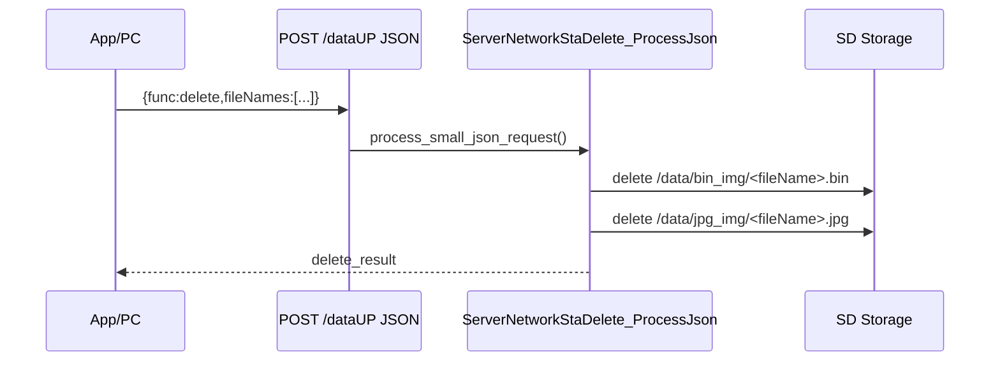
```mermaid
sequenceDiagram
    participant APP as App/PC
    participant DATAUP as POST /dataUP JSON
    participant DEL as ServerNetworkStaDelete_ProcessJson
    participant SD as SD Storage
    APP->>DATAUP: {func:delete,fileNames:[...]}
    DATAUP->>DEL: process_small_json_request()
    DEL->>SD: delete /data/bin_img/<fileName>.bin
    DEL->>SD: delete /data/jpg_img/<fileName>.jpg
    DEL-->>APP: delete_result
```

相关文件：

```text
main/server_network_sta/delete/server_network_sta_delete.c
main/server_network_sta/delete/server_network_sta_delete.h
```

树状时序：

```text
HTTP small JSON delete
└─ receive_data_redirect_handler()
   └─ process_small_json_request()
      └─ ServerNetworkStaDelete_ProcessJson()
         ├─ parse_file_names()
         ├─ delete_one_path(/data/bin_img/*.bin)
         ├─ delete_one_path(/data/jpg_img/*.jpg)
         └─ send_delete_result()
```

关键辅助函数：

```text
server_network_sta_delete.c
├─ parse_file_names()
├─ delete_one_path()
└─ ServerNetworkStaDelete_ProcessJson()
```

V2 协议资料拆分：

```json
{
  "func": "delete",
  "fileNames": ["26422", "26423"]
}
```

字段说明：

```text
func       固定为 delete
fileNames  要删除的图片文件名数组，不带扩展名
```


Powershell 测试用例：

```powershell
# delete：删除一张或多张已保存图片。
$esp = "http://192.168.1.104"
$body = @{
  func = "delete"
  fileNames = @("26422", "26423")
} | ConvertTo-Json -Depth 4

Invoke-RestMethod -Uri "$esp/dataUP" `
  -Method Post `
  -ContentType "application/json" `
  -Body $body
```

预期：设备返回 `delete_result`；删除成功后只删除对应 `.bin`、`.jpg`，不会修改 last cast / slideshow 相关配置。

存 / 取信息（含条件限制）：

```text
存：
- 删除动作会修改持久化文件系统：unlink /data/bin_img/<file>.bin 与 /data/jpg_img/<file>.jpg。
- 不修改 /data/bin_img/last_cast.txt。
- 不修改 /data/bin_img/slideshow_config.txt。
- 不修改 /data/bin_img/show_control.txt。
- 不修改 NVS 中的 slideshow progress / last slideshow 状态。

取：
- 读取 JSON fileNames 数组。
- 不读取 last_cast / slideshow 配置。
```

[⬆ 返回目录](#toc) | [↩ 返回当前目录](#sec-07)

---

### 7.4 net_data：通用网络数据封装 <span id="sec-07-4"></span>

Result 定义建议：

| 返回 | result | 说明 |
|---|---|---|
| `dataup_result` | `0` | `/dataUP` 普通上传成功 |
| `dataup_result` | `1006` | body 超过限制 |
| `dataup_result` | `1007` | 上传忙 |
| `dataup_result` | `1001` | JSON 格式错误 |
| `unknown_result` | `1002` | JSON `func` 不支持 |
| 下游 `*_result` | 参考对应功能 | `cast` / `upload` / `cast2pic` / `delete` 等模块返回自己的 result |

功能说明：统一管理网络 HTTP 数据入口、body 分配、multipart/JSON/OTA 分流，以及 `/dataUP`、`/ota`、`/ota_upload`、`/ping` 的注册。

Mermaid 时序图：

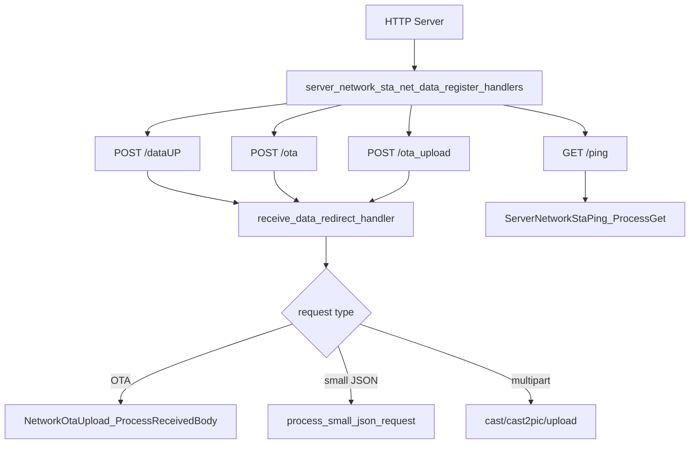
```mermaid
flowchart TD
    A[HTTP Server] --> B[server_network_sta_net_data_register_handlers]
    B --> C[POST /dataUP]
    B --> D[POST /ota]
    B --> E[POST /ota_upload]
    B --> F[GET /ping]
    C --> G[receive_data_redirect_handler]
    D --> G
    E --> G
    G --> H{request type}
    H -->|OTA| I[NetworkOtaUpload_ProcessReceivedBody]
    H -->|small JSON| J[process_small_json_request]
    H -->|multipart| K[cast/cast2pic/upload]
    F --> L[ServerNetworkStaPing_ProcessGet]
```

相关文件：

```text
main/server_network_sta/net_data/server_network_sta_data.c
main/server_network_sta/net_data/server_network_sta_data.h
```

树状时序：

```text
file_server.c
└─ example_start_file_server()
   └─ server_network_sta_net_data_register_handlers()
      ├─ register POST /dataUP
      ├─ register POST /ota
      ├─ register POST /ota_upload
      └─ GET /* 中优先拦截 /ping

POST request
└─ receive_data_redirect_handler()
   ├─ ServerNetworkStaWifiWorkTime_OnNetworkData()
   ├─ NetworkOtaUpload_IsOtaRequest()
   ├─ alloc_request_body_buffer()
   ├─ read_request_body_to_buffer()
   ├─ NetworkOtaUpload_ProcessReceivedBody()
   ├─ process_small_json_request()
   ├─ ServerNetworkStaCast2Pic_Process()
   ├─ ServerNetworkStaCast_Process()
   └─ ServerNetworkStaUpload_Process()
```

关键辅助函数：

```text
server_network_sta_data.c
├─ log_heap_watermark()
├─ alloc_request_body_buffer()
├─ read_request_body_to_buffer()
├─ process_small_json_request()
├─ receive_data_redirect_handler()
└─ server_network_sta_net_data_register_handlers()
```

V2 协议资料拆分：

```text
V2 HTTP 入口：
├─ POST /dataUP + multipart/form-data
│  ├─ cast
│  ├─ upload
│  ├─ cast2pic
│  └─ update（前端预留）
├─ POST /dataUP + JSON
│  ├─ get_saved_images
│  ├─ get_snapshot
│  ├─ start_slideshow
│  ├─ set_slideshow
│  ├─ delete
│  └─ set_wifi_work_time
└─ GET /ping
```


Powershell 测试用例：

```powershell
# net_data：验证 /dataUP 小 JSON 入口能正确分发到 snapshot。
$esp = "http://192.168.1.104"
$body = @{ func = "get_snapshot" } | ConvertTo-Json

Invoke-RestMethod -Uri "$esp/dataUP" `
  -Method Post `
  -ContentType "application/json" `
  -Body $body
```

```powershell
# net_data：验证 /dataUP multipart 入口能正确进入 cast/upload/cast2pic 分发。
$esp = "http://192.168.1.104"
$bin = "H:\AI2\test\26422.bin"
$jpg = "H:\AI2\test\26422.jpg"
$binSize = (Get-Item $bin).Length
$jpgSize = (Get-Item $jpg).Length

curl.exe -X POST "$esp/dataUP" `
  -F "func=upload" `
  -F "fileName=net_data_test" `
  -F "bin_size=$binSize" `
  -F "image_size=$jpgSize" `
  -F "save=true" `
  -F "show=false" `
  -F "bin=@$bin;type=application/octet-stream" `
  -F "image=@$jpg;type=image/jpeg"
```

预期：第一个命令走 small JSON 分发；第二个命令走 multipart 分发。

存 / 取信息（含条件限制）：

```text
存：
- net_data 不直接写持久化数据。
- 根据请求类型转交 cast/upload/ota/slideshow/wifi_work_time 等模块执行实际存储。

取：
- 读取 request header、body、Content-Type、URI、multipart boundary。
- 读取 body_len 并在 RAM 中做临时缓存。
```

[⬆ 返回目录](#toc) | [↩ 返回当前目录](#sec-07)

---

### 7.5 ota：设备在线升级模块 <span id="sec-07-5"></span>

Result 定义建议：

| 返回 | result | 说明 |
|---|---|---|
| `ota_event` | `0` | OTA 阶段事件正常 |
| `ota_result` | `0` | OTA 成功 |
| `ota_result` | `1701` | boundary 缺失 |
| `ota_result` | `1702` | meta 缺失 |
| `ota_result` | `1703` | meta 非法 |
| `ota_result` | `1704` | firmware 缺失 |
| `ota_result` | `1705` | firmware size 非法 |
| `ota_result` | `1706` | `esp_ota_begin()` 失败 |
| `ota_result` | `1707` | `esp_ota_write()` 失败 |
| `ota_result` | `1708` | `esp_ota_end()` 失败 |
| `ota_result` | `1709` | OTA 校验失败 |
| `ota_result` | `1710` | 设置 boot partition 失败 |
| `ota_result` | `1711` | meta version 与固件 version 不一致 |
| `ota_result` | `1712` | OTA 分区空间不足 |
| `ota_result` | `1713` | OTA 正在执行 |

功能说明：通过网络上传固件，校验固件头、版本、分区大小，写入 OTA 分区并切换启动分区。

Mermaid 时序图：

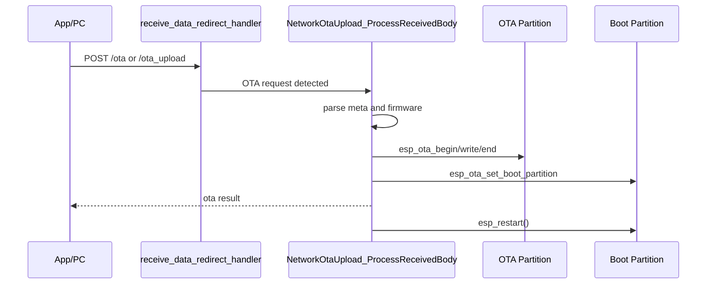
```mermaid
sequenceDiagram
    participant APP as App/PC
    participant DATA as receive_data_redirect_handler
    participant OTA as NetworkOtaUpload_ProcessReceivedBody
    participant PART as OTA Partition
    participant BOOT as Boot Partition
    APP->>DATA: POST /ota or /ota_upload
    DATA->>OTA: OTA request detected
    OTA->>OTA: parse meta and firmware
    OTA->>PART: esp_ota_begin/write/end
    OTA->>BOOT: esp_ota_set_boot_partition
    OTA-->>APP: ota result
    OTA->>BOOT: esp_restart()
```

相关文件：

```text
main/server_network_sta/ota/network_ota_upload.c
main/server_network_sta/ota/network_ota_upload.h
```

树状时序：

```text
receive_data_redirect_handler()
├─ NetworkOtaUpload_IsOtaRequest()
├─ NetworkOtaUpload_GetMaxBodySize()
└─ NetworkOtaUpload_ProcessReceivedBody()
   ├─ ota_stream_begin()
   ├─ extract_boundary()
   ├─ extract_multipart_field("meta")
   ├─ parse_meta_json()
   ├─ extract_multipart_field("firmware" or "bin")
   ├─ PowerMode_SetOtaWriteInProgress(true)
   ├─ write_firmware_to_ota_partition()
   │  ├─ validate image header magic
   │  ├─ get_firmware_app_desc()
   │  ├─ esp_ota_get_next_update_partition()
   │  ├─ esp_ota_begin()
   │  ├─ esp_ota_write()
   │  ├─ esp_ota_end()
   │  └─ esp_ota_set_boot_partition()
   └─ esp_restart()
```

关键辅助函数：

```text
network_ota_upload.c
├─ NetworkOtaUpload_IsOtaRequest()
├─ NetworkOtaUpload_GetMaxBodySize()
├─ NetworkOtaUpload_ProcessReceivedBody()
├─ NetworkOtaUpload_MarkCurrentAppValidIfPending()
└─ write_firmware_to_ota_partition()
```

V2 协议资料拆分：

```text
V2_相框传图协议.html 中没有定义网络 OTA 请求字段。
当前 OTA 以仓库源码 /ota、/ota_upload 处理逻辑为准，和 V2 图片/控制协议分开。
```

当前实现与后续优化：

```text
当前 OTA 请求仍先由 receive_data_redirect_handler() 完整接收 HTTP body，再交给 NetworkOtaUpload_ProcessReceivedBody() 解析 firmware part。
OTA 写分区时会分块 esp_ota_write()，但 HTTP 接收阶段不是 streaming。
开发阶段保持当前实现便于调试；如果后续固件体积增大或 PSRAM 压力明显，建议单独为 /ota 做 streaming handler，一边 httpd_req_recv() 一边 esp_ota_write()。
```

Powershell 测试用例：

```powershell
# ota：上传固件到 /ota；成功后设备固定自动复位。
$esp = "http://192.168.1.104"
$fw = "H:\AI2\ESP32-S3-PhotoPainter-main\01_Example\xiaozhi-esp32\build\xiaozhi.bin"
$size = (Get-Item $fw).Length
$version = "000.001"
$meta = '{"func":"ota","version":"' + $version + '","firmware_size":' + $size + ',"reboot":true}'

curl.exe -X POST "$esp/ota" `
  -F "meta=$meta" `
  -F "firmware=@$fw;type=application/octet-stream"
```

```powershell
# 兼容旧工具入口：/ota_upload。
curl.exe -X POST "$esp/ota_upload" `
  -F "meta=$meta" `
  -F "firmware=@$fw;type=application/octet-stream"
```

版本规则：固件版本号使用 `000.000`..`255.255` 两段十进制字节格式，每段范围为 0..255，保留 3 位数字；例如 `000.001` 对应十六进制 `00.01`，`255.255` 对应 `FF.FF`。OTA meta 中 `version` 字段如果存在，必须与固件 `app_desc.version` 完全一致，否则返回 `1711/version_mismatch` 并拒绝写入。

预期：固件大小不能超过 OTA 分区；版本校验和固件校验通过后写 OTA 分区、设置 boot partition、发送成功结果，并在约 1 秒后自动复位。`reboot` 缺失时默认按 `true`；即使请求传入 `reboot=false`，设备也会打印警告并忽略该值，成功 OTA 必须复位。

存 / 取信息（含条件限制）：

```text
存：
- esp_ota_write() 写入 OTA update partition。
- esp_ota_set_boot_partition() 保存下次启动分区选择。
- OTA HTTP body 接收与固件写入分别设置 WiFi 工作时间模块的 receive/write power hold；任一 hold 有效时都禁止超时 `POWER_OFF`。

取：
- 读取 multipart meta JSON、firmware/bin 字段。
- 读取当前 running partition、目标 update partition、固件 app_desc、版本信息。
```

[⬆ 返回目录](#toc) | [↩ 返回当前目录](#sec-07)

---

### 7.6 ping：网络连通检测 <span id="sec-07-6"></span>

Result 定义建议：

| 返回 | result | 说明 |
|---|---|---|
| `ping_result` | `0` | 连通性检查成功 |
| `ping_result` | `1405` | `Ble_MAC` 为空；是否作为失败需按前端匹配逻辑决定 |

功能说明：用于 App/PC 判断设备 HTTP 服务是否可用，通过 `Ble_MAC` 防止缓存 IP 指向错误设备，并通过 `EPD` 字段告知当前 EPD display task 是忙碌还是空闲。网络 ping 匹配 `/ping` 路径，并允许携带 query/hash 后缀，例如 `/ping?t=123`。每次有效网络 `/ping` 都调用 `ServerNetworkStaWifiWorkTime_OnHttpNetworkActivity()`，从当前时刻重新产生 20 秒 HTTP 关机保护，但不重置完整 `wifi_work_time`、不写 NVS。网络 ping 响应会设置 `Connection: close`，避免 App/PC 的 keep-alive 长时间占用 HTTP socket。

Mermaid 时序图：

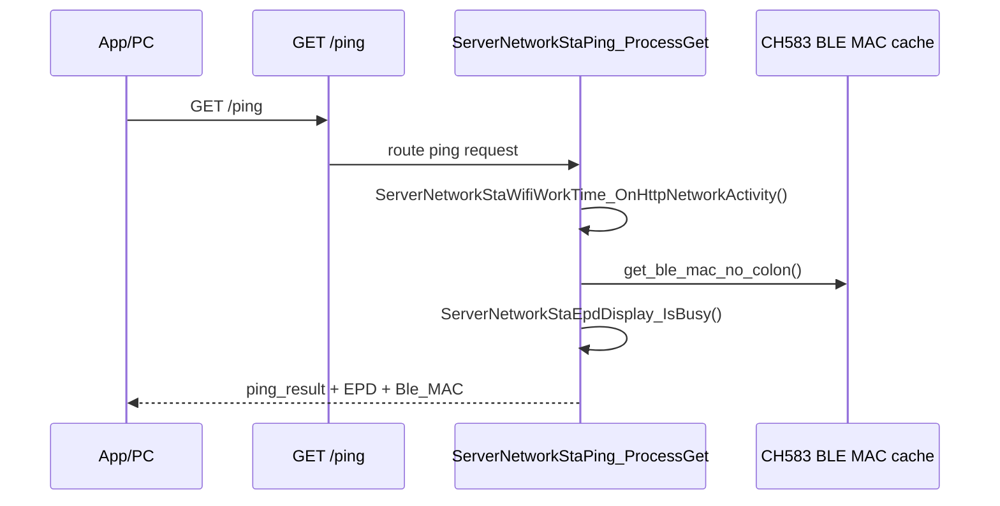
```mermaid
sequenceDiagram
    participant APP as App/PC
    participant HTTP as GET /ping
    participant PING as ServerNetworkStaPing_ProcessGet
    participant MAC as CH583 BLE MAC cache
    APP->>HTTP: GET /ping
    HTTP->>PING: route ping request
    PING->>PING: ServerNetworkStaWifiWorkTime_OnHttpNetworkActivity()
    PING->>MAC: get_ble_mac_no_colon()
    PING->>PING: ServerNetworkStaEpdDisplay_IsBusy()
    PING-->>APP: ping_result + EPD + Ble_MAC
```

相关文件：

```text
main/server_network_sta/ping/server_network_sta_ping.c
main/server_network_sta/ping/server_network_sta_ping.h
main/epd_display/epd_display_app.cpp
main/epd_display/epd_display_app.h
```

树状时序：

```text
HTTP GET /ping
└─ ServerNetworkStaPing_ProcessGet()
   ├─ ServerNetworkStaWifiWorkTime_OnHttpNetworkActivity()
   ├─ get_ble_mac_no_colon()
   ├─ ServerNetworkStaEpdDisplay_IsBusy()
   ├─ httpd_resp_set_hdr(Connection: close)
   └─ httpd_resp_sendstr()
```

关键辅助函数：

```text
server_network_sta_ping.c
└─ ServerNetworkStaPing_ProcessGet()
epd_display_app.cpp
└─ ServerNetworkStaEpdDisplay_IsBusy()
```

V2 协议资料拆分：

```http
GET /ping HTTP/1.1
```

也允许：

```http
GET /ping?t=123 HTTP/1.1
GET /ping#check HTTP/1.1
```

返回：

```json
{
  "func": "ping_result",
  "result": 0,
  "message": "ok",
  "EPD": "BUSY",
  "Ble_MAC": "AABBCCDDEEFF"
}
```

`EPD` 字段取值：

```text
BUSY  EPD display task 正在执行、已有 pending job 或队列仍有任务
IDLE  EPD display task 空闲
```

V2 说明：前端写操作前会优先访问缓存端点的 `/ping`；如果响应包含 `Ble_MAC` 或 `ble_mac`，必须与目标设备 MAC 一致。


Powershell 测试用例：

```powershell
# ping：GET /ping 检查 HTTP 服务和设备身份。
$esp = "http://192.168.1.104"
Invoke-RestMethod -Uri "$esp/ping" -Method Get
Invoke-RestMethod -Uri "$esp/ping?t=123" -Method Get
```

预期：BLE MAC 已获取时返回 `result=0`；尚未获取时返回 `result=1405` 和空 `Ble_MAC`。两种情况下都返回 `EPD` 字段。

存 / 取信息（含条件限制）：

```text
存：
- ping 不写入持久化数据。
- 只会调用 ServerNetworkStaWifiWorkTime_OnNetworkData() 重置 RAM 中的 working_time 计时。

取：
- 读取 CH583 BLE MAC 字符串，用于返回 Ble_MAC。
- BLE MAC 来源可能是 CH583 模块上报后保存在 PhotoPainter NVS 的值。
- 读取 EPD display task 状态，用于返回 `EPD=BUSY/IDLE`。
```

[⬆ 返回目录](#toc) | [↩ 返回当前目录](#sec-07)

---

### 7.7 get_saved_images：取出本地存储图片 <span id="sec-07-7"></span>

Result 定义建议：

| 返回 | result | 说明 |
|---|---|---|
| `get_saved_images_result` | `0` | 图片列表读取成功 |
| `get_saved_images_result` | `1401` | 图片列表读取失败 |
| `thumb_result` | `1402` | 缩略图名称非法 |
| `thumb_result` | `1403` | 缩略图不存在 |

网络 `/thumb/<name>.jpg` 成功时直接返回 `HTTP 200 image/jpeg` 二进制；名称非法或文件不存在时返回 JSON `thumb_result`，HTTP 状态分别为 400、404。USB thumb 同样在失败时返回 `1402/1403`。

功能说明：扫描本地已保存缩略图，返回前端可展示的图片列表和缩略图地址。JSON `func` 解析允许冒号前后有空格或换行，支持 PowerShell `ConvertTo-Json` 输出格式。

Mermaid 时序图：

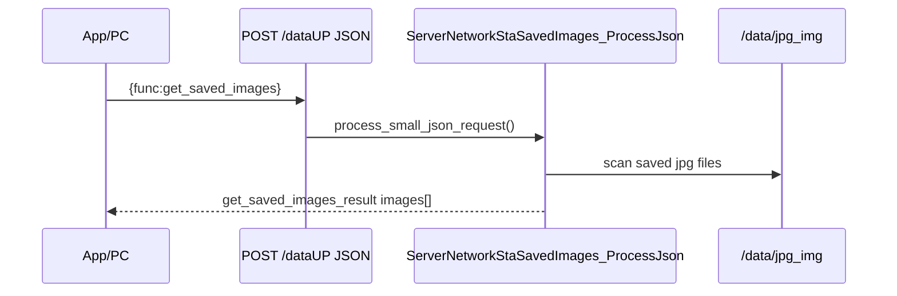
```mermaid
sequenceDiagram
    participant APP as App/PC
    participant DATAUP as POST /dataUP JSON
    participant IMG as ServerNetworkStaSavedImages_ProcessJson
    participant SD as /data/jpg_img
    APP->>DATAUP: {func:get_saved_images}
    DATAUP->>IMG: process_small_json_request()
    IMG->>SD: scan saved jpg files
    IMG-->>APP: get_saved_images_result images[]
```

相关文件：

```text
main/server_network_sta/saved_images/server_network_sta_saved_images.c
main/server_network_sta/saved_images/server_network_sta_saved_images.h
```

树状时序：

```text
HTTP small JSON get_saved_images
└─ receive_data_redirect_handler()
   └─ process_small_json_request()
      └─ ServerNetworkStaSavedImages_ProcessJson()
         ├─ scan /data/jpg_img
         ├─ saved_image_name_is_safe()
         └─ httpd_resp_sendstr(json)
```

关键辅助函数：

```text
server_network_sta_saved_images.c
├─ json_func_equals()
├─ saved_image_entry_name()
├─ has_jpg_extension()
├─ saved_image_name_is_safe()
├─ send_saved_images_empty()
├─ ServerNetworkStaSavedImages_SendThumbnail()
└─ ServerNetworkStaSavedImages_ProcessJson()
```

V2 协议资料拆分：

```json
{
  "func": "get_saved_images"
}
```

返回：

```json
{
  "func": "get_saved_images_result",
  "result": 0,
  "images": [
    {
      "fileName": "26422",
      "thumbnailUrl": "/thumb/26422.jpg"
    }
  ]
}
```

V2 说明：前端会用设备 `baseUrl` 拼接相对缩略图地址。


Powershell 测试用例：

```powershell
# get_saved_images：读取 SD 卡中已保存缩略图列表。
$esp = "http://192.168.1.104"
$body = @{ func = "get_saved_images" } | ConvertTo-Json

Invoke-RestMethod -Uri "$esp/dataUP" `
  -Method Post `
  -ContentType "application/json" `
  -Body $body
```

```powershell
# 如果返回了 thumbnailUrl，可以继续读取缩略图。
$thumb = "/thumb/26422.jpg"
Invoke-WebRequest -Uri "$esp$thumb" -OutFile "H:\AI2\test\thumb_26422.jpg"
```

预期：返回 `get_saved_images_result`；`images` 中包含 `fileName` 和 `thumbnailUrl`。如果 `/data/jpg_img` 目录不存在，当前网络实现返回成功空列表：`{"func":"get_saved_images_result","result":0,"images":[]}`。

存 / 取信息（含条件限制）：

```text
存：
- get_saved_images 不写文件。

取：
- 扫描 /data/jpg_img 目录下的 .jpg / .JPG 文件。
- 生成 fileName 与 thumbnailUrl。
- /thumb/<name>.jpg 请求会 fopen 对应 jpg 并 fread 分块返回。
- 如果 /data/jpg_img 不存在，返回空 images[]，不作为错误。
```

[⬆ 返回目录](#toc) | [↩ 返回当前目录](#sec-07)

---

### 7.8 slideshow：图片轮播的文件列表，轮播间隔，是否随机 <span id="sec-07-8"></span>

Result 定义建议：

| 返回 | result | 说明 |
|---|---|---|
| `start_slideshow_result` | `0` | 轮播列表配置保存成功，并已按 `timestamp` 写入 RTC control、启动 RTC 轮播 |
| `start_slideshow_result` | `1012` | SD 卡 / 存储未就绪 |
| `start_slideshow_result` | `1501` | `fileNames` 缺失 |
| `start_slideshow_result` | `1502` | 文件名非法 |
| `start_slideshow_result` | `1504` | 轮播配置保存失败 |
| `start_slideshow_result` | `1505` | 轮播启动失败 |
| `start_slideshow_result` | `1506` | 轮播运行时启动失败 |
| `start_slideshow_result` | `1507` | `interval` 非法 |
| `start_slideshow_result` | `1508` | 轮播文件不存在 |
| `start_slideshow_result` | `1510` | `timestamp` 缺失、不是整数、不是秒级 Unix 时间戳，或时间范围不合理 |
| `start_slideshow_result` | `1512` | SNTP 未同步时，使用 APP / PC 发来的 `timestamp` 写入 RTC / 系统时间失败 |
| `start_slideshow_result` | `1513` | SNTP 已同步时，APP / PC 发来的 `timestamp` 与设备当前 SNTP 时间差值超过 5 秒；设备不执行本次指令 |
| `start_slideshow_result` | `1515` | `startIndex` 缺失；设备不执行本次指令 |
| `start_slideshow_result` | `1516` | `startIndex` 不是非负整数或 `startIndex >= fileNames` 数量；设备不执行本次指令 |

功能说明：`start_slideshow` 用于下发并保存轮播图片列表、轮播顺序、随机模式和默认 interval，并在同一条命令中使用 `timestamp` 写入标准 RTC control、强制 `sw=1`、启动 RTC 轮播。它等价于“原 start_slideshow 列表配置功能 + set_slideshow 的 sw=1/interval/random/timestamp 启动功能”。

Mermaid 时序图：

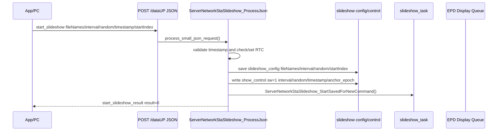
```mermaid
sequenceDiagram
    participant APP as App/PC
    participant DATAUP as POST /dataUP JSON
    participant SS as ServerNetworkStaSlideshow_ProcessJson
    participant FILE as slideshow config/control
    participant TASK as slideshow_task
    participant EPD as EPD Display Queue
    APP->>DATAUP: start_slideshow fileNames/interval/random/timestamp/startIndex
    DATAUP->>SS: process_small_json_request()
    SS->>SS: validate timestamp and check/set RTC
    SS->>FILE: save slideshow_config fileNames/interval/random/startIndex
    SS->>FILE: write show_control sw=1 interval/random/timestamp/anchor_epoch
    SS->>TASK: ServerNetworkStaSlideshow_StartSavedForNewCommand()
    SS-->>APP: start_slideshow_result result=0
```

相关文件：

```text
main/server_network_sta/slideshow/server_network_sta_slideshow.c
main/server_network_sta/slideshow/server_network_sta_slideshow.h
```

树状时序：

```text
HTTP small JSON start_slideshow
└─ receive_data_redirect_handler()
   └─ process_small_json_request()
      └─ ServerNetworkStaSlideshow_ProcessJson()
         ├─ parse_start_slideshow_request()
         ├─ parse timestamp and check/set RTC
         ├─ check_slideshow_files_exist()
         ├─ save_slideshow_config()
         ├─ save random config
         ├─ write show_control sw=1 interval/random/timestamp/anchor_epoch
         └─ ServerNetworkStaSlideshow_StartSavedForNewCommand()

main/main.c
└─ ServerNetworkStaSlideshow_StartSavedDelayed("/data")
   ├─ 延迟 TDX_SLIDESHOW_STARTUP_DELAY_MS 毫秒
   ├─ 重新读取 show_control.txt
   ├─ sw=0 时跳过自动恢复轮播
   └─ sw=1 时调用 ServerNetworkStaSlideshow_StartSaved("/data")
      ├─ read_slideshow_config_file()
      ├─ read_slideshow_control_on()
      ├─ 读取并校验 NVS slide_progress
      └─ xTaskCreate(slideshow_task)
```

关键辅助函数：

```text
server_network_sta_slideshow.c
├─ parse_start_slideshow_request()
├─ check_slideshow_files_exist()
├─ save_slideshow_config()
├─ ServerNetworkStaSlideshow_ShowFirst()
├─ ServerNetworkStaSlideshow_StartSaved()
├─ ServerNetworkStaSlideshow_StartSavedResetInterval()
├─ ServerNetworkStaSlideshow_StartSavedForNewCommand()
├─ ServerNetworkStaSlideshow_StartSavedDelayed()
├─ ServerNetworkStaSlideshow_GetRuntimeTiming()
├─ ServerNetworkStaSlideshow_Stop()
└─ slideshow_task()
```

V2 协议资料拆分：

```json
{
  "func": "start_slideshow",
  "fileNames": ["26422", "26423"],
  "interval": 60,
  "random": false,
  "timestamp": 1783372200,
  "startIndex": 0
}
```

字段说明：

```text
fileNames 轮播文件顺序；最多 50 个，文件必须已存在于 /data/bin_img
interval 默认轮播间隔，单位秒，固件校验 60..604800
random 字段保留，但设备始终强制为 false，并按 fileNames 顺序轮播
timestamp 必填；秒级 Unix 时间戳，用作 `fileNames[startIndex]` 起始图片的目标播放时间，同时写入 show_control.timestamp 和 anchor_epoch
startIndex 必填；从 0 开始，必须小于 fileNames 数量；表示 timestamp 对应的起始图片
```


Powershell 测试用例：

```powershell
# start_slideshow：下发并保存轮播列表。
$esp = "http://192.168.1.104"
$body = @{
  func = "start_slideshow"
  fileNames = @("26422", "26423")
  interval = 60
  random = $false
  timestamp = [DateTimeOffset]::UtcNow.ToUnixTimeSeconds()
  startIndex = 0
} | ConvertTo-Json -Depth 4

Invoke-RestMethod -Uri "$esp/dataUP" `
  -Method Post `
  -ContentType "application/json" `
  -Body $body
```

预期：设备保存轮播列表、interval、random 和 startIndex，从 `fileNames[startIndex]` 建立第 0 个绝对时间槽，重写 `show_control.txt` 为标准 RTC control，并按 `timestamp` 启动 RTC 轮播。缺少 startIndex 返回 1515，startIndex 非法返回 1516，均不执行本次指令。

当前实现：

```text
start_slideshow 是正式轮播列表配置接口；会重写 `show_control.txt` 为标准 RTC control，不再写缺少 timestamp/anchor_epoch 的旧 control。
网络 JSON 的 `func` 判断支持空格、CRLF 和 PowerShell `ConvertTo-Json` 输出格式。
```

存 / 取信息（含条件限制）：

```text
存：
- start_slideshow 严格要求合法 startIndex，保存 slideshow_config 的 fileNames / interval / random / startIndex，保存 random 配置，并写入 `show_control.txt`：`{"func":"set_slideshow","sw":1,"interval":...,"random":...,"timestamp":...,"anchor_epoch":...}`。旧字段 `index` 不兼容；缺少 startIndex 时拒绝启动，不默认补 0。
- set_slideshow 写入 sw / interval / timestamp / anchor_epoch，并同步写 PhotoPainter:epd_mode=1。
- `random` 永久禁用；协议仍兼容接收 `random:true/false`，但设备统一强制为 `random=false`，并在 `slideshow_config.txt`、`show_control.txt`、NVS `slide_random` 和 snapshot 中固定保存/返回 false。
- NVS `slide_progress` 继续保存版本、配置 hash、待显示文件和位置，供诊断及非 SNTP 兼容路径使用；SNTP 已同步时它不再是选图依据，启动时 NVS 读写失败可用 RAM 进度继续绝对时间轮播。
- SNTP 绝对时间槽公式：`slot=floor((now_epoch-anchor_epoch)/interval)`，`current_index=(startIndex+(slot%file_count))%file_count`，`current_file=fileNames[current_index]`，`next_epoch=anchor_epoch+(slot+1)*interval`。
- 当 `fileNames` 只有一张时，合法值只能是 `startIndex=0`；每个绝对时间槽都映射到同一张图片，因此设备仍会按 interval 到点重复刷新该图片。其他 startIndex 返回 1516。
- SNTP 已同步且 `now_epoch>=anchor_epoch` 时，当前绝对时间槽始终是选图依据。开机恢复若有效 NVS `pending_file` 正好是当前槽的下一张，表示墨水屏已保留当前槽图片，此时不重复刷新当前图片，而是等待下一绝对播放点；其他情况立即显示当前槽图片。`now_epoch<anchor_epoch` 时，以 `anchor_epoch - lead_seconds` 作为进入 EPD 刷新流程的时间点。NVS 只辅助判断当前槽图片是否已在屏幕上，不能改变绝对时间槽选图结果。
- SNTP 时间下允许 timestamp 与当前时间相差不超过 5 秒。若 timestamp 在未来，设备接受指令，但仍遵守 RTC 播放点：只有当前时间到达 `timestamp - lead_seconds` 才进入起始图片的 EPD 刷新流程；若该提前点已经到达则立即进入。比如 timestamp 领先 5 秒、lead=3 秒时等待约 2 秒；timestamp 领先 2 秒、lead=3 秒时立即进入。这样不会因强制提前显示而破坏 APP 与 ESP32 共用的绝对时间基准，也不会因少量传输或校时误差拒绝正常指令。
- slideshow_task() 在 SNTP 模式下每次显示前重新核对绝对时间槽；若断电、阻塞或 SNTP 向前/向后校时跨槽，直接切换到当前应显示的图片，不逐张补播。
- `ServerNetworkStaSlideshow_GetScheduleTiming()` 可读取 RTC 轮播的 now / next / remain；`ServerNetworkStaSlideshow_GetRuntimeTiming()` 只作为非 RTC 兼容状态读取。
- slideshow_task() 在 EPD 显示成功且下一进度保存成功后，SNTP 模式按绝对槽计算下一目标；其他时间源继续使用原 RTC 进度逻辑。
- slideshow_task() 在上一张 EPD 显示完成并保存下一进度后，会在剩余 interval 时间内用 PSRAM 预加载下一张 bin 并做 SHA-256 文件名校验；RTC 真实目标时间保持 `next_epoch` 不变，但设备内部会在 `next_epoch - lead_seconds` 时进入 EPD 显示流程，用于抵消 SD / 调度 / EPD 调用链路开销。`lead_seconds` 按当前 EPD type 选择：`EPD_TYPE_1600_1200_133_DKE` 为 1 秒，`EPD_TYPE_1600_1200_133` 为 3 秒，其它屏型使用默认 `TDX_SLIDESHOW_RTC_DISPLAY_LEAD_SECONDS=2` 秒。若 PSRAM 预加载失败，已保存的下一进度不变，下一轮会重新读取该图片，不长时间占用内部 RAM，不影响停止和失败不推进的规则。
- RTC 轮播显示失败时不立即重试；当前失败图片视为跳过，先保存并切换到下一张 pending_file，再排到下一次 RTC 播放点，等待下一次轮播到来后显示下一张图片。若跳过进度保存失败，则不推进当前 progress，但仍排到下一次 RTC 播放点，避免立即重试。
- `lead_seconds` 只用于提前进入 EPD 硬件刷新，目标图片仍按逻辑播放点的绝对槽选择，不使用提前后的时间改变图片索引。

取：
- ServerNetworkStaSlideshow_StartSavedDelayed() 只用于开机自动恢复轮播：启动位置仍保持在网络初始化之后，但先等待 `TDX_SLIDESHOW_STARTUP_DELAY_MS=10000` 毫秒；等待期间手机 APP 或 USB Serial 的 cast/cast2pic/upload `show=true` 请求优先进入 EPD 显示；延迟结束时如果 EPD task 仍忙，则继续推迟启动。
- 延迟结束后先重新读取 control；如果 `show=true` 已把 control 写成 `sw=0`，则跳过自动恢复；EPD 忙时继续推迟。启动时没有 SNTP 就按原 CH583/CH585、anchor fallback 和 pending_file 逻辑运行，不等待网络时间；运行中首次取得 SNTP 时，等待当前 EPD 操作结束后一次性切换到绝对时间槽。
- 读取 SD 卡中的 control 时严格校验：`sw=1` 必须包含合法 `interval`、`timestamp` 和 `anchor_epoch`；旧格式如 `{"sw":1,"interval":90,"random":false,"run_mode":0}` 视为非法，打印 `legacy control rejected`，不启动轮播，也不回退到 task tick 计时。
- ServerNetworkStaSlideshow_StartSaved() 仍用于立即启动已保存轮播，不带开机 10 秒延迟。
- startIndex 会加入配置 hash；进度版本、配置 hash、随机模式、排列或文件名不匹配时，从 `fileNames[startIndex]` 重建进度。
- slideshow_task() 读取 `/data/bin_img/*.bin`，等待 EPD 真正完成后再提交下一进度；如果读文件前、读文件后或送 EPD 前收到停止请求，则放弃本张显示并退出。
- slideshow_task() 从 SD 读出 bin 后、送 EPD 前，会计算文件内容 SHA-256 的十六进制后 16 位并与 fileName 比对，只打印 `sha256 ok` / `sha256 mismatch` / `sha256 failed` / `skip invalid basename` 诊断日志，不阻止显示、不修改进度；匹配成功用 `ESP_LOGI`，无效 basename 跳过用 `ESP_LOGW`，计算失败或 mismatch 用 `ESP_LOGE`。
- 轮播日志中 `slideshow rtc ...` / `slide_timer rtc ...` 表示真实 RTC 时间控制；`slideshow rtc wait target=... display_target=... lead=...` 中 `target` 是真实播放点，`display_target` 是提前进入显示流程的时间点，`lead` 是当前 EPD type 实际提前秒数；`slideshow rtc display start file=... position=x/y interval=...` 表示本轮第 x/y 个播放点已进入 EPD 显示；`legacy_tick` 只表示非 RTC 兼容路径或旧状态统计，不能作为新协议轮播判断依据。RTC 模式以真实系统时间计算 remain，不依赖 task tick 延时。
- `set_slideshow sw=1` 会按新的 timestamp / interval 重算 RTC 播放点；`start_slideshow` 也会用自身 timestamp 写 RTC control 并启动轮播。
- SNTP 模式下即使旧 `slide_progress` 与当前时间不一致，也会以绝对时间槽结果为准；只有开机恢复时有效 `pending_file` 等于当前槽下一张，才用于避免重复刷新墨水屏已经保留的当前图片。未取得 SNTP 时始终沿用原进度恢复行为，已经切换到 SNTP 模式后即使 WiFi 临时断开也不回退。
```

[⬆ 返回目录](#toc) | [↩ 返回当前目录](#sec-07)

---

### 7.9 slideshow_control：轮播控制模块 <span id="sec-07-9"></span>

Result 定义建议：

| 返回 | result | 说明 |
|---|---|---|
| `set_slideshow_result` | `0` | 轮播控制设置成功 |
| `set_slideshow_result` | `1012` | SD 卡 / 存储未就绪 |
| `set_slideshow_result` | `1004` | `sw` / `interval` / `random` 参数非法 |
| `set_slideshow_result` | `1515` | `sw=1` 时已保存的轮播配置缺少 `startIndex` |
| `set_slideshow_result` | `1516` | `sw=1` 时已保存的轮播配置包含非法 `startIndex` |
| `set_slideshow_result` | `1501` | 开启轮播时还没有保存过轮播列表 |
| `set_slideshow_result` | `1506` | 开启轮播时运行时启动失败 |
| `set_slideshow_result` | `1507` | `interval` 非法 |
| `set_slideshow_result` | `1509` | 控制状态保存失败 |
| `set_slideshow_result` | `1510` | `timestamp` 缺失、不是整数、不是秒级 Unix 时间戳，或时间范围不合理 |
| `set_slideshow_result` | `1511` | 旧协议 `timezone` 已废弃；新协议不再接收 `datetime/timezone` |
| `set_slideshow_result` | `1512` | SNTP 未同步时，使用 APP / PC 发来的 `timestamp` 写入 RTC / 系统时间失败 |
| `set_slideshow_result` | `1513` | SNTP 已同步时，APP / PC 发来的 `timestamp` 与设备当前 SNTP 时间差值超过 5 秒；设备不执行本次轮播指令 |

功能说明：单独控制轮播开启/关闭、轮播周期、随机模式和 RTC 同步播放时间。`sw=1` 时轮播时间由 ESP32-C5 RTC / 系统时间控制，协议使用秒级标准 Unix 时间戳 `timestamp`，单位秒。

Mermaid 时序图：

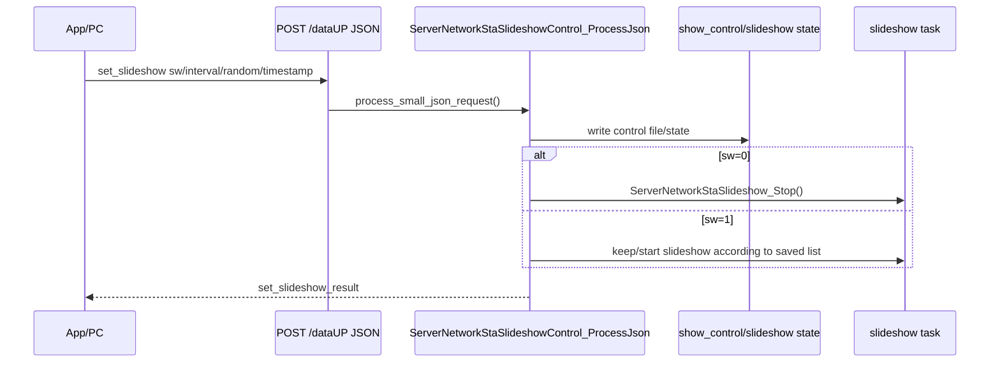
```mermaid
sequenceDiagram
    participant APP as App/PC
    participant DATAUP as POST /dataUP JSON
    participant CTRL as ServerNetworkStaSlideshowControl_ProcessJson
    participant FILE as show_control/slideshow state
    participant SS as slideshow task
    APP->>DATAUP: set_slideshow sw/interval/random/timestamp
    DATAUP->>CTRL: process_small_json_request()
    CTRL->>FILE: write control file/state
    alt sw=0
        CTRL->>SS: ServerNetworkStaSlideshow_Stop()
    else sw=1
        CTRL->>SS: keep/start slideshow according to saved list
    end
    CTRL-->>APP: set_slideshow_result
```

相关文件：

```text
main/server_network_sta/slideshow_control/server_network_sta_slideshow_control.c
main/server_network_sta/slideshow_control/server_network_sta_slideshow_control.h
```

树状时序：

```text
HTTP small JSON set_slideshow
└─ receive_data_redirect_handler()
   └─ process_small_json_request()
      └─ ServerNetworkStaSlideshowControl_ProcessJson()
         ├─ parse sw field
         ├─ parse interval/random
         ├─ sw=1 parse timestamp and check/set RTC
         ├─ write_control_file(sw/interval/timestamp/anchor_epoch)
         ├─ sw=0
         │  └─ ServerNetworkStaSlideshow_Stop()
         └─ sw=1
            └─ ServerNetworkStaSlideshow_StartSavedResetInterval()
```

关键辅助函数：

```text
server_network_sta_slideshow_control.c
├─ parse_json_bool_optional()
├─ parse_json_u32()
├─ parse_json_i64()
├─ timestamp_reasonable()
├─ ServerNetworkStaSlideshowControl_ApplyJson()
├─ write_control_file()
└─ ServerNetworkStaSlideshowControl_ProcessJson()
```

V2 协议资料拆分：

```json
{
  "func": "set_slideshow",
  "sw": 1,
  "interval": 60,
  "random": false,
  "timestamp": 1783372200
}
```

字段说明：

```text
sw=1 开启轮播
sw=0 关闭轮播
interval 轮播间隔，单位秒
interval 允许范围 60..604800；sw=0 时可省略，省略时沿用已有控制文件或默认最小值
random 字段保留，但设备始终强制为 false 并按列表顺序轮播；省略时也不会启用随机模式
control.interval / control.random 是 set_slideshow 写入控制文件的配置值；轮播 task 实际使用的是启动/恢复后复制到 runtime 的 RAM 值。
timestamp 保存的 `fileNames[startIndex]` 起始图片目标播放时间，秒级标准 Unix 时间戳
旧 datetime/timezone 已删除；新请求中不再发送 timezone
anchor_epoch 等于 timestamp，用于后续按 interval 计算播放点
startIndex 不由 set_slideshow 修改；始终沿用 slideshow_config.txt 中 start_slideshow 保存的必填起始索引
```

RTC 同步规则：

```text
sw=1 时如果 SNTP 已同步，设备使用 SNTP 当前时间，不用 APP / PC 的 timestamp 修 RTC；同时比较 abs(now_epoch - timestamp)。
SNTP 已同步且差值 > 5 秒时，返回 1513，不写控制文件，不停止/启动轮播，不执行本次指令；返回中带 timestamp、now_epoch、time_diff，方便 APP / PC 知道差几秒。
SNTP 已同步且差值 <= 5 秒时，接受指令，anchor_epoch=timestamp。
若 timestamp 在未来，设备不会无条件提前显示；进入起始图片 EPD 刷新的时间点为 `timestamp-lead_seconds`。该时间点已经到达时立即进入，否则等待到该时间点。
SNTP 未同步时，设备把 APP / PC 发来的 timestamp 写入 ESP32-C5 RTC / 系统时间，并以此作为本次轮播时间基准；写入失败返回 1512。
timestamp 表示 `fileNames[startIndex]` 起始图片播放时间，之后每 interval 秒一个播放点。
设备收到 APP / PC 合法 timestamp 后，会尽量通过 CH583/CH585 TIME_SET 备份该时间；即使 SNTP 已同步且 timestamp 与设备当前 SNTP 时间差值超过 5 秒、最终返回 1513 不执行轮播，也会先备份 APP / PC timestamp。若 timestamp 非法但 SNTP 已同步，则备份设备当前 SNTP 时间。
如果收到命令或设备启动恢复时已经超过 timestamp，并且 SNTP 已同步：
- 使用 `slot=floor((now_epoch-anchor_epoch)/interval)` 计算当前绝对时间槽。
- 使用 `current_index=(startIndex+(slot%file_count))%file_count` 计算 APP 与 ESP32 此刻共同应显示的图片。开机恢复时 NVS position 不能改变该选图结果，只在其 `pending_file` 等于当前槽下一张时辅助确认墨水屏已经显示当前图片，并避免重复刷新；否则立即显示当前槽图片。
- 使用 `next_epoch=anchor_epoch+(slot+1)*interval` 计算下一个逻辑播放点；跨过多个时间槽时直接跳到当前槽，不补播遗漏图片。
轮播 task 内部 1 秒检查 RTC / 系统时间；设备内部仍按当前 EPD type 在 `next_epoch - lead_seconds` 时提前进入 EPD 显示流程：DKE 13.3 寸为 1 秒，兴泰 13.3 寸为 3 秒，其它屏型默认 2 秒，但图片索引按逻辑 `next_epoch` 对应的槽计算。
返回成功时带 timestamp、time_source、time_diff、anchor_epoch、now_epoch、next_epoch、remain，APP 可用 remain 校验倒计时同步。time_source=sntp 表示使用设备 SNTP 时间；time_source=timestamp 表示 SNTP 未同步，已使用 APP / PC timestamp 写入 RTC。
开机自动恢复启动点如果 `ServerNetworkStaTime_IsSntpSynced()==true`，则立即启用绝对时间槽；否则仍走原 CH583/CH585、anchor fallback 与 pending_file 路径。轮播等待期间每秒只检查状态、不打印；首次发现 SNTP 成功后切换一次，之后不再回退。
```


Powershell 测试用例：

```powershell
# set_slideshow：开启轮播并设置间隔。
$esp = "http://192.168.1.104"
$body = @{
  func = "set_slideshow"
  sw = 1
  interval = 60
  random = $false
  timestamp = [DateTimeOffset]::UtcNow.ToUnixTimeSeconds()
} | ConvertTo-Json -Depth 4

Invoke-RestMethod -Uri "$esp/dataUP" `
  -Method Post `
  -ContentType "application/json" `
  -Body $body
```

```powershell
# 关闭轮播。
$body = @{
  func = "set_slideshow"
  sw = 0
  interval = 60
} | ConvertTo-Json -Depth 4

Invoke-RestMethod -Uri "$esp/dataUP" `
  -Method Post `
  -ContentType "application/json" `
  -Body $body
```

预期：`sw=1` 开启，`sw=0` 关闭；配置写入 slideshow control 文件。

当前实现：

```text
set_slideshow 的 sw=1 会更新控制文件、同步写 `epd_mode=1(SLIDESHOW)`，并尝试启动轮播。
若旧轮播正在运行，`set_slideshow sw=1` 写入新的 interval / timestamp 后会按 RTC 计算出的 next_epoch 重新同步；如果 EPD 正在显示，不打断本次显示，显示完成后继续按 RTC 下一个播放点等待，等待期间会预加载下一张。
`ServerNetworkStaSlideshow_GetScheduleTiming()` 可读取当前 RTC 轮播的 now_epoch / next_epoch / remain，snapshot 和关机前 WAKE_TIMER 计算优先使用这组值。
存储未就绪、未保存轮播列表、参数非法、interval 非法、控制文件/NVS 保存失败、轮播 runtime 启动失败、timestamp 非法、timestamp 写 RTC 失败、SNTP 时间差过大已分别返回 1012、1501、1004、1507、1509、1506、1510、1512、1513。
网络 JSON 的 `func` 判断支持空格、CRLF 和 PowerShell `ConvertTo-Json` 输出格式。
```

存 / 取信息（含条件限制）：

```text
存：
- set_slideshow 写入轮播控制文件，保存 sw / interval / random / timestamp / anchor_epoch；random 省略时沿用已有 control。sw=1 时通过 ServerNetworkStaSlideshow_StartSavedResetInterval() 启动，并按 RTC next_epoch 等待。
- sw 写入成功后同步写 PhotoPainter:epd_mode；sw=1 写 1，sw=0 写 0。
- 关闭轮播时更新控制状态并请求停止轮播任务；若 EPD 正在刷新，等待本次真实结果，成功时先提交下一待显示进度再退出。
- 配置 hash 或已保存随机排列失效时，再次开启会从当前配置第一张建立新一轮进度。

取：
- 读取 JSON 中 sw、interval、random、timestamp；random 省略时沿用已有 control。
- `sw=1` 时读取并校验持久化待显示进度，用于断电后继续；`sw=0` 时重启不会自动恢复轮播。
```

[⬆ 返回目录](#toc) | [↩ 返回当前目录](#sec-07)

---

### 7.10 snapshot：读取图片列表和轮播状态 <span id="sec-07-10"></span>

Result 定义建议：

| 返回 | result | 说明 |
|---|---|---|
| `get_snapshot_result` | `0` | 快照读取成功 |
| `get_snapshot_result` | `1011` | 快照缓冲区分配失败 |
| `get_snapshot_result` | `1401` | 图片列表读取失败 |
| `get_snapshot_result` | `1404` | 快照 JSON 生成失败 |

功能说明：一次返回设备已保存图片列表和当前轮播状态，便于 App 进入页面时恢复设备状态。

Mermaid 时序图：

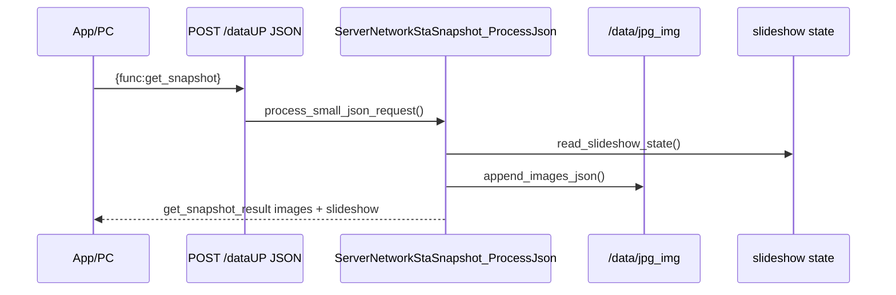
```mermaid
sequenceDiagram
    participant APP as App/PC
    participant DATAUP as POST /dataUP JSON
    participant SNAP as ServerNetworkStaSnapshot_ProcessJson
    participant SD as /data/jpg_img
    participant SS as slideshow state
    APP->>DATAUP: {func:get_snapshot}
    DATAUP->>SNAP: process_small_json_request()
    SNAP->>SS: read_slideshow_state()
    SNAP->>SD: append_images_json()
    SNAP-->>APP: get_snapshot_result images + slideshow
```

相关文件：

```text
main/server_network_sta/snapshot/server_network_sta_snapshot.c
main/server_network_sta/snapshot/server_network_sta_snapshot.h
```

树状时序：

```text
HTTP small JSON get_snapshot
└─ receive_data_redirect_handler()
   └─ process_small_json_request()
      └─ ServerNetworkStaSnapshot_ProcessJson()
         ├─ read_slideshow_state()
         ├─ append_images_json()
         ├─ append_slideshow_json()
         └─ httpd_resp_sendstr(json)
```

关键辅助函数：

```text
server_network_sta_snapshot.c
├─ append_images_json()
├─ read_slideshow_state()
├─ append_slideshow_json()
└─ ServerNetworkStaSnapshot_ProcessJson()
```

V2 协议资料拆分：

```json
{
  "func": "get_snapshot"
}
```

返回：

```json
{
  "func": "get_snapshot_result",
  "result": 0,
  "images": [
    {
      "fileName": "26422",
      "thumbnailUrl": "/thumb/26422.jpg"
    }
  ],
  "slideshow": {
    "sw": 1,
    "fileNames": ["26422", "26423"],
    "interval": 60,
    "random": false,
    "startIndex": 0
  }
}
```

V2 说明：如果设备未设置过轮播，返回的 `startIndex=-1` 表示没有合法的新协议轮播配置；合法配置返回保存的起始 startIndex。

RTC 轮播字段：

```text
timestamp     set_slideshow sw=1 写入的起始槽播放时间，该槽图片由 slideshow_config.startIndex 决定。
anchor_epoch  等于 timestamp，用于按 interval 计算后续播放点。
now_epoch     设备当前 RTC / 系统 Unix 秒。
next_epoch    当前运行中下一次轮播播放点；未运行或非 RTC 轮播为 0。
remain        next_epoch - now_epoch，单位秒；APP 可用于同步倒计时。
time_synced   SNTP 是否已完成同步。
startIndex    start_slideshow 保存的起始图片索引；缺少或非法配置返回 -1。
```


Powershell 测试用例：

```powershell
# get_snapshot：一次读取图片列表和轮播状态。
$esp = "http://192.168.1.104"
$body = @{ func = "get_snapshot" } | ConvertTo-Json

Invoke-RestMethod -Uri "$esp/dataUP" `
  -Method Post `
  -ContentType "application/json" `
  -Body $body
```

预期：返回 `get_snapshot_result`，包含 `images` 和 `slideshow`。

存 / 取信息（含条件限制）：

```text
存：
- get_snapshot 不写文件。

取：
- append_images_json() 扫描 /data/jpg_img 下保存的缩略图。
- read_slideshow_state() 读取 slideshow_config 和 control 文件。
- 返回 images[] 与 slideshow 状态。
- 网络 JSON 的 `func` 判断支持空格、CRLF 和 PowerShell `ConvertTo-Json` 输出格式。
```

[⬆ 返回目录](#toc) | [↩ 返回当前目录](#sec-07)

---

### 7.11 upload：PC或手机传文件到ESP32-C5，并存 <span id="sec-07-11"></span>

Result 定义建议：

| 返回 | result | 说明 |
|---|---|---|
| `upload_result` | `0` | upload 成功 |
| `upload_result` | `1010` | 返回 JSON 过长 |
| `upload_result` | `1012` | SD 卡 / 存储未就绪 |
| `upload_result` | `1013` | 存储空间不足 |
| `upload_result` | `1016` | 保存队列创建、提交或排队失败 |
| `upload_result` | `1601` | multipart boundary 缺失 |
| `upload_result` | `1602` | multipart `func` 缺失 |
| `upload_result` | `1603` | 上传内容格式非法 |
| `upload_result` | `1604` | `bin` 缺失 |
| `upload_result` | `1605` | `image` 缺失 |
| `upload_result` | `1606` | 声明大小和实际大小不一致 |
| `upload_result` | `1607` | 保存 bin 失败 |
| `upload_result` | `1608` | 保存 image 失败 |
| `upload_result` | `1609` | EPD 显示队列提交失败 |
| `upload_result` | `1008` | EPD 同步显示等待或驱动 BUSY 超时 |
| `upload_result` | `1011` | EPD 显示 buffer / completion 内存不足 |
| `upload_result` | `1804` | EPD 驱动执行失败 |
| `upload_result` | `1612` | 文件名非法 |

功能说明：网页端或 App 上传图片到设备 SD 卡；字段与 `cast` 基本一致，主要用于保存图片，也可在 `show=true` 时立即显示。

Mermaid 时序图：

```mermaid
sequenceDiagram
    participant APP as App/PC
    participant DATAUP as POST /dataUP
    participant UP as ServerNetworkStaUpload_Process
    participant CORE as TdxImageTransfer
    participant SAVE as CastSaveTask
    participant EPD as EPD Display Queue
    APP->>DATAUP: multipart func=upload
    DATAUP->>UP: route by func
    UP->>CORE: parse and validate fields/file sizes
    UP-->>APP: upload result
    UP-->>DATAUP: HTTP handler done
    alt show=true
        CORE->>EPD: ServerNetworkStaEpdDisplay_QueueToScreenAndWait()
    end
    alt save=true
        CORE->>SAVE: submit save task and wait result
        SAVE->>SAVE: save bin and jpg
    end
```

相关文件：

```text
main/server_network_sta/upload/server_network_sta_upload.c
main/server_network_sta/upload/server_network_sta_upload.h
main/cast_core/cast_core.c
main/cast_core/cast_core.h
```

树状时序：

```text
HTTP multipart /dataUP
└─ receive_data_redirect_handler()
   └─ ServerNetworkStaUpload_Process()
      ├─ TdxImageTransfer_ParseSingle("upload")
      │  ├─ UsbConsoleCommon_ExtractBoundary()
      │  ├─ UsbConsoleCommon_MultipartParts()
      │  └─ UsbConsoleCommon_FileNameIsSafe()
      ├─ httpd_resp_sendstr()
      └─ dataup_async_worker
         └─ TdxImageTransfer_ProcessItems()
            ├─ show=true
            │  └─ ServerNetworkStaEpdDisplay_QueueToScreenAndWait()
            └─ save=true
               └─ CastSaveTask
                  ├─ save /data/bin_img/<fileName>.bin
                  └─ save /data/jpg_img/<fileName>.jpg
```

关键辅助函数：

```text
server_network_sta_upload.c
├─ send_upload_result()
├─ upload_async_process()
└─ ServerNetworkStaUpload_Process()

cast_core.c
├─ TdxImageTransfer_ParseSingle()
├─ TdxImageTransfer_ProcessItems()
└─ CastSaveTask()
```

说明：network upload 与 USB upload 共享 `TdxImageTransfer_ParseSingle()`、`TdxImageTransfer_ProcessItems()` 和 `CastSaveTask`。network upload 在 `show=true` 时解析和字段校验通过后先返回 `upload_result=0` 并结束 HTTP handler；EPD 显示和保存由固定的 `dataup_async_worker` 调用 `upload_async_process()` 后台执行。后台存在 `show=true` 时先停止轮播、写 `show_control.txt sw=0` 并读回确认，再等待 EPD 显示任务完成；`save=true` 时再提交保存任务。`show=false` 的 network upload 仍同步返回最终结果。

成功或失败返回 JSON 会包含 `fileName`、`bin_file`、`image_file`、`save`、`show`、`error` 字段；成功时 `message="upload success"` 且 `error="no error"`。

V2 协议资料拆分：

```http
POST /dataUP HTTP/1.1
Content-Type: multipart/form-data

func=upload
fileName=26422
bin_size=123456
image_size=23456
save=true
show=false
bin=@26422.bin
image=@26422.jpg
```

V2 说明：`upload` 与 `cast` 字段基本一致，用于保存图片上传。当前 network upload 使用 `TdxImageTransfer_ParseSingle("upload")`，一次请求只处理一组 `fileName/bin/image`；多图批量应使用 `cast2pic` 或由前端拆成多次 upload 请求。

V2 预留 `update`：

```http
POST /dataUP HTTP/1.1
Content-Type: multipart/form-data

func=update
oldfileNames=12345
newfileNames=67890
bin_size=123456
image_size=23456
save=true
show=true
bin=@67890.bin
image=@67890.jpg
```

`update` 在 V2 中标为前端预留，用于用新图片替换旧图片。


Powershell 测试用例：

```powershell
# upload：上传图片到 SD 卡，不立即显示。
$esp = "http://192.168.1.104"
$bin = "H:\AI2\test\26424.bin"
$jpg = "H:\AI2\test\26424.jpg"
$binSize = (Get-Item $bin).Length
$jpgSize = (Get-Item $jpg).Length

curl.exe -X POST "$esp/dataUP" `
  -F "func=upload" `
  -F "fileName=26424" `
  -F "bin_size=$binSize" `
  -F "image_size=$jpgSize" `
  -F "save=true" `
  -F "show=false" `
  -F "bin=@$bin;type=application/octet-stream" `
  -F "image=@$jpg;type=image/jpeg"
```

预期：设备返回上传成功结果；`show=false` 时只保存，不进入 EPD 显示队列。

存 / 取信息（含条件限制）：

```text
存：
- 保存上传的 /data/bin_img/<fileName>.bin。
- 保存上传的 /data/jpg_img/<fileName>.jpg。
- 使用文件名安全检查后再写入，避免路径穿越。

取：
- 读取 multipart 字段 func/fileName/bin_size/image_size/save/show/bin/image。
- 写入前读取存储剩余空间。
- show=true 时读取上传数据后先返回 upload_result，后台再等待 EPD 显示任务完成并保存。
```

[⬆ 返回目录](#toc) | [↩ 返回当前目录](#sec-07)

---

### 7.12 wifi_work_time：WiFi 省电管理 <span id="sec-07-12"></span>

Result 定义建议：

| 返回 | result | 说明 |
|---|---|---|
| `set_wifi_work_time_result` | `0` | WiFi 工作时间设置成功 |
| `set_wifi_work_time_result` | `1004` | 网络 HTTP 请求包含已停用的旧字段 `time` |
| `set_wifi_work_time_result` | `1351` | 网络 HTTP 的 `seconds` 缺失或不是有效整数 |
| `set_wifi_work_time_result` | `1352` | 工作时间超出允许范围 |
| `set_wifi_work_time_result` | `1353` | NVS 保存失败 |
| `set_wifi_work_time_result` | `1354` | 运行时应用失败 |

`1354` 的当前实际路径是 WiFi 工作状态任务尚未初始化，无法应用新的运行时计时参数；NVS 写入失败仍返回 `1353`。

功能说明：设置 WiFi 保持工作时间；网络 HTTP 与 USB 的 `seconds` 允许范围为 `0..3600`，并严格要求十进制整数，`1.5`、`1800abc` 等格式拒绝。CH583 UART 初始化完成前由 startup-pending guard 禁止关机；初始化完成后产生新的 20 秒 CH583 保护。工作时间超时后，还必须满足最近一次 HTTP 网络活动和 CH583 合法业务活动都已过去至少 20 秒、OTA 接收与写入都不忙、EPD task 空闲且图片保存不忙，才通过 CH583 `POWER_OFF` 关闭 WiFi 电源或进入低功耗流程。HTTP 与 CH583 活动保护使用独立 RAM 时间戳，不重置保存值、不写 NVS；网络 `/ping`、长文件上传、普通文件下载、目录列表和缩略图分块发送持续刷新 HTTP 保护，合法 `BLE_MAC`、`BLE_VER`、单帧和每个有效 `BLE_DATA` 分片刷新 CH583 保护。CH583 UART `PING/PONG`、`ACK/ERR` 和状态回复不刷新保护。LED 关机准备完成后、真正发送 `POWER_OFF` 前会再次检查工作计时及 HTTP、CH583、OTA、EPD 和图片保存保护；发现新任务就取消本次关机，取消失败时持续优先重试，成功解除 LED 永久关机锁前不进入普通保护或新的关机流程。HTTP 与 CH583 保护分别在每个连续保护周期只打印一次推迟日志，避免每秒刷屏。

Mermaid 时序图：

```mermaid
sequenceDiagram
    participant APP as App/PC
    participant DATAUP as POST /dataUP JSON
    participant WT as ServerNetworkStaWifiWorkTime_ProcessJson
    participant TIMER as work_state_task
    participant CH583 as CH583 UART
    APP->>DATAUP: set_wifi_work_time seconds
    DATAUP->>WT: process_small_json_request()
    WT->>WT: ServerNetworkStaWifiWorkTime_SetAndSave()
    WT->>WT: save NVS and reset working_time
    loop periodic check
        TIMER->>WT: compare elapsed and required time
    end
    alt timeout and HTTP/CH583 idle 20s and OTA not busy and EPD/image idle
        TIMER->>TIMER: read slideshow control sw/interval
        alt slideshow sw=1
            TIMER->>TIMER: read slideshow runtime interval elapsed
            alt remaining interval >= TDX_SLIDESHOW_POWER_OFF_MIN_WAKE_INTERVAL_SECONDS
                WT->>CH583: WAKE_TIMER ON,<remaining interval>
            else remaining interval < TDX_SLIDESHOW_POWER_OFF_MIN_WAKE_INTERVAL_SECONDS
                WT->>WT: reset wifi_work_time counter, skip POWER_OFF
            end
        else slideshow sw=0
            WT->>CH583: WAKE_TIMER OFF,0
        end
        WT->>CH583: ch583_wifi_uart_send_power_off()
    end
```

相关文件：

```text
main/server_network_sta/wifi_work_time/server_network_sta_wifi_work_time.c
main/server_network_sta/wifi_work_time/server_network_sta_wifi_work_time.h
```

树状时序：

```text
main/main.c
└─ ServerNetworkStaWifiWorkTime_Init()
   ├─ set CH583 startup-pending guard before work_state_task
   ├─ load_work_state_from_nvs()
   ├─ load_work_time_vars_from_app_nvs()
   └─ xTaskCreate(work_state_task)

main/main.c
└─ Ch583UartApp_Init()
   └─ ServerNetworkStaWifiWorkTime_OnCh583Initialized()
      ├─ clear CH583 startup-pending guard
      └─ start a fresh 20-second CH583 activity hold

HTTP small JSON set_wifi_work_time
└─ receive_data_redirect_handler()
   └─ process_small_json_request()
      └─ ServerNetworkStaWifiWorkTime_ProcessJson()
         └─ ServerNetworkStaWifiWorkTime_SetAndSave()
            ├─ clamp seconds
            ├─ save_work_state_to_nvs()
            └─ save_work_time_vars_to_app_nvs()

work_state_task()
├─ LED cancel pending
│  └─ retry UserLedStatus_CancelPowerOffSync() before all ordinary guards
├─ CH583 startup pending
│  └─ postpone POWER_OFF until CH583 UART initialization completes
├─ update_working_time_seconds()
├─ elapsed <= server_required_continue_work_time
│  └─ keep running
├─ elapsed > server_required_continue_work_time && OTA receive/write busy
│  └─ ignored during OTA
├─ elapsed > server_required_continue_work_time && EPD busy
│  └─ postpone POWER_OFF until EPD task completes
├─ elapsed > server_required_continue_work_time && image save busy
│  └─ postpone POWER_OFF until save and cleanup complete
├─ elapsed > server_required_continue_work_time && last HTTP activity < 20 seconds
│  └─ postpone POWER_OFF until 20 seconds after the latest HTTP activity
├─ elapsed > server_required_continue_work_time && last CH583 initialization/business activity < 20 seconds
│  └─ postpone POWER_OFF until 20 seconds after the latest CH583 activity
└─ elapsed > server_required_continue_work_time && all guards idle
   ├─ ServerNetworkStaSlideshow_IsSavedEnabled("/data")
   ├─ sw=1
   │  ├─ ServerNetworkStaSlideshow_GetRuntimeTiming()
   │  ├─ runtime 正在等待 interval 时，wake_interval = max(runtime_interval - elapsed - startup_delay_seconds, 1)
   │  ├─ wake_interval < TDX_SLIDESHOW_POWER_OFF_MIN_WAKE_INTERVAL_SECONDS 时，重置 wifi_work_time 运行时计时并跳过 POWER_OFF；保留本次尝试时间，按 20 秒节流后再评估
   │  └─ wake_interval >= TDX_SLIDESHOW_POWER_OFF_MIN_WAKE_INTERVAL_SECONDS 时，ch583_wifi_uart_send_wake_timer_on(wake_interval)
   ├─ sw=0 / control missing / parse failed
   │  └─ ch583_wifi_uart_send_wake_timer_off()
   ├─ 超时后立即发送一次；之后每 20 秒重发一次 WAKE_TIMER / LED 关闭 / POWER_OFF
   ├─ 关机流程中发给 CH583/CH585 的命令之间至少间隔 100ms
   ├─ WAKE_TIMER 检查允许继续关机后，设置 LED power-off pending
   ├─ UserLedStatus_PreparePowerOffSync()
   └─ ch583_wifi_uart_send_power_off()
```

关键辅助函数：

```text
server_network_sta_wifi_work_time.c
├─ ServerNetworkStaWifiWorkTime_Init()
├─ ServerNetworkStaWifiWorkTime_OnNetworkData()
├─ ServerNetworkStaWifiWorkTime_OnHttpNetworkActivity()
├─ ServerNetworkStaWifiWorkTime_OnCh583Activity()
├─ ServerNetworkStaWifiWorkTime_OnCh583Initialized()
├─ ServerNetworkStaWifiWorkTime_ProcessJson()
├─ ServerNetworkStaWifiWorkTime_SetAndSave()
├─ ServerNetworkStaWifiWorkTime_SetOtaWriteInProgress()
├─ ServerNetworkStaWifiWorkTime_SetOtaReceiveInProgress()
├─ configure_ch583_wake_timer_before_power_off()
└─ work_state_task()
```

V2 协议资料拆分：

```json
{
  "func": "set_wifi_work_time",
  "seconds": 300
}
```

字段说明：

```text
seconds WiFi 工作时长，单位秒，网络 HTTP 只接受该字段和严格十进制整数，允许范围 0..3600；旧字段 `time` 不再支持并返回参数非法。
网络 JSON 的 `func` 判断支持空格、CRLF 和 PowerShell `ConvertTo-Json` 输出格式。
```


Powershell 测试用例：

```powershell
# set_wifi_work_time：设置 WiFi 保持工作时长，单位秒。
$esp = "http://192.168.1.104"
$body = @{
  func = "set_wifi_work_time"
  seconds = 300
} | ConvertTo-Json

Invoke-RestMethod -Uri "$esp/dataUP" `
  -Method Post `
  -ContentType "application/json" `
  -Body $body
```

预期：设备保存 WiFi 工作时长配置，并重置工作计时；请求本身更新 HTTP 活动时间，最后一次 HTTP 活动后的 20 秒内不关机；超时后由 wifi_work_time 模块结合 CH583、OTA、EPD、图片保存和轮播保护决定是否发送 CH583 `POWER_OFF`。

EPD 完成低功耗倒计时：

```text
 默认 1。
USER_EPD_DONE_LOW_POWER_DELAY_SECONDS 默认 5 秒。
USER_EPD_DONE_LOW_POWER_SLIDESHOW_MIN_REMAIN_SECONDS 默认 60 秒。
```

当 `USER_EPD_DONE_LOW_POWER_ENABLE=1` 时，每次 EPD display task 实际完成一个显示 job 后，都会调用 `ServerNetworkStaWifiWorkTime_RequestOneShotPowerOffCountdown()` 请求一次低功耗倒计时。该倒计时允许使用默认 5 秒，不依赖普通 `set_wifi_work_time` 的 `0..3600` 秒保存值；它只修改 RAM 中的运行时计时，不写 NVS，不改变 `set_wifi_work_time` 保存值。倒计时到期后，所有 `POWER_OFF` 前都会先检查 cast/upload/cast2pic 图片保存状态；如果 SD 保存或 cleanup 正在进行，只推迟 `POWER_OFF`，不取消关机请求，保存完成后由 `work_state_task()` 下一轮继续关机判断。只有当前 `epd_mode=1(SLIDESHOW)` 时才读取下一次轮播剩余时间：剩余时间不大于 `USER_EPD_DONE_LOW_POWER_SLIDESHOW_MIN_REMAIN_SECONDS=60` 秒时不关机，并恢复 one-shot 前的运行时目标；剩余时间大于 60 秒时继续执行关机流程。如果当前不是轮播模式，例如 `epd_mode=0(NORMAL)`、`epd_mode=2(DAILY)` 或保留值，则不做轮播剩余时间判断，直接进入现有关机流程。后续仍由 `work_state_task()` 统一判断 HTTP/CH583 活动保护、OTA receive/write busy、EPD busy、图片保存 busy、slideshow wake timer、LED 关机准备，并最终调用 `ch583_wifi_uart_send_power_off()`。

存 / 取信息（含条件限制）：

```text
存：
- save_work_state_to_nvs() 写入 namespace=USER_WORK_STATE_NVS_NAMESPACE 的 USER_WORK_STATE_NVS_KEY blob。
- save_work_time_vars_to_app_nvs() 写入 PhotoPainter 下的 SERVER_REQUIRED_CONTINUE_WORK_TIME_NVS_KEY 与 WIFI_STANDBY_TIME_S_NVS_KEY 字符串。

取：
- load_work_state_from_nvs() 读取工作状态 blob。
- load_work_time_vars_from_app_nvs() 读取兼容字符串 key。
- `seconds=0` 时 `server_required_continue_work_time` 与 `wifi_standby_time_s` 都按 0 保存和恢复，不再把 standby 的 0 替换为默认 15。
- work_state_task() 读取 RAM 中计时值；CH583 UART 初始化完成前禁止关机；超时后如果最近一次 HTTP 或 CH583 初始化完成/合法业务活动不足 20 秒、OTA 接收/写入忙、EPD task 忙或图片保存忙则推迟；所有保护解除后才先配置 CH583 WAKE_TIMER，再发送 CH583 POWER_OFF。
- ServerNetworkStaWifiWorkTime_OnHttpNetworkActivity() 只记录 HTTP 活动 tick；请求入口、每次成功接收 HTTP body 数据块以及长文件、目录列表、缩略图成功发送数据块时刷新，20 秒保护只在 RAM 中生效，不重置保存的完整工作时间。原 ServerNetworkStaWifiWorkTime_OnNetworkData() 继续供 BLE/CH583、EPD 等原调用方使用。
- wifi_work_time 初始化时设置 CH583 startup-pending guard；该 guard 不受 20 秒超时限制，CH583 UART 初始化完成前禁止进入关机流程。`ServerNetworkStaWifiWorkTime_OnCh583Initialized()` 清除 startup-pending guard，并从初始化完成时开始新的 20 秒 CH583 活动保护。
- ServerNetworkStaWifiWorkTime_OnCh583Activity() 只记录 CH583 活动 tick；合法 BLE_MAC、BLE_VER、单帧及每个有效 BLE_DATA 分片刷新。PING/PONG、ACK/ERR、GPIO_VALUE、TIME_STATUS、NFC_STATUS 不刷新。
- LED 关机准备完成后立即执行 final guard；若工作计时已被 USB/BLE 等活动重置，或此时出现 HTTP、CH583、OTA、EPD、图片保存活动，则设置 LED cancel-pending 状态并调用 `UserLedStatus_CancelPowerOffSync()`。取消失败时，`work_state_task()` 后续每轮都优先重试，成功解除 LED 永久关机锁前不进入普通活动保护或新的关机流程。
- TdxImageTransfer_ProcessItems() 在 cast/upload/cast2pic 发现本次需要保存图片时设置 image_save_busy，并覆盖后续 EPD 显示、保存和 cleanup；显示失败、保存成功、保存失败或 cleanup 后都会清除。work_state_task() 在所有 POWER_OFF 前检查 image_save_busy，busy 时不发送 WAKE_TIMER / LED 关闭 / POWER_OFF，只推迟到保存完成后的下一轮继续关机判断。
- EPD 完成低功耗倒计时开启时，每个 EPD display job 完成后只请求一次运行时倒计时；倒计时到期后，只有 `epd_mode=1(SLIDESHOW)` 才检查下一次轮播剩余时间，如果剩余时间不大于 60 秒，不关机并恢复 one-shot 前的运行时目标；非轮播模式不做该判断，直接进入现有关机流程；下一次 EPD job 完成才会再次请求。
- 轮播开启时，WAKE_TIMER 优先使用 RTC 轮播的 `next_epoch - now_epoch` 剩余秒数，并扣除开机自动恢复轮播延迟和额外提前量：`remain - (startup_delay_seconds + TDX_SLIDESHOW_WAKE_EXTRA_ADVANCE_SECONDS)`；其中 `startup_delay_seconds = ceil(TDX_SLIDESHOW_STARTUP_DELAY_MS / 1000)`，当前为 10 秒，`TDX_SLIDESHOW_WAKE_EXTRA_ADVANCE_SECONDS` 当前为 20 秒，总提前 30 秒。若当前不是 RTC 轮播或 RTC timing 不可用，则回退使用旧 runtime timing：`runtime_interval - 已走秒数 - 总提前秒数`；再不可用才回退 control 文件中的 interval。若计算出的 wake_interval 小于 `TDX_SLIDESHOW_POWER_OFF_MIN_WAKE_INTERVAL_SECONDS=20`，ESP32 不发送 WAKE_TIMER ON/OFF，也不发送 POWER_OFF，只重置 wifi_work_time 运行时计时并保留本次关机尝试时间，确保 `seconds=0` 时仍按 20 秒节流后再评估；该分支不会设置 LED power-off pending，避免 LED 反复关闭和恢复。轮播配置自身的最小间隔仍由 `TDX_SLIDESHOW_INTERVAL_MIN_SECONDS=60` 控制。
```

work_state 栈大小要求：

```text
USER_WORK_STATE_TASK_STACK_SIZE 默认使用 8 * 1024。
不要改回 3 * 1024。

原因：
work_state_task() 不是只做简单计时。工作时间超时后，它会执行关机前完整链路：
1. 先确认 CH583 UART 已初始化完成、最近一次 HTTP 与 CH583 初始化完成/合法业务活动都已过去 20 秒、OTA receive/write hold 均已解除、EPD task 空闲且图片保存不忙；任一保护条件不满足时不关机。
2. 读取 slideshow control，决定 WAKE_TIMER ON/OFF。
3. slideshow 开启时优先读取 RTC schedule timing，使用 `next_epoch - now_epoch` 作为剩余秒数，并额外扣掉 `TDX_SLIDESHOW_STARTUP_DELAY_MS` 换算后的 10 秒和 `TDX_SLIDESHOW_WAKE_EXTRA_ADVANCE_SECONDS=20` 秒；若没有 RTC timing，再回退旧 runtime timing。若剩余 wake_interval 小于 `TDX_SLIDESHOW_POWER_OFF_MIN_WAKE_INTERVAL_SECONDS=20`，不发送 WAKE_TIMER ON/OFF、不设置 LED power-off pending、不发送 POWER_OFF，只重置 wifi_work_time 运行时计时并保留 20 秒关机重试节流；否则发送 CH583 WAKE_TIMER ON。
4. 调用 `UserLedStatus_PreparePowerOffSync()`，等待 LED Task 停止 RED/GREEN 闪烁并强制关闭后，再执行 final guard；若出现新任务则通过 `UserLedStatus_CancelPowerOffSync()` 解除关机锁并恢复基础灯效。
5. 发送 CH583 POWER_OFF。

这些调用会进入 CH583 V1 组帧、UART 写入、调试输出等函数，栈上存在多个局部 buffer。
如果栈只有 3 * 1024，可能在超时关机流程中触发 Stack protection fault。
```

[⬆ 返回目录](#toc) | [↩ 返回当前目录](#sec-07)

---

### 7.13 time：RTC 默认时间与 SNTP 网络校时 <span id="sec-07-13"></span>

Result 定义建议：

| 返回 | result | 说明 |
|---|---|---|
| `time_result` | `0` | 已通过 SNTP 同步网络时间 |
| `time_result` | `1` | 当前使用默认时间，尚未 SNTP 同步 |
| `time_result` | `2` | 时间仍无效 |

功能说明：ESP32-C5 启动后初始化系统时间模块，使用 `RTC + high-resolution timer` 作为系统时间源。开机时先设置中国时区 `CST-8`，只在当前 RTC / 系统时间无效时设置默认时间 `2026-01-01 00:00:00`；如果 RTC 时间已经有效，则保留现有时间，不强制覆盖。WiFi STA 获取 IP 后启动 SNTP，从阿里云 NTP 服务器同步网络时间，SNTP 成功后 ESP-IDF 自动更新系统时间。

配置要求：

```ini
CONFIG_LIBC_TIME_SYSCALL_USE_RTC_HRT=y
CONFIG_LWIP_SNTP_MAX_SERVERS=3
CONFIG_LWIP_SNTP_UPDATE_DELAY=3600000
```

SNTP 服务器：

```text
ntp.aliyun.com
ntp1.aliyun.com
ntp2.aliyun.com
```

Mermaid 时序图：

```mermaid
sequenceDiagram
    participant APP as app_main
    participant TIME as server_network_sta_time
    participant WIFI as WiFi STA
    participant SNTP as Aliyun NTP
    participant HTTP as GET /time
    APP->>TIME: ServerNetworkStaTime_Init()
    TIME->>TIME: set TZ=CST-8
    TIME->>TIME: time() 检查当前 RTC / 系统时间
    alt 时间无效
        TIME->>TIME: settimeofday(default 2026-01-01 00:00:00)
    else 时间有效
        TIME->>TIME: 保留当前时间
    end
    TIME->>TIME: esp_netif_sntp_init(start=false)
    WIFI->>TIME: IP_EVENT_STA_GOT_IP
    TIME->>SNTP: esp_netif_sntp_start()
    SNTP-->>TIME: sync callback
    TIME->>TIME: 标记 source=sntp synced=true
    HTTP->>TIME: ServerNetworkStaTime_ProcessGet()
    TIME-->>HTTP: time_result JSON
```

相关文件：

```text
main/server_network_sta/time/server_network_sta_time.c
main/server_network_sta/time/server_network_sta_time.h
main/file_server.c
main/main.c
sdkconfig
sdkconfig.defaults.esp32c5
```

树状时序：

```text
main/main.c
└─ app_main()
   ├─ esp_netif_init()
   ├─ esp_event_loop_create_default()
   └─ ServerNetworkStaTime_Init()
      ├─ setenv("TZ", "CST-8", 1)
      ├─ tzset()
      ├─ ServerNetworkStaTime_SetDefaultIfInvalid()
      │  ├─ time()
      │  ├─ 时间 >= 2026 年：保留现有 RTC / 系统时间
      │  └─ 时间 < 2026 年：settimeofday(default)
      ├─ esp_event_handler_register(IP_EVENT_STA_GOT_IP)
      └─ esp_netif_sntp_init(start=false)

WiFi got IP
└─ ip_event_handler()
   └─ esp_netif_sntp_start()

GET /time
└─ file_server.c download_get_handler()
   └─ ServerNetworkStaTime_ProcessGet()
      ├─ ServerNetworkStaTime_GetInfo()
      └─ 返回 time_result JSON
```

HTTP 请求：

```text
GET /time
GET /time?t=123
```

SNTP 同步成功响应示例：

```json
{
  "func": "time_result",
  "result": 0,
  "message": "ok",
  "valid": true,
  "synced": true,
  "source": "sntp",
  "server": "ntp.aliyun.com",
  "timezone": "CST-8",
  "epoch": 1783070000,
  "local": "2026-07-03 20:33:20",
  "utc": "2026-07-03 12:33:20"
}
```

未同步但已设置默认时间响应示例：

```json
{
  "func": "time_result",
  "result": 1,
  "message": "using default time",
  "valid": true,
  "synced": false,
  "source": "default",
  "server": "ntp.aliyun.com",
  "timezone": "CST-8",
  "epoch": 1767196800,
  "local": "2026-01-01 00:00:00",
  "utc": "2025-12-31 16:00:00"
}
```

Powershell 测试用例：

```powershell
$esp = "http://192.168.1.104"
Invoke-RestMethod -Uri "$esp/time" -Method Get
Invoke-RestMethod -Uri "$esp/time?t=123" -Method Get
```

存 / 取信息（含条件限制）：

```text
存：
- 不写 NVS、不写 SD。
- 当前 RTC / 系统时间无效时，使用 settimeofday() 写入默认时间。
- SNTP 同步成功后，由 ESP-IDF SNTP 默认立即同步模式更新系统时间。

取：
- ServerNetworkStaTime_GetInfo() 读取 time() 当前时间。
- valid 判断以本地时间年份 >= 2026 为准。
- source=default 表示使用默认兜底时间或启动时保留的有效时间；source=timestamp 表示使用 APP / PC 下发的 timestamp 写入 RTC；source=sntp 表示 SNTP 已成功同步。
- sntp_synced 只表示本轮启动后是否收到 SNTP 同步回调。
```

[⬆ 返回目录](#toc) | [↩ 返回当前目录](#sec-07)

---

### 7.14 factory_reset：GPIO28 长按清除图片 <span id="sec-07-14"></span>

功能说明：GPIO28 用作本地出厂默认图片清除按键。GPIO28 默认高电平，按下为低电平。设备每 300 ms 检测一次，只有连续低电平达到 `TDX_FACTORY_RESET_HOLD_MS=5000` ms 才触发；5 秒内任意一次采样为高电平，本次按键无效并重新计时。

安全边界：

```text
只删除图片和轮播状态：
/data/bin_img/*.bin
/data/jpg_img/*.jpg
/data/cast_img/*.bin
/data/cast_img/*.jpg
/data/bin_img/slideshow_config.txt
/data/bin_img/show_control.txt
/data/cast_img/last_cast.txt
NVS: slide_progress
NVS: slide_last
NVS: slide_random 写回 false

必须保留，不允许清除：
WiFi 配网
EPD type
WiFi 工作时间 / standby 时间
CH583 BLE MAC
CH583/CH585 时间备份和其它通信状态
OTA 状态
```

运行规则：

```text
EPD busy 时不检测 GPIO28，不累计按键时间。
只有 EPD IDLE 时，GPIO28 task 才读取按键。
触发后先停止轮播，再删除 upload/slideshow 图片、cast/cast2pic 缓存图片和轮播配置。
长按触发后进入等待松手状态；GPIO28 恢复高电平前不会再次触发。
默认不自动重启，TDX_FACTORY_RESET_RESTART_AFTER_DONE=0。
```

关键日志：

```text
factory reset gpio init pin=28 active=0 check_ms=300 hold_ms=5000
factory reset button held gpio=28 hold_ms=5100, start clear images
factory reset done ret=ESP_OK upload_bin_deleted=... upload_jpg_deleted=... cast_bin_deleted=... cast_jpg_deleted=... cfg_deleted=... nvs_ret=ESP_OK
```

[⬆ 返回目录](#toc) | [↩ 返回当前目录](#sec-07)

---

## 8. USB Serial/JTAG HTTP-like 协议 <span id="sec-08"></span>

Result 定义建议：

| 返回 | result | 说明 |
|---|---|---|
| `usb_receive_result` | `1101` | 串口 HTTP-like 请求太大 |
| `usb_receive_result` | `1102` | 串口请求接收超时 |
| `usb_receive_result` | `1103` | 串口请求格式错误 |
| 各业务 `*_result` | 参考 9.x | 路由成功后由对应 USB 功能返回 |

Mermaid 时序图：

```mermaid
sequenceDiagram
    participant PC as PC USB Serial
    participant USB as UsbConsoleEcho_Task
    participant HTTP as UsbConsoleHttp_TryParseRequest
    participant ROUTER as UsbConsoleRouter_Handle
    PC->>USB: HTTP-like text
    USB->>HTTP: parse request
    HTTP->>ROUTER: method/path/body
    ROUTER-->>USB: JSON response
    USB-->>PC: HTTP-like response
```


相关目录：

```text
main/usb_console_echo/
main/usb_console_echo/transport/
main/usb_console_echo/http_text/
main/usb_console_echo/router/
main/usb_console_echo/worker/
main/usb_console_echo/common/
```

启动时序：

```text
main/main.c
└─ app_main()
   └─ UsbConsoleEcho_Init()
      ├─ UsbConsoleTransport_Init()
      ├─ UsbConsoleWorker_Init()
      └─ xTaskCreate(UsbConsoleEcho_Task)
```

接收解析树状时序：

```text
UsbConsoleEcho_Task()
├─ UsbConsoleTransport_FlushRx()
├─ UsbConsoleEpdType_SendList()
├─ UsbConsoleEpdType_SendCurrent()
└─ loop
   ├─ UsbConsoleTransport_Read()
   ├─ UsbConsoleHttp_TryParseRequest()
   ├─ direct POST /epd_type
   │  └─ UsbConsoleEpdType_HandleSet()
   └─ UsbConsoleRouter_Handle()
```

HTTP-like 响应发送：

```text
功能处理函数
└─ UsbConsoleHttp_SetJson() or UsbConsoleCommon_SetJsonf()
   └─ UsbConsoleHttp_SendResponse()
      └─ UsbConsoleTransport_WriteAll()
```

auto light sleep / USB Serial/JTAG 接收注意事项：

```text
当前默认 TDX_AUTO_LIGHT_SLEEP_ENABLE=0，USB Serial/JTAG HTTP-like 接收可靠性优先。
USB Serial/JTAG 与普通 UART 不完全相同，但同样是外部主机异步输入。
如果 ESP32-C5 处于 auto light sleep，PC 端开始发送 HTTP-like 请求时，固件侧可能存在唤醒延迟、USB FIFO 读出延迟或主机侧等待超时。
表现可能是 PC 显示 TX complete，但固件没有 `USB RX first chunk`；或者请求头/Content-Length/body 没有被完整解析。
因此 USB 调试、USB 投图、USB OTA/大 body 传输阶段，不建议开启 auto light sleep。
若后续必须开启，需要 PC 端增加发送前唤醒/握手、发送后重试，以及固件侧单独验证 USB RX 稳定性。
```

---


存 / 取信息（含条件限制）：

```text
存：
- USB 协议层本身不写持久化数据。
- 路由后的功能模块可能写 SD/NVS/EPD type/轮播配置。

取：
- UsbConsoleTransport_Read() 从 USB Serial/JTAG 读取 HTTP-like 文本。
- UsbConsoleHttp_TryParseRequest() 在 RAM 中解析 header/body。
```

[⬆ 返回目录](#toc) | [↩ 返回当前目录](#sec-08)

---

## 9. USB 路由与各功能处理汇总 <span id="sec-09"></span>

本节只整理 `main/usb_console_echo/` 目录下的 USB Serial/JTAG HTTP-like 协议处理。  
USB 输入先经过 `transport` 读入，再由 `http_text` 解析成 HTTP-like request，最后由 `router` 按路径分发到各功能模块。

Mermaid 时序图：

```mermaid
sequenceDiagram
    participant PC as PC / VSCode Serial
    participant Transport as transport
    participant HttpText as http_text
    participant Router as router
    participant Module as 功能模块
    participant Resp as USB response

    PC->>Transport: 发送 HTTP-like 文本
    Transport->>HttpText: UsbConsoleTransport_Read()
    HttpText->>Router: UsbConsoleHttp_TryParseRequest()
    Router->>Module: UsbConsoleRouter_Handle()
    Module-->>Router: 填充 usb_console_http_response_t
    Router->>Resp: UsbConsoleHttp_SendResponse()
    Resp-->>PC: 返回 JSON / 文件数据
```

相关文件：

```text
main/usb_console_echo/usb_console_echo.c
main/usb_console_echo/transport/usb_console_transport.c
main/usb_console_echo/http_text/usb_console_http_text.c
main/usb_console_echo/router/usb_console_router.c
main/usb_console_echo/worker/usb_console_worker.c
main/usb_console_echo/common/usb_console_common.c
main/usb_console_echo/common/usb_console_common_async.c
main/usb_console_echo/ping/usb_console_ping.c
main/usb_console_echo/restart/usb_console_restart.c
main/usb_console_echo/wifi/usb_console_wifi.c
main/usb_console_echo/epd_type/usb_console_epd_type.c
main/usb_console_echo/net_data/usb_console_net_data.c
main/usb_console_echo/cast/usb_console_cast.c
main/usb_console_echo/cast/usb_console_cast_worker.c
main/usb_console_echo/cast2pic/usb_console_cast2pic.c
main/usb_console_echo/delete/usb_console_delete.c
main/usb_console_echo/saved_images/usb_console_saved_images.c
main/usb_console_echo/slideshow/usb_console_slideshow.c
main/usb_console_echo/slideshow_control/usb_console_slideshow_control.c
main/usb_console_echo/snapshot/usb_console_snapshot.c
main/usb_console_echo/upload/usb_console_upload.c
main/usb_console_echo/wifi_work_time/usb_console_wifi_work_time.c
```

树状时序：

```text
USB Serial/JTAG
└─ UsbConsoleEcho_Task()
   ├─ UsbConsoleTransport_Read()
   ├─ UsbConsoleHttp_TryParseRequest()
   └─ UsbConsoleRouter_Handle()
      ├─ /ping              -> UsbConsolePing_Handle()
      ├─ /wifi              -> UsbConsoleWifi_Handle()
      ├─ /epd_type          -> UsbConsoleEpdType_HandleSet() / SendCurrent()
      ├─ /epd_test          -> UsbConsoleEpdType_HandleTest()
      ├─ /dataUP /net_data  -> UsbConsoleNetData_Handle()
      ├─ /cast              -> UsbConsoleCast_Handle()
      ├─ /cast2pic          -> UsbConsoleCast2Pic_Handle()
      ├─ /delete            -> UsbConsoleDelete_Handle()
      ├─ /saved_images      -> UsbConsoleSavedImages_Handle()
      ├─ /thumb             -> UsbConsoleSavedImages_Handle()
      ├─ /slideshow         -> UsbConsoleSlideshow_Handle()
      ├─ /slideshow_control -> UsbConsoleSlideshowControl_Handle()
      ├─ /snapshot          -> UsbConsoleSnapshot_Handle()
      ├─ /upload            -> UsbConsoleUpload_Handle()
      └─ /wifi_work_time    -> UsbConsoleWifiWorkTime_Handle()
```

关键辅助函数：

```text
UsbConsoleEcho_Init()
UsbConsoleEcho_Task()
UsbConsoleTransport_Init()
UsbConsoleTransport_Read()
UsbConsoleHttp_TryParseRequest()
UsbConsoleRouter_Handle()
UsbConsoleHttp_SendResponse()
```

串口测试公共格式：

```text
串口参数：
- 端口：按 Windows 设备管理器中的 USB Serial/JTAG COM 口选择，例如 COM7。
- 波特率：921600。
- 数据位：8。
- 停止位：1。
- 校验：None。
- 流控：None。

发送数据格式：
@#$
<HTTP-like request>
%^&

固件解析说明：
- 当前输入解析会从串口字节流中寻找 GET / POST / PUT / DELETE / PATCH / HEAD 开头的 HTTP-like 请求。
- 也就是说，发送时可以带 @#$ 和 %^& 作为串口工具侧的包头包尾；固件真正解析的是中间的 HTTP-like request。
- 固件返回数据由 UsbConsoleHttp_SendResponse() 自动加包头包尾。

返回数据格式：
@#$
HTTP/1.1 200 OK
Content-Type: application/json
Content-Length: <len>
Connection: keep-alive

<json body>
%^&
```

说明：

```text
- JSON 类接口可以直接复制本章“串口发送数据”到串口工具发送。
- Content-Length 必须等于 body 的 UTF-8 字节数，下面 JSON 示例已按当前示例 body 计算好。
- HTTP-like 请求建议使用 CRLF 换行，即 \r\n；如果串口工具只支持普通文本发送，要确认它不会改动 Content-Length 后面的 body。
- cast、cast2pic、upload 这类 multipart 带二进制 bin/jpg，不建议手工在普通串口窗口输入，需要支持二进制发送的串口工具或 PC 程序。
- common、http_text、transport、worker 属于内部模块，没有单独业务入口，建议通过 /ping、/cast、/wifi 等上层接口覆盖测试。
```


存 / 取信息（含条件限制）：

```text
存：
- USB cast/cast2pic 写 /data/cast_img；USB upload 写 /data/bin_img 与 /data/jpg_img。
- USB wifi 写 NVS wifi 与 nvs.net80211。
- USB epd_type 写 PhotoPainter EPD type key。
- USB slideshow/slideshow_control 写轮播配置文件。
- USB wifi_work_time 写工作时间 NVS。

取：
- USB saved_images/snapshot 读取 SD 图片与轮播状态。
- USB ping 读取状态信息。
- USB router/http_text/transport 只读取 USB 输入并在 RAM 中处理。
```

[⬆ 返回目录](#toc) | [↩ 返回当前目录](#sec-09)

---

### 9.1 cast：投屏功能模块 <span id="sec-09-1"></span>

Result 定义建议：

| 返回 | result | 说明 |
|---|---|---|
| `cast_result` | `0` | USB cast 成功 |
| `cast_result` | `1601` | multipart boundary 缺失 |
| `cast_result` | `1602` | multipart `func` 缺失 |
| `cast_result` | `1603` | 上传内容格式非法 |
| `cast_result` | `1607` | 保存 bin 失败 |
| `cast_result` | `1608` | 保存 image 失败 |
| `cast_result` | `1609` | EPD 显示队列提交失败 |
| `cast_result` | `1008` | EPD 同步显示等待或驱动 BUSY 超时 |
| `cast_result` | `1804` | EPD 驱动执行失败 |
| `cast_result` | `1610` | last cast 保存失败 |
| `cast_result` | `1611` | 需要 `save=true` 才能记录 last cast |
| `cast_result` | `1011` | worker job 或 body 内存分配失败 |
| `cast_result` | `1016` | worker 队列提交失败 |

功能说明：

```text
USB cast 用于通过 USB Serial/JTAG 发送 HTTP-like multipart 数据，保存主图 bin 和缩略图 jpg，并按 show 字段决定是否执行 EPD 显示；show=true && save=true 时先等待 EPD 显示任务完成，再保存文件。
```

Mermaid 时序图：

```mermaid
sequenceDiagram
    participant PC as PC USB
    participant Router as UsbConsoleRouter_Handle
    participant Cast as UsbConsoleCast_Handle
    participant Worker as UsbConsoleCast_SubmitAsync
    participant Core as TdxCastCore
    participant Save as CastSaveTask
    participant EPD as ServerNetworkStaEpdDisplay_Queue

    PC->>Router: POST /cast 或 /dataUP func=cast
    Router->>Cast: UsbConsoleCast_Handle()
    Cast->>Worker: UsbConsoleCast_SubmitAsync()
    Worker->>Core: UsbConsoleCast_Process()
    Core->>Core: 解析 multipart / 校验 bin jpg
    alt show=true
        Core->>Core: stop slideshow, sw=0, epd_mode=0
        Core->>EPD: ServerNetworkStaEpdDisplay_QueueToScreenAndWait()
    end
    Core->>Save: submit save task and wait result
    Save->>Save: 保存 bin/jpg 并记录 last_cast
    Core-->>PC: cast_result JSON
```

相关文件：

```text
main/usb_console_echo/cast/usb_console_cast.c
main/usb_console_echo/cast/usb_console_cast_worker.c
main/usb_console_echo/cast/usb_console_cast.h
main/cast_core/cast_core.c
main/cast_core/cast_core.h
main/epd_display/epd_display_app.cpp
```

树状时序：

```text
UsbConsoleRouter_Handle()
└─ /cast 或 /dataUP func=cast
   └─ UsbConsoleCast_Handle()
      └─ UsbConsoleCast_SubmitAsync()
         └─ cast_worker_job()
            └─ UsbConsoleCast_Process()
               ├─ TdxCastCore_ParseAndValidate()
               │  ├─ UsbConsoleCommon_ExtractBoundary()
               │  ├─ UsbConsoleCommon_MultipartParts()
               │  └─ UsbConsoleCommon_FileNameIsSafe()
               └─ TdxCastCore_ProcessValidatedCastDir()
                  ├─ show=true
                  │  └─ ServerNetworkStaEpdDisplay_QueueToScreenAndWait()
                  └─ save=true
                     └─ CastSaveTask
                        ├─ save /data/cast_img/<fileName>.bin
                        ├─ save /data/cast_img/<fileName>.jpg
                        └─ record /data/cast_img/last_cast.txt
```

关键辅助函数：

```text
UsbConsoleCast_Handle()
UsbConsoleCast_SubmitAsync()
UsbConsoleCast_Process()
cast_worker_job()
TdxCastCore_ParseAndValidate()
TdxCastCore_ProcessValidatedCastDir()
CastSaveTask()
ServerNetworkStaEpdDisplay_QueueToScreenAndWait()
```

说明：USB cast 复用 `cast_core` 和 `CastSaveTask`，并通过 `TdxCastCore_ProcessValidatedCastDir()` 保存到 `/data/cast_img`。USB 独有部分只保留 HTTP-like 接收、异步 worker 复制 body、以及 USB response 发送；multipart 校验、EPD 显示等待、保存 bin/jpg、记录 last_cast 仍由 `cast_core` 完成。存在 `show=true` 时会先停止轮播、写 `show_control.txt sw=0`，并读回确认，再进入 EPD 显示。`cast_result result=0` 表示 EPD 显示任务、保存和 last_cast 已成功。

串口发送数据：

```text
cast 是 multipart + 二进制接口，不建议手工在普通串口窗口输入。
需要串口工具或 PC 程序按二进制方式发送以下 HTTP-like 数据：

@#$
POST /cast HTTP/1.1
Host: usb
Content-Type: multipart/form-data; boundary=----tdxusb
Content-Length: <multipart_body_bytes>

------tdxusb
Content-Disposition: form-data; name="func"

cast
------tdxusb
Content-Disposition: form-data; name="fileName"

26422
------tdxusb
Content-Disposition: form-data; name="bin_size"

<bin 文件字节数>
------tdxusb
Content-Disposition: form-data; name="image_size"

<jpg 文件字节数>
------tdxusb
Content-Disposition: form-data; name="save"

true
------tdxusb
Content-Disposition: form-data; name="show"

true
------tdxusb
Content-Disposition: form-data; name="bin"; filename="26422.bin"
Content-Type: application/octet-stream

<bin 二进制数据>
------tdxusb
Content-Disposition: form-data; name="image"; filename="26422.jpg"
Content-Type: image/jpeg

<jpg 二进制数据>
------tdxusb--
%^&
```

预期：返回 `cast_result`，`result=0` 表示成功；`save=true` 会写 SD，`show=true` 会等待 EPD 显示任务完成。


存 / 取信息（含条件限制）：

```text
存：
- UsbConsoleCast_Process() 调用 TdxCastCore_ParseAndValidate() 和 TdxCastCore_ProcessValidatedCastDir()。
- TdxCastCore_ProcessValidatedCastDir() 先等待 EPD 显示任务完成，再提交 CastSaveTask。
- CastSaveTask 写入：/data/cast_img/<fileName>.bin。
- CastSaveTask 写入：/data/cast_img/<fileName>.jpg。
- CastSaveTask 使用 <fileName>.<ext>.tmp 临时文件，写完后 rename 成正式文件。
- CastSaveTask 写入 last cast 记录文件，路径在 /data/cast_img/ 下。
- 保存和 last_cast 全部成功后，清理 /data/cast_img 中非本次 <fileName> 的旧 .bin/.jpg；last_cast.txt 不删除。

取：
- USB cast 与 network cast 共用 check_save_space() 做剩余空间检查。
- 显示时下发已收到的 bin 数据到 EPD 显示任务；保存和显示串行，cast_result=0 等 EPD 显示任务、保存与 last_cast 成功。
- 重启恢复时可读取 last cast 记录。
```

[⬆ 返回目录](#toc) | [↩ 返回当前目录](#sec-09)

---

### 9.2 cast2pic：投屏转图片缓存 / 显示 <span id="sec-09-2"></span>

Result 定义建议：

| 返回 | result | 说明 |
|---|---|---|
| `cast2pic_result` | `0` | USB cast2pic 成功 |
| `cast2pic_result` | `1601` | multipart boundary 缺失 |
| `cast2pic_result` | `1602` | multipart `func` 缺失 |
| `cast2pic_result` | `1603` | 上传内容格式非法 |
| `cast2pic_result` | `1606` | 声明大小和实际大小不一致 |
| `cast2pic_result` | `1607` | 保存 bin 失败 |
| `cast2pic_result` | `1608` | 保存 image 失败 |
| `cast2pic_result` | `1609` | EPD 显示队列提交失败 |
| `cast2pic_result` | `1008` | EPD 同步显示等待或驱动 BUSY 超时 |
| `cast2pic_result` | `1011` | EPD 显示内存不足 |
| `cast2pic_result` | `1804` | EPD 驱动执行失败 |
| `cast2pic_result` | `1616` | `screen` 非法 |

功能说明：

```text
USB cast2pic 用于双屏或分屏投图，按 screen=a/b/ab 映射到指定屏幕编号，并让对应图片在指定 EPD 屏幕显示；show=true && save=true 时先等待 EPD 显示任务完成，再保存文件。
```

Mermaid 时序图：

```mermaid
sequenceDiagram
    participant PC as PC USB
    participant Router as Router
    participant Cast2Pic as UsbConsoleCast2Pic_Handle
    participant Core as TdxImageTransfer
    participant Save as CastSaveTask
    participant EPD as EPD QueueToScreen

    PC->>Router: POST /cast2pic multipart
    Router->>Cast2Pic: UsbConsoleCast2Pic_Handle()
    Cast2Pic->>Cast2Pic: parse screen / A/B file groups
    Cast2Pic->>Core: build one or two image transfer items
    alt show=true
        Core->>EPD: ServerNetworkStaEpdDisplay_QueueToScreenAndWait()
    end
    Core->>Save: submit save task and wait result
    Save->>Save: save screen_a/screen_b bin and jpg
    Cast2Pic-->>PC: cast2pic_result JSON
```

相关文件：

```text
main/usb_console_echo/cast2pic/usb_console_cast2pic.c
main/usb_console_echo/cast2pic/usb_console_cast2pic.h
main/usb_console_echo/common/usb_console_common.c
main/cast_core/cast_core.c
main/cast_core/cast_core.h
```

树状时序：

```text
UsbConsoleRouter_Handle()
└─ /cast2pic
   └─ UsbConsoleCast2Pic_Handle()
      └─ UsbConsoleCast2Pic_Process()
         ├─ parse screen=a/b/ab
         ├─ parse multipart file groups
         ├─ build tdx_image_transfer_item_t list
         └─ TdxImageTransfer_ProcessItems()
            ├─ show=true
            │  └─ ServerNetworkStaEpdDisplay_QueueToScreenAndWait()
            └─ save=true
               └─ CastSaveTask save /data/cast_img
```

关键辅助函数：

```text
UsbConsoleCast2Pic_Handle()
UsbConsoleCast2Pic_Process()
UsbConsoleCommon_ExtractBoundary()
UsbConsoleCommon_MultipartParts()
TdxImageTransfer_ProcessItems()
CastSaveTask()
ServerNetworkStaEpdDisplay_QueueToScreenAndWait()
```

说明：USB cast2pic 复用 `TdxImageTransfer_ProcessItems()` 和 `CastSaveTask`，并给 item 指定保存到 `/data/cast_img`。`screen=ab` 会先解析成 A/B 两个 image transfer item；存在 `show=true` 时会先停止轮播、写 `show_control.txt sw=0` 并读回确认，同时同步 `epd_mode=0(NORMAL)`，然后逐个等待需要显示的 EPD 任务完成，再保存所有需要保存的文件；`cast2pic_result=0` 表示 EPD 显示任务和保存任务已完成。

串口发送数据：

```text
cast2pic 是 multipart + 二进制接口，不建议手工在普通串口窗口输入。
screen 可发送 a、b 或 ab；ab 时需要同时带 A/B 两组字段。

@#$
POST /cast2pic HTTP/1.1
Host: usb
Content-Type: multipart/form-data; boundary=----tdxusb
Content-Length: <multipart_body_bytes>

------tdxusb
Content-Disposition: form-data; name="func"

cast2pic
------tdxusb
Content-Disposition: form-data; name="screen"

ab
------tdxusb
Content-Disposition: form-data; name="save"

true
------tdxusb
Content-Disposition: form-data; name="show"

true
------tdxusb
Content-Disposition: form-data; name="fileNameA"

screen_a
------tdxusb
Content-Disposition: form-data; name="bin_sizeA"

<A 屏 bin 文件字节数>
------tdxusb
Content-Disposition: form-data; name="image_sizeA"

<A 屏 jpg 文件字节数>
------tdxusb
Content-Disposition: form-data; name="binA"; filename="screen_a.bin"
Content-Type: application/octet-stream

<A 屏 bin 二进制数据>
------tdxusb
Content-Disposition: form-data; name="imageA"; filename="screen_a.jpg"
Content-Type: image/jpeg

<A 屏 jpg 二进制数据>
------tdxusb
Content-Disposition: form-data; name="fileNameB"

screen_b
------tdxusb
Content-Disposition: form-data; name="bin_sizeB"

<B 屏 bin 文件字节数>
------tdxusb
Content-Disposition: form-data; name="image_sizeB"

<B 屏 jpg 文件字节数>
------tdxusb
Content-Disposition: form-data; name="binB"; filename="screen_b.bin"
Content-Type: application/octet-stream

<B 屏 bin 二进制数据>
------tdxusb
Content-Disposition: form-data; name="imageB"; filename="screen_b.jpg"
Content-Type: image/jpeg

<B 屏 jpg 二进制数据>
------tdxusb--
%^&
```

预期：返回 `cast2pic_result`，`result=0` 表示成功；`screen=ab` 会分别保存为 `screen_a`、`screen_b` 并投递到对应屏。


存 / 取信息（含条件限制）：

```text
存：
- UsbConsoleCast2Pic_Process() 解析 A/B 图片组后生成 tdx_image_transfer_item_t。
- TdxImageTransfer_ProcessItems() 先等待所有 show=true 的 EPD 显示任务完成。
- CastSaveTask 保存 screen_a/screen_b 对应的 .bin 和 .jpg 到 /data/cast_img。
- CastSaveTask 使用临时文件写入再 rename，避免半文件覆盖正式文件。
- 本次 screen 文件全部保存成功后，清理 /data/cast_img 中非本次 screen 名的旧 .bin/.jpg，并删除旧 last_cast.txt，避免它指向已清理文件。

取：
- 读取 multipart 中重复出现的 fileName/bin_size/image_size/bin/image。
- 根据 screen=a/b/ab 转成 EPD screen number 后等待显示任务完成。
- 写入前由 CastSaveTask 读取剩余空间做容量检查。
```

[⬆ 返回目录](#toc) | [↩ 返回当前目录](#sec-09)

---

### 9.3 common：公共工具、通用函数、全局定义 <span id="sec-09-3"></span>

Result 定义建议：

| 返回 | result | 说明 |
|---|---|---|
| 公共 multipart 返回 | `1601` | boundary 缺失 |
| 公共 multipart 返回 | `1602` | func 缺失 |
| 公共 multipart 返回 | `1603` | 上传格式非法 |
| 公共保存返回 | `1607` / `1608` | 保存 bin / image 失败 |
| 公共显示返回 | `1609` | EPD 队列提交失败 |
| `usb_async_result` | `1106` | USB 异步 handler 失败 |

功能说明：

```text
common 模块为 USB 各接口提供 JSON 解析、multipart 解析、文件名安全检查、响应 JSON 拼装等通用能力。当前 cast/cast2pic/upload 的图片 show/save 执行路径统一放在 `cast_core` 的 `TdxImageTransfer_ProcessItems()` 和 `CastSaveTask`。
```

Mermaid 时序图：

```mermaid
flowchart TD
    A[功能模块 Handler] --> B[UsbConsoleCommon_JsonFuncEquals]
    A --> C[UsbConsoleCommon_ExtractBoundary]
    C --> D[UsbConsoleCommon_MultipartParts]
    D --> E[UsbConsoleCommon_FileNameIsSafe]
    E --> F[TdxImageTransfer_ProcessItems]
    F --> G[CastSaveTask]
    A --> H[UsbConsoleCommon_SetJsonf]
```

相关文件：

```text
main/usb_console_echo/common/usb_console_common.c
main/usb_console_echo/common/usb_console_common.h
main/usb_console_echo/common/usb_console_common_async.c
main/cast_core/cast_core.c
main/cast_core/cast_core.h
```

树状时序：

```text
功能模块
├─ JSON 控制类
│  ├─ UsbConsoleCommon_JsonFuncEquals()
│  ├─ UsbConsoleCommon_JsonString()
│  ├─ UsbConsoleCommon_JsonBool()
│  └─ UsbConsoleCommon_SetJsonf()
└─ 图片 multipart 类
   ├─ UsbConsoleCommon_ExtractBoundary()
   ├─ UsbConsoleCommon_MultipartParts()
   ├─ UsbConsoleCommon_FileNameIsSafe()
   └─ TdxImageTransfer_ProcessItems()
      ├─ ServerNetworkStaEpdDisplay_QueueToScreen()
      └─ CastSaveTask()
```

关键辅助函数：

```text
UsbConsoleCommon_ExtractBoundary()
UsbConsoleCommon_MultipartParts()
UsbConsoleCommon_FileNameIsSafe()
TdxImageTransfer_ParseSingle()
TdxImageTransfer_ProcessItems()
CastSaveTask()
UsbConsoleCommon_ListSavedImages()
UsbConsoleCommon_AppendSnapshot()
UsbConsoleCommon_SetJsonf()
```

串口发送数据：

```text
common 是 USB 内部公共库，没有独立 HTTP-like 路由，不需要单独发命令测试。
建议通过 /cast、/cast2pic、/upload 覆盖 multipart 解析、EPD 显示等待和 CastSaveTask 文件保存，通过 /delete、/snapshot、/wifi 覆盖 JSON 解析和响应拼装。
```


存 / 取信息（含条件限制）：

```text
存：
- 公共模块提供保存图片、保存 last cast、生成响应 JSON 等通用能力。
- 图片保存路径复用 /data/bin_img 与 /data/jpg_img。

取：
- 读取 multipart boundary、字段、文件名、body buffer。
- 读取存储剩余空间和文件状态，用于校验上传结果。
```

[⬆ 返回目录](#toc) | [↩ 返回当前目录](#sec-09)

---

### 9.4 delete：图片 / 文件删除逻辑 <span id="sec-09-4"></span>

Result 定义建议：

| 返回 | result | 说明 |
|---|---|---|
| `delete_result` | `0` | USB 删除成功 |
| `delete_result` | `1501` | `fileNames` 缺失 |
| `delete_result` | `1502` | 文件名非法 |
| `delete_result` | `1503` | 删除失败 |
| `delete_result` | `1514` | `fileNames` 超过单次删除上限 50 个；不执行本次删除 |

功能说明：

```text
USB delete 接收 JSON fileNames 数组，单次最多 50 个；先完整解析并严格校验整个 `fileNames` 数组，再删除对应 bin/jpg 文件。超过 50 个返回 `1514`，文件名非法返回 `1502`，JSON 结构非法返回 `1001`，校验失败时不执行任何删除。该功能不清理、不修改 last_cast、slideshow_config、show_control 或 NVS 轮播进度。
```

Mermaid 时序图：

```mermaid
sequenceDiagram
    participant PC as PC USB
    participant Router as Router
    participant Delete as UsbConsoleDelete
    participant FS as SD / FATFS

    PC->>Router: POST /delete JSON
    Router->>Delete: UsbConsoleDelete_Handle()
    Delete->>Delete: UsbConsoleDelete_Process()
    Delete->>FS: 删除 /data/bin_img/*.bin
    Delete->>FS: 删除 /data/jpg_img/*.jpg
    Delete-->>PC: delete_result JSON
```

相关文件：

```text
main/usb_console_echo/delete/usb_console_delete.c
main/usb_console_echo/delete/usb_console_delete.h
main/server_network_sta/delete/server_network_sta_delete.c
```

树状时序：

```text
UsbConsoleRouter_Handle()
└─ /delete
   └─ UsbConsoleDelete_Handle()
      └─ UsbConsoleDelete_Process()
         ├─ parse fileNames[]
         ├─ delete /data/bin_img/<file>.bin
         ├─ delete /data/jpg_img/<file>.jpg
         └─ response delete_result
```

关键辅助函数：

```text
UsbConsoleDelete_Handle()
UsbConsoleDelete_Process()
UsbConsoleCommon_JsonFuncEquals()
UsbConsoleCommon_FileNameIsSafe()
UsbConsoleCommon_SetJsonf()
```

串口发送数据：

```text
@#$
POST /delete HTTP/1.1
Host: usb
Content-Type: application/json
Content-Length: 50

{"func":"delete","fileNames":["26422","screen_a"]}
%^&
```

预期：返回 `delete_result`；至少删除到一个文件时 `result=0`，没有删除到文件时返回失败。


存 / 取信息（含条件限制）：

```text
存：
- 删除动作会修改持久化文件系统：unlink /data/bin_img/<file>.bin 与 /data/jpg_img/<file>.jpg。
- 不修改 /data/bin_img/last_cast.txt。
- 不修改 /data/bin_img/slideshow_config.txt。
- 不修改 /data/bin_img/show_control.txt。
- 不修改 NVS 中的 slideshow progress / last slideshow 状态。

取：
- 读取 JSON fileNames 数组。
- 不读取 last_cast / slideshow 配置。
```

[⬆ 返回目录](#toc) | [↩ 返回当前目录](#sec-09)

---

### 9.5 epd_type：电子墨水屏（EPD）屏幕类型适配、驱动适配 <span id="sec-09-5"></span>

Result 定义建议：

| 返回 | result | 说明 |
|---|---|---|
| `epd_type` | `0` | 读取当前 EPD 类型成功 |
| `epd_type` | `1801` | 当前 EPD 类型非法 |
| `epd_type_list` | `0` | EPD 类型列表返回成功 |
| `set_epd_type_result` | `0` | 设置成功或类型未变化 |
| `set_epd_type_result` | `1801` | 目标 EPD 类型非法 |
| `set_epd_type_result` | `1802` | EPD 类型保存失败 |
| `test_epd_display_result` | `0` | 测试显示驱动执行完成 |
| `test_epd_display_result` | `1801` | 当前 EPD 类型非法 |
| `test_epd_display_result` | `1803` | 测试显示失败 |

功能说明：

```text
epd_type USB 接口用于查询屏幕类型列表、读取当前屏幕类型、设置屏幕类型并保存到 NVS，也提供 EPD 测试显示入口。
```

Mermaid 时序图：

```mermaid
sequenceDiagram
    participant PC as PC USB
    participant Router as Router
    participant EpdUsb as UsbConsoleEpdType
    participant EpdType as EpdType Manager
    participant NVS as app_nvs
    participant EPD as EPD Display

    PC->>Router: GET/POST /epd_type
    Router->>EpdUsb: UsbConsoleEpdType_HandleSet() or SendCurrent()
    EpdUsb->>EpdType: EpdType_SetAndSave() / GetCurrentConfig()
    EpdType->>NVS: app_nvs_write_u8()
    alt /epd_test
        EpdUsb->>EPD: UsbConsoleEpdType_HandleTest()
    end
    EpdUsb-->>PC: epd_type_result JSON
```

相关文件：

```text
main/usb_console_echo/epd_type/usb_console_epd_type.c
main/usb_console_echo/epd_type/usb_console_epd_type.h
main/epd_display/epd_type.cpp
main/epd_display/epd_display_app.cpp
```

树状时序：

```text
UsbConsoleRouter_Handle()
├─ /epd_type_list
│  └─ UsbConsoleEpdType_SendList()
├─ /epd_type GET
│  └─ UsbConsoleEpdType_SendCurrent()
├─ /epd_type POST
│  └─ UsbConsoleEpdType_HandleSet()
│     └─ EpdType_SetAndSave()
└─ /epd_test
   └─ UsbConsoleEpdType_HandleTest()
```

关键辅助函数：

```text
UsbConsoleEpdType_SendList()
UsbConsoleEpdType_SendCurrent()
UsbConsoleEpdType_HandleSet()
UsbConsoleEpdType_HandleTest()
EpdType_SetAndSave()
EpdType_GetCurrentConfig()
```

串口发送数据：

```text
查询当前 EPD 类型：

@#$
GET /epd_type HTTP/1.1
Host: usb

%^&
```

```text
查询固件内置 EPD 类型列表：

@#$
GET /epd_type_list HTTP/1.1
Host: usb

%^&
```

```text
设置 EPD 类型。type 必须先从 /epd_type_list 返回值中确认：

@#$
POST /epd_type HTTP/1.1
Host: usb
Content-Type: application/json
Content-Length: 10

{"type":1}
%^&
```

```text
EPD 测试显示。会实际刷新屏幕，只在确认屏幕类型和硬件连接正确时执行：

@#$
POST /epd_test HTTP/1.1
Host: usb
Content-Type: application/json
Content-Length: 2

{}
%^&
```

预期：查询接口返回 `epd_type` 或 `epd_type_list`；设置接口返回 `set_epd_type_result`；测试显示返回 `test_epd_display_result`。

Debug log notes:
- PC page prints `[USB debug] serial opened`, `[TX wait]`, and `[USB debug] TX begin` before sending HTTP-like data.
- PC page优先以 `USB console HTTP text entry ready` 作为 USB HTTP 入口就绪标志；若未收到该启动日志，会在 3.8 秒串口宽限期后主动查询。周期性的 `USB RX idle` 已降为 DEBUG 级别，默认 INFO 日志不再输出。
- PC page prints `[USB debug] auto query EPD type after serial open (...)` before the automatic `/epd_type_list` and `/epd_type` probes；未看到 ready 日志时由 3.8 秒宽限期触发查询，不再依赖周期 idle 日志。
- Firmware prints `USB RX flush discarded ... bytes` before the USB HTTP entry becomes ready.
- `USB RX idle: waiting for PC HTTP-like request` 仅在启用 DEBUG 日志级别时输出，默认 INFO 级别关闭。
- Firmware prints `USB RX first chunk`, `USB request complete`, `route epd_test matched`, `epd_test handler enter`, and `epd_test display function returned` during `/epd_test`.
- If only PC `[TX complete]` is visible and firmware has no `USB RX first chunk`, check whether the wrong serial port is selected or another tool is holding the ESP32-C5 USB Serial/JTAG port.


存 / 取信息（含条件限制）：

```text
存：
- UsbConsoleEpdType_HandleSet() 通过 EpdType_SetAndSave() 保存当前 EPD 类型。
- 底层使用 app_nvs_write_u8() 写入 PhotoPainter namespace 中的 USER_EPD_TYPE_NVS_KEY。

取：
- UsbConsoleEpdType_SendList() 读取编译进固件的 EPD 类型表。
- UsbConsoleEpdType_SendCurrent() 读取当前 RAM 中 EPD 类型。
- EpdType_LoadSavedOrDefault() 从 NVS 读取保存的 EPD 类型。
```

[⬆ 返回目录](#toc) | [↩ 返回当前目录](#sec-09)

---

### 9.6 http_text：HTTP-like 文本请求解析 <span id="sec-09-6"></span>

功能说明：

```text
http_text 模块把 USB 串口收到的文本解析成 HTTP-like request，包括 method、path、header、body，并负责把响应结构格式化回 HTTP-like 文本。
```

Mermaid 时序图：

```mermaid
sequenceDiagram
    participant Transport as transport
    participant HttpText as http_text
    participant Router as router
    participant PC as PC USB

    Transport->>HttpText: raw bytes buffer
    HttpText->>HttpText: UsbConsoleHttp_TryParseRequest()
    HttpText->>Router: usb_console_http_request_t
    Router-->>HttpText: usb_console_http_response_t
    HttpText->>PC: UsbConsoleHttp_SendResponse()
```

相关文件：

```text
main/usb_console_echo/http_text/usb_console_http_text.c
main/usb_console_echo/http_text/usb_console_http_text.h
```

树状时序：

```text
UsbConsoleEcho_Task()
└─ UsbConsoleHttp_TryParseRequest()
   ├─ parse method
   ├─ parse path
   ├─ parse headers
   ├─ parse Content-Length
   └─ parse body

功能模块响应
└─ UsbConsoleHttp_SetJson()
   └─ UsbConsoleHttp_SendResponse()
      └─ UsbConsoleTransport_WriteAll()
```

关键辅助函数：

```text
UsbConsoleHttp_TryParseRequest()
UsbConsoleHttp_SetJson()
UsbConsoleHttp_SendResponse()
```

Debug log checkpoints:
- `route USB request method=... path=... body_len=...`: router received a parsed HTTP-like request.
- `route epd_test matched uri=/epd_test ...`: `/epd_test` path matched and `UsbConsoleEpdType_HandleTest()` will be called next.

串口发送数据：

```text
http_text 只负责解析 HTTP-like 文本，没有独立业务路由，不需要单独测试。
建议用 /ping 验证 GET 解析，用 /wifi_work_time 验证 JSON Content-Length 解析，用 /cast 验证 multipart Content-Type 和 body 解析。
```

Debug log checkpoints:
- `USB RX flush discarded ... bytes`: data arrived before the firmware HTTP entry was ready and was dropped by startup cleanup.
- `USB RX idle: waiting for PC HTTP-like request`: 仅 DEBUG 级别可见，表示固件已就绪但尚未收到 PC 请求。
- `USB RX first chunk len=... preview="..."`: the ESP32-C5 USB Serial/JTAG FIFO received bytes from the PC.
- `USB request complete method=... path=...`: the HTTP-like parser accepted a complete request by Content-Length.


存 / 取信息（含条件限制）：

```text
存：
- http_text 只解析 USB HTTP-like 文本，不做持久化。

取：
- 从 USB 输入缓冲区读取 method、path、header、Content-Length、body。
- 解析结果保存在 usb_console_http_request_t RAM 结构中。
```

[⬆ 返回目录](#toc) | [↩ 返回当前目录](#sec-09)

---

### 9.7 net_data：USB /dataUP 与网络功能复用入口 <span id="sec-09-7"></span>

Result 定义建议：

| 返回 | result | 说明 |
|---|---|---|
| `unknown_result` | `1002` | USB `/dataUP` JSON `func` 不支持 |
| 下游 `*_result` | 参考对应功能 | USB `/dataUP` 复用 cast / upload / cast2pic 等业务返回 |

功能说明：

```text
USB net_data 是 USB 侧 /dataUP 统一入口，用来兼容网络 /dataUP 的 func 分发方式，把 USB HTTP-like 请求分发到 cast、cast2pic、upload、delete、saved_images、snapshot、slideshow 等模块。
```

Mermaid 时序图：

```mermaid
flowchart TD
    A[POST /dataUP 或 /net_data] --> B[UsbConsoleNetData_Handle]
    B --> C{func / Content-Type}
    C -->|cast| D[UsbConsoleCast_Handle]
    C -->|cast2pic| E[UsbConsoleCast2Pic_Handle]
    C -->|upload| F[UsbConsoleUpload_Handle]
    C -->|delete| G[UsbConsoleDelete_Handle]
    C -->|get_saved_images| H[UsbConsoleSavedImages_Handle]
    C -->|get_snapshot| I[UsbConsoleSnapshot_Handle]
    C -->|slideshow| J[Slideshow handlers]
```

相关文件：

```text
main/usb_console_echo/net_data/usb_console_net_data.c
main/usb_console_echo/net_data/usb_console_net_data.h
main/usb_console_echo/router/usb_console_router.c
```

树状时序：

```text
UsbConsoleRouter_Handle()
└─ /dataUP 或 /net_data
   └─ UsbConsoleNetData_Handle()
      ├─ read func
      ├─ multipart image request
      │  ├─ cast
      │  ├─ cast2pic
      │  └─ upload
      └─ JSON control request
         ├─ delete
         ├─ get_saved_images
         ├─ get_snapshot
         ├─ start_slideshow
         ├─ set_slideshow
         └─ set_wifi_work_time
```

关键辅助函数：

```text
UsbConsoleNetData_Handle()
UsbConsoleCommon_JsonFuncEquals()
TdxImageTransfer_ProcessItems()
UsbConsoleRouter_Handle()
```

串口发送数据：

```text
/dataUP 小 JSON 入口，验证 snapshot 分发：

@#$
POST /dataUP HTTP/1.1
Host: usb
Content-Type: application/json
Content-Length: 23

{"func":"get_snapshot"}
%^&
```

```text
/dataUP multipart 入口可复用 cast/cast2pic/upload 的二进制发送格式。
只需要把请求行改成：

POST /dataUP HTTP/1.1

并在 multipart 字段中设置：
func=upload / cast / cast2pic
```

预期：JSON 命令返回 `get_snapshot_result`；multipart 命令按 func 返回对应结果。


存 / 取信息（含条件限制）：

```text
存：
- USB net_data 本身不直接持久化。
- 复用网络功能后由 cast/upload/delete/slideshow 等模块完成实际存储。

取：
- 读取 USB request 中的 /dataUP body 和 func。
- 转发到对应 USB 或 server_network_sta 处理模块。
```

[⬆ 返回目录](#toc) | [↩ 返回当前目录](#sec-09)

---

### 9.8 ping：USB 连通性检测 <span id="sec-09-8"></span>

Result 定义建议：

| 返回 | result | 说明 |
|---|---|---|
| `ping_result` | `0` | USB ping 成功 |
| `ping_result` | `1405` | `Ble_MAC` 为空；是否作为失败需按上位机校验逻辑决定 |

功能说明：

```text
USB ping 用于验证 USB 命令通道可用，并返回设备基础信息；网络 ping 的 BLE_MAC 校验逻辑在 server_network_sta/ping 中处理。USB 与网络 ping 都返回 EPD=BUSY/IDLE。
```

Mermaid 时序图：

```mermaid
sequenceDiagram
    participant PC as PC USB
    participant Router as Router
    participant Ping as UsbConsolePing
    participant Resp as Response

    PC->>Router: GET /ping
    Router->>Ping: UsbConsolePing_Handle()
    Ping->>Ping: UsbConsolePing_Process()
    Ping->>Ping: ServerNetworkStaEpdDisplay_IsBusy()
    Ping-->>Resp: ping_result JSON
    Resp-->>PC: HTTP-like response
```

相关文件：

```text
main/usb_console_echo/ping/usb_console_ping.c
main/usb_console_echo/ping/usb_console_ping.h
main/server_network_sta/ping/server_network_sta_ping.c
main/epd_display/epd_display_app.h
```

树状时序：

```text
UsbConsoleRouter_Handle()
└─ /ping
   └─ UsbConsolePing_Handle()
      └─ UsbConsolePing_Process()
         ├─ ServerNetworkStaEpdDisplay_IsBusy()
         └─ response ping_result
```

关键辅助函数：

```text
UsbConsolePing_Handle()
UsbConsolePing_Process()
ServerNetworkStaEpdDisplay_IsBusy()
UsbConsoleHttp_SetJson()
```

串口发送数据：

```text
@#$
GET /ping HTTP/1.1
Host: usb

%^&
```

预期：返回 `ping_result`，`result=0` 表示 USB 命令通道可用；响应中包含 `EPD=BUSY/IDLE`。


存 / 取信息（含条件限制）：

```text
存：
- USB ping 不写持久化数据。

取：
- 读取当前设备状态、可能读取 CH583 BLE MAC 或网络状态后返回 JSON。
- 读取 EPD display task 状态，用于返回 `EPD=BUSY/IDLE`。
```

[⬆ 返回目录](#toc) | [↩ 返回当前目录](#sec-09)

---

### 9.9 router：USB HTTP-like 路由、API 分发 <span id="sec-09-9"></span>

Result 定义建议：

| 返回 | result | 说明 |
|---|---|---|
| `usb_route_result` | `1012` | 存储未就绪；USB 存储相关路由在 `/data` 挂载完成前被拒绝 |
| `usb_unknown_result` | `1104` | USB 路由不存在 |
| `usb_route_result` | `1105` | 路由 handler 返回失败 |

错误返回会附带 `error` 字段：存储未就绪为 `storage_not_ready`，未知路径为 `route_not_found`，handler 失败为 `handler_failed`。

功能说明：

```text
router 是 USB HTTP-like 请求的统一分发器，按照 path 匹配 /ping、/wifi、/dataUP、/cast、/upload 等接口，并调用对应模块 Handle 函数。
在正常分发前，router 会先检查存储相关路由；当 example_storage_get_type() 仍为 EXAMPLE_STORAGE_TYPE_UNKNOWN 时，/dataUP、/net_data、/cast、/cast2pic、/delete、/saved_images、/thumb、/slideshow、/slideshow_control、/snapshot、/upload 会直接返回 usb_route_result result=1012 error=storage_not_ready。
/ping、/restart、/wifi、/epd_type_list、/epd_type、/epd_test、/wifi_work_time 等不依赖 /data 的路由仍可在启动早期使用。
```

Mermaid 时序图：

```mermaid
flowchart TD
    A[UsbConsoleRouter_Handle] --> R{storage route and storage unknown?}
    R -->|yes| S[usb_route_result 1012 storage_not_ready]
    R -->|no| B{path_is}
    B -->|/ping| C[UsbConsolePing_Handle]
    B -->|/restart| D[UsbConsoleRestart_Handle]
    B -->|/wifi| E[UsbConsoleWifi_Handle]
    B -->|/dataUP or /net_data| F[UsbConsoleNetData_Handle]
    B -->|/cast| G[UsbConsoleCast_Handle]
    B -->|/cast2pic| H[UsbConsoleCast2Pic_Handle]
    B -->|/upload| I[UsbConsoleUpload_Handle]
    B -->|/delete| J[UsbConsoleDelete_Handle]
    B -->|/snapshot| K[UsbConsoleSnapshot_Handle]
    B -->|unknown| L[usb_unknown_result]
```

相关文件：

```text
main/usb_console_echo/router/usb_console_router.c
main/usb_console_echo/router/usb_console_router.h
main/usb_console_echo/restart/usb_console_restart.c
main/usb_console_echo/restart/usb_console_restart.h
```

树状时序：

```text
UsbConsoleRouter_Handle(request)
├─ storage route && storage UNKNOWN -> usb_route_result 1012 storage_not_ready
├─ path_is("/ping")              -> UsbConsolePing_Handle()
├─ path_is("/restart")           -> UsbConsoleRestart_Handle()
├─ path_is("/wifi")              -> UsbConsoleWifi_Handle()
├─ path_is("/epd_type_list")     -> UsbConsoleEpdType_SendList()
├─ path_is("/epd_type")          -> UsbConsoleEpdType_HandleSet() / SendCurrent()
├─ path_is("/epd_test")          -> UsbConsoleEpdType_HandleTest()
├─ path_is("/dataUP"/"/net_data") -> UsbConsoleNetData_Handle()
├─ path_is("/cast")              -> UsbConsoleCast_Handle()
├─ path_is("/cast2pic")          -> UsbConsoleCast2Pic_Handle()
├─ path_is("/delete")            -> UsbConsoleDelete_Handle()
├─ path_is("/saved_images"/"/thumb") -> UsbConsoleSavedImages_Handle()
├─ path_is("/slideshow")         -> UsbConsoleSlideshow_Handle()
├─ path_is("/slideshow_control") -> UsbConsoleSlideshowControl_Handle()
├─ path_is("/snapshot")          -> UsbConsoleSnapshot_Handle()
├─ path_is("/upload")            -> UsbConsoleUpload_Handle()
├─ path_is("/wifi_work_time")    -> UsbConsoleWifiWorkTime_Handle()
└─ else                           -> usb_unknown_result
```

关键辅助函数：

```text
UsbConsoleRouter_Handle()
path_is()
usb_request_requires_storage()
usb_request_is_set_epd_type()
example_storage_get_type()
UsbConsoleHttp_SendResponse()
```

串口发送数据：

```text
验证未知路径会进入 usb_unknown_result：

@#$
GET /not_exist HTTP/1.1
Host: usb

%^&
```

```text
验证 query 后缀仍能按前缀匹配到 /ping：

@#$
GET /ping?from=router_test HTTP/1.1
Host: usb

%^&
```

```text
验证 /restart 会返回响应，然后 ESP32-C5 调用 esp_restart()：

@#$
GET /restart HTTP/1.1
Host: usb

%^&
```

预期：未知路径返回 `usb_unknown_result`；`/ping?from=router_test` 仍返回 `ping_result`；`/restart` 返回 `usb_restart_result` 后设备复位重起。


存 / 取信息（含条件限制）：

```text
存：
- router 不直接保存数据。

取：
- 读取 request path / method / body 中的 func。
- 根据路径分发到 wifi、cast、upload、delete、snapshot、restart 等模块。
```

[⬆ 返回目录](#toc) | [↩ 返回当前目录](#sec-09)

---

### 9.10 saved_images：本地存储图片读取、缩略图访问 <span id="sec-09-10"></span>

Result 定义建议：

| 返回 | result | 说明 |
|---|---|---|
| `get_saved_images_result` | `0` | USB 图片列表读取成功 |
| `get_saved_images_result` | `1401` | USB 图片列表读取失败 |
| `thumb_result` | `1402` | 缩略图名称非法 |
| `thumb_result` | `1403` | 缩略图不存在 |

功能说明：

```text
saved_images 用于扫描 /data/jpg_img，返回已保存图片列表和缩略图路径；/thumb 路由也复用该模块返回缩略图。
```

Mermaid 时序图：

```mermaid
sequenceDiagram
    participant PC as PC USB
    participant Router as Router
    participant Saved as UsbConsoleSavedImages
    participant FS as /data/jpg_img

    PC->>Router: GET/POST /saved_images 或 /thumb
    Router->>Saved: UsbConsoleSavedImages_Handle()
    Saved->>FS: 扫描 jpg_img / 读取缩略图
    Saved-->>PC: get_saved_images_result 或 jpg 数据
```

相关文件：

```text
main/usb_console_echo/saved_images/usb_console_saved_images.c
main/usb_console_echo/saved_images/usb_console_saved_images.h
main/server_network_sta/saved_images/server_network_sta_saved_images.c
```

树状时序：

```text
UsbConsoleRouter_Handle()
└─ /saved_images 或 /thumb
   └─ UsbConsoleSavedImages_Handle()
      └─ UsbConsoleSavedImages_Process()
         ├─ scan /data/jpg_img
         ├─ build images[]
         └─ response get_saved_images_result
```

关键辅助函数：

```text
UsbConsoleSavedImages_Handle()
UsbConsoleSavedImages_Process()
UsbConsoleCommon_ListSavedImages()
UsbConsoleCommon_FileNameIsSafe()
```

串口发送数据：

```text
读取已保存图片列表：

@#$
POST /saved_images HTTP/1.1
Host: usb
Content-Type: application/json
Content-Length: 27

{"func":"get_saved_images"}
%^&
```

```text
读取单张缩略图。需要先确认 /data/jpg_img/26422.jpg 已存在：

@#$
GET /thumb/26422.jpg HTTP/1.1
Host: usb

%^&
```

预期：第一个命令返回 `get_saved_images_result`；第二个命令返回 JPEG 的 HTTP-like 响应。


存 / 取信息（含条件限制）：

```text
存：
- get_saved_images 不写文件。

取：
- 扫描 /data/jpg_img 目录下的 .jpg 文件。
- 生成 fileName 与 thumbnailUrl。
- /thumb/<name>.jpg 请求会 fopen 对应 jpg 并 fread 分块返回。
```

[⬆ 返回目录](#toc) | [↩ 返回当前目录](#sec-09)

---

### 9.11 slideshow：USB 轮播列表下发 <span id="sec-09-11"></span>

Result 定义建议：

| 返回 | result | 说明 |
|---|---|---|
| `start_slideshow_result` | `0` | USB 轮播列表配置保存成功，并已按 `timestamp` 写入 RTC control、启动 RTC 轮播 |
| `start_slideshow_result` | `1501` | `fileNames` 缺失 |
| `start_slideshow_result` | `1502` | 文件名非法 |
| `start_slideshow_result` | `1504` | 轮播配置保存失败 |
| `start_slideshow_result` | `1506` | 运行时启动失败 |
| `start_slideshow_result` | `1507` | `interval` 非法 |
| `start_slideshow_result` | `1508` | 轮播文件不存在；写配置前逐个检查 `/data/bin_img/<fileName>.bin` |
| `start_slideshow_result` | `1510` | `timestamp` 缺失、不是整数、不是秒级 Unix 时间戳，或时间范围不合理 |
| `start_slideshow_result` | `1512` | SNTP 未同步时，使用 APP / PC 发来的 `timestamp` 写入 RTC / 系统时间失败 |
| `start_slideshow_result` | `1513` | SNTP 已同步时，APP / PC 发来的 `timestamp` 与设备当前 SNTP 时间差值超过 5 秒；设备不执行本次指令 |
| `start_slideshow_result` | `1515` | `startIndex` 缺失；设备不执行本次指令 |
| `start_slideshow_result` | `1516` | `startIndex` 不是非负整数或 `startIndex >= fileNames` 数量；设备不执行本次指令 |

功能说明：

```text
slideshow USB 接口用于下发并保存轮播图片列表、轮播顺序、随机模式和默认 interval，并在同一条命令中使用 `timestamp` 写入标准 RTC control、强制 `sw=1`、启动 RTC 轮播。
```

Mermaid 时序图：

```mermaid
sequenceDiagram
    participant PC as PC USB
    participant Router as Router
    participant Slide as UsbConsoleSlideshow
    participant ServerSlide as ServerNetworkStaSlideshow
    participant EPD as EPD Queue

    PC->>Router: POST /slideshow JSON
    Router->>Slide: UsbConsoleSlideshow_Handle()
    Slide->>Slide: UsbConsoleSlideshow_Process()
    Slide->>Slide: validate fileNames/interval/random/timestamp/startIndex
    Slide->>Slide: check/set RTC
    Slide->>Slide: save slideshow_config
    Slide->>Slide: write show_control sw=1 interval/random/timestamp/anchor_epoch
    Slide->>ServerSlide: ServerNetworkStaSlideshow_StartSavedForNewCommand()
    Slide-->>PC: start_slideshow_result JSON
```

相关文件：

```text
main/usb_console_echo/slideshow/usb_console_slideshow.c
main/usb_console_echo/slideshow/usb_console_slideshow.h
main/server_network_sta/slideshow/server_network_sta_slideshow.c
```

树状时序：

```text
UsbConsoleRouter_Handle()
└─ /slideshow
   └─ UsbConsoleSlideshow_Handle()
      └─ UsbConsoleSlideshow_Process()
         ├─ validate fileNames / interval / timestamp / startIndex
         ├─ check/set RTC
         ├─ write slideshow_config
         ├─ write show_control sw=1 interval/random/timestamp/anchor_epoch
         ├─ ServerNetworkStaSlideshow_StartSavedForNewCommand()
         └─ response start_slideshow_result
```

关键辅助函数：

```text
UsbConsoleSlideshow_Handle()
UsbConsoleSlideshow_Process()
EpdDisplayMode_SetBySlideshowSwitch()
ServerNetworkStaSlideshow_StartSaved()
ServerNetworkStaSlideshow_StartSavedResetInterval()
ServerNetworkStaSlideshow_StartSavedForNewCommand()
ServerNetworkStaSlideshow_Stop()
```

串口发送数据：

```text
下发轮播列表：

@#$
POST /slideshow HTTP/1.1
Host: usb
Content-Type: application/json
Content-Length: 88

{"func":"start_slideshow","fileNames":["26422","screen_a"],"interval":60,"random":false,"timestamp":1783372200,"startIndex":0}
%^&
```

预期：返回 `start_slideshow_result`；`result=0` 表示列表配置保存成功、RTC control 写入成功并已启动 RTC 轮播。


存 / 取信息（含条件限制）：

```text
存：
- USB slideshow 严格要求 startIndex，写入轮播列表配置 fileNames / interval / random / startIndex，并写入 `show_control.txt`：`{"func":"set_slideshow","sw":1,"interval":...,"random":...,"timestamp":...,"anchor_epoch":...}`。
- USB slideshow_control 的 set_slideshow 写入 sw / interval / timestamp / anchor_epoch，并同步写 PhotoPainter:epd_mode=1。
- 网络与 USB 共用 NVS `slide_progress`；SNTP 已同步时只把它作为诊断/兼容状态，实际图片由绝对时间槽决定。
- `random` 永久强制为 false，网络与 USB 都按 fileNames 固定顺序轮播。

取：
- ServerNetworkStaSlideshow_StartSaved() 启动时严格读取带合法 startIndex 的 slideshow_config、control 和待显示进度；已有 SNTP 时按 fileNames / startIndex / anchor_epoch / interval 覆盖旧图片位置，NVS 失败不阻止 RAM 绝对时间轮播。
- slideshow_task() 按配置读取 `/data/bin_img/*.bin` 并等待 EPD 完成；未取得 SNTP 时保持原进度行为，运行中首次取得 SNTP 后切换到绝对时间槽并处理前后跨槽。
```

[⬆ 返回目录](#toc) | [↩ 返回当前目录](#sec-09)

---

### 9.12 slideshow_control：USB 轮播开关与间隔控制 <span id="sec-09-12"></span>

Result 定义建议：

| 返回 | result | 说明 |
|---|---|---|
| `set_slideshow_result` | `0` | USB 轮播控制成功 |
| `set_slideshow_result` | `1004` | `sw` / `interval` / `random` 参数非法 |
| `set_slideshow_result` | `1012` | SD 卡 / 存储未就绪 |
| `set_slideshow_result` | `1501` | 开启轮播时还没有保存过轮播列表 |
| `set_slideshow_result` | `1506` | 开启轮播时运行时启动失败 |
| `set_slideshow_result` | `1507` | `interval` 非法 |
| `set_slideshow_result` | `1509` | 控制文件保存失败 |
| `set_slideshow_result` | `1510` | `timestamp` 缺失、不是整数、不是秒级 Unix 时间戳，或时间范围不合理 |
| `set_slideshow_result` | `1511` | 旧协议 `timezone` 已废弃；新协议不再接收 `datetime/timezone` |
| `set_slideshow_result` | `1512` | SNTP 未同步时，使用 APP / PC 发来的 `timestamp` 写入 RTC / 系统时间失败 |
| `set_slideshow_result` | `1513` | SNTP 已同步时，APP / PC 发来的 `timestamp` 与设备当前 SNTP 时间差值超过 5 秒；设备不执行本次轮播指令 |

功能说明：

```text
slideshow_control USB 接口用于单独控制轮播开关、间隔、随机模式和 RTC 同步播放时间，等价于网络 JSON 控制中的 set_slideshow。
```

Mermaid 时序图：

```mermaid
sequenceDiagram
    participant PC as PC USB
    participant Router as Router
    participant Ctrl as UsbConsoleSlideshowControl
    participant ServerCtrl as ServerNetworkStaSlideshowControl

    PC->>Router: POST /slideshow_control JSON
    Router->>Ctrl: UsbConsoleSlideshowControl_Handle()
    Ctrl->>Ctrl: UsbConsoleSlideshowControl_Process()
    Ctrl->>ServerCtrl: ServerNetworkStaSlideshowControl_ApplyJson()
    Ctrl-->>PC: set_slideshow_result JSON
```

相关文件：

```text
main/usb_console_echo/slideshow_control/usb_console_slideshow_control.c
main/usb_console_echo/slideshow_control/usb_console_slideshow_control.h
main/server_network_sta/slideshow_control/server_network_sta_slideshow_control.c
```

树状时序：

```text
UsbConsoleRouter_Handle()
└─ /slideshow_control
   └─ UsbConsoleSlideshowControl_Handle()
      └─ UsbConsoleSlideshowControl_Process()
         └─ ServerNetworkStaSlideshowControl_ApplyJson()
            ├─ parse sw/interval/random/timestamp
            ├─ sw=1 check/set RTC and require saved slideshow list
            ├─ write control file
            ├─ sw=0 -> ServerNetworkStaSlideshow_Stop()
            └─ sw=1 -> ServerNetworkStaSlideshow_StartSavedResetInterval()
```

关键辅助函数：

```text
UsbConsoleSlideshowControl_Handle()
UsbConsoleSlideshowControl_Process()
ServerNetworkStaSlideshowControl_ApplyJson()
UsbConsoleCommon_SetJsonf()
```

串口发送数据：

```text
开启轮播：

@#$
POST /slideshow_control HTTP/1.1
Host: usb
Content-Type: application/json
Content-Length: 80

{"func":"set_slideshow","sw":1,"interval":60,"random":false,"timestamp":1783372200}
%^&
```

```text
关闭轮播：

@#$
POST /slideshow_control HTTP/1.1
Host: usb
Content-Type: application/json
Content-Length: 60

{"func":"set_slideshow","sw":0,"interval":60}
%^&
```

预期：返回 `set_slideshow_result`；`sw=1` 开启，`sw=0` 停止。

`sw=1` 成功返回会带 `timestamp`、`time_source`、`time_diff`、`anchor_epoch`、`now_epoch`、`next_epoch`、`remain`，用于 PC/APP 同步倒计时。`sw=1` 时若 SNTP 已同步，设备比较 SNTP 当前时间和 APP / PC 发来的 `timestamp`，差值超过 5 秒返回 1513 且不执行；若 SNTP 未同步，则用 `timestamp` 写入 RTC 并返回 `time_source=timestamp`。


存 / 取信息（含条件限制）：

```text
存：
- set_slideshow 写入轮播控制文件，保存 sw / interval / random / timestamp / anchor_epoch。
- sw 写入成功后同步写 PhotoPainter:epd_mode；sw=1 写 1，sw=0 写 0。
- 关闭轮播时更新控制状态并停止轮播任务。

取：
- 读取 JSON 中 sw、interval、random、timestamp；random 省略时沿用已有 control。
- 读取当前轮播状态，用于决定启动、停止或按 RTC next_epoch 更新倒计时；SD 卡旧 control 若 `sw=1` 但没有合法 `timestamp/anchor_epoch`，按非法处理并拒绝恢复轮播。
```

[⬆ 返回目录](#toc) | [↩ 返回当前目录](#sec-09)

---

### 9.13 snapshot：已保存图片与轮播状态快照 <span id="sec-09-13"></span>

Result 定义建议：

| 返回 | result | 说明 |
|---|---|---|
| `get_snapshot_result` | `0` | USB 快照读取成功 |
| `get_snapshot_result` | `1401` | USB 图片目录读取失败 |
| `get_snapshot_result` | `1404` | 快照 JSON 生成失败 |

功能说明：

```text
snapshot USB 接口用于一次返回当前已保存图片列表和当前轮播状态，对应 V2 协议里的 get_snapshot。
```

Mermaid 时序图：

```mermaid
sequenceDiagram
    participant PC as PC USB
    participant Router as Router
    participant Snap as UsbConsoleSnapshot
    participant FS as Saved Images
    participant Slide as Slideshow State

    PC->>Router: POST /snapshot JSON
    Router->>Snap: UsbConsoleSnapshot_Handle()
    Snap->>FS: UsbConsoleCommon_ListSavedImages()
    Snap->>Slide: 读取 slideshow 状态
    Snap-->>PC: get_snapshot_result JSON
```

相关文件：

```text
main/usb_console_echo/snapshot/usb_console_snapshot.c
main/usb_console_echo/snapshot/usb_console_snapshot.h
main/server_network_sta/snapshot/server_network_sta_snapshot.c
```

树状时序：

```text
UsbConsoleRouter_Handle()
└─ /snapshot
   └─ UsbConsoleSnapshot_Handle()
      └─ UsbConsoleSnapshot_Process()
         ├─ UsbConsoleCommon_ListSavedImages()
         ├─ UsbConsoleCommon_AppendSnapshot()
         ├─ append slideshow state
         └─ response get_snapshot_result
```

关键辅助函数：

```text
UsbConsoleSnapshot_Handle()
UsbConsoleSnapshot_Process()
UsbConsoleCommon_ListSavedImages()
UsbConsoleCommon_AppendSnapshot()
```

串口发送数据：

```text
@#$
POST /snapshot HTTP/1.1
Host: usb
Content-Type: application/json
Content-Length: 23

{"func":"get_snapshot"}
%^&
```

预期：返回 `get_snapshot_result`，包含图片列表和 slideshow 状态。


存 / 取信息（含条件限制）：

```text
存：
- get_snapshot 不写文件。

取：
- append_images_json() 扫描 /data/jpg_img 下保存的缩略图。
- read_slideshow_state() 读取 slideshow_config 和 control 文件。
- 返回 images[] 与 slideshow 状态。
```

[⬆ 返回目录](#toc) | [↩ 返回当前目录](#sec-09)

---

### 9.14 transport：USB Serial/JTAG 底层传输封装 <span id="sec-09-14"></span>

功能说明：

```text
transport 是 USB Serial/JTAG 底层封装，负责初始化 USB Serial/JTAG、读取 PC 发来的字节、写回响应数据。当前 USB console 使用串口传输，不是 TCP。
```

Mermaid 时序图：

```mermaid
sequenceDiagram
    participant PC as PC Serial Port
    participant Transport as UsbConsoleTransport
    participant Echo as UsbConsoleEcho_Task
    participant Http as http_text

    Echo->>Transport: UsbConsoleTransport_Init()
    PC->>Transport: USB Serial bytes
    Echo->>Transport: UsbConsoleTransport_Read()
    Transport-->>Http: raw request buffer
    Http-->>Transport: response bytes
    Transport-->>PC: UsbConsoleTransport_WriteAll()
```

相关文件：

```text
main/usb_console_echo/transport/usb_console_transport.c
main/usb_console_echo/transport/usb_console_transport.h
main/usb_console_echo/usb_console_echo.c
```

树状时序：

```text
UsbConsoleEcho_Init()
└─ UsbConsoleTransport_Init()

UsbConsoleEcho_Task()
├─ UsbConsoleTransport_FlushRx()
├─ loop
│  ├─ UsbConsoleTransport_Read()
│  ├─ UsbConsoleHttp_TryParseRequest()
│  └─ UsbConsoleRouter_Handle()
└─ response
   └─ UsbConsoleTransport_WriteAll()
```

关键辅助函数：

```text
UsbConsoleTransport_Init()
UsbConsoleTransport_FlushRx()
UsbConsoleTransport_Read()
UsbConsoleTransport_WriteAll()
```

串口发送数据：

```text
transport 是 USB Serial/JTAG 读写封装，没有独立业务路由，不需要单独测试。
建议用 /ping 覆盖基础读写，用 /thumb/xxx.jpg 覆盖分块写回，用 /cast 覆盖大 body 读取。
```


存 / 取信息（含条件限制）：

```text
存：
- transport 只封装 USB Serial/JTAG 读写，不做持久化。

取：
- 从 USB Serial/JTAG VFS/FIFO 读取串口数据。
- 输出时写回 USB Serial/JTAG，不落盘。
```

[⬆ 返回目录](#toc) | [↩ 返回当前目录](#sec-09)

---

### 9.15 upload：USB 图片文件上传接口 <span id="sec-09-15"></span>

Result 定义建议：

| 返回 | result | 说明 |
|---|---|---|
| `upload_result` | `0` | USB upload 成功 |
| `upload_result` | `1601` | multipart boundary 缺失 |
| `upload_result` | `1602` | multipart `func` 缺失 |
| `upload_result` | `1603` | 上传内容格式非法 |
| `upload_result` | `1607` | 保存 bin 失败 |
| `upload_result` | `1608` | 保存 image 失败 |
| `upload_result` | `1609` | EPD 显示队列提交失败 |
| `upload_result` | `1008` | EPD 同步显示等待或驱动 BUSY 超时 |
| `upload_result` | `1011` | EPD 显示内存不足 |
| `upload_result` | `1804` | EPD 驱动执行失败 |
| `upload_raw_result` | `0` | raw upload 成功 |
| `upload_raw_result` | `1613` | raw upload 缺少 path |
| `upload_raw_result` | `1614` | raw upload path 非法 |
| `upload_raw_result` | `1615` | raw upload 保存失败 |

功能说明：

```text
USB upload 与 cast 的文件字段基本一致，用于保存图片文件；如果 show=true，也会执行 EPD 显示；存在 show=true 时先停止轮播、写 `show_control.txt sw=0` 并读回确认，再等待 EPD 显示任务完成；show=true && save=true 时显示完成后再保存文件。
```

Mermaid 时序图：

```mermaid
sequenceDiagram
    participant PC as PC USB
    participant Router as Router
    participant Upload as UsbConsoleUpload
    participant Core as TdxImageTransfer
    participant Save as CastSaveTask
    participant EPD as EPD Queue

    PC->>Router: POST /upload multipart
    Router->>Upload: UsbConsoleUpload_Handle()
    Upload->>Core: parse and validate multipart
    alt show=true
        Core->>EPD: ServerNetworkStaEpdDisplay_QueueToScreenAndWait()
    end
    Core->>Save: submit save task and wait result
    Save->>Save: 保存 bin / jpg
    Upload-->>PC: upload_result JSON
```

相关文件：

```text
main/usb_console_echo/upload/usb_console_upload.c
main/usb_console_echo/upload/usb_console_upload.h
main/cast_core/cast_core.c
main/cast_core/cast_core.h
```

树状时序：

```text
UsbConsoleRouter_Handle()
└─ /upload
   └─ UsbConsoleUpload_Handle()
      └─ UsbConsoleUpload_Process()
         ├─ raw upload path
         │  └─ save_raw_body_to_path()
         └─ multipart upload
            ├─ TdxImageTransfer_ParseSingle("upload")
            └─ TdxImageTransfer_ProcessItems()
               ├─ show=true
               │  └─ ServerNetworkStaEpdDisplay_QueueToScreenAndWait()
               └─ save=true
                  └─ CastSaveTask save /data/bin_img and /data/jpg_img
```

关键辅助函数：

```text
UsbConsoleUpload_Handle()
UsbConsoleUpload_Process()
TdxImageTransfer_ParseSingle()
TdxImageTransfer_ProcessItems()
CastSaveTask()
ServerNetworkStaEpdDisplay_QueueToScreenAndWait()
```

说明：USB multipart upload 与 network upload 共享 `TdxImageTransfer_ParseSingle()`、`TdxImageTransfer_ProcessItems()` 和 `CastSaveTask`。raw upload 仍按 path 直接保存，不进入图片 bin/jpg 的 show/save 流程。

串口发送数据：

```text
upload multipart 是二进制接口，不建议手工在普通串口窗口输入。
需要串口工具或 PC 程序按二进制方式发送以下 HTTP-like 数据：

@#$
POST /upload HTTP/1.1
Host: usb
Content-Type: multipart/form-data; boundary=----tdxusb
Content-Length: <multipart_body_bytes>

------tdxusb
Content-Disposition: form-data; name="func"

upload
------tdxusb
Content-Disposition: form-data; name="fileName"

usb_upload_test
------tdxusb
Content-Disposition: form-data; name="bin_size"

<bin 文件字节数>
------tdxusb
Content-Disposition: form-data; name="image_size"

<jpg 文件字节数>
------tdxusb
Content-Disposition: form-data; name="save"

true
------tdxusb
Content-Disposition: form-data; name="show"

false
------tdxusb
Content-Disposition: form-data; name="bin"; filename="usb_upload_test.bin"
Content-Type: application/octet-stream

<bin 二进制数据>
------tdxusb
Content-Disposition: form-data; name="image"; filename="usb_upload_test.jpg"
Content-Type: image/jpeg

<jpg 二进制数据>
------tdxusb--
%^&
```

```text
raw upload 示例。body 是普通文本时可直接串口发送：

@#$
POST /upload?path=/data/usb_raw/test.txt HTTP/1.1
Host: usb
Content-Type: application/octet-stream
Content-Length: 19

usb raw upload test
%^&
```

预期：multipart 返回 `upload_result`；raw 上传返回 `upload_raw_result`，并保存到指定 `/data/...` 路径。


存 / 取信息（含条件限制）：

```text
存：
- USB multipart upload 解析后生成 tdx_image_transfer_item_t。
- TdxImageTransfer_ProcessItems() 先等待 show=true 的 EPD 显示任务完成。
- CastSaveTask 保存 /data/bin_img/<fileName>.bin。
- CastSaveTask 保存 /data/jpg_img/<fileName>.jpg。
- 使用文件名安全检查后再写入，避免路径穿越。

取：
- TdxImageTransfer_ParseSingle() 读取 multipart 字段 func/fileName/bin_size/image_size/save/show/bin/image。
- 写入前由 CastSaveTask 读取存储剩余空间。
- show=true 时读取上传数据并等待 EPD 显示任务完成。
```

[⬆ 返回目录](#toc) | [↩ 返回当前目录](#sec-09)

---

### 9.16 wifi：USB WiFi 配网请求解析与 NVS 保存 <span id="sec-09-16"></span>

Result 定义建议：

| 返回 | result | 说明 |
|---|---|---|
| `wifi_result` | `0` | USB WiFi 配置保存并提交连接任务成功 |
| `wifi_result` | `1301` | `ssid` 缺失 |
| `wifi_result` | `1302` | `key` 缺失 |
| `wifi_result` | `1303` | `ssid` 长度或内容非法 |
| `wifi_result` | `1304` | `key` 长度或内容非法 |
| `wifi_result` | `1305` | 保存 WiFi 配置失败 |
| `wifi_result` | `1306` | 提交 WiFi 连接任务失败 |

错误返回会附带 `error` 字段：`ssid_missing`、`key_missing`、`ssid_invalid`、`key_invalid`、`wifi_save_failed`、`wifi_connect_submit_failed`。

功能说明：

```text
USB wifi 接口用于通过 PC 串口下发 WiFi 配置信息，保存 ssid/key 到 NVS，并投递后台任务重新启动 Server Network STA。
```

Mermaid 时序图：

```mermaid
sequenceDiagram
    participant PC as PC USB
    participant Router as Router
    participant Wifi as UsbConsoleWifi
    participant NVS as NVS
    participant Worker as UsbConsoleWorker
    participant Net as User_Network_mode_app_init

    PC->>Router: POST /wifi JSON
    Router->>Wifi: UsbConsoleWifi_Handle()
    Wifi->>Wifi: 解析 ssid / key
    Wifi->>NVS: save_wifi_namespace()
    Wifi->>NVS: save_net80211_namespace()
    Wifi->>Worker: UsbConsoleWorker_SubmitWifiConnect()
    Worker->>Net: User_Network_mode_app_init("/data")
    Wifi-->>PC: wifi_result JSON
```

相关文件：

```text
main/usb_console_echo/wifi/usb_console_wifi.c
main/usb_console_echo/wifi/usb_console_wifi.h
main/usb_console_echo/worker/usb_console_worker.c
main/server_network_sta/server_network_sta.c
```

树状时序：

```text
UsbConsoleRouter_Handle()
└─ /wifi
   └─ UsbConsoleWifi_Handle()
      ├─ UsbConsoleCommon_JsonFuncEquals("wifi")
      ├─ UsbConsoleCommon_JsonString("ssid")
      ├─ UsbConsoleCommon_JsonString("key")
      ├─ save_wifi_namespace()
      ├─ save_net80211_namespace()
      ├─ UsbConsoleWorker_SubmitWifiConnect()
      └─ response wifi_result

UsbConsoleWorker_Task()
└─ handle_wifi_connect()
   └─ User_Network_mode_app_init("/data")
```

关键辅助函数：

```text
UsbConsoleWifi_Handle()
save_wifi_namespace()
save_net80211_namespace()
UsbConsoleWorker_SubmitWifiConnect()
User_Network_mode_app_init()
```

串口发送数据：

```text
USB 配网并触发后台重连。ssid/key 按实际路由器修改；修改 body 后必须重新计算 Content-Length：

@#$
POST /wifi HTTP/1.1
Host: usb
Content-Type: application/json
Content-Length: 59

{"func":"wifi","ssid":"Office-WiFi","key":"password123456"}
%^&
```

预期：返回 `wifi_result`，`result=0` 表示 NVS 保存成功并已提交 WiFi 重连后台任务。


存 / 取信息（含条件限制）：

```text
存：
- save_wifi_namespace() 写 namespace="wifi"：ssid、password 字符串。
- save_net80211_namespace() 写 namespace="nvs.net80211"：sta.ssid、sta.pswd blob。
- 写入后 nvs_commit()。

取：
- UsbConsoleWifi_Handle() 读取 USB JSON body 中的 ssid/key。
- 后续 User_Network_mode_app_init() 由 server_network_sta_read_saved_wifi() 读取这些 NVS 配置并连接路由器。
```

[⬆ 返回目录](#toc) | [↩ 返回当前目录](#sec-09)

---

### 9.17 wifi_work_time：USB WiFi 工作时长设置 <span id="sec-09-17"></span>

Result 定义建议：

| 返回 | result | 说明 |
|---|---|---|
| `set_wifi_work_time_result` | `0` | USB 工作时间设置成功 |
| `set_wifi_work_time_result` | `1004` | USB 请求包含已停用的旧字段 `time` |
| `set_wifi_work_time_result` | `1351` | `seconds` 缺失或不是有效无符号整数 |
| `set_wifi_work_time_result` | `1352` | 工作时间超出范围 |
| `set_wifi_work_time_result` | `1353` | 保存失败 |
| `set_wifi_work_time_result` | `1354` | 应用失败 |

功能说明：

```text
USB wifi_work_time 接口只接受严格十进制整数 `seconds=0..3600`，旧字段 `time` 返回参数非法，`1.5`、`1800abc` 等格式返回 `1351`。设置值最终由 server_network_sta/wifi_work_time 模块计时，超时后可通过 CH583 POWER_OFF 关闭 WiFi 电源。USB 请求不属于 HTTP 网络活动，不产生额外的 20 秒 HTTP 活动保护。
```

Mermaid 时序图：

```mermaid
sequenceDiagram
    participant PC as PC USB
    participant Router as Router
    participant WorkTime as UsbConsoleWifiWorkTime
    participant Server as ServerNetworkStaWifiWorkTime
    participant CH583 as CH583 POWER_OFF

    PC->>Router: POST /wifi_work_time JSON
    Router->>WorkTime: UsbConsoleWifiWorkTime_Handle()
    WorkTime->>Server: ServerNetworkStaWifiWorkTime_SetAndSave()
    Server->>Server: work_state_task() 计时
    alt 工作时间超时
        Server->>CH583: ch583_wifi_uart_send_power_off()
    end
    WorkTime-->>PC: set_wifi_work_time_result JSON
```

相关文件：

```text
main/usb_console_echo/wifi_work_time/usb_console_wifi_work_time.c
main/usb_console_echo/wifi_work_time/usb_console_wifi_work_time.h
main/server_network_sta/wifi_work_time/server_network_sta_wifi_work_time.c
```

树状时序：

```text
UsbConsoleRouter_Handle()
└─ /wifi_work_time
   └─ UsbConsoleWifiWorkTime_Handle()
      └─ UsbConsoleWifiWorkTime_Process()
         ├─ parse seconds
         ├─ ServerNetworkStaWifiWorkTime_SetAndSave()
         └─ response set_wifi_work_time_result

work_state_task()
└─ elapsed > server_required_continue_work_time
   └─ ch583_wifi_uart_send_power_off()
```

关键辅助函数：

```text
UsbConsoleWifiWorkTime_Handle()
UsbConsoleWifiWorkTime_Process()
ServerNetworkStaWifiWorkTime_SetAndSave()
ServerNetworkStaWifiWorkTime_OnNetworkData()
ch583_wifi_uart_send_power_off()
```

串口发送数据：

```text
设置 WiFi 保持工作时间，单位秒：

@#$
POST /wifi_work_time HTTP/1.1
Host: usb
Content-Type: application/json
Content-Length: 43

{"func":"set_wifi_work_time","seconds":300}
%^&
```

预期：返回 `set_wifi_work_time_result`；`result=0` 表示工作时间已经保存并重置计时。

旧字段不再支持：

```json
{"func":"set_wifi_work_time","time":300}
```

网络 HTTP 与 USB 收到旧字段 `time` 时返回 `TDX_JSON_RESULT_PARAM_INVALID=1004`。BLE/CH583 协议不在本次修改范围内，继续保持原有兼容行为。


存 / 取信息（含条件限制）：

```text
存：
- save_work_state_to_nvs() 写入 namespace=USER_WORK_STATE_NVS_NAMESPACE 的 USER_WORK_STATE_NVS_KEY blob。
- save_work_time_vars_to_app_nvs() 写入 PhotoPainter 下的 SERVER_REQUIRED_CONTINUE_WORK_TIME_NVS_KEY 与 WIFI_STANDBY_TIME_S_NVS_KEY 字符串。

取：
- load_work_state_from_nvs() 读取工作状态 blob。
- load_work_time_vars_from_app_nvs() 读取兼容字符串 key。
- work_state_task() 读取 RAM 中计时值，超时后发送 CH583 POWER_OFF。
```

[⬆ 返回目录](#toc) | [↩ 返回当前目录](#sec-09)

---

### 9.18 worker：USB 后台任务与异步工作队列 <span id="sec-09-18"></span>

Result 定义建议：

| 返回 | result | 说明 |
|---|---|---|
| `usb_async_result` | `1106` | 异步任务执行失败 |
| 业务 `*_result` | `1011` | worker job / body 内存分配失败 |
| 业务 `*_result` | `1016` | worker 队列提交失败 |

功能说明：

```text
worker 模块负责 USB 命令中不适合在路由栈内直接执行的后台动作，例如 WiFi 重连；cast 也有独立 cast_worker 用于异步处理大文件投图。
```

Mermaid 时序图：

```mermaid
sequenceDiagram
    participant Handler as USB Handler
    participant Worker as UsbConsoleWorker
    participant Queue as work queue
    participant Net as WiFi / Network

    Handler->>Worker: UsbConsoleWorker_SubmitWifiConnect()
    Worker->>Queue: xQueueSend()
    Queue-->>Worker: UsbConsoleWorker_Task()
    Worker->>Net: handle_wifi_connect()
    Net-->>Worker: User_Network_mode_app_init("/data")
```

相关文件：

```text
main/usb_console_echo/worker/usb_console_worker.c
main/usb_console_echo/worker/usb_console_worker.h
main/usb_console_echo/cast/usb_console_cast_worker.c
```

树状时序：

```text
UsbConsoleWorker_Init()
├─ xQueueCreate()
└─ xTaskCreate(UsbConsoleWorker_Task)

UsbConsoleWifi_Handle()
└─ UsbConsoleWorker_SubmitWifiConnect()
   └─ UsbConsoleWorker_Task()
      └─ handle_wifi_connect()
         └─ User_Network_mode_app_init("/data")

UsbConsoleCast_Handle()
└─ UsbConsoleCast_SubmitAsync()
   └─ cast_worker_job()
      └─ UsbConsoleCast_Process()
```

关键辅助函数：

```text
UsbConsoleWorker_Init()
UsbConsoleWorker_SubmitWifiConnect()
UsbConsoleWorker_Task()
handle_wifi_connect()
UsbConsoleCast_SubmitAsync()
cast_worker_job()
```

串口发送数据：

```text
worker 是内部异步队列，没有独立 HTTP-like 路由，不需要单独发命令测试。
建议用 /wifi 覆盖 UsbConsoleWorker_SubmitWifiConnect()，用 /cast 覆盖 UsbConsoleCast_SubmitAsync() 和 cast_worker_job()。
```


存 / 取信息（含条件限制）：

```text
存：
- worker 本身不做持久化。

取：
- 从内部队列读取异步任务，例如 WiFi connect、cast worker job。
- 任务执行时可能调用下游模块读写 NVS 或 SD。
```

[⬆ 返回目录](#toc) | [↩ 返回当前目录](#sec-09)

---

### 9.19 restart：复位重起 ESP32-C5 <span id="sec-09-19"></span>

Result 定义建议：

| 返回 | result | 说明 |
|---|---|---|
| `usb_restart_result` | `0` | 已收到 USB 复位重起请求，准备调用 `esp_restart()` |

功能说明：

```text
restart 用于从 PC 端通过 USB HTTP-like 指令请求 ESP32-C5 软件复位重起。PC 页面只保留 `Reset Device` 一个复位入口；该按钮发送 `/restart` 指令，不再执行串口 RTS/DTR 信号复位。
```

Mermaid 时序图：

```mermaid
sequenceDiagram
    participant PC as serial_protocol.html
    participant Router as UsbConsoleRouter
    participant Restart as UsbConsoleRestart
    participant ESP as ESP32-C5

    PC->>Router: GET /restart HTTP/1.1
    Router->>Restart: UsbConsoleRestart_Handle()
    Restart-->>PC: usb_restart_result
    Restart->>ESP: xTaskCreate delay task
    ESP->>ESP: esp_restart()
```

相关文件：

```text
main/usb_console_echo/restart/usb_console_restart.c
main/usb_console_echo/restart/usb_console_restart.h
main/usb_console_echo/router/usb_console_router.c
tdx_esp32s3_web_flasher_file_input_v20/serial_protocol.html
tdx_esp32s3_web_flasher_file_input_v20/js/serial_protocol.js
```

树状时序：

```text
PC button "Reset Device"
└─ sendGetRequest("/restart")
   └─ UsbConsoleRouter_Handle()
      └─ UsbConsoleRestart_Handle()
         ├─ response usb_restart_result
         └─ delayed task
            └─ esp_restart()
```

串口发送数据：

```text
@#$
GET /restart HTTP/1.1
Host: usb

%^&
```

预期：PC 端先收到 `usb_restart_result`，随后 USB 串口断开或重新枚举；`serial_protocol.html` 会继续保持自动重连。

存 / 取信息（含条件限制）：

```text
存：
- restart 不写 NVS、不写文件。

取：
- 读取 HTTP-like path=/restart。
- 发送响应后由延时任务调用 esp_restart()。
```

[⬆ 返回目录](#toc) | [↩ 返回当前目录](#sec-09)

---

## 10. CH583 串口通信协议汇总 <span id="sec-10"></span>

Result 定义建议：

CH583 底层 `ACK` / `ERR` / `PONG` / `GPIO_VALUE` 是 UART 帧协议状态，不是接口返回 JSON，建议不要强行加入 JSON `result`。通过 `BLE_DATA` / `WIFI_DATA` 透传的 JSON，按第 11 章 BLE JSON result 定义处理。

本章把 `CH583 与 WiFi 模组 UART 通讯协议 V1.x` 进行精简整理，只保留当前工程联调最常用的信息。原始文档文件名是 `V1.1`，正文标题中出现 `V1.2`，本文统一按 `V1` 帧格式说明。

Mermaid 时序图：

```mermaid
sequenceDiagram
    participant Phone as 手机 BLE
    participant CH583 as CH583
    participant ESP32 as ESP32-C5 WiFi
    participant App as 工程业务模块

    Phone->>CH583: BLE write JSON
    CH583->>ESP32: UART CMD=BLE_DATA, ARG=<json>
    ESP32->>App: User_HandleWifiJsonTextFromCh583(ARG)
    App-->>ESP32: result JSON / IP / 状态
    ESP32-->>CH583: UART CMD=WIFI_DATA, ARG=<json>
    CH583-->>Phone: BLE notify ARG
```

相关文件：

```text
main/ch583_uart/ch583_uart_app.c
main/ch583_uart/ch583_uart_app.h
main/ch583_uart/ch583_wifi_uart_protocol.c
main/ch583_uart/ch583_wifi_uart_protocol.h
main/ble/ble_data_handler.cpp
main/server_network_sta/server_network_sta.c
main/server_network_sta/wifi_work_time/server_network_sta_wifi_work_time.c
main/led_status/led_status.c
```

树状时序：

```text
CH583 串口通信协议汇总
├─ CH583 -> ESP32-C5
│  ├─ BLE_MAC
│  ├─ BLE_VER
│  ├─ PING
│  └─ BLE_DATA
├─ ESP32-C5 -> CH583
│  ├─ ACK / ERR
│  ├─ PONG
│  ├─ WIFI_DATA
│  ├─ WIFI_VER
│  ├─ WIFI_PROVISION
│  ├─ WAKE_TIMER
│  ├─ POWER_OFF
│  └─ GPIO / GPIO_READ
└─ ESP32-C5 工程业务层
   ├─ ble_data_handler.cpp
   ├─ server_network_sta_wifi_work_time.c
   └─ led_status.c
```

关键辅助函数：

```text
ch583_wifi_uart_process_bytes()
ch583_wifi_parse_frame()
ch583_wifi_validate_len_and_part()
ch583_wifi_handle_frame_body()
ch583_wifi_handle_ble_mac()
ch583_wifi_handle_ble_ver()
ch583_wifi_handle_ble_data()
ch583_wifi_send_frame()
ch583_wifi_send_ack()
ch583_wifi_send_err()
ch583_wifi_uart_send_wifi_data()
ch583_wifi_uart_get_ble_ver()
ch583_wifi_uart_send_wifi_ver()
ch583_wifi_uart_send_wifi_provision_status()
ch583_wifi_uart_send_wake_timer_on()
ch583_wifi_uart_send_wake_timer_off()
ch583_wifi_uart_send_power_off()
ch583_wifi_uart_send_gpio()
```

所有 WiFi -> CH583 命令共用同一个 TX mutex。锁覆盖 SEQ 分配、整帧组包、按 SEQ 管理的待确认队列、UART 写入和 SEQ 自增，禁止 LED、WIFI_DATA、GPIO、POWER_OFF、ACK 等命令并发取得相同 SEQ。最多保留 8 条需要回复的待确认帧；ACK/ERR 只完成匹配 SEQ，BAD_CRC 只重发匹配帧。ACK、ERR、PONG 不进入待确认队列；POWER_OFF 依靠工作时长任务持续发送，也不受待确认队列限制。协议发送接口成功时统一返回 `0`，失败返回负值。

---

存 / 取信息（含条件限制）：

```text
存：
- BLE_MAC 命令收到合法 MAC 后，保存到 PhotoPainter NVS 的 CH583_BLE_MAC_NVS_KEY。
- BLE_VER 命令收到合法版本后，保存到 RAM 全局缓存和 PhotoPainter NVS 的 CH583_BLE_VER_NVS_KEY；key 不存在时 app_nvs_read_u8() 会写入默认值 0。
- GPIO / POWER_OFF / WIFI_DATA / WIFI_PROVISION / WAKE_TIMER 等串口命令本身不在 ESP32-C5 侧保存持久化数据；WIFI_PROVISION 和 WAKE_TIMER 由 CH583/CH585 侧校验并保存。

取：
- ch583_wifi_load_ble_mac_from_nvs() 读取已保存 BLE MAC。
- ch583_wifi_uart_get_ble_ver() 读取当前 BLE_VER RAM 缓存；启动时从 NVS 加载。
- UART RX 从环形缓冲中读取 @#...^& 帧并解析。
```


### 10.1 通讯基础与帧格式 <span id="sec-10-1"></span>

Mermaid 时序图：

```mermaid
sequenceDiagram
    participant CH583 as CH583
    participant ESP32 as ESP32-C5 WiFi

    CH583->>ESP32: @#V1|SEQ|CMD|LEN|PART|TOTAL|ARG|CRC^&
    ESP32->>ESP32: 检查帧头/帧尾/LEN/PART/CRC
    ESP32-->>CH583: ACK / ERR / 对应响应
```

相关文件：

```text
main/ch583_uart/ch583_uart_app.c
main/ch583_uart/ch583_wifi_uart_protocol.c
main/tdx_cfg.h
```

树状时序：

```text
CH583 UART TX
└─ ESP32-C5 UART RX
   └─ User_UartEventTask()
      └─ UART_DATA event
         └─ Ch583Uart_ReadAndProcess(event.size)
            └─ uart_read_bytes()
               └─ ch583_wifi_uart_process_bytes()
                  ├─ 等待帧头 @#
                  ├─ 缓存帧体 V1|SEQ|CMD|LEN|PART|TOTAL|ARG|CRC
                  ├─ 等待帧尾 ^&
                  └─ ch583_wifi_handle_frame_body()
```

关键辅助函数：

```text
Ch583UartApp_Init()
User_UartEventTask()
Ch583Uart_ReadAndProcess()
ch583_wifi_uart_process_bytes()
ch583_wifi_handle_frame_body()
ch583_wifi_send_frame()
```

精简协议内容：

```text
CH583 ↔ WiFi 模组
UART：UART1
波特率：115200
数据位：8
停止位：1
校验位：无
硬件流控：无

帧头：@#
帧尾：^&

标准帧：
@#V1|SEQ=<seq>|CMD=<cmd>|LEN=<len>|PART=<part>|TOTAL=<total>|ARG=<arg>|CRC=<crc>^&
```


存 / 取信息（含条件限制）：

```text
存：
- 帧格式处理不直接存储。

取：
- 从 UART 字节流中查找 @# 帧头和 ^& 帧尾。
- 抽取 V1|SEQ|CMD|LEN|PART|TOTAL|ARG|CRC 字段。
```

[⬆ 返回目录](#toc) | [↩ 返回当前目录](#sec-10-1)

---

### 10.2 SEQ / LEN / PART / CRC / ACK / ERR 校验规则 <span id="sec-10-2"></span>

Mermaid 时序图：

```mermaid
flowchart TD
    A[收到完整帧] --> B{CRC 正确?}
    B -- 否 --> E1[ERR BAD_CRC]
    B -- 是 --> C{LEN 正确?}
    C -- 否 --> E2[ERR BAD_LEN]
    C -- 是 --> D{PART/TOTAL 正确?}
    D -- 否 --> E3[ERR BAD_PART]
    D -- 是 --> F{CMD 支持?}
    F -- 否 --> E4[ERR BAD_CMD]
    F -- 是 --> G[执行命令]
    G --> H[ACK / 对应响应]
```

相关文件：

```text
main/ch583_uart/ch583_wifi_uart_protocol.c
main/ch583_uart/ch583_wifi_uart_protocol.h
```

树状时序：

```text
ch583_wifi_handle_frame_body()
├─ ch583_wifi_parse_frame()
│  ├─ 查找 |CRC=
│  ├─ 计算 CRC16-CCITT-FALSE
│  ├─ 解析 V1 / SEQ / CMD / LEN / PART / TOTAL / ARG
│  └─ 失败返回 BAD_FORMAT 或 BAD_CRC
├─ ch583_wifi_validate_len_and_part()
│  ├─ LEN == strlen(ARG)
│  ├─ PART/TOTAL 非 0
│  ├─ PART <= TOTAL
│  └─ 非 BLE_DATA 不允许 TOTAL > 1
└─ 按 CMD 执行业务
```

关键辅助函数：

```text
ch583_wifi_crc16_ccitt_false()
ch583_wifi_parse_frame()
ch583_wifi_validate_len_and_part()
ch583_wifi_send_ack()
ch583_wifi_send_err()
ch583_wifi_handle_reply_status()
```

精简协议内容：

```text
SEQ：每个发送方独立递增，0~65535 循环
LEN：必须等于 ARG 实际字节长度
PART/TOTAL：普通命令固定 1/1
CRC：CRC16-CCITT-FALSE，校验通过后才能执行命令
ACK：收到并执行成功，ARG 填被确认帧的 SEQ
ERR：收到但执行失败，ARG 填 received_seq,reason
```

常用错误原因：

```text
BAD_CRC
BAD_LEN
BAD_PART
BAD_FORMAT
BAD_CMD
BAD_ARG
BLE_NOT_CONNECTED
BLE_NOTIFY_DISABLED
BLE_NOTIFY_FAIL
DENY_GPIO
```


存 / 取信息（含条件限制）：

```text
存：
- 校验规则不写持久化数据。

取：
- 读取帧内 SEQ/LEN/PART/TOTAL/CRC 字段。
- 用 ARG 实际长度校验 LEN，用 CRC16 校验帧内容。
```

[⬆ 返回目录](#toc) | [↩ 返回当前目录](#sec-10-2)

---

### 10.3 BLE_MAC 握手流程 <span id="sec-10-3"></span>

Mermaid 时序图：

```mermaid
sequenceDiagram
    participant Phone as 手机 BLE
    participant CH583 as CH583
    participant ESP32 as ESP32-C5 WiFi

    Phone->>CH583: BLE 连接
    CH583->>CH583: CH583 固件侧拉高 PB8，唤醒 WiFi 电源
    loop 每 2 秒
        CH583->>ESP32: CMD=BLE_MAC, ARG=<12位BLE MAC>
        ESP32->>ESP32: 刷新 CH583 20 秒关机保护
        ESP32->>ESP32: 保存 BLE MAC 到 NVS
        ESP32-->>CH583: CMD=ACK, ARG=<BLE_MAC seq>
    end
    CH583->>CH583: 停止 BLE_MAC，进入 PING/PONG 心跳
```

相关文件：

```text
main/ch583_uart/ch583_wifi_uart_protocol.c
main/app_nvs.c
main/tdx_cfg.h
```

树状时序：

```text
CH583
└─ CMD=BLE_MAC
   └─ ESP32-C5 ch583_wifi_handle_frame_body()
      ├─ CMD == BLE_MAC
      ├─ ch583_wifi_handle_ble_mac()
      │  ├─ 校验 PART=1/TOTAL=1
      │  ├─ 校验 LEN=12
      │  ├─ 校验 12 位大写 HEX MAC
      │  ├─ ServerNetworkStaWifiWorkTime_OnCh583Activity()
      │  ├─ app_nvs_write_str(CH583_BLE_MAC_NVS_KEY)
      │  └─ ch583_wifi_send_ack(frame->seq)
      └─ 后续 /ping 可返回 Ble_MAC
```

关键辅助函数：

```text
ch583_wifi_handle_ble_mac()
ch583_wifi_is_upper_hex_string()
app_nvs_write_str()
ch583_wifi_send_ack()
ch583_wifi_uart_get_ble_mac()
```

精简协议内容：

```text
CMD=BLE_MAC
ARG=<mac>
mac：CH583 自身 BLE MAC，12 位大写 HEX，不带冒号
CH583 每 2 秒发送一次 BLE_MAC
WiFi 收到合法 BLE_MAC 后刷新 20 秒 CH583 关机保护并必须 ACK
ACK 的 ARG 必须等于 BLE_MAC 的 SEQ
ACK 正确后，CH583 停止 BLE_MAC，开始 PING/PONG
```


存 / 取信息（含条件限制）：

```text
存：
- ch583_wifi_handle_ble_mac() 将合法 BLE MAC 写入 PhotoPainter NVS 的 CH583_BLE_MAC_NVS_KEY。
- 合法 BLE_MAC 在保存和 ACK 前调用 ServerNetworkStaWifiWorkTime_OnCh583Activity()，只刷新 RAM 中的 20 秒保护。

取：
- 读取 BLE_MAC 帧 ARG。
- ch583_wifi_uart_get_ble_mac() 会优先读取 RAM 缓存，必要时从 NVS 读取已保存 MAC。
```

[⬆ 返回目录](#toc) | [↩ 返回当前目录](#sec-10-3)

---

### 10.3.1 BLE/WiFi 版本交换与私有广播版本字段 <span id="sec-10-3-1"></span>

该功能用于 CH583/CH585 与 WiFi（ESP32-C5）互相同步固件版本。版本交换是辅助信息，不作为前端 BLE 透传数据的阻塞条件。

组合版本共 3 字节：

```text
byte0：BLE/CH583/CH585 版本，取 CH583/CH585 当前固件 VER，范围 0..255
byte1：WiFi 版本高字节
byte2：WiFi 版本低字节
WiFi 版本范围 0..65535
```

CH583/CH585 上报 BLE 版本：

```text
CMD=BLE_VER
@#V1|SEQ=<seq>|CMD=BLE_VER|LEN=<len>|PART=1|TOTAL=1|ARG=<ble_ver_dec>|CRC=<crc>^&

ARG=<ble_ver_dec>
ble_ver_dec 为十进制文本，范围 0..255
```

WiFi 行为：

```text
收到合法 BLE_VER 后保存到 RAM 全局缓存 s_ble_ver。
同时使用 app_nvs_write_u8(CH583_BLE_VER_NVS_KEY) 保存到 PhotoPainter NVS。
刚启动时 ch583_wifi_uart_protocol_init() 从 NVS 读取 BLE_VER；如果 key 不存在，app_nvs_read_u8() 写入默认值 0。
收到新的合法 BLE_VER 时，以新值覆盖 RAM 和 NVS。
如果 BLE_VER 写 NVS 失败，只打印 warning；RAM 缓存仍更新，不阻塞 ACK 和后续 WIFI_VER 上报。
收到合法 BLE_VER 后调用 ServerNetworkStaWifiWorkTime_OnCh583Activity()，从当前时刻刷新 RAM 中的 20 秒 CH583 关机保护；不重置保存值、不写 wifi_work_time NVS。
BLE_VER 保存成功后 ACK，ACK 的 ARG 等于 BLE_VER 的 SEQ。
```

WiFi 上报 WiFi 版本：

```text
CMD=WIFI_VER
@#V1|SEQ=<seq>|CMD=WIFI_VER|LEN=<len>|PART=1|TOTAL=1|ARG=<wifi_ver_dec>|CRC=<crc>^&

ARG=<wifi_ver_dec>
wifi_ver_dec 为十进制文本，范围 0..65535
```

当前 ESP32-C5 行为：

```text
收到合法 BLE_VER 并 ACK 后，立即上报一次 WIFI_VER。
WIFI_VER 来自当前 app version，按 AAA.BBB 解析为 (AAA << 8) | BBB。
例如 PROJECT_VER "000.003" 上报 WIFI_VER=3。
如果 app version 不符合 AAA.BBB 或超出 0..255 字节范围，则回退上报 0 并打印 warning。
```

CH583/CH585 行为：

```text
校验 CRC/LEN/PART/TOTAL。
只接受单包 PART=1,TOTAL=1。
只接受十进制 WiFi 版本，合法范围 0..65535。
收到合法 WIFI_VER 后立即回复 ACK。
组合版本为 {VER, WIFI_VER_H, WIFI_VER_L}。
立即刷新 BLE 私有广播版本字段。
设置版本 dirty 标记。
不在收到 WIFI_VER 时立即写 DataFlash。
等待 POWER_OFF / LOWPOWER / WiFi 会话结束收尾时统一写 DataFlash。
复位后读取 DataFlash 中保存的 WiFi 版本高低字节，但 BLE 字节始终使用当前固件 VER。
```

广播字段规则：

```text
只修改 TDX BLE advertising data 中的私有版本字段。
不再把该 3 字节组合版本放入可见广播名。
字段类型使用 Manufacturer Specific Data。
字段长度为 3 字节版本内容。
byte0 = 当前 BLE/CH583/CH585 VER
byte1 = WiFi 版本高字节
byte2 = WiFi 版本低字节
```

边界示例：

```text
VER=100, WIFI_VER=0     => 64 00 00
VER=100, WIFI_VER=65535 => 64 FF FF
WIFI_VER=65536          => ERR,BAD_ARG，不更新广播，不写 DataFlash
```

`send_base_info_to_mobile()` 返回给前端的 `wifi_info_result.version` 使用：

```text
<WiFi app version>:<BLE_VER>
```

示例：

```json
{
  "func": "wifi_info_result",
  "version": "000.003:100"
}
```

[⬆ 返回目录](#toc) | [↩ 返回当前目录](#sec-10-3-1)

---

### 10.4 PING / PONG 心跳流程 <span id="sec-10-4"></span>

Mermaid 时序图：

```mermaid
sequenceDiagram
    participant CH583 as CH583
    participant ESP32 as ESP32-C5 WiFi

    loop 每 2 秒
        CH583->>ESP32: CMD=PING, ARG=
        ESP32-->>CH583: CMD=PONG, ARG=<PING seq>
    end

    alt 连续 PONG 失败
        CH583->>CH583: CH583 固件侧CH583 固件侧拉低 PB8
        CH583->>CH583: 关闭 WiFi 电源
        CH583->>CH583: 进入低功耗
    end
```

相关文件：

```text
main/ch583_uart/ch583_wifi_uart_protocol.c
main/ch583_uart/ch583_uart_app.c
```

树状时序：

```text
CH583
└─ CMD=PING
   └─ ESP32-C5 ch583_wifi_handle_frame_body()
      ├─ CMD == PING
      ├─ arg = frame.seq
      └─ ch583_wifi_send_frame("PONG", arg)
```

关键辅助函数：

```text
ch583_wifi_handle_frame_body()
ch583_wifi_send_frame()
ch583_wifi_write_frame_text()
uart_write_bytes()
uart_wait_tx_done()
```

精简协议内容：

```text
BLE_MAC 握手成功后，CH583 每 2 秒发送一次 PING
WiFi 收到后立即回复 PONG
PONG 的 ARG 必须等于对应 PING 的 SEQ
如果 CH583 连续多次没有收到合法 PONG，则关闭 WiFi 电源并进入低功耗
UART PING/PONG 是持续心跳，不刷新 CH583 20 秒关机保护
```


存 / 取信息（含条件限制）：

```text
存：
- PING/PONG 心跳不写持久化数据。
- PING/PONG 不调用 ServerNetworkStaWifiWorkTime_OnCh583Activity()，避免心跳永久阻止关机。

取：
- 读取 PING 帧 SEQ，PONG 的 ARG 返回对应 PING SEQ。
```

[⬆ 返回目录](#toc) | [↩ 返回当前目录](#sec-10-4)

---

### 10.5 BLE_DATA：前端到 WiFi 透传 <span id="sec-10-5"></span>

Mermaid 时序图：

```mermaid
sequenceDiagram
    participant Phone as 手机 BLE
    participant CH583 as CH583
    participant ESP32 as ESP32-C5 WiFi
    participant BLE as ble_data_handler.cpp

    Phone->>CH583: BLE write JSON
    CH583->>ESP32: CMD=BLE_DATA, ARG=<frontend_data>
    ESP32->>ESP32: 刷新 CH583 20 秒关机保护
    ESP32->>ESP32: ACK 当前 BLE_DATA 帧
    ESP32->>BLE: Ch583Uart_HandleBleDataText(ARG)
    BLE->>BLE: User_HandleWifiJsonTextFromCh583(ARG)
```

相关文件：

```text
main/ch583_uart/ch583_wifi_uart_protocol.c
main/ch583_uart/ch583_uart_app.c
main/ble/ble_data_handler.cpp
main/ble/ble_data_handler.h
```

树状时序：

```text
Phone BLE write
└─ CH583
   └─ CMD=BLE_DATA
      └─ ESP32-C5 ch583_wifi_handle_frame_body()
         ├─ CMD == BLE_DATA
         ├─ ch583_wifi_handle_ble_data()
         │  ├─ 单包：刷新 CH583 保护后 ACK
         │  ├─ 多包：按 PART/TOTAL 重组，每个有效分片刷新 CH583 保护
         │  └─ 重组完成后回调 ble_data_callback()
         └─ Ch583Uart_HandleBleDataText()
            └─ User_HandleWifiJsonTextFromCh583()
```

关键辅助函数：

```text
ch583_wifi_handle_ble_data()
ch583_wifi_reset_ble_join()
Ch583Uart_HandleBleDataText()
User_HandleWifiJsonTextFromCh583()
handle_wifi_json_text_with_sender()
parse_wifi_config_json()
parse_wifi_wakeup_json()
parse_wifi_work_time_json()
```

精简协议内容：

```text
CMD=BLE_DATA
ARG=<frontend_data>
CH583 不解析 frontend_data
CH583 不修改 frontend_data
每包最大 ARG 长度 300 字节
超过 300 字节时，CH583 自动分包
ESP32-C5 侧重组后，把 ARG 原文交给 JSON 业务层
合法单包和每个顺序正确、长度合法的分片都刷新 20 秒 CH583 关机保护
乱序、重复、超长或其他非法分片不刷新保护
```

对应业务 JSON 示例：

```json
{
  "func": "wifi",
  "ssid": "Office-WiFi",
  "key": "password"
}
```

```json
{
  "func": "wifi_wakeup"
}
```


存 / 取信息（含条件限制）：

```text
存：
- BLE_DATA 透传层不直接存储。
- BLE_DATA 的 CH583 保护只保存在 RAM 中，不写 NVS；原 OnNetworkData() 完整工作计时重置行为保持不变。
- 如果 ARG 是 wifi JSON，下游 ble_data_handler 会保存 WiFi 配置到 NVS。
- 如果 ARG 是 set_wifi_work_time，下游会保存工作时间到 NVS。

取：
- 读取 BLE_DATA ARG。
- 支持分包重组后交给 Ch583Uart_HandleBleDataText()。
```

[⬆ 返回目录](#toc) | [↩ 返回当前目录](#sec-10-5)

---

### 10.6 WIFI_DATA：WiFi 到前端通知 <span id="sec-10-6"></span>

Mermaid 时序图：

```mermaid
sequenceDiagram
    participant APP as ESP32-C5 业务模块
    participant ESP32 as ch583_wifi_uart_protocol.c
    participant CH583 as CH583
    participant Phone as 手机 BLE

    APP->>ESP32: ch583_wifi_uart_send_wifi_data(json)
    ESP32->>CH583: CMD=WIFI_DATA, ARG=<json>
    CH583->>Phone: BLE notify 原样转发 ARG
    CH583-->>ESP32: ACK

    alt BLE 未连接或 notify 未开启
        CH583-->>ESP32: ERR
    end
```

相关文件：

```text
main/ch583_uart/ch583_wifi_uart_protocol.c
main/ble/ble_data_handler.cpp
main/server_network_sta/server_network_sta.c
main/server_network_sta/ping/server_network_sta_ping.c
```

树状时序：

```text
ESP32-C5 业务模块
├─ send_base_info_to_mobile()
│  └─ ch583_wifi_uart_send_wifi_data()
├─ ch583_send_json()
│  └─ ch583_wifi_uart_send_wifi_data()
└─ get_ble_mac_no_colon()
   └─ ch583_wifi_uart_get_ble_mac()

ch583_wifi_uart_send_wifi_data()
├─ 检查 LEN <= 256
└─ ch583_wifi_send_frame("WIFI_DATA", message)
```

关键辅助函数：

```text
ch583_wifi_uart_send_wifi_data()
ch583_wifi_send_frame()
ch583_wifi_write_frame_text()
ch583_wifi_handle_reply_status()
send_base_info_to_mobile()
ch583_send_json()
```

精简协议内容：

```text
CMD=WIFI_DATA
ARG=<message>
LEN <= 256
PART=1
TOTAL=1
不支持分包
CH583 收到合法 WIFI_DATA 后，如果 BLE 连接且 notify 已开启，则把 ARG 原样 notify 给前端
前端收到 WiFi 回传消息后，不需要 ACK
```

示例：

```json
{
  "result": 0,
  "message": "network ready",
  "stage": "192.168.1.88"
}
```


存 / 取信息（含条件限制）：

```text
存：
- WIFI_DATA 不写持久化数据。

取：
- 读取待发送 JSON message，并封装为 CMD=WIFI_DATA。
- CH583 侧是否 notify 成功由 ACK/ERR 回传。
```

[⬆ 返回目录](#toc) | [↩ 返回当前目录](#sec-10-6)

---

### 10.7 POWER_OFF：WiFi 主动关电 <span id="sec-10-7"></span>

> 说明：PB8 拉低/关闭 WiFi 电源属于 CH583 固件侧/硬件侧行为；ESP32 当前源码侧只发送 `POWER_OFF` 协议帧。

Mermaid 时序图：

```mermaid
sequenceDiagram
    participant Work as wifi_work_time
    participant ESP32 as ESP32-C5 WiFi
    participant CH583 as CH583

    Work->>Work: 工作时间超时
    Work->>ESP32: UserLedStatus_PreparePowerOffSync()
    ESP32->>CH583: LED_BLINK_STOP GREEN + GPIO PB6 OFF
    Work->>ESP32: ch583_wifi_uart_send_power_off()
    ESP32->>CH583: CMD=POWER_OFF
    CH583-->>ESP32: ACK
    CH583->>CH583: CH583 固件侧CH583 固件侧拉低 PB8，关闭 WiFi 电源
    CH583->>CH583: 进入低功耗
```

相关文件：

```text
main/server_network_sta/wifi_work_time/server_network_sta_wifi_work_time.c
main/ch583_uart/ch583_wifi_uart_protocol.c
main/ch583_uart/ch583_wifi_uart_protocol.h
```

树状时序：

```text
work_state_task()
├─ update_working_time_seconds()
├─ 判断 working_time > server_required_continue_work_time
├─ HTTP 活动保护不足 20 秒
│  └─ 不关电
├─ CH583 UART 初始化未完成，或初始化完成/合法业务活动保护不足 20 秒
│  └─ 不关电
├─ OTA receive/write busy
│  └─ 不关电
├─ EPD busy
│  └─ 不关电，等待 EPD task 完成
├─ image save busy
│  └─ 不关电，等待图片保存和 cleanup 完成
└─ HTTP/CH583/OTA/EPD/image-save guards all idle
   ├─ UserLedStatus_PreparePowerOffSync()
   │  ├─ LED_BLINK_STOP GREEN
   │  └─ GPIO PB6 HIGH，确保 GREEN 关闭
   ├─ final guard 发现新任务
   │  └─ UserLedStatus_CancelPowerOffSync()
   └─ final guard 仍为空闲
      └─ ch583_wifi_uart_send_power_off()
         └─ ch583_wifi_send_frame("POWER_OFF", "")
```

关键辅助函数：

```text
ServerNetworkStaWifiWorkTime_Init()
work_state_task()
ServerNetworkStaWifiWorkTime_OnNetworkData()
ServerNetworkStaWifiWorkTime_OnHttpNetworkActivity()
ServerNetworkStaWifiWorkTime_OnCh583Activity()
ServerNetworkStaWifiWorkTime_SetOtaWriteInProgress()
ServerNetworkStaWifiWorkTime_SetOtaReceiveInProgress()
UserLedStatus_PreparePowerOffSync()
UserLedStatus_CancelPowerOffSync()
ch583_wifi_uart_send_power_off()
ch583_wifi_send_frame()
```

精简协议内容：

```text
CMD=POWER_OFF
ARG 为空
WiFi 任务完成后，如果允许 CH583 关闭 WiFi 电源，ESP32-C5 发送 POWER_OFF
CH583 收到并校验通过后回复 ACK，然后由 CH583 固件侧拉低 PB8、关闭 WiFi 电源并进入低功耗。ESP32 当前源码只负责发送 `POWER_OFF` 帧，不直接操作 PB8。发送前需要确认 CH583 UART 已初始化完成、最近一次 HTTP 与 CH583 初始化完成/合法业务活动都已过去 20 秒、OTA receive/write hold 均已解除、EPD task 空闲、图片保存不忙且工作计时没有被 USB/BLE 等新活动重置。LED 关机准备完成后的 final guard 若发现新的 HTTP、CH583 或其他受保护任务，会设置 LED cancel-pending 状态；取消失败时后续每轮优先重试，成功解除 LED 关机锁并恢复基础灯效前不进入普通保护或新的关机流程。
轮播开启时，如果关电前计算出的 WAKE_TIMER wake_interval 小于 `TDX_SLIDESHOW_POWER_OFF_MIN_WAKE_INTERVAL_SECONDS=20`，ESP32-C5 不发送 WAKE_TIMER ON/OFF、不设置 LED power-off pending，也不发送 POWER_OFF；系统重置 wifi_work_time 运行时计时，但保留本次关机尝试时间，至少等待现有 20 秒重试间隔后再评估。该阈值只控制关机决策，不改变轮播配置的最小间隔 `TDX_SLIDESHOW_INTERVAL_MIN_SECONDS=60`。
```


存 / 取信息（含条件限制）：

```text
存：
- POWER_OFF 不写持久化数据。

取：
- 读取 WiFi 工作时间模块的 RAM 计时状态；超时后先配置 WAKE_TIMER，符合关电条件时发送 POWER_OFF。
- PB8 拉低是 CH583 固件/硬件侧动作，不是 ESP32 当前源码直接写 GPIO。
```

[⬆ 返回目录](#toc) | [↩ 返回当前目录](#sec-10-7)

---

### 10.8 GPIO / GPIO_READ：CH583 GPIO 控制 <span id="sec-10-8"></span>

Mermaid 时序图：

```mermaid
sequenceDiagram
    participant LED as led_status.c
    participant ESP32 as ESP32-C5 WiFi
    participant CH583 as CH583

    LED->>ESP32: set_green() / set_red()
    ESP32->>CH583: CMD=GPIO, ARG=<port>,<pin>,OUT,<level>
    CH583-->>ESP32: ACK / ERR
```

相关文件：

```text
main/led_status/led_status.c
main/ch583_uart/ch583_wifi_uart_protocol.c
main/ch583_uart/ch583_wifi_uart_protocol.h
main/tdx_cfg.h
```

树状时序：

```text
业务模块
└─ UserLedStatus_Set(state)
   └─ UserLedStatus_Task()
      ├─ set_green()
      ├─ set_red()
      └─ set_ch583_led_level()
         └─ ch583_wifi_uart_send_gpio()
            └─ ch583_wifi_send_frame("GPIO", arg)
```

关键辅助函数：

```text
UserLedStatus_Init()
UserLedStatus_Set()
UserLedStatus_Task()
set_ch583_led_level()
ch583_wifi_uart_send_gpio()
ch583_wifi_send_frame()
```

精简协议内容：

```text
CMD=GPIO
ARG=<port>,<pin>,<mode>,<level>

CMD=GPIO_READ
ARG=<port>,<pin>

CMD=GPIO_VALUE
ARG=<read_seq>,<port>,<pin>,<level>
```

GPIO 模式只保留常用说明：

```text
OUT：输出模式，level 使用 HIGH / LOW
IN_PU / IN_PD / IN_FLOAT：输入模式，level 使用 KEEP
```

禁止操作 GPIO：

```text
PB8：WiFi 电源/唤醒控制（CH583 固件侧 / 硬件侧行为，ESP32 当前源码不直接操作该引脚）
PA8：UART1 RX
PA9：UART1 TX
PB4：UART0 RX 调试
PB7：UART0 TX 调试
PB13：充电检测/CHARGE_LED
```


存 / 取信息（含条件限制）：

```text
存：
- GPIO / GPIO_READ 命令不写 NVS 或文件。

取：
- 读取 GPIO_VALUE 响应帧。
- 状态灯常亮/关闭通过 ch583_wifi_uart_send_gpio() 发送原 GPIO 设置命令；闪烁使用 10.11 的 LED_BLINK 协议。
```

[⬆ 返回目录](#toc) | [↩ 返回当前目录](#sec-10-8)

---

### 10.9 接收方处理原则 <span id="sec-10-9"></span>

Mermaid 时序图：

```mermaid
flowchart TD
    A[收到 UART 数据] --> B{有 @# 和 ^& ?}
    B -- 否 --> X[忽略]
    B -- 是 --> C{格式完整?}
    C -- 否 --> E1[ERR BAD_FORMAT]
    C -- 是 --> D{CRC 正确?}
    D -- 否 --> E2[ERR BAD_CRC]
    D -- 是 --> F{LEN 正确?}
    F -- 否 --> E3[ERR BAD_LEN]
    F -- 是 --> G{PART/TOTAL 正确?}
    G -- 否 --> E4[ERR BAD_PART]
    G -- 是 --> H{CMD 支持?}
    H -- 否 --> E5[ERR BAD_CMD]
    H -- 是 --> I{ARG 合法?}
    I -- 否 --> E6[ERR BAD_ARG]
    I -- 是 --> J[执行命令]
    J --> K[ACK / ERR / 对应响应]
```

相关文件：

```text
main/ch583_uart/ch583_wifi_uart_protocol.c
main/ch583_uart/ch583_uart_app.c
```

树状时序：

```text
ch583_wifi_uart_process_bytes()
├─ 没有 @# 和 ^&
│  └─ 忽略
├─ 格式不完整
│  └─ BAD_FORMAT
├─ CRC 错误
│  └─ BAD_CRC
├─ LEN 错误
│  └─ BAD_LEN
├─ PART/TOTAL 错误
│  └─ BAD_PART
├─ CMD 不支持
│  └─ BAD_CMD
├─ 参数错误
│  └─ BAD_ARG
└─ 校验全部通过
   ├─ 执行命令
   └─ 返回 ACK / ERR / 对应响应
```

关键辅助函数：

```text
ch583_wifi_uart_process_bytes()
ch583_wifi_handle_frame_body()
ch583_wifi_parse_frame()
ch583_wifi_validate_len_and_part()
ch583_wifi_send_err()
ch583_wifi_send_ack()
```

精简协议内容：

```text
任何命令必须先通过 CRC、LEN、PART/TOTAL 校验，再执行实际动作。
WiFi 必须等 CH583 的 BLE_MAC 被 ACK 确认后，再执行后续业务。
WiFi 会记录上一条合法 CH583 -> WiFi 帧的 SEQ；如果下一条合法帧的 SEQ 不是 last+1，则打印错误日志提示可能丢帧。
SEQ 按 uint16_t 处理，65535 -> 0 属于正常连续递增。
SEQ gap 只用于诊断打印，不触发补包、重发或业务状态修正。
```


存 / 取信息（含条件限制）：

```text
存：
- 接收方处理原则不直接存储。

取：
- 逐步读取并校验帧头/帧尾、格式、CRC、LEN、PART/TOTAL、CMD、ARG。
```

[⬆ 返回目录](#toc) | [↩ 返回当前目录](#sec-10-9)

---

### 10.10 当前工程源码对应关系 <span id="sec-10-10"></span>

Mermaid 时序图：

```mermaid
flowchart TD
    A[User_UartEventTask UART_DATA] --> B[Ch583Uart_ReadAndProcess]
    B --> C[ch583_wifi_uart_process_bytes]
    C --> D[ch583_wifi_handle_frame_body]
    D --> E{CMD}
    E -->|BLE_MAC| F[ch583_wifi_handle_ble_mac]
    E -->|PING| G[ch583_wifi_send_frame PONG]
    E -->|BLE_DATA| H[ch583_wifi_handle_ble_data]
    H --> I[Ch583Uart_HandleBleDataText]
    I --> J[User_HandleWifiJsonTextFromCh583]
    E -->|ACK/ERR/PONG/GPIO_VALUE| K[ch583_wifi_handle_reply_status]
    L[业务模块] --> M[ch583_wifi_uart_send_wifi_data]
    L --> N[ch583_wifi_uart_send_power_off]
    L --> O[ch583_wifi_uart_send_gpio]
    L --> P[ch583_wifi_uart_send_led_blink / stop]
```

相关文件：

```text
main/ch583_uart/ch583_uart_app.c
main/ch583_uart/ch583_uart_app.h
main/ch583_uart/ch583_wifi_uart_protocol.c
main/ch583_uart/ch583_wifi_uart_protocol.h
main/ble/ble_data_handler.cpp
main/server_network_sta/server_network_sta.c
main/server_network_sta/wifi_work_time/server_network_sta_wifi_work_time.c
main/led_status/led_status.c
```

树状时序：

```text
CH583 UART RX
└─ User_UartEventTask()
   └─ UART_DATA event
      └─ Ch583Uart_ReadAndProcess(event.size)
         └─ uart_read_bytes()
            └─ ch583_wifi_uart_process_bytes()
               └─ ch583_wifi_handle_frame_body()
                  ├─ CMD=BLE_MAC
                  │  └─ ch583_wifi_handle_ble_mac()
                  ├─ CMD=PING
                  │  └─ ch583_wifi_send_frame("PONG")
                  ├─ CMD=BLE_DATA
                  │  └─ ch583_wifi_handle_ble_data()
                  │     └─ Ch583Uart_HandleBleDataText()
                  │        └─ User_HandleWifiJsonTextFromCh583()
                  └─ CMD=ACK / ERR / PONG / GPIO_VALUE
                     └─ ch583_wifi_handle_reply_status()
```

ESP32-C5 主动发送方向：

```text
业务模块
├─ send_base_info_to_mobile()
│  └─ ch583_wifi_uart_send_wifi_data()
├─ ServerNetworkStaWifiWorkTime
│  ├─ ch583_wifi_uart_send_wake_timer_on() / off()
│  └─ ch583_wifi_uart_send_power_off()
├─ led_status.c
│  ├─ 常亮/关闭: ch583_wifi_uart_send_gpio()
│  └─ 闪烁: ch583_wifi_uart_send_led_blink() / stop()
└─ get_ble_mac_no_colon()
   └─ ch583_wifi_uart_get_ble_mac()
```

关键辅助函数：

```text
Ch583UartApp_Init()
User_UartEventTask()
Ch583Uart_ReadAndProcess()
Ch583Uart_HandleBleDataText()
ch583_wifi_uart_process_bytes()
ch583_wifi_uart_send_wifi_data()
ch583_wifi_uart_send_wake_timer_on()
ch583_wifi_uart_send_wake_timer_off()
ch583_wifi_uart_send_power_off()
ch583_wifi_uart_send_gpio()
ch583_wifi_uart_send_led_blink()
ch583_wifi_uart_send_led_blink_stop()
ch583_wifi_uart_get_ble_mac()
User_HandleWifiJsonTextFromCh583()
```


存 / 取信息（含条件限制）：

```text
存：
- BLE_MAC：写 PhotoPainter/CH583_BLE_MAC_NVS_KEY。
- BLE_DATA 下游：可能写 WiFi NVS 或工作时间 NVS。
- POWER_OFF/GPIO/WIFI_DATA：自身不写持久化。

取：
- User_UartEventTask() 阻塞等待 UART event queue；收到 UART_DATA 后由 Ch583Uart_ReadAndProcess() 从 UART 读取字节。
- User_UartEventTask() 使用 `USER_CH583_UART_EVENT_TASK_STACK_SIZE = 8 * 1024`；收到 UART_DATA 并完成解析后检查栈低水位，低于阈值会打印 `User_UartEventTask low stack watermark=...`。
- ch583_wifi_uart_process_bytes() 从帧缓冲读取完整帧。
- ch583_wifi_uart_get_ble_mac() 从 RAM/NVS 读取 BLE MAC。
```

CH583 UART1 小包接收与 light sleep 注意事项：

```text
当前工程中，CH583 -> ESP32-C5 的 UART1 小包可能只有几十字节，并且可能 5 秒左右才发送一次。
如果启用 ESP-IDF 自动 light sleep，ESP32-C5 可能在 CH583 发包前处于 light sleep。
UART RX 唤醒 ESP32-C5 时，用于唤醒的前几个字节/边沿可能不会完整进入 UART RX buffer。
对于 @#V1...^& 这种短帧，一旦帧头 @# 丢失，协议解析器就无法识别该帧，表现为“CH583 串口数据丢失”。
```

当前验证结论：

```text
将 tdx_cfg.h 中 TDX_AUTO_LIGHT_SLEEP_ENABLE 设置为 0 后，CH583 UART1 小包丢失问题消失。
因此该问题优先按 auto light sleep / UART wakeup 丢首字节处理，不按 UART buffer 不足处理。
```

要求：

```text
默认保持：
#define TDX_AUTO_LIGHT_SLEEP_ENABLE 0

如果后续重新开启 TDX_AUTO_LIGHT_SLEEP_ENABLE=1，则 CH583 固件必须配合：
1. 正式 @#V1...^& 帧之前先发送足够的唤醒前导字节，或
2. 先发送唤醒空包，延时后再发送正式协议帧。

否则短帧可能因为帧头丢失而被 ESP32-C5 协议解析器丢弃。
```

[⬆ 返回目录](#toc) | [↩ 返回当前目录](#sec-10-10)

---

### 10.11 LED 闪烁控制 <span id="sec-10-11"></span>

WiFi 在本节中指 ESP32-C5。红绿灯原有 `CMD=GPIO` 常亮/关闭协议保持不变；新增命令只负责闪烁。ESP32-C5 仅在状态变化时下发开始、更新或停止命令，LED 的定时翻转全部由 CH583 本地执行。

硬件定义：

```text
RED    PB5，低电平点亮，高电平关闭
GREEN  PB6，低电平点亮，高电平关闭
```

#### 10.11.1 开始或更新闪烁

```text
@#V1|SEQ=<seq>|CMD=LED_BLINK|LEN=<len>|PART=1|TOTAL=1|ARG=<led>,<interval_ms>|CRC=<crc>^&
```

字段和规则：

```text
led          只能是 RED 或 GREEN，不允许 BOTH
interval_ms  1~10000，单位 ms，表示翻转间隔而不是完整亮灭周期

CH583 收到后先点亮目标 LED，再按 interval_ms 翻转。
同一 LED 再次收到 LED_BLINK 时更新间隔，并重新从点亮状态开始。
红灯和绿灯使用独立定时事件，可以采用不同间隔。
参数合法并启动成功返回 ACK；参数非法返回 ERR,BAD_ARG。
```

ESP32-C5 状态灯使用 10 级、每级增加 600 ms 的翻转间隔：

| 级别 | interval_ms | 说明 |
|---:|---:|---|
| 1 | 600 | FAST |
| 2 | 1200 | MID |
| 3 | 1800 | 预留档位 |
| 4 | 2400 | SLOW |
| 5 | 3000 | 预留档位 |
| 6 | 3600 | 预留档位 |
| 7 | 4200 | 预留档位 |
| 8 | 4800 | 预留档位 |
| 9 | 5400 | 预留档位 |
| 10 | 6000 | 预留档位 |

GREEN 设备状态灯规则：

```text
LED 模块初始化后 GREEN 常亮，表示设备正在启动。
WiFi 连接、等待 IP、自动重连和 HTTP 启动期间发送 LED_BLINK GREEN,1200。
网络和 HTTP 服务 READY 后发送 LED_BLINK GREEN,600，作为正常工作心跳。
成功操作使 GREEN 常亮 1000 ms，随后恢复最新基础设备状态。
WiFi、HTTP、存储或严重故障使 GREEN 关闭；OTA 期间 GREEN 常亮。
关机倒计时期间 GREEN 常亮，真正发送 POWER_OFF 前停止闪烁并强制 PB6 关闭。
每次调用 ch583_wifi_uart_send_power_off() 前，必须先发送 LED_BLINK_STOP GREEN，再强制 PB6 为关闭电平。
LED 关机准备成功后 GREEN 保持关闭；如果 final guard 发现新任务并取消本次关机，则同步解除关机锁并恢复当前基础灯效。
```

RED 任务活动灯规则：

```text
LED 模块初始化后，先发送 LED_BLINK_STOP RED 并强制 PB5 为关闭电平；RED 默认关闭。
大网络数据、分片/大 BLE_DATA 和大 WIFI_DATA 开始时，RED 先通过 GPIO 常亮。
NETWORK/UART 任务在 300 ms 内完成：RED 直接关闭，期间不发送 LED_BLINK。
NETWORK、UART RX、UART TX 任务超过 300 ms：发送 LED_BLINK RED,600。
EPD 开始刷新后直接发送 LED_BLINK RED,2400，不等待 300 ms。
EPD 与网络或 UART 同时活动时，EPD 的 2400 ms 慢闪优先。
最后一个活动任务完成：常亮状态用 GPIO 关闭；闪烁状态发送 LED_BLINK_STOP RED。
网络、UART RX、UART TX、EPD 分别计数；任务重叠时，只有全部计数归零才关闭 RED。
大网络数据条件：multipart、OTA 或 body 大于 4096 字节。
大串口数据条件：分片 BLE_DATA，或 BLE_DATA/WIFI_DATA 长度大于等于 256 字节。
PING/PONG、ACK/ERR、BLE_MAC、LED/GPIO 等协议维护命令不触发 RED。
```

示例：

```text
@#V1|SEQ=120|CMD=LED_BLINK|LEN=7|PART=1|TOTAL=1|ARG=RED,600|CRC=XXXX^&
@#V1|SEQ=121|CMD=LED_BLINK|LEN=10|PART=1|TOTAL=1|ARG=GREEN,1200|CRC=XXXX^&
```

#### 10.11.2 停止闪烁并关闭 LED

```text
@#V1|SEQ=<seq>|CMD=LED_BLINK_STOP|LEN=<len>|PART=1|TOTAL=1|ARG=<led>|CRC=<crc>^&
```

规则：

```text
led 只能是 RED 或 GREEN，不允许 BOTH。
只停止指定 LED，不影响另一个 LED。
停止后 CH583 将该 LED 输出高电平并关闭。
参数合法并停止成功返回 ACK；参数非法返回 ERR,BAD_ARG。
```

ESP32-C5 侧实现：

```text
所有 LED 公共接口
└─ 向单一 LED event queue 投递事件
   └─ UserLedStatus_Task()
      ├─ 保存基础状态、故障、活动计数和临时结果
      ├─ 按优先级计算最终红绿灯效
      ├─ 仅在输出变化时发送 LED_BLINK / LED_BLINK_STOP / GPIO
      ├─ 命令写入失败时每 500 ms 重试，最多重试 3 次
      └─ 不通过 ESP32 Task 周期发送 GPIO 翻转
```

当前仓库只包含 ESP32-C5 的发送接口；CH583 固件还需要实现 PB5/PB6 的独立定时事件以及上述 ACK/ERR 处理。

[⬆ 返回目录](#toc) | [↩ 返回当前目录](#sec-10-11)

---

### 10.12 WAKE_TIMER：WiFi 定时唤醒配置 <span id="sec-10-12"></span>

该命令用于让 WiFi（ESP32-C5）在进入低功耗/关机前，告诉 CH583/CH585 下一次需要唤醒 WiFi 的时间。

CH583/CH585 收到合法配置后立即保存，并在 WiFi 后续发送 `POWER_OFF` / `LOWPOWER` 后启动定时器。定时时间到后，CH583/CH585 拉高 WiFi 唤醒脚唤醒 WiFi。

当前 CH585 方案使用 `PA6` 唤醒 WiFi；旧 CH583 方案如仍使用 `PB8`，以硬件版本为准。

#### 10.12.1 开启定时唤醒

WiFi 发送：

```text
@#V1|SEQ=<seq>|CMD=WAKE_TIMER|LEN=<len>|PART=1|TOTAL=1|ARG=ON,<seconds>|CRC=<crc>^&
```

参数：

```text
seconds 单位：秒
允许范围：1..604800
```

示例：

```text
@#V1|SEQ=10|CMD=WAKE_TIMER|LEN=7|PART=1|TOTAL=1|ARG=ON,3600|CRC=XXXX^&
```

含义：WiFi 进入低功耗后，CH583/CH585 在 3600 秒后唤醒 WiFi。

CH583/CH585 校验并保存成功后回复：

```text
ACK,<received_seq>
```

#### 10.12.2 关闭定时唤醒

WiFi 发送：

```text
@#V1|SEQ=<seq>|CMD=WAKE_TIMER|LEN=5|PART=1|TOTAL=1|ARG=OFF,0|CRC=<crc>^&
```

CH583/CH585 校验并保存成功后回复：

```text
ACK,<received_seq>
```

#### 10.12.3 错误返回

```text
ON,0            ERR,<received_seq>,BAD_TIME
ON,604801       ERR,<received_seq>,BAD_TIME
ON,abc          ERR,<received_seq>,BAD_TIME
OFF,1           ERR,<received_seq>,BAD_TIME
参数格式错误     ERR,<received_seq>,BAD_ARG
PART/TOTAL 错误 ERR,<received_seq>,BAD_PART
LEN 错误         ERR,<received_seq>,BAD_LEN
```

ESP32-C5 侧使用：

```text
work_state_task() 工作时间到期、OTA 不忙且 EPD 空闲时：
├─ 读取 slideshow control
├─ sw=1：优先读取 RTC schedule timing，再回退 runtime timing，并扣除总提前秒数 30 秒后计算 wake_interval
│  ├─ wake_interval >= TDX_SLIDESHOW_POWER_OFF_MIN_WAKE_INTERVAL_SECONDS：ch583_wifi_uart_send_wake_timer_on(wake_interval)
│  └─ wake_interval < TDX_SLIDESHOW_POWER_OFF_MIN_WAKE_INTERVAL_SECONDS：不发送 WAKE_TIMER ON/OFF、不设置 LED power-off pending、不发送 POWER_OFF；重置运行时计时并保留 20 秒重试节流
├─ sw=0：ch583_wifi_uart_send_wake_timer_off()
├─ 超时后立即发送一次；之后每 20 秒重发一次 WAKE_TIMER / LED 关闭 / POWER_OFF
├─ 关机流程中发给 CH583/CH585 的命令之间至少间隔 100ms
└─ 然后继续 ch583_wifi_uart_send_power_off()
```

`WAKE_TIMER` 配置失败只打印 warning，不阻止后续 `POWER_OFF`；这样 CH583/CH585 固件暂未支持新命令时，也不会破坏原有关机链路。轮播开启且 wake_interval 小于 `TDX_SLIDESHOW_POWER_OFF_MIN_WAKE_INTERVAL_SECONDS=20` 时，不调用 `ch583_wifi_uart_send_wake_timer_off()`，不设置 LED power-off pending，而是重置 wifi_work_time 运行时计时、保留本次关机尝试时间并跳过本次 `POWER_OFF`；即使 `seconds=0`，也至少等待现有 20 秒重试间隔后再评估。该20秒阈值不改变轮播配置最小间隔 `TDX_SLIDESHOW_INTERVAL_MIN_SECONDS=60`。CH583 UART 初始化尚未完成、HTTP 或 CH583 合法业务活动保护不足 20 秒、OTA receive/write busy、EPD busy 或图片保存 busy 时均不发送 WAKE_TIMER、LED 关闭或 `POWER_OFF`，所有保护解除后再进入关机流程。

[⬆ 返回目录](#toc) | [↩ 返回当前目录](#sec-10-12)

---

### 10.13 NFC 内容管理 <span id="sec-10-13"></span>

该功能用于 WiFi（ESP32-C5）在被唤醒后，把需要给手机 NFC 读取的设备信息写入 CH583/CH585。CH583/CH585 保存该内容，并在手机靠近触发 NFC-only 会话时，以普通 NDEF Text JSON 形式提供给手机读取。

重要原则：

```text
真实 NFC 展示数据只允许 WiFi 通过 UART 协议修改。
手机端普通 NDEF 写入只作为授权唤醒命令，不作为真实展示数据保存。
NFC 展示数据由 CH583/CH585 保存到 DataFlash，软复位/断电重启后仍可恢复。
手机读取 NFC 时读取的是 CH583/CH585 RAM 中模拟的 Type2 Tag/NDEF 缓存，不是每次直接读 Flash。
```

ESP32-C5 侧实现文件：

```text
main/ch583_uart/ch583_wifi_uart_protocol.c
main/ch583_uart/ch583_wifi_uart_protocol.h
main/server_network_sta/wifi_work_time/server_network_sta_wifi_work_time.c
main/tdx_cfg.h
```

#### 10.13.1 写入 NFC 展示 JSON

WiFi 发送：

```text
@#V1|SEQ=<seq>|CMD=NFC_SET|LEN=<len>|PART=1|TOTAL=1|ARG=<base64url_json>|CRC=<crc>^&
```

参数：

```text
ARG 为 UTF-8 JSON 的 base64url 编码结果。
base64url 使用 URL 安全字符：A-Z a-z 0-9 - _
省略尾部 = padding。
JSON 解码后最大长度：220 字节。
```

ESP32-C5 侧接口：

```c
int ch583_wifi_uart_send_nfc_set_json(const char *json);
```

限制：

```text
CH583_WIFI_NFC_JSON_MAX_LEN = 220
CH583_WIFI_NFC_BASE64URL_MAX_LEN = 300
NFC_SET 不做 UART 分包，PART/TOTAL 固定为 1/1。
base64url 后的 ARG 必须小于等于 CH583_WIFI_MAX_ARG_LEN。
```

示例 JSON：

```json
{"mac":"D00C5E140647","wifi":"sleep","nfc":"ready","msg":"hello"}
```

成功回复：

```text
ACK,<received_seq>
```

失败回复：

```text
base64url 解码失败：ERR,<received_seq>,BAD_ARG
JSON 长度为 0 或超过 220 字节：ERR,<received_seq>,BAD_LEN
NFC 正在被手机读写或处于忙状态：ERR,<received_seq>,NFC_BUSY
PART/TOTAL 错误：ERR,<received_seq>,BAD_PART
LEN 错误：ERR,<received_seq>,BAD_LEN
CRC 错误：ERR,<received_seq>,BAD_CRC
```

#### 10.13.2 清空 NFC 展示内容

WiFi 发送：

```text
@#V1|SEQ=<seq>|CMD=NFC_CLEAR|LEN=0|PART=1|TOTAL=1|ARG=|CRC=<crc>^&
```

ESP32-C5 侧接口：

```c
int ch583_wifi_uart_send_nfc_clear(void);
```

CH583/CH585 行为：

```text
清除 DataFlash 中保存的 NFC 展示 JSON。
恢复默认 NFC 展示 JSON。
更新 RAM 中的 NDEF 缓存。
回复 ACK。
```

#### 10.13.3 查询 NFC 状态

WiFi 发送：

```text
@#V1|SEQ=<seq>|CMD=NFC_STATUS|LEN=0|PART=1|TOTAL=1|ARG=|CRC=<crc>^&
```

ESP32-C5 侧接口：

```c
int ch583_wifi_uart_send_nfc_status(void);
```

CH583/CH585 回复：

```text
@#V1|SEQ=<seq>|CMD=NFC_STATUS|LEN=<len>|PART=1|TOTAL=1|ARG=<state>,<payload_len>,<last_auth_result>|CRC=<crc>^&
```

字段：

```text
state             IDLE / READY，当前 NFC/PICC 状态
payload_len       当前 NFC 展示 JSON 的 UTF-8 字节长度
last_auth_result  NONE / OK / BAD_FORMAT / BAD_TOKEN
```

当前 ESP32-C5 第一版只把 `NFC_STATUS` 当作已知状态帧打印，不保存缓存；后续如需 HTTP/USB 查询，再增加 RAM 状态缓存。

#### 10.13.4 开机一次性 NFC 测试

测试开关：

```c
#define CH583_WIFI_NFC_TEST_ENABLE 1
#define CH583_WIFI_NFC_TEST_START_DELAY_SECONDS 5
```

测试函数：

```c
bool ch583_wifi_uart_test_nfc_step(void);
```

测试方式：

```text
复用现有 work_state_task，不新增 task。
work_state_task 的循环间隔为 USER_WORK_STATE_TASK_INTERVAL_MS，当前为 1 秒。
work_state_task 启动早于 Ch583UartApp_Init()，因此 NFC 测试默认等待 CH583_WIFI_NFC_TEST_START_DELAY_SECONDS 秒后才开始，避免 UART 尚未初始化时抢跑。
CH583_WIFI_NFC_TEST_ENABLE=1 时，开机后每次循环只执行一步：
1. ch583_wifi_uart_send_nfc_set_json(json)
2. ch583_wifi_uart_send_nfc_status()
3. ch583_wifi_uart_send_nfc_clear()
4. ch583_wifi_uart_send_nfc_status()

第 4 步完成后，本次开机不再重复测试。
```

测试 JSON：

```json
{"mac":"D00C5E140647","wifi":"sleep","nfc":"ready","msg":"hello"}
```

预期串口方向打印：

```text
WiFi -> CH583: cmd=NFC_SET ...
CH583 -> WiFi: cmd=ACK ...
WiFi -> CH583: cmd=NFC_STATUS ...
CH583 -> WiFi: cmd=NFC_STATUS arg=IDLE,51,NONE
WiFi -> CH583: cmd=NFC_CLEAR ...
CH583 -> WiFi: cmd=ACK ...
WiFi -> CH583: cmd=NFC_STATUS ...
CH583 -> WiFi: cmd=NFC_STATUS arg=READY,<len>,<last_auth_result>
```

#### 10.13.5 与手机 NFC 授权写入的关系

手机端授权唤醒 WiFi 使用普通 NDEF 写入，推荐写入 NDEF Text JSON：

```json
{"cmd":"NWK1","token":"<TOKEN16>"}
```

`TOKEN16` 是按设备 MAC 派生的固定授权口令。手机写入的授权 NDEF 只作为一次性命令；CH583/CH585 校验 token 后立即从 RAM 备份恢复原 NFC 展示 JSON。手机写入内容不保存到 DataFlash，不会长期覆盖 WiFi 通过 `NFC_SET` 写入的真实展示数据。

[⬆ 返回目录](#toc) | [↩ 返回当前目录](#sec-10-13)

---

### 10.14 WIFI_PROVISION：WiFi 配网状态上报 <span id="sec-10-14"></span>

该命令用于 WiFi（ESP32-C5）在启动 STA 流程或 EPD 工作模式变化后，向 CH583/CH585 上报当前复合状态。当前实现保持原有 `WIFI_PROVISION` 调用点，只把原来的单一配网状态扩展为 2 位十六进制文本：第 1 位表示 WiFi 是否已配网，第 2 位表示 EPD 相框工作模式。

ESP32-C5 侧实现文件：

```text
main/ch583_uart/ch583_wifi_uart_protocol.c
main/ch583_uart/ch583_wifi_uart_protocol.h
main/epd_display/epd_display_mode.c
main/server_network_sta/server_network_sta.c
```

WiFi 发送：

```text
@#V1|SEQ=<seq>|CMD=WIFI_PROVISION|LEN=2|PART=1|TOTAL=1|ARG=<status_hex>|CRC=<crc>^&
```

参数：

```text
LEN=2
ARG=<status_hex>
status_hex 为 2 位十六进制文本，表示 1 个复合状态 byte。
第 1 位十六进制字符 = 高 4bit，表示 WiFi 配网状态。
第 2 位十六进制字符 = 低 4bit，表示相框工作模式。
CRC 计算包含这 2 个文本字符，例如 ARG=50 时按字符 '5' 和 '0' 计算。
```

ARG bit 定义：

```text
高 4bit 表示 WiFi 配网状态：
0100 = 未配网，NVS 没有有效 WiFi 信息，可见 ASCII 范围 0x40~0x4F
0101 = 已配网，NVS 有有效 WiFi 信息，可见 ASCII 范围 0x50~0x5F

低 4bit 表示相框工作模式：
0000 = 普通模式
0001 = 轮播模式
0010 = 每日更新模式
0011..1111 = 保留
```

组合规则：

```text
ARG = (provision_status_nibble << 4) | epd_display_mode
provision_status_nibble: 未配网=0x4，已配网=0x5
```

示例：

```text
@#V1|SEQ=230|CMD=WIFI_PROVISION|LEN=2|PART=1|TOTAL=1|ARG=50|CRC=XXXX^&
@#V1|SEQ=231|CMD=WIFI_PROVISION|LEN=2|PART=1|TOTAL=1|ARG=51|CRC=XXXX^&
@#V1|SEQ=232|CMD=WIFI_PROVISION|LEN=2|PART=1|TOTAL=1|ARG=52|CRC=XXXX^&

0x40 = 未配网 + 普通模式，ASCII '@'
0x50 = 已配网 + 普通模式，ASCII 'P'
0x51 = 已配网 + 轮播模式，ASCII 'Q'
0x52 = 已配网 + 每日更新模式，ASCII 'R'
0x42 = 未配网 + 每日更新模式，ASCII 'B'
```

扩展示例：

```text
40~4F = 未配网 + 16 种工作模式
50~5F = 已配网 + 16 种工作模式

0x53 = 已配网 + 第 4 种工作模式，ASCII 'S'
0x54 = 已配网 + 第 5 种工作模式，ASCII 'T'
0x5F = 已配网 + 第 16 种工作模式，ASCII '_'
0x43 = 未配网 + 第 4 种工作模式，ASCII 'C'
0x4F = 未配网 + 第 16 种工作模式，ASCII 'O'
```

说明：低 4bit 取值范围为 `0x0~0xF`，因此工作模式最多 16 种；`0x5F` 表示“已配网 + 第 16 种工作模式”。当前 ESP32-C5 业务只主动发送工作模式 `0/1/2`。

CH583/CH585 行为：

```text
校验 CRC/LEN/PART/TOTAL
只接受 2 位十六进制 ARG
高 4bit 当前只接受 4 或 5
低 4bit 当前只接受 0、1、2
合法配网状态保存到 DataFlash
合法工作模式保存到 DataFlash
WIFI_PROVISION 会同时更新复合状态 byte 的高 4bit 和低 4bit
保存并刷新成功后回复 ACK
```

广播名第 21 位复合状态规则：

```text
只修改 TDX 广播名
BOE 广播名不修改
第 21 位对应 CH583/CH585 代码中的 scanRspData[22]
scanRspData[22] 是原始 byte，当前编码落在可见 ASCII 范围 0x40~0x5F
scanRspData[22] = (provision_status_nibble << 4) | frame_work_mode
provision_status_nibble: 未配网=0x4，已配网=0x5
scanRspData[20] 保持原有逻辑，不因该复合状态规则改变
```

刷新与恢复规则：

```text
每次收到合法 WIFI_PROVISION 后立即刷新 scanRspData[22]
工作模式变化后立即刷新 scanRspData[22]
复位后恢复 DataFlash 中最后一次保存的配网状态和工作模式
未保存过、读到 0xFF 或非法保存值时，配网默认 0，工作模式默认 0
```

CH583/CH585 回复：

```text
保存并刷新成功：ACK
ARG 不是 2 位十六进制，或 bit 值超出当前定义范围：ERR,BAD_ARG
LEN 不是 2：ERR,BAD_LEN
PART/TOTAL 不是 1/1：ERR,BAD_PART
CRC 错误：ERR,BAD_CRC
```

ESP32-C5 侧调用点：

```text
user_network_mode_app_init_internal()
└─ server_network_sta_read_saved_wifi()
   ├─ credential.is_valid == false：ch583_wifi_uart_send_wifi_provision_status(0)
   └─ credential.is_valid == true： ch583_wifi_uart_send_wifi_provision_status(1)

EpdDisplayMode_Set()
└─ epd_mode 写入成功后：ch583_wifi_uart_send_current_wifi_provision_status()
```

`ch583_wifi_uart_send_wifi_provision_status()` 内部保存最近一次 WiFi 配网状态；当 `epd_display_mode` 变化时，使用这个缓存的配网状态重新组合 ARG 并再次上报 CH583/CH585。若还没有读取到 WiFi 配网状态，则按未配网 `0` 处理。

调试信息：

```text
WiFi -> CH583: seq=<seq> cmd=WIFI_PROVISION arg=<status_hex>
CH583_PROTO WIFI_PROVISION provision=<0|1> mode=<0|1|2> combined=0x<xx> arg=<status_hex> send_ret=<ret>
server_network_sta: CH583 WIFI_PROVISION status=<0|1> ret=<ret>
```

注意事项：

```text
该命令不新增 JSON result 编码。
ESP32-C5 不处理 CH583/CH585 的 scanRspData 字节，广播名刷新由 CH583/CH585 负责。
当前协议使用公共 ch583_wifi_send_frame() 发送 2 位十六进制文本 ARG。
代码中保留的单字节二进制 ARG 专用发送函数仅作为以后可能恢复二进制协议时使用，当前不调用。
```

[⬆ 返回目录](#toc) | [↩ 返回当前目录](#sec-10-14)

---

### 10.15 WiFi 网络时间同步与备份时间 <span id="sec-10-15"></span>

该功能用于 WiFi（ESP32-C5）在有网络时间时，把北京时间同步给 CH583/CH585。CH583/CH585 不直接重设硬件 RTC，而是保存“WiFi 网络时间”和“当前 RTC 时间”的映射关系，用于后续 `TIME_GET` 查询和定时唤醒到期判断。

内部时间模型：

```text
base_wall_time = WiFi 下发的北京时间
base_rtc_time  = 收到 TIME_SET 时 CH583/CH585 当前 RTC 时间
backup_time    = base_wall_time + (rtc_now - base_rtc_time)
```

说明：

```text
WiFi 下发时间按北京时间解释，不是 UTC。
CH583/CH585 不调用 RTC_InitTime 校准硬件 RTC。
TIME_SET 只更新 RAM 并立即 ACK，不立即写 DataFlash。
DataFlash 保存发生在 WiFi POWER_OFF / LOWPOWER 收尾阶段。
复位后如果只能读取到 DataFlash 中最后保存的时间，TIME_GET 返回 STALE。
从未成功 TIME_SET 且没有可用保存值时，TIME_GET 返回 INVALID。
ESP32-C5 优先接受 TIME_STATUS VALID 作为开机恢复 RTC 轮播的备份时间源；STALE 可作为无 WiFi 轮播 fallback 时间源，INVALID 不写 RTC。
SNTP 成功后，ESP32-C5 会发送 TIME_SET 给 CH583/CH585，同步最新北京时间。
APP/PC 请求中带合法 timestamp 时，ESP32-C5 会尽量发送 TIME_SET 给 CH583/CH585；该备份动作不改变原业务逻辑、result 返回码或是否启动轮播。
APP/PC timestamp 非法但 ESP32-C5 已完成 SNTP 同步时，ESP32-C5 会把当前 SNTP 时间发送给 CH583/CH585。
SNTP 已同步且 APP/PC timestamp 与当前 SNTP 时间差值超过 5 秒时，原轮播逻辑仍返回 1513 并拒绝本次轮播，但仍会先把 APP/PC timestamp 发送给 CH583/CH585 作为备份。
```

#### 10.15.1 设置网络时间

WiFi 发送：

```text
@#V1|SEQ=<seq>|CMD=TIME_SET|LEN=19|PART=1|TOTAL=1|ARG=YYYY-MM-DD,HH:MM:SS|CRC=<crc>^&
```

参数：

```text
YYYY-MM-DD,HH:MM:SS 固定 19 字节，北京时间
年份范围：2020..2064
月、日、时、分、秒必须是合法日期时间
```

CH583/CH585 回复 WiFi：

```text
参数合法并更新 RAM 成功：ACK
LEN 不是 19：ERR,BAD_LEN
日期格式错误或日期非法：ERR,BAD_TIME
PART/TOTAL 不是 1/1：ERR,BAD_PART
CRC 错误：ERR,BAD_CRC
```

ESP32-C5 调用点：

```text
SNTP synced callback
└─ ServerNetworkStaTime_BackupTimestampToCh583(reason=sntp)

APP/PC set_slideshow / start_slideshow / USB start_slideshow
├─ timestamp 合法：ServerNetworkStaTime_BackupTimestampToCh583(reason=...timestamp)
├─ timestamp 非法且 SNTP 已同步：ServerNetworkStaTime_BackupCurrentToCh583(reason=...bad_timestamp_sntp_now)
├─ set_slideshow sw=0 且未带合法 timestamp，但 SNTP 已同步：ServerNetworkStaTime_BackupCurrentToCh583(reason=set_slideshow_sw0_sntp_now)
└─ timestamp 非法且 SNTP 未同步：不发 TIME_SET

ServerNetworkStaTime_SetTimestamp()
└─ SNTP 未同步时接受 APP/PC timestamp 写入 RTC/system time 后，再 TIME_SET 备份到 CH583/CH585
```

关键打印：

```text
SNTP synced, RTC/system time updated ...
CH583 TIME_SET backup reason=sntp epoch=1783496860 time=2026-07-08,15:47:40 ret=0
CH583 TIME_SET backup reason=set_slideshow_timestamp epoch=... time=... ret=0
CH583 TIME_SET backup reason=start_slideshow_bad_timestamp_sntp_now epoch=... time=... ret=0
WiFi -> CH583: seq=<seq> cmd=TIME_SET arg=2026-07-08,15:47:40
```

#### 10.15.2 查询备份时间

WiFi 发送：

```text
@#V1|SEQ=<seq>|CMD=TIME_GET|LEN=0|PART=1|TOTAL=1|ARG=|CRC=<crc>^&
```

CH583/CH585 回复：

```text
@#V1|SEQ=<seq>|CMD=TIME_STATUS|LEN=<len>|PART=1|TOTAL=1|ARG=<status>|CRC=<crc>^&
```

`ARG=<status>` 格式：

```text
VALID,YYYY-MM-DD,HH:MM:SS
STALE,YYYY-MM-DD,HH:MM:SS
INVALID
```

含义：

```text
VALID   本轮 RTC 未复位，时间由 RTC 差值实时推算，可信；ESP32-C5 可写入 RTC/system time，并允许恢复旧 RTC 轮播。
STALE   复位后只能返回 DataFlash 中最后保存的备份时间，不保证继续走过离线时长；ESP32-C5 仍可按原逻辑将它写入 RTC 作为非 SNTP 轮播 fallback。启动时已有 SNTP 或运行中首次取得 SNTP 后，才使用绝对时间槽覆盖旧 pending_file。
INVALID 从未成功 TIME_SET，且没有可用备份时间；ESP32-C5 不用它启动旧 RTC 轮播。
```

ESP32-C5 调用点：

```text
Ch583UartApp_Init()
└─ ServerNetworkStaTime_RequestCh583Backup()
   └─ ch583_wifi_uart_send_time_get()

CH583 -> WiFi CMD=TIME_STATUS
└─ ServerNetworkStaTime_OnCh583TimeStatus()
   ├─ VALID：写 ESP32-C5 RTC/system time，source=ch583_valid
   ├─ STALE：写 ESP32-C5 RTC/system time，source=ch583_stale_fallback，主要用于无 WiFi 轮播恢复
   └─ INVALID：打印并保留给轮播启动的 anchor_epoch fallback
```

开机恢复 RTC 轮播保护：

```text
ServerNetworkStaSlideshow_StartSavedDelayed()
└─ 等待可用于轮播恢复的 RTC 时间源
   ├─ source=sntp：允许恢复
   ├─ source=timestamp：允许恢复
   ├─ source=ch583_valid：允许恢复
   ├─ source=ch583_stale_fallback：允许恢复，打印 warning
   └─ source=default/none 且 CH583 无可用时间：短暂等待后写入 show_control.anchor_epoch，source=slideshow_anchor_fallback，并立即恢复当前 pending_file
```

关键打印：

```text
CH583 TIME_GET request ret=0
CH583 TIME_STATUS VALID accepted, RTC/system time updated epoch=... local=...
CH583 TIME_STATUS STALE accepted as slideshow fallback, RTC/system time updated source=ch583_stale_fallback epoch=... local=...
CH583 TIME_STATUS INVALID ignored for RTC restore
slideshow startup waiting usable RTC time source wait=0 fallback_after=3
slideshow startup fallback to anchor_epoch=... after waiting 3 seconds
```

[⬆ 返回目录](#toc) | [↩ 返回当前目录](#sec-10-15)

---

[⬆ 返回目录](#toc) | [↩ 返回当前目录](#sec-10)

---

## 11. CH583 BLE JSON 配网与唤醒 <span id="sec-11"></span>

Result 定义建议：

| 返回 | result | 说明 |
|---|---|---|
| `ble_json_result` | `1201` | BLE / CH583 JSON 为空 |
| `ble_json_result` | `1202` | BLE / CH583 `func` 不支持 |
| `ble_json_result` | `1203` | BLE / CH583 JSON 解析失败 |
| `ble_json_result` | `1204` | BLE / CH583 返回发送失败 |
| `set_wifi_work_time_result` | `1351` | `seconds` / `time` 缺失 |
| `set_wifi_work_time_result` | `1352` | 工作时间范围非法 |
| `set_wifi_work_time_result` | `1353` | 工作时间保存失败 |
| `set_wifi_work_time_result` | `1354` | 工作时间运行时应用失败 |

BLE/CH583 兼容 `{"func":"set_wifi_work_time","seconds":300}`、`{"func":"set_wifi_work_time","time":300}`，也兼容旧协议 `{"func":"wifi_standby","time":300}`。

Mermaid 总时序图：

```mermaid
sequenceDiagram
    participant APP as Phone BLE App
    participant CH583 as CH583 BLE/UART
    participant ESP as ESP32-C5
    participant WIFI as WiFi STA
    APP->>CH583: BLE write JSON
    CH583->>ESP: UART CMD=BLE_DATA(ARG=JSON)
    ESP->>ESP: User_HandleWifiJsonTextFromCh583()
    alt func=wifi
        ESP->>WIFI: save ssid/key and connect
        WIFI-->>ESP: IP_EVENT_STA_GOT_IP
        ESP-->>CH583: CMD=WIFI_DATA(ARG=wifi info)
    else func=wifi_wakeup
        ESP->>WIFI: check current IP / saved WiFi
        ESP-->>CH583: CMD=WIFI_DATA(ARG=IP or No-WiFi)
    end
    CH583-->>APP: BLE notify JSON
```

相关文件：

```text
main/ble/ble_data_handler.cpp
main/ble/ble_data_handler.h
main/ble/user_app.cpp
main/ble/user_app.h
main/ch583_uart/ch583_uart_app.c
main/ch583_uart/ch583_wifi_uart_protocol.c
```

当前 C5 默认链路：

```text
Phone BLE
└─ CH583
   └─ UART CMD=BLE_DATA
      └─ ESP32-C5
         └─ User_HandleWifiJsonTextFromCh583()
```

CH583 BLE JSON 分发：

```text
User_HandleWifiJsonTextFromCh583(json)
└─ handle_wifi_json_text_with_sender(json, ch583_send_json, true)
   ├─ parse_wifi_config_json()
   │  ├─ 解析 func / ssid / key
   │  ├─ Save ssid/key to NVS
   │  ├─ User_Network_mode_app_init("/data")
   │  ├─ ch583_send_json("Find wifi")
   │  └─ notify_wifi_info_if_ip_ready()
   │     └─ send_base_info_to_mobile()
   ├─ parse_wifi_wakeup_json()
   │  ├─ ServerNetworkSta_GetStatus()
   │  ├─ GOT_IP -> notify_wifi_info_if_ip_ready()
   │  │  └─ send_base_info_to_mobile()
   │  └─ ch583_send_json("wakeup No-WiFi")
   ├─ parse_wifi_work_time_json()
   │  ├─ accept set_wifi_work_time seconds/time
   │  ├─ accept legacy wifi_standby time
   │  ├─ ServerNetworkStaWifiWorkTime_SetAndSave()
   │  └─ ch583_send_json("set_wifi_work_time_result")
   └─ unsupported
      └─ ch583_send_json("ble_json_result unsupported func")
```

存 / 取信息（含条件限制）：

```text
存：
- wifi 配网：保存 ssid/key 到 NVS。
- set_wifi_work_time：保存 WiFi 工作时长到 NVS。
- wifi_wakeup 本身不保存数据。

取：
- wifi_wakeup 读取已保存 WiFi 配置是否存在。
- 成功联网后读取 IP、版本、running partition 等信息发送给前端；配网任务成功后若第一次没读到 IP，会每 300 ms 复查一次，最多复查 3 次；读到 IP 时必须调用 `send_base_info_to_mobile()`，发送失败会短重试并打印 `ESP_LOGW` / `ESP_LOGE`。
```


### 11.1 蓝牙配网协议：wifi <span id="sec-11-1"></span>

Result 定义建议：

| 返回 | result | 说明 |
|---|---|---|
| `wifi_result` | `0` | BLE / CH583 WiFi 配置已保存并提交连接任务 |
| `wifi_result` | `1301` | `ssid` 缺失 |
| `wifi_result` | `1302` | `key` 缺失 |
| `wifi_result` | `1303` | `ssid` 非法 |
| `wifi_result` | `1304` | `key` 非法 |
| `wifi_result` | `1305` | WiFi 配置保存失败 |
| `wifi_result` | `1306` | 提交 WiFi 连接任务失败 |
| `wifi_result` | `1307` | 后台 WiFi 连接超时 |
| `wifi_result` | `1308` | 后台 WiFi 认证失败 |
| `wifi_result` | `1309` | WiFi 已关联，且经过 `GOT_IP` 宽限等待后仍未取得 IP |
| `wifi_info_result` | `0` | WiFi 信息通知，例如 IP / 版本 / running 信息 |

Mermaid 时序图：

```mermaid
sequenceDiagram
    participant APP as Phone BLE App
    participant CH583 as CH583
    participant ESP as ESP32-C5
    participant NVS as NVS
    participant WIFI as WiFi STA
    APP->>CH583: BLE write {func:wifi, ssid, key}
    CH583->>ESP: UART BLE_DATA(ARG=JSON)
    ESP->>ESP: parse_wifi_config_json()
    ESP->>NVS: save ssid/key
    ESP->>WIFI: User_Network_mode_app_init("/data")
    ESP-->>CH583: WIFI_DATA {func:wifi_result,result:0,message:WiFi config saved and connect submitted}
    WIFI-->>ESP: IP_EVENT_STA_GOT_IP
    ESP->>ESP: notify_wifi_info_if_ip_ready()
    ESP->>ESP: send_base_info_to_mobile()
    ESP-->>CH583: WIFI_DATA {func:wifi_info_result,result:0,message:wifi info,stage:IP}
    CH583-->>APP: BLE notify
```

V2 写入 payload：

```json
{
  "func": "wifi",
  "ssid": "Office-WiFi",
  "key": "password"
}
```

字段定义：

| 字段 | 必填 | 说明 |
|---|---|---|
| `func` | 是 | 固定为 `wifi` |
| `ssid` | 是 | WiFi 名称 |
| `key` | 是 | WiFi 密码 |

V2 响应可以直接返回 JSON，也可以放在 `payload` 字符串中。中间响应示例：

```json
{
  "result": 0,
  "message": "find wifi",
  "stage": "Office-WiFi"
}
```

最终成功响应示例：

```json
{
  "result": 0,
  "message": "network ready",
  "stage": "192.168.1.88",
  "version": "000.001"
}
```

判定规则：

```text
message=find wifi 且 stage 非空：stage 保存为已连接 WiFi 名
stage 中能提取 IPv4 地址：配网最终成功
最终成功后缓存 baseUrl=http://<ip> 和 commandUrl=http://<ip>/dataUP
```

存 / 取信息（含条件限制）：

```text
存：
- WifiConfigurationAp::Save() 保存 ssid/key。
- SsidManager::AddSsid() 写 namespace="wifi" 的 ssid/password。
- save_wifi_config_to_nvs() 写 namespace="nvs.net80211" 的 sta.ssid/sta.pswd blob。

取：
- parse_wifi_config_json() 读取 JSON 中 func/ssid/key。
- User_Network_mode_app_init() 后续读取 NVS 配置连接路由器。
```


### 11.2 蓝牙唤醒 WiFi：wifi_wakeup <span id="sec-11-2"></span>

Result 定义建议：

| 返回 | result | 说明 |
|---|---|---|
| `wifi_wakeup_result` | `0` | 新提交唤醒连接；此时 `stage=connecting`，不代表已经联网 |
| `wifi_info_result` | `0` | 已取得 STA IP；`stage` 为当前 IP，表示网络已经可用 |
| `wifi_wakeup_result` | `1205` | 未找到已保存 WiFi |
| `wifi_wakeup_result` | `1307` | WiFi 连接超时 |
| `wifi_wakeup_result` | `1308` | WiFi 认证失败 |
| `wifi_wakeup_result` | `1309` | WiFi 未获取 IP |

Mermaid 时序图：

```mermaid
sequenceDiagram
    participant APP as Phone BLE App
    participant CH583 as CH583
    participant ESP as ESP32-C5
    participant HTTP as HTTP /ping
    APP->>CH583: BLE write {func:wifi_wakeup}
    CH583->>ESP: UART BLE_DATA(ARG=JSON)
    ESP->>ESP: parse_wifi_wakeup_json()
    alt already has IP
        ESP-->>CH583: WIFI_DATA {result:0,stage:IP}
    else connection in progress
        ESP->>ESP: ESP_LOGW only, no WIFI_DATA
    else no saved WiFi
        ESP-->>CH583: WIFI_DATA {result:1205,message:wakeup No-WiFi}
    else idle or failed
        ESP->>ESP: submit one WiFi connection task
    end
    CH583-->>APP: BLE notify
    APP->>HTTP: GET /ping
    HTTP-->>APP: ping_result + Ble_MAC
```

V2 写入 payload：

```json
{
  "func": "wifi_wakeup"
}
```

成功响应示例：

```json
{
  "result": 0,
  "stage": "192.168.1.88",
  "message": "network ready",
  "version": "000.001"
}
```

`stage` 可返回：

```text
192.168.1.88
192.168.1.88:8080
http://192.168.1.88
http://192.168.1.88/dataUP
```

前端归一化为：

```text
http://<host>/dataUP
```

唤醒后校验流程：

```text
1. 归一化得到 commandUrl
2. 请求 GET /ping
3. 如果 /ping 返回 Ble_MAC 或 ble_mac，必须与目标 MAC 一致
4. 校验通过后缓存端点；校验失败不写缓存
```

存 / 取信息（含条件限制）：

```text
存：
- wifi_wakeup 不写持久化数据。

取：
- ble_has_saved_wifi_info() 检查 namespace="wifi" 的 ssid 或 namespace="nvs.net80211" 的 sta.ssid 是否存在。
- ServerNetworkSta_GetStatus() 读取当前 STA IP 状态。
- notify_wifi_info_if_ip_ready() 统一判断 status.has_ip；配网任务成功后若第一次没读到 IP，会每 300 ms 复查一次，最多复查 3 次；读到 IP 时必须调用 send_base_info_to_mobile()。
- send_base_info_to_mobile() 读取 IP、app 描述、CH583/CH585 BLE_VER、running partition 信息，并对 wifi_info_result 发送失败做短重试；version 字段格式为 `<WiFi app version>:<BLE_VER>`。
```

连接规则：

```text
- READY 且 status.has_ip：wifi_wakeup 不重新连接，直接返回 wifi_info_result 和当前 STA IP。
- CONNECTING / DISCONNECTING / WAITING_IP / RETRY_WAIT / GOT_IP / STARTING_SERVICES：不创建第二条连接流程，返回当前 stage、retry_type 和 retry_after_ms。
- AUTH_FAILED：返回认证失败；NO_CONFIG：返回 no_wifi；IDLE / FAILED 且存在保存配置时才提交连接任务。
- func=wifi 属于显式配网：保存配置后只提交一个 NEW_CREDENTIAL 命令；若已有 BLE/CH583 配网任务，先返回 BUSY。
- WiFi 核心层由唯一 wifi_manager Task 串行化开机、USB、BLE 和 CH583 连接入口。
- 主动断线使用 disconnect purpose、连接代次、凭据代次和有效期，不使用 manual_disconnect 布尔量或事件计数。
- 认证失败分为 hard/transient；hard 连续2次、transient 连续3次才进入 AUTH_FAILED。
- 认证失败未达到阈值时保留当前同步请求并继续重试；达到阈值后返回1308。CONNECTING 超时返回1307，WAITING_IP 超时返回1309。
- 连接使用 WIFI_FAST_SCAN、channel hint=0、单轮10秒连接窗口；所有重试只由 manager 按1～4.5秒表安排。
- WiFi driver、netif 和事件 handler 只初始化一次；普通恢复不 stop/restart driver。
```


### 11.3 设备 BLE 广播识别（外部前端 / CH583 广播参考） <span id="sec-11-3"></span>

> 说明：本节来自 V2 协议中的前端扫描/CH583 广播识别规则，属于外部前端/CH583 广播参考；当前 ESP32 工程源码不直接实现 `deviceNameToTypeMap`。

Mermaid 解析图：

```mermaid
flowchart TD
    A[BLE scan localName] --> B{长度 >= 20}
    B -- no --> X[忽略]
    B -- yes --> C{首字母 T/M}
    C -- no --> X
    C -- yes --> D[解析屏类型/MAC/电量/版本/功耗/合法标识]
    D --> E{第二位存在于 deviceNameToTypeMap}
    E -- yes --> F[显示设备]
    E -- no --> X
```

V2 广播 `localName` 示例：

```text
T!2F782D4AADFAS1F@@A
```

字段定义：

| 位置 | 长度 | 说明 |
|---|---:|---|
| 0 | 1 | 厂商 ID，当前支持 `T`、`M` |
| 1 | 1 | 屏类型字符，通过前端 `deviceNameToTypeMap` 映射 |
| 2..13 | 12 | MAC，不带冒号 |
| 14 | 1 | 电量字符，`(charCode - 33) * 2` 后限制在 0..100 |
| 15..16 | 2 | 固件版本十六进制，解析为 `<major>.<minor>` |
| 18 | 1 | 功耗/充电信息，bit4 为 1 表示高功耗 |
| 19 | 1 | 合法标识，`A` 合法，`B` 非法 |

非指定扫描时，前端只展示长度大于等于 20、首字母为 `T/M`、第二位存在于前端 `deviceNameToTypeMap` 的设备。

ESP32 本机 BLE 关闭时：

```text
main/main.c
└─ Init_Bl()
   └─ ble/user_app.cpp
      └─ USER_BLE_ENABLE=0
         ├─ log "BLE disabled"
         ├─ SendData_indicate() no-op
         ├─ Tdx01_indicate() no-op
         └─ get_ble_mac_no_colon()
            └─ ch583_wifi_uart_get_ble_mac()
```

如果以后启用 ESP32 本机 BLE：

```text
Init_Bl()
├─ esp_bt_controller_mem_release()
├─ esp_bt_controller_init()
├─ esp_bt_controller_enable()
├─ esp_bluedroid_init()
├─ esp_bluedroid_enable()
├─ esp_ble_gatts_register_callback()
├─ esp_ble_gap_register_callback()
├─ UserBleDataHandler_Init()
└─ esp_ble_gatts_app_register()
```

---


存 / 取信息（含条件限制）：

```text
存：
- 当前 ESP32 工程不直接保存 BLE 广播识别信息。

取：
- 本节是外部前端 / CH583 广播参考；当前 ESP32 源码未实现 deviceNameToTypeMap。
```

[⬆ 返回目录](#toc) | [↩ 返回当前目录](#sec-11)

---

## 12. EPD 显示队列与屏幕类型汇总 <span id="sec-12"></span>

### 12.0 本章目录

- [12.1 EPD 显示队列与显示任务](#sec-12-1)
- [12.2 EPD 类型管理与 NVS 保存](#sec-12-2)
- [12.3 display_bsp：EPD SPI / GPIO 底层适配](#sec-12-3)
- [12.4 epd_type_800_480：800x480 三色屏](#sec-12-4)
- [12.5 epd_type_1024_600：1024x600 六色屏](#sec-12-5)
- [12.6 epd_type_1600_1200_common：1600x1200 公共逻辑](#sec-12-6)
- [12.7 epd_type_1600_1200_79：1600x1200 79 版本](#sec-12-7)
- [12.8 epd_type_1600_1200_133：1600x1200 133 版本](#sec-12-8)
- [12.9 epd_type_1360_480_1085：1360x480 四色屏](#sec-12-9)
- [12.10 epd_type_1360_480_1085_3color：1360x480 三色屏](#sec-12-10)
- [12.11 epd_type_4color_common：四色屏公共逻辑](#sec-12-11)
- [12.12 epd_type_800_480_4s_75：800x480 4S 75 兴泰屏](#sec-12-12)
- [12.13 epd_type_800_480_4s_75_DKE：800x480 4S 75 DKE 屏](#sec-12-13)
- [12.14 epd_type_800_480_4s_75_mofang：800x480 4S 75 墨方屏](#sec-12-14)
- [12.15 epd_test_1360_480_1085_3color_const：1360x480 三色测试图](#sec-12-15)


本章把 `main/epd_display/` 目录拆成二级目录。当前 `main/CMakeLists.txt` 编译的 EPD 相关源码包括显示队列、显示模式、BSP、屏幕类型管理、各具体屏幕驱动和测试图文件。

Mermaid 总览图：

```mermaid
flowchart TD
    A[cast/upload/slideshow/USB] --> B[epd_display_app.cpp 队列]
    B --> C[epd_type.cpp 类型分发]
    C --> D[display_bsp.cpp SPI/GPIO]
    C --> E[具体 epd_type_*.cpp]
    E --> D
    D --> F[EPD Panel]
    G[USB /epd_type] --> C
    C --> H[NVS epd_type]
    A --> I[epd_display_mode.c]
    I --> J[NVS epd_mode]
```

EPD 显示模式：

```text
PhotoPainter:epd_mode，u8
0 NORMAL     普通模式
1 SLIDESHOW  轮播模式
2 DAILY      每日更新模式预留，当前业务不主动设置
```

启动时 `EpdDisplayMode_Init()` 读取 `epd_mode`，不存在时写入默认 `0`。如果读到非法值，恢复为 `0`。`app_main()` 会打印当前模式，例如 `EPD display mode=0(NORMAL)`。

同步规则：

```text
show_control.txt sw=1 写入成功 -> EpdDisplayMode_SetBySlideshowSwitch(true)  -> epd_mode=1
show_control.txt sw=0 写入成功 -> EpdDisplayMode_SetBySlideshowSwitch(false) -> epd_mode=0
```

存 / 取信息（含条件限制）：

```text
存：
- EpdType_SetAndSave() 只保存合法屏幕类型；合法条件是 EpdType_GetConfig(type) 能找到配置。
- EpdDisplayMode_Set() 只保存 0/1/2；当前业务只通过 sw 设置 0/1，2 作为每日更新模式预留。
- 如果当前 EPD_type 已经等于目标 type，则 changed=false，不重复写 NVS。
- 显示队列只保存 RAM buffer，不写 SD；队列长度由 USER_EPD_DISPLAY_QUEUE_LENGTH 限制。
- 入队需要 malloc/copy display buffer 成功；队列满或内存不足时失败。

取：
- EpdType_LoadSavedOrDefault() 从 PhotoPainter NVS 的 USER_EPD_TYPE_NVS_KEY 读取屏幕类型。
- EpdDisplayMode_Init() 从 PhotoPainter NVS 的 USER_EPD_DISPLAY_MODE_NVS_KEY 读取显示模式。
- 如果保存值非法，则回退 USER_EPD_TYPE_DEFAULT，并尝试把默认值写回 NVS。
- 显示任务从 RAM 队列取 buffer；按 EPD_type 分发到具体 EPD 驱动。
- 具体驱动读取当前 display buffer，不直接读取 SD/NVS。
```

### 12.1 EPD 显示队列与显示任务 <span id="sec-12-1"></span>

Mermaid 时序图：

```mermaid
sequenceDiagram
    participant SRC as cast/upload/slideshow/USB
    participant Q as s_epd_display_queue
    participant TASK as ServerNetworkStaEpdDisplay_Task
    participant TYPE as EpdType_DisplayCurrent
    participant LED as led_status
    SRC->>Q: Queue()/QueueToScreen()/QueueToScreenAndWait()
    Q->>TASK: xQueueReceive()
    TASK->>LED: ActivityBegin(EPD)
    TASK->>TYPE: EpdType_DisplayCurrent(buffer,size)
    TYPE-->>TASK: display done/fail
    TASK->>LED: ActivityEnd(EPD)
    TASK-->>SRC: completion result (sync wait only)
```

相关文件：

```text
main/epd_display/epd_display_app.cpp
main/epd_display/epd_display_app.h
main/tdx_cfg.h
```

树状时序：

```text
cast/upload/slideshow/USB
├─ asynchronous source: ServerNetworkStaEpdDisplay_Queue()
│  └─ ServerNetworkStaEpdDisplay_QueueToScreen()
└─ completion-required source: ServerNetworkStaEpdDisplay_QueueToScreenAndWait()
   ├─ malloc/copy display buffer
   ├─ xQueueSend(s_epd_display_queue)
   └─ wait actual display result

ServerNetworkStaEpdDisplay_Task()
├─ xQueueReceive()
├─ UserLedStatus_ActivityBegin(USER_LED_ACTIVITY_EPD)
├─ ePaperDisplay.Set_EPD_which_one()
├─ EpdType_DisplayCurrent()
└─ UserLedStatus_ActivityEnd(USER_LED_ACTIVITY_EPD)
```

关键辅助函数：

```text
ServerNetworkStaEpdDisplay_Init()
ServerNetworkStaEpdDisplay_Queue()
ServerNetworkStaEpdDisplay_QueueToScreen()
ServerNetworkStaEpdDisplay_QueueToScreenAndWait()
ServerNetworkStaEpdDisplay_Task()
```

存 / 取信息（含条件限制）：

```text
存：
- RAM 中保存待显示 buffer；不是持久化数据。
- 队列长度：USER_EPD_DISPLAY_QUEUE_LENGTH=2。
- 入队前必须分配内存并复制 display buffer；内存不足或队列满会导致入队失败。
- 同步等待最长 USER_EPD_DISPLAY_WAIT_TIMEOUT_MS；completion 使用双引用生命周期，等待超时不会释放 EPD 任务仍在使用的对象。

取：
- 显示任务从 s_epd_display_queue 取出 buffer。
- 取出后按当前 EPD_type 调用 EpdType_DisplayCurrent()。
- EpdType_DisplayCurrent() 返回实际 esp_err_t；尺寸、内存、SPI 写入或 BUSY 超时会传回调用方。
```

[⬆ 返回目录](#toc) | [↩ 返回当前目录](#sec-12)

---

### 12.2 EPD 类型管理与 NVS 保存 <span id="sec-12-2"></span>

Result 定义建议：

| 返回 | result | 说明 |
|---|---|---|
| `epd_type` | `0` | 当前 EPD 类型读取成功 |
| `epd_type` | `1801` | 当前 EPD 类型非法 |
| `epd_type_list` | `0` | EPD 类型列表返回成功 |
| `set_epd_type_result` | `0` | 设置成功，或目标类型与当前类型相同 |
| `set_epd_type_result` | `1801` | 目标 EPD 类型非法 |
| `set_epd_type_result` | `1802` | 保存 EPD 类型失败 |

Mermaid 时序图：

```mermaid
sequenceDiagram
    participant USB as USB /epd_type
    participant TYPE as epd_type.cpp
    participant NVS as PhotoPainter NVS
    participant DRV as 具体 EPD 驱动
    USB->>TYPE: EpdType_SetAndSave(type)
    TYPE->>TYPE: EpdType_GetConfig(type)
    alt type 合法且变化
        TYPE->>NVS: app_nvs_write_u8(USER_EPD_TYPE_NVS_KEY,type)
    else 非法或未变化
        TYPE-->>USB: reject / skip
    end
    TYPE->>DRV: EpdType_DisplayCurrent() dispatch
```

相关文件：

```text
main/epd_display/epd_type.cpp
main/epd_display/epd_type.h
main/usb_console_echo/epd_type/usb_console_epd_type.c
main/app_nvs.c
```

树状时序：

```text
EpdType_LoadSavedOrDefault()
├─ app_nvs_read_u8(USER_EPD_TYPE_NVS_KEY)
├─ EpdType_GetConfig(saved_type)
├─ invalid saved type
│  ├─ fallback USER_EPD_TYPE_DEFAULT
│  └─ app_nvs_write_u8(USER_EPD_TYPE_NVS_KEY, default)
└─ EpdType_Set(saved_type)

EpdType_DisplayCurrent()
└─ switch EPD_type
   ├─ EpdType800480_Display()
   ├─ EpdType1024600_Display()
   ├─ EpdType16001200_79_Display()
   ├─ EpdType16001200_133_Display()
   ├─ EpdType1360480_1085_Display()
   ├─ EpdType800480_4S_75_Display()
   ├─ EpdType1360480_1085_3Color_Display()
   ├─ EpdType800480_4S_75_DKE_Display()
   ├─ EpdType800480_4S_75_Mofang_Display()
   └─ EpdType16001200_133_DKE_Display()
```

关键辅助函数：

```text
EpdType_GetConfig()
EpdType_GetCurrentConfig()
EpdType_GetCount()
EpdType_GetConfigByIndex()
EpdType_Set()
EpdType_LoadSavedOrDefault()
EpdType_SetAndSave()
EpdType_DisplayCurrent()
EpdType_DispatchInit()
EpdType_DispatchDisplay()
EpdType_DispatchSleep()
EpdType_DispatchNT61522DisplayNet()
```

存 / 取信息（含条件限制）：

```text
存：
- 只保存合法 type；非法 type 返回 ESP_ERR_INVALID_ARG。
- type 未变化时不写 NVS，changed=false。
- 写入 key：USER_EPD_TYPE_NVS_KEY。

取：
- 启动时读取 NVS；不存在则使用 USER_EPD_TYPE_DEFAULT。
- 保存值非法时回退默认值，并尝试把默认值补写回 NVS。
```

[⬆ 返回目录](#toc) | [↩ 返回当前目录](#sec-12)

---

### 12.3 display_bsp：EPD SPI / GPIO 底层适配 <span id="sec-12-3"></span>

Mermaid 时序图：

```mermaid
flowchart TD
    A[具体 EPD 驱动] --> B[display_bsp.cpp / ePaperPort]
    B --> C[EPD_WriteCMD]
    B --> D[EPD_WriteDATA]
    B --> E[EPD_Check_Busy]
    B --> F[spiTransmitData]
    F --> G[USER_EPD_SPI_HOST + GPIO]
```

相关文件：

```text
main/epd_display/display_bsp.cpp
main/epd_display/display_bsp.h
main/tdx_cfg.h
```

树状时序：

```text
EpdType*_Display()
└─ display_bsp / ePaperPort
   ├─ spiTransmitData()
   ├─ EPD_WriteCMD()
   ├─ EPD_WriteDATA()
   ├─ EPD_Check_Busy()
   ├─ reset / dc / cs gpio control
   └─ refresh / sleep
```

关键辅助函数：

```text
spiTransmitData()
EPD_WriteCMD()
EPD_WriteDATA()
EPD_Check_Busy()
ePaperPort methods used by EpdType_* drivers
```

SPI DMA 分包规则：

```text
EPD 显示数据可能来自 PSRAM。ESP-IDF SPI driver 对 PSRAM 源数据可能临时申请内部 DMA TX buffer；
如果一次发送 30000/32768 bytes，在内部 DMA heap 碎片化时可能返回 ESP_ERR_NO_MEM。
因此 EPD 大数据发送统一使用 NT61522_SPI_SAFE_DMA_TX_CHUNK=4092 bytes 小分包。
spiTransmitData() 会兜底拆包；EPD_Sendbuffera()、EPD_WriteMultiData_ToMaster/Slave/Both() 也按同一安全分包发送。
EPD_WriteMultiData_ToMaster/Slave/Both/Target() 返回 esp_err_t；任一 SPI transaction 失败时打印 ESP_LOGE，调用 EpdType_ReportDisplayFailure(ret)，并让本次 EPD 显示最终返回失败。
NT61522_Display_net() 返回当前 EPD 显示结果；外层屏幕适配在数据加载失败时直接退出，不继续调用 update / refresh / sleep 刷新流程。
直接调用 EPD_WriteMultiData_Target() 的屏幕适配也会在失败时停止后续数据加载/刷新流程，避免底层 SPI 已失败但上层仍继续按成功刷新。
800x480、1024x600、1360x480、800x480 4S、DKE、mofang 等驱动若走上述底层函数，即自动受该规则保护。
1024x600 旧直接 polling 路径本身使用 256 bytes 小包，不需要额外修改。
```

存 / 取信息（含条件限制）：

```text
存：
- 不写 SD/NVS。
- 只把命令和数据通过 SPI/GPIO 写到 EPD 控制器。

取：
- 读取 tdx_cfg.h 中 USER_EPD_SPI_HOST、USER_EPD_*_PIN 等配置。
- 读取 BUSY 引脚状态判断屏幕忙闲。
```

[⬆ 返回目录](#toc) | [↩ 返回当前目录](#sec-12)

---
### 12.4 epd_type_800_480：800x480 三色屏 <span id="sec-12-4"></span>

Mermaid 时序图：

```mermaid
sequenceDiagram
    participant TYPE as epd_type.cpp
    participant DRV as epd_type_800_480.cpp
    participant BSP as display_bsp/ePaperPort
    participant EPD as EPD Panel
    TYPE->>DRV: dispatch display/init/sleep
    DRV->>DRV: check display_size / prepare sequence
    DRV->>BSP: write CMD/DATA
    BSP->>EPD: SPI refresh
```

相关文件：

```text
main/epd_display/epd_type_800_480.cpp
```

树状时序：

```text
epd_type.cpp
└─ EpdType800480_Display()
   ├─ 校验 display buffer / display_size
   ├─ 调用对应 Init / Display / Sleep 流程
   └─ display_bsp.cpp / ePaperPort
      ├─ EPD_WriteCMD()
      ├─ EPD_WriteDATA()
      └─ EPD_Check_Busy()
```

关键辅助函数：

```text
EpdType800480_Display()
EpdType800480_NT61522_DisplayNet()
EpdType800480_NT61522_InitDisplay()
```

屏幕配置：

```text
type=EPD_TYPE_800_480, width=800, height=480, display_size=192000, color=BWR_3_Color
名称：EPD_800_480_XingTai
```

存 / 取信息（含条件限制）：

```text
存：
- 本驱动不写 SD/NVS；只向 EPD 控制器写命令和显示数据。
- 是否保存屏幕类型由 EpdType_SetAndSave() 统一处理，不在本文件直接保存。
- 帧数据通过 spiTransmitData() 发送，按 NT61522_SPI_SAFE_DMA_TX_CHUNK=4092 bytes 小分包，避免 PSRAM 源数据触发临时 DMA TX buffer 分配失败。

取：
- 从 RAM buffer 读取待显示数据。
- 从 epd_type.cpp 当前 EPD_type 分发进入本驱动。
- display_size 必须与当前屏幕配置匹配，否则显示数据长度不可靠。
```

[⬆ 返回目录](#toc) | [↩ 返回当前目录](#sec-12)

---

### 12.5 epd_type_1024_600：1024x600 六色屏 <span id="sec-12-5"></span>

Mermaid 时序图：

```mermaid
sequenceDiagram
    participant TYPE as epd_type.cpp
    participant DRV as epd_type_1024_600.cpp
    participant BSP as display_bsp/ePaperPort
    participant EPD as EPD Panel
    TYPE->>DRV: dispatch display/init/sleep
    DRV->>DRV: check display_size / prepare sequence
    DRV->>BSP: write CMD/DATA
    BSP->>EPD: SPI refresh
```

相关文件：

```text
main/epd_display/epd_type_1024_600.cpp
```

树状时序：

```text
epd_type.cpp
└─ EpdType1024600_Display()
   ├─ 校验 display buffer / display_size
   ├─ 调用对应 Init / Display / Sleep 流程
   └─ display_bsp.cpp / ePaperPort
      ├─ EPD_WriteCMD()
      ├─ EPD_WriteDATA()
      └─ EPD_Check_Busy()
```

关键辅助函数：

```text
EpdType1024600_Display()
EpdType1024600_NT61522_DisplayNet()
EpdType1024600_NT61522_InitDisplay()
```

屏幕配置：

```text
type=EPD_TYPE_1024_600, width=1024, height=600, display_size=307200, color=BWYRBG_6_Color
名称：EPD_1024_600_XingTai
```

存 / 取信息（含条件限制）：

```text
存：
- 本驱动不写 SD/NVS；只向 EPD 控制器写命令和显示数据。
- 是否保存屏幕类型由 EpdType_SetAndSave() 统一处理，不在本文件直接保存。
- 帧数据通过 spiTransmitData() 发送，按 NT61522_SPI_SAFE_DMA_TX_CHUNK=4092 bytes 小分包，避免 PSRAM 源数据触发临时 DMA TX buffer 分配失败。

取：
- 从 RAM buffer 读取待显示数据。
- 从 epd_type.cpp 当前 EPD_type 分发进入本驱动。
- display_size 必须与当前屏幕配置匹配，否则显示数据长度不可靠。
```

[⬆ 返回目录](#toc) | [↩ 返回当前目录](#sec-12)

---

### 12.6 epd_type_1600_1200_common：1600x1200 公共逻辑 <span id="sec-12-6"></span>

Mermaid 时序图：

```mermaid
sequenceDiagram
    participant TYPE as epd_type.cpp
    participant DRV as epd_type_1600_1200_common.cpp
    participant BSP as display_bsp/ePaperPort
    participant EPD as EPD Panel
    TYPE->>DRV: dispatch display/init/sleep
    DRV->>DRV: check display_size / prepare sequence
    DRV->>BSP: write CMD/DATA
    BSP->>EPD: SPI refresh
```

相关文件：

```text
main/epd_display/epd_type_1600_1200_common.cpp
```

树状时序：

```text
epd_type.cpp
└─ EpdType16001200_79_Display()
   ├─ 校验 display buffer / display_size
   ├─ 调用对应 Init / Display / Sleep 流程
   └─ display_bsp.cpp / ePaperPort
      ├─ EPD_WriteCMD()
      ├─ EPD_WriteDATA()
      └─ EPD_Check_Busy()
```

关键辅助函数：

```text
EpdType16001200_79_Display()
EpdType16001200_133_Display()
EpdType_DispatchNT61522DisplayNet()
```

屏幕配置：

```text
供 1600x1200 79/133 版本复用的公共显示逻辑。
公共文件本身不对应单独 EPD_type，由 79/133 具体类型调用。
```

存 / 取信息（含条件限制）：

```text
存：
- 本驱动不写 SD/NVS；只向 EPD 控制器写命令和显示数据。
- 是否保存屏幕类型由 EpdType_SetAndSave() 统一处理，不在本文件直接保存。

取：
- 从 RAM buffer 读取待显示数据。
- 从 epd_type.cpp 当前 EPD_type 分发进入本驱动。
- display_size 必须与当前屏幕配置匹配，否则显示数据长度不可靠。
```

[⬆ 返回目录](#toc) | [↩ 返回当前目录](#sec-12)

---

### 12.7 epd_type_1600_1200_79：1600x1200 79 版本 <span id="sec-12-7"></span>

Mermaid 时序图：

```mermaid
sequenceDiagram
    participant TYPE as epd_type.cpp
    participant DRV as epd_type_1600_1200_79.cpp
    participant BSP as display_bsp/ePaperPort
    participant EPD as EPD Panel
    TYPE->>DRV: dispatch display/init/sleep
    DRV->>DRV: check display_size / prepare sequence
    DRV->>BSP: write CMD/DATA
    BSP->>EPD: SPI refresh
```

相关文件：

```text
main/epd_display/epd_type_1600_1200_79.cpp
main/epd_display/epd_type_1600_1200_common.cpp
```

树状时序：

```text
epd_type.cpp
└─ EpdType16001200_79_Display()
   ├─ 校验 display buffer / display_size
   ├─ 调用对应 Init / Display / Sleep 流程
   └─ display_bsp.cpp / ePaperPort
      ├─ EPD_WriteCMD()
      ├─ EPD_WriteDATA()
      └─ EPD_Check_Busy()
```

关键辅助函数：

```text
EpdType16001200_79_Display()
EpdType16001200_79_NT61522_Init()
EpdType16001200_79_NT61522_DisplayNet()
```

屏幕配置：

```text
type=EPD_TYPE_1600_1200_79, width=1600, height=1200, display_size=960000, color=BWYRBG_6_Color
名称：EPD_1600_1200_79_XingTai
```

实现说明：

```text
- 帧数据通过 spiTransmitData() 发送，按 NT61522_SPI_SAFE_DMA_TX_CHUNK=4092 bytes 小分包，避免 PSRAM 源数据触发临时 DMA TX buffer 分配失败。
```

存 / 取信息（含条件限制）：

```text
存：
- 本驱动不写 SD/NVS；只向 EPD 控制器写命令和显示数据。
- 是否保存屏幕类型由 EpdType_SetAndSave() 统一处理，不在本文件直接保存。

取：
- 从 RAM buffer 读取待显示数据。
- 从 epd_type.cpp 当前 EPD_type 分发进入本驱动。
- display_size 必须与当前屏幕配置匹配，否则显示数据长度不可靠。
```

[⬆ 返回目录](#toc) | [↩ 返回当前目录](#sec-12)

---

### 12.8 epd_type_1600_1200_133：1600x1200 133 版本 <span id="sec-12-8"></span>

Mermaid 时序图：

```mermaid
sequenceDiagram
    participant TYPE as epd_type.cpp
    participant DRV as epd_type_1600_1200_133.cpp
    participant BSP as display_bsp/ePaperPort
    participant EPD as EPD Panel
    TYPE->>DRV: dispatch display/init/sleep
    DRV->>DRV: check display_size / prepare sequence
    DRV->>BSP: write CMD/DATA
    BSP->>EPD: SPI refresh
```

相关文件：

```text
main/epd_display/epd_type_1600_1200_133.cpp
main/epd_display/epd_type_1600_1200_common.cpp
```

树状时序：

```text
epd_type.cpp
└─ EpdType16001200_133_Display()
   ├─ 校验 display buffer / display_size
   ├─ 调用对应 Init / Display / Sleep 流程
   └─ display_bsp.cpp / ePaperPort
      ├─ EPD_WriteCMD()
      ├─ EPD_WriteDATA()
      └─ EPD_Check_Busy()
```

关键辅助函数：

```text
EpdType16001200_133_Display()
EpdType16001200_133_NT61522_Init()
EpdType16001200_133_NT61522_DisplayNet()
```

屏幕配置：

```text
type=EPD_TYPE_1600_1200_133, width=1600, height=1200, display_size=960000, color=BWYRBG_6_Color
名称：EPD_1600_1200_133_XingTai
```

实现说明：

```text
- 帧数据通过 spiTransmitData() 发送，按 NT61522_SPI_SAFE_DMA_TX_CHUNK=4092 bytes 小分包，避免 PSRAM 源数据触发临时 DMA TX buffer 分配失败。
```

存 / 取信息（含条件限制）：

```text
存：
- 本驱动不写 SD/NVS；只向 EPD 控制器写命令和显示数据。
- 是否保存屏幕类型由 EpdType_SetAndSave() 统一处理，不在本文件直接保存。

取：
- 从 RAM buffer 读取待显示数据。
- 从 epd_type.cpp 当前 EPD_type 分发进入本驱动。
- display_size 必须与当前屏幕配置匹配，否则显示数据长度不可靠。
```

[⬆ 返回目录](#toc) | [↩ 返回当前目录](#sec-12)

---

### 12.8.1 epd_type_1600_1200_133_DKE：1600x1200 13.3 DKE 六色屏 <span id="sec-12-8-1"></span>

Mermaid 时序图：

```mermaid
sequenceDiagram
    participant TYPE as epd_type.cpp
    participant DRV as epd_type_1600_1200_133_DKE.cpp
    participant BSP as display_bsp/ePaperPort
    participant EPD as EPD Panel
    TYPE->>DRV: EPD_TYPE_1600_1200_133_DKE dispatch
    DRV->>DRV: check display_size=960000
    DRV->>BSP: DKE init command sequence
    DRV->>BSP: write master frame 480000 bytes
    DRV->>BSP: write slave frame 480000 bytes
    DRV->>BSP: PON / DRF / POF update
    BSP->>EPD: SPI refresh
```

相关文件：

```text
main/epd_display/epd_type_1600_1200_133_DKE.cpp
main/epd_display/epd_type_1600_1200_133_DKE.h
main/epd_display/epd_type.cpp
main/epd_display/display_bsp.h
main/epd_display/epd_display_app.cpp
tdx_esp32s3_web_flasher_file_input_v20/js/serial_protocol.js
```

树状时序：

```text
epd_type.cpp
└─ EpdType16001200_133_DKE_Display()
   ├─ 校验 display buffer / display_size=960000
   ├─ EpdType16001200_133_DKE_Init()
   │  └─ 使用工厂 EL133UF1 初始化参数
   ├─ EpdType16001200_133_DKE_NT61522_DisplayNet()
   │  ├─ MASTER 写入 image[0..479999]
   │  └─ SLAVE 写入 image[480000..959999]
   ├─ EpdType16001200_133_DKE_Update()
   │  ├─ R04_PON
   │  ├─ R12_DRF
   │  └─ R02_POF
   └─ display_bsp.cpp / ePaperPort
      ├─ setPinCs(TARGET_MASTER / TARGET_SLAVE / TARGET_BOTH)
      ├─ spiTransmitCommand()
      ├─ spiTransmitData()
      └─ Get_BusyIOLevel()
```

关键辅助函数：

```text
EpdType16001200_133_DKE_Display()
EpdType16001200_133_DKE_Init()
EpdType16001200_133_DKE_NT61522_DisplayNet()
EpdType16001200_133_DKE_Update()
EpdType16001200_133_DKE_Sleep()
EpdType16001200_133_DKE_WaitBusy()
```

屏幕配置：

```text
type=EPD_TYPE_1600_1200_133_DKE, width=1600, height=1200, display_size=960000, color=BWYRBG_6_Color
名称：EPD_1600_1200_133_DKE
```

实现说明：

```text
- DKE 13.3 与 EPD_TYPE_1600_1200_133_XingTai 分开实现，不复用兴泰 13.3 的初始化参数，避免影响已验证成功的兴泰屏。
- DKE 参考工厂 EL133UF1.cpp / EPD_IO.cpp：初始化、分帧写入、PON/DRF/POF 更新和 sleep 参数独立维护。
- 图像总长度 960000 bytes；MASTER 和 SLAVE 各写 480000 bytes。
- DKE 帧数据按 4092 bytes 小分包调用 spiTransmitData()；轮播/投图数据常在 PSRAM，SPI driver 可能临时申请内部 DMA TX buffer，小分包可避免内部 DMA heap 碎片化时出现 `ESP_ERR_NO_MEM`。任一半帧写入失败时不继续 update，调用方不推进轮播进度。
- 调试日志会打印 init、master write、slave write、update、busy timeout 等步骤，便于确认卡在哪个阶段。
```

存 / 取信息（含条件限制）：

```text
存：
- 本驱动不写 SD/NVS；只向 EPD 控制器写命令和显示数据。
- 是否保存屏幕类型由 EpdType_SetAndSave() 统一处理，不在本文件直接保存。

取：
- 从 RAM buffer 读取待显示数据。
- 从 epd_type.cpp 当前 EPD_type 分发进入本驱动。
- display_size 必须为 960000，否则拒绝显示。
- PC 端 serial_protocol.js 也需要有 type=10 的静态类型信息，方便离线显示下拉列表。
```

[⬆ 返回目录](#toc) | [↩ 返回当前目录](#sec-12)

---

### 12.9 epd_type_1360_480_1085：1360x480 四色屏 <span id="sec-12-9"></span>

Mermaid 时序图：

```mermaid
sequenceDiagram
    participant TYPE as epd_type.cpp
    participant DRV as epd_type_1360_480_1085.cpp
    participant BSP as display_bsp/ePaperPort
    participant EPD as EPD Panel
    TYPE->>DRV: dispatch display/init/sleep
    DRV->>DRV: check display_size / prepare sequence
    DRV->>BSP: write CMD/DATA
    BSP->>EPD: SPI refresh
```

相关文件：

```text
main/epd_display/epd_type_1360_480_1085.cpp
main/epd_display/epd_type_4color_common.cpp
```

树状时序：

```text
epd_type.cpp
└─ EpdType1360480_1085_Display()
   ├─ 校验 display buffer / display_size
   ├─ 调用对应 Init / Display / Sleep 流程
   └─ display_bsp.cpp / ePaperPort
      ├─ EPD_WriteCMD()
      ├─ EPD_WriteDATA()
      └─ EPD_Check_Busy()
```

关键辅助函数：

```text
EpdType1360480_1085_Display()
EpdType1360480_1085_NT61522_DisplayNet()
```

屏幕配置：

```text
type=EPD_TYPE_1360_480_1085, width=1360, height=480, display_size=81600, color=BWRY_4_Color
名称：EPD_1360_480_1085_XingTai
```

存 / 取信息（含条件限制）：

```text
存：
- 本驱动不写 SD/NVS；只向 EPD 控制器写命令和显示数据。
- 是否保存屏幕类型由 EpdType_SetAndSave() 统一处理，不在本文件直接保存。

取：
- 从 RAM buffer 读取待显示数据。
- 从 epd_type.cpp 当前 EPD_type 分发进入本驱动。
- display_size 必须与当前屏幕配置匹配，否则显示数据长度不可靠。
```

[⬆ 返回目录](#toc) | [↩ 返回当前目录](#sec-12)

---

### 12.10 epd_type_1360_480_1085_3color：1360x480 三色屏 <span id="sec-12-10"></span>

Mermaid 时序图：

```mermaid
sequenceDiagram
    participant TYPE as epd_type.cpp
    participant DRV as epd_type_1360_480_1085_3color.cpp
    participant BSP as display_bsp/ePaperPort
    participant EPD as EPD Panel
    TYPE->>DRV: dispatch display/init/sleep
    DRV->>DRV: check display_size / prepare sequence
    DRV->>BSP: write CMD/DATA
    BSP->>EPD: SPI refresh
```

相关文件：

```text
main/epd_display/epd_type_1360_480_1085_3color.cpp
```

树状时序：

```text
epd_type.cpp
└─ EpdType1360480_1085_3Color_Display()
   ├─ 校验 display buffer / display_size
   ├─ 调用对应 Init / Display / Sleep 流程
   └─ display_bsp.cpp / ePaperPort
      ├─ EPD_WriteCMD()
      ├─ EPD_WriteDATA()
      └─ EPD_Check_Busy()
```

关键辅助函数：

```text
EpdType1360480_1085_3Color_Display()
EpdType1360480_1085_3Color_DisplayNet()
```

屏幕配置：

```text
type=EPD_TYPE_1360_480_1085_3COLOR, width=1360, height=480, display_size=163200, color=BWR_3_Color
名称：EPD_1360_480_1085_3COLOR_YSGD
```

存 / 取信息（含条件限制）：

```text
存：
- 本驱动不写 SD/NVS；只向 EPD 控制器写命令和显示数据。
- 是否保存屏幕类型由 EpdType_SetAndSave() 统一处理，不在本文件直接保存。

取：
- 从 RAM buffer 读取待显示数据。
- 从 epd_type.cpp 当前 EPD_type 分发进入本驱动。
- display_size 必须与当前屏幕配置匹配，否则显示数据长度不可靠。
```

[⬆ 返回目录](#toc) | [↩ 返回当前目录](#sec-12)

---

### 12.11 epd_type_4color_common：四色屏公共逻辑 <span id="sec-12-11"></span>

Mermaid 时序图：

```mermaid
sequenceDiagram
    participant TYPE as epd_type.cpp
    participant DRV as epd_type_4color_common.cpp
    participant BSP as display_bsp/ePaperPort
    participant EPD as EPD Panel
    TYPE->>DRV: dispatch display/init/sleep
    DRV->>DRV: check display_size / prepare sequence
    DRV->>BSP: write CMD/DATA
    BSP->>EPD: SPI refresh
```

相关文件：

```text
main/epd_display/epd_type_4color_common.cpp
```

树状时序：

```text
epd_type.cpp
└─ EpdType800480_4S_75_Display()
   ├─ 校验 display buffer / display_size
   ├─ 调用对应 Init / Display / Sleep 流程
   └─ display_bsp.cpp / ePaperPort
      ├─ EPD_WriteCMD()
      ├─ EPD_WriteDATA()
      └─ EPD_Check_Busy()
```

关键辅助函数：

```text
EpdType800480_4S_75_Display()
EpdType1360480_1085_Display()
EpdType800480_4S_75_DKE_Display()
```

屏幕配置：

```text
供 BWRY_4_Color 类型复用的公共显示逻辑。
公共文件本身不保存屏幕类型，也不对应单独 type。
```

存 / 取信息（含条件限制）：

```text
存：
- 本驱动不写 SD/NVS；只向 EPD 控制器写命令和显示数据。
- 是否保存屏幕类型由 EpdType_SetAndSave() 统一处理，不在本文件直接保存。

取：
- 从 RAM buffer 读取待显示数据。
- 从 epd_type.cpp 当前 EPD_type 分发进入本驱动。
- display_size 必须与当前屏幕配置匹配，否则显示数据长度不可靠。
```

[⬆ 返回目录](#toc) | [↩ 返回当前目录](#sec-12)

---

### 12.12 epd_type_800_480_4s_75：800x480 4S 75 兴泰屏 <span id="sec-12-12"></span>

Mermaid 时序图：

```mermaid
sequenceDiagram
    participant TYPE as epd_type.cpp
    participant DRV as epd_type_800_480_4s_75.cpp
    participant BSP as display_bsp/ePaperPort
    participant EPD as EPD Panel
    TYPE->>DRV: dispatch display/init/sleep
    DRV->>DRV: check display_size / prepare sequence
    DRV->>BSP: write CMD/DATA
    BSP->>EPD: SPI refresh
```

相关文件：

```text
main/epd_display/epd_type_800_480_4s_75.cpp
main/epd_display/epd_type_4color_common.cpp
```

树状时序：

```text
epd_type.cpp
└─ EpdType800480_4S_75_Display()
   ├─ 校验 display buffer / display_size
   ├─ 调用对应 Init / Display / Sleep 流程
   └─ display_bsp.cpp / ePaperPort
      ├─ EPD_WriteCMD()
      ├─ EPD_WriteDATA()
      └─ EPD_Check_Busy()
```

关键辅助函数：

```text
EpdType800480_4S_75_Display()
EpdType800480_4S_75_NT61522_DisplayNet()
```

屏幕配置：

```text
type=EPD_TYPE_800_480_4S_75, width=800, height=480, display_size=96000, color=BWRY_4_Color
名称：EPD_800_480_4S_75_XingTai
```

存 / 取信息（含条件限制）：

```text
存：
- 本驱动不写 SD/NVS；只向 EPD 控制器写命令和显示数据。
- 是否保存屏幕类型由 EpdType_SetAndSave() 统一处理，不在本文件直接保存。

取：
- 从 RAM buffer 读取待显示数据。
- 从 epd_type.cpp 当前 EPD_type 分发进入本驱动。
- display_size 必须与当前屏幕配置匹配，否则显示数据长度不可靠。
```

[⬆ 返回目录](#toc) | [↩ 返回当前目录](#sec-12)

---

### 12.13 epd_type_800_480_4s_75_DKE：800x480 4S 75 DKE 屏 <span id="sec-12-13"></span>

Mermaid 时序图：

```mermaid
sequenceDiagram
    participant TYPE as epd_type.cpp
    participant DRV as epd_type_800_480_4s_75_DKE.cpp
    participant BSP as display_bsp/ePaperPort
    participant EPD as EPD Panel
    TYPE->>DRV: dispatch display/init/sleep
    DRV->>DRV: check display_size / prepare sequence
    DRV->>BSP: write CMD/DATA
    BSP->>EPD: SPI refresh
```

相关文件：

```text
main/epd_display/epd_type_800_480_4s_75_DKE.cpp
main/epd_display/epd_type_4color_common.cpp
```

树状时序：

```text
epd_type.cpp
└─ EpdType800480_4S_75_DKE_Display()
   ├─ 校验 display buffer / display_size
   ├─ 调用对应 Init / Display / Sleep 流程
   └─ display_bsp.cpp / ePaperPort
      ├─ EPD_WriteCMD()
      ├─ EPD_WriteDATA()
      └─ EPD_Check_Busy()
```

关键辅助函数：

```text
EpdType800480_4S_75_DKE_Display()
EpdType800480_4S_75_DKE_NT61522_DisplayNet()
```

屏幕配置：

```text
type=EPD_TYPE_800_480_4S_75_2, width=800, height=480, display_size=96000, color=BWRY_4_Color
名称：EPD_800_480_4S_75_DKE
```

存 / 取信息（含条件限制）：

```text
存：
- 本驱动不写 SD/NVS；只向 EPD 控制器写命令和显示数据。
- 是否保存屏幕类型由 EpdType_SetAndSave() 统一处理，不在本文件直接保存。

取：
- 从 RAM buffer 读取待显示数据。
- 从 epd_type.cpp 当前 EPD_type 分发进入本驱动。
- display_size 必须与当前屏幕配置匹配，否则显示数据长度不可靠。
```

[⬆ 返回目录](#toc) | [↩ 返回当前目录](#sec-12)

---

### 12.14 epd_type_800_480_4s_75_mofang：800x480 4S 75 墨方屏 <span id="sec-12-14"></span>

Mermaid 时序图：

```mermaid
sequenceDiagram
    participant TYPE as epd_type.cpp
    participant DRV as epd_type_800_480_4s_75_mofang.cpp
    participant BSP as display_bsp/ePaperPort
    participant EPD as EPD Panel
    TYPE->>DRV: dispatch display/init/sleep
    DRV->>DRV: check display_size / prepare sequence
    DRV->>BSP: write CMD/DATA
    BSP->>EPD: SPI refresh
```

相关文件：

```text
main/epd_display/epd_type_800_480_4s_75_mofang.cpp
main/epd_display/epd_type_4color_common.cpp
```

树状时序：

```text
epd_type.cpp
└─ EpdType800480_4S_75_Mofang_Display()
   ├─ 校验 display buffer / display_size
   ├─ 调用对应 Init / Display / Sleep 流程
   └─ display_bsp.cpp / ePaperPort
      ├─ EPD_WriteCMD()
      ├─ EPD_WriteDATA()
      └─ EPD_Check_Busy()
```

关键辅助函数：

```text
EpdType800480_4S_75_Mofang_Display()
EpdType800480_4S_75_Mofang_NT61522_DisplayNet()
```

屏幕配置：

```text
type=EPD_TYPE_800_480_4S_75_3, width=800, height=480, display_size=96000, color=BWRY_4_Color
名称：EPD_800_480_4S_75_mofang
```

存 / 取信息（含条件限制）：

```text
存：
- 本驱动不写 SD/NVS；只向 EPD 控制器写命令和显示数据。
- 是否保存屏幕类型由 EpdType_SetAndSave() 统一处理，不在本文件直接保存。

取：
- 从 RAM buffer 读取待显示数据。
- 从 epd_type.cpp 当前 EPD_type 分发进入本驱动。
- display_size 必须与当前屏幕配置匹配，否则显示数据长度不可靠。
```

[⬆ 返回目录](#toc) | [↩ 返回当前目录](#sec-12)

---

### 12.15 epd_test_1360_480_1085_3color_const：1360x480 三色测试数据源 <span id="sec-12-15"></span>

Result 定义建议：

| 返回 | result | 说明 |
|---|---|---|
| `test_epd_display_result` | `0` | 测试图显示驱动执行完成 |
| `test_epd_display_result` | `1801` | 当前 EPD 类型非法 |
| `test_epd_display_result` | `1803` | 测试显示失败 |

Mermaid 时序图：

```mermaid
sequenceDiagram
    participant USB as USB /epd_test
    participant EPDAPP as epd_display_app.cpp
    participant CONST as epd_test_1360_480_1085_3color_const.cpp/.h
    participant QUEUE as EPD Display Queue
    USB->>EPDAPP: test_epd_display()
    EPDAPP->>CONST: 读取 g_epd_test_* 常量数组和 size
    EPDAPP->>QUEUE: ServerNetworkStaEpdDisplay_Queue()
    QUEUE-->>EPDAPP: 后台显示任务刷新屏幕
```

相关文件：

```text
main/epd_display/epd_test_1360_480_1085_3color_const.cpp
main/epd_display/epd_test_1360_480_1085_3color_const.h
main/epd_display/epd_display_app.cpp
main/usb_console_echo/epd_type/usb_console_epd_type.c
```

树状时序：

```text
USB /epd_test
└─ UsbConsoleEpdType_HandleTest()
   └─ epd_display_app.cpp
      └─ test_epd_display()
         ├─ 读取 g_epd_test_1360_480_1085_3color_display_b[]
         ├─ 读取 g_epd_test_1360_480_1085_3color_display_r[]
         ├─ 读取 g_epd_test_1360_480_1085_3color_*_size
         └─ ServerNetworkStaEpdDisplay_Queue()
            └─ ServerNetworkStaEpdDisplay_Task()
               └─ 按当前 EPD 类型进入正常显示链路
```

关键辅助函数：

```text
test_epd_display()
UsbConsoleEpdType_HandleTest()
ServerNetworkStaEpdDisplay_Queue()
ServerNetworkStaEpdDisplay_Task()
```

说明：

```text
- 本文件不是普通 EPD 类型驱动 dispatch 文件。
- 它主要提供 1360x480 三色测试图的常量数据数组和 size。
- 真正的显示仍通过 epd_display_app.cpp 的测试入口投递到 EPD 显示队列。
- 普通屏幕类型分发仍由 epd_type.cpp / epd_type_*.cpp 负责。
- test_epd_display() 已包含 EPD_TYPE_1600_1200_133_DKE，用于验证 DKE 13.3 新驱动的 init/write/update 流程。
```

存 / 取信息（含条件限制）：

```text
存：
- 本文件不写 SD/NVS，也不保存屏幕类型。
- 常量测试图数据编译进固件镜像，属于只读程序数据。

取：
- 测试入口读取 g_epd_test_1360_480_1085_3color_display_b[]。
- 测试入口读取 g_epd_test_1360_480_1085_3color_display_r[]。
- 测试入口读取 g_epd_test_1360_480_1085_3color_plane_size / image_size。
- 显示前仍需要当前 EPD 类型、显示队列和底层 EPD 驱动可用。
```

[⬆ 返回目录](#toc) | [↩ 返回当前目录](#sec-12)

---

## 13. 状态灯 <span id="sec-13"></span>

状态灯严格集中在 `main/led_status/`。系统只创建一个 `UserLedStatus_Task()`；WiFi、HTTP、存储、网络、UART、EPD、OTA、Factory Reset 和关机模块只向 LED event queue 报告事实，不直接控制 PB5/PB6，也不决定闪烁速度。红绿灯的最终状态、优先级、临时保持和恢复全部由 LED Task 统一计算。

相关文件：

```text
main/led_status/led_status.c
main/led_status/led_status.h
main/tdx_cfg.h
main/ch583_uart/ch583_wifi_uart_protocol.c
```

单 Task 数据流：

```mermaid
flowchart TD
    A[WiFi HTTP Storage] --> Q[LED event queue]
    B[Network UART EPD] --> Q
    C[OTA Factory Reset Power Off] --> Q
    Q --> T[UserLedStatus_Task]
    T --> P[Priority and timer evaluation]
    P --> D{Output changed?}
    D -- No --> T
    D -- Yes --> U[GPIO / LED_BLINK / LED_BLINK_STOP]
    U --> H[CH583 PB5/PB6]
```

闪烁参数表示一次 ON 或 OFF 的翻转间隔，不是完整周期：

| 名称 | 亮灯 | 灭灯 | 完整周期 | 用途 |
|---|---:|---:|---:|---|
| 快闪 | 600 ms | 600 ms | 1.2 秒 | READY 心跳、网络/UART 大数据 |
| 中闪 | 1200 ms | 1200 ms | 2.4 秒 | WiFi/HTTP 启动、HTTP/存储故障、OTA |
| 慢闪 | 2400 ms | 2400 ms | 4.8 秒 | EPD 刷新、WiFi 配置/认证故障 |

### 13.1 完整状态与灯效表

| 设备状态 | 绿灯 | 红灯 | 具体时间 | 含义 |
|---|---|---|---|---|
| 设备关机 | 关闭 | 关闭 | 持续 | POWER_OFF 前已停止闪烁并强制关闭 PB5/PB6 |
| 设备刚启动 | 常亮 | 关闭 | 启动初始化期间 | CH583 UART 已就绪，系统正在初始化其他模块 |
| WiFi 正在连接 | 中闪 | 关闭 | 亮 1.2 秒、灭 1.2 秒 | 正在扫描、认证和关联路由器 |
| 等待 DHCP 分配 IP | 中闪 | 关闭 | 亮 1.2 秒、灭 1.2 秒 | 已关联 AP，正在等待 IP |
| WiFi 断线自动重连 | 中闪 | 关闭 | 亮 1.2 秒、灭 1.2 秒 | 网络暂时断开，正在自动恢复 |
| 已取得 IP，HTTP 尚未 READY | 中闪 | 关闭 | 亮 1.2 秒、灭 1.2 秒 | 已有 IP，HTTP Server 或关键接口仍在启动 |
| 网络和 HTTP 服务 READY | 快闪 | 关闭 | 亮 600 ms、灭 600 ms | 设备正常工作，可使用 ping、cast、upload 等功能 |
| 短网络/UART 通信 | 保持基础状态 | 短暂常亮 | 最多 300 ms | 短数据任务结束后立即恢复 |
| 网络大数据传输 | 保持基础状态 | 快闪 | 亮 600 ms、灭 600 ms | cast、cast2pic、upload 或 multipart 数据传输 |
| UART 大量接收或发送 | 保持基础状态 | 快闪 | 亮 600 ms、灭 600 ms | ESP32-C5 与 CH583 传输较多数据 |
| EPD 正在刷新 | 保持基础状态 | 慢闪 | 亮 2.4 秒、灭 2.4 秒 | EPD 活动优先于同时发生的网络/UART 活动 |
| EPD 刷新完成 | 恢复基础状态 | 关闭或恢复其他活动 | 立即恢复 | EPD source 计数归零后重新计算灯效 |
| 普通操作成功 | 常亮 | 关闭 | 保持 1000 ms | cast、保存、删除或显示成功，之后恢复最新基础状态 |
| WiFi 没有配置 | 关闭 | 慢闪 | 亮 2.4 秒、灭 2.4 秒 | 没有有效 SSID/密码，需要重新配置 |
| WiFi 认证失败 | 关闭 | 慢闪 | 亮 2.4 秒、灭 2.4 秒 | 密码、安全方式或连续认证失败 |
| HTTP Server 启动失败 | 关闭 | 中闪 | 亮 1.2 秒、灭 1.2 秒 | 已有网络但 HTTP 服务无法 READY |
| 存储不可用 | 关闭 | 中闪 | 亮 1.2 秒、灭 1.2 秒 | SD/SPIFFS 最终无法挂载或存储不可用 |
| 普通业务操作失败 | 保持基础状态 | 常亮 | 保持 3000 ms | 单次显示、保存、删除等可恢复操作失败 |
| OTA 升级中 | 常亮 | 中闪 | 红灯亮 1.2 秒、灭 1.2 秒 | 正在写入或校验固件，不允许断电 |
| Factory Reset 清理中 | 快闪 | 常亮 | 绿灯亮 600 ms、灭 600 ms | 正在清除图片和轮播配置 |
| 准备关机、倒计时中 | 常亮 | 关闭 | 倒计时期间持续 | EPD 工作完成，等待发送 POWER_OFF |
| 严重系统错误 | 关闭 | 常亮 | 持续 | 关键模块不可恢复错误 |
| 即将软件重启 | 关闭 | 常亮 | 保持到重启 | OTA 或 Factory Reset 完成并准备重启 |

### 13.2 状态优先级

多个状态同时存在时，LED Task 按以下顺序选择最终灯效：

```text
1. POWER_OFF 锁定或关机倒计时
2. 严重系统错误 / 即将重启
3. OTA
4. Factory Reset
5. WiFi 无配置或认证失败
6. HTTP 或存储故障
7. EPD 刷新
8. NETWORK / UART 活动
9. 成功或普通失败临时提示
10. 基础设备状态
```

`UserLedStatus_PreparePowerOffSync()` 使用 LED 模块专用 binary semaphore 等待结果。LED Task 只有在 RED/GREEN 的 `LED_BLINK_STOP` 和 PB5/PB6 关闭命令全部成功写入 UART 后，才设置永久关机锁、清除活动和临时结果并返回成功；任何命令写入失败都返回错误，本轮不发送 `POWER_OFF`。进入永久关机锁后，普通 LED 事件不能重新点亮 LED；如果 wifi_work_time final guard 发现新任务，`UserLedStatus_CancelPowerOffSync()` 会通过同一 LED Task 同步解除关机锁并恢复当前基础灯效。该同步结果确认的是 ESP32 UART 命令写入结果；CH583 的异步 ACK/ERR 仍由现有协议层处理。

### 13.3 活动计数与临时恢复

```text
NETWORK、UART_RX、UART_TX、EPD 分别使用独立引用计数。
Activity Begin/End 使用可靠队列投递，保持引用计数成对，不使用可丢弃的普通事件等待时间。
NETWORK/UART 首个 Begin 后 RED 先常亮；300 ms 后仍活动才改为快闪。
EPD Begin 后 RED 直接慢闪，不等待 300 ms。
EPD 只允许通过 ActivityBegin/ActivityEnd 上报，不再由业务状态接口直接修改 EPD 计数。
EPD 与 NETWORK/UART 重叠时保持 EPD 慢闪；EPD 结束后若数据活动仍存在则恢复快闪。
成功提示保持 1000 ms；普通失败提示保持 3000 ms。
临时提示到期后恢复“当前最新”基础状态，不恢复事件发生时的旧快照。
```

### 13.4 模块边界与存取信息

```text
存：
- LED 状态、故障标志、活动计数和 deadline 只保存在 RAM。
- 状态灯模块不写 NVS、SD 或 SPIFFS。

取：
- UserLedStatus_Task() 是唯一状态机和唯一 LED 物理输出者。
- 普通模块只通过 led_status.h 的公开接口投递事件。
- 常亮/关闭使用原 CMD=GPIO；闪烁使用 LED_BLINK / LED_BLINK_STOP。
- CH583 本地执行红绿灯定时翻转，ESP32-C5 不周期发送 GPIO 翻转。
- LED Task 只在目标输出变化时发送命令，避免重复 UART 流量。
- 普通灯效命令失败后以 500 ms 间隔最多重试 3 次；重试耗尽只记录一次 warning，等待下一次状态事件。
- 准备重启使用独立 restart-pending 状态，不与 fatal-error 标志混用。
```

[⬆ 返回目录](#toc) | [↩ 返回当前目录](#sec-13)

---

## 14. 文件服务器静态资源与旧接口 <span id="sec-14"></span>

Mermaid 路由图：

```mermaid
flowchart TD
    A[example_start_file_server] --> B[GET /]
    A --> C[GET /favicon.ico]
    A --> D[GET static file]
    A --> E[legacy upload/delete]
    A --> F[register new POST /dataUP /ota /ota_upload]
```


相关文件：

```text
main/file_server.c
main/upload_script.html
main/favicon.ico
main/server_network_sta/index_html.h
```

树状时序：

```text
example_start_file_server()
├─ index_html_get_handler()
│  └─ send embedded/index html
├─ favicon_get_handler()
├─ download_get_handler()
│  ├─ get_path_from_uri()
│  ├─ set_content_type_from_file()
│  └─ httpd_resp_send_chunk()
├─ upload_post_handler()
│  └─ legacy raw file upload
├─ delete_post_handler()
│  └─ legacy delete
└─ server_network_sta_net_data_register_handlers()
   └─ new POST /dataUP /ota /ota_upload handlers

GET /ping
└─ download_get_handler()
   └─ ServerNetworkStaPing_ProcessGet() 优先拦截

GET /time
└─ download_get_handler()
   └─ ServerNetworkStaTime_ProcessGet() 优先拦截
```

---


存 / 取信息（含条件限制）：

```text
存：
- legacy upload_post_handler() 会把上传文件写入 /data 下目标路径。
- delete_post_handler() 删除 /data 下文件。

取：
- download_get_handler() 根据 URI 读取 /data 下静态文件并分块返回。
- index_html_get_handler() / favicon_get_handler() 读取固件内嵌资源并返回。
- 缩略图由 saved_images 模块按 /thumb 路径读取 jpg。
```

[⬆ 返回目录](#toc) | [↩ 返回当前目录](#sec-14)

---

## 15. 四条主业务链路汇总 <span id="sec-15"></span>

Mermaid 总览图：

```mermaid
flowchart LR
    A[HTTP /dataUP] --> B{show/save}
    B -->|show=true| C[EPD display]
    B -->|save=true| D[SD save]
    E[USB HTTP-like] --> B
    F[Phone BLE] --> G[CH583 UART] --> H[WiFi config/wakeup]
    I[HTTP /ota] --> J[OTA partition] --> K[reboot]
```


存 / 取信息（含条件限制）：

```text
存：
- 网络/USB cast/cast2pic 写 /data/cast_img。
- 网络/USB upload 写 /data/bin_img 与 /data/jpg_img。
- OTA 链路写 OTA update partition。
- CH583 BLE 配网链路写 WiFi NVS。

取：
- 投图链路读取 request body / multipart；显示链路读取 display buffer。
- OTA 链路读取 firmware/meta；配网链路读取 JSON 与 NVS WiFi 配置。
```


### 15.1 网络投图链路 <span id="sec-15-1"></span>

Mermaid 时序图：

```mermaid
sequenceDiagram
    participant APP as App
    participant DATAUP as /dataUP
    participant SAVE as SD Save
    participant EPD as EPD Queue
    APP->>DATAUP: cast/upload/cast2pic
    opt show=true
        DATAUP->>EPD: queue current bin data
    end
    opt save=true
        DATAUP->>SAVE: save bin + jpg
    end
    DATAUP-->>APP: result JSON
```


```text
HTTP POST /dataUP
└─ receive_data_redirect_handler()
   ├─ ServerNetworkStaCast2Pic_Process()
   ├─ ServerNetworkStaCast_Process()
   └─ ServerNetworkStaUpload_Process()
      ├─ show=true
      │  └─ ServerNetworkStaEpdDisplay_QueueToScreenAndWait()
      ├─ cast/cast2pic save /data/cast_img/*.bin and *.jpg
      ├─ upload save /data/bin_img/*.bin and /data/jpg_img/*.jpg
      └─ cast save success
         └─ record last_cast
```


存 / 取信息（含条件限制）：

```text
存：
- network/USB cast 使用 TdxCastCore_ProcessValidatedCastDir()。
- show=true 时先等待 ServerNetworkStaEpdDisplay_QueueToScreenAndWait() 完成。
- network/USB cast/cast2pic save=true 时提交 CastSaveTask 保存到 /data/cast_img；network/USB upload 仍保存到 /data/bin_img 与 /data/jpg_img。
- CastSaveTask 使用 <fileName>.<ext>.tmp 临时文件，写完校验大小后 rename 成正式文件。
- network/USB cast 的 last cast 记录文件写入 /data/cast_img/last_cast.txt。

取：
- check_save_space() 通过 example_storage_get_free_bytes() 读取剩余空间。
- 显示时下发已收到的 bin 数据到 EPD 显示任务并等待完成；重启恢复时可读取 last cast 记录。
```

[⬆ 返回目录](#toc) | [↩ 返回第 15 节](#sec-15) | [↩ 返回当前目录](#sec-15-1)

---

### 15.2 USB HTTP-like 投图链路 <span id="sec-15-2"></span>

Mermaid 时序图：

```mermaid
sequenceDiagram
    participant PC as PC USB
    participant USB as UsbConsoleRouter
    participant SAVE as SD Save
    participant EPD as EPD Queue
    PC->>USB: HTTP-like image request
    USB->>SAVE: write bin/jpg
    USB->>EPD: optional display
    USB-->>PC: JSON response
```


```text
USB Serial/JTAG
└─ UsbConsoleEcho_Task()
   ├─ UsbConsoleHttp_TryParseRequest()
   ├─ UsbConsoleRouter_Handle()
   ├─ UsbConsoleCast_Process()
   ├─ TdxCastCore_ProcessValidatedCastDir()
   ├─ ServerNetworkStaEpdDisplay_QueueToScreenAndWait()
   └─ CastSaveTask save /data/cast_img
```


存 / 取信息（含条件限制）：

```text
存：
- USB cast 在 save=true 时通过 TdxCastCore_ProcessValidatedCastDir() 提交 CastSaveTask。
- CastSaveTask 写入：/data/cast_img/<fileName>.bin。
- CastSaveTask 写入：/data/cast_img/<fileName>.jpg。
- CastSaveTask 使用临时文件写入并 rename 成正式文件。
- func=cast 且 save=true 时，CastSaveTask 写入 last cast 记录文件。
- 保存和 last cast 记录全部成功后，清理 /data/cast_img 中非本次 <fileName> 的旧 .bin/.jpg。

取：
- TdxCastCore_ParseAndValidate() 通过 UsbConsoleCommon_ExtractBoundary() 读取 multipart boundary。
- TdxCastCore_ParseAndValidate() 通过 UsbConsoleCommon_MultipartParts() 读取 fileName/bin_size/image_size/bin/image。
- TdxCastCore_ParseAndValidate() 校验 bin/image 实际长度是否等于声明大小。
- show=true 时下发已收到的 bin 数据到 EPD 显示任务并等待完成。
```

[⬆ 返回目录](#toc) | [↩ 返回第 15 节](#sec-15) | [↩ 返回当前目录](#sec-15-2)

---

### 15.3 CH583 BLE 配网链路 <span id="sec-15-3"></span>

Mermaid 时序图：

```mermaid
sequenceDiagram
    participant APP as Phone BLE
    participant CH583 as CH583
    participant ESP as ESP32-C5
    participant WIFI as WiFi STA
    APP->>CH583: JSON func=wifi
    CH583->>ESP: CMD=BLE_DATA
    ESP->>WIFI: connect ssid/key
    WIFI-->>ESP: GOT_IP
    ESP-->>CH583: CMD=WIFI_DATA
    CH583-->>APP: notify IP
```


```text
Phone BLE
└─ CH583
   └─ UART CMD=BLE_DATA
      └─ ch583_wifi_uart_process_bytes()
         └─ User_HandleWifiJsonTextFromCh583()
            ├─ parse_wifi_config_json()
            ├─ save WiFi NVS
            ├─ User_Network_mode_app_init()
            ├─ IP_EVENT_STA_GOT_IP
            └─ send_base_info_to_mobile()
               └─ ch583_wifi_uart_send_wifi_data()
```


存 / 取信息（含条件限制）：

```text
存：
- WifiConfigurationAp::Save() 保存 ssid/key。
- SsidManager::AddSsid() 写 namespace="wifi" 的 ssid/password。
- save_wifi_config_to_nvs() 写 namespace="nvs.net80211" 的 sta.ssid/sta.pswd blob。

取：
- parse_wifi_config_json() 读取 JSON 中 func/ssid/key。
- User_Network_mode_app_init() 后续读取 NVS 配置连接路由器。
```

[⬆ 返回目录](#toc) | [↩ 返回第 15 节](#sec-15) | [↩ 返回当前目录](#sec-15-3)

---

### 15.4 OTA 链路 <span id="sec-15-4"></span>

Mermaid 时序图：

```mermaid
sequenceDiagram
    participant APP as App/PC
    participant OTA as OTA Handler
    participant FLASH as OTA Partition
    APP->>OTA: firmware multipart
    OTA->>FLASH: esp_ota_write loop
    OTA->>FLASH: set boot partition
    OTA-->>APP: success/fail
```


```text
HTTP POST /ota or /ota_upload
└─ receive_data_redirect_handler()
   └─ NetworkOtaUpload_ProcessReceivedBody()
      ├─ parse meta
      ├─ validate firmware
      ├─ set OTA busy
      ├─ esp_ota_write()
      ├─ esp_ota_end()
      ├─ esp_ota_set_boot_partition()
      └─ esp_restart()
```

---


存 / 取信息（含条件限制）：

```text
存：
- esp_ota_write() 写入 OTA update partition。
- esp_ota_set_boot_partition() 保存下次启动分区选择。
- OTA HTTP body 接收与固件写入分别设置 WiFi 工作时间模块的 receive/write power hold；任一 hold 有效时都禁止超时 `POWER_OFF`。

取：
- 读取 multipart meta JSON、firmware/bin 字段。
- 读取当前 running partition、目标 update partition、固件 app_desc、版本信息。
```

[⬆ 返回目录](#toc) | [↩ 返回第 15 节](#sec-15) | [↩ 返回当前目录](#sec-15-4)

---


[⬆ 返回目录](#toc) | [↩ 返回当前目录](#sec-15)

---

## 16. 目录到功能索引 <span id="sec-16"></span>

Mermaid 目录功能图：

```mermaid
flowchart TD
    A[main] --> B[server_network_sta]
    A --> C[usb_console_echo]
    A --> D[ch583_uart]
    A --> E[ble]
    A --> F[epd_display]
    A --> G[led_status]
    A --> H[mount.c / app_nvs.c]
```


```text
main/
├─ main.c
│  └─ 系统启动、任务初始化、模块总入口
├─ tdx_cfg.h
│  └─ C5 板级参数、协议限制、NVS key、功能开关
├─ app_nvs.c
│  └─ 小型 NVS 读写封装
├─ mount.c
│  └─ SD/SPIFFS 挂载、目录创建、容量查询
├─ file_server.c
│  └─ HTTP server、静态文件、旧上传/删除入口、新网络接口注册
├─ server_network_sta/
│  ├─ server_network_sta.c
│  │  └─ WiFi STA、mDNS、HTTP server 启动
│  ├─ net_data/
│  │  └─ /dataUP /ota /small JSON 统一入口
│  ├─ cast/
│  │  └─ 网络 cast 投图
│  ├─ cast2pic/
│  │  └─ 网络双屏/分屏投图
│  ├─ upload/
│  │  └─ 网络通用上传
│  ├─ ota/
│  │  └─ 网络 OTA
│  ├─ delete/
│  │  └─ 删除图片和关联状态
│  ├─ saved_images/
│  │  └─ 已保存图片列表
│  ├─ snapshot/
│  │  └─ 当前图片/轮播状态快照
│  ├─ slideshow/
│  │  └─ 轮播配置与后台任务
│  ├─ slideshow_control/
│  │  └─ 轮播开关/间隔控制
│  ├─ wifi_work_time/
│  │  └─ WiFi 工作时间、CH583 POWER_OFF
│  ├─ ping/
│  │  └─ 网络心跳
│  └─ time/
│     └─ RTC 默认时间、SNTP 网络校时、GET /time
├─ usb_console_echo/
│  └─ USB Serial/JTAG HTTP-like 请求、路由和响应
├─ ch583_uart/
│  └─ CH583 UART V1 协议、BLE_DATA/BLE_MAC/PING/GPIO/POWER_OFF
├─ ble/
│  └─ CH583 BLE JSON 分发；可选 ESP32 本机 BLE stub/实现
├─ epd_display/
│  ├─ epd_display_app.cpp：EPD 显示队列与任务
│  ├─ epd_type.cpp：屏幕类型表、NVS 读取/保存、驱动分发
│  ├─ display_bsp.cpp：SPI/GPIO 底层适配
│  ├─ epd_type_800_480.cpp：800x480 三色屏
│  ├─ epd_type_1024_600.cpp：1024x600 六色屏
│  ├─ epd_type_1600_1200_common.cpp：1600x1200 公共逻辑
│  ├─ epd_type_1600_1200_79.cpp：1600x1200 79 版本
│  ├─ epd_type_1600_1200_133.cpp：1600x1200 133 版本
│  ├─ epd_type_1360_480_1085.cpp：1360x480 四色屏
│  ├─ epd_type_1360_480_1085_3color.cpp：1360x480 三色屏
│  ├─ epd_type_4color_common.cpp：四色屏公共逻辑
│  ├─ epd_type_800_480_4s_75.cpp：800x480 4S 75 兴泰屏
│  ├─ epd_type_800_480_4s_75_DKE.cpp：800x480 4S 75 DKE 屏
│  ├─ epd_type_800_480_4s_75_mofang.cpp：800x480 4S 75 墨方屏
│  └─ epd_test_1360_480_1085_3color_const.cpp：1360x480 三色测试图
└─ led_status/
   └─ CH583 PB5/PB6 状态灯控制
```


存 / 取信息（含条件限制）：

```text
存：
- 本节是目录索引，不执行存储。

取：
- 按目录查找各源码文件对应功能。
```

[⬆ 返回目录](#toc) | [↩ 返回当前目录](#sec-16)

---
