# README_Fun.md

本文件是代码修改时使用的“功能与状态规则依据”，只保留启动、状态、业务行为和持久化规则。

文档分工：

- 测试方法与命令：[README_Test.md](README_Test.md)
- HTTP、USB、CH583/BLE 通信协议：[README_Protocol.md](README_Protocol.md)
- 正式结果码：[README_Result_Code.md](README_Result_Code.md)
- 配置、驱动、文件与函数索引：[README_Reference.md](README_Reference.md)

本组 README 描述当前固件实现，以实际代码为准。`V2_相框传图协议.html` 是 APP 通信协议来源；若它与代码不一致，必须明确标出未实现或差异并确认后再同步修改，不能把协议预留项写成已实现功能。

项目芯片为 ESP32-C5，SDK 资料位于 `C:\esp\v5.5.3\esp-idf`。当前处于开发阶段：错误使用 `ESP_LOGE`，需要注意使用 `ESP_LOGW`，普通关键信息使用 `ESP_LOGI`。

持久状态规则：轮播配置、轮播控制和最后投图只保存在默认 NVS 分区的 `image_state` namespace，分别使用 `slide_cfg`、`slide_ctl`、`last_cast` Blob。固件不建立、不读取、不迁移任何对应的 SD `.txt` 文件，因此这些状态不会取得 SD/EPD 共用的 `TdxSharedSpi` 锁。所有 OTA 版本固定使用同一默认 NVS 分区、namespace 和版本化记录格式。

## 目录 <span id="toc"></span>

- [存 / 取条件总表](#sec-storage-summary)
- [1. 启动总流程](#sec-01)
- [2. 永久常驻统一图片业务任务](#sec-02-image-business-worker)
  - [2.1 定位、范围与重要规则](#sec-02-1)
  - [2.2 启动、常驻与静态内存](#sec-02-2)
  - [2.3 命令模型与串行规则](#sec-02-3)
  - [2.4 DAILY / SLIDESHOW 切换规则](#sec-02-4)
  - [2.5 取消、等待与资源所有权](#sec-02-5)
  - [2.6 关键日志、异常和修改约束](#sec-02-6)
- [3. NVS 配置读写](#sec-03)
- [4. 存储挂载：SD / SPIFFS](#sec-04)
- [Local Image Browsing 本地图片浏览](#sec-local-image-browsing)
- [7. 网络 HTTP 功能汇总](#sec-07)
  - [7.1 cast：投屏业务模块](#sec-07-1)
  - [7.2 cast2pic：投屏转图片缓存 / 显示](#sec-07-2)
  - [7.3 delete：图片 / 缓存文件删除逻辑](#sec-07-3)
  - [7.4 net_data：通用网络数据封装](#sec-07-4)
  - [7.5 ota：设备在线升级模块](#sec-07-5)
  - [7.6 ping：网络连通检测](#sec-07-6)
  - [7.7 get_saved_images：取出本地存储图片](#sec-07-7)
  - [7.8 slideshow：轮播列表、间隔和顺序](#sec-07-8)
  - [7.9 slideshow_control：轮播控制模块](#sec-07-9)
  - [7.10 snapshot：图片列表和轮播状态](#sec-07-10)
  - [7.11 upload：上传并保存图片](#sec-07-11)
  - [7.12 wifi_work_time：WiFi 省电管理](#sec-07-12)
  - [7.13 time：RTC 默认时间与 SNTP 校时](#sec-07-13)
  - [7.14 factory_reset：GPIO28/PB1 恢复出厂](#sec-07-14)
  - [7.15 daily_download_file：每日一图](#sec-07-15)
    - [7.15.1 Mermaid 时序图](#sec-07-15-1)
    - [7.15.2 相关目录](#sec-07-15-2)
    - [7.15.3 启动时序](#sec-07-15-3)
    - [7.15.4 接收解析树状时序](#sec-07-15-4)
    - [7.15.5 存 / 取信息及限制](#sec-07-15-5)
- [13. 状态灯](#sec-13)
  - [13.1 完整状态与灯效表](#sec-13-1)
  - [13.2 状态优先级](#sec-13-2)
  - [13.3 活动计数与临时恢复](#sec-13-3)
  - [13.4 模块边界与存取信息](#sec-13-4)
- [15. 四条主业务链路汇总](#sec-15)
  - [15.1 网络投图链路](#sec-15-1)
  - [15.2 USB HTTP-like 投图链路](#sec-15-2)
  - [15.3 CH583 BLE 配网链路](#sec-15-3)
  - [15.4 OTA 链路](#sec-15-4)
- [20. zlib 压缩数据与 EPD 显示](#sec-20-zlib)

## 存 / 取条件总表 <span id="sec-storage-summary"></span>

> 本表只按当前本地源码整理。这里的“存”包括 NVS、SD/FATFS、SPIFFS、OTA 分区、RAM 队列和运行时缓存；“取”包括 NVS 读取、文件扫描、请求体解析、队列读取和 OTA 分区读取。

| 功能 | 存数据位置 | 写入条件 / 限制 | 读取条件 / 取数据来源 |
|---|---|---|---|
| `app_nvs` 通用 NVS | `PhotoPainter` namespace | `key != NULL`；写字符串时 `value != NULL`；写入后必须 `nvs_commit()`；`read_u8` 发现 key 不存在时会写入默认值 | `read_u8` 要求 `out_value != NULL`；`read_str` 要求 `value != NULL` 且 `value_size > 0`；打开失败或读取失败时按默认值回退 |
| WiFi 配网 NVS | `wifi:ssid/password`，`nvs.net80211:sta.ssid/sta.pswd` | USB、BLE、CH583 配网都要求 `func=wifi`、`ssid` 可解析且长度 1..32、`key` 可解析且长度小于 65；两个 namespace 都写入成功后才提交 worker 连接 | STA 启动时从保存的 WiFi 配置恢复连接；请求侧只负责保存和提交 worker，真正连接在 `User_Network_mode_app_init()` / `server_network_sta.c` |
| `cast` 图片保存 | `/data/cast_img/<fileName>.bin`、`/data/cast_img/<fileName>.jpg`；最后投图名保存到默认 NVS `image_state:last_cast` | `func=cast`；`fileName` 非空、无 `..`、无 `/`、无 `\`，且加扩展名后不超过限制；`bin_size/image_size > 0`；实际 `bin/image` 长度必须等于声明长度；zlib模式下`bin_size`是压缩后的实际传输长度，不要求等于屏幕原始长度；当前源码要求 `save=true`，`save=false` 返回 `save_required_for_last_cast`；目录可用；剩余空间大于待写长度 + `SERVER_NETWORK_STA_CAST_SAVE_RESERVE_BYTES`；写临时文件后校验大小再 rename；新 bin/jpg 和 NVS last-cast 记录成功后，清理 `/data/cast_img` 中非本次文件名的旧 `.bin/.jpg` | `show=true && save=true` 时先成功停止轮播，再显示、保存并记录 last cast；启动时不读取或显示 last_cast |
| `cast2pic` 数据接收 | 一次接收一组 `fileName/bin_size/image_size/bin/image` | 网络和 USB 只接受 `screen=a/b`；`ab` 和缺少 `screen` 返回 `1617`；字段完整、文件名安全且实际传输长度等于声明长度后返回 `result=0`；zlib模式不把压缩BIN长度与屏幕原始长度比较 | `result=0` 只表示数据接收校验成功；显示和保存由后台处理，结果只写日志 |
| `upload` 图片保存 | `/data/bin_img/<fileName>.bin`，`/data/jpg_img/<fileName>.jpg` | network upload只接受 `show=false && save=true`；字段、文件名安全、实际传输长度等于声明长度、目录和剩余空间条件与cast类似；zlib模式不要求压缩BIN等于屏幕原始长度 | 资源空闲并取得不等待业务完成的EPD/Shared SPI预约后，在HTTP当前上下文同步保存；`show=true` 或 `save=false` 拒绝；图片列表、轮播、快照从 jpg/bin 目录取数据 |
| `delete` 删除 | 只删除 JSON 指定的 `/data/bin_img/<fileName>.bin`、`/data/jpg_img/<fileName>.jpg` | 单次删除数量受 `TDX_DELETE_MAX_FILES=50` 限制；超过上限返回 `1514`，文件名非法返回 `1502`；网络与 USB 入口都先完整校验，校验失败不执行删除；只删除匹配的 bin/jpg；不清理、不修改 NVS `last_cast`、`slide_cfg`、`slide_ctl` 或轮播进度 | 从 JSON `fileNames` 取删除列表；校验通过后按文件名拼路径并删除 |
| `saved_images` / `snapshot` | 通常不写入图片数据 | `saved_images` 主要扫描，不保存；`snapshot` 组合图片列表和轮播状态，不写图片 | 从 `/data/jpg_img` 扫描缩略图；从 NVS `slide_cfg` / `slide_ctl` 读取轮播状态 |
| `slideshow` | 默认 NVS `image_state:slide_cfg`、`image_state:slide_ctl`，以及 `PhotoPainter:slide_progress` | 最终 `fileNames` 数量受 `TDX_SLIDESHOW_MAX_FILES=150` 限制，允许重复，且全部 bin 文件必须存在、是普通文件并且非空；APP 在 `random=true` 时负责将每个原始文件复制 3 次并打乱，设备按收到的最终顺序播放；列表校验失败不改动现有轮播状态；`startIndex` 必填且满足 `0 <= startIndex < file_count`；业务基础文件名为 1..16 个安全 ASCII 字节、不带扩展名，内部缓冲区为 17 字节（含 `\0`）；`interval` 限制在 `60..604800` 秒；设备保存的 `random` 永久强制为 `false`；config/control 使用 version、CRC 和 generation 校验 | 不兼容缺少 `startIndex` 的旧轮播协议/配置；启动时已有 SNTP 或运行中首次取得 SNTP 后，按最终 `fileNames + startIndex + anchor_epoch + interval` 使用绝对时间槽 |
| `wifi_work_time` | `work_state` namespace blob；`PhotoPainter:work_continue/wifi_standby` 字符串兼容键 | 网络 HTTP 与 USB JSON 只接受 `seconds=0..3600`，旧字段 `time` 返回参数非法；BLE/CH583 继续保持原有协议和 `60..3600` 范围；内部 `SetAndSave()` clamp 到 `0..3600`；保存 blob 后会读回验证 | 启动时读取 blob；blob size 不匹配则回退默认值；兼容读取字符串键并解析为 u32；超时后保留原 CH583 POWER_OFF 关机链路，本地 EPD/SD GPIO4 电源保持开启 |
| OTA | OTA update partition；boot partition 选择 | 请求必须被识别为 `/ota` 或 `/ota_upload`；body 不超过 `SERVER_NETWORK_STA_OTA_UPLOAD_MAX_BODY_SIZE=6MB`；meta/firmware 字段可解析；固件 magic、app_desc、版本、长度和目标分区大小检查通过；写入成功后才设置 boot partition；成功响应固定以 `ota_result` 作为最后一条 JSON，HTTP handler 返回后由 OTA 专用任务延时自动复位 | 读取 meta JSON、firmware/bin 字段、running partition、next update partition、app desc 和 OTA 状态；OTA 接收与写入使用独立 power hold，任一阶段进行中都不发送 `POWER_OFF`；等待复位期间保留 OTA 成功状态 |
| EPD 类型 | `PhotoPainter:epd_type` | 只允许保存 `EpdType_GetConfig(type)` 能找到的合法type；未变化时跳过写入；非法type返回 `ESP_ERR_INVALID_ARG` | 启动优先读取 `epd_type`；不存在或无效时回退 `USER_EPD_TYPE_DEFAULT`；DEVICE_INFO上报类型只保存供下次启动使用，不切换本次运行的显示驱动 |
| EPD 显示队列 | RAM 队列 `s_epd_display_queue` | 队列长度受 `USER_EPD_DISPLAY_QUEUE_LENGTH=2` 限制；入队前需要分配/复制 display buffer；显示数据大小应匹配当前屏幕 `display_size`；队列满或内存不足则失败 | `ServerNetworkStaEpdDisplay_Task()` 从队列取 buffer，根据 EPD type 调用具体驱动 |
| CH583 DEVICE_INFO | `PhotoPainter:ch583_ble_mac`、`PhotoPainter:ch583_ble_ver`、`PhotoPainter:epd_type` | 收到合法 `DEVICE_INFO` 后解析并保存MAC、CH583版本和映射后的EPD类型；EPD类型通过 `EpdType_SaveForNextBoot()` 保存，全部成功后回复ACK；首次ACK后 `KEY_PB2` 浏览本地图片、`KEY_PB1` 请求恢复出厂 | 本次启动的EPD驱动始终采用启动时NVS合法值或默认值，迟到DEVICE_INFO不在运行中切换驱动；重复DEVICE_INFO只重发ACK，不重复按键业务。合法KEY_EVENT不依赖DEVICE_INFO；启动依赖未就绪时PB2进入本地浏览FIFO，PB1进入Factory Reset单请求状态。完整通信规则见 [README_Protocol.md](README_Protocol.md#sec-13-local-image) |
| USB请求 | RAM request buffer、response buffer；无独立worker queue | 请求头/body受 `USB_CONSOLE_HTTP_HEADER_MAX`、`USB_CONSOLE_HTTP_BODY_MAX` 限制；普通handler在USB接收任务当前上下文执行，投屏提交统一图片任务 | `UsbConsoleEcho_Task()` 读取USB Serial/JTAG数据并由router分发 |

图片显示与保存说明：

```text
cast、cast2pic、upload 中的 show 和 save 是两个动作。
存文件是把 bin/jpg 写到 SD 卡；SD 卡文件保存与 EPD 显示使用同一组 SPI，所以 show=true && save=true 时整体流程仍按显示、保存分先后处理。
当前源码通过 TdxSharedSpi 全局递归 mutex 保护 SD/EPD 共用 SPI：EPD SPI 传输、SDSPI mount、/data 文件读写/删除/扫描、缩略图读取、轮播读取与保存等路径都应先取得该锁；各 EPD 驱动的 BUSY GPIO 等待函数在所有 EPD CS 均为 HIGH 时会临时释放 SPI 锁给 SD 使用，13.3 兴泰、13.3 DKE 和 7.9 兴泰驱动在 PON/DRF/POF 等已知安全等待点会先拉高 CS 再释放 SPI，返回 EPD SPI 操作前最多等待 10 秒重新取得锁，超时重启；`R40_TSC -> BUSY -> spiReceiveData()` 等 CS 为 LOW 且后面还要继续收数据的事务中等待仍走旧路径，不释放 SPI 锁。
这样即使不是同一次 cast/upload 请求，也避免 SD 文件 I/O 与 EPD 刷新同时占用共用 SPI。
网络 `/dataUP` 的非OTA multipart入口在EPD/SD供电不可立即使用、EPD、network CAST/CAST2PIC或另一个UPLOAD预约正忙时，会在读取大body和分配PSRAM前直接返回1007。network upload解析后还会通过公共UploadGate最终预约；资源已忙时不保存。
由于 EPD 显示是重点，处理顺序固定为：先处理 EPD 显示，等待本次 EPD 显示任务完成之后，再去存文件到 SD 卡。
网络 cast/cast2pic 请求解析校验通过且存在 show=true 时，HTTP handler 只返回接收成功 JSON 后立即结束；EPD 显示、SD同步保存、NVS last-cast 状态和旧图片清理由永久常驻 `image_business_worker` 的 CAST/CAST2PIC owner继续执行。network upload固定 `show=false && save=true`，不进入统一任务或后台task，取得UploadGate后在HTTP当前上下文同步保存。同一时刻只允许一个网络投屏后台事务。
同步等待受 USER_EPD_DISPLAY_WAIT_TIMEOUT_MS 限制；调用方超时后 completion 仍由 EPD 任务持有，任务完成后再安全释放。
显示驱动的尺寸错误、buffer 分配失败、SPI 帧写入失败或 BUSY 超时会返回失败，不再把“驱动函数已经返回”等同于显示成功。
save=true 表示把 bin/jpg 保存到 SD。
测试时仍要分别判断 display result 和 save result。
注意：network cast 是例外，当前源码要求 save=true；save=false 会直接返回 save_required_for_last_cast。
network cast 的后台执行顺序是 show=true 时先等待 EPD 显示任务完成，然后保存 bin/jpg，最后记录 last_cast。
```

## 1. 启动总流程 <span id="sec-01"></span>

Mermaid 时序图：

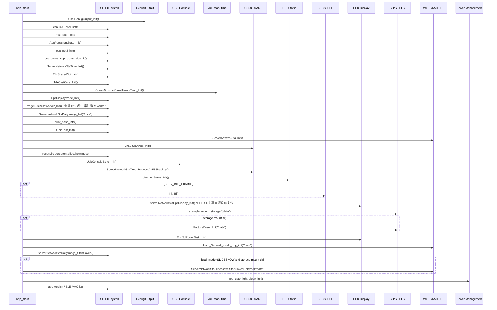
```mermaid
sequenceDiagram
    participant APP as app_main
    participant SYS as ESP-IDF system
    participant DBG as Debug Output
    participant USB as USB Console
    participant WORK as WiFi work time
    participant CH583 as CH583 UART
    participant LED as LED Status
    participant BLE as ESP32 BLE
    participant EPD as EPD Display
    participant SD as SD/SPIFFS
    participant STA as WiFi STA/HTTP
    participant PM as Power Management
    APP->>DBG: UserDebugOutput_Init()
    APP->>SYS: esp_log_level_set()
    APP->>SYS: nvs_flash_init()
    APP->>SYS: AppPersistentState_Init()
    APP->>SYS: esp_netif_init()
    APP->>SYS: esp_event_loop_create_default()
    APP->>SYS: ServerNetworkStaTime_Init()
    APP->>SYS: TdxSharedSpi_Init()
    APP->>SYS: TdxCastCore_Init()
    APP->>WORK: ServerNetworkStaWifiWorkTime_Init()
    APP->>SYS: EpdDisplayMode_Init()
    APP->>SYS: ImageBusinessWorker_Init() / 创建12KB统一常驻静态worker
    APP->>SYS: ServerNetworkStaDailyImage_Init("/data")
    APP->>SYS: print_base_info()
    APP->>SYS: GpioTest_Init()
    APP->>STA: ServerNetworkSta_Init()
    APP->>CH583: Ch583UartApp_Init()
    APP->>SYS: reconcile persistent slideshow mode
    APP->>USB: UsbConsoleEcho_Init()
    APP->>CH583: ServerNetworkStaTime_RequestCh583Backup()
    APP->>LED: UserLedStatus_Init()
    opt USER_BLE_ENABLE
        APP->>BLE: Init_Bl()
    end
    APP->>EPD: ServerNetworkStaEpdDisplay_Init() / EPD-SD共享电源启动复位
    APP->>SD: example_mount_storage("/data")
    opt storage mount ok
        APP->>SD: FactoryReset_Init("/data")
    end
    APP->>EPD: EpdSdPowerTest_Init()
    APP->>STA: User_Network_mode_app_init("/data")
    APP->>SYS: ServerNetworkStaDailyImage_StartSaved()
    opt epd_mode=SLIDESHOW and storage mount ok
        APP->>STA: ServerNetworkStaSlideshow_StartSavedDelayed("/data")
    end
    APP->>PM: app_auto_light_sleep_init()
    APP->>SYS: app version / BLE MAC log
```


相关目录：

```text
main/
main/ch583_uart/
main/led_status/
main/epd_display/
main/server_network_sta/
main/usb_console_echo/
```

树状时序：

```text
main/main.c
└─ app_main()
   ├─ UserDebugOutput_Init()
   ├─ esp_log_level_set()
   ├─ nvs_flash_init()
   ├─ esp_netif_init()
   ├─ esp_event_loop_create_default()
   ├─ ServerNetworkStaTime_Init()
   │  └─ server_network_sta/time/server_network_sta_time.c
   │     ├─ setenv("TZ","CST-8") + tzset()
   │     ├─ 仅当 RTC / 系统时间无效时 settimeofday(default)
   │     ├─ esp_netif_sntp_init(start=false)
   │     └─ IP_EVENT_STA_GOT_IP 后 esp_netif_sntp_start()
   ├─ TdxSharedSpi_Init()
   │  └─ tdx_shared_spi.c 创建 SD/EPD 共用 SPI 递归 mutex
   ├─ TdxCastCore_Init()
   ├─ ServerNetworkStaWifiWorkTime_Init()
   │  └─ server_network_sta/wifi_work_time/server_network_sta_wifi_work_time.c
   │     └─ work_state_task()
   ├─ EpdDisplayMode_Init()
   ├─ ImageBusinessWorker_Init()
   │  └─ 创建12KB统一静态worker，串行执行DAILY、SLIDESHOW、LOCAL_IMAGE、CAST和CAST2PIC
   ├─ ServerNetworkStaDailyImage_Init("/data")
   │  └─ 初始化daily配置mutex和基础状态，不再创建独立任务
   ├─ print_base_info()
   │  └─ 打印短 boot 摘要：reset / flash / RAM / PSRAM / NVS / work state
   ├─ GpioTest_Init()
   ├─ ServerNetworkSta_Init()
   │  ├─ 创建 wifi_manager Task / Queue
   │  ├─ 创建 status 与同步请求 mutex
   │  └─ 所有 WiFi 控制命令由 manager 串行执行
   ├─ Ch583UartApp_Init()
   │  └─ ch583_uart/ch583_uart_app.c
   │     ├─ User_UartEventTask()
   │     ├─ User_UartReceiveTask()
   │     └─ 先启动 CH583 UART，供 C5 GPIO/LED 状态使用
   ├─ reconcile_persistent_slideshow_mode()
   │  └─ CH583 UART 就绪后协调 slide_cfg、slide_ctl 与 epd_mode，避免模式通知早于协议初始化
   ├─ UsbConsoleEcho_Init()
   │  └─ usb_console_echo/usb_console_echo.c
   │     ├─ UsbConsoleEcho_Task()
   │     ├─ 延迟 USB_CONSOLE_START_DELAY_MS 后开始接收 HTTP-like 请求
   │     └─ 存储相关路由在 storage ready 前由 router 返回 1012
   ├─ ServerNetworkStaTime_RequestCh583Backup()
   ├─ UserLedStatus_Init()
   │  └─ led_status/led_status.c
   │     └─ UserLedStatus_Task()
   ├─ Init_Bl()
   │  └─ 仅 USER_BLE_ENABLE=1 时编译执行
   ├─ ServerNetworkStaEpdDisplay_Init()
   │  └─ epd_display/epd_display_app.cpp
   │     └─ ServerNetworkStaEpdDisplay_Task()
   ├─ example_mount_storage("/data")
   │  └─ mount.c
   ├─ storage_ret == ESP_OK
   │  └─ FactoryReset_Init("/data")
   ├─ EpdSdPowerTest_Init()
   ├─ User_Network_mode_app_init("/data")
   │  └─ server_network_sta/server_network_sta.c 启动 STA / HTTP
   │     └─ CH583/BLE 的 wifi_wakeup 若提前取得 1307、但 manager 仍处于连接或重试状态，通知 task 只观察现有状态并暂缓 10 秒；期间 READY 则返回 wifi_info_result，超时仍按原 1307 返回
   │        ├─ wifi_wakeup 尚未完成时收到普通 wifi，BLE层先原子预留单槽 pending，再保存配置并发布READY；worker在保存完成前不退出，最新配置覆盖旧 pending，不返回 BUSY
   │        └─ 冷启动自动联网及BLE/CH583 WiFi请求使用独立绝对关机guard，最长45秒；冷启动遇到已有有效guard时只复用原deadline、不刷新，worker路径在READY、明确终止或到期时解除，manager的连接和重试逻辑不变
   └─ 当前开发阶段启用 `SERVER_NETWORK_STA_LOG_PASSWORD_PLAINTEXT=1`，读取有效WiFi凭据时打印SSID和明文password；正式发布前必须改为0
   ├─ ServerNetworkStaDailyImage_StartSaved()
   │  └─ 仅 epd_mode=DAILY 且 daily_cfg 合法时启动保存任务
   ├─ epd_mode == SLIDESHOW && storage_ret == ESP_OK
   │  └─ ServerNetworkStaSlideshow_StartSavedDelayed("/data")
   │     └─ server_network_sta/slideshow/server_network_sta_slideshow.c
   ├─ app_auto_light_sleep_init()
   │  └─ 网络、存储、轮播启动后再配置自动 light sleep
   ├─ usb_console_ansi_color_test()
   │  └─ USER_USB_CONSOLE_ANSI_COLOR_TEST_ENABLE=0，默认不打印
   ├─ esp_app_get_description()
   │  └─ 打印 app version
   └─ get_ble_mac_no_colon()
      └─ 打印 BLE MAC 来源和值
```

启动日志原则：

```text
错误或有问题使用 ESP_LOGE。
需要注意但可继续运行使用 ESP_LOGW。
普通关键节点使用 ESP_LOGI，日志内容保持短句。
可有可无的启动打印默认删除或用宏关闭，例如目录逐项列表、上传循环进度、演示色彩输出。
```

auto light sleep 接收链路注意事项：

```text
当前默认：
#define TDX_AUTO_LIGHT_SLEEP_ENABLE 0
CPU 运行策略固定 80 MHz / 80 MHz，light_sleep_enable=false。

原因：
CH583 UART1、USB Serial/JTAG、WiFi HTTP 都属于外部异步输入链路。
如果 ESP32-C5 在外部输入到达前进入 auto light sleep，唤醒阶段可能造成首包/首字节/首段数据不稳定。
CH583 UART1 已验证：短帧低频发送时，开启 auto light sleep 会导致 @# 帧头丢失；关闭 TDX_AUTO_LIGHT_SLEEP_ENABLE 后问题消失。
USB Serial/JTAG 和 WiFi HTTP 虽然机制不同，但同样可能受 auto light sleep 的唤醒延迟、USB FIFO/主机超时、WiFi PS/HTTP socket 超时影响。
因此开发阶段和需要可靠收包时，默认保持 TDX_AUTO_LIGHT_SLEEP_ENABLE=0。
EPD 显示期间会临时把 WiFi PS 切到 WIFI_PS_MAX_MODEM，以降低 EPD 刷屏和 WiFi 同时工作时的电流峰值；EPD 完成后恢复显示前的 WiFi PS。
```

---


存 / 取信息（含条件限制）：

```text
存：
- nvs_flash_init() 初始化 NVS；无可用页或版本不兼容时擦除后重试。
- 后续模块在启动中可能写入默认值：工作时长、EPD 类型、CH583 BLE MAC、轮播配置等。

取：
- EpdType_LoadSavedOrDefault() 读取已保存屏幕类型。
- example_mount_storage("/data") 挂载并读取 SD/SPIFFS 状态。
- User_Network_mode_app_init("/data") 读取已保存 WiFi 配置。
- ServerNetworkStaSlideshow_StartSavedDelayed("/data") 只用于开机自动恢复轮播：先等待 `TDX_SLIDESHOW_STARTUP_DELAY_MS=10000` 毫秒，延迟结束后若 EPD task 未完成则继续推迟；EPD 空闲后重新读取已保存轮播配置和控制状态。
```

[⬆ 返回目录](#toc) | [↩ 返回当前目录](#sec-01)

---

## 2. 永久常驻统一图片业务任务 <span id="sec-02-image-business-worker"></span>

`image_business_worker` 是每日一图、轮播、Local Image Browsing、cast和cast2pic共同依赖的核心业务任务。它在每次开机早期创建一次，使用固定静态资源，创建后永久常驻且不删除。每日一图、轮播主runtime、轮播开机启动延迟、本地图片浏览和投屏后台显示/保存不得再各自创建独立worker；所有owner的工作统一提交给该任务串行执行，任何时刻最多只有一个图片业务owner正在运行。

该任务统一DAILY、SLIDESHOW、LOCAL_IMAGE、网络CAST/CAST2PIC以及低优先级USB投屏的业务调度，不替代公共EPD显示任务、HTTP服务、USB接收任务或WiFi管理任务。network upload不作为owner排队；它使用公共UploadGate准入，不等待正在进行的业务完成，并在HTTP当前上下文保存。原12KB `dataup_async_worker`、8KB `cast_save` 和8KB `UsbConsoleWorker` 已删除。已经提交给EPD硬件的刷新不由统一任务强制中断。

### 2.1 定位、范围与重要规则 <span id="sec-02-1"></span>

```text
image_business_worker（永久常驻、固定12KB静态栈）
├─ owner=DAILY
│  └─ daily_run_command()
├─ owner=SLIDESHOW
│  ├─ slideshow_run_command()          轮播主runtime
│  └─ slideshow_startup_delay_run()   开机轮播启动延迟
├─ owner=LOCAL_IMAGE
│  └─ local_image_run_command()        PB2本地图片浏览
├─ owner=CAST / CAST2PIC
│  └─ 网络投屏显示、同步SD保存和清理；网络优先
├─ owner=USB_CAST / USB_CAST2PIC
│  └─ USB投屏后台业务；pending时允许被网络投屏替换
├─ owner=FACTORY_RESET
│  └─ 恢复出厂清理、NVS复位、欢迎图待显示标志和白屏显示；最高优先级且不可被普通图片业务覆盖
└─ idle
   └─ 没有业务命令时阻塞等待task notification，不轮询、不重复打印
```

必须保持的功能规则：

- DAILY、SLIDESHOW、轮播启动延迟、LOCAL_IMAGE、cast/cast2pic后台业务以及Factory Reset执行流程只能使用这一个统一任务，不得恢复旧daily queue、旧7KB daily任务、旧6KB轮播任务、6KB动态启动延迟任务、旧8KB Local任务、旧8KB cast保存任务或旧8KB USB worker。Factory Reset原5KB任务暂时保留，但只负责GPIO28/PB1检测和提交，不执行文件、NVS或EPD业务。
- 所有图片业务owner互斥。同一时间只能运行一个owner；新的模式请求用generation和stop使旧owner失效，并原子安装更新pending命令，不在请求入口等待旧owner退出。已经成为current的投屏事务不强制中断，必须完成显示、保存、状态清理和资源释放。
- 统一任务永久常驻只是保留任务栈和控制状态，不代表开机一定执行图片业务。`NORMAL`、`LOCAL_IMAGE_BROWSING`等模式下没有有效命令时，任务保持阻塞空闲。
- 统一任务不能承载无关的永久循环、HTTP服务、WiFi管理或EPD底层任务，避免长业务相互阻塞并扩大核心任务风险范围。
- callback执行结束或被取消后必须返回统一循环；单次业务失败不得删除或停止统一任务。

### 2.2 启动、常驻与静态内存 <span id="sec-02-2"></span>

启动顺序：

```text
app_main()
├─ EpdDisplayMode_Init()
├─ ImageBusinessWorker_Init()
│  ├─ 创建静态state mutex
│  ├─ 使用静态TCB和固定12KB内部RAM栈创建image_worker
│  └─ worker永久循环；空闲时阻塞等待notification
├─ ServerNetworkStaDailyImage_Init("/data")
├─ 初始化存储、网络、HTTP、SNTP等模块
├─ LocalImageBrowsing_Init("/data")
│  └─ 只读取状态和排放启动PB2 FIFO，不创建任务或FreeRTOS queue
├─ FactoryReset_Init("/data")
│  └─ 保留原5KB检测任务和300ms/5秒判定；正式执行提交给image_worker
├─ ServerNetworkStaDailyImage_StartSaved()
│  └─ 仅mode=DAILY且配置有效时提交DAILY命令
└─ ServerNetworkStaSlideshow_StartSavedDelayed("/data")
   └─ 仅mode=SLIDESHOW且存储可用时提交SLIDESHOW启动延迟命令
```

`ImageBusinessWorker_Init()` 放在WiFi、HTTP和USB等可选服务之前，并由启动主流程用 `ESP_ERROR_CHECK()` 检查。统一任务是DAILY、SLIDESHOW、LOCAL_IMAGE、CAST、CAST2PIC和Factory Reset执行流程的基础设施；静态任务创建失败时不能继续假装相关功能可用。后续模块可以再次调用Init，但初始化必须保持幂等，不得创建第二个任务。

固定资源如下：

| 资源 | 当前规则 |
|---|---|
| worker任务栈 | `USER_IMAGE_BUSINESS_WORKER_STACK_SIZE=12*1024`，内部RAM静态栈 |
| worker优先级 | `USER_IMAGE_BUSINESS_WORKER_PRIORITY=4` |
| pending命令 | 一个静态命令槽；inline payload上限 `USER_IMAGE_BUSINESS_WORKER_PAYLOAD_SIZE=640` 字节 |
| 控制锁 | 一个静态mutex，保护current owner和pending命令 |
| TCB | 一个静态TCB |
| 生命周期 | 开机创建一次，永久常驻，不调用 `vTaskDelete()` |

当前配置栈为12288字节，另有静态TCB、664字节单pending命令槽、静态mutex和少量状态变量。callback中的局部命令副本计入12KB任务栈，不是第二份独立任务栈。除已经删除的Local原8KB任务外，本次删除 `cast_save` 8KB任务/queue/semaphore和 `UsbConsoleWorker` 8KB任务/queue；统一栈由9KB增加到12KB后，预计仍净减少约13KB以上永久内部RAM。Factory Reset原5KB任务在本阶段仍保留原栈大小，仅卸下清理和显示执行职责，因此不把它计入本阶段内存节省。实际数值和12KB是否足够必须以设备启动资源日志及所有owner的栈水位为准。

### 2.3 命令模型与串行规则 <span id="sec-02-3"></span>

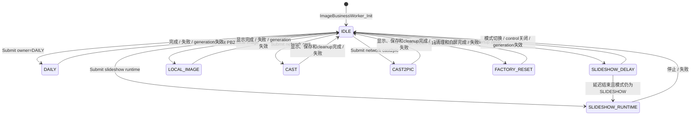
```mermaid
stateDiagram-v2
    [*] --> IDLE: ImageBusinessWorker_Init
    IDLE --> DAILY: Submit owner=DAILY
    IDLE --> SLIDESHOW_DELAY: Submit startup delay
    IDLE --> SLIDESHOW_RUNTIME: Submit slideshow runtime
    IDLE --> LOCAL_IMAGE: Submit PB2 local image
    IDLE --> CAST: Submit network cast
    IDLE --> CAST2PIC: Submit network cast2pic
    IDLE --> FACTORY_RESET: GPIO28/PB1确认后提交
    DAILY --> IDLE: 完成 / 失败 / generation失效
    SLIDESHOW_DELAY --> SLIDESHOW_RUNTIME: 延迟结束且模式仍为SLIDESHOW
    SLIDESHOW_DELAY --> IDLE: 模式切换 / control关闭 / generation失效
    SLIDESHOW_RUNTIME --> IDLE: 停止 / 失败
    LOCAL_IMAGE --> IDLE: 显示完成 / 失败 / generation失效
    CAST --> IDLE: 显示、保存和cleanup完成 / 失败
    CAST2PIC --> IDLE: 显示、保存和cleanup完成 / 失败
    FACTORY_RESET --> IDLE: 清理和白屏完成 / 失败
```

统一任务维持“一个current命令 + 一个pending命令槽”，不是多项FreeRTOS queue：

- worker从pending槽复制命令后，把owner记为current并执行callback。
- current运行期间允许暂存一个后续命令，因此SLIDESHOW退出后可以直接接续DAILY，反向切换同理。
- pending槽已有命令时，第二个未协调的提交返回 `ESP_ERR_INVALID_STATE`，并打印一次 `submit blocked`。调用方不能覆盖不同owner的新命令。
- 模式切换使用 `ImageBusinessWorker_SubmitReplacingPending()` 在同一state mutex内取消允许替换的旧pending并安装新命令，禁止分开的Cancel/Submit留下竞态窗口。
- DAILY重新提交前只取消旧的pending DAILY；SLIDESHOW启动不能删除同时刚提交、且代表更新模式的DAILY命令。
- LOCAL_IMAGE可替换旧pending DAILY/SLIDESHOW；新的DAILY/SLIDESHOW可替换pending LOCAL_IMAGE；第二个LOCAL_IMAGE不能覆盖第一个，继续由EPD reservation和单pending规则拒绝。
- network CAST/CAST2PIC可替换pending DAILY、SLIDESHOW、LOCAL_IMAGE和低优先级USB投屏；已有network CAST/CAST2PIC为current或pending时拒绝第二个网络投屏，不静默覆盖请求。
- FACTORY_RESET可替换所有尚未开始的普通图片owner；成为pending或current后，其他owner提交必须返回 `ESP_ERR_INVALID_STATE`，不得覆盖恢复出厂。检测任务不等待current owner，使用现有stop/generation使DAILY、SLIDESHOW和LOCAL_IMAGE安全退出；已经开始的EPD或投屏事务不强制中断。
- USB_CAST/USB_CAST2PIC只有在不存在任何投屏owner时才能提交；普通USB命令在USB接收任务当前上下文执行，不再创建独立USB worker。网络投屏替换pending USB_CAST时必须返回一次 `network_priority` 失败并只释放一次USB body。
- payload由提交函数按值复制到固定inline区域，禁止提交超过640字节的结构；DAILY、轮播runtime、启动延迟和LOCAL_IMAGE payload必须保留 `_Static_assert` 上限检查。
- task notification只用于唤醒统一任务和实现可中断等待；新增业务不能擅自占用同一个任务notification做无关协议，否则会破坏提交和停止语义。

### 2.4 DAILY / SLIDESHOW 切换规则 <span id="sec-02-4"></span>

| 场景 | 必须执行的规则 |
|---|---|
| 开机为DAILY | 统一任务已常驻；网络启动完成后读取daily配置并提交DAILY；配置无效时恢复NORMAL |
| 开机为SLIDESHOW | daily不提交；存储可用后把10秒启动延迟作为SLIDESHOW命令提交给统一任务 |
| DAILY切换SLIDESHOW | 保存轮播状态并写SLIDESHOW模式；使旧daily generation失效；等待DAILY退出后提交轮播runtime |
| SLIDESHOW切换DAILY | 关闭并保存轮播control，写NORMAL后再写DAILY；使旧slideshow generation失效；当前EPD安全结束、轮播退出后执行pending DAILY |
| 启动延迟期间切换模式 | 增加slideshow generation并唤醒统一任务；旧延迟立即返回，10秒到点后不得重新启动旧轮播 |
| 重复DAILY请求 | 新generation覆盖旧generation；正在下载的旧请求在检查点取消，释放资源后执行最新pending DAILY |
| DAILY或SLIDESHOW切换LOCAL_IMAGE | PB2先预约IDLE EPD，原子提交LOCAL_IMAGE，再非阻塞使当前DAILY/SLIDESHOW失效；旧owner返回后自动执行LOCAL_IMAGE |
| LOCAL_IMAGE切换DAILY或SLIDESHOW | 增加local generation并取消pending LOCAL_IMAGE；已经开始的EPD不强制中断，结束后自动执行更新owner |
| LOCAL_IMAGE切换cast/cast2pic | cast入口非阻塞取消pending LOCAL_IMAGE并释放reservation；已经开始的EPD仍按原公共EPD规则处理 |
| NORMAL或其他模式 | 停止不再适用的DAILY/SLIDESHOW；统一任务本身不删除，只回到IDLE |

模式值和generation必须共同检查。仅检查 `epd_mode` 不足以区分相同模式下的新旧请求；仅检查generation也不能允许旧业务在模式已经切换后继续提交下一工作。轮播启动延迟转为正式runtime前必须再次检查SLIDESHOW模式和generation，禁止旧启动命令覆盖更新的DAILY或cast请求。

### 2.5 取消、等待与资源所有权 <span id="sec-02-5"></span>

- `ImageBusinessWorker_CancelPending(owner)` 只取消指定owner的pending命令，不强制终止current命令，也不能误删另一owner的更新请求。
- `SubmitReplacingPending()`只替换调用方明确授权的owner；被替换命令的cancel callback在新命令可运行前完成资源释放。cancel callback必须短小、不得调用统一worker API；当前只允许释放runtime或EPD reservation，避免状态mutex递归和锁顺序风险。
- `ImageBusinessWorker_Wake()` 唤醒正在做可中断等待的统一任务。启动延迟收到模式切换后应立即退出；轮播和DAILY长流程在各自安全检查点读取stop/mode/generation。
- `ImageBusinessWorker_WaitOwnerIdle()` 同时检查current和pending，只保留给原有DAILY/SLIDESHOW重启保护；LOCAL_IMAGE相关切换不得调用它。统一worker callback内部禁止等待自己变为idle，避免自死锁。
- 已经开始的EPD刷新不强制中断。停止请求先阻止旧业务继续下一张或下一阶段，当前EPD结束后释放业务资源并返回统一任务。
- DAILY job和轮播启动延迟payload按值保存在pending命令中，不需要独立heap节点。
- LOCAL_IMAGE request也按值保存；pending取消、提交失败或run callback结束时必须且只能释放一次EPD reservation。
- CAST/CAST2PIC的图片数据不复制到640字节payload；payload只保存heap job指针。network body在提交成功后转移给统一任务，提交失败由入口释放，pending取消由cancel callback释放，current结束由run cleanup释放，三条路径互斥。
- 投屏请求从提交成功到run/cancel终点维持图片传输引用计数；关机检查把非零引用计入现有image-save busy保护，禁止HTTP已经返回但pending尚未启动时提前断电。
- `cast_save` queue和完成semaphore已删除；`TdxImageTransfer_ProcessItems()` 保持原保存代码，在当前执行上下文内同步取得Shared SPI并完成临时文件写入、校验和rename。network upload同样调用该同步保存代码，但不再创建或使用 `dataup_async_worker`。
- 轮播runtime优先从PSRAM分配；pending阶段取消由cancel callback释放，进入run callback后由runtime退出路径释放。两条路径互斥，必须保证只释放一次。
- DAILY下载缓冲、TLS资源、轮播预加载缓冲仍由各业务原有路径申请和释放，不因合并任务改变所有权。
- worker完成命令后清除current owner并继续永久循环；不得因为callback返回 `ESP_ERR_INVALID_STATE`、网络失败或正常停止而删除任务。
- Factory Reset提交失败必须把RAM状态从RUNNING恢复为PENDING并保留guard，由原300ms检测任务重试；只打印首次延迟警告，禁止丢请求、永久RUNNING或每300ms刷屏。

### 2.6 关键日志、异常和修改约束 <span id="sec-02-6"></span>

正常情况下只保留以下关键日志：

```text
image_worker: static resources ... stack=12288 tcb=... command=... mutex=...
image_worker: started stack=12288 priority=4
image_worker: job start owner=DAILY|SLIDESHOW|LOCAL_IMAGE|CAST|CAST2PIC|USB_CAST|USB_CAST2PIC|FACTORY_RESET generation=N
image_worker: job done owner=... generation=N ret=... min_free=... peak_used=... configured=12288
```

异常或切换时按需打印：

- pending被取消：打印owner和generation。
- pending槽冲突：打印提交owner、pending owner和current owner。
- 过期命令：业务模块打印generation、当前模式和取消原因。
- 正常空闲不周期打印；等待循环不每秒打印；统一任务不得增加大量调试日志。

修改统一worker、DAILY、SLIDESHOW、启动延迟或Factory Reset执行载体时必须同时检查：

1. 是否仍只创建一个统一静态任务，daily、slideshow、local_image_browsing、cast和cast2pic不得新增独立 `xTaskCreate()` / `xTaskCreateStatic()`；不得恢复 `cast_save` 或 `UsbConsoleWorker`。
2. callback是否能在模式切换和generation失效后于安全检查点退出。
3. 是否可能在统一worker内部调用 `WaitOwnerIdle()` 等待自己，造成死锁。
4. pending取消、提交失败、过期命令和正常完成是否各自只释放一次heap资源。
5. payload是否不超过640字节，并保持编译期 `_Static_assert`。
6. 完整DAILY、SLIDESHOW、LOCAL_IMAGE、CAST、CAST2PIC、USB投屏和FACTORY_RESET路径的 `min_free` 是否不少于2048字节；低于警戒线时优先增加统一栈，不得为了节省内存冒栈溢出风险。
7. 是否保持“当前EPD不强制中断、旧业务不继续下一阶段、更新模式请求优先”的状态规则。
8. 若修改代码，必须同步本章、7.8轮播章节、7.14恢复出厂章节、7.15每日一图章节和 `README_Test.md` 对应测试。

相关源码：

```text
main/image_business_worker/image_business_worker.c/.h
main/server_network_sta/daily_image/server_network_sta_daily_image.c
main/server_network_sta/slideshow/server_network_sta_slideshow.c
main/local_image_browsing/local_image_browsing.c
main/server_network_sta/cast/server_network_sta_cast.c
main/server_network_sta/cast2pic/server_network_sta_cast2pic.c
main/cast_core/cast_core.c
main/factory_reset/factory_reset.c
main/usb_console_echo/cast/usb_console_cast_worker.c
main/usb_console_echo/cast2pic/usb_console_cast2pic.c
main/main.c
main/tdx_cfg.h
```

[⬆ 返回目录](#toc) | [↩ 返回当前目录](#sec-02-image-business-worker)

---

## 3. NVS 配置读写 <span id="sec-03"></span>

Mermaid 时序图：

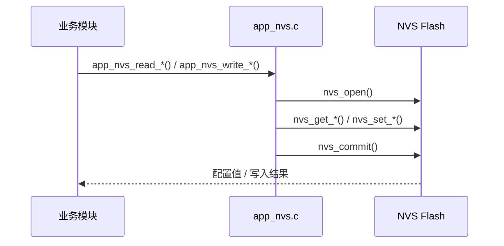
```mermaid
sequenceDiagram
    participant MOD as 业务模块
    participant NVSAPI as app_nvs.c
    participant FLASH as NVS Flash
    MOD->>NVSAPI: app_nvs_read_*() / app_nvs_write_*()
    NVSAPI->>FLASH: nvs_open()
    NVSAPI->>FLASH: nvs_get_*() / nvs_set_*()
    NVSAPI->>FLASH: nvs_commit()
    FLASH-->>MOD: 配置值 / 写入结果
```


树状时序：

```text
业务模块
├─ app_nvs_read_u8()
├─ app_nvs_write_u8()
├─ app_nvs_read_str()
└─ app_nvs_write_str()

调用来源
├─ epd_display/epd_type.cpp
│  ├─ EpdType_LoadSavedOrDefault()
│  └─ EpdType_SetAndSave()
├─ epd_display/epd_display_mode.c
│  ├─ EpdDisplayMode_Init()
│  ├─ EpdDisplayMode_Set()
│  └─ EpdDisplayMode_SetBySlideshowSwitch()
├─ server_network_sta/wifi_work_time/server_network_sta_wifi_work_time.c
│  ├─ load_work_time_vars_from_app_nvs()
│  └─ save_work_time_vars_to_app_nvs()
├─ ch583_uart/ch583_wifi_uart_protocol.c
│  └─ ch583_wifi_handle_device_info()
└─ server_network_sta/slideshow/*
   └─ 保存 slideshow 状态和 last file
```

---


存 / 取信息（含条件限制）：

```text
存：
- app_nvs_write_u8(key, value)：写入 namespace="PhotoPainter" 的 u8。
  条件：key != NULL；nvs_open("PhotoPainter", NVS_READWRITE) 成功；nvs_set_u8() 成功后才 nvs_commit()。
- app_nvs_write_str(key, value)：写入 namespace="PhotoPainter" 的字符串。
  条件：key != NULL 且 value != NULL；nvs_open 成功；nvs_set_str() 成功后才 nvs_commit()。
- app_nvs_read_u8(key, out, default)：如果 key 不存在，会把 default 写入 NVS 并 commit。
  条件：key != NULL 且 out_value != NULL。

取：
- app_nvs_read_u8()：读取 u8；key 不存在时返回默认值并补写默认值。
- app_nvs_read_str()：读取字符串；条件为 key != NULL、value != NULL、value_size > 0。
- app_nvs_read_str() 使用 NVS_READONLY；打开失败或读取失败时，如 default_value 非 NULL，则把 default_value 拷到输出缓冲区。

主要调用：
- EPD 类型保存 / 读取。
- EPD 显示模式保存 / 读取：PhotoPainter:epd_mode，u8，0=NORMAL，1=SLIDESHOW，2=DAILY，3=LOCAL_IMAGE_BROWSING。
- CH583 BLE MAC 保存 / 读取。
- WiFi 工作时间字符串兼容保存 / 读取。
- 独立轮播控制写入 NVS `slide_ctl` 后同步模式：enabled=true 写 SLIDESHOW，enabled=false 写 NORMAL。每日一图启用会先停止轮播，再显式写 DAILY；cast/cast2pic 写 NORMAL。

日志：
- 成功读写默认不打印，避免启动和轮播状态读写刷屏。
- `USER_NVS_VERBOSE_LOG_ENABLE=1` 时打印成功 read/write 的 key、value/size、ret。
- `nvs_open`、读取异常、写入/commit 失败保留日志；可继续使用默认值的读取问题用 `ESP_LOGW`，写入失败用 `ESP_LOGE`。
```

[⬆ 返回目录](#toc) | [↩ 返回当前目录](#sec-03)

---

## 4. 存储挂载：SD / SPIFFS <span id="sec-04"></span>

Mermaid 流程图：

```mermaid
flowchart TD
    P[EPD-SD shared rail startup reset] --> A[example_mount_storage /data]
    A --> B{CONFIG_EXAMPLE_MOUNT_SD_CARD}
    B -- false --> C[mount_spiffs_storage]
    B -- true --> D{CONFIG_EXAMPLE_USE_SDMMC_HOST}
    D -- true --> E[esp_vfs_fat_sdmmc_mount]
    D -- false --> F[SDSPI_HOST_DEFAULT]
    F --> G[spi_bus_initialize]
    G --> H[esp_vfs_fat_sdspi_mount]
    H -- failed <= 3 --> R[save sd_fail_count and esp_restart]
    H -- failed > 3 --> C
    C --> I[ensure_default_storage_dirs]
    H -- ok --> I
    I --> J[/data/bin_img + /data/jpg_img]
```


树状时序：

```text
main/main.c
└─ app_main()
   ├─ ServerNetworkStaEpdDisplay_Init()
   │  ├─ 释放共享SPI并将相关IO设为高阻
   │  ├─ GPIO4 LOW保持2000ms
   │  ├─ GPIO4 HIGH后等待100ms
   │  └─ 恢复安全CS电平和共享SPI
   └─ example_mount_storage("/data")
      └─ mount.c
         ├─ CONFIG_EXAMPLE_MOUNT_SD_CARD disabled
         │  └─ mount_spiffs_storage()
         └─ CONFIG_EXAMPLE_MOUNT_SD_CARD enabled
            ├─ CONFIG_EXAMPLE_USE_SDMMC_HOST
            │  └─ esp_vfs_fat_sdmmc_mount()
            └─ SDSPI path for C5
               ├─ SDSPI_HOST_DEFAULT()
               ├─ host.slot = USER_SD_SPI_HOST
               ├─ spi_bus_initialize()
               │  └─ ESP_ERR_INVALID_STATE 时复用 EPD 已初始化的 SPI bus
               ├─ esp_vfs_fat_sdspi_mount()
               ├─ SD 挂载失败
               │  ├─ sd_fail_count += 1 并保存到 NVS
               │  ├─ fail_count <= 3 时延迟 200ms 后 esp_restart()
               │  └─ fail_count > 3 时清零计数并 mount_spiffs_storage()
               ├─ SD 挂载成功
               │  └─ 如 sd_fail_count 非 0，则清零计数
               ├─ ensure_default_storage_dirs()
               │  ├─ /data/bin_img
               │  └─ /data/jpg_img
               └─ example_print_storage_info()
```

辅助函数：

```text
mount.c
├─ ensure_storage_dir()
├─ ensure_default_storage_dirs()
├─ mount_spiffs_storage()
├─ storage_read_sd_fail_count()
├─ storage_write_sd_fail_count()
├─ handle_sd_mount_failure()
├─ example_storage_get_type()
├─ example_storage_is_sd_card()
├─ example_storage_supports_directories()
├─ example_storage_get_free_bytes()
└─ example_print_storage_info()
```

---


存 / 取信息（含条件限制）：

```text
存：
- SD 卡模式：挂载 /data 后创建默认目录：bin_img、jpg_img、cast_img 等。
- SD 挂载失败计数：`PhotoPainter:sd_fail_count`，默认 0；SD 挂载失败时加 1 并保存，SD 挂载成功时清零。
- SPIFFS fallback：只有 SD 连续失败计数超过 3 后才挂载 label="assets"，format_if_mount_failed=true，并清零 `sd_fail_count`。

取：
- example_storage_get_free_bytes() 读取 SD/FATFS 或 SPIFFS 剩余容量。
- example_print_storage_info() 读取挂载状态、容量、目录树、txt 文件内容。
- list_storage_tree() 扫描并打印 /data 下文件。
- SD 挂载参数：上电等待 1000ms；单次启动内最多重试 3 次；重试间隔 300ms。失败计数未超过阈值时不进入 SPIFFS，而是软件复位后重试 SD。
- GPIO4 是 EPD 与外部 SD 卡公共电源开关；`ServerNetworkStaEpdDisplay_Init()` 在首次 SD 挂载前复用现有IO隔离接口执行一次启动电源复位：释放共享SPI、相关IO高阻、GPIO4拉低2000ms、重新拉高并稳定100ms，再恢复安全CS电平和共享SPI。这样USB或软件复位后遗留的SD状态不会进入首次挂载。EPD refresh/sleep 本身不得直接拉低 GPIO4；运行期仍只有独立 EPD/SD 电源测试在确认全部安全条件后可以临时拉低。CH583 整机关机提交路径仍不调用 `Set_Power(0)`。

日志：
- 保留关键节点：SD mount start、SDSPI pins、bus reuse、SD ready、SPIFFS fallback、storage ready、mount failed。
- 失败或不可恢复问题使用 `ESP_LOGE`；可继续 fallback 或复用 bus 的情况使用 `ESP_LOGW`；普通挂载成功节点使用 `ESP_LOGI`。
- 启动目录逐项列表由 `USER_STORAGE_LIST_ON_STARTUP_ENABLE` 控制，默认关闭。
- HTTP 目录列表逐项文件日志由 `USER_HTTP_FILE_LIST_LOG_ENABLE` 控制，默认关闭。
```

[⬆ 返回目录](#toc) | [↩ 返回当前目录](#sec-04)

---

## 7. 网络HTTP功能汇总 <span id="sec-07"></span>

本章把原来的 `cast`、`cast2pic`、`upload`、`ota`、`delete`、`saved_images`、`slideshow`、`slideshow_control`、`snapshot`、`ping`、`time`、`wifi_work_time` 等网络 HTTP 功能重新归到一个二级目录下。
入口主要来自 `POST /dataUP`、`POST /ota`、`POST /ota_upload`；`GET /ping` 和 `GET /time` 由 `file_server.c` 的 `GET /* -> download_get_handler()` 优先拦截。

Mermaid 总体分发图：

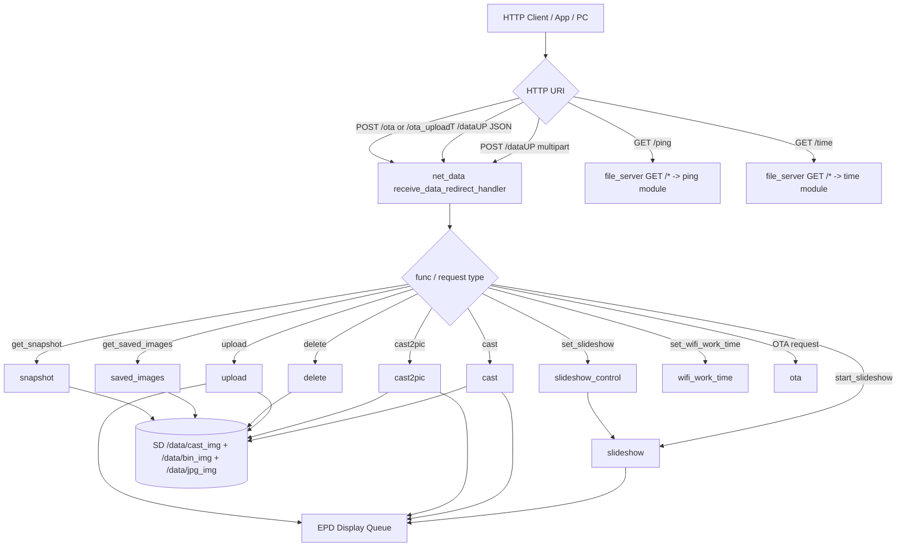
```mermaid
flowchart TD
    A[HTTP Client / App / PC] --> B{HTTP URI}
    B -->|POST /dataUP multipart| C[net_data receive_data_redirect_handler]
    B -->|POST /dataUP JSON| C
    B -->|POST /ota or /ota_upload| C
    B -->|GET /ping| P[file_server GET /* -> ping module]
    B -->|GET /time| T[file_server GET /* -> time module]
    C --> D{func / request type}
    D -->|cast| E[cast]
    D -->|cast2pic| F[cast2pic]
    D -->|upload| G[upload]
    D -->|delete| H[delete]
    D -->|get_saved_images| I[saved_images]
    D -->|get_snapshot| J[snapshot]
    D -->|start_slideshow| K[slideshow]
    D -->|set_slideshow| L[slideshow_control]
    D -->|set_wifi_work_time| M[wifi_work_time]
    D -->|OTA request| N[ota]
    E --> SD[(SD /data/cast_img + /data/bin_img + /data/jpg_img)]
    F --> SD
    G --> SD
    H --> SD
    I --> SD
    J --> SD
    K --> EPD[EPD Display Queue]
    L --> K
    E --> EPD
    F --> EPD
    G --> EPD
```

相关目录：

```text
main/server_network_sta/net_data/
main/server_network_sta/cast/
main/server_network_sta/cast2pic/
main/server_network_sta/delete/
main/server_network_sta/ota/
main/server_network_sta/ping/
main/server_network_sta/saved_images/
main/server_network_sta/slideshow/
main/server_network_sta/slideshow_control/
main/server_network_sta/snapshot/
main/server_network_sta/time/
main/server_network_sta/upload/
main/server_network_sta/wifi_work_time/
```

树状时序总览：

```text
HTTP request
├─ GET /ping
│  └─ ServerNetworkStaPing_ProcessGet()
├─ GET /time
│  └─ ServerNetworkStaTime_ProcessGet()
└─ POST /dataUP / /ota / /ota_upload
   └─ receive_data_redirect_handler()
      ├─ NetworkOtaUpload_IsOtaRequest()
      │  └─ NetworkOtaUpload_ProcessReceivedBody()
      ├─ multipart func=cast
      │  └─ ServerNetworkStaCast_Process()
      ├─ multipart func=cast2pic
      │  └─ ServerNetworkStaCast2Pic_Process()
      ├─ multipart func=upload
      │  └─ ServerNetworkStaUpload_Process()
      └─ small JSON func
         ├─ ServerNetworkStaSavedImages_ProcessJson()
         ├─ ServerNetworkStaSnapshot_ProcessJson()
         ├─ ServerNetworkStaDelete_ProcessJson()
         ├─ ServerNetworkStaSlideshow_ProcessJson()
         ├─ ServerNetworkStaSlideshowControl_ProcessJson()
         └─ ServerNetworkStaWifiWorkTime_ProcessJson()
```

V2 协议资料拆分：

```text
V2 协议中，HTTP 图片与控制协议主要使用：
├─ POST /dataUP + multipart/form-data
│  ├─ cast
│  ├─ upload
│  ├─ cast2pic
│  └─ update（前端预留）
├─ POST /dataUP + JSON
│  ├─ get_saved_images
│  ├─ get_snapshot
│  ├─ start_slideshow
│  ├─ set_slideshow
│  ├─ delete
│  └─ set_wifi_work_time
├─ GET /ping
│  └─ ping_result
└─ GET /time
   └─ time_result
```

---

存 / 取信息（含条件限制）：

```text
存：
- network/USB cast/cast2pic：/data/cast_img/*.bin，/data/cast_img/*.jpg。
- upload / saved_images / slideshow：/data/bin_img/*.bin，/data/jpg_img/*.jpg。
- 状态类：默认 NVS `image_state` namespace 中的 `last_cast`、`slide_cfg`、`slide_ctl` Blob。
- OTA 类：OTA update partition。
- WiFi 工作时间：NVS blob + PhotoPainter 字符串 key。

取：
- 图片列表从 /data/jpg_img 扫描。
- snapshot 读取图片列表和轮播配置。
- ping 读取 CH583 BLE MAC。
- time 读取 RTC / 系统时间和 SNTP 同步状态。
- slideshow 启动时读取保存的轮播配置。
```


### 7.1 cast：投屏业务模块 <span id="sec-07-1"></span>

结果码以 [README_Result_Code.md](README_Result_Code.md) 为准。

功能说明：接收设备投屏数据流，校验主图和缩略图字段，保存到 SD 卡，并在 `show=true` 时下发到电子墨水屏显示。

Mermaid 时序图：

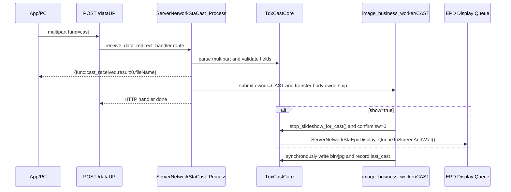
```mermaid
sequenceDiagram
    participant APP as App/PC
    participant DATAUP as POST /dataUP
    participant CAST as ServerNetworkStaCast_Process
    participant CORE as TdxCastCore
    participant WORKER as image_business_worker/CAST
    participant EPD as EPD Display Queue
    APP->>DATAUP: multipart func=cast
    DATAUP->>CAST: receive_data_redirect_handler route
    CAST->>CORE: parse multipart and validate fields
    CAST-->>APP: {func:cast_received,result:0,fileName}
    CAST->>WORKER: submit owner=CAST and transfer body ownership
    CAST-->>DATAUP: HTTP handler done
    alt show=true
        WORKER->>CORE: stop_slideshow_for_cast() and confirm sw=0
        CORE->>EPD: ServerNetworkStaEpdDisplay_QueueToScreenAndWait()
    end
    WORKER->>CORE: synchronously write bin/jpg and record last_cast
```

树状时序：

```text
HTTP multipart /dataUP
└─ receive_data_redirect_handler()
   └─ ServerNetworkStaCast_Process()
      ├─ TdxCastCore_ParseAndValidate()
      │  ├─ UsbConsoleCommon_ExtractBoundary()
      │  ├─ UsbConsoleCommon_MultipartParts()
      │  ├─ UsbConsoleCommon_FileNameIsSafe()
      │  └─ validate bin_size/image_size/save/show
      ├─ send cast_received chunk
      ├─ finish HTTP response
      └─ image_business_worker owner=CAST
         └─ TdxCastCore_ProcessValidatedCastDir()
            ├─ show=true
            │  ├─ stop_slideshow_for_cast() 并确认 sw=0
            │  └─ ServerNetworkStaEpdDisplay_QueueToScreenAndWait()
            └─ save=true（当前统一任务内同步保存）
               ├─ check_save_space()
               ├─ save /data/cast_img/<fileName>.bin
               ├─ save /data/cast_img/<fileName>.jpg
               └─ record default NVS image_state:last_cast
```

说明：network cast 和 USB cast 都复用 `cast_core`，并通过 `TdxCastCore_ProcessValidatedCastDir()` 指定保存到 `/data/cast_img`。EPD显示仍使用已有的 `ServerNetworkStaEpdDisplay` task；原 `CastSaveTask` 已删除，保存改为调用方当前上下文同步执行。network cast 在 `show=true` 时解析和字段校验通过后只返回 `cast_received`，随后结束HTTP handler；EPD显示、bin/jpg保存和NVS last-cast记录由永久统一任务 `owner=CAST` 调用原 `cast_async_process()` 执行，不再返回第二个 `cast_result` JSON。`show=true && save=true` 的显示、保存、状态和cleanup顺序不变。`show=false` 的network cast仍走原同步处理并返回最终结果，不创建额外任务。

V2 协议资料拆分：

```http
POST /dataUP HTTP/1.1
Content-Type: multipart/form-data

func=cast
fileName=26422
bin_size=123456
image_size=23456
save=true
show=true
bin=@26422.bin
image=@26422.jpg
```

字段说明：

```text
func       固定为 cast
fileName   图片主文件名，不带扩展名
bin_size   bin 主图数据大小
image_size jpg 缩略图大小
save       当前必须为 true；save=false 会返回 save_required_for_last_cast
show       是否立即显示
bin        主图 bin 文件
image      缩略图 jpg 文件
```

成功返回：

```text
{"func":"cast_received","result":0,"fileName":"26422"}
```

V2 说明：`cast` 成功后在 NVS `last_cast` 记录最后一次投图文件名；设备启动时不读取或显示该记录。

当前源码注意点：

```text
network cast 当前要求 save=true。
如果 save=false，设备返回 cast_result 失败，error=save_required_for_last_cast。
原因是 cast 成功后需要保存 bin/jpg，并记录 NVS `last_cast`。

停止轮播或 `sw=0` 读回确认失败时，本次 cast 中止，不显示、不保存。

show/save 顺序：
1. show=true 时，先把当前请求中的 bin 投递到 EPD 显示任务并等待完成。
2. save=true 时，再保存 bin/jpg 到 SD。
3. 保存成功后写入默认 NVS `image_state:last_cast`。
```


存 / 取信息（含条件限制）：

```text
存：
- show=true 时 `image_business_worker owner=CAST` 调用 `cast_async_process()`，后台先等待EPD显示完成，再在相同业务上下文同步保存。
- show=true 停止轮播并写入 NVS `slide_ctl.enabled=false` 后，同步写 `PhotoPainter:epd_mode=0`。
- 同步保存函数写入：/data/cast_img/<fileName>.bin。
- 同步保存函数写入：/data/cast_img/<fileName>.jpg。
- 同步保存仍使用 <fileName>.<ext>.tmp 临时文件，写完校验大小后 rename 成正式文件。
- 同步保存写入 last cast 记录，路径仍在 /data/cast_img/ 下。
- 保存和 NVS last-cast 全部成功后，扫描 `/data/cast_img`，删除非本次 `<fileName>` 的旧 `.bin/.jpg`；NVS `last_cast` 保留。

取：
- check_save_space() 通过 example_storage_get_free_bytes() 读取剩余空间。
- 显示时下发已收到的 bin 数据到 EPD 显示任务；后台保存和显示串行执行，网络 HTTP 不再等待最终结果 JSON。
- 启动时不读取 last cast，也不触发 cast 显示。
```

[⬆ 返回目录](#toc) | [↩ 返回当前目录](#sec-07)

---

### 7.2 cast2pic：投屏转图片缓存 / 显示 <span id="sec-07-2"></span>

结果码以 [README_Result_Code.md](README_Result_Code.md) 为准。

失败返回会附带 `error` 字段，内容为源码中的具体错误名，例如 `missing_bin_file`、`storage_not_enough`、`display_request_failed`。

功能说明：以 `V2_相框传图协议.html` 为协议依据，当前 APP 的 `ab` 实现有问题，因此网络和 USB 暂时都只接受 `screen=a/b`。协议规定缺少 `screen` 默认按 `ab`，所以缺少时同样返回 `1617`。每次只接收一组标准无后缀字段。

Mermaid 时序图：

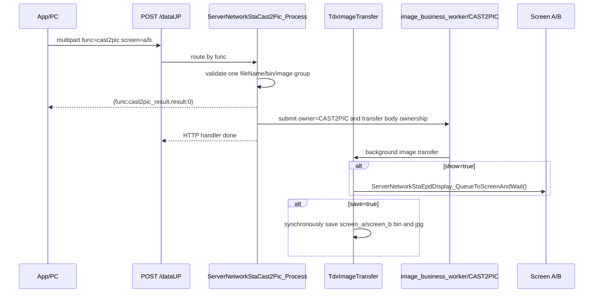
```mermaid
sequenceDiagram
    participant APP as App/PC
    participant DATAUP as POST /dataUP
    participant C2P as ServerNetworkStaCast2Pic_Process
    participant CORE as TdxImageTransfer
    participant WORKER as image_business_worker/CAST2PIC
    participant EPD as Screen A/B
    APP->>DATAUP: multipart func=cast2pic screen=a/b
    DATAUP->>C2P: route by func
    C2P->>C2P: validate one fileName/bin/image group
    C2P-->>APP: {func:cast2pic_result,result:0}
    C2P->>WORKER: submit owner=CAST2PIC and transfer body ownership
    C2P-->>DATAUP: HTTP handler done
    WORKER->>CORE: background image transfer
    alt show=true
        CORE->>EPD: ServerNetworkStaEpdDisplay_QueueToScreenAndWait()
    end
    alt save=true
        CORE->>CORE: synchronously save screen_a/screen_b bin and jpg
    end
```

树状时序：

```text
HTTP multipart /dataUP
└─ receive_data_redirect_handler()
   └─ ServerNetworkStaCast2Pic_Process()
      ├─ extract_boundary()
      ├─ parse_cast2pic_multipart()
      ├─ assign_text_part()
      ├─ assign_image_part()
      ├─ validate_cast2pic_meta()
      ├─ screen_to_epd_number()
      ├─ send_cast2pic_result()
      └─ image_business_worker owner=CAST2PIC
         ├─ build tdx_image_transfer_item_t
         └─ TdxImageTransfer_ProcessItems()
            ├─ show=true
            │  └─ ServerNetworkStaEpdDisplay_QueueToScreenAndWait()
            └─ save=true（当前统一任务内同步保存）
               └─ save /data/cast_img/screen_a/screen_b .bin and .jpg
```

说明：network cast2pic 和 USB cast2pic 校验完整请求后立即返回 `cast2pic_result=0`。`result=0` 只表示接收成功，不表示 EPD 显示或保存成功；后续动作在后台执行，失败只记录日志，不返回第二个结果。`show=false && save=false` 时不提交后台任务。

当前源码协议资料拆分（以 `server_network_sta_cast2pic.c` 为准）：

```http
POST /dataUP HTTP/1.1
Content-Type: multipart/form-data

func=cast2pic
screen=a
save=true
show=true
fileName=26422
bin_size=123456
image_size=23456
bin=@26422.bin
image=@26422.jpg

```

字段说明：

```text
func     固定为 cast2pic
screen   只接受 a 或 b；ab 和缺少 screen 返回 1617
save     是否保存
show     是否立即显示
网络和 USB 都只处理 1 组标准无后缀 fileName/bin/image
```

screen 映射注意：

```text
screen=a -> epd_number=2 -> 保存为 /data/cast_img/screen_b.bin 和 /data/cast_img/screen_b.jpg
screen=b -> epd_number=1 -> 保存为 /data/cast_img/screen_a.bin 和 /data/cast_img/screen_a.jpg

这里不是直观的 a->screen_a、b->screen_b。
源码为了硬件兼容做了反向保存映射，显示投递也按 epd_number 执行。
```

成功返回：

```json
{
  "func": "cast2pic_result",
  "result": 0
}
```


存 / 取信息（含条件限制）：

```text
存：
- 保存当前 1 组图片对应的 .bin 和 .jpg 到 /data/cast_img。
- screen=a 保存为 screen_b.bin / screen_b.jpg；screen=b 保存为 screen_a.bin / screen_a.jpg。
- 使用临时文件写入再 rename，避免半文件覆盖正式文件。
- 本次需要保存的 screen 文件全部成功后，扫描 `/data/cast_img`，删除非本次 screen 名的旧 `.bin/.jpg`，并擦除 NVS `last_cast`，避免它指向已清理文件。

取：
- 读取 multipart 中的一组标准 `fileName/bin_size/image_size/bin/image`。
- 根据 screen=a/b 转成 EPD screen number 后等待显示任务完成；screen=a -> EPD2，screen=b -> EPD1。
- 写入前读取剩余空间做容量检查。
```

[⬆ 返回目录](#toc) | [↩ 返回当前目录](#sec-07)

---

### 7.3 delete：图片 / 缓存文件删除逻辑 <span id="sec-07-3"></span>

结果码以 [README_Result_Code.md](README_Result_Code.md) 为准。

功能说明：只删除 JSON `fileNames` 指定的图片和缩略图文件。网络入口先完整解析并校验全部名称；超过 50 个返回 `1514`，单个名称非法返回 `1502`，两种情况都不会删除任何文件。部分路径不存在不影响成功，但任一路径发生真实删除错误时整体返回 `1503`。delete 不清理、不修改 NVS `last_cast`、`slide_cfg`、`slide_ctl`，也不清理 NVS 中的轮播进度。

Mermaid 时序图：

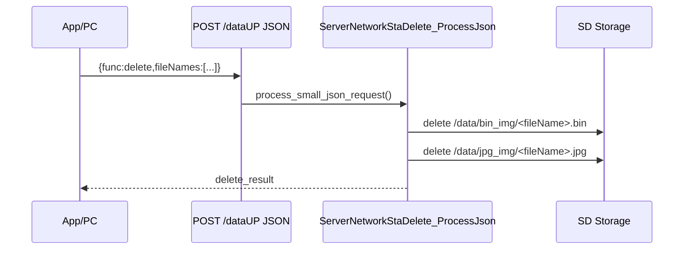
```mermaid
sequenceDiagram
    participant APP as App/PC
    participant DATAUP as POST /dataUP JSON
    participant DEL as ServerNetworkStaDelete_ProcessJson
    participant SD as SD Storage
    APP->>DATAUP: {func:delete,fileNames:[...]}
    DATAUP->>DEL: process_small_json_request()
    DEL->>SD: delete /data/bin_img/<fileName>.bin
    DEL->>SD: delete /data/jpg_img/<fileName>.jpg
    DEL-->>APP: delete_result
```

树状时序：

```text
HTTP small JSON delete
└─ receive_data_redirect_handler()
   └─ process_small_json_request()
      └─ ServerNetworkStaDelete_ProcessJson()
         ├─ parse_file_names()
         ├─ delete_one_path(/data/bin_img/*.bin)
         ├─ delete_one_path(/data/jpg_img/*.jpg)
         └─ send_delete_result()
```

V2 协议资料拆分：

```json
{
  "func": "delete",
  "fileNames": ["26422", "26423"]
}
```

字段说明：

```text
func       固定为 delete
fileNames  要删除的图片文件名数组，不带扩展名
```


存 / 取信息（含条件限制）：

```text
存：
- 删除动作会修改持久化文件系统：unlink /data/bin_img/<file>.bin 与 /data/jpg_img/<file>.jpg。
- 不修改默认 NVS `image_state:last_cast`。
- 不修改默认 NVS `image_state:slide_cfg`。
- 不修改默认 NVS `image_state:slide_ctl`。
- 不修改 NVS 中的 slideshow progress / last slideshow 状态。

取：
- 读取 JSON fileNames 数组。
- 不读取 last_cast / slideshow 配置。
```

[⬆ 返回目录](#toc) | [↩ 返回当前目录](#sec-07)

---

### 7.4 net_data：通用网络数据封装 <span id="sec-07-4"></span>

结果码以 [README_Result_Code.md](README_Result_Code.md) 为准。

功能说明：统一管理网络 HTTP POST 数据入口、body 分配以及 multipart/JSON/OTA 分流，并注册 `/dataUP`、`/ota`、`/ota_upload`。`GET /ping` 和 `GET /time` 由 `file_server.c` 的 `GET /*` handler 优先拦截，不由 net_data 注册。

Mermaid 时序图：

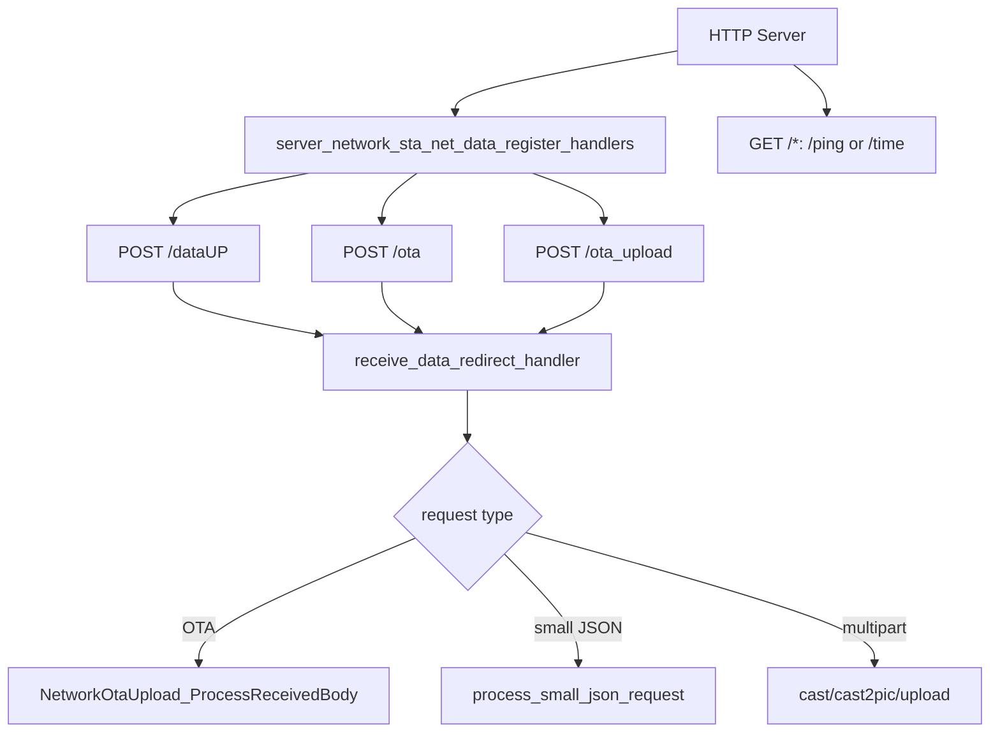
```mermaid
flowchart TD
    A[HTTP Server] --> B[server_network_sta_net_data_register_handlers]
    B --> C[POST /dataUP]
    B --> D[POST /ota]
    B --> E[POST /ota_upload]
    C --> G[receive_data_redirect_handler]
    D --> G
    E --> G
    G --> H{request type}
    H -->|OTA| I[NetworkOtaUpload_ProcessReceivedBody]
    H -->|small JSON| J[process_small_json_request]
    H -->|multipart| K[cast/cast2pic/upload]
    A --> L[GET /*: /ping or /time]
```

树状时序：

```text
file_server.c
└─ example_start_file_server()
   └─ server_network_sta_net_data_register_handlers()
      ├─ register POST /dataUP
      ├─ register POST /ota
      ├─ register POST /ota_upload
      └─ file_server.c 另行注册 GET /*，优先拦截 /ping 与 /time

POST request
└─ receive_data_redirect_handler()
   ├─ ServerNetworkStaWifiWorkTime_OnHttpNetworkActivity()
   ├─ NetworkOtaUpload_IsOtaRequest()
   ├─ alloc_request_body_buffer()
   ├─ read_request_body_to_buffer()
   ├─ NetworkOtaUpload_ProcessReceivedBody()
   ├─ process_small_json_request()
   ├─ ServerNetworkStaCast2Pic_Process()
   ├─ ServerNetworkStaCast_Process()
   └─ ServerNetworkStaUpload_Process()
```

V2 协议资料拆分：

```text
V2 HTTP 入口：
├─ POST /dataUP + multipart/form-data
│  ├─ cast
│  ├─ upload
│  ├─ cast2pic
│  └─ update（前端预留）
├─ POST /dataUP + JSON
│  ├─ get_saved_images
│  ├─ get_snapshot
│  ├─ start_slideshow
│  ├─ set_slideshow
│  ├─ delete
│  ├─ set_wifi_work_time
│  └─ daily_download_file
├─ GET /ping
└─ GET /time
```


存 / 取信息（含条件限制）：

```text
存：
- net_data 不直接写持久化数据。
- 根据请求类型转交 cast/upload/ota/slideshow/wifi_work_time 等模块执行实际存储。

取：
- 读取 request header、body、Content-Type、URI、multipart boundary。
- 读取 body_len 并在 RAM 中做临时缓存。
```

[⬆ 返回目录](#toc) | [↩ 返回当前目录](#sec-07)

---

### 7.5 ota：设备在线升级模块 <span id="sec-07-5"></span>

结果码以 [README_Result_Code.md](README_Result_Code.md) 为准。

功能说明：通过网络上传固件，校验固件头、版本、分区大小，写入 OTA 分区并切换启动分区。

Mermaid 时序图：

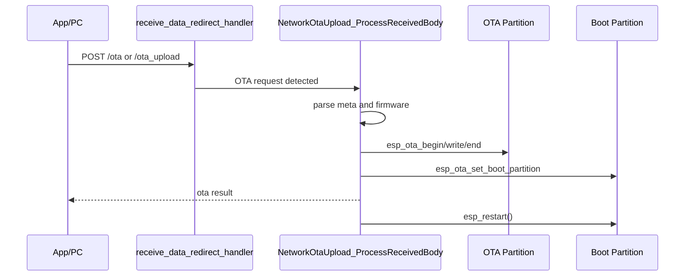
```mermaid
sequenceDiagram
    participant APP as App/PC
    participant DATA as receive_data_redirect_handler
    participant OTA as NetworkOtaUpload_ProcessReceivedBody
    participant PART as OTA Partition
    participant BOOT as Boot Partition
    APP->>DATA: POST /ota or /ota_upload
    DATA->>OTA: OTA request detected
    OTA->>OTA: parse meta and firmware
    OTA->>PART: esp_ota_begin/write/end
    OTA->>BOOT: esp_ota_set_boot_partition
    OTA-->>APP: ota result
    OTA->>BOOT: esp_restart()
```

树状时序：

```text
receive_data_redirect_handler()
├─ NetworkOtaUpload_IsOtaRequest()
├─ NetworkOtaUpload_GetMaxBodySize()
└─ NetworkOtaUpload_ProcessReceivedBody()
   ├─ ota_stream_begin()
   ├─ extract_boundary()
   ├─ extract_multipart_field("meta")
   ├─ parse_meta_json()
   ├─ extract_multipart_field("firmware" or "bin")
   ├─ PowerMode_SetOtaWriteInProgress(true)
   ├─ write_firmware_to_ota_partition()
   │  ├─ validate image header magic
   │  ├─ get_firmware_app_desc()
   │  ├─ esp_ota_get_next_update_partition()
   │  ├─ esp_ota_begin()
   │  ├─ esp_ota_write()
   │  ├─ esp_ota_end()
   │  └─ esp_ota_set_boot_partition()
   └─ esp_restart()
```

V2 协议资料拆分：

```text
V2_相框传图协议.html 中没有定义网络 OTA 请求字段。
当前 OTA 以仓库源码 /ota、/ota_upload 处理逻辑为准，和 V2 图片/控制协议分开。
```

当前实现与后续优化：

```text
当前 OTA 请求仍先由 receive_data_redirect_handler() 完整接收 HTTP body，再交给 NetworkOtaUpload_ProcessReceivedBody() 解析 firmware part。
OTA 写分区时会分块 esp_ota_write()，但 HTTP 接收阶段不是 streaming。
成功响应先发送 `ota_event/rebooting`，再发送最终 `ota_result/result=0` 并结束 chunked response；`ota_result` 后不再发送其他 JSON。
响应结束后由 OTA 模块的专用任务按 `SERVER_NETWORK_STA_OTA_RESTART_DELAY_MS=500ms` 延时复位，使 HTTP handler 可以先释放 body、上传互斥锁和 socket，同时缩短 CH583 后续 OTA 前的等待时间。
OTA restart-pending 期间拒绝新的 multipart 上传：OTA 返回现有 `1713/upload_busy`，其他 multipart 返回现有 `dataup_result/1007`；GET 和非 multipart 业务保持原处理方式。
设备不新增应用 NVS OTA 标志，直接使用 bootloader `otadata` 中的 `ESP_OTA_IMG_PENDING_VERIFY` 作为 OTA 首次启动的权威标志。只有该状态会输出版本、运行分区、分区地址、OTA state 和 reset reason 的启动诊断，并设置 pending-verify power hold。启动最早阶段读取失败时，在 work-time 初始化后、GPIO test 前重试一次，使 OTA 首次启动容错和 power hold 能及时生效。
新启动的 OTA 镜像在 NVS、基础系统、work-time、EPD 模式、网络管理对象和 CH583 UART 等本地关键初始化完成后，通过 `NetworkOtaBoot_ConfirmAfterLocalInit()` 确认有效；该确认不等待 WiFi、DHCP、SNTP、HTTP、SD 或 DAILY。确认成功清除 pending-verify hold；确认失败保留 hold，并在 `/dataUP`、`/ota`、`/ota_upload` 全部注册成功后沿用 `NetworkOtaBoot_ConfirmCurrentImage()` 重试。当前 PM 配置固定 `light_sleep_enable=false`，pending 状态会额外打印一次保护提示，不改变普通启动的 PM 配置。
OTA 首次启动时，独立的 GPIO test 和 factory-reset task 初始化失败只记录错误并继续恢复流程；普通启动仍保留原有 `ESP_ERROR_CHECK()` 行为。网络、UART、LED、EPD 等有业务依赖的初始化保持原规则。
开发阶段保持当前实现便于调试；如果后续固件体积增大或 PSRAM 压力明显，建议单独为 /ota 做 streaming handler，一边 httpd_req_recv() 一边 esp_ota_write()。
```

存 / 取信息（含条件限制）：

```text
存：
- esp_ota_write() 写入 OTA update partition。
- esp_ota_set_boot_partition() 保存下次启动分区选择。
- OTA HTTP body 接收与固件写入分别设置 WiFi 工作时间模块的 receive/write power hold；任一 hold 有效时都禁止超时 `POWER_OFF`。
- 成功后设置 OTA restart-pending 状态；外层网络清理不得把成功灯状态覆盖为失败，专用任务复位后该 RAM 状态自然清除。
- OTA restart-pending 使用原子状态读写，只限制重启前的新 multipart 上传。
- OTA boot 模块读取 `otadata`，只在本次由 `PENDING_VERIFY` 镜像启动时保存 RAM 状态；不写应用 NVS。
- pending-verify hold 使用 `USER_WORK_STATE_OTA_HOLD_PENDING_VERIFY_BIT`，确认成功后清除，复位后 RAM 状态自然重建。

取：
- 读取 multipart meta JSON、firmware/bin 字段。
- 读取当前 running partition、目标 update partition、固件 app_desc、版本信息。
- 启动时读取 running partition、`esp_ota_img_states_t`、app description 和 reset reason。
```

[⬆ 返回目录](#toc) | [↩ 返回当前目录](#sec-07)

---

### 7.6 ping：网络连通检测 <span id="sec-07-6"></span>

结果码以 [README_Result_Code.md](README_Result_Code.md) 为准。

实际代码位置：

```text
网络 HTTP：main/server_network_sta/ping/server_network_sta_ping.c
USB HTTP-like：main/usb_console_echo/ping/usb_console_ping.c
统一UPLOAD资源判定：main/server_network_sta/upload/server_network_sta_upload_gate.c
```

功能说明：用于App/PC判断设备服务是否可用，通过 `Ble_MAC` 防止缓存IP指向错误设备，并通过 `EPD` 字段告知当前是否允许尝试network upload。网络和USB ping使用同一个UploadGate规则，不再各自判断；字段名为兼容现有APP保持 `EPD` 不变。网络ping匹配 `/ping` 路径并允许query/hash后缀。每次有效网络ping仍刷新20秒HTTP关机保护并设置 `Connection: close`。

Mermaid 时序图：


```mermaid
sequenceDiagram
    participant APP as App/PC
    participant HTTP as GET /ping
    participant PING as ServerNetworkStaPing_ProcessGet
    participant MAC as CH583 BLE MAC cache
    APP->>HTTP: GET /ping
    HTTP->>PING: route ping request
    PING->>PING: ServerNetworkStaWifiWorkTime_OnHttpNetworkActivity()
    PING->>MAC: get_ble_mac_no_colon()
    PING->>PING: ServerNetworkStaUploadGate_IsBusy()
    PING-->>APP: ping_result + EPD + Ble_MAC
```

树状时序：

```text
HTTP GET /ping
└─ ServerNetworkStaPing_ProcessGet()
   ├─ ServerNetworkStaWifiWorkTime_OnHttpNetworkActivity()
   ├─ get_ble_mac_no_colon()
   ├─ ServerNetworkStaUploadGate_IsBusy()
   ├─ httpd_resp_set_hdr(Connection: close)
   └─ httpd_resp_sendstr()
```

V2 协议资料拆分：

```http
GET /ping HTTP/1.1
```

也允许：

```http
GET /ping?t=123 HTTP/1.1
GET /ping#check HTTP/1.1
```

返回：

```json
{
  "func": "ping_result",
  "result": 0,
  "message": "ok",
  "EPD": "BUSY",
  "Ble_MAC": "AABBCCDDEEFF"
}
```

`EPD` 字段取值：

```text
BUSY  当前不能安全开始network upload
IDLE  当前允许尝试network upload；upload入口仍做最终资源预约
```

BLE MAC 尚未取得时仍返回完整字段：

```json
{
  "func": "ping_result",
  "result": 1405,
  "message": "Ble_MAC not ready",
  "EPD": "IDLE",
  "Ble_MAC": ""
}
```

网络和USB固定输出字段名 `Ble_MAC`，并使用完全相同的UploadGate BUSY/IDLE规则。前端写操作前应访问目标设备的 `/ping`；ping与后续upload之间可能发生状态变化，因此ESP32 upload入口会再次检查，BUSY时返回1007且不保存。


存 / 取信息（含条件限制）：

```text
存：
- ping 不写入持久化数据。
- 只调用 `ServerNetworkStaWifiWorkTime_OnHttpNetworkActivity()` 刷新 RAM 中的 20 秒 HTTP 活动保护，不重置完整 `wifi_work_time`。

取：
- 读取 CH583 BLE MAC 字符串，用于返回 Ble_MAC。
- BLE MAC 来源可能是 CH583 模块上报后保存在 PhotoPainter NVS 的值。
- 读取统一任务关键阶段/pending、EPD预约和队列、Shared SPI、图片保存、EPD/SD已断电或电源切换、Factory Reset、OTA及UPLOAD预约状态。
- DAILY/SLIDESHOW只在等待下一时间点且资源空闲时允许IDLE；网络ping在供电恢复等待之前读取UploadGate，完全掉电时返回BUSY且不等待供电恢复。USB ping使用相同判定。
```

[⬆ 返回目录](#toc) | [↩ 返回当前目录](#sec-07)

---

### 7.7 get_saved_images：取出本地存储图片 <span id="sec-07-7"></span>

结果码以 [README_Result_Code.md](README_Result_Code.md) 为准。

网络 `/thumb/<name>.jpg` 成功时直接返回 `HTTP 200 image/jpeg` 二进制；名称非法或文件不存在时返回 JSON `thumb_result`，HTTP 状态分别为 400、404。USB thumb 同样在失败时返回 `1402/1403`。

功能说明：扫描本地已保存缩略图，返回前端可展示的图片列表和缩略图地址。JSON `func` 解析允许冒号前后有空格或换行，支持 PowerShell `ConvertTo-Json` 输出格式。

Mermaid 时序图：

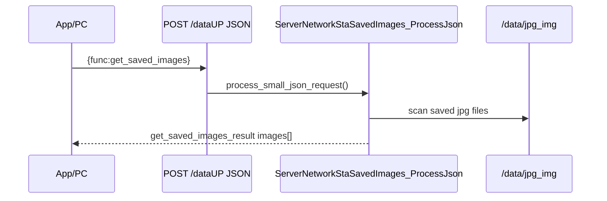
```mermaid
sequenceDiagram
    participant APP as App/PC
    participant DATAUP as POST /dataUP JSON
    participant IMG as ServerNetworkStaSavedImages_ProcessJson
    participant SD as /data/jpg_img
    APP->>DATAUP: {func:get_saved_images}
    DATAUP->>IMG: process_small_json_request()
    IMG->>SD: scan saved jpg files
    IMG-->>APP: get_saved_images_result images[]
```

树状时序：

```text
HTTP small JSON get_saved_images
└─ receive_data_redirect_handler()
   └─ process_small_json_request()
      └─ ServerNetworkStaSavedImages_ProcessJson()
         ├─ scan /data/jpg_img
         ├─ saved_image_name_is_safe()
         └─ httpd_resp_sendstr(json)
```

V2 协议资料拆分：

```json
{
  "func": "get_saved_images"
}
```

返回：

```json
{
  "func": "get_saved_images_result",
  "result": 0,
  "images": [
    {
      "fileName": "26422",
      "thumbnailUrl": "/thumb/26422.jpg"
    }
  ]
}
```

V2 说明：前端会用设备 `baseUrl` 拼接相对缩略图地址。


存 / 取信息（含条件限制）：

```text
存：
- get_saved_images 不写文件。

取：
- 扫描 /data/jpg_img 目录下的 .jpg / .JPG 文件。
- 生成 fileName 与 thumbnailUrl。
- /thumb/<name>.jpg 请求会 fopen 对应 jpg 并 fread 分块返回。
- 如果 /data/jpg_img 不存在，返回空 images[]，不作为错误。
```

[⬆ 返回目录](#toc) | [↩ 返回当前目录](#sec-07)

---

### 7.8 slideshow：图片轮播的文件列表，轮播间隔，是否随机 <span id="sec-07-8"></span>

> 轮播runtime和开机启动延迟的任务生命周期、串行执行、取消及内存规则统一以 [第2章：永久常驻统一图片业务任务](#sec-02-image-business-worker) 为准。本节只说明轮播自身业务规则。

结果码以 [README_Result_Code.md](README_Result_Code.md) 为准。

功能说明：`start_slideshow` 用于下发并保存轮播图片列表、轮播顺序、随机模式和默认 interval，并在同一条命令中使用 `timestamp` 写入标准 RTC control、强制 `sw=1`、启动 RTC 轮播。它等价于“原 start_slideshow 列表配置功能 + set_slideshow 的 sw=1/interval/random/timestamp 启动功能”。

Mermaid 时序图：

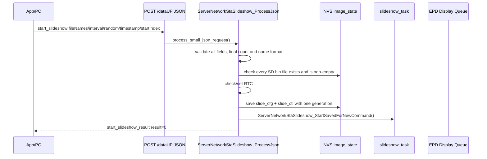
```mermaid
sequenceDiagram
    participant APP as App/PC
    participant DATAUP as POST /dataUP JSON
    participant SS as ServerNetworkStaSlideshow_ProcessJson
    participant STATE as NVS image_state
    participant TASK as slideshow_task
    participant EPD as EPD Display Queue
    APP->>DATAUP: start_slideshow fileNames/interval/random/timestamp/startIndex
    DATAUP->>SS: process_small_json_request()
    SS->>SS: validate all fields, final count and name format
    SS->>STATE: check every SD bin file exists and is non-empty
    SS->>SS: check/set RTC
    SS->>STATE: save slide_cfg + slide_ctl with one generation
    SS->>TASK: ServerNetworkStaSlideshow_StartSavedForNewCommand()
    SS-->>APP: start_slideshow_result result=0
```

树状时序：

```text
HTTP small JSON start_slideshow
└─ receive_data_redirect_handler()
   └─ process_small_json_request()
      └─ ServerNetworkStaSlideshow_ProcessJson()
         ├─ parse_start_slideshow_request()
         ├─ validate final fileNames count and name format
         ├─ check_slideshow_files_exist()
         ├─ parse timestamp and check/set RTC
         ├─ save_slideshow_persistent_state()
         └─ ServerNetworkStaSlideshow_StartSavedForNewCommand()

main/main.c
└─ ServerNetworkStaSlideshow_StartSavedDelayed("/data")
   ├─ 延迟 TDX_SLIDESHOW_STARTUP_DELAY_MS 毫秒
   ├─ 重新读取 NVS slide_ctl
   ├─ sw=0 时跳过自动恢复轮播
   └─ sw=1 时调用 ServerNetworkStaSlideshow_StartSaved("/data")
      ├─ read_slideshow_config_state()
      ├─ read_slideshow_control_on()
      ├─ 读取并校验 NVS slide_progress
      └─ 提交给常驻 image_business_worker 执行 slideshow_run_runtime()
```

V2 协议资料拆分：

```json
{
  "func": "start_slideshow",
  "fileNames": ["26422", "26423"],
  "interval": 60,
  "random": false,
  "timestamp": 1783372200,
  "startIndex": 0
}
```

字段说明：

```text
fileNames 必须是逗号分隔的合法 JSON 数组；表示 APP 最终生成的播放事件列表，最多 150 个并允许重复；每个基础文件名为 1..16 个安全 ASCII 字节且不带扩展名，超过 16 字节返回 1502，整条指令不执行；列表中的每个 .bin 文件都必须存在于 /data/bin_img、是普通文件且非空；网络端完整 JSON 仍不得超过 4096 字节
interval 默认轮播间隔，单位秒，固件校验 60..604800
random=true 时 APP 原始文件最多 50 个，将每个原始文件复制 3 次并对最终列表打乱；设备不再次随机，也不校验每个名称是否刚好出现 3 次，仍强制保存/返回 random=false，并按收到的最终 fileNames 顺序轮播
timestamp 必填；秒级 Unix 时间戳，用作 `fileNames[startIndex]` 起始图片的目标播放时间，同时写入 show_control.timestamp 和 anchor_epoch
startIndex 必填；从 0 开始，必须小于 APP 最终发送的 fileNames 数量，不得再乘 3；表示 timestamp 对应的起始播放事件
```


存 / 取信息（含条件限制）：

```text
存：
- start_slideshow 严格要求合法 startIndex，把 fileNames / interval / random / startIndex 保存到 NVS `slide_cfg`，把 enabled / interval / timestamp / anchor_epoch 保存到 NVS `slide_ctl`。两个记录使用相同 generation；旧字段 `index` 不兼容，缺少 startIndex 时拒绝启动，不默认补 0。
- APP / 网络端 start_slideshow 在任何写入或校时前完成整条指令校验：最终 fileNames 最多 150 个并允许重复，设备逐项检查全部 bin 文件。发现任一非法文件时只返回错误，不保存配置、不写 RTC / 系统时间、不改变显示模式，也不停止或重启现有轮播。
- 网络和 USB 的 cast、cast2pic、upload、delete、start_slideshow 统一要求业务基础文件名最多 16 个安全 ASCII 字节且不带 `.bin/.jpg`；APP 新名称建议固定使用 16 位小写十六进制，设备继续兼容 `26422` 等较短名称。解析阶段先检查真实长度，超过上限直接返回现有文件名非法结果，不截断、不执行显示、保存、删除或状态修改。multipart 原始 `filename` 解析缓冲仍保留 96 字节；legacy multipart fallback 保存前按去掉匹配的 `.bin/.jpg` 后的基础名检查 16 字节上限。
- fileNames 数组严格要求文件名之间使用单个逗号分隔，不接受缺少逗号、重复逗号或尾随逗号；文件检查阶段无法取得共享 SPI 锁时返回 1012，不误报为文件不存在。
- set_slideshow 写入 sw / interval / timestamp / anchor_epoch，并同步写 PhotoPainter:epd_mode=1。
- 设备端 `random` 永久禁用；协议仍兼容接收 `random:true/false`。`random=true` 时复制 3 次及打乱由 APP 在发送前完成，设备统一强制为 `random=false`，并在 NVS `slide_cfg`、`slide_ctl` 和 snapshot 中固定保存/返回 false；不再维护独立的 random NVS key。
- NVS `slide_progress` 继续保存版本、配置 hash、待显示文件和位置，供诊断及非 SNTP 兼容路径使用；SNTP 已同步时它不再是选图依据，启动时 NVS 读写失败可用 RAM 进度继续绝对时间轮播。
- SNTP 绝对时间槽公式：`slot=floor((now_epoch-anchor_epoch)/interval)`，`current_index=(startIndex+(slot%file_count))%file_count`，`current_file=fileNames[current_index]`，`next_epoch=anchor_epoch+(slot+1)*interval`。
- 当 `fileNames` 只有一张时，合法值只能是 `startIndex=0`；每个绝对时间槽都映射到同一张图片，因此设备仍会按 interval 到点重复刷新该图片。其他 startIndex 返回 1516。
- SNTP 已同步且 `now_epoch>=anchor_epoch` 时，当前绝对时间槽始终是选图依据。开机恢复使用 NVS `order[position]` 的列表索引确认是否正好指向当前槽的下一项，并同时核对 `pending_file`；允许重复文件名后不能只凭文件名判断。确认当前槽已显示时等待下一绝对播放点，否则立即显示当前槽图片。`now_epoch<anchor_epoch` 时，以 `anchor_epoch - lead_seconds` 作为进入 EPD 刷新流程的时间点。NVS 只辅助判断当前槽图片是否已在屏幕上，不能改变绝对时间槽选图结果。
- SNTP 时间下允许 timestamp 与当前时间相差不超过 5 秒。若 timestamp 在未来，设备接受指令，但仍遵守 RTC 播放点：只有当前时间到达 `timestamp - lead_seconds` 才进入起始图片的 EPD 刷新流程；若该提前点已经到达则立即进入。比如 timestamp 领先 5 秒、lead=3 秒时等待约 2 秒；timestamp 领先 2 秒、lead=3 秒时立即进入。这样不会因强制提前显示而破坏 APP 与 ESP32 共用的绝对时间基准，也不会因少量传输或校时误差拒绝正常指令。
- slideshow_run_runtime() 在 SNTP 模式下每次显示前重新核对绝对时间槽；若断电、阻塞或 SNTP 向前/向后校时跨槽，直接切换到当前应显示的图片，不逐张补播。
- `ServerNetworkStaSlideshow_GetScheduleTiming()` 可读取 RTC 轮播的 now / next / remain；`ServerNetworkStaSlideshow_GetRuntimeTiming()` 只作为非 RTC 兼容状态读取。
- slideshow_run_runtime() 在 EPD 显示成功且下一进度保存成功后，SNTP 模式按绝对槽计算下一目标；其他时间源继续使用原 RTC 进度逻辑。
- slideshow_run_runtime() 在上一张 EPD 显示完成并保存下一进度后，会在剩余 interval 时间内用 PSRAM 预加载下一张 bin 并做 SHA-256 文件名校验；RTC 真实目标时间保持 `next_epoch` 不变，但设备内部会在 `next_epoch - lead_seconds` 时进入 EPD 显示流程，用于抵消 SD / 调度 / EPD 调用链路开销。`lead_seconds` 按当前 EPD type 选择：`EPD_TYPE_1600_1200_133_DKE` 为 1 秒，`EPD_TYPE_1600_1200_133` 为 3 秒，其它屏型使用默认 `TDX_SLIDESHOW_RTC_DISPLAY_LEAD_SECONDS=2` 秒。若 PSRAM 预加载失败，已保存的下一进度不变，下一轮会重新读取该图片，不长时间占用内部 RAM，不影响停止和失败不推进的规则。
- 业务基础文件名缓冲从 48 字节缩为 17 字节后，150 项轮播列表由 7200 字节降为 2550 字节，轮播 runtime 由约 7.5 KB 降到约 2.9 KB；runtime 仍优先从 PSRAM 分配，失败时兼容回退内部 RAM。轮播主循环、每日一图、开机轮播启动延迟、Local Image Browsing及cast/cast2pic后台业务统一提交给启动早期创建的12KB静态 `image_business_worker`；旧轮播、daily、Local、cast保存和USB worker任务均已取消。统一worker同一时间只执行一个owner，轮播停止使用generation和可中断等待唤醒，runtime结束后释放并返回统一worker空闲状态。新命令的runtime启动失败仍禁用NVS `slide_ctl`、恢复NORMAL并返回1506；开机自动恢复临时失败仍保留控制、模式和进度等待下次唤醒。
- RTC 轮播显示失败时不立即重试；当前失败图片视为跳过，先保存并切换到下一张 pending_file，再排到下一次 RTC 播放点，等待下一次轮播到来后显示下一张图片。若跳过进度保存失败，则不推进当前 progress，但仍排到下一次 RTC 播放点，避免立即重试。
- `lead_seconds` 只用于提前进入 EPD 硬件刷新，目标图片仍按逻辑播放点的绝对槽选择，不使用提前后的时间改变图片索引。
- 相同文件名出现在不同列表索引时，按不同播放事件处理；如果随机后的最终列表包含相邻相同名称，设备会在相邻两个 RTC 播放点分别调用 EPD 显示同一文件，这是当前产品策略的预期行为。

取：
- ServerNetworkStaSlideshow_StartSavedDelayed() 只用于开机自动恢复轮播：启动位置仍保持在网络初始化之后，但先等待 `TDX_SLIDESHOW_STARTUP_DELAY_MS=10000` 毫秒；等待期间cast/cast2pic仍按原规则处理，network upload仅能以 `show=false && save=true` 在UploadGate空闲时同步保存；延迟结束时如果EPD或SD资源仍忙，则继续推迟启动。
- 延迟结束后先重新读取 control；如果 `show=true` 已把 control 写成 `sw=0`，则跳过自动恢复；EPD 忙时继续推迟。启动时没有 SNTP 就按原 CH583/CH585、anchor fallback 和 pending_file 逻辑运行，不等待网络时间；运行中首次取得 SNTP 时，等待当前 EPD 操作结束后一次性切换到绝对时间槽。若本次 runtime 已消费过播放事件，且此时 progress 的列表索引和文件名已经共同指向当前绝对槽的下一项，则认为当前槽已经消费，直接等待下一绝对播放点，不重复调用 EPD；否则显示 SNTP 计算出的当前槽。
- 读取 NVS control 时严格校验 magic、version、size、CRC、interval、timestamp 和 anchor_epoch；enabled control 还必须与 config generation 相同，否则不启动轮播，也不回退到 task tick 计时。
- ServerNetworkStaSlideshow_StartSaved() 仍用于立即启动已保存轮播，不带开机 10 秒延迟。
- startIndex 会加入配置 hash；进度版本、配置 hash、随机模式、排列或文件名不匹配时，从 `fileNames[startIndex]` 重建进度。
- slideshow_run_runtime() 读取 `/data/bin_img/*.bin`，等待 EPD 真正完成后再提交下一进度；如果读文件前、读文件后或送 EPD 前收到停止请求，则放弃本张显示并退出。
- 停止请求与预加载并发时，`ESP_ERR_INVALID_STATE` 属于正常取消；保留一条 `ESP_LOGI` 说明取消位置，不再追加误导性的 preload failed 警告。真实文件读取、内存或 SPI 错误仍按原规则输出关键错误/警告。
- slideshow_run_runtime() 从 SD 读出 bin 后、送 EPD 前，会计算文件内容 SHA-256 的十六进制后 16 位并与 fileName 比对，只打印 `sha256 ok` / `sha256 mismatch` / `sha256 failed` / `skip invalid basename` 诊断日志，不阻止显示、不修改进度；匹配成功用 `ESP_LOGI`，无效 basename 跳过用 `ESP_LOGW`，计算失败或 mismatch 用 `ESP_LOGE`。
- 轮播日志中 `slideshow rtc ...` / `slide_timer rtc ...` 表示真实 RTC 时间控制；`slideshow rtc wait target=... display_target=... lead=...` 中 `target` 是真实播放点，`display_target` 是提前进入显示流程的时间点，`lead` 是当前 EPD type 实际提前秒数；`slideshow rtc display start file=... position=x/y interval=...` 表示本轮第 x/y 个播放点已进入 EPD 显示；`legacy_tick` 只表示非 RTC 兼容路径或旧状态统计，不能作为新协议轮播判断依据。RTC 模式以真实系统时间计算 remain，不依赖 task tick 延时。
- `set_slideshow sw=1` 会按新的 timestamp / interval 重算 RTC 播放点；`start_slideshow` 也会用自身 timestamp 写 RTC control 并启动轮播。
- SNTP 模式下即使旧 `slide_progress` 与当前时间不一致，也会以绝对时间槽结果为准；只有开机恢复时有效 `order[position]` 索引等于当前槽下一项且 `pending_file` 同时匹配，才用于避免重复刷新墨水屏已经保留的当前图片。未取得 SNTP 时始终沿用原进度恢复行为，已经切换到 SNTP 模式后即使 WiFi 临时断开也不回退。
```

[⬆ 返回目录](#toc) | [↩ 返回当前目录](#sec-07)

---

### 7.9 slideshow_control：轮播控制模块 <span id="sec-07-9"></span>

结果码以 [README_Result_Code.md](README_Result_Code.md) 为准。

功能说明：单独控制轮播开启/关闭、轮播周期、随机模式和 RTC 同步播放时间。`sw=1` 时轮播时间由 ESP32-C5 RTC / 系统时间控制，协议使用秒级标准 Unix 时间戳 `timestamp`，单位秒。

Mermaid 时序图：


```mermaid
sequenceDiagram
    participant APP as App/PC
    participant DATAUP as POST /dataUP JSON
    participant CTRL as ServerNetworkStaSlideshowControl_ProcessJson
    participant STATE as NVS image_state:slide_ctl
    participant SS as slideshow task
    APP->>DATAUP: set_slideshow sw/interval/random/timestamp
    DATAUP->>CTRL: process_small_json_request()
    CTRL->>STATE: write versioned control state
    alt sw=0
        CTRL->>SS: ServerNetworkStaSlideshow_Stop()
    else sw=1
        CTRL->>SS: keep/start slideshow according to saved list
    end
    CTRL-->>APP: set_slideshow_result
```

树状时序：

```text
HTTP small JSON set_slideshow
└─ receive_data_redirect_handler()
   └─ process_small_json_request()
      └─ ServerNetworkStaSlideshowControl_ProcessJson()
         ├─ parse sw field
         ├─ parse interval/random
         ├─ sw=1 parse timestamp and check/set RTC
         ├─ write_control_state(sw/interval/timestamp/anchor_epoch)
         ├─ EpdDisplayMode_SetBySlideshowSwitch(sw)
         ├─ sw=0
         │  └─ ServerNetworkStaSlideshow_Stop()
         └─ sw=1
            ├─ ServerNetworkStaSlideshow_StartSavedResetInterval()
            └─ 模式保存或 runtime 启动失败时回滚 slide_ctl.enabled=false 和 NORMAL
```

V2 协议资料拆分：

```json
{
  "func": "set_slideshow",
  "sw": 1,
  "interval": 60,
  "random": false,
  "timestamp": 1783372200
}
```

字段说明：

```text
sw=1 开启轮播
sw=0 关闭轮播
interval 轮播间隔，单位秒
interval 允许范围 60..604800；sw=0 时可省略，省略时沿用已有 NVS control 或默认最小值
random 字段保留，但设备始终强制为 false 并按列表顺序轮播；省略时也不会启用随机模式
control.interval / control.random 是 set_slideshow 写入 NVS `slide_ctl` 的配置值；轮播 task 实际使用的是启动/恢复后复制到 runtime 的 RAM 值。
timestamp 保存的 `fileNames[startIndex]` 起始图片目标播放时间，秒级标准 Unix 时间戳
旧 datetime/timezone 已删除；新请求中不再发送 timezone
anchor_epoch 等于 timestamp，用于后续按 interval 计算播放点
startIndex 不由 set_slideshow 修改；始终沿用 NVS `slide_cfg` 中 start_slideshow 保存的必填起始索引
```

RTC 同步规则：

```text
sw=1 时如果 SNTP 已同步，设备使用 SNTP 当前时间，不用 APP / PC 的 timestamp 修 RTC；同时比较 abs(now_epoch - timestamp)。
SNTP 已同步且差值 > 5 秒时，返回 1513，不写 NVS control，不停止/启动轮播，不执行本次指令；返回中带 timestamp、now_epoch、time_diff，方便 APP / PC 知道差几秒。
SNTP 已同步且差值 <= 5 秒时，接受指令，anchor_epoch=timestamp。
若 timestamp 在未来，设备不会无条件提前显示；进入起始图片 EPD 刷新的时间点为 `timestamp-lead_seconds`。该时间点已经到达时立即进入，否则等待到该时间点。
SNTP 未同步时，设备把 APP / PC 发来的 timestamp 写入 ESP32-C5 RTC / 系统时间，并以此作为本次轮播时间基准；写入失败返回 1512。
timestamp 表示 `fileNames[startIndex]` 起始图片播放时间，之后每 interval 秒一个播放点。
设备收到 APP / PC 合法 timestamp 后，会尽量通过 CH583/CH585 TIME_SET 备份该时间；即使 SNTP 已同步且 timestamp 与设备当前 SNTP 时间差值超过 5 秒、最终返回 1513 不执行轮播，也会先备份 APP / PC timestamp。若 timestamp 非法但 SNTP 已同步，则备份设备当前 SNTP 时间。
如果收到命令或设备启动恢复时已经超过 timestamp，并且 SNTP 已同步：
- 使用 `slot=floor((now_epoch-anchor_epoch)/interval)` 计算当前绝对时间槽。
- 使用 `current_index=(startIndex+(slot%file_count))%file_count` 计算 APP 与 ESP32 此刻共同应显示的图片。开机恢复时 NVS position 不能改变该选图结果；只有 `order[position]` 索引等于当前槽下一项且 `pending_file` 同时匹配时，才辅助确认墨水屏已经显示当前图片并避免重复刷新，否则立即显示当前槽图片。
- 使用 `next_epoch=anchor_epoch+(slot+1)*interval` 计算下一个逻辑播放点；跨过多个时间槽时直接跳到当前槽，不补播遗漏图片。
轮播 task 内部 1 秒检查 RTC / 系统时间；设备内部仍按当前 EPD type 在 `next_epoch - lead_seconds` 时提前进入 EPD 显示流程：DKE 13.3 寸为 1 秒，兴泰 13.3 寸为 3 秒，其它屏型默认 2 秒，但图片索引按逻辑 `next_epoch` 对应的槽计算。
返回成功时带 timestamp、time_source、time_diff、anchor_epoch、now_epoch、next_epoch、remain，APP 可用 remain 校验倒计时同步。time_source=sntp 表示使用设备 SNTP 时间；time_source=timestamp 表示 SNTP 未同步，已使用 APP / PC timestamp 写入 RTC。
开机自动恢复启动点如果 `ServerNetworkStaTime_IsSntpSynced()==true`，则立即启用绝对时间槽；否则仍走原 CH583/CH585、anchor fallback 与 pending_file 路径。轮播等待期间每秒只检查状态、不打印；首次发现 SNTP 成功后切换一次，之后不再回退。
```


存 / 取信息（含条件限制）：

```text
存：
- set_slideshow 写入 NVS `slide_ctl`，保存 sw / interval / random / timestamp / anchor_epoch；random 省略时仍固定为 false。sw=1 时通过 ServerNetworkStaSlideshow_StartSavedResetInterval() 启动，并按 RTC next_epoch 等待。
- NVS control 保存后若显示模式保存或新命令 runtime 启动失败，停止轮播并尽力把 `slide_ctl.enabled=false`、`epd_mode=NORMAL` 写回；接口仍返回原有 1509 或 1506。
- sw 写入成功后同步写 PhotoPainter:epd_mode；sw=1 写 1，sw=0 写 0。
- 关闭轮播时更新控制状态并请求停止轮播任务；若 EPD 正在刷新，等待本次真实结果，成功时先提交下一待显示进度再退出。
- 配置 hash 或已保存随机排列失效时，再次开启会从当前配置第一张建立新一轮进度。

取：
- 读取 JSON 中 sw、interval、random、timestamp；random 省略时沿用已有 control。
- `sw=1` 时读取并校验持久化待显示进度，用于断电后继续；`sw=0` 时重启不会自动恢复轮播。
```

[⬆ 返回目录](#toc) | [↩ 返回当前目录](#sec-07)

---

### 7.10 snapshot：读取图片列表和轮播状态 <span id="sec-07-10"></span>

结果码以 [README_Result_Code.md](README_Result_Code.md) 为准。

功能说明：一次返回设备已保存图片列表和当前轮播状态，便于 App 进入页面时恢复设备状态。

Mermaid 时序图：

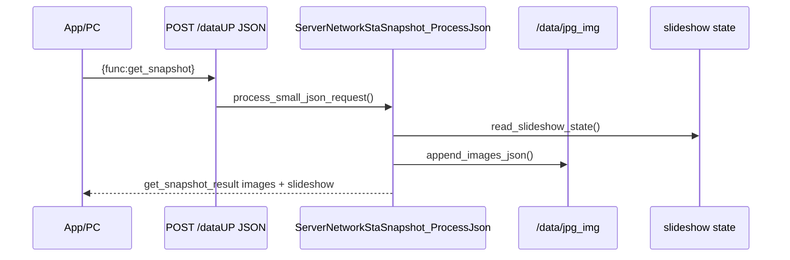
```mermaid
sequenceDiagram
    participant APP as App/PC
    participant DATAUP as POST /dataUP JSON
    participant SNAP as ServerNetworkStaSnapshot_ProcessJson
    participant SD as /data/jpg_img
    participant SS as slideshow state
    APP->>DATAUP: {func:get_snapshot}
    DATAUP->>SNAP: process_small_json_request()
    SNAP->>SS: read_slideshow_state()
    SNAP->>SD: append_images_json()
    SNAP-->>APP: get_snapshot_result images + slideshow
```

树状时序：

```text
HTTP small JSON get_snapshot
└─ receive_data_redirect_handler()
   └─ process_small_json_request()
      └─ ServerNetworkStaSnapshot_ProcessJson()
         ├─ read_slideshow_state()
         ├─ append_images_json()
         ├─ append_slideshow_json()
         └─ httpd_resp_sendstr(json)
```

V2 协议资料拆分：

```json
{
  "func": "get_snapshot"
}
```

返回：

```json
{
  "func": "get_snapshot_result",
  "result": 0,
  "images": [
    {
      "fileName": "26422",
      "thumbnailUrl": "/thumb/26422.jpg"
    }
  ],
  "slideshow": {
    "sw": 1,
    "fileNames": ["26422", "26423"],
    "interval": 60,
    "random": false,
    "startIndex": 0
  }
}
```

V2 说明：如果设备未设置过轮播，返回的 `startIndex=-1` 表示没有合法的新协议轮播配置；合法配置返回保存的起始 startIndex。

RTC 轮播字段：

```text
timestamp     set_slideshow sw=1 写入的起始槽播放时间，该槽图片由 NVS `slide_cfg.start_index` 决定。
anchor_epoch  等于 timestamp，用于按 interval 计算后续播放点。
now_epoch     设备当前 RTC / 系统 Unix 秒。
next_epoch    当前运行中下一次轮播播放点；未运行或非 RTC 轮播为 0。
remain        next_epoch - now_epoch，单位秒；APP 可用于同步倒计时。
time_synced   SNTP 是否已完成同步。
startIndex    start_slideshow 保存的起始图片索引；缺少或非法配置返回 -1。
```


存 / 取信息（含条件限制）：

```text
存：
- get_snapshot 不写文件。

取：
- append_images_json() 扫描 /data/jpg_img 下保存的缩略图。
- read_slideshow_state() 读取 NVS `slide_cfg` 和 `slide_ctl`。
- 返回 images[] 与 slideshow 状态。
- 网络 JSON 的 `func` 判断支持空格、CRLF 和 PowerShell `ConvertTo-Json` 输出格式。
```

[⬆ 返回目录](#toc) | [↩ 返回当前目录](#sec-07)

---

### 7.11 upload：PC或手机传文件到ESP32-C5，并存 <span id="sec-07-11"></span>

结果码以 [README_Result_Code.md](README_Result_Code.md) 为准。

功能说明：网页端或App上传图片到设备SD卡。network upload固定只接受 `show=false && save=true`；`show=true` 或 `save=false` 由ESP32直接返回错误，不显示也不保存。

Mermaid 时序图：

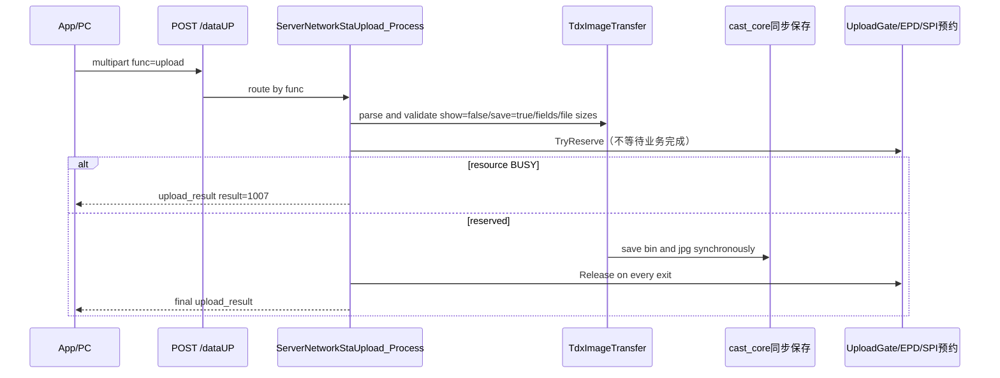
```mermaid
sequenceDiagram
    participant APP as App/PC
    participant DATAUP as POST /dataUP
    participant UP as ServerNetworkStaUpload_Process
    participant CORE as TdxImageTransfer
    participant SAVE as cast_core同步保存
    participant GATE as UploadGate/EPD/SPI预约
    APP->>DATAUP: multipart func=upload
    DATAUP->>UP: route by func
    UP->>CORE: parse and validate show=false/save=true/fields/file sizes
    UP->>GATE: TryReserve（不等待业务完成）
    alt resource BUSY
        UP-->>APP: upload_result result=1007
    else reserved
        CORE->>SAVE: save bin and jpg synchronously
        UP->>GATE: Release on every exit
        UP-->>APP: final upload_result
    end
```

树状时序：

```text
HTTP multipart /dataUP
└─ receive_data_redirect_handler()
   └─ ServerNetworkStaUpload_Process()
      ├─ TdxImageTransfer_ParseSingle("upload")
      │  ├─ UsbConsoleCommon_ExtractBoundary()
      │  ├─ UsbConsoleCommon_MultipartParts()
      │  └─ UsbConsoleCommon_FileNameIsSafe()
      ├─ 校验 show=false && save=true
      ├─ ServerNetworkStaUploadGate_TryReserve()
      │  ├─ EPD idle reservation
      │  └─ TdxSharedSpi_Lock(0)
      ├─ TdxImageTransfer_ProcessItems()
      │  └─ cast_core同步保存
      │     ├─ save /data/bin_img/<fileName>.bin
      │     └─ save /data/jpg_img/<fileName>.jpg
      ├─ ServerNetworkStaUploadGate_Release()
      └─ httpd_resp_sendstr(final result)
```

说明：network upload与USB upload继续共享原解析和保存实现，不创建 `dataup_async_worker`。网络与USB ping共用UploadGate；一次性owner、pending、EPD、Shared SPI、EPD/SD不可用、Factory Reset、OTA或另一个UPLOAD预约均返回BUSY。network upload入口还会再次预约，不等待正在进行的业务完成。

成功或失败返回 JSON 会包含 `fileName`、`bin_file`、`image_file`、`save`、`show`、`error` 字段；成功时 `message="upload success"` 且 `error="no error"`。

V2 协议资料拆分：

```http
POST /dataUP HTTP/1.1
Content-Type: multipart/form-data

func=upload
fileName=26422
bin_size=123456
image_size=23456
save=true
show=false
bin=@26422.bin
image=@26422.jpg
```

V2 说明：`upload` 与 `cast` 字段基本一致，用于保存图片上传。当前 network upload 使用 `TdxImageTransfer_ParseSingle("upload")`，一次请求只处理一组 `fileName/bin/image`；多图批量应使用 `cast2pic` 或由前端拆成多次 upload 请求。

V2 预留 `update`：

```http
POST /dataUP HTTP/1.1
Content-Type: multipart/form-data

func=update
oldfileNames=12345
newfileNames=67890
bin_size=123456
image_size=23456
save=true
show=true
bin=@67890.bin
image=@67890.jpg
```

`update` 在 V2 中标为前端预留，用于用新图片替换旧图片。


存 / 取信息（含条件限制）：

```text
存：
- 保存上传的 /data/bin_img/<fileName>.bin。
- 保存上传的 /data/jpg_img/<fileName>.jpg。
- 使用文件名安全检查后再写入，避免路径穿越。

取：
- 读取 multipart 字段 func/fileName/bin_size/image_size/save/show/bin/image。
- 写入前读取存储剩余空间。
- network upload只接受show=false、save=true；资源忙返回1007且不保存。
- ESP32收到show=true或save=false时返回1603上传无效错误，不静默改写字段。
- 保存采用临时文件、长度校验和rename原流程；所有成功/失败出口都释放Shared SPI、EPD reservation和UploadGate。
```

[⬆ 返回目录](#toc) | [↩ 返回当前目录](#sec-07)

---

### 7.12 wifi_work_time：WiFi 省电管理 <span id="sec-07-12"></span>

结果码以 [README_Result_Code.md](README_Result_Code.md) 为准。

`1354` 的当前实际路径是 WiFi 工作状态任务尚未初始化，无法应用新的运行时计时参数；NVS 写入失败仍返回 `1353`。

功能说明：设置 WiFi 保持工作时间；网络 HTTP 与 USB 的 `seconds` 允许范围为 `0..3600`，并严格要求十进制整数。超时并通过原有活动、OTA、EPD、图片保存、轮播、WAKE_TIMER 和 LED 保护后，`work_state_task()`继续向 CH583 发送 POWER_OFF，由 CH583 关闭 ESP32/WiFi 电源。当前 `USER_POWER_OFF_LOCAL_EPD_SD_CUTOFF_ENABLE=0`，发送 POWER_OFF 后不调用 `Set_Power(0)`，GPIO4 保持 HIGH；DEVICE_INFO 是否到达不参与关电判断。

Mermaid 时序图：

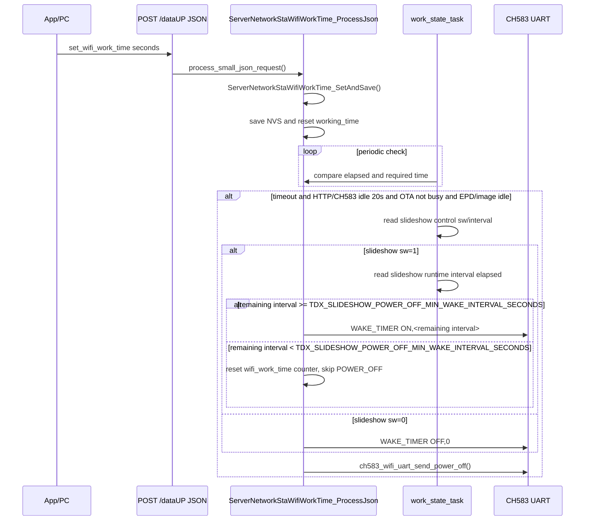
```mermaid
sequenceDiagram
    participant APP as App/PC
    participant DATAUP as POST /dataUP JSON
    participant WT as ServerNetworkStaWifiWorkTime_ProcessJson
    participant TIMER as work_state_task
    participant CH583 as CH583 UART
    APP->>DATAUP: set_wifi_work_time seconds
    DATAUP->>WT: process_small_json_request()
    WT->>WT: ServerNetworkStaWifiWorkTime_SetAndSave()
    WT->>WT: save NVS and reset working_time
    loop periodic check
        TIMER->>WT: compare elapsed and required time
    end
    alt timeout and HTTP/CH583 idle 20s and OTA not busy and EPD/image idle
        TIMER->>TIMER: read slideshow control sw/interval
        alt slideshow sw=1
            TIMER->>TIMER: read slideshow runtime interval elapsed
            alt remaining interval >= TDX_SLIDESHOW_POWER_OFF_MIN_WAKE_INTERVAL_SECONDS
                WT->>CH583: WAKE_TIMER ON,<remaining interval>
            else remaining interval < TDX_SLIDESHOW_POWER_OFF_MIN_WAKE_INTERVAL_SECONDS
                WT->>WT: reset wifi_work_time counter, skip POWER_OFF
            end
        else slideshow sw=0
            WT->>CH583: WAKE_TIMER OFF,0
        end
        WT->>CH583: ch583_wifi_uart_send_power_off()
    end
```

树状时序：

```text
main/main.c
└─ ServerNetworkStaWifiWorkTime_Init()
   ├─ set CH583 UART startup-pending guard before work_state_task
   ├─ load_work_state_from_nvs()
   ├─ load_work_time_vars_from_app_nvs()
   └─ xTaskCreate(work_state_task)

main/main.c
└─ Ch583UartApp_Init()
   └─ ServerNetworkStaWifiWorkTime_OnCh583Initialized()
      ├─ clear CH583 UART startup-pending guard
      └─ start a fresh 20-second CH583 activity hold
HTTP small JSON set_wifi_work_time
└─ receive_data_redirect_handler()
   └─ process_small_json_request()
      └─ ServerNetworkStaWifiWorkTime_ProcessJson()
         └─ ServerNetworkStaWifiWorkTime_SetAndSave()
            ├─ clamp seconds
            ├─ save_work_state_to_nvs()
            └─ save_work_time_vars_to_app_nvs()

work_state_task()
├─ LED cancel pending
│  └─ retry UserLedStatus_CancelPowerOffSync() before all ordinary guards
├─ CH583 startup pending
│  └─ postpone POWER_OFF until CH583 UART initialization completes
├─ update_working_time_seconds()
├─ elapsed <= server_required_continue_work_time
│  └─ keep running
├─ elapsed > server_required_continue_work_time && OTA receive/write busy
│  └─ ignored during OTA
├─ elapsed > server_required_continue_work_time && EPD busy
│  └─ postpone POWER_OFF until EPD task completes
├─ elapsed > server_required_continue_work_time && image save busy
│  └─ postpone POWER_OFF until save and cleanup complete
├─ elapsed > server_required_continue_work_time && last HTTP activity < 20 seconds
│  └─ postpone POWER_OFF until 20 seconds after the latest HTTP activity
├─ elapsed > server_required_continue_work_time && last CH583 initialization/business activity < 20 seconds
│  └─ postpone POWER_OFF until 20 seconds after the latest CH583 activity
└─ elapsed > server_required_continue_work_time && all guards idle
   ├─ ServerNetworkStaSlideshow_IsSavedEnabled("/data")
   ├─ sw=1
   │  ├─ ServerNetworkStaSlideshow_GetRuntimeTiming()
   │  ├─ runtime 正在等待 interval 时，wake_interval = max(runtime_interval - elapsed - startup_delay_seconds, 1)
   │  ├─ wake_interval < TDX_SLIDESHOW_POWER_OFF_MIN_WAKE_INTERVAL_SECONDS 时，重置 wifi_work_time 运行时计时并跳过 POWER_OFF；保留本次尝试时间，按 20 秒节流后再评估
   │  └─ wake_interval >= TDX_SLIDESHOW_POWER_OFF_MIN_WAKE_INTERVAL_SECONDS 时，ch583_wifi_uart_send_wake_timer_on(wake_interval)
   ├─ sw=0 / control missing / parse failed
   │  └─ ch583_wifi_uart_send_wake_timer_off()
   ├─ 超时后立即发送一次；之后每 20 秒重发一次 WAKE_TIMER / LED 关闭 / POWER_OFF
   ├─ 关机流程中发给 CH583/CH585 的命令之间至少间隔 100ms
   ├─ WAKE_TIMER 检查允许继续关机后，设置 LED power-off pending
   ├─ UserLedStatus_PreparePowerOffSync()
   ├─ 后续关机中止时，回滚本次已开启的 WAKE_TIMER；失败则在每轮任务开始时优先重试
   ├─ 获取 EPD/SD 共用 SPI 锁并在锁内再次执行关机 guard
   ├─ ch583_wifi_uart_send_power_off()
   │  ├─ 发送失败：GPIO4 保持 HIGH，释放 SPI 锁并回滚 LED/WAKE_TIMER
   │  └─ UART 发送成功：保持 GPIO4 HIGH，等待 CH583 关闭 ESP32/WiFi 电源
   └─ 2 秒后仍未被 CH583 断电则 esp_restart()，重新初始化并挂载 SD
```

V2 协议资料拆分：

```json
{
  "func": "set_wifi_work_time",
  "seconds": 300
}
```

字段说明：

```text
seconds WiFi 工作时长，单位秒，网络 HTTP 只接受该字段和严格十进制整数，允许范围 0..3600；旧字段 `time` 不再支持并返回参数非法。
网络 JSON 的 `func` 判断支持空格、CRLF 和 PowerShell `ConvertTo-Json` 输出格式。
```


存 / 取信息（含条件限制）：

```text
存：
- save_work_state_to_nvs() 写入 namespace=USER_WORK_STATE_NVS_NAMESPACE 的 USER_WORK_STATE_NVS_KEY blob。
- save_work_time_vars_to_app_nvs() 写入 PhotoPainter 下的 SERVER_REQUIRED_CONTINUE_WORK_TIME_NVS_KEY 与 WIFI_STANDBY_TIME_S_NVS_KEY 字符串。

取：
- load_work_state_from_nvs() 读取工作状态 blob。
- load_work_time_vars_from_app_nvs() 读取兼容字符串 key。
- `seconds=0` 时 `server_required_continue_work_time` 与 `wifi_standby_time_s` 都按 0 保存和恢复，不再把 standby 的 0 替换为默认 15。
- work_state_task() 读取 RAM 中计时值；CH583 UART 初始化完成前禁止关机，DEVICE_INFO 是否到达不参与关电判断；超时后如果最近一次 HTTP 或 CH583 合法业务活动不足 20 秒、OTA 接收/写入忙、EPD task 忙或图片保存忙则推迟；所有保护解除后才先配置 CH583 WAKE_TIMER，再发送 CH583 POWER_OFF。
- ServerNetworkStaWifiWorkTime_OnHttpNetworkActivity() 只记录 HTTP 活动 tick；请求入口、每次成功接收 HTTP body 数据块以及长文件、目录列表、缩略图成功发送数据块时刷新，20 秒保护只在 RAM 中生效，不重置保存的完整工作时间。原 ServerNetworkStaWifiWorkTime_OnNetworkData() 继续供 BLE/CH583、EPD 等原调用方使用。
- wifi_work_time 初始化时只设置 CH583 UART startup-pending guard，该 guard 不受 20 秒超时限制；`ServerNetworkStaWifiWorkTime_OnCh583Initialized()` 清除 UART guard，并开始新的 20 秒 CH583 活动保护。
- ServerNetworkStaWifiWorkTime_OnCh583Activity() 只记录 CH583 活动 tick；合法 DEVICE_INFO、单帧及每个有效 BLE_DATA 分片刷新。PING/PONG、ACK/ERR、GPIO_VALUE、TIME_STATUS、NFC_STATUS 不刷新。
- LED 关机准备完成后立即执行 final guard；若工作计时已被 USB/BLE 等活动重置，或此时出现 HTTP、CH583、OTA、EPD、图片保存活动，则设置 LED cancel-pending 状态并调用 `UserLedStatus_CancelPowerOffSync()`，同时把本次已开启的 CH583 WAKE_TIMER 回滚为 `OFF,0`。LED 或 WAKE_TIMER 取消失败时，`work_state_task()` 后续每轮都优先重试；两项都取消成功前不进入普通活动保护或新的关机流程。LED 准备失败或 `POWER_OFF` 发送失败时也执行相同的 WAKE_TIMER 回滚，避免 ESP32 继续运行期间遗留旧唤醒定时器。
- TdxImageTransfer_ProcessItems() 在 cast/upload/cast2pic 发现本次需要保存图片时设置 image_save_busy，并覆盖后续 EPD 显示、保存和 cleanup；显示失败、保存成功、保存失败或 cleanup 后都会清除。work_state_task() 在所有 POWER_OFF 前检查 image_save_busy，busy 时不发送 WAKE_TIMER / LED 关闭 / POWER_OFF，只推迟到保存完成后的下一轮继续关机判断。
- EPD 完成低功耗倒计时开启时，每个 EPD display job 完成后只请求一次运行时倒计时；倒计时到期后，只有 `epd_mode=1(SLIDESHOW)` 才检查下一次轮播剩余时间，如果剩余时间不大于 60 秒，不关机并恢复 one-shot 前的运行时目标；非轮播模式不做该判断，直接进入现有关机流程；下一次 EPD job 完成才会再次请求。
- 轮播开启时，WAKE_TIMER 优先使用 RTC 轮播的 `next_epoch - now_epoch` 剩余秒数，并扣除开机自动恢复轮播延迟和额外提前量：`remain - (startup_delay_seconds + TDX_SLIDESHOW_WAKE_EXTRA_ADVANCE_SECONDS)`；其中 `startup_delay_seconds = ceil(TDX_SLIDESHOW_STARTUP_DELAY_MS / 1000)`，当前为 10 秒，`TDX_SLIDESHOW_WAKE_EXTRA_ADVANCE_SECONDS` 当前为 20 秒，总提前 30 秒。若当前不是 RTC 轮播或 RTC timing 不可用，则回退使用旧 runtime timing：`runtime_interval - 已走秒数 - 总提前秒数`；再不可用才回退 control 文件中的 interval。若计算出的 wake_interval 小于 `TDX_SLIDESHOW_POWER_OFF_MIN_WAKE_INTERVAL_SECONDS=10`，ESP32 不发送 WAKE_TIMER ON/OFF，也不发送 POWER_OFF，只重置 wifi_work_time 运行时计时；关机流程仍按独立的 20 秒重试节流再次评估。该分支不会设置 LED power-off pending。轮播配置自身的最小间隔仍由 `TDX_SLIDESHOW_INTERVAL_MIN_SECONDS=60` 控制。
```

work_state 栈大小要求：

```text
USER_WORK_STATE_TASK_STACK_SIZE 默认使用 8 * 1024。
不要改回 3 * 1024。

原因：
work_state_task() 不是只做简单计时。工作时间超时后，它会执行关机前完整链路：
1. 先确认 CH583 UART 已初始化、最近一次 HTTP 与 CH583 合法业务活动都已过去 20 秒、OTA receive/write hold 均已解除、EPD task 空闲且图片保存不忙；DEVICE_INFO 是否到达不参与判断，其他任一保护条件不满足时不关机。
2. 读取 slideshow control，决定 WAKE_TIMER ON/OFF。
3. slideshow 开启时优先读取 RTC schedule timing，使用 `next_epoch - now_epoch` 作为剩余秒数，并额外扣掉 `TDX_SLIDESHOW_STARTUP_DELAY_MS` 换算后的 10 秒和 `TDX_SLIDESHOW_WAKE_EXTRA_ADVANCE_SECONDS=20` 秒；若没有 RTC timing，再回退旧 runtime timing。若剩余 wake_interval 小于 `TDX_SLIDESHOW_POWER_OFF_MIN_WAKE_INTERVAL_SECONDS=10`，不发送 WAKE_TIMER ON/OFF、不设置 LED power-off pending、不发送 POWER_OFF，只重置 wifi_work_time 运行时计时；关机流程仍按 20 秒重试节流再次评估。否则发送 CH583 WAKE_TIMER ON。
4. 调用 `UserLedStatus_PreparePowerOffSync()`，等待 LED Task 停止 RED/GREEN 闪烁并强制关闭后，再执行 final guard；若出现新任务则通过 `UserLedStatus_CancelPowerOffSync()` 解除关机锁并恢复基础灯效，并发送 `WAKE_TIMER OFF,0` 撤销本次关机尝试设置的唤醒定时器。LED 准备失败或 `POWER_OFF` 发送失败时也撤销该定时器；取消发送失败则保留待重试状态，后续每轮优先重试。
5. 取得 EPD/SD 共用 SPI 锁，并在锁内再次检查工作计时、HTTP、CH583、OTA、EPD 和图片保存 guard；出现新任务就释放锁并回滚 LED/WAKE_TIMER。
6. 发送 CH583 POWER_OFF；UART 发送失败时 GPIO4 保持 HIGH，释放 SPI 锁并取消 LED 关机状态及 WAKE_TIMER。
7. UART 发送成功后保持 GPIO4 HIGH，不调用 `ServerNetworkStaEpdDisplay_SetPower(false)`；继续等待 CH583 关闭 ESP32/WiFi 电源，2 秒后设备仍运行则沿用原逻辑调用 `esp_restart()`。

这些调用会进入 CH583 V1 组帧、UART 写入、调试输出等函数，栈上存在多个局部 buffer。
如果栈只有 3 * 1024，可能在超时关机流程中触发 Stack protection fault。
```

[⬆ 返回目录](#toc) | [↩ 返回当前目录](#sec-07)

---

### 7.13 time：RTC 默认时间与 SNTP 网络校时 <span id="sec-07-13"></span>

结果码以 [README_Result_Code.md](README_Result_Code.md) 为准。

功能说明：ESP32-C5 启动后初始化系统时间模块，使用 `RTC + high-resolution timer` 作为系统时间源。开机时先设置中国时区 `CST-8`，只在当前 RTC / 系统时间无效时设置默认时间 `2026-01-01 00:00:00`；如果 RTC 时间已经有效，则保留现有时间，不强制覆盖。WiFi STA 获取 IP 后启动 SNTP，从阿里云 NTP 服务器同步网络时间，SNTP 成功后 ESP-IDF 自动更新系统时间。

配置要求：

```ini
CONFIG_LIBC_TIME_SYSCALL_USE_RTC_HRT=y
CONFIG_LWIP_SNTP_MAX_SERVERS=3
CONFIG_LWIP_SNTP_UPDATE_DELAY=3600000
```

SNTP 服务器：

```text
ntp.aliyun.com
ntp1.aliyun.com
ntp2.aliyun.com
```

Mermaid 时序图：

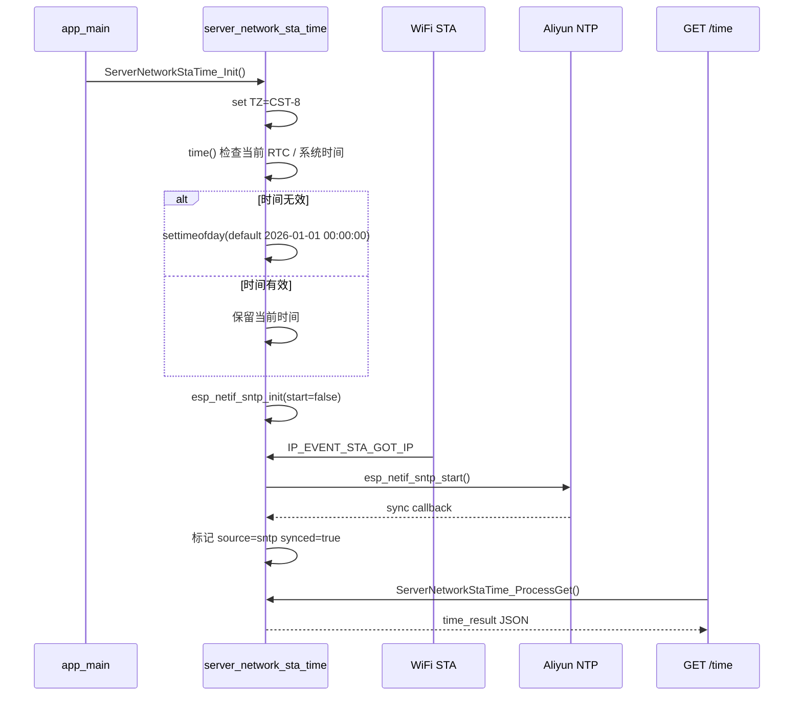
```mermaid
sequenceDiagram
    participant APP as app_main
    participant TIME as server_network_sta_time
    participant WIFI as WiFi STA
    participant SNTP as Aliyun NTP
    participant HTTP as GET /time
    APP->>TIME: ServerNetworkStaTime_Init()
    TIME->>TIME: set TZ=CST-8
    TIME->>TIME: time() 检查当前 RTC / 系统时间
    alt 时间无效
        TIME->>TIME: settimeofday(default 2026-01-01 00:00:00)
    else 时间有效
        TIME->>TIME: 保留当前时间
    end
    TIME->>TIME: esp_netif_sntp_init(start=false)
    WIFI->>TIME: IP_EVENT_STA_GOT_IP
    TIME->>SNTP: esp_netif_sntp_start()
    SNTP-->>TIME: sync callback
    TIME->>TIME: 标记 source=sntp synced=true
    HTTP->>TIME: ServerNetworkStaTime_ProcessGet()
    TIME-->>HTTP: time_result JSON
```

树状时序：

```text
main/main.c
└─ app_main()
   ├─ esp_netif_init()
   ├─ esp_event_loop_create_default()
   └─ ServerNetworkStaTime_Init()
      ├─ setenv("TZ", "CST-8", 1)
      ├─ tzset()
      ├─ ServerNetworkStaTime_SetDefaultIfInvalid()
      │  ├─ time()
      │  ├─ 时间 >= 2026 年：保留现有 RTC / 系统时间
      │  └─ 时间 < 2026 年：settimeofday(default)
      ├─ esp_event_handler_register(IP_EVENT_STA_GOT_IP)
      └─ esp_netif_sntp_init(start=false)

WiFi got IP
└─ ip_event_handler()
   └─ esp_netif_sntp_start()

GET /time
└─ file_server.c download_get_handler()
   └─ ServerNetworkStaTime_ProcessGet()
      ├─ ServerNetworkStaTime_GetInfo()
      └─ 返回 time_result JSON
```

HTTP 请求：

```text
GET /time
GET /time?t=123
```

SNTP 同步成功响应示例：

```json
{
  "func": "time_result",
  "result": 0,
  "message": "ok",
  "valid": true,
  "synced": true,
  "source": "sntp",
  "server": "ntp.aliyun.com",
  "timezone": "CST-8",
  "epoch": 1783070000,
  "local": "2026-07-03 20:33:20",
  "utc": "2026-07-03 12:33:20"
}
```

未同步但已设置默认时间响应示例：

```json
{
  "func": "time_result",
  "result": 1,
  "message": "using default time",
  "valid": true,
  "synced": false,
  "source": "default",
  "server": "ntp.aliyun.com",
  "timezone": "CST-8",
  "epoch": 1767196800,
  "local": "2026-01-01 00:00:00",
  "utc": "2025-12-31 16:00:00"
}
```

存 / 取信息（含条件限制）：

```text
存：
- 不写 NVS、不写 SD。
- 当前 RTC / 系统时间无效时，使用 settimeofday() 写入默认时间。
- SNTP 同步成功后，由 ESP-IDF SNTP 默认立即同步模式更新系统时间。

取：
- ServerNetworkStaTime_GetInfo() 读取 time() 当前时间。
- valid 判断以本地时间年份 >= 2026 为准。
- source=default 表示使用默认兜底时间或启动时保留的有效时间；source=timestamp 表示使用 APP / PC 下发的 timestamp 写入 RTC；source=sntp 表示 SNTP 已成功同步。
- sntp_synced 只表示本轮启动后是否收到 SNTP 同步回调。
```

[⬆ 返回目录](#toc) | [↩ 返回当前目录](#sec-07)

---

### 7.14 factory_reset：GPIO28/PB1 恢复出厂 <span id="sec-07-14"></span>

功能说明：GPIO28继续作为本地恢复出厂按键，默认高电平、按下为低电平，每300ms检测并要求连续低电平达到 `TDX_FACTORY_RESET_HOLD_MS=5000` ms。CH583的PB1通过首次 `DEVICE_INFO.wake_reason=KEY_PB1` 或合法的 `KEY_EVENT ARG=PB1,PRESS` 提交同一恢复出厂逻辑；KEY_EVENT不依赖DEVICE_INFO状态，UART任务只保存RAM请求。原5KB Factory Reset任务继续负责GPIO28/PB1检测和请求状态，确认执行后把小型trigger/seq payload提交给永久常驻统一任务 `owner=FACTORY_RESET`；文件、NVS和EPD逻辑不再在检测任务中执行。帧格式及USB独立重启规则见 [README_Protocol.md](README_Protocol.md#sec-13-local-image)。

安全边界：

```text
删除图片、播放状态和已保存的 WiFi 凭据：
/data/bin_img/*.bin
/data/jpg_img/*.jpg
/data/cast_img/*.bin
/data/cast_img/*.jpg
默认 NVS image_state:slide_cfg 删除
默认 NVS image_state:slide_ctl 删除
默认 NVS image_state:last_cast 删除
NVS: slide_progress
NVS: slide_last
NVS: daily_cfg 删除
NVS: epd_mode 强制写入并读回校验 USER_EPD_DISPLAY_MODE_DEFAULT
NVS namespace wifi: 全部键删除
NVS namespace nvs.net80211: sta.ssid / sta.pswd 删除

必须保留，不允许清除：
EPD type
WiFi 工作时间 / standby 时间
CH583 BLE MAC
CH583/CH585 时间备份和其它通信状态
OTA 状态
```

运行规则：

```text
EPD busy 时不检测 GPIO28，不累计按键时间。
只有 EPD IDLE 时，GPIO28 task 才读取按键。
短按或误按不设置关机保护；只有连续低电平达到 5000 ms、正式确认执行恢复出厂后，才在删除文件和修改 NVS 前设置 Factory Reset guard，阻止普通 work_state_task 抢先关机。
PB1请求使用IDLE/PENDING/RUNNING/COMPLETED RAM状态合并重复帧；请求早于Factory Reset初始化时先保留PENDING，任务创建成功后补设guard，任务已就绪时接受请求后立即设guard并等待EPD空闲。
确认执行时不在检测任务中等待其他图片owner：FACTORY_RESET可替换普通pending图片命令，并非阻塞停止DAILY、SLIDESHOW和LOCAL_IMAGE；当前EPD或已经成为current的投屏事务安全结束后，由统一任务串行执行FACTORY_RESET。FACTORY_RESET一旦pending/current，其他图片owner不得覆盖。
统一任务提交临时失败时把RUNNING恢复为PENDING并保留guard，由300ms检测周期继续提交；成功提交前不得删除文件或修改NVS。
触发后先停止轮播，再删除 upload/slideshow 图片、cast/cast2pic 缓存图片和轮播配置。
先把 `epd_mode` 强制保存为 `USER_EPD_DISPLAY_MODE_DEFAULT`；即使当前已经是默认模式也重新写入并读回校验。只有保存成功后才删除 `daily_cfg`，避免运行中的 daily worker 恢复已清除配置。
文件不存在按无需删除处理；实际文件删除失败、路径过长或目录读取错误进入最终 `ret`，恢复失败时不设置欢迎图待显示标志，也不显示白屏。
全部清理成功后，把 `PhotoPainter:fr_welcome` 写入并读回校验为1，再按 `WHITE=0x11` 填充当前屏幕大小的一份PSRAM缓冲区并同步等待白屏实际显示完成。白屏不新增固件图片常量，显示完成后释放缓冲区。
白屏显示成功后发送未配网 WIFI_PROVISION 并结束本次 Factory Reset；不向 work_state_task 提交专用关机请求，不发送 Factory Reset 专用 `WAKE_TIMER` 或 `POWER_OFF`，ESP32保持运行和白屏状态。标志保存、内存分配、入队或白屏显示失败时记录关键错误；已经成功保存的标志仍保留供以后冷启动恢复。
成功或失败都必须清除 Factory Reset guard，避免影响之后的普通关机；清除guard不会触发Factory Reset专用重启。
`fr_welcome`一直保留到客人以后真正开机。该次冷启动先完成EPD初始化、存储挂载和Factory Reset初始化，再在网络业务启动前检查标志；值为1时显示固件内置的 `DOC/welcome.bin` zlib欢迎图，显示成功后删除标志并完成整个Factory Reset流程，失败则保留标志供下次冷启动重试。存储未就绪时不显示且不清除标志。
取消Factory Reset专用断电重启不修改普通 wifi_work_time、轮播或 DAILY 的既有关机规则。
长按触发后进入等待松手状态；GPIO28 恢复高电平前不会再次触发。
Factory Reset代码不再保留完成后调用 `esp_restart()` 的条件分支；ESP32和CH583都不执行专用重启，欢迎图等待客人以后开机时显示。
```

关键日志：

```text
factory reset gpio init pin=28 active=0 check_ms=300 hold_ms=5000
factory reset button held gpio=28 hold_ms=5100, start clear images
factory reset worker submitted source=GPIO28 seq=0 generation=...
image_worker: job start owner=FACTORY_RESET generation=...
factory reset welcome pending saved
factory reset white display completed color=0x11
factory reset done source=GPIO28 seq=0 ret=ESP_OK upload_bin_deleted=... upload_jpg_deleted=... cast_bin_deleted=... cast_jpg_deleted=... cfg_deleted=... file_delete_failed=0 file_ret=ESP_OK nvs_ret=ESP_OK welcome_pending_ret=ESP_OK white_display_ret=ESP_OK
image_worker: job done owner=FACTORY_RESET generation=... ret=ESP_OK min_free=... peak_used=... configured=12288
factory reset startup welcome begin
factory reset startup welcome completed, pending flag cleared
```

[⬆ 返回目录](#toc) | [↩ 返回当前目录](#sec-07)

---

### 7.15 daily_download_file：每日一图 <span id="sec-07-15"></span>

> 每日一图worker的任务生命周期、串行执行、取消及内存规则统一以 [第2章：永久常驻统一图片业务任务](#sec-02-image-business-worker) 为准。本节只说明每日一图自身业务规则。

APP通过 `/dataUP` small JSON 下发 `daily_download_file`。`sw=1` 要求完整的 `imageHeight/imageWidth/orientation/api_url/timestamp`；每次合法请求都建立一次不受间隔限制的首次立即执行。首次完成后仍以APP的 `timestamp + N*86400` 为绝对时间槽，不改变APP锚点。

第二次及以后，原执行点为 `target-slideshow_rtc_display_lead_seconds()`；若距离上次每日一图EPD调用不足300秒，只把本槽推迟到满300秒，后续槽仍按原timestamp计算。EPD调用前持久化 `last_daily_epd_epoch`，显示失败也受该间隔限制；下载失败且未调用EPD时不更新。每周期下载最多3次、EPD只调用1次，失败保存1小时重试；提前不超过30秒在线等待，更早则设置CH583提前30秒唤醒。

`sw=0` 只要求 `func/sw`，停止daily和轮播并进入 `epd_mode=0`，保留 `daily_cfg`。`sw` 缺失、非精确整数或不是0/1返回1004。尺寸按 `imageHeight==EPD width`、`imageWidth==EPD height` 校验，`orientation` 为int16，`api_url` 是少于500字节的HTTPS URL。新 `sw=1` 要求本次启动SNTP可用且 `timestamp>now`；SNTP不可用返回1909，时间不在未来返回1904，均不修改已有状态。

#### 7.15.1 Mermaid 时序图 <span id="sec-07-15-1"></span>

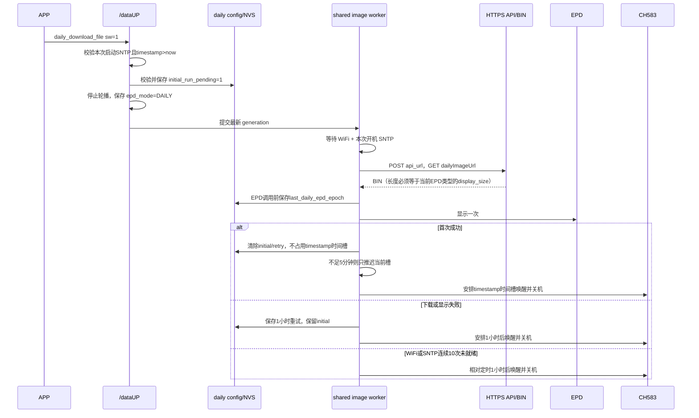
```mermaid
sequenceDiagram
    participant APP
    participant HTTP as /dataUP
    participant CFG as daily config/NVS
    participant WORK as shared image worker
    participant API as HTTPS API/BIN
    participant EPD
    participant CH as CH583
    APP->>HTTP: daily_download_file sw=1
    HTTP->>HTTP: 校验本次启动SNTP且timestamp>now
    HTTP->>CFG: 校验并保存 initial_run_pending=1
    HTTP->>HTTP: 停止轮播，保存 epd_mode=DAILY
    HTTP->>WORK: 提交最新 generation
    WORK->>WORK: 等待 WiFi + 本次开机 SNTP
    WORK->>API: POST api_url，GET dailyImageUrl
    API-->>WORK: BIN（长度必须等于当前EPD类型的display_size）
    WORK->>CFG: EPD调用前保存last_daily_epd_epoch
    WORK->>EPD: 显示一次
    alt 首次成功
        WORK->>CFG: 清除initial/retry，不占用timestamp时间槽
        WORK->>WORK: 不足5分钟则只推迟当前槽
        WORK->>CH: 安排timestamp时间槽唤醒并关机
    else 下载或显示失败
        WORK->>CFG: 保存1小时重试，保留initial
        WORK->>CH: 安排1小时后唤醒并关机
    else WiFi或SNTP连续10次未就绪
        WORK->>CH: 相对定时1小时后唤醒并关机
    end
```

#### 7.15.2 相关目录 <span id="sec-07-15-2"></span>

```text
main/server_network_sta/daily_image/
├─ daily_image_config.c/.h              JSON、NVS、首次/重试/成功状态
├─ daily_image_schedule.c/.h            SNTP、首次立即、绝对时间槽
├─ daily_image_http.c/.h                HTTPS查询和BIN下载
└─ server_network_sta_daily_image.c/.h  worker、EPD、模式和关机编排

main/epd_display/                        EPD显示和epd_mode
main/server_network_sta/slideshow/       共用显示提前秒数
main/server_network_sta/wifi_work_time/  关机保护
main/ch583_uart/                         唤醒定时和POWER_OFF
main/tdx_cfg.h                           DAILY标志和限制
```

#### 7.15.3 启动时序 <span id="sec-07-15-3"></span>

```text
app_main
├─ EpdDisplayMode_Init()读取PhotoPainter:epd_mode
├─ ImageBusinessWorker_Init()创建12KB统一静态worker和单pending命令槽
├─ ServerNetworkStaDailyImage_Init()初始化daily配置mutex和基础状态
├─ 启动WiFi、HTTP和SNTP
└─ ServerNetworkStaDailyImage_StartSaved()
   ├─ 启动早期创建的统一worker永久常驻
   ├─ mode不是DAILY：统一worker保持空闲，不提交daily命令
   ├─ mode是DAILY：读取并校验daily_cfg
   ├─ retry_pending=1：先等待1小时重试点
   ├─ initial_run_pending=1：SNTP可用后立即执行
   ├─ 其他：按timestamp绝对时间槽执行，不足5分钟间隔则推迟本槽
   └─ WiFi或SNTP每5秒检查一次，10次失败后关机1小时再试
```

#### 7.15.4 接收解析树状时序 <span id="sec-07-15-4"></span>

```text
daily_download_file
├─ sw缺失、非整数或不是0/1 → 1004
├─ sw=0
│  ├─ 忽略其他字段
│  ├─ 停止轮播并确认show_control sw=0
│  ├─ 保存epd_mode=NORMAL
│  └─ 取消旧daily generation
└─ sw=1
   ├─ 校验当前EPD的imageHeight/imageWidth
   ├─ 校验orientation为int16
   ├─ 校验api_url为少于500字节的HTTPS URL
   ├─ 校验本次启动SNTP可用，否则1909且不改状态
   ├─ 校验timestamp为有效且大于now，否则1904且不改状态
   ├─ 使旧startup/APP generation失效
   ├─ 保存initial_run_pending=1并清除旧进度/重试/显示时间
   ├─ 停止轮播并保存epd_mode=DAILY
   ├─ 提交最新generation，首次不等待timestamp
   └─ 保存后任一步失败：恢复旧daily_cfg并进入NORMAL
```

#### 7.15.5 存 / 取信息（含条件限制） <span id="sec-07-15-5"></span>

```text
存：
- PhotoPainter:daily_cfg保存版本、CRC、尺寸、orientation、api_url、timestamp、
  initial_run_pending、retry状态、last_daily_epd_epoch和last_completed_target_epoch。
- PhotoPainter:epd_mode保存NORMAL/SLIDESHOW/DAILY/LOCAL_IMAGE_BROWSING；NVS `slide_ctl` 保存轮播启停和 RTC anchor。
- BIN只在PSRAM中下载并交给EPD，不写SD；mbedTLS大块内存可按项目malloc策略进入PSRAM。ESP32-C5硬件AES在TLS批量读取期间会动态申请DMA描述符或临时缓冲，实测即使 `CONFIG_SPIRAM_MALLOC_RESERVE_INTERNAL=98304` 仍可能因DMA连续块碎片化返回 `esp-aes: Failed to allocate memory`。因此正式配置关闭 `CONFIG_MBEDTLS_HARDWARE_AES`，保留 `CONFIG_MBEDTLS_AES_C=y` 使用mbedTLS软件AES；硬件SHA、MPI和ECC保持开启，TLS算法和安全性不变。96KB internal reserve继续保留给WiFi、SPI等显式internal/DMA用户。每次HTTPS POST/GET前沿用一条 `TLS heap before` 关键日志，同时打印internal、DMA、PSRAM的free/largest及 `aes=software`，不增加额外日志行。
- `api_url`和`dailyImageUrl`都必须直接返回HTTPS 2xx；当前关闭自动重定向，不接受30x。

取：
- 启动只在epd_mode=DAILY时读取daily_cfg；blob大小、版本、CRC、URL、时间或状态非法则拒绝。
- retry优先，initial其次，普通timestamp时间槽最后。
- 新sw=1的首次立即执行不检查间隔；普通槽和retry检查last_daily_epd_epoch。
- 当前槽只有EPD显示成功并且状态写回NVS成功后才算完成。

条件：
- 每条合法sw=1都重新产生一次首次立即执行；每个执行周期API/下载最多3次，失败后保存1小时重试，EPD不重试。
- 5分钟间隔只约束同一配置的第二次及以后；APP重复下发合法sw=1会再次触发不受限制的首次执行。
- cast/cast2pic切换NORMAL，slideshow/slideshow_control切换SLIDESHOW，都会停止daily。
- 已经开始的EPD刷新不强制中断；旧generation不得覆盖APP刚保存的新配置。
- daily重复检查关机时保留已激活的一次性截止时间，不重新开始倒计时。
- daily申请一次性关机时记录DAILY owner；模式切换只取消DAILY拥有的一次性关机，不取消其他功能新建的倒计时。
- daily one-shot激活后若cast/cast2pic/slideshow把模式切离DAILY，恢复原工作时间并取消旧daily关机。
- daily、slideshow、Local Image Browsing、cast和cast2pic共用12KB内部RAM静态 `image_business_worker`、一个静态TCB、一个静态状态mutex和一个640字节单pending命令槽；统一worker在WiFi、HTTP和USB等可选服务之前创建并永久常驻。旧daily queue、独立daily/轮播/Local/cast保存/USB worker任务均已取消。启动打印一次统一静态资源，命令完成时打印owner、返回值、最小栈余量和峰值，正常空闲不重复打印。
- 新配置保存后若停止轮播、模式或任务提交失败，恢复旧daily_cfg；不自动恢复轮播，模式保持NORMAL。
- 新配置首次保存失败时尚未停止轮播：恢复旧daily_cfg并保留原NORMAL/SLIDESHOW；旧模式为DAILY时回到NORMAL。
```

正式result code为 `1901~1909`，见 `README_Result_Code.md`。

[⬆ 返回目录](#toc) | [↩ 返回当前目录](#sec-07)

---

## 13. 状态灯 <span id="sec-13"></span>

状态灯严格集中在 `main/led_status/`。系统只创建一个 `UserLedStatus_Task()`；WiFi、HTTP、存储、网络、UART、EPD、OTA、Factory Reset 和关机模块只向 LED event queue 报告事实，不直接控制 PB5/PB6，也不决定闪烁速度。红绿灯的最终状态、优先级、临时保持和恢复全部由 LED Task 统一计算。

单 Task 数据流：

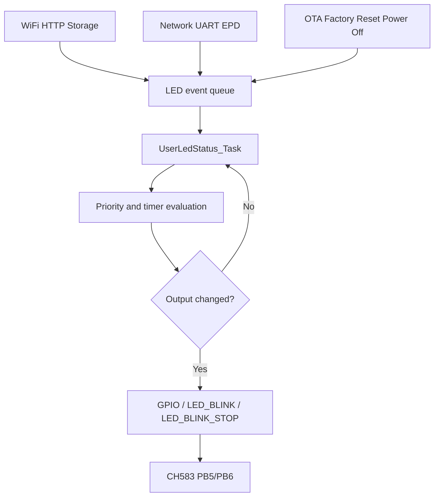
```mermaid
flowchart TD
    A[WiFi HTTP Storage] --> Q[LED event queue]
    B[Network UART EPD] --> Q
    C[OTA Factory Reset Power Off] --> Q
    Q --> T[UserLedStatus_Task]
    T --> P[Priority and timer evaluation]
    P --> D{Output changed?}
    D -- No --> T
    D -- Yes --> U[GPIO / LED_BLINK / LED_BLINK_STOP]
    U --> H[CH583 PB5/PB6]
```

闪烁参数表示一次 ON 或 OFF 的翻转间隔，不是完整周期：

| 名称 | 亮灯 | 灭灯 | 完整周期 | 用途 |
|---|---:|---:|---:|---|
| 快闪 | 600 ms | 600 ms | 1.2 秒 | READY 心跳、网络/UART 大数据 |
| 中闪 | 1200 ms | 1200 ms | 2.4 秒 | WiFi/HTTP 启动、HTTP/存储故障、OTA |
| 慢闪 | 2400 ms | 2400 ms | 4.8 秒 | EPD 刷新、WiFi 配置/认证故障 |

### 13.1 完整状态与灯效表 <span id="sec-13-1"></span>

| 设备状态 | 绿灯 | 红灯 | 具体时间 | 含义 |
|---|---|---|---|---|
| 设备关机 | 关闭 | 关闭 | 持续 | POWER_OFF 前已停止闪烁并强制关闭 PB5/PB6 |
| 设备刚启动 | 常亮 | 关闭 | 启动初始化期间 | CH583 UART 已就绪，系统正在初始化其他模块 |
| WiFi 正在连接 | 中闪 | 关闭 | 亮 1.2 秒、灭 1.2 秒 | 正在扫描、认证和关联路由器 |
| 等待 DHCP 分配 IP | 中闪 | 关闭 | 亮 1.2 秒、灭 1.2 秒 | 已关联 AP，正在等待 IP |
| WiFi 断线自动重连 | 中闪 | 关闭 | 亮 1.2 秒、灭 1.2 秒 | 网络暂时断开，正在自动恢复 |
| 已取得 IP，HTTP 尚未 READY | 中闪 | 关闭 | 亮 1.2 秒、灭 1.2 秒 | 已有 IP，HTTP Server 或关键接口仍在启动 |
| 网络和 HTTP 服务 READY | 快闪 | 关闭 | 亮 600 ms、灭 600 ms | 设备正常工作，可使用 ping、cast、upload 等功能 |
| 短网络/UART 通信 | 保持基础状态 | 短暂常亮 | 最多 300 ms | 短数据任务结束后立即恢复 |
| 网络大数据传输 | 保持基础状态 | 快闪 | 亮 600 ms、灭 600 ms | cast、cast2pic、upload 或 multipart 数据传输 |
| UART 大量接收或发送 | 保持基础状态 | 快闪 | 亮 600 ms、灭 600 ms | ESP32-C5 与 CH583 传输较多数据 |
| EPD 正在刷新 | 保持基础状态 | 慢闪 | 亮 2.4 秒、灭 2.4 秒 | EPD 活动优先于同时发生的网络/UART 活动 |
| EPD 刷新完成 | 恢复基础状态 | 关闭或恢复其他活动 | 立即恢复 | EPD source 计数归零后重新计算灯效 |
| 普通操作成功 | 常亮 | 关闭 | 保持 1000 ms | cast、保存、删除或显示成功，之后恢复最新基础状态 |
| WiFi 没有配置 | 关闭 | 慢闪 | 亮 2.4 秒、灭 2.4 秒 | 没有有效 SSID/密码，需要重新配置 |
| WiFi 认证失败 | 关闭 | 慢闪 | 亮 2.4 秒、灭 2.4 秒 | 密码、安全方式或连续认证失败 |
| HTTP Server 启动失败 | 关闭 | 中闪 | 亮 1.2 秒、灭 1.2 秒 | 已有网络但 HTTP 服务无法 READY |
| 存储不可用 | 关闭 | 中闪 | 亮 1.2 秒、灭 1.2 秒 | SD/SPIFFS 最终无法挂载或存储不可用 |
| 普通业务操作失败 | 保持基础状态 | 常亮 | 保持 3000 ms | 单次显示、保存、删除等可恢复操作失败 |
| OTA 升级中 | 常亮 | 中闪 | 红灯亮 1.2 秒、灭 1.2 秒 | 正在写入或校验固件，不允许断电 |
| Factory Reset 清理中 | 快闪 | 常亮 | 绿灯亮 600 ms、灭 600 ms | 正在清除图片、播放状态和 WiFi 配网 |
| 准备关机、倒计时中 | 常亮 | 关闭 | 倒计时期间持续 | EPD 工作完成，等待发送 POWER_OFF |
| 严重系统错误 | 关闭 | 常亮 | 持续 | 关键模块不可恢复错误 |
| 即将软件重启 | 关闭 | 常亮 | 保持到重启 | OTA 完成并准备重启 |

### 13.2 状态优先级 <span id="sec-13-2"></span>

多个状态同时存在时，LED Task 按以下顺序选择最终灯效：

```text
1. POWER_OFF 锁定或关机倒计时
2. 严重系统错误 / 即将重启
3. OTA
4. Factory Reset
5. WiFi 无配置或认证失败
6. HTTP 或存储故障
7. EPD 刷新
8. NETWORK / UART 活动
9. 成功或普通失败临时提示
10. 基础设备状态
```

`UserLedStatus_PreparePowerOffSync()` 使用 LED 模块专用 binary semaphore 等待结果。LED Task 只有在 RED/GREEN 的 `LED_BLINK_STOP` 和 PB5/PB6 关闭命令全部成功写入 UART 后，才设置永久关机锁、清除活动和临时结果并返回成功；任何命令写入失败都返回错误，本轮不发送 `POWER_OFF`。进入永久关机锁后，普通 LED 事件不能重新点亮 LED；如果 wifi_work_time final guard 发现新任务，`UserLedStatus_CancelPowerOffSync()` 会通过同一 LED Task 同步解除关机锁并恢复当前基础灯效。该同步结果确认的是 ESP32 UART 命令写入结果；CH583 的异步 ACK/ERR 仍由现有协议层处理。

### 13.3 活动计数与临时恢复 <span id="sec-13-3"></span>

```text
NETWORK、UART_RX、UART_TX、EPD 分别使用独立引用计数。
Activity Begin/End 使用可靠队列投递，保持引用计数成对，不使用可丢弃的普通事件等待时间。
NETWORK/UART 首个 Begin 后 RED 先常亮；300 ms 后仍活动才改为快闪。
EPD Begin 后 RED 直接慢闪，不等待 300 ms。
EPD 只允许通过 ActivityBegin/ActivityEnd 上报，不再由业务状态接口直接修改 EPD 计数。
EPD 与 NETWORK/UART 重叠时保持 EPD 慢闪；EPD 结束后若数据活动仍存在则恢复快闪。
成功提示保持 1000 ms；普通失败提示保持 3000 ms。
临时提示到期后恢复“当前最新”基础状态，不恢复事件发生时的旧快照。
```

### 13.4 模块边界与存取信息 <span id="sec-13-4"></span>

```text
存：
- LED 状态、故障标志、活动计数和 deadline 只保存在 RAM。
- 状态灯模块不写 NVS、SD 或 SPIFFS。

取：
- UserLedStatus_Task() 是唯一状态机和唯一 LED 物理输出者。
- 普通模块只通过 led_status.h 的公开接口投递事件。
- 常亮/关闭使用原 CMD=GPIO；闪烁使用 LED_BLINK / LED_BLINK_STOP。
- CH583 本地执行红绿灯定时翻转，ESP32-C5 不周期发送 GPIO 翻转。
- LED Task 只在目标输出变化时发送命令，避免重复 UART 流量。
- 普通灯效命令失败后以 500 ms 间隔最多重试 3 次；重试耗尽只记录一次 warning，等待下一次状态事件。
- 准备重启使用独立 restart-pending 状态，不与 fatal-error 标志混用。
```

[⬆ 返回目录](#toc) | [↩ 返回当前目录](#sec-13)

---

## 15. 四条主业务链路汇总 <span id="sec-15"></span>

Mermaid 总览图：

```mermaid
flowchart LR
    A[HTTP /dataUP] --> B{show/save}
    B -->|show=true| C[EPD display]
    B -->|save=true| D[SD save]
    E[USB HTTP-like] --> B
    F[Phone BLE] --> G[CH583 UART] --> H[WiFi config/wakeup]
    I[HTTP /ota] --> J[OTA partition] --> K[reboot]
```


存 / 取信息（含条件限制）：

```text
存：
- 网络/USB cast/cast2pic 写 /data/cast_img。
- 网络/USB upload 写 /data/bin_img 与 /data/jpg_img。
- OTA 链路写 OTA update partition。
- CH583 BLE 配网链路写 WiFi NVS。

取：
- 投图链路读取 request body / multipart；显示链路读取 display buffer。
- OTA 链路读取 firmware/meta；配网链路读取 JSON 与 NVS WiFi 配置。
```


### 15.1 网络投图链路 <span id="sec-15-1"></span>

Mermaid 时序图：

```mermaid
sequenceDiagram
    participant APP as App
    participant DATAUP as /dataUP
    participant SAVE as SD Save
    participant EPD as EPD Queue
    APP->>DATAUP: cast/upload/cast2pic
    opt show=true
        DATAUP->>EPD: queue current bin data
    end
    opt save=true
        DATAUP->>SAVE: save bin + jpg
    end
    DATAUP-->>APP: result JSON
```


```text
HTTP POST /dataUP
└─ receive_data_redirect_handler()
   ├─ ServerNetworkStaCast2Pic_Process()
   ├─ ServerNetworkStaCast_Process()
   └─ ServerNetworkStaUpload_Process()
      ├─ show=true
      │  └─ ServerNetworkStaEpdDisplay_QueueToScreenAndWait()
      ├─ cast/cast2pic save /data/cast_img/*.bin and *.jpg
      ├─ upload save /data/bin_img/*.bin and /data/jpg_img/*.jpg
      └─ cast save success
         └─ record last_cast
```


存 / 取信息（含条件限制）：

```text
存：
- network/USB cast 使用 TdxCastCore_ProcessValidatedCastDir()。
- show=true 时先等待 ServerNetworkStaEpdDisplay_QueueToScreenAndWait() 完成。
- network/USB cast/cast2pic save=true 时在统一业务上下文同步保存到 /data/cast_img；network/USB upload仍保存到 /data/bin_img 与 /data/jpg_img。
- 同步保存函数使用 <fileName>.<ext>.tmp 临时文件，写完校验大小后 rename 成正式文件。
- network/USB cast 的 last cast 文件名写入默认 NVS `image_state:last_cast` Blob。

取：
- check_save_space() 通过 example_storage_get_free_bytes() 读取剩余空间。
- 显示时下发已收到的 bin 数据到 EPD 显示任务并等待完成；启动时不读取或显示 last cast。
```

[⬆ 返回目录](#toc) | [↩ 返回第 15 节](#sec-15) | [↩ 返回当前目录](#sec-15-1)

---

### 15.2 USB HTTP-like 投图链路 <span id="sec-15-2"></span>

Mermaid 时序图：

```mermaid
sequenceDiagram
    participant PC as PC USB
    participant USB as UsbConsoleRouter
    participant SAVE as SD Save
    participant EPD as EPD Queue
    PC->>USB: HTTP-like image request
    USB->>SAVE: write bin/jpg
    USB->>EPD: optional display
    USB-->>PC: JSON response
```


```text
USB Serial/JTAG
└─ UsbConsoleEcho_Task()
   ├─ UsbConsoleHttp_TryParseRequest()
   ├─ UsbConsoleRouter_Handle()
   ├─ UsbConsoleCast_Process()
   ├─ TdxCastCore_ProcessValidatedCastDir()
   ├─ ServerNetworkStaEpdDisplay_QueueToScreenAndWait()
   └─ image_business_worker内同步保存 /data/cast_img
```


存 / 取信息（含条件限制）：

```text
存：
- USB cast 在 save=true 时通过统一任务调用 TdxCastCore_ProcessValidatedCastDir() 同步保存。
- 同步保存写入：/data/cast_img/<fileName>.bin。
- 同步保存写入：/data/cast_img/<fileName>.jpg。
- 同步保存使用临时文件写入并 rename 成正式文件。
- func=cast 且 save=true 时，同步保存写入 last cast 记录。
- 保存和 last cast 记录全部成功后，清理 /data/cast_img 中非本次 <fileName> 的旧 .bin/.jpg。

取：
- TdxCastCore_ParseAndValidate() 通过 UsbConsoleCommon_ExtractBoundary() 读取 multipart boundary。
- TdxCastCore_ParseAndValidate() 通过 UsbConsoleCommon_MultipartParts() 读取 fileName/bin_size/image_size/bin/image。
- TdxCastCore_ParseAndValidate() 校验 bin/image 实际长度是否等于声明大小。
- show=true 时下发已收到的 bin 数据到 EPD 显示任务并等待完成。
```

[⬆ 返回目录](#toc) | [↩ 返回第 15 节](#sec-15) | [↩ 返回当前目录](#sec-15-2)

---

### 15.3 CH583 BLE 配网链路 <span id="sec-15-3"></span>

Mermaid 时序图：

```mermaid
sequenceDiagram
    participant APP as Phone BLE
    participant CH583 as CH583
    participant ESP as ESP32-C5
    participant WIFI as WiFi STA
    APP->>CH583: JSON func=wifi
    CH583->>ESP: CMD=BLE_DATA
    ESP->>WIFI: connect ssid/key
    WIFI-->>ESP: GOT_IP
    ESP-->>CH583: CMD=WIFI_DATA
    CH583-->>APP: notify IP
```


```text
Phone BLE
└─ CH583
   └─ UART CMD=BLE_DATA
      └─ ch583_wifi_uart_process_bytes()
         └─ User_HandleWifiJsonTextFromCh583()
            ├─ parse_wifi_config_json()
            ├─ save WiFi NVS
            ├─ User_Network_mode_app_init()
            ├─ IP_EVENT_STA_GOT_IP
            └─ send_base_info_to_mobile()
               └─ ch583_wifi_uart_send_wifi_data()
```


存 / 取信息（含条件限制）：

```text
存：
- WifiConfigurationAp::Save() 保存 ssid/key。
- SsidManager::AddSsid() 写 namespace="wifi" 的 ssid/password。
- save_wifi_config_to_nvs() 写 namespace="nvs.net80211" 的 sta.ssid/sta.pswd blob。

取：
- parse_wifi_config_json() 读取 JSON 中 func/ssid/key。
- User_Network_mode_app_init() 后续读取 NVS 配置连接路由器。
```

[⬆ 返回目录](#toc) | [↩ 返回第 15 节](#sec-15) | [↩ 返回当前目录](#sec-15-3)

---

### 15.4 OTA 链路 <span id="sec-15-4"></span>

Mermaid 时序图：

```mermaid
sequenceDiagram
    participant APP as App/PC
    participant OTA as OTA Handler
    participant FLASH as OTA Partition
    APP->>OTA: firmware multipart
    OTA->>FLASH: esp_ota_write loop
    OTA->>FLASH: set boot partition
    OTA-->>APP: success/fail
```


```text
HTTP POST /ota or /ota_upload
└─ receive_data_redirect_handler()
   └─ NetworkOtaUpload_ProcessReceivedBody()
      ├─ parse meta
      ├─ validate firmware
      ├─ set OTA busy
      ├─ esp_ota_write()
      ├─ esp_ota_end()
      ├─ esp_ota_set_boot_partition()
      └─ esp_restart()
```

---


存 / 取信息（含条件限制）：

```text
存：
- esp_ota_write() 写入 OTA update partition。
- esp_ota_set_boot_partition() 保存下次启动分区选择。
- OTA HTTP body 接收与固件写入分别设置 WiFi 工作时间模块的 receive/write power hold；任一 hold 有效时都禁止超时 `POWER_OFF`。

取：
- 读取 multipart meta JSON、firmware/bin 字段。
- 读取当前 running partition、目标 update partition、固件 app_desc、版本信息。
```

[⬆ 返回目录](#toc) | [↩ 返回第 15 节](#sec-15) | [↩ 返回当前目录](#sec-15-4)

---


[⬆ 返回目录](#toc) | [↩ 返回当前目录](#sec-15)

---

## 20. zlib 压缩数据与 EPD 显示 <span id="sec-20-zlib"></span>

`USER_EPD_DISPLAY_DATA_ZLIB_ENABLE` 是唯一新增的正式功能宏。设为 `1` 时，网络、USB、轮播和每日一图交给公共 EPD 队列的业务 BIN 数据必须是 RFC 1950 zlib 数据；设为 `0` 时保持原来的未压缩数据行为。EPD 队列内部和具体屏幕驱动始终只接收解压后的原始显示数据。

对 cast、cast2pic 和 upload，宏为 `1` 时不把收到的压缩 BIN 长度与当前屏幕原始 `display_size`（例如960000字节）比较；`bin_size` 表示压缩后的实际传输长度，并继续与实际 `bin` part长度比较，防止截断数据通过校验。宏为 `0` 时沿用旧的raw流程。两种模式都保留请求总长度上限、非零长度、文件完整性、内存和存储空间检查。

模块边界：

```text
components/zlib/
└─ 只负责把项目根目录 zlib 源码注册为 ESP-IDF 组件

main/data_compression/
├─ tdx_zlib_buffer.c/.h
│  └─ 提供内存 zlib 解压和压缩上界计算
├─ tdx_zlib_file.c/.h
│  └─ 保留流式文件压缩和解压接口
└─ test/tdx_zlib_epd_test.c/.h
   └─ 读取已生成的 .zlib 文件并提交公共 EPD 显示入口
```

旧的压缩、解压和逐字节比较函数以及压缩文件 EPD 显示测试函数均保留。`main.c` 中的 `TdxZlibEpdTest_Run()` 启动调用代码也完整保留，当前使用局部 `#if 0` 关闭，没有增加临时测试宏；以后需要测试时可临时改为 `#if 1`。测试读取 `/data/bin_img/2486aad8763e9822.bin.zlib`，释放 SD 的 `TdxSharedSpi` 锁后，再把压缩缓冲区交给公共 EPD 队列，避免等待显示任务时持锁造成死锁。

公共 EPD 队列在宏为 `1` 时，按当前 `EpdType_GetCurrentConfig()->display_size` 申请 PSRAM并解压，实际解压长度必须严格等于屏幕需要的原始长度。解压成功后才进入原队列；失败不提交显示。EPD模块内部生成的色块测试数据继续走 raw内部入口，不受该宏影响。

轮播原有的文件名SHA-256诊断针对未压缩BIN。压缩模式下为避免对压缩字节计算后产生错误的mismatch日志，该诊断只打印一次跳过信息；轮播读取、排队和显示流程不变。

日志规则：

- zlib解压成功和压缩文件显示成功使用 `ESP_LOGI`，并输出输入、输出长度和耗时。
- SD卡不是当前存储时使用 `ESP_LOGW` 跳过启动测试。
- 文件读取、内存、zlib、解压长度或EPD显示失败使用 `ESP_LOGE`。

## Local Image Browsing 本地图片浏览 <span id="sec-local-image-browsing"></span>

`epd_mode=3(LOCAL_IMAGE_BROWSING)` 是独立持久模式。功能代码只位于 `main/local_image_browsing/`，专用宏统一定义在 `local_image_browsing.h`。启动读到模式3时恢复浏览游标，不启动 DAILY 或 SLIDESHOW，也不自动换图；首次 `DEVICE_INFO.wake_reason=KEY_PB2` 或合法的 `KEY_EVENT ARG=PB2,PRESS` 都可触发，KEY_EVENT不依赖DEVICE_INFO状态。UART早于本模块初始化收到的PB2事件进入长度为10的启动FIFO，初始化阶段按到达顺序逐个尝试；第一项预约EPD后，其余项仍按EPD BUSY规则拒绝，不合并也不丢失初始化交界点事件。帧格式及来源互斥规则见 [README_Protocol.md](README_Protocol.md#sec-13-local-image)。

BIN目录扫描不建立RAM或SD索引文件，只保留本次候选、候选后继和循环首项等少量17字节名称缓冲。原来的150项RAM列表已删除，静态内部RAM减少2556字节。Local独立8KB任务和长度1的FreeRTOS queue也已删除；请求作为 `owner=LOCAL_IMAGE` 提交给12KB永久常驻统一任务，栈余量由统一 `job done` 日志统计。

每个新的、合法且 ACK 成功的 PB2 事件尝试一次换图；相同KEY_EVENT SEQ或重复DEVICE_INFO不重复执行业务。先通过 EPD 专用空闲预留原子判断 BUSY/IDLE：BUSY 时本次事件立即结束，不排队、不切模式、不推进游标；IDLE 时预留 EPD，原子安装pending LOCAL_IMAGE并非阻塞使DAILY/SLIDESHOW失效，旧owner返回后由统一任务保存模式3并扫描 `/data/bin_img`。切换入口不使用 `StopAndWait()`。

目录候选只包含普通、非空、精确小写 `.bin` 文件，不递归目录，不读取 cast_img、jpg_img、`.bin.zlib` 或其他扩展名。每次PB2按不区分大小写的字典序单遍扫描，大小写相同时用区分大小写比较保证稳定；扫描同时计算显示项和下一项，末尾自动循环到目录最小项。目录项不缓存，因此本地浏览不再受150项RAM列表上限限制。

浏览状态保存在 `PhotoPainter:local_img_state`，包含版本、CRC32、事务状态、last/pending/next文件名和成功显示次数。显示前保存 `PREPARED`；显示成功后保存 `IDLE` 并推进 next。断电读到PREPARED时下次PB2重试同一张，避免跳图。目标文件在扫描后不存在、已不是普通文件或为空时重新扫描后继项、保存next并继续；单次最多尝试首次扫描得到的有效文件数量，全部无效时结束，禁止无限循环。内存、SPI、读取不完整、解压和EPD错误不按“文件不存在”跳过。

所有屏型的大块EPD SPI发送统一经过 `spiTransmitData()`：先复制到一个永久静态、4字节对齐的1024字节DMA TX缓冲，再按 `USER_EPD_SPI_SAFE_DMA_TX_CHUNK=1024` 发送，不再让SPI驱动为PSRAM源数据临时申请大块DMA内存。缓冲由静态mutex保护，固定增加约1.1KB内部RAM（1024字节缓冲、静态mutex控制块及句柄），不随显示次数增长；共享总线事务上限从原大包缩到1024后，SPI总线DMA描述符需求也相应降低，实际净变化以map为准。开机只打印一次 `EPD static DMA TX ready bytes=1024 shared_spi_max=1024`；真实发送失败仍保留一条含错误码及DMA余量的关键日志，并统一上报显示失败。1024x600旧本地显示路径以及MASTER、SLAVE、BOTH批量路径也必须经过该公共函数，不得直接提交PSRAM地址。

EPD和SD共用SPI总线，`USER_SHARED_SPI_MAX_TRANSFER_SIZE=1024` 同时用于EPD初始化与SDSPI备用初始化。ESP-IDF v5.5.3 SDSPI单块数据最大512字节，驱动为非DRAM地址使用常驻516字节DMA块，因此1024字节总线上限可以完整容纳SD事务，不修改SDSPI协议和FATFS读写逻辑。原有 `TdxSharedSpi` 递归mutex继续负责EPD与SD总线互斥；EPD专用静态DMA mutex只保护EPD TX缓冲，不能代替共享总线锁。SPI数据或命令发送失败时不使用断言重启；本地图片浏览保留 `PREPARED` 和当前文件，下次PB2重试同一张，不错误推进游标。

CH583 UART可能早于本模块初始化。启动早期首次DEVICE_INFO中收到并成功ACK的PB2进入现有启动FIFO，本模块初始化完成后提交；重复DEVICE_INFO不重复入队，正常运行阶段BUSY事件不缓存。PB1不进入浏览FIFO，只进入Factory Reset单请求RAM状态。Factory Reset清除local_img_state并把epd_mode恢复默认值。

[⬆ 返回目录](#toc)
