# README_Protocol.md

本文件集中记录设备对外通信入口、传输格式、路由和 CH583/BLE 协议。业务状态与执行规则以 [README_Fun.md](README_Fun.md) 为准，结果码以 [README_Result_Code.md](README_Result_Code.md) 为准。

本文按实际代码记录当前已实现协议。`V2_相框传图协议.html` 用于识别 APP 约定和预留接口；与代码不同的内容必须明确标为“预留/未实现”，不能写成当前功能。

## 目录 <span id="toc"></span>

- [6. 网络 HTTP 数据入口](#sec-06)
  - [6.1 dataUP：统一数据入口](#sec-06-1)
    - [6.1.1 V2 HTTP 图片与控制接口总览](#sec-06-1-1)
  - [6.2 ota：网络升级入口](#sec-06-2)
  - [6.3 small JSON：控制请求入口](#sec-06-3)
- [8. USB Serial/JTAG HTTP-like 协议](#sec-08)
- [9. USB 路由与功能处理](#sec-09)
  - [9.1 cast：投屏功能](#sec-09-1)
  - [9.2 cast2pic：投屏转图片缓存 / 显示](#sec-09-2)
  - [9.3 common：公共工具与全局定义](#sec-09-3)
- [10. CH583 串口通信协议](#sec-10)
  - [10.1 通讯基础与帧格式](#sec-10-1)
  - [10.2 SEQ / LEN / PART / CRC / ACK / ERR](#sec-10-2)
  - [10.3 DEVICE_INFO：设备信息与 EPD 类型](#sec-10-3)
  - [10.4 PING / PONG 心跳](#sec-10-4)
  - [10.5 BLE_DATA：前端到 WiFi](#sec-10-5)
  - [10.6 WIFI_DATA：WiFi 到前端](#sec-10-6)
  - [10.7 POWER_OFF：WiFi 主动关电](#sec-10-7)
  - [10.8 GPIO / GPIO_READ](#sec-10-8)
  - [10.9 接收方处理原则](#sec-10-9)
  - [10.10 当前工程源码对应关系](#sec-10-10)
  - [10.11 LED 闪烁控制](#sec-10-11)
    - [10.11.1 开始或更新闪烁](#sec-10-11-1)
    - [10.11.2 停止闪烁并关闭 LED](#sec-10-11-2)
  - [10.12 WAKE_TIMER：定时唤醒](#sec-10-12)
    - [10.12.1 开启定时唤醒](#sec-10-12-1)
    - [10.12.2 关闭定时唤醒](#sec-10-12-2)
    - [10.12.3 错误返回](#sec-10-12-3)
  - [10.13 NFC 内容管理](#sec-10-13)
    - [10.13.1 写入 NFC 展示 JSON](#sec-10-13-1)
    - [10.13.2 清空 NFC 展示内容](#sec-10-13-2)
    - [10.13.3 查询 NFC 状态](#sec-10-13-3)
    - [10.13.4 开机一次性 NFC 测试](#sec-10-13-4)
    - [10.13.5 手机 NFC 授权写入](#sec-10-13-5)
  - [10.14 WIFI_PROVISION：WiFi 配网状态](#sec-10-14)
  - [10.15 网络时间同步与备份时间](#sec-10-15)
    - [10.15.1 设置网络时间](#sec-10-15-1)
    - [10.15.2 查询备份时间](#sec-10-15-2)
- [11. CH583 BLE JSON 配网与唤醒](#sec-11)
  - [11.1 BLE_DATA / WIFI_DATA 传输链路](#sec-11-1)
  - [11.2 wifi：保存配置并连接](#sec-11-2)
  - [11.3 wifi_wakeup：使用已保存配置连接](#sec-11-3)
  - [11.4 set_wifi_work_time / wifi_standby](#sec-11-4)

## 6. 网络 HTTP 数据入口汇总 <span id="sec-06"></span>

Mermaid 总入口图：

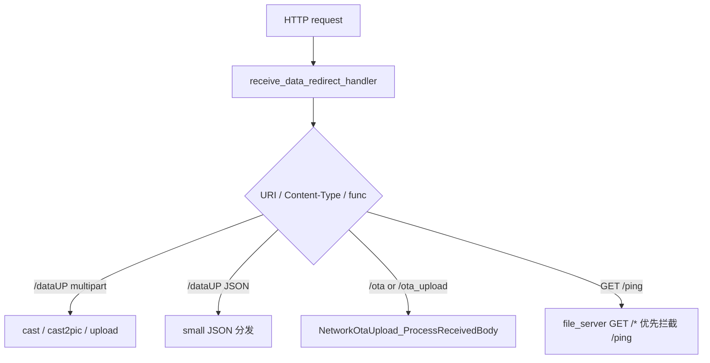


相关目录：

```text
main/server_network_sta/net_data/
main/server_network_sta/cast/
main/server_network_sta/cast2pic/
main/server_network_sta/upload/
main/server_network_sta/ota/
main/server_network_sta/delete/
main/server_network_sta/saved_images/
main/server_network_sta/snapshot/
main/server_network_sta/slideshow/
main/server_network_sta/slideshow_control/
main/server_network_sta/wifi_work_time/
main/server_network_sta/ping/
main/server_network_sta/time/
```

入口总览：

```text
HTTP POST /dataUP or /ota or /ota_upload
└─ server_network_sta/net_data/server_network_sta_data.c
   └─ receive_data_redirect_handler()
      ├─ get_request_header_value()
      ├─ ServerNetworkStaWifiWorkTime_OnHttpNetworkActivity()
      ├─ NetworkOtaUpload_IsOtaRequest()
      ├─ alloc_request_body_buffer()
      ├─ read_request_body_to_buffer()
      ├─ send_dataup_error_response()
      ├─ OTA request
      │  └─ NetworkOtaUpload_ProcessReceivedBody()
      ├─ small JSON request
      │  └─ process_small_json_request()
      └─ multipart request
         ├─ ServerNetworkStaCast2Pic_Process()
         ├─ ServerNetworkStaCast_Process()
         ├─ ServerNetworkStaUpload_Process()
         └─ process_multipart_upload_request()
```

内存管理说明：

```text
/dataUP 当前实现会先通过 alloc_request_body_buffer() 申请 request body 缓冲区，优先使用 PSRAM。
read_request_body_to_buffer() 会把完整 body 读入内存后再分发，不是 streaming parse，也不是边收边写。
处理结束后由 receive_data_redirect_handler() 调用 heap_caps_free(body) 释放缓冲区。

风险：
- 大图片、大 multipart、OTA 都依赖 PSRAM 可用空间和 HTTP body 最大长度限制。
- OTA 当前同样依赖 HTTP body 完整接收后再解析 firmware part，然后再写 OTA 分区。
- 如果后续要降低内存峰值，建议改成 streaming parse / 边收边写 SD / 边收边写 OTA。

当前主要 body 限制：
- 普通 `/dataUP` 最大 body：`SERVER_NETWORK_STA_DATAUP_MAX_BODY_SIZE = 2MB`。
- 小 JSON 最大 body：`SERVER_NETWORK_STA_SMALL_JSON_BODY_MAX = 4096 bytes`。
- OTA 最大 body：`SERVER_NETWORK_STA_OTA_UPLOAD_MAX_BODY_SIZE = 6MB`。
- OTA multipart 预留开销：`SERVER_NETWORK_STA_OTA_MULTIPART_OVERHEAD_BYTES = 64KB`。
- USB HTTP-like body 最大值复用：`USB_CONSOLE_HTTP_BODY_MAX = SERVER_NETWORK_STA_DATAUP_MAX_BODY_SIZE`。

非 OTA `/dataUP` 超过最大 body 时保留 HTTP 413 并返回 `dataup_result/1006` JSON；request body 缓冲区分配失败时保留 HTTP 500 并返回 `dataup_result/1011` JSON。OTA 请求继续使用独立的 `ota_result/170x` 错误映射。
```

存 / 取信息（含条件限制）：

```text
存：
- net_data 入口本身只在 RAM/PSRAM 中申请 request body 缓冲区，处理完成后释放。
- 真正持久化由下游模块完成：cast/upload/cast2pic 写 SD，ota 写 OTA 分区，slideshow 写配置文件，wifi_work_time 写 NVS。

取：
- 从 HTTP request 读取 header、body、multipart boundary、JSON func。
- 根据 URI、Content-Type、func 分发到对应模块。

日志：
- 保留入口关键节点：HTTP data header、enter、dispatch=ota/json/multipart、upload busy、body too large、recv failed。
- `small JSON` 收到后打印JSON正文；超过240字节时只打印前240字节。
- legacy multipart fallback 的 boundary、part field、upload slot 等细节由 `USER_HTTP_MULTIPART_DETAIL_LOG_ENABLE` 控制，默认关闭。
- 文件路径拒绝 `..`、反斜杠和带目录的 multipart 文件名。
```


### 6.1 网络 HTTP 数据入口：dataUP <span id="sec-06-1"></span>

Mermaid 时序图：

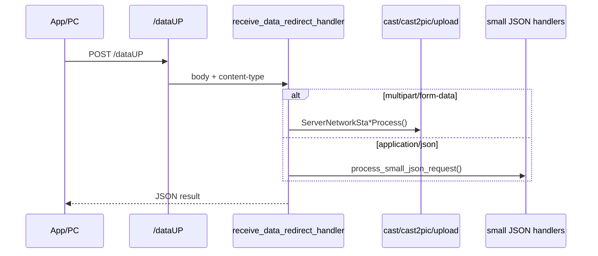


```text
HTTP POST /dataUP
└─ server_network_sta/net_data/server_network_sta_data.c
   └─ receive_data_redirect_handler()
      ├─ get_request_header_value()
      ├─ ServerNetworkStaWifiWorkTime_OnHttpNetworkActivity()
      ├─ alloc_request_body_buffer()
      ├─ read_request_body_to_buffer()
      ├─ small JSON request
      │  └─ process_small_json_request()
      └─ multipart request
         ├─ ServerNetworkStaCast2Pic_Process()
         ├─ ServerNetworkStaCast_Process()
         ├─ ServerNetworkStaUpload_Process()
         └─ process_multipart_upload_request()
```


### 6.1.1 V2 协议资料拆分：HTTP 图片与控制接口总览 <span id="sec-06-1-1"></span>

`V2_相框传图协议.html` 中 HTTP 部分统一说明：图片类接口使用 `POST /dataUP` + `multipart/form-data`，JSON 控制类接口使用 `POST /dataUP` + JSON，连通性检查使用 `GET /ping`。

| func / path | 分类 | 放入本文档章节 | 请求格式 |
|---|---|---|---|
| `cast` | multipart 图片接口 | [7.1 cast：投屏业务模块](README_Fun.md#sec-07-1) | `POST /dataUP` + multipart |
| `upload` | multipart 图片接口 | [7.11 upload：PC或手机传文件到ESP32-C5，并存](README_Fun.md#sec-07-11) | `POST /dataUP` + multipart |
| `cast2pic` | multipart 图片接口 | [7.2 cast2pic：投屏转图片缓存 / 显示](README_Fun.md#sec-07-2) | `POST /dataUP` + multipart |
| `update` | multipart 图片接口，前端预留 | 本节保留说明 | `POST /dataUP` + multipart |
| `get_saved_images` | JSON 控制接口 | [7.7 get_saved_images：取出本地存储图片](README_Fun.md#sec-07-7) | `POST /dataUP` + JSON |
| `get_snapshot` | JSON 控制接口 | [7.10 snapshot：读取图片列表和轮播状态](README_Fun.md#sec-07-10) | `POST /dataUP` + JSON |
| `start_slideshow` | JSON 控制接口 | [7.8 slideshow：图片轮播的文件列表，轮播间隔，是否随机](README_Fun.md#sec-07-8) | `POST /dataUP` + JSON |
| `set_slideshow` | JSON 控制接口 | [7.9 slideshow_control：轮播控制模块](README_Fun.md#sec-07-9) | `POST /dataUP` + JSON |
| `delete` | JSON 控制接口 | [7.3 delete：图片 / 缓存文件删除逻辑](README_Fun.md#sec-07-3) | `POST /dataUP` + JSON |
| `set_wifi_work_time` | JSON 控制接口 | [7.12 wifi_work_time：WiFi 省电管理](README_Fun.md#sec-07-12) | `POST /dataUP` + JSON |
| `daily_download_file` | JSON 控制接口，当前代码扩展 | [7.15 daily_download_file：每日一图](README_Fun.md#sec-07-15) | `POST /dataUP` + JSON |
| `/ping` | HTTP GET | [7.6 ping：网络连通检测](README_Fun.md#sec-07-6) | `GET /ping` |
| `/time` | HTTP GET，当前代码扩展 | [7.13 time：RTC 默认时间与 SNTP 网络校时](README_Fun.md#sec-07-13) | `GET /time` |

`update` 在 V2 协议中是“替换旧图片，当前前端预留”：字段包括 `oldfileNames`、`newfileNames`、`bin_size`、`image_size`、`save`、`show`、`bin`、`image`。当前 `main/CMakeLists.txt` 已列出 `cast`、`cast2pic`、`upload` 等网络模块，但没有单独列出 `server_network_sta/update` 源文件，因此本文只记录为 V2 预留接口，不写成当前已实现链路。

`start_slideshow.fileNames` 表示 APP 最终生成的播放事件列表，不是唯一文件集合。最终列表允许同一文件名出现多次，最少 1 项、最多 150 项；`startIndex` 索引最终列表，必须满足 `0 <= startIndex < fileNames.length`，不得对最终数量再次乘 3。APP 在 `random=true` 时使用最多 50 个原始文件，把每个名称复制 3 次并对扩展后的列表打乱；ESP32-C5 不再次随机，也不校验每个名称是否刚好出现 3 次，按收到的最终顺序播放，并继续在配置、NVS 和 snapshot 中保存/返回 `random=false`。

```json
{
  "func": "start_slideshow",
  "fileNames": ["A", "B", "A", "A", "B", "B"],
  "interval": 60,
  "random": true,
  "timestamp": 1783372200,
  "startIndex": 0
}
```

APP / 网络端完整 small JSON 仍受 `SERVER_NETWORK_STA_SMALL_JSON_BODY_MAX=4096` 限制；150 项上限以当前常用的 16 位文件名为主要场景。每个列表项仍必须对应存在、属于普通文件且非空的 `/data/bin_img/<fileName>.bin`。相同文件名位于不同索引时属于不同播放事件，相邻重复项会在相邻两个播放点分别触发显示。


存 / 取信息（含条件限制）：

```text
存：
- /dataUP 入口不直接持久化；按 func 转交下游模块。

取：
- 读取 HTTP body 到内存缓冲区。
- multipart 请求读取 boundary 和各 part。
- JSON 请求读取 func 后转入 small JSON 分发。

日志：
- `/dataUP` 入口保留短日志：header、uri、len、content-type、分发类型、异常原因。
- multipart 图片业务的保存/显示结果由 cast、cast2pic、upload 下游模块打印。
- legacy multipart fallback 只保留保存成功/打开失败等关键日志；解析细节默认关闭。
```

[⬆ 返回目录](#toc) | [↩ 返回当前目录](#sec-06)

### 6.2 网络 HTTP 数据入口：ota <span id="sec-06-2"></span>

Mermaid 时序图：

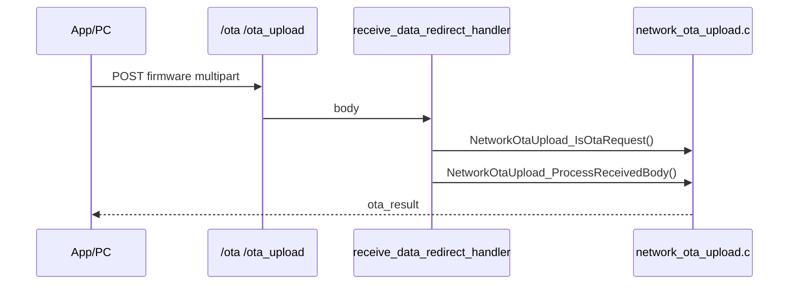


```text
HTTP POST /ota or /ota_upload
└─ server_network_sta/net_data/server_network_sta_data.c
   └─ receive_data_redirect_handler()
      ├─ get_request_header_value()
      ├─ ServerNetworkStaWifiWorkTime_OnHttpNetworkActivity()
      ├─ NetworkOtaUpload_IsOtaRequest()
      ├─ NetworkOtaUpload_GetMaxBodySize()
      ├─ alloc_request_body_buffer()
      ├─ read_request_body_to_buffer()
      └─ NetworkOtaUpload_ProcessReceivedBody()
```


存 / 取信息（含条件限制）：

```text
存：
- OTA 请求最终由 network_ota_upload 写入 OTA update partition，并设置 boot partition。

取：
- 读取 multipart meta 与 firmware/bin 字段。
- 读取当前 running partition、固件 app_desc、目标 OTA partition 信息。

日志：
- 保留关键节点：detect ota request、max body size、meta raw/parsed、ota write start、版本/分区检查、写入进度、verify、set boot、reboot。
- firmware 指针、boundary、field、firmware header 等细节日志默认关闭。
- OTA 失败阶段使用 `ESP_LOGE`，可继续返回错误响应的异常使用 `ESP_LOGW` 或 OTA result JSON 表达。
```

[⬆ 返回目录](#toc) | [↩ 返回当前目录](#sec-06)

### 6.3 网络 HTTP 数据入口：small JSON <span id="sec-06-3"></span>

Mermaid 分发图：

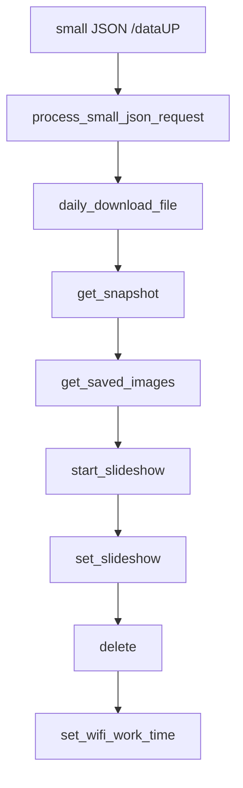


small JSON 分发：

```text
process_small_json_request()
├─ ServerNetworkStaDailyImage_ProcessJson()
├─ ServerNetworkStaSnapshot_ProcessJson()
├─ ServerNetworkStaSavedImages_ProcessJson()
├─ ServerNetworkStaSlideshow_ProcessJson()
├─ ServerNetworkStaSlideshowControl_ProcessJson()
├─ ServerNetworkStaDelete_ProcessJson()
└─ ServerNetworkStaWifiWorkTime_ProcessJson()
```

说明：这里按 `server_network_sta_data.c` 的实际调用顺序记录；每个处理函数返回 `ESP_ERR_NOT_SUPPORTED` 时继续尝试下一个。

GET /ping：

```text
HTTP GET /ping
└─ file_server.c
   └─ download_get_handler()
      ├─ ServerNetworkStaPing_ProcessGet(req)
      │  ├─ ServerNetworkStaWifiWorkTime_OnHttpNetworkActivity()
      │  ├─ get_ble_mac_no_colon()
      │  ├─ ServerNetworkStaEpdDisplay_IsBusy()
      │  ├─ httpd_resp_set_type(application/json)
      │  ├─ httpd_resp_set_hdr(Connection: close)
      │  └─ httpd_resp_sendstr()
      └─ 非 /ping 时继续走缩略图/静态文件/目录列表处理
```

当前网络和 USB `/ping` 的 JSON 字段一致：

```json
{
  "func": "ping_result",
  "result": 0,
  "message": "ok",
  "EPD": "BUSY",
  "Ble_MAC": "AABBCCDDEEFF"
}
```

字段规则：

```text
EPD=BUSY：显示任务 active、pending job 计数大于 0、EPD 队列仍有消息，任一条件成立
EPD=IDLE：以上三项均不存在
Ble_MAC 已取得：result=0，message=ok，Ble_MAC 为 12 位大写无冒号字符串
Ble_MAC 未取得：result=1405，message=Ble_MAC not ready，Ble_MAC 为空字符串
当前固件正式输出字段名为 Ble_MAC，不输出小写 ble_mac
```

网络响应设置 `Content-Type: application/json` 和 `Connection: close`；`result=1405` 仍是正常返回的 JSON 业务结果。

USB `/ping` 通过 `UsbConsolePing_Handle()` 提交异步请求，再由 `UsbConsolePing_Process()` 构造同字段 JSON；USB 路径调用 `ServerNetworkStaWifiWorkTime_OnNetworkData()`，网络 HTTP 路径调用 `ServerNetworkStaWifiWorkTime_OnHttpNetworkActivity()`，两者计时行为不同但响应字段一致。

GET `/time` 在同一个 `download_get_handler()` 中紧接 `/ping` 检查，由 `ServerNetworkStaTime_ProcessGet()` 返回 `time_result`。

---


存 / 取信息（含条件限制）：

```text
存：
- small JSON 入口不直接存储。
- set_slideshow / start_slideshow / set_wifi_work_time 等由对应模块保存到文件或 NVS。

取：
- 读取 JSON func 字段。
- 根据源码顺序依次尝试 daily_image、snapshot、saved_images、slideshow、slideshow_control、delete、wifi_work_time。

日志：
- small JSON入口打印body；超过240字节时只打印前240字节。
- 每个已识别 func 打印短结果：`small JSON func=... ret=...`。
- 非 JSON body、未知 func 使用 `ESP_LOGW`。
```

[⬆ 返回目录](#toc) | [↩ 返回当前目录](#sec-06)

---

## 8. USB Serial/JTAG HTTP-like 协议 <span id="sec-08"></span>

当前代码使用 ESP32-C5 USB Serial/JTAG simple VFS。接收任务直接从硬件 RX FIFO 读取数据，丢弃 HTTP method 之前的非 HTTP 字节，再解析一个或多个连续的 HTTP-like 请求。

```text
请求起始：GET / POST / PUT / DELETE / PATCH / HEAD
Header 结束：支持 CRLF CRLF，也支持 LF LF
POST/PUT/PATCH：必须包含合法 Content-Length
请求 body 上限：USB_CONSOLE_HTTP_BODY_MAX，当前等于网络 /dataUP 的 2MB
启动接收延迟：USB_CONSOLE_START_DELAY_MS=3000ms；延迟结束时会清空此前收到的 RX 数据
```

输入不要求 `@#$` / `%^&`，因为接收端会查找 HTTP method；即使工具带有这些包头包尾，method 前的字节也会被裁掉。设备输出固定包含：

```text
@#$\r\n
HTTP/1.1 <status> <reason>\r\n
Content-Type: <type>\r\n
Content-Length: <bytes>\r\n
Connection: keep-alive\r\n
\r\n
<body>
\r\n%^&\r\n
```

请求过大、超时和格式错误分别返回 `usb_receive_result` 的 `1101/1102/1103`。正式返回码见 [README_Result_Code.md](README_Result_Code.md)。

---

## 9. USB 路由与各功能处理汇总 <span id="sec-09"></span>

本节只整理 `main/usb_console_echo/` 目录下的 USB Serial/JTAG HTTP-like 协议处理。  
USB 输入先经过 `transport` 读入，再由 `http_text` 解析成 HTTP-like request，最后由 `router` 按路径分发到各功能模块。

Mermaid 时序图：

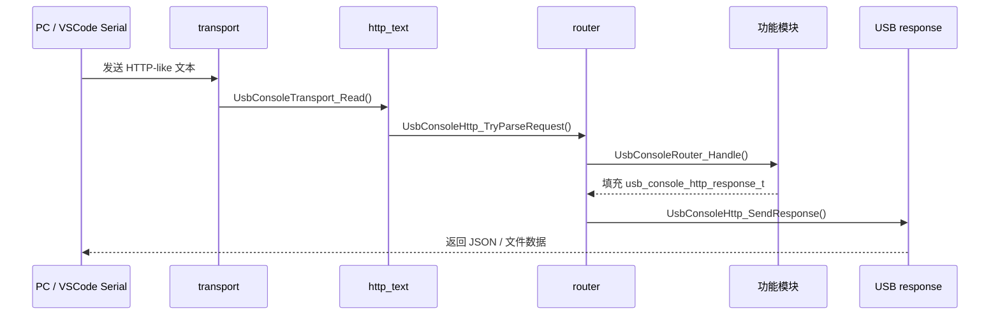

树状时序：

```text
USB Serial/JTAG
└─ UsbConsoleEcho_Task()
   ├─ UsbConsoleTransport_Read()
   ├─ UsbConsoleHttp_TryParseRequest()
   └─ UsbConsoleRouter_Handle()
      ├─ /ping              -> UsbConsolePing_Handle()
      ├─ /restart           -> UsbConsoleRestart_Handle()
      ├─ /wifi              -> UsbConsoleWifi_Handle()
      ├─ /epd_type_list     -> UsbConsoleEpdType_SendList()
      ├─ /epd_type          -> UsbConsoleEpdType_HandleSet() / SendCurrent()
      ├─ /epd_test          -> UsbConsoleEpdType_HandleTest()
      ├─ /dataUP /net_data  -> UsbConsoleNetData_Handle()
      ├─ /cast              -> UsbConsoleCast_Handle()
      ├─ /cast2pic          -> UsbConsoleCast2Pic_Handle()
      ├─ /delete            -> UsbConsoleDelete_Handle()
      ├─ /saved_images      -> UsbConsoleSavedImages_Handle()
      ├─ /thumb             -> UsbConsoleSavedImages_Handle()
      ├─ /slideshow         -> UsbConsoleSlideshow_Handle()
      ├─ /slideshow_control -> UsbConsoleSlideshowControl_Handle()
      ├─ /snapshot          -> UsbConsoleSnapshot_Handle()
      ├─ /upload            -> UsbConsoleUpload_Handle()
      └─ /wifi_work_time    -> UsbConsoleWifiWorkTime_Handle()
```

串口测试公共格式：

```text
串口参数：
- 端口：按 Windows 设备管理器中的 USB Serial/JTAG COM 口选择，例如 COM7。
- 波特率：921600。
- 数据位：8。
- 停止位：1。
- 校验：None。
- 流控：None。

发送数据格式：
@#$
<HTTP-like request>
%^&

固件解析说明：
- 当前输入解析会从串口字节流中寻找 GET / POST / PUT / DELETE / PATCH / HEAD 开头的 HTTP-like 请求。
- 也就是说，发送时可以带 @#$ 和 %^& 作为串口工具侧的包头包尾；固件真正解析的是中间的 HTTP-like request。
- 固件返回数据由 UsbConsoleHttp_SendResponse() 自动加包头包尾。

返回数据格式：
@#$
HTTP/1.1 200 OK
Content-Type: application/json
Content-Length: <len>
Connection: keep-alive

<json body>
%^&
```

说明：

```text
- JSON 类接口可以直接复制本章“串口发送数据”到串口工具发送。
- Content-Length 必须等于 body 的 UTF-8 字节数，下面 JSON 示例已按当前示例 body 计算好。
- HTTP-like 请求建议使用 CRLF 换行，即 \r\n；如果串口工具只支持普通文本发送，要确认它不会改动 Content-Length 后面的 body。
- cast、cast2pic、upload 这类 multipart 带二进制 bin/jpg，不建议手工在普通串口窗口输入，需要支持二进制发送的串口工具或 PC 程序。
- common、http_text、transport、worker 属于内部模块，没有单独业务入口，建议通过 /ping、/cast、/wifi 等上层接口覆盖测试。
```


存 / 取信息（含条件限制）：

```text
存：
- USB cast/cast2pic 写 /data/cast_img；USB upload 写 /data/bin_img 与 /data/jpg_img。
- USB wifi 写 NVS wifi 与 nvs.net80211。
- USB epd_type 写 PhotoPainter EPD type key。
- USB slideshow/slideshow_control 写轮播配置文件。
- USB wifi_work_time 写工作时间 NVS。

取：
- USB saved_images/snapshot 读取 SD 图片与轮播状态。
- USB ping 读取状态信息。
- USB router/http_text/transport 只读取 USB 输入并在 RAM 中处理。
```

[⬆ 返回目录](#toc) | [↩ 返回当前目录](#sec-09)

---

### 9.1 cast：投屏功能模块 <span id="sec-09-1"></span>

USB接受`POST /cast`或`POST /dataUP`的multipart请求，通过独立worker复制body后复用第7.1节的`cast_core`、EPD显示、保存和清理规则。

USB差异：

```text
- USB返回最终cast_result；result=0表示显示、保存和last_cast均成功。
- 网络show=true入口先返回cast_received，再由后台完成业务。
- multipart必须包含func/fileName/bin_size/image_size/save/show/bin/image。
- 二进制请求必须由PC程序发送，不适合手工串口输入。
```

入口：`UsbConsoleRouter_Handle()` → `UsbConsoleCast_Handle()` → `UsbConsoleCast_SubmitAsync()`。正式返回码见`README_Result_Code.md`，完整业务约束见[7.1 cast](README_Fun.md#sec-07-1)。

[⬆ 返回目录](#toc) | [↩ 返回当前目录](#sec-09)

---

### 9.2 cast2pic：投屏转图片缓存 / 显示 <span id="sec-09-2"></span>

USB与网络使用同一协议和业务核心：只接受`screen=a/b`及一组无后缀的`fileName/bin_size/image_size/bin/image`；`ab`或缺少`screen`返回1617。

校验成功后立即返回`cast2pic_result=0`，只表示数据接收成功；后台显示或保存失败只写日志，不改变已返回结果。入口为`UsbConsoleRouter_Handle()` → `UsbConsoleCast2Pic_Handle()`；正式返回码见`README_Result_Code.md`，完整映射和保存规则见[7.2 cast2pic](README_Fun.md#sec-07-2)。

[⬆ 返回目录](#toc) | [↩ 返回当前目录](#sec-09)

---

### 9.3 common：公共工具、通用函数、全局定义 <span id="sec-09-3"></span>

`usb_console_common.c` 提供 USB 各业务共同使用的 JSON 字段读取、`func` 比较、安全文件名检查、multipart part 解析、图片列表生成和 JSON response 格式化。`usb_console_common_async.c` 复制请求 body 后提交统一 worker；后台 handler 返回失败时发送 `usb_async_result/1106`。

这些文件没有独立 URI。业务入口仍由 `usb_console_router.c` 路由到具体模块。

---

## 10. CH583 串口通信协议汇总 <span id="sec-10"></span>

结果码边界：

CH583 底层 `ACK` / `ERR` / `PONG` / `GPIO_VALUE` 是 UART 帧协议状态，不是接口返回 JSON，不带 JSON `result`。通过 `BLE_DATA` / `WIFI_DATA` 透传的 JSON，按第 11 章实际 BLE JSON 返回处理。

本章把 `CH583 与 WiFi 模组 UART 通讯协议 V1.x` 进行精简整理，只保留当前工程联调最常用的信息。原始文档文件名是 `V1.1`，正文标题中出现 `V1.2`，本文统一按 `V1` 帧格式说明。

Mermaid 时序图：

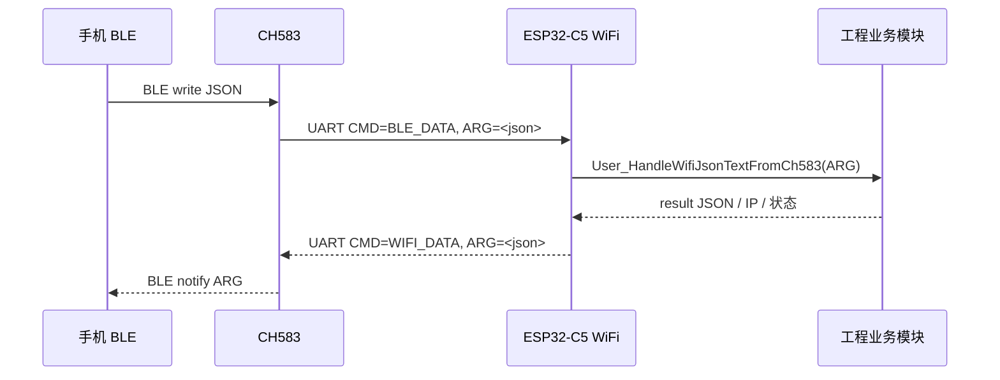

树状时序：

```text
CH583 串口通信协议汇总
├─ CH583 -> ESP32-C5
│  ├─ DEVICE_INFO
│  ├─ PING
│  └─ BLE_DATA
├─ ESP32-C5 -> CH583
│  ├─ ACK / ERR
│  ├─ PONG
│  ├─ WIFI_DATA
│  ├─ WIFI_VER
│  ├─ WIFI_PROVISION
│  ├─ WAKE_TIMER
│  ├─ POWER_OFF
│  └─ GPIO / GPIO_READ
└─ ESP32-C5 工程业务层
   ├─ ble_data_handler.cpp
   ├─ server_network_sta_wifi_work_time.c
   └─ led_status.c
```

所有 WiFi -> CH583 命令共用同一个 TX mutex。锁覆盖 SEQ 分配、整帧组包、按 SEQ 管理的待确认队列、UART 写入和 SEQ 自增，禁止 LED、WIFI_DATA、GPIO、POWER_OFF、ACK 等命令并发取得相同 SEQ。最多保留 8 条需要回复的待确认帧；ACK/ERR 只完成匹配 SEQ，BAD_CRC 只重发匹配帧。ACK、ERR、PONG 不进入待确认队列；POWER_OFF 沿用原发送方式，不进入待确认队列。协议发送接口成功时统一返回 `0`，失败返回负值。

---

存 / 取信息（含条件限制）：

```text
存：
- DEVICE_INFO 收到合法 MAC 后保存到 PhotoPainter NVS 的 CH583_DEVICE_INFO_MAC_NVS_KEY，字符串 key 继续使用 `ch583_ble_mac`。
- DEVICE_INFO 收到合法 CH583 版本后保存到 RAM 缓存和 CH583_DEVICE_INFO_BLE_VER_NVS_KEY，字符串 key 继续使用 `ch583_ble_ver`；key 不存在时 app_nvs_read_u8() 写入默认值 0。
- DEVICE_INFO 根据 screen_type 和 board_info_hex 映射 EPD 类型，再通过 EpdType_SaveForNextBoot() 保存到 USER_EPD_TYPE_NVS_KEY；本次启动继续使用启动时从 NVS 加载的合法类型，NVS 非法时使用默认类型。
- GPIO / POWER_OFF / WIFI_DATA / WIFI_PROVISION / WAKE_TIMER 等串口命令本身不在 ESP32-C5 侧保存持久化数据；WIFI_PROVISION 和 WAKE_TIMER 由 CH583/CH585 侧校验并保存。

取：
- ch583_wifi_load_device_info_from_nvs() 一次加载已保存的 BLE MAC 和 CH583 版本。
- ch583_wifi_uart_get_ble_mac() 与 ch583_wifi_uart_get_ble_ver() 保持原接口，读取 DEVICE_INFO 缓存，避免影响现有 ping 和基础信息功能。
- UART RX 从环形缓冲中读取 @#...^& 帧并解析。
```


### 10.1 通讯基础与帧格式 <span id="sec-10-1"></span>

Mermaid 时序图：

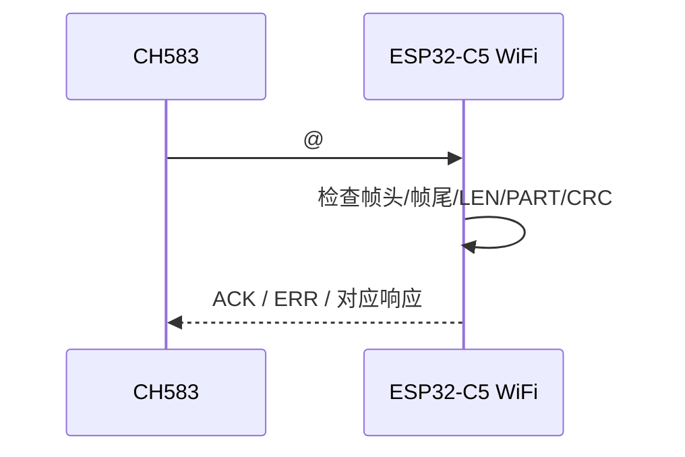

树状时序：

```text
CH583 UART TX
└─ ESP32-C5 UART RX
   └─ User_UartEventTask()
      └─ UART_DATA event
         └─ Ch583Uart_ReadAndProcess(event.size)
            └─ uart_read_bytes()
               └─ ch583_wifi_uart_process_bytes()
                  ├─ 等待帧头 @#
                  ├─ 缓存帧体 V1|SEQ|CMD|LEN|PART|TOTAL|ARG|CRC
                  ├─ 等待帧尾 ^&
                  └─ ch583_wifi_handle_frame_body()
```

精简协议内容：

```text
CH583 ↔ WiFi 模组
UART：UART1
波特率：115200
数据位：8
停止位：1
校验位：无
硬件流控：无

帧头：@#
帧尾：^&

标准帧：
@#V1|SEQ=<seq>|CMD=<cmd>|LEN=<len>|PART=<part>|TOTAL=<total>|ARG=<arg>|CRC=<crc>^&
```


存 / 取信息（含条件限制）：

```text
存：
- 帧格式处理不直接存储。

取：
- 从 UART 字节流中查找 @# 帧头和 ^& 帧尾。
- 抽取 V1|SEQ|CMD|LEN|PART|TOTAL|ARG|CRC 字段。
```

[⬆ 返回目录](#toc) | [↩ 返回当前目录](#sec-10-1)

---

### 10.2 SEQ / LEN / PART / CRC / ACK / ERR 校验规则 <span id="sec-10-2"></span>

Mermaid 时序图：

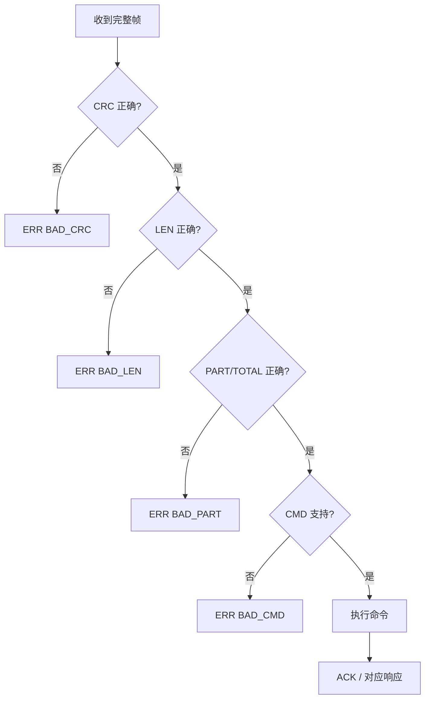

树状时序：

```text
ch583_wifi_handle_frame_body()
├─ ch583_wifi_parse_frame()
│  ├─ 查找 |CRC=
│  ├─ 计算 CRC16-CCITT-FALSE
│  ├─ 解析 V1 / SEQ / CMD / LEN / PART / TOTAL / ARG
│  └─ 失败返回 BAD_FORMAT 或 BAD_CRC
├─ ch583_wifi_validate_len_and_part()
│  ├─ LEN == strlen(ARG)
│  ├─ PART/TOTAL 非 0
│  ├─ PART <= TOTAL
│  └─ 非 BLE_DATA 不允许 TOTAL > 1
└─ 按 CMD 执行业务
```

精简协议内容：

```text
SEQ：每个发送方独立递增，0~65535 循环
LEN：必须等于 ARG 实际字节长度
PART/TOTAL：普通命令固定 1/1
CRC：CRC16-CCITT-FALSE，校验通过后才能执行命令
ACK：收到并执行成功，ARG 填被确认帧的 SEQ
ERR：收到但执行失败，ARG 填 received_seq,reason
```

常用错误原因：

```text
BAD_CRC
BAD_LEN
BAD_PART
BAD_FORMAT
BAD_CMD
BAD_ARG
DEVICE_INFO_SAVE_FAILED
BLE_NOT_CONNECTED
BLE_NOTIFY_DISABLED
BLE_NOTIFY_FAIL
DENY_GPIO
```


存 / 取信息（含条件限制）：

```text
存：
- 校验规则不写持久化数据。

取：
- 读取帧内 SEQ/LEN/PART/TOTAL/CRC 字段。
- 用 ARG 实际长度校验 LEN，用 CRC16 校验帧内容。
```

[⬆ 返回目录](#toc) | [↩ 返回当前目录](#sec-10-2)

---

### 10.3 DEVICE_INFO 设备信息同步、版本交换与 EPD 类型 <span id="sec-10-3"></span>

Mermaid 时序图：

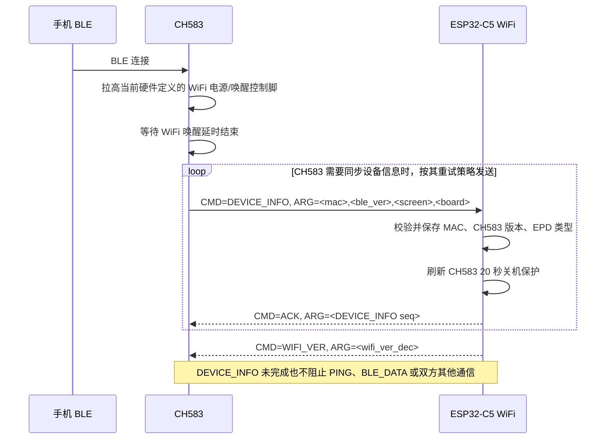

树状时序：

```text
CH583
└─ CMD=DEVICE_INFO
   └─ ESP32-C5 ch583_wifi_handle_frame_body()
      └─ ch583_wifi_handle_device_info()
         ├─ 校验 PART=1/TOTAL=1
         ├─ ch583_wifi_parse_device_info_arg()
         ├─ EpdType_LoadSavedOrDefault() 保持本次运行采用启动NVS/默认类型
         ├─ EpdType_SaveForNextBoot() 保存上报类型供下次启动
         ├─ 读取并验证 USER_EPD_TYPE_NVS_KEY，必要时补写
         ├─ 保存 MAC 与 CH583 版本
         ├─ 更新 DEVICE_INFO RAM 缓存
         ├─ ServerNetworkStaWifiWorkTime_OnCh583Activity()
         ├─ ch583_wifi_send_ack(frame->seq)
         ├─ 记录本次启动已收到 DEVICE_INFO
         ├─ ch583_wifi_uart_send_wifi_ver()
         ├─ ch583_wifi_uart_send_current_wifi_provision_status()
         └─ 可靠时间存在时 ServerNetworkStaTime_BackupCurrentToCh583()
```

精简协议内容：

```text
CMD=DEVICE_INFO
ARG=<mac>,<ble_ver_dec>,<screen_type>,<board_info_hex>
mac：CH583 自身 BLE MAC，12 位大写 HEX，不带冒号
ble_ver_dec：CH583 固件版本，纯十进制文本，范围 0..255
screen_type：d=13.3 寸 HD 六色屏，e=7.09 寸 HD 六色屏
board_info_hex：40=兴泰，41=DKE
ble_ver_dec 来自 CH583/CH585 固件宏 VER
screen_type 和 board_info_hex 由 CH583 在 DEVICE_INFO 中上报
ESP32-C5 在 ch583_wifi_parse_device_info_arg() 中解析并映射为本地 EPD type
BLE 连接后先拉高当前硬件定义的 WiFi 电源/唤醒控制脚
CH583 需要同步当前设备信息时发送 DEVICE_INFO，并可在未收到匹配 ACK 时按自身策略重发
ESP32 全部字段解析和保存成功后刷新 20 秒保护并 ACK
ACK 的 ARG 必须等于 DEVICE_INFO 的 SEQ
DEVICE_INFO 是信息同步命令，不是 ESP32 的通信准入条件
本次 ESP32 启动未收到 DEVICE_INFO 时，PING、BLE_DATA、GPIO、时间、配网和关电通信仍正常处理
```

完整帧与示例：

```text
@#V1|SEQ=<seq>|CMD=DEVICE_INFO|LEN=<len>|PART=1|TOTAL=1|ARG=<mac>,<ble_ver_dec>,<screen_type>,<board_info_hex>|CRC=<crc>^&
@#V1|SEQ=20|CMD=DEVICE_INFO|LEN=21|PART=1|TOTAL=1|ARG=AABBCCDDEEFF,100,d,40|CRC=XXXX^&
```

MAC 使用广播显示顺序 `Mac[5] Mac[4] Mac[3] Mac[2] Mac[1] Mac[0]`，文本必须为 12 位大写 HEX。`board_info_hex` 是完整 byte 的两位大写 HEX，不是单独字符；映射时 `40` 表示厂家 ID 0，`41` 表示厂家 ID 1。

屏幕类型编码：

```text
screen_type 是 1 个可见 ASCII 字符，只描述屏幕规格/类型，不描述板卡厂家。
d = 13.3 寸 HD 六色屏
e = 7.09 寸 HD 六色屏
前端必须结合 screen_type 和 board_info_hex 选择图片处理算法。
后续新增屏幕类型时，必须同步更新 CH583 上报字符与 ESP32-C5 的 `ch583_wifi_parse_device_info_arg()` 映射。
```

板卡信息编码：

```text
board_info 是 1 个 byte，并保持在可见 ASCII 范围，DEVICE_INFO 中使用两位大写 HEX 文本传输。
bit7-bit5：固定为 010，保证落在可见 ASCII 区间。
bit4：保留旧分组兼容位。
bit3-bit0：厂家 ID，从 0 开始递增。

第一组：
0x40 / '@' = 厂家 ID 0，XT 兴泰
0x41 / 'A' = 厂家 ID 1，DKE
0x42 / 'B' = 厂家 ID 2，预留
0x43 / 'C' = 厂家 ID 3，预留

第二组：
0x50 / 'P' = 厂家 ID 0，预留
0x51 / 'Q' = 厂家 ID 1，预留
0x52 / 'R' = 厂家 ID 2，预留
0x53 / 'S' = 厂家 ID 3，预留

已确定的厂家 ID 按上表绑定；未确定的编号保持预留。
后续确定厂家后，必须同步更新 CH583 上报值与 ESP32-C5 的厂家映射。当前 ESP32-C5 只按收到的 `board_info_hex` 解析，不调用 CH583 侧屏幕驱动函数。
```

存 / 取信息（含条件限制）：

```text
存：
- MAC 写入 CH583_DEVICE_INFO_MAC_NVS_KEY，NVS 字符串 key 保持 `ch583_ble_mac`。
- CH583 版本写入 CH583_DEVICE_INFO_BLE_VER_NVS_KEY，NVS 字符串 key 保持 `ch583_ble_ver`。
- EPD类型通过 `EpdType_SaveForNextBoot()` 写入 `USER_EPD_TYPE_NVS_KEY`，不切换本次运行的EPD驱动。
- USER_EPD_TYPE_DEFAULT 当前为 EPD_TYPE_1600_1200_133_DKE；NVS 不存在或保存值非法时回退该默认类型。
- `EpdType_SaveForNextBoot()` 后再次读取 `USER_EPD_TYPE_NVS_KEY` 验证；不一致时补写，补写失败不ACK。
- 合法 DEVICE_INFO 在 ACK 前调用 ServerNetworkStaWifiWorkTime_OnCh583Activity()，只刷新 RAM 中的 20 秒保护。
- 重发数据未变化时跳过 MAC、版本和 EPD 的重复 NVS 写入。
- 三项保存不是 NVS 事务：前一项可能已经保存、后一项保存失败；这种情况下返回错误且本帧不 ACK，CH583 重发后继续收敛到一致数据，但其他通信不受影响。

取：
- ch583_wifi_load_device_info_from_nvs() 启动时读取已保存 MAC 和 CH583 版本。
- ch583_wifi_uart_get_ble_mac() 和 ch583_wifi_uart_get_ble_ver() 继续向原业务提供数据。
```

EPD 映射：

```text
screen_type=d, board_info_hex=40 -> EPD_TYPE_1600_1200_133
screen_type=d, board_info_hex=41 -> EPD_TYPE_1600_1200_133_DKE
screen_type=e, board_info_hex=40 -> EPD_TYPE_1600_1200_79
screen_type=e, board_info_hex=41 -> ESP_LOGE 后返回 ERR,<seq>,BAD_ARG
```

错误与兼容处理：

```text
字段或 EPD 组合非法：ESP_LOGE，返回 BAD_ARG。
MAC、版本或 EPD 类型保存失败：ESP_LOGE，返回 DEVICE_INFO_SAVE_FAILED，本帧不 ACK。
ACK UART 发送失败：ESP_LOGE，不记录本次 DEVICE_INFO 已成功接收，等待 CH583 后续重发。
DEVICE_INFO 到达前收到 PING：正常回复 PONG，不打印协议错误，也不返回握手类错误。
DEVICE_INFO 到达前收到 BLE_DATA：按原 BLE_DATA 校验、拼包和业务回调正常处理。
ESP32 主动发送 GPIO / WIFI_PROVISION / NFC_SET / TIME_SET / WAKE_TIMER / POWER_OFF / LOWPOWER 等命令时不检查 DEVICE_INFO 状态。
DEVICE_INFO_SAVE_FAILED 只表示本帧设备信息未完整保存，不限制 PING、BLE_DATA 或其他业务。
ESP32 单独重启而 CH583 保持运行时，双方可以沿用 CH583 当前业务状态继续通信；新 DEVICE_INFO 后续到达时再更新保存信息。
```

当前 ESP32-C5 实现说明：

```text
DEVICE_INFO 不控制公共发送、PING、BLE_DATA 或 work_state 关电流程。
本次启动尚未收到合法 DEVICE_INFO 时，MAC、CH583 版本和 EPD 类型暂用 NVS 保存值或默认值。
收到 CRC 正确但参数错误的 DEVICE_INFO 只拒绝该帧，不清除以前成功接收的信息状态，也不影响其他通信。
本次运行的EPD类型只在启动时从NVS加载；NVS值非法时使用 `USER_EPD_TYPE_DEFAULT`。迟到的DEVICE_INFO只保存上报类型供下次启动，不在显示任务运行中切换驱动。
后续修改 DEVICE_INFO 时不得重新加入通信准入门控；如需新的信息有效性判断，应限制在实际依赖该信息的模块内。
```

DEVICE_INFO 成功后的同步动作：

```text
首次同步后调用 `UserLedStatus_ReapplyCurrent()` 校准CH583物理LED状态，但不恢复任何通信门控。
可靠时间已经来自 SNTP、APP 或 CH583 时，ServerNetworkStaTime_BackupCurrentToCh583("device_info_synced")
同步一次 TIME_SET；若 DEVICE_INFO 到达后才获得 SNTP/APP 时间，原时间模块仍会按原路径发送 TIME_SET。
DEVICE_INFO 成功后继续发送 WIFI_VER 并重放当前 WIFI_PROVISION 状态；这些同步动作失败会打印错误，但不会关闭其他通信。
```

版本交换与私有广播版本字段：

组合版本共 3 字节：

```text
byte0：BLE/CH583/CH585 版本，来自 DEVICE_INFO.ble_ver_dec
byte1：WiFi 版本高字节
byte2：WiFi 版本低字节
WiFi 版本范围 0..65535
```

ESP32 上报 WiFi 版本：

```text
CMD=WIFI_VER
@#V1|SEQ=<seq>|CMD=WIFI_VER|LEN=<len>|PART=1|TOTAL=1|ARG=<wifi_ver_dec>|CRC=<crc>^&

ARG=<wifi_ver_dec>
wifi_ver_dec 为十进制文本，范围 0..65535
```

当前 ESP32-C5 行为：

```text
收到合法 DEVICE_INFO 并成功 ACK 后，立即上报一次 WIFI_VER。
ESP32单独重启且CH583沿用旧会话时，如果首次PING早于DEVICE_INFO，ESP32回复PONG后额外发送一次WIFI_VER；发送成功后本次启动不再由PING重复补发。
WIFI_VER 来自当前 app version，按 <high_dec>.<low_dec> 解析为 (high_dec << 8) | low_dec。
high_dec 和 low_dec 都是十进制数值，范围分别为 0..255；代码不要求每段固定为三位。
例如 PROJECT_VER "000.003" 上报 WIFI_VER=3。
如果 app version 不符合上述两个十进制字段格式或任一字段超出 0..255，则回退上报 0 并使用 ESP_LOGE 打印问题。
```

CH583/CH585 行为：

```text
校验 CRC/LEN/PART/TOTAL。
只接受单包 PART=1,TOTAL=1。
只接受十进制 WiFi 版本，合法范围 0..65535。
收到合法 WIFI_VER 后立即回复 ACK。
组合版本为 {VER, WIFI_VER_H, WIFI_VER_L}。
立即刷新 BLE 私有广播版本字段。
设置版本 dirty 标记。
不在收到 WIFI_VER 时立即写 DataFlash。
等待 POWER_OFF / LOWPOWER / WiFi 会话结束收尾时统一写 DataFlash。
复位后读取 DataFlash 中保存的 WiFi 版本高低字节，但 BLE 字节始终使用当前固件 VER。
```

广播字段规则：

```text
只修改 TDX BLE advertising data 中的私有版本字段。
不再把该 3 字节组合版本放入可见广播名。
字段类型使用 Manufacturer Specific Data。
字段长度为 3 字节版本内容。
byte0 = 当前 BLE/CH583/CH585 VER
byte1 = WiFi 版本高字节
byte2 = WiFi 版本低字节
```

边界示例：

```text
VER=100, WIFI_VER=0     => 64 00 00
VER=100, WIFI_VER=65535 => 64 FF FF
WIFI_VER=65536          => ERR,BAD_ARG，不更新广播，不写 DataFlash
```

`send_base_info_to_mobile()` 返回给前端的 `wifi_info_result.version` 使用：

```text
<WiFi app version>:<CH583 version>
```

示例：

```json
{
  "func": "wifi_info_result",
  "version": "000.003:100"
}
```

[⬆ 返回目录](#toc) | [↩ 返回当前目录](#sec-10-3)

---

### 10.4 PING / PONG 心跳流程 <span id="sec-10-4"></span>

Mermaid 时序图：

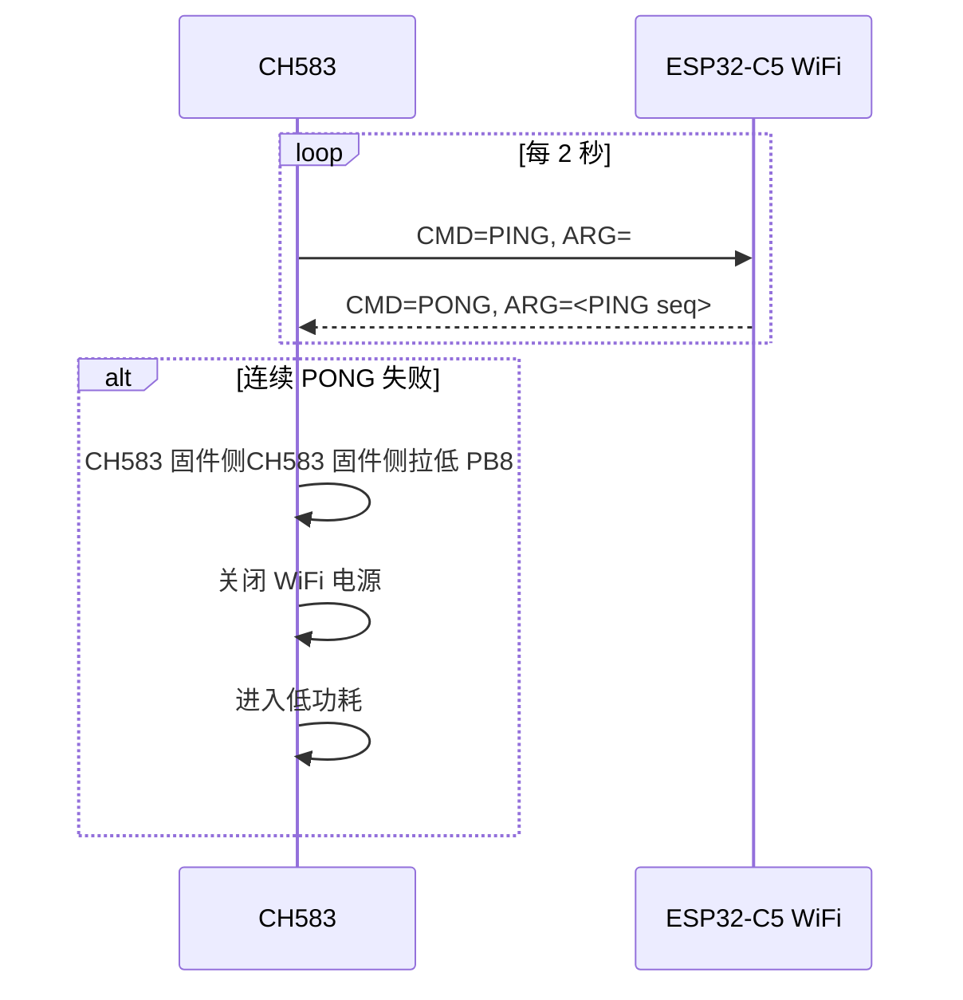

树状时序：

```text
CH583
└─ CMD=PING
   └─ ESP32-C5 ch583_wifi_handle_frame_body()
      ├─ CMD == PING
      ├─ arg = frame.seq
      └─ ch583_wifi_send_frame("PONG", arg)
```

精简协议内容：

```text
CH583 进入心跳状态后按其周期发送 PING；ESP32 是否收到 DEVICE_INFO 不影响该流程
WiFi 收到后立即回复 PONG，不返回握手类错误
PONG 的 ARG 必须等于对应 PING 的 SEQ
如果 CH583 连续多次没有收到合法 PONG，则关闭 WiFi 电源并进入低功耗
UART PING/PONG 是持续心跳，不刷新 CH583 20 秒关机保护
```


存 / 取信息（含条件限制）：

```text
存：
- PING/PONG 心跳不写持久化数据。
- PING/PONG 不调用 ServerNetworkStaWifiWorkTime_OnCh583Activity()，避免心跳永久阻止关机。

取：
- 读取 PING 帧 SEQ，PONG 的 ARG 返回对应 PING SEQ。
- PONG发送失败时使用ESP_LOGE打印对应PING的SEQ；成功心跳不增加普通日志。
```

[⬆ 返回目录](#toc) | [↩ 返回当前目录](#sec-10-4)

---

### 10.5 BLE_DATA：前端到 WiFi 透传 <span id="sec-10-5"></span>

Mermaid 时序图：

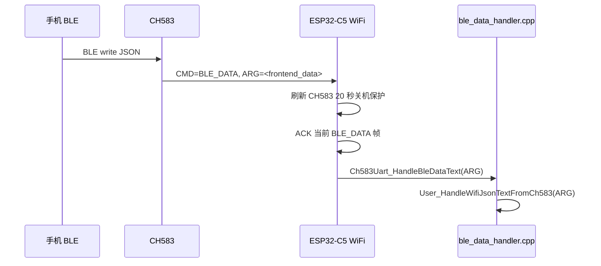

树状时序：

```text
Phone BLE write
└─ CH583
   └─ CMD=BLE_DATA
      └─ ESP32-C5 ch583_wifi_handle_frame_body()
         ├─ CMD == BLE_DATA
         ├─ ch583_wifi_handle_ble_data()
         │  ├─ 单包：刷新 CH583 保护后 ACK
         │  ├─ 多包：按 PART/TOTAL 重组，每个有效分片刷新 CH583 保护
         │  └─ 重组完成后回调 ble_data_callback()
         └─ Ch583Uart_HandleBleDataText()
            └─ User_HandleWifiJsonTextFromCh583()
```

精简协议内容：

```text
CMD=BLE_DATA
ARG=<frontend_data>
CH583 不解析 frontend_data
CH583 不修改 frontend_data
每包最大 ARG 长度 300 字节
超过 300 字节时，CH583 自动分包
ESP32-C5 侧重组后，把 ARG 原文交给 JSON 业务层
合法单包和每个顺序正确、长度合法的分片都刷新 20 秒 CH583 关机保护
乱序、重复、超长或其他非法分片不刷新保护
```

对应业务 JSON 示例：

```json
{
  "func": "wifi",
  "ssid": "Office-WiFi",
  "key": "password"
}
```

```json
{
  "func": "wifi_wakeup"
}
```


存 / 取信息（含条件限制）：

```text
存：
- BLE_DATA 透传层不直接存储。
- BLE_DATA 的 CH583 保护只保存在 RAM 中，不写 NVS；原 OnNetworkData() 完整工作计时重置行为保持不变。
- 如果 ARG 是 wifi JSON，下游 ble_data_handler 会保存 WiFi 配置到 NVS。
- 如果 ARG 是 set_wifi_work_time，下游会保存工作时间到 NVS。

取：
- 读取 BLE_DATA ARG。
- 支持分包重组后交给 Ch583Uart_HandleBleDataText()。
```

[⬆ 返回目录](#toc) | [↩ 返回当前目录](#sec-10-5)

---

### 10.6 WIFI_DATA：WiFi 到前端通知 <span id="sec-10-6"></span>

Mermaid 时序图：

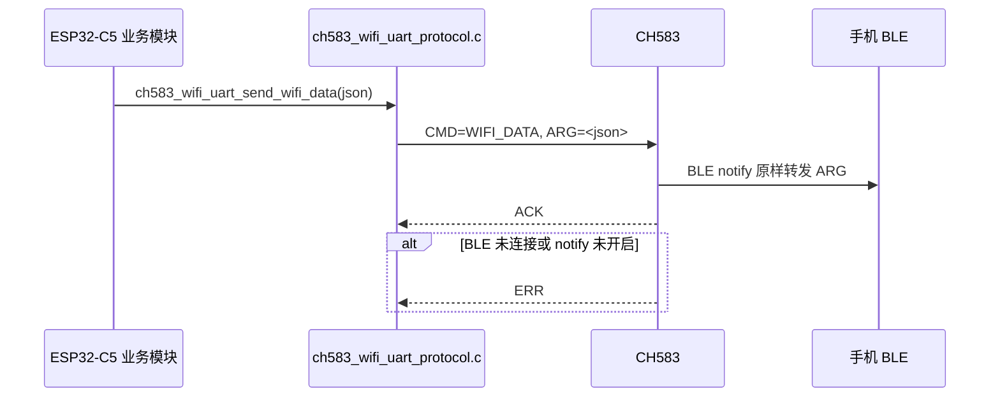

树状时序：

```text
ESP32-C5 业务模块
├─ send_base_info_to_mobile()
│  └─ ch583_wifi_uart_send_wifi_data()
├─ ch583_send_json()
│  └─ ch583_wifi_uart_send_wifi_data()
└─ get_ble_mac_no_colon()
   └─ ch583_wifi_uart_get_ble_mac()

ch583_wifi_uart_send_wifi_data()
├─ 检查 LEN <= 256
└─ ch583_wifi_send_frame("WIFI_DATA", message)
```

精简协议内容：

```text
CMD=WIFI_DATA
ARG=<message>
LEN <= 256
PART=1
TOTAL=1
不支持分包
CH583 收到合法 WIFI_DATA 后，如果 BLE 连接且 notify 已开启，则把 ARG 原样 notify 给前端
前端收到 WiFi 回传消息后，不需要 ACK
```

示例：

```json
{
  "result": 0,
  "message": "network ready",
  "stage": "192.168.1.88"
}
```


存 / 取信息（含条件限制）：

```text
存：
- WIFI_DATA 不写持久化数据。

取：
- 读取待发送 JSON message，并封装为 CMD=WIFI_DATA。
- CH583 侧是否 notify 成功由 ACK/ERR 回传。
```

[⬆ 返回目录](#toc) | [↩ 返回当前目录](#sec-10-6)

---

### 10.7 POWER_OFF：WiFi 主动关电 <span id="sec-10-7"></span>

> 说明：PB8 拉低/关闭 WiFi 电源属于 CH583 固件侧/硬件侧行为；ESP32 当前源码侧只发送 `POWER_OFF` 协议帧。

> 当前状态：CH583 POWER_OFF 关机链路保持启用，`work_state_task()`超时后仍执行 WAKE_TIMER、LED 关机准备并发送 POWER_OFF。`USER_POWER_OFF_LOCAL_EPD_SD_CUTOFF_ENABLE=0` 只表示发送成功后不调用 `Set_Power(0)`，GPIO4 保持 HIGH，等待 CH583 关闭 ESP32/WiFi 电源。

Mermaid 时序图：

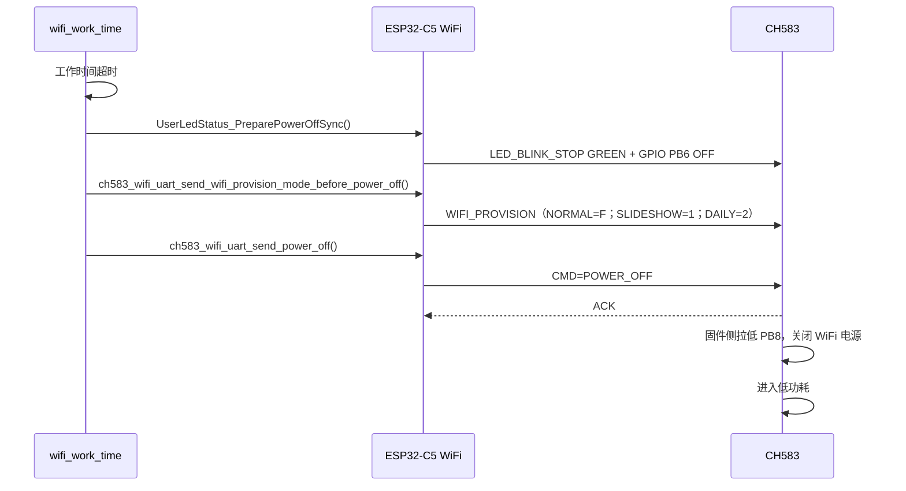

树状时序：

```text
work_state_task()
├─ update_working_time_seconds()
├─ 判断 working_time > server_required_continue_work_time
├─ HTTP 活动保护不足 20 秒
│  └─ 不关电
├─ CH583 UART 初始化未完成，或初始化完成/合法业务活动保护不足 20 秒
│  └─ 不关电
├─ OTA receive/write busy
│  └─ 不关电
├─ EPD busy
│  └─ 不关电，等待 EPD task 完成
├─ image save busy
│  └─ 不关电，等待图片保存和 cleanup 完成
├─ daily image busy
│  └─ 不关电，等待每日一图完成
└─ all guards idle
   ├─ UserLedStatus_PreparePowerOffSync()
   │  ├─ LED_BLINK_STOP GREEN
   │  └─ GPIO PB6 HIGH，确保 GREEN 关闭
   ├─ final guard 发现新任务
   │  ├─ UserLedStatus_CancelPowerOffSync()
   │  └─ 本次已开启 WAKE_TIMER 时发送 OFF,0；任一取消失败均保留待重试状态
   └─ final guard 仍为空闲
      ├─ TdxSharedSpi_Lock(10s)
      ├─ 锁内再次检查工作计时及 HTTP/CH583/OTA/EPD/image-save guard
      ├─ 一次性发送WIFI_PROVISION：NORMAL=F，SLIDESHOW=1，DAILY=2
      ├─ ch583_wifi_uart_send_power_off()
      │  └─ ch583_wifi_send_frame("POWER_OFF", "")
      ├─ 发送失败：GPIO4 保持 HIGH，释放 SPI 锁并回滚 LED/WAKE_TIMER
      └─ UART 发送成功
         ├─ 保持 GPIO4 HIGH，不调用 ServerNetworkStaEpdDisplay_SetPower(false)
         └─ 2 秒后仍运行则 esp_restart()
```

精简协议内容：

```text
CMD=POWER_OFF
ARG 为空
WiFi 任务完成后，如果允许 CH583 关闭 WiFi 电源，ESP32-C5 发送 POWER_OFF
CH583校验后回复ACK并关闭ESP32/WiFi电源。发送前必须通过HTTP/CH583、OTA、EPD、图片保存、每日一图和SPI复检；取消关机时回滚LED及已开启的WAKE_TIMER。关机前上报模式：NORMAL使用临时`F`，SLIDESHOW使用`1`，DAILY使用`2`。`POWER_OFF`成功后GPIO4保持HIGH；2秒内仍未断电则软件重启。

轮播`wake_interval`小于`TDX_SLIDESHOW_POWER_OFF_MIN_WAKE_INTERVAL_SECONDS`（当前10秒）时跳过本次关机；该阈值不改变轮播最小间隔60秒。
```


存 / 取信息（含条件限制）：

```text
存：
- POWER_OFF 不写持久化数据。

取：
- 读取 WiFi 工作时间模块的 RAM 计时状态；超时后先配置 WAKE_TIMER，符合关电条件时发送 POWER_OFF。
- PB8 拉低是 CH583 固件/硬件侧动作，不是 ESP32 当前源码直接写 GPIO。
```

[⬆ 返回目录](#toc) | [↩ 返回当前目录](#sec-10-7)

---

### 10.8 GPIO / GPIO_READ：CH583 GPIO 控制 <span id="sec-10-8"></span>

Mermaid 时序图：

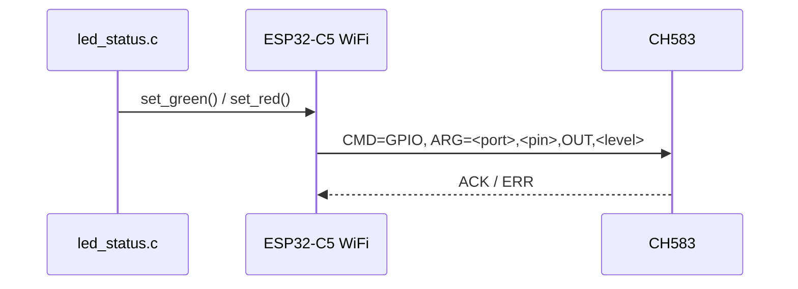

树状时序：

```text
业务模块
└─ UserLedStatus_Set(state)
   └─ UserLedStatus_Task()
      ├─ set_green()
      ├─ set_red()
      └─ set_ch583_led_level()
         └─ ch583_wifi_uart_send_gpio()
            └─ ch583_wifi_send_frame("GPIO", arg)
```

精简协议内容：

```text
CMD=GPIO
ARG=<port>,<pin>,<mode>,<level>

CMD=GPIO_READ
ARG=<port>,<pin>

CMD=GPIO_VALUE
ARG=<read_seq>,<port>,<pin>,<level>
```

GPIO 模式只保留常用说明：

```text
OUT：输出模式，level 使用 HIGH / LOW
IN_PU / IN_PD / IN_FLOAT：输入模式，level 使用 KEEP
```

禁止操作 GPIO：

```text
PB8：WiFi 电源/唤醒控制（CH583 固件侧 / 硬件侧行为，ESP32 当前源码不直接操作该引脚）
PA8：UART1 RX
PA9：UART1 TX
PB4：UART0 RX 调试
PB7：UART0 TX 调试
PB13：充电检测/CHARGE_LED
```


存 / 取信息（含条件限制）：

```text
存：
- GPIO / GPIO_READ 命令不写 NVS 或文件。

取：
- 读取 GPIO_VALUE 响应帧。
- 状态灯常亮/关闭通过 ch583_wifi_uart_send_gpio() 发送原 GPIO 设置命令；闪烁使用 10.11 的 LED_BLINK 协议。
```

[⬆ 返回目录](#toc) | [↩ 返回当前目录](#sec-10-8)

---

### 10.9 接收方处理原则 <span id="sec-10-9"></span>

Mermaid 时序图：

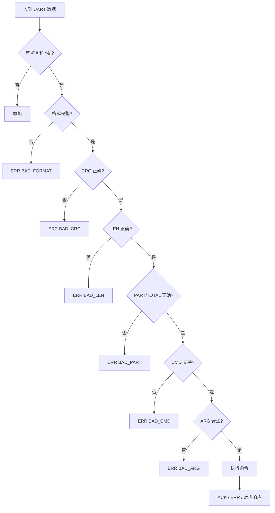

树状时序：

```text
ch583_wifi_uart_process_bytes()
├─ 没有 @# 和 ^&
│  └─ 忽略
├─ 格式不完整
│  └─ BAD_FORMAT
├─ CRC 错误
│  └─ BAD_CRC
├─ LEN 错误
│  └─ BAD_LEN
├─ PART/TOTAL 错误
│  └─ BAD_PART
├─ CMD 不支持
│  └─ BAD_CMD
├─ 参数错误
│  └─ BAD_ARG
└─ 校验全部通过
   ├─ 执行命令
   └─ 返回 ACK / ERR / 对应响应
```

精简协议内容：

```text
任何命令必须先通过 CRC、LEN、PART/TOTAL 校验，再执行实际动作。
DEVICE_INFO 不是 ESP32 的通信准入条件；无论本次启动是否已收到 DEVICE_INFO，合法命令都按各自规则执行。
WiFi 会记录上一条合法 CH583 -> WiFi 帧的 SEQ；如果下一条合法帧的 SEQ 不是 last+1，则打印错误日志提示可能丢帧。
SEQ 按 uint16_t 处理，65535 -> 0 属于正常连续递增。
SEQ gap 只用于诊断打印，不触发补包、重发或业务状态修正。
```


存 / 取信息（含条件限制）：

```text
存：
- 接收方处理原则不直接存储。

取：
- 逐步读取并校验帧头/帧尾、格式、CRC、LEN、PART/TOTAL、CMD、ARG。
```

[⬆ 返回目录](#toc) | [↩ 返回当前目录](#sec-10-9)

---

### 10.10 当前工程源码对应关系 <span id="sec-10-10"></span>

Mermaid 时序图：

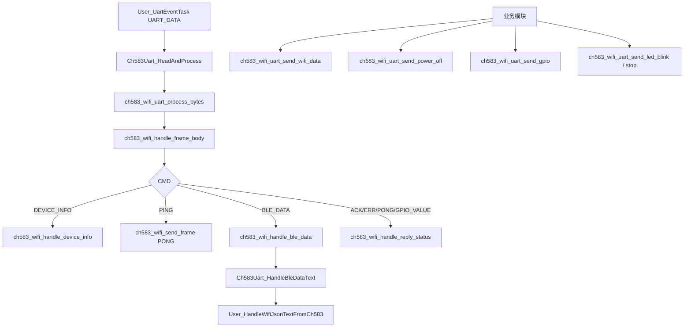

树状时序：

```text
CH583 UART RX
└─ User_UartEventTask()
   └─ UART_DATA event
      └─ Ch583Uart_ReadAndProcess(event.size)
         └─ uart_read_bytes()
            └─ ch583_wifi_uart_process_bytes()
               └─ ch583_wifi_handle_frame_body()
                  ├─ CMD=DEVICE_INFO
                  │  └─ ch583_wifi_handle_device_info()
                  ├─ CMD=PING
                  │  └─ ch583_wifi_send_frame("PONG")
                  ├─ CMD=BLE_DATA
                  │  └─ ch583_wifi_handle_ble_data()
                  │     └─ Ch583Uart_HandleBleDataText()
                  │        └─ User_HandleWifiJsonTextFromCh583()
                  └─ CMD=ACK / ERR / PONG / GPIO_VALUE
                     └─ ch583_wifi_handle_reply_status()
```

ESP32-C5 主动发送方向：

```text
业务模块
├─ send_base_info_to_mobile()
│  └─ ch583_wifi_uart_send_wifi_data()
├─ ServerNetworkStaWifiWorkTime
│  ├─ ch583_wifi_uart_send_wake_timer_on() / off()
│  └─ ch583_wifi_uart_send_power_off()
├─ led_status.c
│  ├─ 常亮/关闭: ch583_wifi_uart_send_gpio()
│  └─ 闪烁: ch583_wifi_uart_send_led_blink() / stop()
└─ get_ble_mac_no_colon()
   └─ ch583_wifi_uart_get_ble_mac()
```

存 / 取信息（含条件限制）：

```text
存：
- DEVICE_INFO：保存 BLE MAC、CH583 版本和映射后的 EPD 类型。
- BLE_DATA 下游：可能写 WiFi NVS 或工作时间 NVS。
- POWER_OFF/GPIO/WIFI_DATA：自身不写持久化。

取：
- User_UartEventTask() 阻塞等待 UART event queue；收到 UART_DATA 后由 Ch583Uart_ReadAndProcess() 从 UART 读取字节。
- User_UartEventTask() 使用 `USER_CH583_UART_EVENT_TASK_STACK_SIZE = 8 * 1024`；收到 UART_DATA 并完成解析后检查栈低水位，低于阈值会打印 `User_UartEventTask low stack watermark=...`。
- ch583_wifi_uart_process_bytes() 从帧缓冲读取完整帧。
- ch583_wifi_uart_get_ble_mac() 从 RAM/NVS 读取 BLE MAC。
```

CH583 UART1 小包接收与 light sleep 注意事项：

```text
当前工程中，CH583 -> ESP32-C5 的 UART1 小包可能只有几十字节，并且可能 5 秒左右才发送一次。
如果启用 ESP-IDF 自动 light sleep，ESP32-C5 可能在 CH583 发包前处于 light sleep。
UART RX 唤醒 ESP32-C5 时，用于唤醒的前几个字节/边沿可能不会完整进入 UART RX buffer。
对于 @#V1...^& 这种短帧，一旦帧头 @# 丢失，协议解析器就无法识别该帧，表现为“CH583 串口数据丢失”。
```

当前验证结论：

```text
将 tdx_cfg.h 中 TDX_AUTO_LIGHT_SLEEP_ENABLE 设置为 0 后，CH583 UART1 小包丢失问题消失。
因此该问题优先按 auto light sleep / UART wakeup 丢首字节处理，不按 UART buffer 不足处理。
```

要求：

```text
默认保持：
#define TDX_AUTO_LIGHT_SLEEP_ENABLE 0

如果后续重新开启 TDX_AUTO_LIGHT_SLEEP_ENABLE=1，则 CH583 固件必须配合：
1. 正式 @#V1...^& 帧之前先发送足够的唤醒前导字节，或
2. 先发送唤醒空包，延时后再发送正式协议帧。

否则短帧可能因为帧头丢失而被 ESP32-C5 协议解析器丢弃。
```

[⬆ 返回目录](#toc) | [↩ 返回当前目录](#sec-10-10)

---

### 10.11 LED 闪烁控制 <span id="sec-10-11"></span>

WiFi 在本节中指 ESP32-C5。红绿灯原有 `CMD=GPIO` 常亮/关闭协议保持不变；新增命令只负责闪烁。ESP32-C5 仅在状态变化时下发开始、更新或停止命令，LED 的定时翻转全部由 CH583 本地执行。

硬件定义：

```text
RED    PB5，低电平点亮，高电平关闭
GREEN  PB6，低电平点亮，高电平关闭
```

#### 10.11.1 开始或更新闪烁 <span id="sec-10-11-1"></span>

```text
@#V1|SEQ=<seq>|CMD=LED_BLINK|LEN=<len>|PART=1|TOTAL=1|ARG=<led>,<interval_ms>|CRC=<crc>^&
```

字段和规则：

```text
led          只能是 RED 或 GREEN，不允许 BOTH
interval_ms  1~10000，单位 ms，表示翻转间隔而不是完整亮灭周期

CH583 收到后先点亮目标 LED，再按 interval_ms 翻转。
同一 LED 再次收到 LED_BLINK 时更新间隔，并重新从点亮状态开始。
红灯和绿灯使用独立定时事件，可以采用不同间隔。
参数合法并启动成功返回 ACK；参数非法返回 ERR,BAD_ARG。
```

ESP32-C5 状态灯使用 10 级、每级增加 600 ms 的翻转间隔：

| 级别 | interval_ms | 说明 |
|---:|---:|---|
| 1 | 600 | FAST |
| 2 | 1200 | MID |
| 3 | 1800 | 预留档位 |
| 4 | 2400 | SLOW |
| 5 | 3000 | 预留档位 |
| 6 | 3600 | 预留档位 |
| 7 | 4200 | 预留档位 |
| 8 | 4800 | 预留档位 |
| 9 | 5400 | 预留档位 |
| 10 | 6000 | 预留档位 |

GREEN 设备状态灯规则：

```text
LED 模块初始化后 GREEN 常亮，表示设备正在启动。
WiFi 连接、等待 IP、自动重连和 HTTP 启动期间发送 LED_BLINK GREEN,1200。
网络和 HTTP 服务 READY 后发送 LED_BLINK GREEN,600，作为正常工作心跳。
成功操作使 GREEN 常亮 1000 ms，随后恢复最新基础设备状态。
WiFi、HTTP、存储或严重故障使 GREEN 关闭；OTA 期间 GREEN 常亮。
关机倒计时期间 GREEN 常亮，真正发送 POWER_OFF 前停止闪烁并强制 PB6 关闭。
每次调用 ch583_wifi_uart_send_power_off() 前，必须先发送 LED_BLINK_STOP GREEN，再强制 PB6 为关闭电平。
LED 关机准备成功后 GREEN 保持关闭；如果 final guard 发现新任务并取消本次关机，则同步解除关机锁并恢复当前基础灯效。
```

RED 任务活动灯规则：

```text
LED 模块初始化后，先发送 LED_BLINK_STOP RED 并强制 PB5 为关闭电平；RED 默认关闭。
大网络数据、分片/大 BLE_DATA 和大 WIFI_DATA 开始时，RED 先通过 GPIO 常亮。
NETWORK/UART 任务在 300 ms 内完成：RED 直接关闭，期间不发送 LED_BLINK。
NETWORK、UART RX、UART TX 任务超过 300 ms：发送 LED_BLINK RED,600。
EPD 开始刷新后直接发送 LED_BLINK RED,2400，不等待 300 ms。
EPD 与网络或 UART 同时活动时，EPD 的 2400 ms 慢闪优先。
最后一个活动任务完成：常亮状态用 GPIO 关闭；闪烁状态发送 LED_BLINK_STOP RED。
网络、UART RX、UART TX、EPD 分别计数；任务重叠时，只有全部计数归零才关闭 RED。
大网络数据条件：multipart、OTA 或 body 大于 4096 字节。
大串口数据条件：分片 BLE_DATA，或 BLE_DATA/WIFI_DATA 长度大于等于 256 字节。
PING/PONG、ACK/ERR、DEVICE_INFO、LED/GPIO 等协议维护命令不触发 RED。
```

示例：

```text
@#V1|SEQ=120|CMD=LED_BLINK|LEN=7|PART=1|TOTAL=1|ARG=RED,600|CRC=XXXX^&
@#V1|SEQ=121|CMD=LED_BLINK|LEN=10|PART=1|TOTAL=1|ARG=GREEN,1200|CRC=XXXX^&
```

#### 10.11.2 停止闪烁并关闭 LED <span id="sec-10-11-2"></span>

```text
@#V1|SEQ=<seq>|CMD=LED_BLINK_STOP|LEN=<len>|PART=1|TOTAL=1|ARG=<led>|CRC=<crc>^&
```

规则：

```text
led 只能是 RED 或 GREEN，不允许 BOTH。
只停止指定 LED，不影响另一个 LED。
停止后 CH583 将该 LED 输出高电平并关闭。
参数合法并停止成功返回 ACK；参数非法返回 ERR,BAD_ARG。
```

ESP32-C5 侧实现：

```text
所有 LED 公共接口
└─ 向单一 LED event queue 投递事件
   └─ UserLedStatus_Task()
      ├─ 保存基础状态、故障、活动计数和临时结果
      ├─ 按优先级计算最终红绿灯效
      ├─ 仅在输出变化时发送 LED_BLINK / LED_BLINK_STOP / GPIO
      ├─ 命令写入失败时每 500 ms 重试，最多重试 3 次
      └─ 不通过 ESP32 Task 周期发送 GPIO 翻转
```

当前仓库只包含 ESP32-C5 的发送接口；CH583 固件还需要实现 PB5/PB6 的独立定时事件以及上述 ACK/ERR 处理。

[⬆ 返回目录](#toc) | [↩ 返回当前目录](#sec-10-11)

---

### 10.12 WAKE_TIMER：WiFi 定时唤醒配置 <span id="sec-10-12"></span>

该命令用于让 WiFi（ESP32-C5）在进入低功耗/关机前，告诉 CH583/CH585 下一次需要唤醒 WiFi 的时间。

CH583/CH585 收到合法配置后立即保存，并在 WiFi 后续发送 `POWER_OFF` / `LOWPOWER` 后启动定时器。定时时间到后，CH583/CH585 拉高 WiFi 唤醒脚唤醒 WiFi。

当前 CH585 方案使用 `PA6` 唤醒 WiFi；旧 CH583 方案如仍使用 `PB8`，以硬件版本为准。

#### 10.12.1 开启定时唤醒 <span id="sec-10-12-1"></span>

WiFi 发送：

```text
@#V1|SEQ=<seq>|CMD=WAKE_TIMER|LEN=<len>|PART=1|TOTAL=1|ARG=ON,<seconds>|CRC=<crc>^&
```

参数：

```text
seconds 单位：秒
允许范围：1..604800
```

示例：

```text
@#V1|SEQ=10|CMD=WAKE_TIMER|LEN=7|PART=1|TOTAL=1|ARG=ON,3600|CRC=XXXX^&
```

含义：WiFi 进入低功耗后，CH583/CH585 在 3600 秒后唤醒 WiFi。

CH583/CH585 校验并保存成功后回复：

```text
ACK,<received_seq>
```

#### 10.12.2 关闭定时唤醒 <span id="sec-10-12-2"></span>

WiFi 发送：

```text
@#V1|SEQ=<seq>|CMD=WAKE_TIMER|LEN=5|PART=1|TOTAL=1|ARG=OFF,0|CRC=<crc>^&
```

CH583/CH585 校验并保存成功后回复：

```text
ACK,<received_seq>
```

#### 10.12.3 错误返回 <span id="sec-10-12-3"></span>

```text
ON,0            ERR,<received_seq>,BAD_TIME
ON,604801       ERR,<received_seq>,BAD_TIME
ON,abc          ERR,<received_seq>,BAD_TIME
OFF,1           ERR,<received_seq>,BAD_TIME
参数格式错误     ERR,<received_seq>,BAD_ARG
PART/TOTAL 错误 ERR,<received_seq>,BAD_PART
LEN 错误         ERR,<received_seq>,BAD_LEN
```

ESP32-C5 侧使用：

```text
work_state_task()所有关机保护解除后：
├─ DAILY：按每日计划设置WAKE_TIMER；设置失败则推迟POWER_OFF
├─ SLIDESHOW：按RTC/runtime timing设置WAKE_TIMER
│  └─ wake_interval < 当前10秒阈值：跳过本次POWER_OFF
├─ NORMAL：发送WAKE_TIMER OFF,0
├─ 后续关机取消或失败：回滚本次已开启的WAKE_TIMER
└─ 条件仍满足时发送POWER_OFF
```

DAILY必须保证下次唤醒，因此WAKE_TIMER设置失败时不关机；其他模式保留原有警告及关机策略。所有模式仍受HTTP/CH583、OTA、EPD、图片保存和每日一图busy保护。

[⬆ 返回目录](#toc) | [↩ 返回当前目录](#sec-10-12)

---

### 10.13 NFC 内容管理 <span id="sec-10-13"></span>

该功能用于 WiFi（ESP32-C5）在被唤醒后，把需要给手机 NFC 读取的设备信息写入 CH583/CH585。CH583/CH585 保存该内容，并在手机靠近触发 NFC-only 会话时，以普通 NDEF Text JSON 形式提供给手机读取。

重要原则：

```text
真实 NFC 展示数据只允许 WiFi 通过 UART 协议修改。
手机端普通 NDEF 写入只作为授权唤醒命令，不作为真实展示数据保存。
NFC 展示数据由 CH583/CH585 保存到 DataFlash，软复位/断电重启后仍可恢复。
手机读取 NFC 时读取的是 CH583/CH585 RAM 中模拟的 Type2 Tag/NDEF 缓存，不是每次直接读 Flash。
```

ESP32-C5 侧实现文件：

```text
main/ch583_uart/ch583_wifi_uart_protocol.c
main/ch583_uart/ch583_wifi_uart_protocol.h
main/server_network_sta/wifi_work_time/server_network_sta_wifi_work_time.c
main/tdx_cfg.h
```

#### 10.13.1 写入 NFC 展示 JSON <span id="sec-10-13-1"></span>

WiFi 发送：

```text
@#V1|SEQ=<seq>|CMD=NFC_SET|LEN=<len>|PART=1|TOTAL=1|ARG=<base64url_json>|CRC=<crc>^&
```

参数：

```text
ARG 为 UTF-8 JSON 的 base64url 编码结果。
base64url 使用 URL 安全字符：A-Z a-z 0-9 - _
省略尾部 = padding。
JSON 解码后最大长度：220 字节。
```

ESP32-C5 侧接口：

```c
int ch583_wifi_uart_send_nfc_set_json(const char *json);
```

限制：

```text
CH583_WIFI_NFC_JSON_MAX_LEN = 220
CH583_WIFI_NFC_BASE64URL_MAX_LEN = 300
NFC_SET 不做 UART 分包，PART/TOTAL 固定为 1/1。
base64url 后的 ARG 必须小于等于 CH583_WIFI_MAX_ARG_LEN。
```

示例 JSON：

```json
{"mac":"D00C5E140647","wifi":"sleep","nfc":"ready","msg":"hello"}
```

成功回复：

```text
ACK,<received_seq>
```

失败回复：

```text
base64url 解码失败：ERR,<received_seq>,BAD_ARG
JSON 长度为 0 或超过 220 字节：ERR,<received_seq>,BAD_LEN
NFC 正在被手机读写或处于忙状态：ERR,<received_seq>,NFC_BUSY
PART/TOTAL 错误：ERR,<received_seq>,BAD_PART
LEN 错误：ERR,<received_seq>,BAD_LEN
CRC 错误：ERR,<received_seq>,BAD_CRC
```

#### 10.13.2 清空 NFC 展示内容 <span id="sec-10-13-2"></span>

WiFi 发送：

```text
@#V1|SEQ=<seq>|CMD=NFC_CLEAR|LEN=0|PART=1|TOTAL=1|ARG=|CRC=<crc>^&
```

ESP32-C5 侧接口：

```c
int ch583_wifi_uart_send_nfc_clear(void);
```

CH583/CH585 行为：

```text
清除 DataFlash 中保存的 NFC 展示 JSON。
恢复默认 NFC 展示 JSON。
更新 RAM 中的 NDEF 缓存。
回复 ACK。
```

#### 10.13.3 查询 NFC 状态 <span id="sec-10-13-3"></span>

WiFi 发送：

```text
@#V1|SEQ=<seq>|CMD=NFC_STATUS|LEN=0|PART=1|TOTAL=1|ARG=|CRC=<crc>^&
```

ESP32-C5 侧接口：

```c
int ch583_wifi_uart_send_nfc_status(void);
```

CH583/CH585 回复：

```text
@#V1|SEQ=<seq>|CMD=NFC_STATUS|LEN=<len>|PART=1|TOTAL=1|ARG=<state>,<payload_len>,<last_auth_result>|CRC=<crc>^&
```

字段：

```text
state             IDLE / READY，当前 NFC/PICC 状态
payload_len       当前 NFC 展示 JSON 的 UTF-8 字节长度
last_auth_result  NONE / OK / BAD_FORMAT / BAD_TOKEN
```

当前 ESP32-C5 第一版只把 `NFC_STATUS` 当作已知状态帧打印，不保存缓存；后续如需 HTTP/USB 查询，再增加 RAM 状态缓存。

#### 10.13.4 开机一次性 NFC 测试 <span id="sec-10-13-4"></span>

测试开关：

```c
#define CH583_WIFI_NFC_TEST_ENABLE 0
#define CH583_WIFI_NFC_TEST_START_DELAY_SECONDS 5
```

测试函数：

```c
bool ch583_wifi_uart_test_nfc_step(void);
```

测试方式：

```text
复用现有 work_state_task，不新增 task。
work_state_task 的循环间隔为 USER_WORK_STATE_TASK_INTERVAL_MS，当前为 1 秒。
work_state_task 启动早于 Ch583UartApp_Init()，因此 NFC 测试默认等待 CH583_WIFI_NFC_TEST_START_DELAY_SECONDS 秒后才开始，避免 UART 尚未初始化时抢跑。
默认值为 0，不执行测试。仅在开发调试时临时改为 `CH583_WIFI_NFC_TEST_ENABLE=1`，开机后每次循环才执行一步：
1. ch583_wifi_uart_send_nfc_set_json(json)
2. ch583_wifi_uart_send_nfc_status()
3. ch583_wifi_uart_send_nfc_clear()
4. ch583_wifi_uart_send_nfc_status()

第 4 步完成后，本次开机不再重复测试。
```

测试 JSON：

```json
{"mac":"D00C5E140647","wifi":"sleep","nfc":"ready","msg":"hello"}
```

预期串口方向打印：

```text
WiFi -> CH583: cmd=NFC_SET ...
CH583 -> WiFi: cmd=ACK ...
WiFi -> CH583: cmd=NFC_STATUS ...
CH583 -> WiFi: cmd=NFC_STATUS arg=IDLE,51,NONE
WiFi -> CH583: cmd=NFC_CLEAR ...
CH583 -> WiFi: cmd=ACK ...
WiFi -> CH583: cmd=NFC_STATUS ...
CH583 -> WiFi: cmd=NFC_STATUS arg=READY,<len>,<last_auth_result>
```

#### 10.13.5 与手机 NFC 授权写入的关系 <span id="sec-10-13-5"></span>

手机端授权唤醒 WiFi 使用普通 NDEF 写入，推荐写入 NDEF Text JSON：

```json
{"cmd":"NWK1","token":"<TOKEN16>"}
```

`TOKEN16` 是按设备 MAC 派生的固定授权口令。手机写入的授权 NDEF 只作为一次性命令；CH583/CH585 校验 token 后立即从 RAM 备份恢复原 NFC 展示 JSON。手机写入内容不保存到 DataFlash，不会长期覆盖 WiFi 通过 `NFC_SET` 写入的真实展示数据。

[⬆ 返回目录](#toc) | [↩ 返回当前目录](#sec-10-13)

---

### 10.14 WIFI_PROVISION：WiFi 配网状态上报 <span id="sec-10-14"></span>

该命令用于 WiFi（ESP32-C5）在启动 STA 流程、EPD 工作模式变化后，以及准备向 CH583/CH585 发送 `POWER_OFF` 前，上报当前复合状态。状态使用 2 位十六进制文本：第 1 位表示 WiFi 是否已配网，第 2 位表示 EPD 相框工作模式或本次关机的临时待机状态。

ESP32-C5 侧实现文件：

```text
main/ch583_uart/ch583_wifi_uart_protocol.c
main/ch583_uart/ch583_wifi_uart_protocol.h
main/epd_display/epd_display_mode.c
main/server_network_sta/server_network_sta.c
main/server_network_sta/wifi_work_time/server_network_sta_wifi_work_time.c
```

WiFi 发送：

```text
@#V1|SEQ=<seq>|CMD=WIFI_PROVISION|LEN=2|PART=1|TOTAL=1|ARG=<status_hex>|CRC=<crc>^&
```

参数：

```text
LEN=2
ARG=<status_hex>
status_hex 为 2 位十六进制文本，表示 1 个复合状态 byte。
第 1 位十六进制字符 = 高 4bit，表示 WiFi 配网状态。
第 2 位十六进制字符 = 低 4bit，表示相框工作模式。
CRC 计算包含这 2 个文本字符，例如 ARG=50 时按字符 '5' 和 '0' 计算。
```

ARG bit 定义：

```text
高 4bit 表示 WiFi 配网状态：
0100 = 未配网，NVS 没有有效 WiFi 信息，可见 ASCII 范围 0x40~0x4F
0101 = 已配网，NVS 有有效 WiFi 信息，可见 ASCII 范围 0x50~0x5F

低 4bit 表示相框工作模式：
0000 = 普通模式
0001 = 轮播模式
0010 = 每日更新模式
0011..1110 = 保留
1111 = 待机模式（仅在发送 POWER_OFF 前临时上报）
```

组合规则：

```text
普通状态：ARG = (provision_status_nibble << 4) | epd_mode
关机之前：ARG = (provision_status_nibble << 4) | shutdown_mode
provision_status_nibble: 未配网=0x4，已配网=0x5
shutdown_mode: NORMAL=0xF，SLIDESHOW=0x1，DAILY=0x2
```

示例：

```text
@#V1|SEQ=230|CMD=WIFI_PROVISION|LEN=2|PART=1|TOTAL=1|ARG=50|CRC=XXXX^&
@#V1|SEQ=231|CMD=WIFI_PROVISION|LEN=2|PART=1|TOTAL=1|ARG=51|CRC=XXXX^&
@#V1|SEQ=232|CMD=WIFI_PROVISION|LEN=2|PART=1|TOTAL=1|ARG=52|CRC=XXXX^&

0x40 = 未配网 + 普通模式，ASCII '@'
0x50 = 已配网 + 普通模式，ASCII 'P'
0x51 = 已配网 + 轮播模式，ASCII 'Q'
0x52 = 已配网 + 每日更新模式，ASCII 'R'
0x42 = 未配网 + 每日更新模式，ASCII 'B'
```

关机前示例：

```text
0x41 = 未配网 + 轮播模式，ASCII 'A'
0x51 = 已配网 + 轮播模式，ASCII 'Q'
0x42 = 未配网 + 每日更新模式，ASCII 'B'
0x52 = 已配网 + 每日更新模式，ASCII 'R'
0x4F = 未配网 + 临时待机模式，ASCII 'O'
0x5F = 已配网 + 临时待机模式，ASCII '_'
```

说明：`0xF`不是持久化模式，只供NORMAL关机前临时上报；SLIDESHOW和DAILY关机前继续上报各自模式。该通知不修改`EpdDisplayMode`或NVS。

CH583/CH585 行为：

```text
校验 CRC/LEN/PART/TOTAL
只接受 2 位十六进制 ARG
高 4bit 当前只接受 4 或 5
低 4bit 接受 0、1、2、F
合法配网状态保存到 DataFlash
合法工作模式 0、1、2 保存到 DataFlash
F 只表示即将进入待机，不作为持久化工作模式保存
WIFI_PROVISION 会同时更新复合状态 byte 的高 4bit 和低 4bit
保存并刷新成功后回复 ACK
```

广播名第 21 位复合状态规则：

```text
只修改 TDX 广播名
BOE 广播名不修改
第 21 位对应 CH583/CH585 代码中的 scanRspData[22]
scanRspData[22] 是原始 byte，当前编码落在可见 ASCII 范围 0x40~0x5F
scanRspData[22] = (provision_status_nibble << 4) | frame_work_mode
provision_status_nibble: 未配网=0x4，已配网=0x5
scanRspData[20] 保持原有逻辑，不因该复合状态规则改变
```

刷新与恢复规则：

```text
每次收到合法 WIFI_PROVISION 后立即刷新 scanRspData[22]
工作模式变化后立即刷新 scanRspData[22]
复位后恢复 DataFlash 中最后一次保存的配网状态和工作模式
未保存过、读到 0xFF 或非法保存值时，配网默认 0，工作模式默认 0
```

CH583/CH585 回复：

```text
保存并刷新成功：ACK
ARG 不是 2 位十六进制，或 bit 值超出当前定义范围：ERR,BAD_ARG
LEN 不是 2：ERR,BAD_LEN
PART/TOTAL 不是 1/1：ERR,BAD_PART
CRC 错误：ERR,BAD_CRC
```

ESP32-C5 侧调用点：

```text
User_Network_mode_app_init()
└─ wifi_manager 收到启动命令后调用 read_saved_wifi()
   ├─ credential.is_valid == false：ch583_wifi_uart_send_wifi_provision_status(0)
   └─ credential.is_valid == true： ch583_wifi_uart_send_wifi_provision_status(1)

EpdDisplayMode_Set()
└─ epd_mode 写入成功后：ch583_wifi_uart_send_current_wifi_provision_status()

work_state_task()
└─ 所有关机 guard 通过并取得 SPI 锁后
   ├─ ch583_wifi_uart_send_wifi_provision_mode_before_power_off(epd_mode)
   ├─ NORMAL=F，SLIDESHOW=1，DAILY=2
   └─ 随后发送 POWER_OFF
```

`ch583_wifi_uart_send_wifi_provision_status()` 内部保存最近一次 WiFi 配网状态；当 `epd_mode` 变化时，使用这个缓存的配网状态重新组合 ARG 并再次上报 CH583/CH585。若还没有读取到 WiFi 配网状态，则按未配网 `0` 处理。

`ch583_wifi_uart_send_wifi_provision_mode_before_power_off()`只读取最近一次配网状态并发送，不修改缓存、`EpdDisplayMode`或NVS。通知失败不阻止原有`POWER_OFF`；若`POWER_OFF`发送失败，则恢复上报持久工作模式。

调试信息：

```text
WiFi -> CH583: seq=<seq> cmd=WIFI_PROVISION arg=<status_hex>
CH583_PROTO WIFI_PROVISION provision=<0|1> mode=<0|1|2> combined=0x<xx> arg=<status_hex> send_ret=<ret>
server_network_sta: CH583 WIFI_PROVISION status=<0|1> ret=<ret>
server_sta_wifi_time: pre-power-off WIFI_PROVISION sent mode=<n>(<name>)
```

注意事项：

```text
该命令不新增 JSON result 编码。
ESP32-C5 不处理 CH583/CH585 的 scanRspData 字节，广播名刷新由 CH583/CH585 负责。
当前协议使用公共 ch583_wifi_send_frame() 发送 2 位十六进制文本 ARG。
代码中保留的单字节二进制 ARG 专用发送函数仅作为以后可能恢复二进制协议时使用，当前不调用。
```

[⬆ 返回目录](#toc) | [↩ 返回当前目录](#sec-10-14)

---

### 10.15 WiFi 网络时间同步与备份时间 <span id="sec-10-15"></span>

该功能用于 WiFi（ESP32-C5）在有网络时间时，把北京时间同步给 CH583/CH585。CH583/CH585 不直接重设硬件 RTC，而是保存“WiFi 网络时间”和“当前 RTC 时间”的映射关系，用于后续 `TIME_GET` 查询和定时唤醒到期判断。

内部时间模型：

```text
base_wall_time = WiFi 下发的北京时间
base_rtc_time  = 收到 TIME_SET 时 CH583/CH585 当前 RTC 时间
backup_time    = base_wall_time + (rtc_now - base_rtc_time)
```

说明：

```text
WiFi 下发时间按北京时间解释，不是 UTC。
CH583/CH585 不调用 RTC_InitTime 校准硬件 RTC。
TIME_SET 只更新 RAM 并立即 ACK，不立即写 DataFlash。
DataFlash 保存发生在 WiFi POWER_OFF / LOWPOWER 收尾阶段。
复位后如果只能读取到 DataFlash 中最后保存的时间，TIME_GET 返回 STALE。
从未成功 TIME_SET 且没有可用保存值时，TIME_GET 返回 INVALID。
ESP32-C5 优先接受 TIME_STATUS VALID 作为开机恢复 RTC 轮播的备份时间源；STALE 可作为无 WiFi 轮播 fallback 时间源，INVALID 不写 RTC。
SNTP 成功后，ESP32-C5 会发送 TIME_SET 给 CH583/CH585，同步最新北京时间，不受 DEVICE_INFO 是否到达影响；首次收到合法 DEVICE_INFO 时若已有可靠时间，也会同步一次当前时间。
APP/PC 请求中带合法 timestamp 时，ESP32-C5 会尽量发送 TIME_SET 给 CH583/CH585；该备份动作不改变原业务逻辑、result 返回码或是否启动轮播。
APP/PC timestamp 非法但 ESP32-C5 已完成 SNTP 同步时，ESP32-C5 会把当前 SNTP 时间发送给 CH583/CH585。
SNTP 已同步且 APP/PC timestamp 与当前 SNTP 时间差值超过 5 秒时，原轮播逻辑仍返回 1513 并拒绝本次轮播，但仍会先把 APP/PC timestamp 发送给 CH583/CH585 作为备份。
```

#### 10.15.1 设置网络时间 <span id="sec-10-15-1"></span>

WiFi 发送：

```text
@#V1|SEQ=<seq>|CMD=TIME_SET|LEN=19|PART=1|TOTAL=1|ARG=YYYY-MM-DD,HH:MM:SS|CRC=<crc>^&
```

参数：

```text
YYYY-MM-DD,HH:MM:SS 固定 19 字节，北京时间
年份范围：2020..2064
月、日、时、分、秒必须是合法日期时间
```

CH583/CH585 回复 WiFi：

```text
参数合法并更新 RAM 成功：ACK
LEN 不是 19：ERR,BAD_LEN
日期格式错误或日期非法：ERR,BAD_TIME
PART/TOTAL 不是 1/1：ERR,BAD_PART
CRC 错误：ERR,BAD_CRC
```

ESP32-C5 调用点：

```text
SNTP synced callback
└─ ServerNetworkStaTime_BackupTimestampToCh583(reason=sntp)

APP/PC set_slideshow / start_slideshow / USB start_slideshow
├─ timestamp 合法：ServerNetworkStaTime_BackupTimestampToCh583(reason=...timestamp)
├─ timestamp 非法且 SNTP 已同步：ServerNetworkStaTime_BackupCurrentToCh583(reason=...bad_timestamp_sntp_now)
├─ set_slideshow sw=0 且未带合法 timestamp，但 SNTP 已同步：ServerNetworkStaTime_BackupCurrentToCh583(reason=set_slideshow_sw0_sntp_now)
└─ timestamp 非法且 SNTP 未同步：不发 TIME_SET

ServerNetworkStaTime_SetTimestamp()
└─ SNTP 未同步时接受 APP/PC timestamp 写入 RTC/system time 后，再 TIME_SET 备份到 CH583/CH585
```

关键打印：

```text
SNTP synced, RTC/system time updated ...
CH583 TIME_SET backup reason=sntp epoch=1783496860 time=2026-07-08,15:47:40 ret=0
CH583 TIME_SET backup reason=set_slideshow_timestamp epoch=... time=... ret=0
CH583 TIME_SET backup reason=start_slideshow_bad_timestamp_sntp_now epoch=... time=... ret=0
WiFi -> CH583: seq=<seq> cmd=TIME_SET arg=2026-07-08,15:47:40
```

#### 10.15.2 查询备份时间 <span id="sec-10-15-2"></span>

WiFi 发送：

```text
@#V1|SEQ=<seq>|CMD=TIME_GET|LEN=0|PART=1|TOTAL=1|ARG=|CRC=<crc>^&
```

CH583/CH585 回复：

```text
@#V1|SEQ=<seq>|CMD=TIME_STATUS|LEN=<len>|PART=1|TOTAL=1|ARG=<status>|CRC=<crc>^&
```

`ARG=<status>` 格式：

```text
VALID,YYYY-MM-DD,HH:MM:SS
STALE,YYYY-MM-DD,HH:MM:SS
INVALID
```

含义：

```text
VALID   本轮 RTC 未复位，时间由 RTC 差值实时推算，可信；ESP32-C5 可写入 RTC/system time，并允许恢复旧 RTC 轮播。
STALE   复位后只能返回 DataFlash 中最后保存的备份时间，不保证继续走过离线时长；ESP32-C5 仍可按原逻辑将它写入 RTC 作为非 SNTP 轮播 fallback。启动时已有 SNTP 或运行中首次取得 SNTP 后，才使用绝对时间槽覆盖旧 pending_file。
INVALID 从未成功 TIME_SET，且没有可用备份时间；ESP32-C5 不用它启动旧 RTC 轮播。
```

ESP32-C5 调用点：

```text
Ch583UartApp_Init()
└─ ServerNetworkStaTime_RequestCh583Backup()
   └─ ch583_wifi_uart_send_time_get()

CH583 -> WiFi CMD=TIME_STATUS
└─ ServerNetworkStaTime_OnCh583TimeStatus()
   ├─ VALID：写 ESP32-C5 RTC/system time，source=ch583_valid
   ├─ STALE：写 ESP32-C5 RTC/system time，source=ch583_stale_fallback，主要用于无 WiFi 轮播恢复
   └─ INVALID：打印并保留给轮播启动的 anchor_epoch fallback
```

开机恢复 RTC 轮播保护：

```text
ServerNetworkStaSlideshow_StartSavedDelayed()
└─ 等待可用于轮播恢复的 RTC 时间源
   ├─ source=sntp：允许恢复
   ├─ source=timestamp：允许恢复
   ├─ source=ch583_valid：允许恢复
   ├─ source=ch583_stale_fallback：允许恢复，打印 warning
   └─ source=default/none 且 CH583 无可用时间：短暂等待后写入 show_control.anchor_epoch，source=slideshow_anchor_fallback，并立即恢复当前 pending_file
```

关键打印：

```text
CH583 TIME_GET request ret=0
CH583 TIME_STATUS VALID accepted, RTC/system time updated epoch=... local=...
CH583 TIME_STATUS STALE accepted as slideshow fallback, RTC/system time updated source=ch583_stale_fallback epoch=... local=...
CH583 TIME_STATUS INVALID ignored for RTC restore
slideshow startup waiting usable RTC time source wait=0 fallback_after=3
slideshow startup fallback to anchor_epoch=... after waiting 3 seconds
```

[⬆ 返回目录](#toc) | [↩ 返回当前目录](#sec-10-15)

---

[⬆ 返回目录](#toc) | [↩ 返回当前目录](#sec-10)

---

## 11. CH583 BLE JSON 配网与唤醒 <span id="sec-11"></span>

当前默认 `USER_BLE_ENABLE=0`，ESP32-C5 本机 BLE 不启动。手机 JSON 由 CH583 通过 UART `BLE_DATA` 送入 ESP32-C5；ESP32-C5 使用 UART `WIFI_DATA` 把结果送回 CH583。若以后把 `USER_BLE_ENABLE` 改为 1，本机 BLE 写入也复用同一个 JSON handler。

实际支持的 `func` 只有：

```text
wifi
wifi_wakeup
set_wifi_work_time
wifi_standby
```

空 JSON 返回 `ble_json_result/1201`，JSON 解析失败返回 `1203`，缺少或不支持 `func` 返回 `1202`；结果发送失败时尝试返回 `1204`。正式数值见 [README_Result_Code.md](README_Result_Code.md)。

### 11.1 BLE_DATA / WIFI_DATA 传输链路 <span id="sec-11-1"></span>

```text
手机
└─ CH583 BLE write
   └─ UART BLE_DATA（支持 PART/TOTAL 分片）
      └─ ch583_wifi_handle_ble_data()
         └─ User_HandleWifiJsonTextFromCh583()
            └─ handle_wifi_json_text_with_sender()
               ├─ 按 func 校验并执行
               └─ ch583_wifi_uart_send_wifi_data()
                  └─ UART WIFI_DATA -> CH583 -> 手机 notify
```

只有通过帧格式、LEN/PART、CRC 和分片顺序校验的 `BLE_DATA` 才进入 JSON handler，并刷新 CH583/业务活动时间。

### 11.2 wifi：保存配置并连接 <span id="sec-11-2"></span>

请求：

```json
{"func":"wifi","ssid":"AP_NAME","key":"PASSWORD"}
```

`ssid` 必须是长度 1..32 的字符串；`key` 必须是字符串且长度小于 65，允许空字符串用于开放网络。代码把配置写入 `wifi:ssid/password` 和 `nvs.net80211:sta.ssid/sta.pswd`，然后创建唯一的 `ble_wifi_connect` task。已有连接 task 时返回 `1007`。

保存和任务提交成功后先返回：

```json
{"func":"wifi_result","result":0,"message":"WiFi config saved and connect submitted"}
```

后台 READY 且 HTTP ready 后再返回 `wifi_info_result`，字段包括 `stage=<IP>`、`WiFi=<当前SSID>`、`version=<ESP版本>:<CH583版本>`、`date` 和 `running`。连接失败通过 `wifi_result` 返回 `1307/1308/1309`。

### 11.3 wifi_wakeup：使用已保存配置连接 <span id="sec-11-3"></span>

请求只需要：

```json
{"func":"wifi_wakeup"}
```

实际分支：

```text
READY且有IP、HTTP ready       -> wifi_info_result（当前不含result字段）
连接或服务正在进行            -> wifi_wakeup_result/result=0，并返回stage/state/retry信息
AUTH_FAILED                   -> wifi_wakeup_result/1308
没有保存的SSID                -> wifi_wakeup_result/1205
可以重新连接                  -> 提交连接task并返回wifi_wakeup_result/result=0
任务提交失败                  -> wifi_wakeup_result/1307
```

后台连接完成后，成功返回 `wifi_info_result`；失败使用 `wifi_wakeup_result` 返回 `1007/1307/1308/1309`。

### 11.4 set_wifi_work_time / wifi_standby <span id="sec-11-4"></span>

CH583/BLE JSON 同时接受新旧 `func`，并同时兼容 `seconds` 和旧字段 `time`。新格式：

```json
{"func":"set_wifi_work_time","seconds":300}
```

兼容旧格式：

```json
{"func":"wifi_standby","time":300}
```

取值经 `cJSON` number 的 `valueint` 读取，范围是 `60..3600` 秒。成功调用 `ServerNetworkStaWifiWorkTime_SetAndSave()` 并返回 `set_wifi_work_time_result/0`；缺少数值返回 `1351`，越界返回 `1352`，保存或应用失败返回 `1353/1354`。

---
