# README_Reference.md

本文件保存代码定位资料：公共配置、WiFi/HTTP Server、EPD 驱动、静态资源、目录与函数索引，以及日志约定。功能与状态规则以 [README_Fun.md](README_Fun.md) 为准。

## 目录 <span id="toc"></span>

- [调试日志与敏感信息约定](#sec-debug-log)
- [2. 配置与公共参数](#sec-02)
- [5. WiFi STA 与 HTTP Server](#sec-05)
  - [5.1 V2 ping 连通性检查](#sec-05-1)
- [12. EPD 显示队列与屏幕类型](#sec-12)
  - [12.1 EPD 显示队列与显示任务](#sec-12-1)
  - [12.2 EPD 类型管理与 NVS 保存](#sec-12-2)
  - [12.3 display_bsp：EPD SPI / GPIO](#sec-12-3)
  - [12.4 epd_type_800_480](#sec-12-4)
  - [12.5 epd_type_1024_600](#sec-12-5)
  - [12.6 epd_type_1600_1200_common](#sec-12-6)
  - [12.7 epd_type_1600_1200_79](#sec-12-7)
  - [12.8 epd_type_1600_1200_133](#sec-12-8)
    - [12.8.1 epd_type_1600_1200_133_DKE](#sec-12-8-1)
  - [12.9 epd_type_1360_480_1085](#sec-12-9)
  - [12.10 epd_type_1360_480_1085_3color](#sec-12-10)
  - [12.11 epd_type_4color_common](#sec-12-11)
  - [12.12 epd_type_800_480_4s_75](#sec-12-12)
  - [12.13 epd_type_800_480_4s_75_DKE](#sec-12-13)
  - [12.14 epd_type_800_480_4s_75_mofang](#sec-12-14)
  - [12.15 三色屏测试数据源](#sec-12-15)
  - [12.16 EPD/SD 共用电源测试](#sec-12-16)
- [14. 文件服务器静态资源与旧接口](#sec-14)
- [16. 目录到功能索引](#sec-16)
- [按功能整理的相关文件与辅助函数](#moved-code-index)

## 调试日志与敏感信息约定 <span id="sec-debug-log"></span>

```text
当前工程调试日志较多，包括启动信息、heap/PSRAM、PM/light sleep、HTTP header/body、WiFi 配置和 CH583 通信状态。
当前仍处于开发阶段，允许 WiFi password、HTTP body、OTA meta 等明文调试输出，便于确认配网、NVS 读取和协议字段是否正确。
量产或外发固件前，再关闭详细日志或做敏感信息脱敏。

开发阶段允许：
- server_network_sta.c 的 WiFi 配网/恢复流程打印 ssid/password 明文。
- usb_console_wifi.c 的 USB WiFi 配网流程打印 ssid/password 明文。
- ble_data_handler.cpp 开发阶段打印完整 WiFi JSON，因此其中的 key 也会明文输出。
- process_small_json_request() 打印 JSON body；超过 240 字节时只打印前 240 字节。
- OTA 打印 meta、版本、大小、分区和进度信息。
- PM/light sleep 打印锁和阻塞源，便于功耗调试。

量产/外发前建议：
- 开发阶段 WiFi password 使用明文日志，发布前必须关闭。
- HTTP 大包不打印完整 body；small JSON正文日志最多打印前240字节。
- OTA raw meta 和进度细节降到 debug/verbose 或关闭。
- PM/light sleep 诊断日志默认关闭。
- 如仍需完整 body/password，应增加单独显式调试宏，默认关闭。
```

## 2. 配置与公共参数 <span id="sec-02"></span>

Mermaid 配置依赖图：

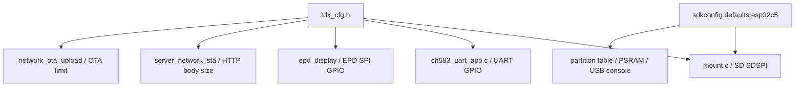


相关文件：

```text
main/tdx_cfg.h
sdkconfig.defaults
sdkconfig.defaults.esp32c5
partitions/v2/16m.csv
```

功能说明：

```text
tdx_cfg.h
├─ WiFi/HTTP/USB/OTA/body size 配置
├─ CH583 UART C5 引脚配置
├─ 运行期调试日志输出配置
├─ EPD C5 SPI/GPIO 配置
├─ SD SDSPI C5 引脚配置
├─ CH583 LED 控制配置
├─ mDNS 名称配置
└─ NVS key / slideshow / work time / EPD type 配置
```

关键配置方向：

```text
sdkconfig.defaults.esp32c5
└─ C5 build config
   ├─ 16MB Flash
   ├─ partitions/v2/16m.csv
   ├─ SDSPI: MOSI=1 MISO=25 CLK=6 CS=26
   ├─ Quad PSRAM
   ├─ USB Serial/JTAG console
   └─ CPU0 timer affinity

tdx_cfg.h
└─ C source include
   ├─ mount.c 读取 USER_SD_SPI_*
   ├─ display_bsp.cpp / epd_display_app.cpp 读取 USER_EPD_*
   ├─ ch583_uart_app.c 读取 USER_CH583_UART_*
   ├─ debug_output.c 读取 USER_DEBUG_OUTPUT_* / USER_DEBUG_UART_*
   ├─ led_status.c 读取 USER_LED_CH583_*
   ├─ network_ota_upload.c 读取 SERVER_NETWORK_STA_OTA_*
   └─ server_network_sta.c 读取 USER_MDNS_*
```

串口和调试输出约定：

```text
CH583 通信串口：
UART1
TX = GPIO24
RX = GPIO23
baud = 115200

运行期调试日志：
当前 USER_DEBUG_OUTPUT_TARGET = USER_DEBUG_OUTPUT_BOTH
UserDebugOutput_Init() 后同时输出到 USB Serial/JTAG 和 UART0
也可在 tdx_cfg.h 中改为仅 USB 或仅 UART0
UART0 TX = GPIO11
UART0 RX = GPIO12
UART0 baud = 921600
```

说明：

```text
sdkconfig / sdkconfig.defaults 控制 bootloader、ESP-IDF 早期 console 和系统默认 console。
tdx_cfg.h 中的 USER_DEBUG_OUTPUT_TARGET 只控制 app_main() 调用 UserDebugOutput_Init() 之后的应用层日志输出。
应用层 `ESP_LOGx` 和已接入 `UserDebugOutput_Printf()` 的直接 `printf` 调试输出，都按 USER_DEBUG_OUTPUT_TARGET 路由。
如果要把 bootloader/早期 ESP-IDF console 也切到 UART0，必须修改 SDK configuration；只改 tdx_cfg.h 不会生效。
bootloader 和 UserDebugOutput_Init() 之前的早期 console 仍由 SDK configuration 控制，当前保留 USB Serial/JTAG。
UART0 调试启用时，GPIO11/GPIO12 不再作为 gpio_test 输出脚使用。
```

日志相关宏：

```text
当前代码处于开发调试配置，以下默认值与 tdx_cfg.h 保持一致：

SERVER_NETWORK_STA_DEBUG_LOG_ENABLE=1
当前默认保留 WiFi STA 连接细节日志，便于排查 STA_START、BSSID、RSSI、WiFi PS、esp_wifi_start/connect 返回值。

SERVER_NETWORK_STA_LOG_PASSWORD_PLAINTEXT=1
开发阶段打印明文 WiFi 密码；发布前改为 0。

USER_NVS_VERBOSE_LOG_ENABLE=0
只保留 NVS 失败日志。

USER_STORAGE_LIST_ON_STARTUP_ENABLE=0
默认不在启动时逐项扫描打印 /data 文件树。

USER_HTTP_FILE_LIST_LOG_ENABLE=0
默认不逐项打印 HTTP 目录列表文件；以后排查文件浏览输出时可打开。

USER_HTTP_MULTIPART_DETAIL_LOG_ENABLE=0
默认关闭 legacy multipart fallback 的 field、boundary、slot 等细节日志；关键保存和错误日志保留。

USER_USB_CONSOLE_ANSI_COLOR_TEST_ENABLE=0
默认关闭 ANSI 颜色测试。

SERVER_NETWORK_STA_OTA_DETAIL_LOG_ENABLE=0
只保留 OTA 关键节点和错误日志。
```

---


存 / 取信息（含条件限制）：

```text
存：
- 本节是编译期配置，不直接执行运行时存储。

取：
- 各模块通过 include tdx_cfg.h 读取路径、NVS key、GPIO、body size、EPD type、WiFi 工作时长等宏。
- sdkconfig.defaults.esp32c5 / partitions/v2/16m.csv 在构建期被 IDF 读取。
```

[⬆ 返回目录](#toc) | [↩ 返回当前目录](#sec-02)

---

## 5. WiFi STA 与 HTTP Server <span id="sec-05"></span>

实际返回码（正式定义见 `README_Result_Code.md`）：

| 返回 | result | 说明 |
|---|---|---|
| `ping_result` | `0` | `/ping` 正常返回，包含 `EPD=BUSY/IDLE` 和非空 `Ble_MAC` |
| `ping_result` | `1405` | `Ble_MAC` 尚未从 CH583 获取；网络和 USB 都返回 `EPD=BUSY/IDLE`、空 `Ble_MAC` 和该错误码 |
| WiFi 连接事件通知 | `1307` | WiFi 连接超时 |
| WiFi 连接事件通知 | `1308` | WiFi 认证失败 |
| WiFi 连接事件通知 | `1309` | WiFi 获取 IP 失败 |

WiFi、DHCP、HTTP 与 mDNS 由唯一的 `wifi_manager` Task 管理。BLE / CH583 和 USB 的普通 `wifi` 配网请求先保存配置，再通过一个 `NEW_CREDENTIAL` 命令交给 manager；调用者不再先发送 PROVISIONING 后再发送 FORCE_CONNECT。后台结果仍使用 `1307`（连接超时）、`1308`（连续认证失败）和 `1309`（已关联但未取得 IP）。`wifi_wakeup` 会识别 CONNECTING、DISCONNECTING、WAITING_IP、RETRY_WAIT、GOT_IP、STARTING_SERVICES、READY、AUTH_FAILED、NO_CONFIG 和 FAILED；已有连接、主动断线或恢复流程时只返回当前 stage，不重复强制重连。进入 DISCONNECTING 时立即清除旧 IP、HTTP ready 和 mDNS ready。USB `/wifi` 仍只同步返回保存和 worker 提交结果，`wifi_status` 可查询完整状态快照及 last_result、连接/凭据代次、断线目的和 READY 稳定窗口剩余时间。

WiFi 重试间隔固定为 `1000/2000/3000/3500/4000/4500 ms`，第6次以后保持4500 ms。进入 READY 后必须连续稳定30秒才清零连接、抖动和认证累计计数，因此短时间反复掉线会逐级退避；稳定30秒后的第一次掉线仍从1000 ms开始。driver 的 `failure_retry_cnt=0`，不存在第二套 driver 重试。

Mermaid 时序图：

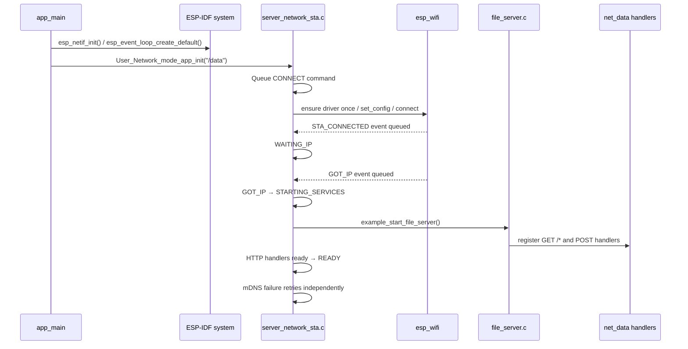


相关文件：

```text
main/server_network_sta/server_network_sta.c
main/server_network_sta/server_network_sta.h
main/file_server.c
```

WiFi 启动树状时序：

```text
main/main.c
└─ app_main()
   ├─ ServerNetworkSta_Init()
   │  ├─ 创建 wifi_manager Queue / Task / status mutex
   │  └─ WiFi/IP callback 只负责非阻塞投递事件
   └─ User_Network_mode_app_init("/data")
      └─ Queue CONNECT
         └─ wifi_manager
            ├─ 读取 wifi:ssid/password，失败时回退 nvs.net80211
            ├─ ensure_wifi_stack()：driver、netif、handler 只初始化一次
            ├─ channel hint=0，failure_retry_cnt=0
            ├─ CONNECTING → WAITING_IP → GOT_IP
            ├─ STARTING_SERVICES
            │  ├─ HTTP handler 全部成功后置 ready
            │  └─ mDNS 失败独立后台重试
            └─ READY
```

事件处理时序：

```text
ESP-IDF WiFi/IP event
└─ wifi_event_handler()
   └─ xQueueSend(..., 0)
      └─ wifi_manager
         ├─ STA_CONNECTED → WAITING_IP
         ├─ GOT_IP → STARTING_SERVICES → READY
         ├─ LOST_IP → expected disconnect(DHCP_RECOVERY) → RETRY_WAIT
         ├─ DISCONNECTED → purpose/物理链路/当前代次校验
         └─ 队列满 → atomic resync/provisioning 兜底
```

HTTP server 注册时序：

```text
file_server.c
└─ example_start_file_server()
   ├─ httpd_start()
   ├─ register GET /
   │  └─ index_html_get_handler()
   ├─ register GET /*
   │  └─ download_get_handler()
   │     ├─ ServerNetworkStaPing_ProcessGet(req)
   │     │  ├─ ServerNetworkStaWifiWorkTime_OnHttpNetworkActivity()
   │     │  ├─ get_ble_mac_no_colon()
   │     │  ├─ ServerNetworkStaEpdDisplay_IsBusy()
   │     │  ├─ 设置 application/json 和 Connection: close
   │     │  └─ 如果 URI 是 /ping，返回包含 EPD 与 Ble_MAC 的 ping JSON
   │     ├─ ServerNetworkStaTime_ProcessGet(req)
   │     │  └─ 如果 URI 是 /time，直接返回 time JSON
   │     ├─ ServerNetworkStaSavedImages_SendThumbnail()
   │     └─ 普通静态文件 / 目录列表处理
   ├─ register legacy upload/delete
   │  ├─ upload_post_handler()
   │  └─ delete_post_handler()
   └─ server_network_sta_net_data_register_handlers()
      └─ server_network_sta/net_data/server_network_sta_data.c
         ├─ register POST /dataUP
         ├─ register POST /ota
         └─ register POST /ota_upload
```

HTTP server 内存与生命周期说明：

```text
当前工程按 HTTP server 单实例持续运行设计。
file_server.c 保存 httpd handle、server_data 和 handlers-ready 状态。
任何必要 URI 注册失败都会 httpd_stop、释放 server_data、清空 handle 并返回错误。
http_running 表示 HTTP Task 实例存在；http_ready 表示当前有 IP 且必要 handlers 已完成注册。
WiFi 断线时 http_running 可以保持 true，但 http_ready 必须为 false；重新取得 IP 后不重复启动实例或注册 handlers。
```

auto light sleep / HTTP 接收注意事项：

```text
当前默认 TDX_AUTO_LIGHT_SLEEP_ENABLE=0，HTTP 接收可靠性优先。
运行时 PM 仍可配置为 80 MHz 固定频率，但不进入 Auto Light-sleep。
如果开启 auto light sleep，WiFi 省电、CPU 唤醒延迟、HTTP socket 超时可能叠加影响网络请求。
表现可能是 /ping 偶发慢响应、POST /dataUP body 接收失败、httpd_req_recv() 返回错误、客户端认为连接超时或断开。
尤其是 App/PC 发送小 JSON 后立即等待响应，或者发送大 body/multipart/OTA 时，不建议启用 auto light sleep。
若后续必须开启，需要单独验证 WiFi PS、HTTP timeout、客户端重试策略和大包上传稳定性。
```

---


### 5.1 V2 协议资料拆分：ping 连通性检查 <span id="sec-05-1"></span>

请求：

```http
GET /ping HTTP/1.1
```

BLE MAC 已取得时的返回示例：

```json
{
  "func": "ping_result",
  "result": 0,
  "message": "ok",
  "EPD": "BUSY",
  "Ble_MAC": "AABBCCDDEEFF"
}
```

BLE MAC 尚未取得时的返回示例：

```json
{
  "func": "ping_result",
  "result": 1405,
  "message": "Ble_MAC not ready",
  "EPD": "IDLE",
  "Ble_MAC": ""
}
```

`EPD` 由 `ServerNetworkStaEpdDisplay_IsBusy()` 生成：

```text
BUSY  显示任务 active、pending job 计数大于 0、EPD 队列仍有消息，任一条件成立
IDLE  以上三项均不存在
```

实际代码位置：

```text
main/server_network_sta/ping/server_network_sta_ping.c
main/usb_console_echo/ping/usb_console_ping.c
main/epd_display/epd_display_app.cpp
```

当前固件正式输出字段名固定为 `Ble_MAC`，不输出小写 `ble_mac`。前端可以兼容旧资料中的小写写法，但校验当前设备响应时应使用 `Ble_MAC`；非空 MAC 必须与目标设备一致，避免缓存 IP 指向错误设备。


存 / 取信息（含条件限制）：

```text
存：
- 本模块连接 WiFi 和启动 HTTP Server，不直接保存 WiFi 配置。

取：
- `read_saved_wifi()` 优先读取 namespace="wifi" 的 ssid/password。
- 读取失败后读取 namespace="nvs.net80211" 的 sta.ssid / sta.pswd blob。
- manager 收到 IP_EVENT_STA_GOT_IP 后校验当前 AP/IP，再推进 GOT_IP、STARTING_SERVICES 和 READY。
- HTTP handlers 注册失败会独立重试；mDNS 失败不阻止直接通过 IP 使用 HTTP，并在后台独立重试。

日志：
- 开发阶段 WiFi credential 打印 SSID 和明文密码；发布前关闭。
- 保留关键节点：saved WiFi 读取结果、WiFi IP、断开原因、认证累计达到阈值、mDNS ready、HTTP server ready、网络初始化失败。
- 当前 `SERVER_NETWORK_STA_DEBUG_LOG_ENABLE=1`，默认保留 STA_START、BSSID/RSSI、WiFi PS、esp_wifi_start/connect 返回值等细节日志；发布前建议改为 0。
```

[⬆ 返回目录](#toc) | [↩ 返回当前目录](#sec-05)

---

## 12. EPD 显示队列与屏幕类型汇总 <span id="sec-12"></span>

本章把 `main/epd_display/` 目录拆成二级目录。当前 `main/CMakeLists.txt` 编译的 EPD 相关源码包括显示队列、显示模式、BSP、屏幕类型管理、各具体屏幕驱动和测试图文件。

Mermaid 总览图：

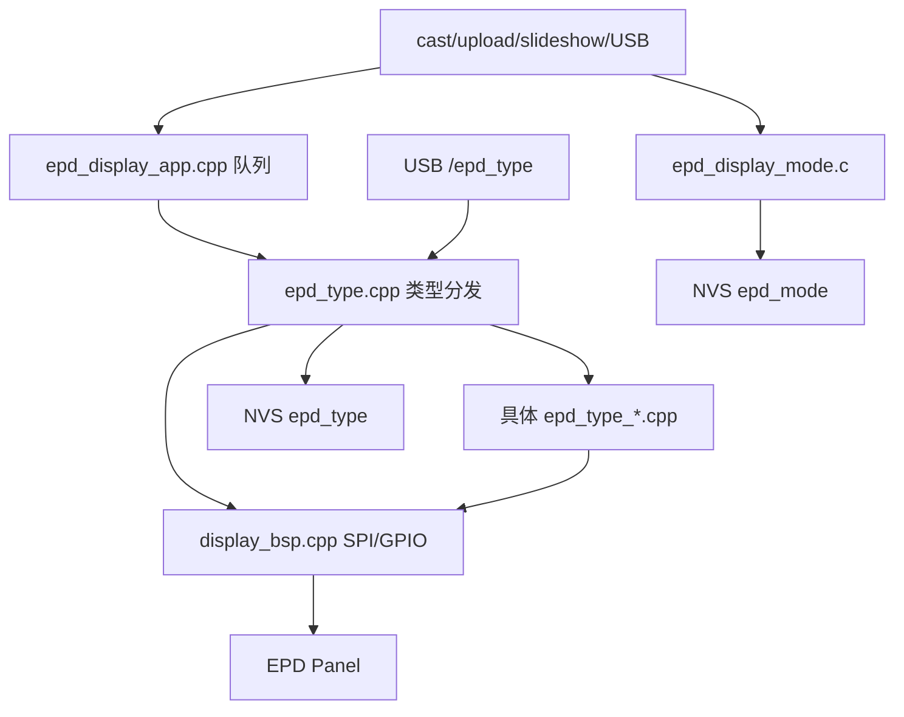

EPD 显示模式：

```text
PhotoPainter:epd_mode，u8
0 NORMAL     普通模式
1 SLIDESHOW  轮播模式
2 DAILY      每日更新模式
```

启动时 `EpdDisplayMode_Init()` 读取 `epd_mode`，不存在时写入默认 `0`。如果读到非法值，恢复为 `0`。`app_main()` 会打印当前模式，例如 `EPD display mode=0(NORMAL)`。

同步规则：

```text
show_control.txt sw=1 写入成功 -> EpdDisplayMode_SetBySlideshowSwitch(true)  -> epd_mode=1
show_control.txt sw=0 写入成功 -> EpdDisplayMode_SetBySlideshowSwitch(false) -> epd_mode=0
```

存 / 取信息（含条件限制）：

```text
存：
- EpdType_SetAndSave() 只保存合法屏幕类型；合法条件是 EpdType_GetConfig(type) 能找到配置。
- EpdDisplayMode_Set() 只保存 0/1/2；轮播控制写0/1，每日一图配置成功写2，cast/cast2pic成功接收写0。
- 如果当前 EPD_type 已经等于目标 type，则 changed=false，不重复写 NVS。
- 显示队列只保存 RAM buffer，不写 SD；队列长度由 USER_EPD_DISPLAY_QUEUE_LENGTH 限制。
- 入队需要 malloc/copy display buffer 成功；队列满或内存不足时失败。

取：
- EpdType_LoadSavedOrDefault() 从 PhotoPainter NVS 的 USER_EPD_TYPE_NVS_KEY 读取屏幕类型。
- EpdDisplayMode_Init() 从 PhotoPainter NVS 的 USER_EPD_DISPLAY_MODE_NVS_KEY 读取显示模式。
- 如果保存值非法，则回退 USER_EPD_TYPE_DEFAULT，并尝试把默认值写回 NVS。
- 显示任务从 RAM 队列取 buffer；按 EPD_type 分发到具体 EPD 驱动。
- 具体驱动读取当前 display buffer，不直接读取 SD/NVS。
```

### 12.1 EPD 显示队列与显示任务 <span id="sec-12-1"></span>

Mermaid 时序图：

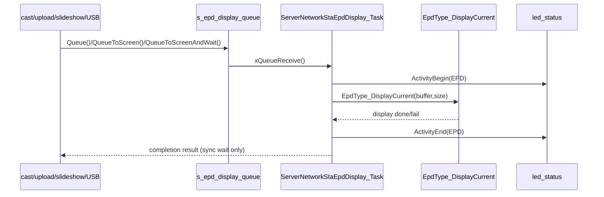

相关文件：

```text
main/epd_display/epd_display_app.cpp
main/epd_display/epd_display_app.h
main/tdx_cfg.h
```

树状时序：

```text
cast/upload/slideshow/USB
├─ asynchronous source: ServerNetworkStaEpdDisplay_Queue()
│  └─ ServerNetworkStaEpdDisplay_QueueToScreen()
└─ completion-required source: ServerNetworkStaEpdDisplay_QueueToScreenAndWait()
   ├─ malloc/copy display buffer
   ├─ xQueueSend(s_epd_display_queue)
   └─ wait actual display result

ServerNetworkStaEpdDisplay_Task()
├─ xQueueReceive()
├─ UserLedStatus_ActivityBegin(USER_LED_ACTIVITY_EPD)
├─ ePaperDisplay.Set_EPD_which_one()
├─ EpdType_DisplayCurrent()
└─ UserLedStatus_ActivityEnd(USER_LED_ACTIVITY_EPD)
```

关键辅助函数：

```text
ServerNetworkStaEpdDisplay_Init()
ServerNetworkStaEpdDisplay_Queue()
ServerNetworkStaEpdDisplay_QueueToScreen()
ServerNetworkStaEpdDisplay_QueueToScreenAndWait()
ServerNetworkStaEpdDisplay_Task()
```

存 / 取信息（含条件限制）：

```text
存：
- RAM 中保存待显示 buffer；不是持久化数据。
- 队列长度：USER_EPD_DISPLAY_QUEUE_LENGTH=2。
- 入队前必须分配内存并复制 display buffer；内存不足或队列满会导致入队失败。
- 同步等待最长 USER_EPD_DISPLAY_WAIT_TIMEOUT_MS；completion 使用双引用生命周期，等待超时不会释放 EPD 任务仍在使用的对象。

取：
- 显示任务从 s_epd_display_queue 取出 buffer。
- 取出后按当前 EPD_type 调用 EpdType_DisplayCurrent()。
- EpdType_DisplayCurrent() 返回实际 esp_err_t；尺寸、内存、SPI 写入或 BUSY 超时会传回调用方。
```

[⬆ 返回目录](#toc) | [↩ 返回当前目录](#sec-12)

---

### 12.2 EPD 类型管理与 NVS 保存 <span id="sec-12-2"></span>

实际返回码（正式定义见 `README_Result_Code.md`）：

| 返回 | result | 说明 |
|---|---|---|
| `epd_type` | `0` | 当前 EPD 类型读取成功 |
| `epd_type` | `1801` | 当前 EPD 类型非法 |
| `epd_type_list` | `0` | EPD 类型列表返回成功 |
| `set_epd_type_result` | `0` | 设置成功，或目标类型与当前类型相同 |
| `set_epd_type_result` | `1801` | 目标 EPD 类型非法 |
| `set_epd_type_result` | `1802` | 保存 EPD 类型失败 |

Mermaid 时序图：

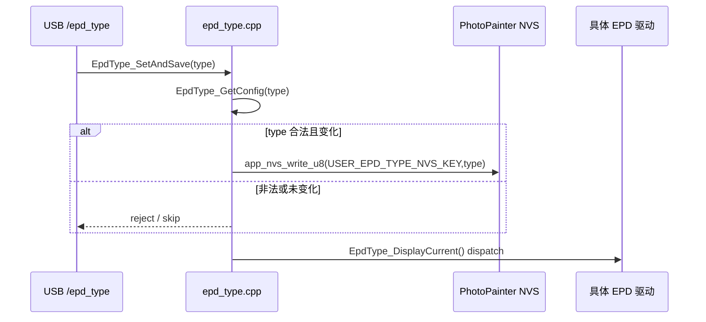

相关文件：

```text
main/epd_display/epd_type.cpp
main/epd_display/epd_type.h
main/usb_console_echo/epd_type/usb_console_epd_type.c
main/app_nvs.c
```

树状时序：

```text
EpdType_LoadSavedOrDefault()
├─ app_nvs_read_u8(USER_EPD_TYPE_NVS_KEY)
├─ EpdType_GetConfig(saved_type)
├─ invalid saved type
│  ├─ fallback USER_EPD_TYPE_DEFAULT
│  └─ app_nvs_write_u8(USER_EPD_TYPE_NVS_KEY, default)
└─ EpdType_Set(saved_type)

EpdType_SaveForNextBoot(type)
├─ EpdType_GetConfig(type)
├─ app_nvs_read_u8(USER_EPD_TYPE_NVS_KEY)
├─ 保存值相同则跳过写入
└─ 保存值不同时写 NVS
   └─ 不调用 EpdType_Set()，本次启动不切换显示驱动

EpdType_DisplayCurrent()
└─ switch EPD_type
   ├─ EpdType800480_Display()
   ├─ EpdType1024600_Display()
   ├─ EpdType16001200_79_Display()
   ├─ EpdType16001200_133_Display()
   ├─ EpdType1360480_1085_Display()
   ├─ EpdType800480_4S_75_Display()
   ├─ EpdType1360480_1085_3Color_Display()
   ├─ EpdType800480_4S_75_DKE_Display()
   ├─ EpdType800480_4S_75_Mofang_Display()
   └─ EpdType16001200_133_DKE_Display()
```

关键辅助函数：

```text
EpdType_GetConfig()
EpdType_GetCurrentConfig()
EpdType_GetCount()
EpdType_GetConfigByIndex()
EpdType_Set()
EpdType_LoadSavedOrDefault()
EpdType_SetAndSave()
EpdType_SaveForNextBoot()
EpdType_DisplayCurrent()
EpdType_DispatchInit()
EpdType_DispatchDisplay()
EpdType_DispatchSleep()
EpdType_DispatchNT61522DisplayNet()
```

存 / 取信息（含条件限制）：

```text
存：
- 只保存合法 type；非法 type 返回 ESP_ERR_INVALID_ARG。
- type 未变化时不写 NVS，changed=false。
- 写入 key：USER_EPD_TYPE_NVS_KEY。

取：
- 启动时读取 NVS；不存在则使用 USER_EPD_TYPE_DEFAULT。
- 保存值非法时回退默认值，并尝试把默认值补写回 NVS。
```

[⬆ 返回目录](#toc) | [↩ 返回当前目录](#sec-12)

---

### 12.3 display_bsp：EPD SPI / GPIO 底层适配 <span id="sec-12-3"></span>

Mermaid 时序图：

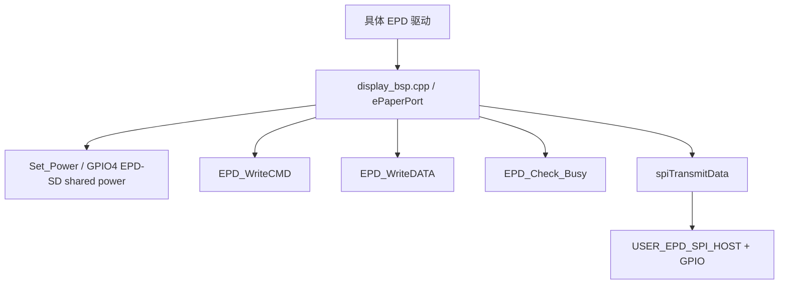

相关文件：

```text
main/epd_display/display_bsp.cpp
main/epd_display/display_bsp.h
main/epd_display/epd_display_app.cpp
main/server_network_sta/wifi_work_time/server_network_sta_wifi_work_time.c
main/tdx_cfg.h
```

树状时序：

```text
EpdType*_Display()
└─ display_bsp / ePaperPort
   ├─ Set_Power(1)：GPIO4 HIGH；EPD/SD 正常运行期间保持供电
   ├─ spiTransmitData()
   ├─ EPD_WriteCMD()
   ├─ EPD_WriteDATA()
   ├─ EPD_Check_Busy()
   ├─ reset / dc / cs gpio control
   └─ refresh / sleep：只让 EPD 控制器休眠，不拉低 GPIO4
```

关键辅助函数：

```text
spiTransmitData()
EPD_WriteCMD()
EPD_WriteDATA()
EPD_Check_Busy()
ePaperPort::Set_Power()
ServerNetworkStaEpdDisplay_SetPower()
ePaperPort methods used by EpdType_* drivers
```

EPD / SD 公共电源规则：

```text
- EPD_SD_Power_PIN 固定为 GPIO_NUM_4，并配置为 GPIO_MODE_OUTPUT。
- ePaperPort 构造先调用 Set_Power(1)，再配置 EPD 控制脚和共享 SPI；ServerNetworkStaEpdDisplay_Init() 会再次确认 GPIO4 为 HIGH，避免冷启动时由未供电外设的信号脚产生瞬时反向供电。
- EPD_Reset() 再次调用 Set_Power(1)；EPD refresh/sleep 本身不调用 Set_Power(0)。独立 EPD/SD 电源测试会在 EPD 完成后等待所有安全条件满足，并先卸载外部 SD，之后才临时关闭 GPIO4。
- 当前 `USER_POWER_OFF_LOCAL_EPD_SD_CUTOFF_ENABLE=0`，work_state_task() 发送 CH583 POWER_OFF 后不调用 Set_Power(0)，GPIO4 持续保持 HIGH。
- work_state_task() 在共用 SPI 锁内复检所有 guard，再发送 POWER_OFF；无论 UART 写入成功或失败，GPIO4 都保持 HIGH。
- POWER_OFF UART 写入成功后等待 CH583 切断 ESP32-C5 电源；2 秒内仍未断电则沿用原逻辑调用 esp_restart()。
```

SPI DMA 分包规则：

```text
EPD 显示数据可能来自 PSRAM。ESP-IDF SPI driver 对 PSRAM 源数据可能临时申请内部 DMA TX buffer；
如果一次发送 30000/32768 bytes，在内部 DMA heap 碎片化时可能返回 ESP_ERR_NO_MEM。
因此 EPD 大数据发送统一使用 NT61522_SPI_SAFE_DMA_TX_CHUNK=4092 bytes 小分包。
spiTransmitData() 会兜底拆包；EPD_Sendbuffera()、EPD_WriteMultiData_ToMaster/Slave/Both() 也按同一安全分包发送。
EPD_WriteMultiData_ToMaster/Slave/Both/Target() 返回 esp_err_t；任一 SPI transaction 失败时打印 ESP_LOGE，调用 EpdType_ReportDisplayFailure(ret)，并让本次 EPD 显示最终返回失败。
NT61522_Display_net() 返回当前 EPD 显示结果；外层屏幕适配在数据加载失败时直接退出，不继续调用 update / refresh / sleep 刷新流程。
直接调用 EPD_WriteMultiData_Target() 的屏幕适配也会在失败时停止后续数据加载/刷新流程，避免底层 SPI 已失败但上层仍继续按成功刷新。
800x480、1024x600、1360x480、800x480 4S、DKE、mofang 等驱动若走上述底层函数，即自动受该规则保护。
1024x600 旧直接 polling 路径本身使用 256 bytes 小包，不需要额外修改。
```

存 / 取信息（含条件限制）：

```text
存：
- 不写 SD/NVS。
- 只把命令和数据通过 SPI/GPIO 写到 EPD 控制器。
- GPIO4 HIGH 期间为 EPD 和 SD 提供公共电源；本模块不在单次 EPD refresh/sleep 后关闭该电源。

取：
- 读取 tdx_cfg.h 中 USER_EPD_SPI_HOST、USER_EPD_*_PIN 等配置。
- 读取 BUSY 引脚状态判断屏幕忙闲。
- 读取 `Power_switch`：等于 1 时 GPIO4 输出 HIGH，其余值输出 LOW。
```

[⬆ 返回目录](#toc) | [↩ 返回当前目录](#sec-12)

---
### 12.4 epd_type_800_480：800x480 三色屏 <span id="sec-12-4"></span>

Mermaid 时序图：

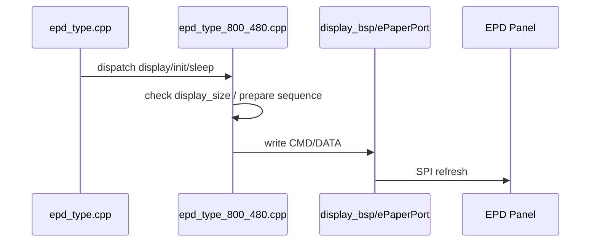

相关文件：

```text
main/epd_display/epd_type_800_480.cpp
```

树状时序：

```text
epd_type.cpp
└─ EpdType800480_Display()
   ├─ 校验 display buffer / display_size
   ├─ 调用对应 Init / Display / Sleep 流程
   └─ display_bsp.cpp / ePaperPort
      ├─ EPD_WriteCMD()
      ├─ EPD_WriteDATA()
      └─ EPD_Check_Busy()
```

关键辅助函数：

```text
EpdType800480_Display()
EpdType800480_NT61522_DisplayNet()
EpdType800480_NT61522_InitDisplay()
```

屏幕配置：

```text
type=EPD_TYPE_800_480, width=800, height=480, display_size=192000, color=BWR_3_Color
名称：EPD_800_480_XingTai
```

存 / 取信息（含条件限制）：

```text
存：
- 本驱动不写 SD/NVS；只向 EPD 控制器写命令和显示数据。
- 是否保存屏幕类型由 EpdType_SetAndSave() 统一处理，不在本文件直接保存。
- 帧数据通过 spiTransmitData() 发送，按 NT61522_SPI_SAFE_DMA_TX_CHUNK=4092 bytes 小分包，避免 PSRAM 源数据触发临时 DMA TX buffer 分配失败。

取：
- 从 RAM buffer 读取待显示数据。
- 从 epd_type.cpp 当前 EPD_type 分发进入本驱动。
- display_size 必须与当前屏幕配置匹配，否则显示数据长度不可靠。
```

[⬆ 返回目录](#toc) | [↩ 返回当前目录](#sec-12)

---

### 12.5 epd_type_1024_600：1024x600 六色屏 <span id="sec-12-5"></span>

Mermaid 时序图：

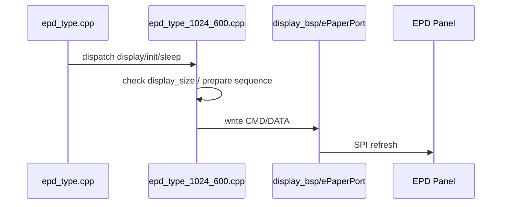

相关文件：

```text
main/epd_display/epd_type_1024_600.cpp
```

树状时序：

```text
epd_type.cpp
└─ EpdType1024600_Display()
   ├─ 校验 display buffer / display_size
   ├─ 调用对应 Init / Display / Sleep 流程
   └─ display_bsp.cpp / ePaperPort
      ├─ EPD_WriteCMD()
      ├─ EPD_WriteDATA()
      └─ EPD_Check_Busy()
```

关键辅助函数：

```text
EpdType1024600_Display()
EpdType1024600_NT61522_DisplayNet()
EpdType1024600_NT61522_InitDisplay()
```

屏幕配置：

```text
type=EPD_TYPE_1024_600, width=1024, height=600, display_size=307200, color=BWYRBG_6_Color
名称：EPD_1024_600_XingTai
```

存 / 取信息（含条件限制）：

```text
存：
- 本驱动不写 SD/NVS；只向 EPD 控制器写命令和显示数据。
- 是否保存屏幕类型由 EpdType_SetAndSave() 统一处理，不在本文件直接保存。
- 帧数据通过 spiTransmitData() 发送，按 NT61522_SPI_SAFE_DMA_TX_CHUNK=4092 bytes 小分包，避免 PSRAM 源数据触发临时 DMA TX buffer 分配失败。

取：
- 从 RAM buffer 读取待显示数据。
- 从 epd_type.cpp 当前 EPD_type 分发进入本驱动。
- display_size 必须与当前屏幕配置匹配，否则显示数据长度不可靠。
```

[⬆ 返回目录](#toc) | [↩ 返回当前目录](#sec-12)

---

### 12.6 epd_type_1600_1200_common：1600x1200 公共逻辑 <span id="sec-12-6"></span>

Mermaid 时序图：

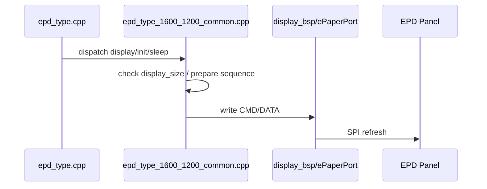

相关文件：

```text
main/epd_display/epd_type_1600_1200_common.cpp
```

树状时序：

```text
epd_type.cpp
└─ EpdType16001200_79_Display()
   ├─ 校验 display buffer / display_size
   ├─ 调用对应 Init / Display / Sleep 流程
   └─ display_bsp.cpp / ePaperPort
      ├─ EPD_WriteCMD()
      ├─ EPD_WriteDATA()
      └─ EPD_Check_Busy()
```

关键辅助函数：

```text
EpdType16001200_79_Display()
EpdType16001200_133_Display()
EpdType_DispatchNT61522DisplayNet()
```

屏幕配置：

```text
供 1600x1200 79/133 版本复用的公共显示逻辑。
公共文件本身不对应单独 EPD_type，由 79/133 具体类型调用。
```

存 / 取信息（含条件限制）：

```text
存：
- 本驱动不写 SD/NVS；只向 EPD 控制器写命令和显示数据。
- 是否保存屏幕类型由 EpdType_SetAndSave() 统一处理，不在本文件直接保存。

取：
- 从 RAM buffer 读取待显示数据。
- 从 epd_type.cpp 当前 EPD_type 分发进入本驱动。
- display_size 必须与当前屏幕配置匹配，否则显示数据长度不可靠。
```

[⬆ 返回目录](#toc) | [↩ 返回当前目录](#sec-12)

---

### 12.7 epd_type_1600_1200_79：1600x1200 79 版本 <span id="sec-12-7"></span>

Mermaid 时序图：

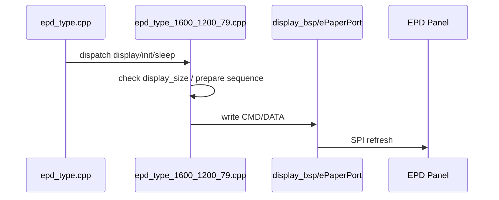

相关文件：

```text
main/epd_display/epd_type_1600_1200_79.cpp
main/epd_display/epd_type_1600_1200_common.cpp
```

树状时序：

```text
epd_type.cpp
└─ EpdType16001200_79_Display()
   ├─ 校验 display buffer / display_size
   ├─ 调用对应 Init / Display / Sleep 流程
   └─ display_bsp.cpp / ePaperPort
      ├─ EPD_WriteCMD()
      ├─ EPD_WriteDATA()
      └─ EPD_Check_Busy()
```

关键辅助函数：

```text
EpdType16001200_79_Display()
EpdType16001200_79_NT61522_Init()
EpdType16001200_79_NT61522_DisplayNet()
```

屏幕配置：

```text
type=EPD_TYPE_1600_1200_79, width=1600, height=1200, display_size=960000, color=BWYRBG_6_Color
名称：EPD_1600_1200_79_XingTai
```

实现说明：

```text
- 帧数据通过 spiTransmitData() 发送，按 NT61522_SPI_SAFE_DMA_TX_CHUNK=4092 bytes 小分包，避免 PSRAM 源数据触发临时 DMA TX buffer 分配失败。
```

存 / 取信息（含条件限制）：

```text
存：
- 本驱动不写 SD/NVS；只向 EPD 控制器写命令和显示数据。
- 是否保存屏幕类型由 EpdType_SetAndSave() 统一处理，不在本文件直接保存。

取：
- 从 RAM buffer 读取待显示数据。
- 从 epd_type.cpp 当前 EPD_type 分发进入本驱动。
- display_size 必须与当前屏幕配置匹配，否则显示数据长度不可靠。
```

[⬆ 返回目录](#toc) | [↩ 返回当前目录](#sec-12)

---

### 12.8 epd_type_1600_1200_133：1600x1200 133 版本 <span id="sec-12-8"></span>

Mermaid 时序图：


相关文件：

```text
main/epd_display/epd_type_1600_1200_133.cpp
main/epd_display/epd_type_1600_1200_common.cpp
```

树状时序：

```text
epd_type.cpp
└─ EpdType16001200_133_Display()
   ├─ 校验 display buffer / display_size
   ├─ 调用对应 Init / Display / Sleep 流程
   └─ display_bsp.cpp / ePaperPort
      ├─ EPD_WriteCMD()
      ├─ EPD_WriteDATA()
      └─ EPD_Check_Busy()
```

关键辅助函数：

```text
EpdType16001200_133_Display()
EpdType16001200_133_NT61522_Init()
EpdType16001200_133_NT61522_DisplayNet()
```

屏幕配置：

```text
type=EPD_TYPE_1600_1200_133, width=1600, height=1200, display_size=960000, color=BWYRBG_6_Color
名称：EPD_1600_1200_133_XingTai
```

实现说明：

```text
- 帧数据通过 spiTransmitData() 发送，按 NT61522_SPI_SAFE_DMA_TX_CHUNK=4092 bytes 小分包，避免 PSRAM 源数据触发临时 DMA TX buffer 分配失败。
```

存 / 取信息（含条件限制）：

```text
存：
- 本驱动不写 SD/NVS；只向 EPD 控制器写命令和显示数据。
- 是否保存屏幕类型由 EpdType_SetAndSave() 统一处理，不在本文件直接保存。

取：
- 从 RAM buffer 读取待显示数据。
- 从 epd_type.cpp 当前 EPD_type 分发进入本驱动。
- display_size 必须与当前屏幕配置匹配，否则显示数据长度不可靠。
```

[⬆ 返回目录](#toc) | [↩ 返回当前目录](#sec-12)

---

### 12.8.1 epd_type_1600_1200_133_DKE：1600x1200 13.3 DKE 六色屏 <span id="sec-12-8-1"></span>

Mermaid 时序图：

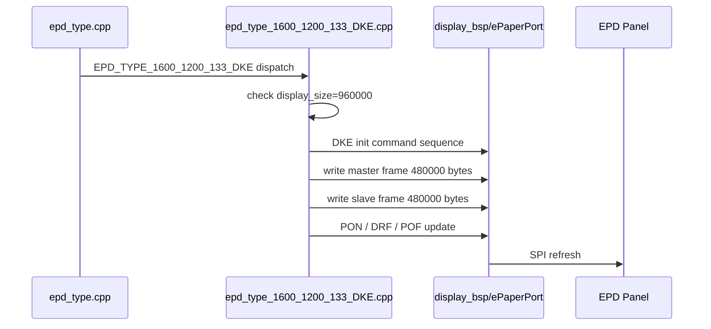

相关文件：

```text
main/epd_display/epd_type_1600_1200_133_DKE.cpp
main/epd_display/epd_type_1600_1200_133_DKE.h
main/epd_display/epd_type.cpp
main/epd_display/display_bsp.h
main/epd_display/epd_display_app.cpp
tdx_esp32s3_web_flasher_file_input_v20/js/serial_protocol.js
```

树状时序：

```text
epd_type.cpp
└─ EpdType16001200_133_DKE_Display()
   ├─ 校验 display buffer / display_size=960000
   ├─ EpdType16001200_133_DKE_Init()
   │  └─ 使用工厂 EL133UF1 初始化参数
   ├─ EpdType16001200_133_DKE_NT61522_DisplayNet()
   │  ├─ MASTER 写入 image[0..479999]
   │  └─ SLAVE 写入 image[480000..959999]
   ├─ EpdType16001200_133_DKE_Update()
   │  ├─ R04_PON
   │  ├─ R12_DRF
   │  └─ R02_POF
   └─ display_bsp.cpp / ePaperPort
      ├─ setPinCs(TARGET_MASTER / TARGET_SLAVE / TARGET_BOTH)
      ├─ spiTransmitCommand()
      ├─ spiTransmitData()
      └─ Get_BusyIOLevel()
```

关键辅助函数：

```text
EpdType16001200_133_DKE_Display()
EpdType16001200_133_DKE_Init()
EpdType16001200_133_DKE_NT61522_DisplayNet()
EpdType16001200_133_DKE_Update()
EpdType16001200_133_DKE_Sleep()
EpdType16001200_133_DKE_WaitBusy()
```

屏幕配置：

```text
type=EPD_TYPE_1600_1200_133_DKE, width=1600, height=1200, display_size=960000, color=BWYRBG_6_Color
名称：EPD_1600_1200_133_DKE
```

实现说明：

```text
- DKE 13.3 与 EPD_TYPE_1600_1200_133 分开实现，不复用兴泰 13.3 的初始化参数，避免影响已验证成功的兴泰屏。
- DKE 参考工厂 EL133UF1.cpp / EPD_IO.cpp：初始化、分帧写入、PON/DRF/POF 更新和 sleep 参数独立维护。
- 图像总长度 960000 bytes；MASTER 和 SLAVE 各写 480000 bytes。
- DKE 帧数据按 4092 bytes 小分包调用 spiTransmitData()；轮播/投图数据常在 PSRAM，SPI driver 可能临时申请内部 DMA TX buffer，小分包可避免内部 DMA heap 碎片化时出现 `ESP_ERR_NO_MEM`。任一半帧写入失败时不继续 update，调用方不推进轮播进度。
- 调试日志会打印 init、master write、slave write、update、busy timeout 等步骤，便于确认卡在哪个阶段。
```

存 / 取信息（含条件限制）：

```text
存：
- 本驱动不写 SD/NVS；只向 EPD 控制器写命令和显示数据。
- 是否保存屏幕类型由 EpdType_SetAndSave() 统一处理，不在本文件直接保存。

取：
- 从 RAM buffer 读取待显示数据。
- 从 epd_type.cpp 当前 EPD_type 分发进入本驱动。
- display_size 必须为 960000，否则拒绝显示。
- PC 端 serial_protocol.js 也需要有 type=10 的静态类型信息，方便离线显示下拉列表。
```

[⬆ 返回目录](#toc) | [↩ 返回当前目录](#sec-12)

---

### 12.9 epd_type_1360_480_1085：1360x480 四色屏 <span id="sec-12-9"></span>

Mermaid 时序图：

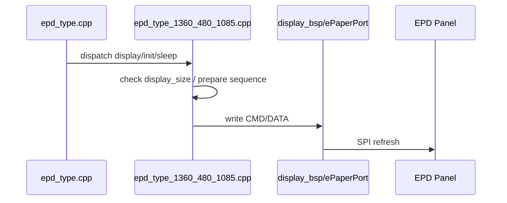

相关文件：

```text
main/epd_display/epd_type_1360_480_1085.cpp
main/epd_display/epd_type_4color_common.cpp
```

树状时序：

```text
epd_type.cpp
└─ EpdType1360480_1085_Display()
   ├─ 校验 display buffer / display_size
   ├─ 调用对应 Init / Display / Sleep 流程
   └─ display_bsp.cpp / ePaperPort
      ├─ EPD_WriteCMD()
      ├─ EPD_WriteDATA()
      └─ EPD_Check_Busy()
```

关键辅助函数：

```text
EpdType1360480_1085_Display()
EpdType1360480_1085_NT61522_DisplayNet()
```

屏幕配置：

```text
type=EPD_TYPE_1360_480_1085, width=1360, height=480, display_size=81600, color=BWRY_4_Color
名称：EPD_1360_480_1085_XingTai
```

存 / 取信息（含条件限制）：

```text
存：
- 本驱动不写 SD/NVS；只向 EPD 控制器写命令和显示数据。
- 是否保存屏幕类型由 EpdType_SetAndSave() 统一处理，不在本文件直接保存。

取：
- 从 RAM buffer 读取待显示数据。
- 从 epd_type.cpp 当前 EPD_type 分发进入本驱动。
- display_size 必须与当前屏幕配置匹配，否则显示数据长度不可靠。
```

[⬆ 返回目录](#toc) | [↩ 返回当前目录](#sec-12)

---

### 12.10 epd_type_1360_480_1085_3color：1360x480 三色屏 <span id="sec-12-10"></span>

Mermaid 时序图：

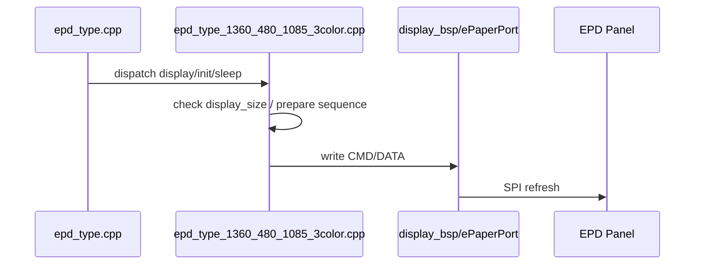

相关文件：

```text
main/epd_display/epd_type_1360_480_1085_3color.cpp
```

树状时序：

```text
epd_type.cpp
└─ EpdType1360480_1085_3Color_Display()
   ├─ 校验 display buffer / display_size
   ├─ 调用对应 Init / Display / Sleep 流程
   └─ display_bsp.cpp / ePaperPort
      ├─ EPD_WriteCMD()
      ├─ EPD_WriteDATA()
      └─ EPD_Check_Busy()
```

关键辅助函数：

```text
EpdType1360480_1085_3Color_Display()
EpdType1360480_1085_3Color_DisplayNet()
```

屏幕配置：

```text
type=EPD_TYPE_1360_480_1085_3COLOR, width=1360, height=480, display_size=163200, color=BWR_3_Color
名称：EPD_1360_480_1085_3COLOR_YSGD
```

存 / 取信息（含条件限制）：

```text
存：
- 本驱动不写 SD/NVS；只向 EPD 控制器写命令和显示数据。
- 是否保存屏幕类型由 EpdType_SetAndSave() 统一处理，不在本文件直接保存。

取：
- 从 RAM buffer 读取待显示数据。
- 从 epd_type.cpp 当前 EPD_type 分发进入本驱动。
- display_size 必须与当前屏幕配置匹配，否则显示数据长度不可靠。
```

[⬆ 返回目录](#toc) | [↩ 返回当前目录](#sec-12)

---

### 12.11 epd_type_4color_common：四色屏公共逻辑 <span id="sec-12-11"></span>

Mermaid 时序图：

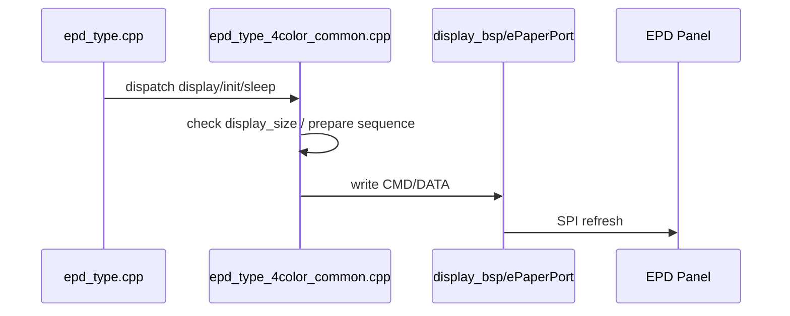

相关文件：

```text
main/epd_display/epd_type_4color_common.cpp
```

树状时序：

```text
epd_type.cpp
└─ EpdType800480_4S_75_Display()
   ├─ 校验 display buffer / display_size
   ├─ 调用对应 Init / Display / Sleep 流程
   └─ display_bsp.cpp / ePaperPort
      ├─ EPD_WriteCMD()
      ├─ EPD_WriteDATA()
      └─ EPD_Check_Busy()
```

关键辅助函数：

```text
EpdType800480_4S_75_Display()
EpdType1360480_1085_Display()
EpdType800480_4S_75_DKE_Display()
```

屏幕配置：

```text
供 BWRY_4_Color 类型复用的公共显示逻辑。
公共文件本身不保存屏幕类型，也不对应单独 type。
```

存 / 取信息（含条件限制）：

```text
存：
- 本驱动不写 SD/NVS；只向 EPD 控制器写命令和显示数据。
- 是否保存屏幕类型由 EpdType_SetAndSave() 统一处理，不在本文件直接保存。

取：
- 从 RAM buffer 读取待显示数据。
- 从 epd_type.cpp 当前 EPD_type 分发进入本驱动。
- display_size 必须与当前屏幕配置匹配，否则显示数据长度不可靠。
```

[⬆ 返回目录](#toc) | [↩ 返回当前目录](#sec-12)

---

### 12.12 epd_type_800_480_4s_75：800x480 4S 75 兴泰屏 <span id="sec-12-12"></span>

Mermaid 时序图：

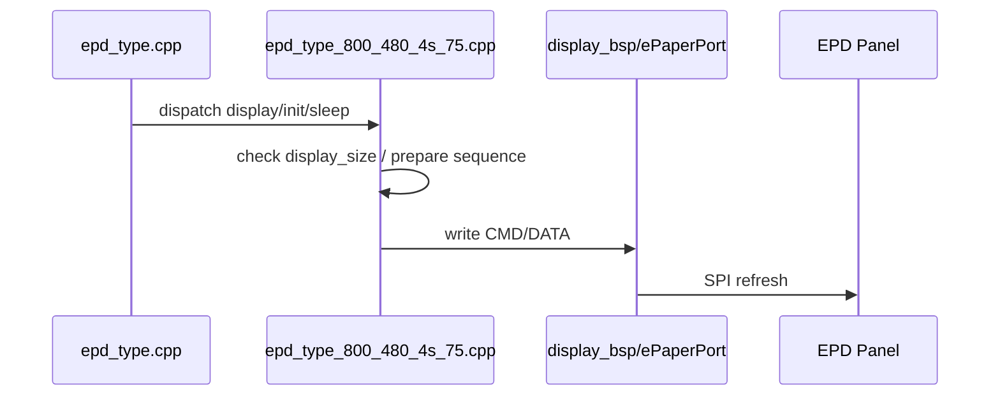

相关文件：

```text
main/epd_display/epd_type_800_480_4s_75.cpp
main/epd_display/epd_type_4color_common.cpp
```

树状时序：

```text
epd_type.cpp
└─ EpdType800480_4S_75_Display()
   ├─ 校验 display buffer / display_size
   ├─ 调用对应 Init / Display / Sleep 流程
   └─ display_bsp.cpp / ePaperPort
      ├─ EPD_WriteCMD()
      ├─ EPD_WriteDATA()
      └─ EPD_Check_Busy()
```

关键辅助函数：

```text
EpdType800480_4S_75_Display()
EpdType800480_4S_75_NT61522_DisplayNet()
```

屏幕配置：

```text
type=EPD_TYPE_800_480_4S_75, width=800, height=480, display_size=96000, color=BWRY_4_Color
名称：EPD_800_480_4S_75_XingTai
```

存 / 取信息（含条件限制）：

```text
存：
- 本驱动不写 SD/NVS；只向 EPD 控制器写命令和显示数据。
- 是否保存屏幕类型由 EpdType_SetAndSave() 统一处理，不在本文件直接保存。

取：
- 从 RAM buffer 读取待显示数据。
- 从 epd_type.cpp 当前 EPD_type 分发进入本驱动。
- display_size 必须与当前屏幕配置匹配，否则显示数据长度不可靠。
```

[⬆ 返回目录](#toc) | [↩ 返回当前目录](#sec-12)

---

### 12.13 epd_type_800_480_4s_75_DKE：800x480 4S 75 DKE 屏 <span id="sec-12-13"></span>

Mermaid 时序图：

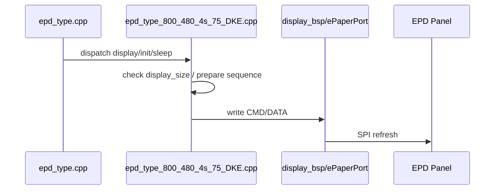

相关文件：

```text
main/epd_display/epd_type_800_480_4s_75_DKE.cpp
main/epd_display/epd_type_4color_common.cpp
```

树状时序：

```text
epd_type.cpp
└─ EpdType800480_4S_75_DKE_Display()
   ├─ 校验 display buffer / display_size
   ├─ 调用对应 Init / Display / Sleep 流程
   └─ display_bsp.cpp / ePaperPort
      ├─ EPD_WriteCMD()
      ├─ EPD_WriteDATA()
      └─ EPD_Check_Busy()
```

关键辅助函数：

```text
EpdType800480_4S_75_DKE_Display()
EpdType800480_4S_75_DKE_NT61522_DisplayNet()
```

屏幕配置：

```text
type=EPD_TYPE_800_480_4S_75_2, width=800, height=480, display_size=96000, color=BWRY_4_Color
名称：EPD_800_480_4S_75_DKE
```

存 / 取信息（含条件限制）：

```text
存：
- 本驱动不写 SD/NVS；只向 EPD 控制器写命令和显示数据。
- 是否保存屏幕类型由 EpdType_SetAndSave() 统一处理，不在本文件直接保存。

取：
- 从 RAM buffer 读取待显示数据。
- 从 epd_type.cpp 当前 EPD_type 分发进入本驱动。
- display_size 必须与当前屏幕配置匹配，否则显示数据长度不可靠。
```

[⬆ 返回目录](#toc) | [↩ 返回当前目录](#sec-12)

---

### 12.14 epd_type_800_480_4s_75_mofang：800x480 4S 75 墨方屏 <span id="sec-12-14"></span>

Mermaid 时序图：

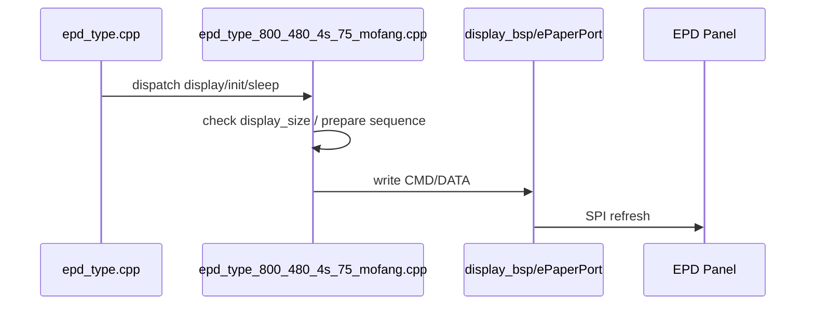

相关文件：

```text
main/epd_display/epd_type_800_480_4s_75_mofang.cpp
main/epd_display/epd_type_4color_common.cpp
```

树状时序：

```text
epd_type.cpp
└─ EpdType800480_4S_75_Mofang_Display()
   ├─ 校验 display buffer / display_size
   ├─ 调用对应 Init / Display / Sleep 流程
   └─ display_bsp.cpp / ePaperPort
      ├─ EPD_WriteCMD()
      ├─ EPD_WriteDATA()
      └─ EPD_Check_Busy()
```

关键辅助函数：

```text
EpdType800480_4S_75_Mofang_Display()
EpdType800480_4S_75_Mofang_NT61522_DisplayNet()
```

屏幕配置：

```text
type=EPD_TYPE_800_480_4S_75_3, width=800, height=480, display_size=96000, color=BWRY_4_Color
名称：EPD_800_480_4S_75_mofang
```

存 / 取信息（含条件限制）：

```text
存：
- 本驱动不写 SD/NVS；只向 EPD 控制器写命令和显示数据。
- 是否保存屏幕类型由 EpdType_SetAndSave() 统一处理，不在本文件直接保存。

取：
- 从 RAM buffer 读取待显示数据。
- 从 epd_type.cpp 当前 EPD_type 分发进入本驱动。
- display_size 必须与当前屏幕配置匹配，否则显示数据长度不可靠。
```

[⬆ 返回目录](#toc) | [↩ 返回当前目录](#sec-12)

---

### 12.15 epd_test_1360_480_1085_3color_const：1360x480 三色测试数据源 <span id="sec-12-15"></span>

实际返回码（正式定义见 `README_Result_Code.md`）：

| 返回 | result | 说明 |
|---|---|---|
| `test_epd_display_result` | `0` | 测试图显示驱动执行完成 |
| `test_epd_display_result` | `1801` | 当前 EPD 类型非法 |
| `test_epd_display_result` | `1803` | 测试显示失败 |

Mermaid 时序图：

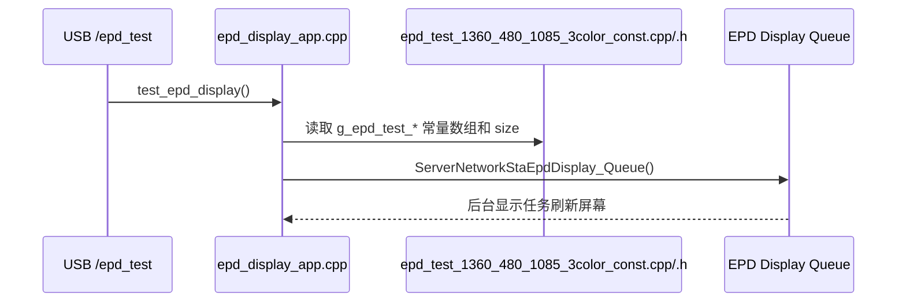

相关文件：

```text
main/epd_display/epd_test_1360_480_1085_3color_const.cpp
main/epd_display/epd_test_1360_480_1085_3color_const.h
main/epd_display/epd_display_app.cpp
main/usb_console_echo/epd_type/usb_console_epd_type.c
```

树状时序：

```text
USB /epd_test
└─ UsbConsoleEpdType_HandleTest()
   └─ epd_display_app.cpp
      └─ test_epd_display()
         ├─ 读取 g_epd_test_1360_480_1085_3color_display_b[]
         ├─ 读取 g_epd_test_1360_480_1085_3color_display_r[]
         ├─ 读取 g_epd_test_1360_480_1085_3color_*_size
         └─ ServerNetworkStaEpdDisplay_Queue()
            └─ ServerNetworkStaEpdDisplay_Task()
               └─ 按当前 EPD 类型进入正常显示链路
```

关键辅助函数：

```text
test_epd_display()
UsbConsoleEpdType_HandleTest()
ServerNetworkStaEpdDisplay_Queue()
ServerNetworkStaEpdDisplay_Task()
```

说明：

```text
- 本文件不是普通 EPD 类型驱动 dispatch 文件。
- 它主要提供 1360x480 三色测试图的常量数据数组和 size。
- 真正的显示仍通过 epd_display_app.cpp 的测试入口投递到 EPD 显示队列。
- 普通屏幕类型分发仍由 epd_type.cpp / epd_type_*.cpp 负责。
- test_epd_display() 已包含 EPD_TYPE_1600_1200_133_DKE，用于验证 DKE 13.3 新驱动的 init/write/update 流程。
```

存 / 取信息（含条件限制）：

```text
存：
- 本文件不写 SD/NVS，也不保存屏幕类型。
- 常量测试图数据编译进固件镜像，属于只读程序数据。

取：
- 测试入口读取 g_epd_test_1360_480_1085_3color_display_b[]。
- 测试入口读取 g_epd_test_1360_480_1085_3color_display_r[]。
- 测试入口读取 g_epd_test_1360_480_1085_3color_plane_size / image_size。
- 显示前仍需要当前 EPD 类型、显示队列和底层 EPD 驱动可用。
```

[⬆ 返回目录](#toc) | [↩ 返回当前目录](#sec-12)

---

### 12.16 EPD/SD 共用电源独立测试 <span id="sec-12-16"></span>

相关文件：

```text
main/epd_sd_power_test/epd_sd_power_test.c
main/epd_sd_power_test/epd_sd_power_test.h
main/epd_display/display_bsp.cpp
main/epd_display/display_bsp.h
main/epd_display/epd_display_app.cpp
main/epd_display/epd_display_app.h
main/tdx_shared_spi.c
main/mount.c
main/tdx_cfg.h
main/server_network_sta/slideshow/server_network_sta_slideshow.c
```

该功能是 GPIO4 EPD/SD 共用电源的独立测试状态机，不复用 `wifi_work_time`，也不发送 CH583 `POWER_OFF`。只有实际 EPD 显示任务完成后才 armed；启动后未发生 EPD 显示时不执行测试。EPD 队列仍有任务、HTTP 请求未结束、图片 show/save 事务未结束、轮播显示后的进度保存或下一张 SD 预读未结束、普通共享 SPI 请求正在执行或等待时均不关电。启动存储类型未知时测试不启动，原有业务继续运行。

网络 cast、cast2pic、upload 和 USB 共用的 `TdxImageTransfer_ProcessItems()` 使用独立引用计数覆盖完整的“先 show、后 save”事务，避免 EPD 完成与保存任务投递之间的短暂空闲被误判。轮播没有请求字段 `show=true/save=true`，使用单独的 slideshow follow-up 引用计数：在同步 EPD 显示前登记，在显示完成后的进度保存和下一张 SD BIN 预读结束后释放，避免轮播任务调度空隙产生约几十毫秒的无效短促断电；释放后若其他安全条件均满足，独立状态机再执行完整的 2 秒断电测试。

安全断电流程：

```text
EPD job done
-> wait EPD queue idle
-> wait image transfer count = 0
-> wait slideshow follow-up count = 0
-> test-only zero-wait shared SPI lock
-> verify no normal SPI request is active or waiting
-> external SD: unmount while holding the test lock
-> SPIFFS: skip all storage unmount/remount operations
-> recheck activity generation
-> remove the EPD SPI device and free the shared SPI bus
-> set GPIO0/1/6/7/8/9/10/25/26 to input with all internal pulls disabled
-> recheck all activity counters and the event generation after IO isolation
-> GPIO4 LOW last
-> release test lock
-> interruptible wait, maximum 2000 ms
-> GPIO4 HIGH first
-> wait 100 ms for shared-rail stabilization
-> restore EPD control pins and rebuild the shared SPI bus/device
-> external SD: use the test-only remount path
-> release blocked normal SPI callers
```

普通 `TdxSharedSpi_Lock()` 在测试 armed、preparing、off 或 restoring 状态下会先登记请求并通知测试模块。登记发生在 mutex take 之前，因此已经等待 SPI 的 SD/EPD任务也会阻止断电。GPIO4 已关闭时，普通 SPI 调用等待电源开启；使用外部 SD 时还会等待 SD 重新挂载，请求不会因测试被丢弃。状态机使用单独的 `TdxSharedSpi_LockForEpdSdPowerTest()`，避免最终检查把自身误报为新 SPI 活动。关闭 `USER_EPD_SD_POWER_TEST_ENABLE` 时，普通 SPI 锁不执行测试计数或电源等待。

HTTP handler 使用 Begin/End 引用计数覆盖完整请求周期；请求到达时若 GPIO4 已关闭，会等待电源恢复后再进入原 handler。提前恢复条件：任何 HTTP 业务请求、CH583 发来的合法 `BLE_DATA`、新 EPD 请求或普通共享 SPI 请求。ESP32 发给 CH583 的命令以及 CH583 发来的其他命令都不影响本测试。2000 ms 内没有事件时也会自动恢复。所有配置、事件位和状态值统一定义在 `tdx_cfg.h` 的 `USER_EPD_SD_POWER_TEST_*` 宏中。

`USER_EPD_SD_POWER_TEST_IO_ISOLATION_ENABLE=1` 时，断电测试通过专用 EPD C 接口释放 SPI 外设路由，并将外部电源域相关 IO 切换为无上下拉的输入高阻，避免 GPIO 反向给 EPD 或 SD 供电。恢复时先开启 GPIO4，等待 100 ms，再恢复控制脚和 EPD 所有的共享 SPI 总线。公共 `Set_Power()` 仍只控制 GPIO4，不改变普通 EPD 初始化、复位和显示流程；测试路径不使用 `gpio_reset_pin()`，避免默认上拉造成反向供电。

外部 SD 测试恢复使用 `example_storage_remount_sd_for_epd_power_test()`，不调用启动入口 `example_mount_storage()`。恢复顺序是先恢复 EPD 共享 SPI，再重新挂载 SD。ESP-IDF 卸载接口一旦被调用，测试模块不再保留旧 card handle；即使卸载最后返回 VFS 清理错误，也保持普通 SPI 请求阻塞并进入现有重挂载重试路径。恢复失败时 GPIO4 保持 HIGH，状态机限频记录错误并定时重试；不修改启动挂载失败计数、不调用 `esp_restart()`、不回退 SPIFFS、不扫描目录。当前存储为 SPIFFS 时，内部 SPIFFS 不卸载也不重新挂载，但 EPD IO 仍按相同顺序隔离和恢复。

存 / 取信息（含条件限制）：

```text
存：
- 状态、事件代数、HTTP/图片事务/轮播后续 SD 工作引用计数，以及 EPD SPI 总线/IO 恢复需求状态只保存在 RAM，不写 NVS。
- 断电前卸载 SD；恢复供电后重新建立 SD card 和 FAT/VFS 挂载状态。

取：
- 读取 EPD 队列/执行 busy 状态。
- 读取普通共享 SPI 请求计数，覆盖正在执行和等待 mutex 的任务。
- 读取测试模块事件通知；只有校验通过的 CH583 `BLE_DATA` 作为 CH583 提前恢复事件。
```

[⬆ 返回目录](#toc) | [↩ 返回当前目录](#sec-12)

---

## 14. 文件服务器静态资源与旧接口 <span id="sec-14"></span>

Mermaid 路由图：


相关文件：

```text
main/file_server.c
main/upload_script.html
main/favicon.ico
main/server_network_sta/index_html.h
```

树状时序：

```text
example_start_file_server()
├─ index_html_get_handler()
│  └─ send embedded/index html
├─ favicon_get_handler()
├─ download_get_handler()
│  ├─ get_path_from_uri()
│  ├─ set_content_type_from_file()
│  └─ httpd_resp_send_chunk()
├─ upload_post_handler()
│  └─ legacy raw file upload
├─ delete_post_handler()
│  └─ legacy delete
└─ server_network_sta_net_data_register_handlers()
   └─ new POST /dataUP /ota /ota_upload handlers

GET /ping
└─ download_get_handler()
   └─ ServerNetworkStaPing_ProcessGet() 优先拦截

GET /time
└─ download_get_handler()
   └─ ServerNetworkStaTime_ProcessGet() 优先拦截
```

---


存 / 取信息（含条件限制）：

```text
存：
- legacy upload_post_handler() 会把上传文件写入 /data 下目标路径。
- delete_post_handler() 删除 /data 下文件。

取：
- download_get_handler() 根据 URI 读取 /data 下静态文件并分块返回。
- index_html_get_handler() / favicon_get_handler() 读取固件内嵌资源并返回。
- 缩略图由 saved_images 模块按 /thumb 路径读取 jpg。
```

[⬆ 返回目录](#toc) | [↩ 返回当前目录](#sec-14)

---

## 16. 目录到功能索引 <span id="sec-16"></span>

Mermaid 目录功能图：

```mermaid
flowchart TD
    A[main] --> B[server_network_sta]
    A --> C[usb_console_echo]
    A --> D[ch583_uart]
    A --> E[ble]
    A --> F[epd_display]
    A --> G[led_status]
    A --> H[mount.c / app_nvs.c]
```


```text
main/
├─ main.c
│  └─ 系统启动、任务初始化、模块总入口
├─ tdx_cfg.h
│  └─ C5 板级参数、协议限制、NVS key、功能开关
├─ app_nvs.c
│  └─ 小型 NVS 读写封装
├─ mount.c
│  └─ SD/SPIFFS 挂载、目录创建、容量查询
├─ file_server.c
│  └─ HTTP server、静态文件、旧上传/删除入口、新网络接口注册
├─ epd_sd_power_test/
│  └─ EPD任务完成后执行 GPIO4 EPD/SD 共用电源的独立2秒断电测试
├─ server_network_sta/
│  ├─ server_network_sta.c
│  │  └─ WiFi STA、mDNS、HTTP server 启动
│  ├─ net_data/
│  │  └─ /dataUP /ota /small JSON 统一入口
│  ├─ cast/
│  │  └─ 网络 cast 投图
│  ├─ cast2pic/
│  │  └─ 网络双屏/分屏投图
│  ├─ upload/
│  │  └─ 网络通用上传
│  ├─ ota/
│  │  └─ 网络 OTA
│  ├─ delete/
│  │  └─ 删除图片和关联状态
│  ├─ saved_images/
│  │  └─ 已保存图片列表
│  ├─ snapshot/
│  │  └─ 当前图片/轮播状态快照
│  ├─ slideshow/
│  │  └─ 轮播配置与后台任务
│  ├─ slideshow_control/
│  │  └─ 轮播开关/间隔控制
│  ├─ wifi_work_time/
│  │  └─ WiFi 工作时间、CH583 POWER_OFF
│  ├─ ping/
│  │  └─ 网络心跳
│  └─ time/
│     └─ RTC 默认时间、SNTP 网络校时、GET /time
├─ usb_console_echo/
│  └─ USB Serial/JTAG HTTP-like 请求、路由和响应
├─ ch583_uart/
│  └─ CH583 UART V1 协议、DEVICE_INFO/BLE_DATA/PING/GPIO/POWER_OFF
├─ ble/
│  └─ CH583 BLE JSON 分发；可选 ESP32 本机 BLE stub/实现
├─ epd_display/
│  ├─ epd_display_app.cpp：EPD 显示队列与任务
│  ├─ epd_type.cpp：屏幕类型表、NVS 读取/保存、驱动分发
│  ├─ display_bsp.cpp：SPI/GPIO 底层适配
│  ├─ epd_type_800_480.cpp：800x480 三色屏
│  ├─ epd_type_1024_600.cpp：1024x600 六色屏
│  ├─ epd_type_1600_1200_common.cpp：1600x1200 公共逻辑
│  ├─ epd_type_1600_1200_79.cpp：1600x1200 79 版本
│  ├─ epd_type_1600_1200_133.cpp：1600x1200 133 版本
│  ├─ epd_type_1360_480_1085.cpp：1360x480 四色屏
│  ├─ epd_type_1360_480_1085_3color.cpp：1360x480 三色屏
│  ├─ epd_type_4color_common.cpp：四色屏公共逻辑
│  ├─ epd_type_800_480_4s_75.cpp：800x480 4S 75 兴泰屏
│  ├─ epd_type_800_480_4s_75_DKE.cpp：800x480 4S 75 DKE 屏
│  ├─ epd_type_800_480_4s_75_mofang.cpp：800x480 4S 75 墨方屏
│  └─ epd_test_1360_480_1085_3color_const.cpp：1360x480 三色测试图
└─ led_status/
   └─ CH583 PB5/PB6 状态灯控制
```


存 / 取信息（含条件限制）：

```text
存：
- 本节是目录索引，不执行存储。

取：
- 按目录查找各源码文件对应功能。
```

[⬆ 返回目录](#toc) | [↩ 返回当前目录](#sec-16)

---

## 按功能整理的相关文件与辅助函数 <span id="moved-code-index"></span>

公共测试设置

相关文件：

```text
main/app_nvs.c
main/tdx_cfg.h
main/epd_display/epd_display_mode.c
main/epd_display/epd_display_mode.h
```

---

公共测试设置

相关文件：

```text
main/mount.c
main/file_serving_example_common.h
```

---

公共测试设置

关键辅助函数：

```text
receive_data_redirect_handler()
├─ get_request_header_value()
├─ ServerNetworkStaWifiWorkTime_OnHttpNetworkActivity()
├─ NetworkOtaUpload_IsOtaRequest()
├─ alloc_request_body_buffer()
├─ read_request_body_to_buffer()
├─ process_small_json_request()
└─ server_network_sta_net_data_register_handlers()
```

---

### 7.1 cast：投屏业务模块

相关文件：

```text
main/server_network_sta/cast/server_network_sta_cast.c
main/server_network_sta/cast/server_network_sta_cast.h
main/cast_core/cast_core.c
main/cast_core/cast_core.h
main/epd_display/epd_display_app.cpp
```

---

### 7.1 cast：投屏业务模块

关键辅助函数：

```text
server_network_sta_cast.c
├─ send_cast_received()
├─ send_cast_result()
├─ cast_async_process()
└─ ServerNetworkStaCast_Process()

cast_core.c
├─ TdxCastCore_ParseAndValidate()
├─ TdxCastCore_ProcessValidatedCastDir()
├─ CastSaveTask()
├─ stop_slideshow_for_cast()
└─ record_last_cast()
```

---

### 7.2 cast2pic：投屏转图片缓存 / 显示

相关文件：

```text
main/server_network_sta/cast2pic/server_network_sta_cast2pic.c
main/server_network_sta/cast2pic/server_network_sta_cast2pic.h
main/cast_core/cast_core.c
main/cast_core/cast_core.h
```

---

### 7.2 cast2pic：投屏转图片缓存 / 显示

关键辅助函数：

```text
server_network_sta_cast2pic.c
├─ extract_boundary()
├─ parse_cast2pic_multipart()
├─ assign_text_part()
├─ assign_image_part()
├─ validate_cast2pic_meta()
├─ screen_to_epd_number()
├─ process_cast2pic_items()
├─ cast2pic_async_process()
└─ ServerNetworkStaCast2Pic_Process()

cast_core.c
├─ TdxImageTransfer_ProcessItems()
└─ CastSaveTask()
```

---

### 7.3 delete：图片 / 缓存文件删除逻辑

相关文件：

```text
main/server_network_sta/delete/server_network_sta_delete.c
main/server_network_sta/delete/server_network_sta_delete.h
```

---

### 7.3 delete：图片 / 缓存文件删除逻辑

关键辅助函数：

```text
server_network_sta_delete.c
├─ parse_file_names()
├─ delete_one_path()
└─ ServerNetworkStaDelete_ProcessJson()
```

---

### 7.4 net_data：通用网络数据封装

相关文件：

```text
main/server_network_sta/net_data/server_network_sta_data.c
main/server_network_sta/net_data/server_network_sta_data.h
```

---

### 7.4 net_data：通用网络数据封装

关键辅助函数：

```text
server_network_sta_data.c
├─ log_heap_watermark()
├─ alloc_request_body_buffer()
├─ read_request_body_to_buffer()
├─ process_small_json_request()
├─ receive_data_redirect_handler()
└─ server_network_sta_net_data_register_handlers()
```

---

### 7.5 ota：设备在线升级模块

相关文件：

```text
main/server_network_sta/ota/network_ota_upload.c
main/server_network_sta/ota/network_ota_upload.h
```

---

### 7.5 ota：设备在线升级模块

关键辅助函数：

```text
network_ota_upload.c
├─ NetworkOtaUpload_IsOtaRequest()
├─ NetworkOtaUpload_GetMaxBodySize()
├─ NetworkOtaUpload_ProcessReceivedBody()
├─ NetworkOtaUpload_MarkCurrentAppValidIfPending()
└─ write_firmware_to_ota_partition()
```

---

### 7.6 ping：网络连通检测

相关文件：

```text
main/server_network_sta/ping/server_network_sta_ping.c
main/server_network_sta/ping/server_network_sta_ping.h
main/epd_display/epd_display_app.cpp
main/epd_display/epd_display_app.h
```

---

### 7.6 ping：网络连通检测

关键辅助函数：

```text
server_network_sta_ping.c
└─ ServerNetworkStaPing_ProcessGet()
epd_display_app.cpp
└─ ServerNetworkStaEpdDisplay_IsBusy()
```

---

### 7.7 get_saved_images：取出本地存储图片

相关文件：

```text
main/server_network_sta/saved_images/server_network_sta_saved_images.c
main/server_network_sta/saved_images/server_network_sta_saved_images.h
```

---

### 7.7 get_saved_images：取出本地存储图片

关键辅助函数：

```text
server_network_sta_saved_images.c
├─ json_func_equals()
├─ saved_image_entry_name()
├─ has_jpg_extension()
├─ saved_image_name_is_safe()
├─ send_saved_images_empty()
├─ ServerNetworkStaSavedImages_SendThumbnail()
└─ ServerNetworkStaSavedImages_ProcessJson()
```

---

### 7.8 slideshow：图片轮播的文件列表，轮播间隔，是否随机

相关文件：

```text
main/server_network_sta/slideshow/server_network_sta_slideshow.c
main/server_network_sta/slideshow/server_network_sta_slideshow.h
```

---

### 7.8 slideshow：图片轮播的文件列表，轮播间隔，是否随机

关键辅助函数：

```text
server_network_sta_slideshow.c
├─ parse_start_slideshow_request()
├─ check_slideshow_files_exist()
├─ save_slideshow_config()
├─ ServerNetworkStaSlideshow_ShowFirst()
├─ ServerNetworkStaSlideshow_StartSaved()
├─ ServerNetworkStaSlideshow_StartSavedResetInterval()
├─ ServerNetworkStaSlideshow_StartSavedForNewCommand()
├─ ServerNetworkStaSlideshow_StartSavedDelayed()
├─ ServerNetworkStaSlideshow_GetRuntimeTiming()
├─ ServerNetworkStaSlideshow_Stop()
└─ slideshow_task()
```

---

### 7.9 slideshow_control：轮播控制模块

相关文件：

```text
main/server_network_sta/slideshow_control/server_network_sta_slideshow_control.c
main/server_network_sta/slideshow_control/server_network_sta_slideshow_control.h
```

---

### 7.9 slideshow_control：轮播控制模块

关键辅助函数：

```text
server_network_sta_slideshow_control.c
├─ parse_json_bool_optional()
├─ parse_json_u32()
├─ parse_json_i64()
├─ timestamp_reasonable()
├─ ServerNetworkStaSlideshowControl_ApplyJson()
├─ write_control_file()
└─ ServerNetworkStaSlideshowControl_ProcessJson()
```

---

### 7.10 snapshot：读取图片列表和轮播状态

相关文件：

```text
main/server_network_sta/snapshot/server_network_sta_snapshot.c
main/server_network_sta/snapshot/server_network_sta_snapshot.h
```

---

### 7.10 snapshot：读取图片列表和轮播状态

关键辅助函数：

```text
server_network_sta_snapshot.c
├─ append_images_json()
├─ read_slideshow_state()
├─ append_slideshow_json()
└─ ServerNetworkStaSnapshot_ProcessJson()
```

---

### 7.11 upload：PC或手机传文件到ESP32-C5，并存

相关文件：

```text
main/server_network_sta/upload/server_network_sta_upload.c
main/server_network_sta/upload/server_network_sta_upload.h
main/cast_core/cast_core.c
main/cast_core/cast_core.h
```

---

### 7.11 upload：PC或手机传文件到ESP32-C5，并存

关键辅助函数：

```text
server_network_sta_upload.c
├─ send_upload_result()
├─ upload_async_process()
└─ ServerNetworkStaUpload_Process()

cast_core.c
├─ TdxImageTransfer_ParseSingle()
├─ TdxImageTransfer_ProcessItems()
└─ CastSaveTask()
```

---

### 7.12 wifi_work_time：WiFi 省电管理

相关文件：

```text
main/server_network_sta/wifi_work_time/server_network_sta_wifi_work_time.c
main/server_network_sta/wifi_work_time/server_network_sta_wifi_work_time.h
```

---

### 7.12 wifi_work_time：WiFi 省电管理

关键辅助函数：

```text
server_network_sta_wifi_work_time.c
├─ ServerNetworkStaWifiWorkTime_Init()
├─ ServerNetworkStaWifiWorkTime_OnNetworkData()
├─ ServerNetworkStaWifiWorkTime_OnHttpNetworkActivity()
├─ ServerNetworkStaWifiWorkTime_OnCh583Activity()
├─ ServerNetworkStaWifiWorkTime_OnCh583Initialized()
├─ ServerNetworkStaWifiWorkTime_ProcessJson()
├─ ServerNetworkStaWifiWorkTime_SetAndSave()
├─ ServerNetworkStaWifiWorkTime_SetOtaWriteInProgress()
├─ ServerNetworkStaWifiWorkTime_SetOtaReceiveInProgress()
├─ configure_ch583_wake_timer_before_power_off()
└─ work_state_task()
```

---

### 7.13 time：RTC 默认时间与 SNTP 网络校时

相关文件：

```text
main/server_network_sta/time/server_network_sta_time.c
main/server_network_sta/time/server_network_sta_time.h
main/file_server.c
main/main.c
sdkconfig
sdkconfig.defaults.esp32c5
```

---

公共测试设置

相关文件：

```text
main/usb_console_echo/usb_console_echo.c
main/usb_console_echo/transport/usb_console_transport.c
main/usb_console_echo/http_text/usb_console_http_text.c
main/usb_console_echo/router/usb_console_router.c
main/usb_console_echo/worker/usb_console_worker.c
main/usb_console_echo/common/usb_console_common.c
main/usb_console_echo/common/usb_console_common_async.c
main/usb_console_echo/ping/usb_console_ping.c
main/usb_console_echo/restart/usb_console_restart.c
main/usb_console_echo/wifi/usb_console_wifi.c
main/usb_console_echo/epd_type/usb_console_epd_type.c
main/usb_console_echo/net_data/usb_console_net_data.c
main/usb_console_echo/cast/usb_console_cast.c
main/usb_console_echo/cast/usb_console_cast_worker.c
main/usb_console_echo/cast2pic/usb_console_cast2pic.c
main/usb_console_echo/delete/usb_console_delete.c
main/usb_console_echo/saved_images/usb_console_saved_images.c
main/usb_console_echo/slideshow/usb_console_slideshow.c
main/usb_console_echo/slideshow_control/usb_console_slideshow_control.c
main/usb_console_echo/snapshot/usb_console_snapshot.c
main/usb_console_echo/upload/usb_console_upload.c
main/usb_console_echo/wifi_work_time/usb_console_wifi_work_time.c
```

---

公共测试设置

关键辅助函数：

```text
UsbConsoleEcho_Init()
UsbConsoleEcho_Task()
UsbConsoleTransport_Init()
UsbConsoleTransport_Read()
UsbConsoleHttp_TryParseRequest()
UsbConsoleRouter_Handle()
UsbConsoleHttp_SendResponse()
```

---

### 9.3 common：公共工具、通用函数、全局定义

相关文件：

```text
main/usb_console_echo/common/usb_console_common.c
main/usb_console_echo/common/usb_console_common.h
main/usb_console_echo/common/usb_console_common_async.c
main/cast_core/cast_core.c
main/cast_core/cast_core.h
```

---

### 9.3 common：公共工具、通用函数、全局定义

关键辅助函数：

```text
UsbConsoleCommon_ExtractBoundary()
UsbConsoleCommon_MultipartParts()
UsbConsoleCommon_FileNameIsSafe()
TdxImageTransfer_ParseSingle()
TdxImageTransfer_ProcessItems()
CastSaveTask()
UsbConsoleCommon_ListSavedImages()
UsbConsoleCommon_AppendSnapshot()
UsbConsoleCommon_SetJsonf()
```

---

### 9.5 epd_type：电子墨水屏（EPD）屏幕类型适配、驱动适配

相关文件：

```text
main/usb_console_echo/epd_type/usb_console_epd_type.c
main/usb_console_echo/epd_type/usb_console_epd_type.h
main/epd_display/epd_type.cpp
main/epd_display/epd_display_app.cpp
```

---

### 9.5 epd_type：电子墨水屏（EPD）屏幕类型适配、驱动适配

关键辅助函数：

```text
UsbConsoleEpdType_SendList()
UsbConsoleEpdType_SendCurrent()
UsbConsoleEpdType_HandleSet()
UsbConsoleEpdType_HandleTest()
EpdType_SetAndSave()
EpdType_GetCurrentConfig()
```

---

### 9.6 http_text：HTTP-like 文本请求解析

相关文件：

```text
main/usb_console_echo/http_text/usb_console_http_text.c
main/usb_console_echo/http_text/usb_console_http_text.h
```

---

### 9.6 http_text：HTTP-like 文本请求解析

关键辅助函数：

```text
UsbConsoleHttp_TryParseRequest()
UsbConsoleHttp_SetJson()
UsbConsoleHttp_SendResponse()
```

---

### 9.7 net_data：USB /dataUP 与网络功能复用入口

相关文件：

```text
main/usb_console_echo/net_data/usb_console_net_data.c
main/usb_console_echo/net_data/usb_console_net_data.h
main/usb_console_echo/router/usb_console_router.c
```

---

### 9.7 net_data：USB /dataUP 与网络功能复用入口

关键辅助函数：

```text
UsbConsoleNetData_Handle()
UsbConsoleCommon_JsonFuncEquals()
TdxImageTransfer_ProcessItems()
UsbConsoleRouter_Handle()
```

---

### 9.9 router：USB HTTP-like 路由、API 分发

相关文件：

```text
main/usb_console_echo/router/usb_console_router.c
main/usb_console_echo/router/usb_console_router.h
main/usb_console_echo/restart/usb_console_restart.c
main/usb_console_echo/restart/usb_console_restart.h
```

---

### 9.9 router：USB HTTP-like 路由、API 分发

关键辅助函数：

```text
UsbConsoleRouter_Handle()
path_is()
usb_request_requires_storage()
usb_request_is_set_epd_type()
example_storage_get_type()
UsbConsoleHttp_SendResponse()
```

---

### 9.14 transport：USB Serial/JTAG 底层传输封装

相关文件：

```text
main/usb_console_echo/transport/usb_console_transport.c
main/usb_console_echo/transport/usb_console_transport.h
main/usb_console_echo/usb_console_echo.c
```

关键辅助函数：

```text
UsbConsoleTransport_Init()
UsbConsoleTransport_FlushRx()
UsbConsoleTransport_Read()
UsbConsoleTransport_WriteAll()
```

---

### 9.16 wifi：USB WiFi 配网请求解析与 NVS 保存

相关文件：

```text
main/usb_console_echo/wifi/usb_console_wifi.c
main/usb_console_echo/wifi/usb_console_wifi.h
main/usb_console_echo/worker/usb_console_worker.c
main/server_network_sta/server_network_sta.c
```

---

### 9.16 wifi：USB WiFi 配网请求解析与 NVS 保存

关键辅助函数：

```text
UsbConsoleWifi_Handle()
save_wifi_namespace()
save_net80211_namespace()
UsbConsoleWorker_SubmitWifiConnect()
User_Network_mode_app_init()
```

---

### 9.18 worker：USB 后台任务与异步工作队列

相关文件：

```text
main/usb_console_echo/worker/usb_console_worker.c
main/usb_console_echo/worker/usb_console_worker.h
main/usb_console_echo/cast/usb_console_cast_worker.c
```

---

### 9.18 worker：USB 后台任务与异步工作队列

关键辅助函数：

```text
UsbConsoleWorker_Init()
UsbConsoleWorker_SubmitWifiConnect()
UsbConsoleWorker_Task()
handle_wifi_connect()
UsbConsoleCast_SubmitAsync()
cast_worker_job()
```

---

### 9.19 restart：复位重起 ESP32-C5

相关文件：

```text
main/usb_console_echo/restart/usb_console_restart.c
main/usb_console_echo/restart/usb_console_restart.h
main/usb_console_echo/router/usb_console_router.c
tdx_esp32s3_web_flasher_file_input_v20/serial_protocol.html
tdx_esp32s3_web_flasher_file_input_v20/js/serial_protocol.js
```

---

公共测试设置

相关文件：

```text
main/ch583_uart/ch583_uart_app.c
main/ch583_uart/ch583_uart_app.h
main/ch583_uart/ch583_wifi_uart_protocol.c
main/ch583_uart/ch583_wifi_uart_protocol.h
main/ble/ble_data_handler.cpp
main/server_network_sta/server_network_sta.c
main/server_network_sta/wifi_work_time/server_network_sta_wifi_work_time.c
main/led_status/led_status.c
```

---

公共测试设置

关键辅助函数：

```text
ch583_wifi_uart_process_bytes()
ch583_wifi_parse_frame()
ch583_wifi_validate_len_and_part()
ch583_wifi_handle_frame_body()
ch583_wifi_parse_device_info_arg()
ch583_wifi_handle_device_info()
ch583_wifi_handle_ble_data()
ch583_wifi_send_frame()
ch583_wifi_send_ack()
ch583_wifi_send_err()
ch583_wifi_uart_send_wifi_data()
ch583_wifi_uart_get_ble_ver()
ch583_wifi_uart_send_wifi_ver()
ch583_wifi_uart_send_wifi_provision_status()
ch583_wifi_uart_send_wake_timer_on()
ch583_wifi_uart_send_wake_timer_off()
ch583_wifi_uart_send_power_off()
ch583_wifi_uart_send_gpio()
```

---

### 10.1 通讯基础与帧格式

相关文件：

```text
main/ch583_uart/ch583_uart_app.c
main/ch583_uart/ch583_wifi_uart_protocol.c
main/tdx_cfg.h
```

---

### 10.1 通讯基础与帧格式

关键辅助函数：

```text
Ch583UartApp_Init()
User_UartEventTask()
Ch583Uart_ReadAndProcess()
ch583_wifi_uart_process_bytes()
ch583_wifi_handle_frame_body()
ch583_wifi_send_frame()
```

---

### 10.2 SEQ / LEN / PART / CRC / ACK / ERR 校验规则

相关文件：

```text
main/ch583_uart/ch583_wifi_uart_protocol.c
main/ch583_uart/ch583_wifi_uart_protocol.h
```

---

### 10.2 SEQ / LEN / PART / CRC / ACK / ERR 校验规则

关键辅助函数：

```text
ch583_wifi_crc16_ccitt_false()
ch583_wifi_parse_frame()
ch583_wifi_validate_len_and_part()
ch583_wifi_send_ack()
ch583_wifi_send_err()
ch583_wifi_handle_reply_status()
```

---

### 10.3 DEVICE_INFO 设备信息同步、版本交换与 EPD 类型

相关文件：

```text
main/ch583_uart/ch583_wifi_uart_protocol.c
main/epd_display/epd_type.cpp
main/app_nvs.c
main/tdx_cfg.h
```

---

### 10.3 DEVICE_INFO 设备信息同步、版本交换与 EPD 类型

关键辅助函数：

```text
ch583_wifi_handle_device_info()
ch583_wifi_parse_device_info_arg()
ch583_wifi_is_upper_hex_string()
ch583_wifi_parse_u8_dec_arg()
ch583_wifi_parse_hex_byte()
app_nvs_write_str()
app_nvs_write_u8()
EpdType_SaveForNextBoot()
ch583_wifi_send_ack()
ch583_wifi_uart_get_ble_mac()
ch583_wifi_uart_get_ble_ver()
ServerNetworkStaTime_BackupCurrentToCh583()
```

---

### 10.4 PING / PONG 心跳流程

相关文件：

```text
main/ch583_uart/ch583_wifi_uart_protocol.c
main/ch583_uart/ch583_uart_app.c
```

---

### 10.4 PING / PONG 心跳流程

关键辅助函数：

```text
ch583_wifi_handle_frame_body()
ch583_wifi_send_frame()
ch583_wifi_write_frame_text()
uart_write_bytes()
uart_wait_tx_done()
```

---

### 10.5 BLE_DATA：前端到 WiFi 透传

相关文件：

```text
main/ch583_uart/ch583_wifi_uart_protocol.c
main/ch583_uart/ch583_uart_app.c
main/ble/ble_data_handler.cpp
main/ble/ble_data_handler.h
```

---

### 10.5 BLE_DATA：前端到 WiFi 透传

关键辅助函数：

```text
ch583_wifi_handle_ble_data()
ch583_wifi_reset_ble_join()
Ch583Uart_HandleBleDataText()
User_HandleWifiJsonTextFromCh583()
handle_wifi_json_text_with_sender()
parse_wifi_config_json()
parse_wifi_wakeup_json()
parse_wifi_work_time_json()
```

---

### 10.6 WIFI_DATA：WiFi 到前端通知

相关文件：

```text
main/ch583_uart/ch583_wifi_uart_protocol.c
main/ble/ble_data_handler.cpp
main/server_network_sta/server_network_sta.c
main/server_network_sta/ping/server_network_sta_ping.c
```

---

### 10.6 WIFI_DATA：WiFi 到前端通知

关键辅助函数：

```text
ch583_wifi_uart_send_wifi_data()
ch583_wifi_send_frame()
ch583_wifi_write_frame_text()
ch583_wifi_handle_reply_status()
send_base_info_to_mobile()
ch583_send_json()
```

---

### 10.7 POWER_OFF：WiFi 主动关电

相关文件：

```text
main/server_network_sta/wifi_work_time/server_network_sta_wifi_work_time.c
main/ch583_uart/ch583_wifi_uart_protocol.c
main/ch583_uart/ch583_wifi_uart_protocol.h
```

---

### 10.7 POWER_OFF：WiFi 主动关电

关键辅助函数：

```text
ServerNetworkStaWifiWorkTime_Init()
work_state_task()
ServerNetworkStaWifiWorkTime_OnNetworkData()
ServerNetworkStaWifiWorkTime_OnHttpNetworkActivity()
ServerNetworkStaWifiWorkTime_OnCh583Activity()
ServerNetworkStaWifiWorkTime_SetOtaWriteInProgress()
ServerNetworkStaWifiWorkTime_SetOtaReceiveInProgress()
UserLedStatus_PreparePowerOffSync()
UserLedStatus_CancelPowerOffSync()
ch583_wifi_uart_send_power_off()
ch583_wifi_send_frame()
```

---

### 10.8 GPIO / GPIO_READ：CH583 GPIO 控制

相关文件：

```text
main/led_status/led_status.c
main/ch583_uart/ch583_wifi_uart_protocol.c
main/ch583_uart/ch583_wifi_uart_protocol.h
main/tdx_cfg.h
```

---

### 10.8 GPIO / GPIO_READ：CH583 GPIO 控制

关键辅助函数：

```text
UserLedStatus_Init()
UserLedStatus_Set()
UserLedStatus_Task()
set_ch583_led_level()
ch583_wifi_uart_send_gpio()
ch583_wifi_send_frame()
```

---

### 10.9 接收方处理原则

相关文件：

```text
main/ch583_uart/ch583_wifi_uart_protocol.c
main/ch583_uart/ch583_uart_app.c
```

---

### 10.9 接收方处理原则

关键辅助函数：

```text
ch583_wifi_uart_process_bytes()
ch583_wifi_handle_frame_body()
ch583_wifi_parse_frame()
ch583_wifi_validate_len_and_part()
ch583_wifi_send_err()
ch583_wifi_send_ack()
```

---

### 10.10 当前工程源码对应关系

相关文件：

```text
main/ch583_uart/ch583_uart_app.c
main/ch583_uart/ch583_uart_app.h
main/ch583_uart/ch583_wifi_uart_protocol.c
main/ch583_uart/ch583_wifi_uart_protocol.h
main/ble/ble_data_handler.cpp
main/server_network_sta/server_network_sta.c
main/server_network_sta/wifi_work_time/server_network_sta_wifi_work_time.c
main/led_status/led_status.c
```

---

### 10.10 当前工程源码对应关系

关键辅助函数：

```text
Ch583UartApp_Init()
User_UartEventTask()
Ch583Uart_ReadAndProcess()
Ch583Uart_HandleBleDataText()
ch583_wifi_uart_process_bytes()
ch583_wifi_uart_send_wifi_data()
ch583_wifi_uart_send_wake_timer_on()
ch583_wifi_uart_send_wake_timer_off()
ch583_wifi_uart_send_power_off()
ch583_wifi_uart_send_gpio()
ch583_wifi_uart_send_led_blink()
ch583_wifi_uart_send_led_blink_stop()
ch583_wifi_uart_get_ble_mac()
User_HandleWifiJsonTextFromCh583()
```

---

公共测试设置

相关文件：

```text
main/ble/ble_data_handler.cpp
main/ble/ble_data_handler.h
main/ble/user_app.cpp
main/ble/user_app.h
main/ch583_uart/ch583_uart_app.c
main/ch583_uart/ch583_wifi_uart_protocol.c
```

---

公共测试设置

相关文件：

```text
main/led_status/led_status.c
main/led_status/led_status.h
main/tdx_cfg.h
main/ch583_uart/ch583_wifi_uart_protocol.c
```
